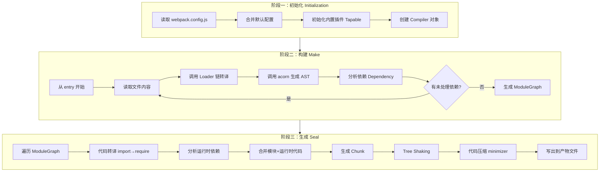
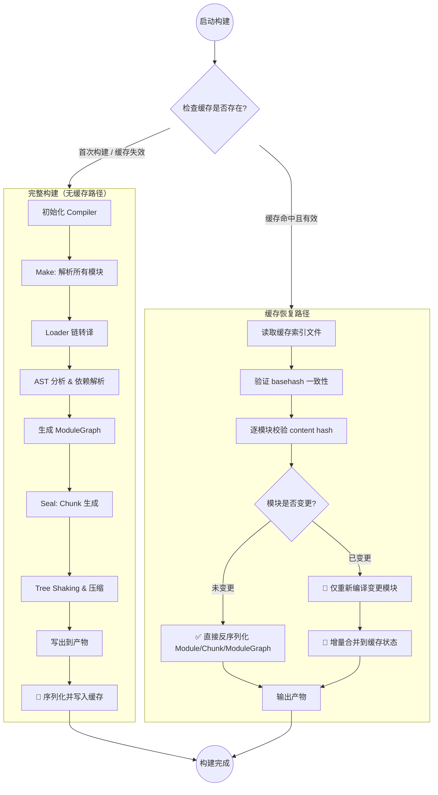
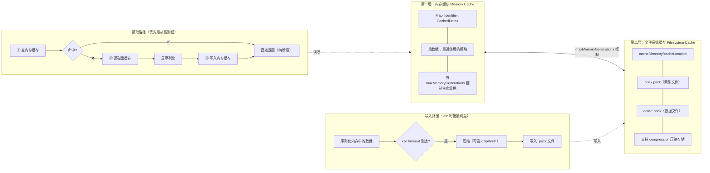
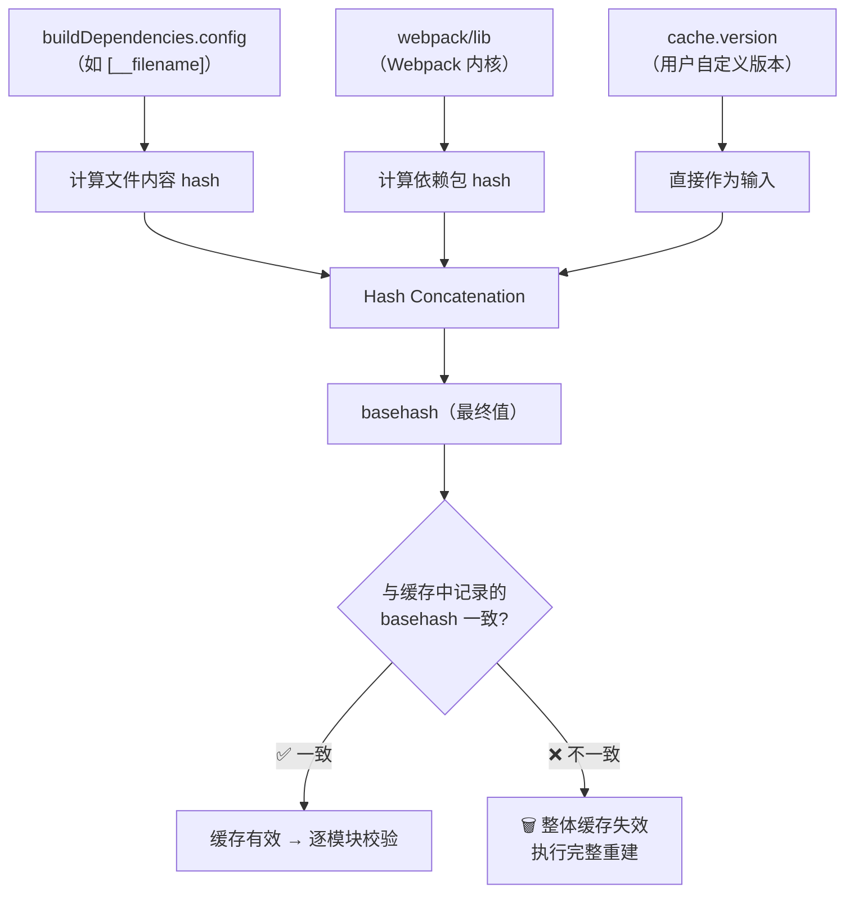
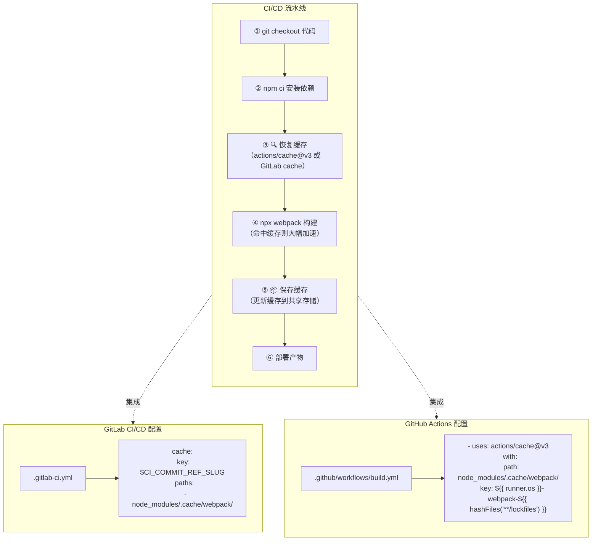
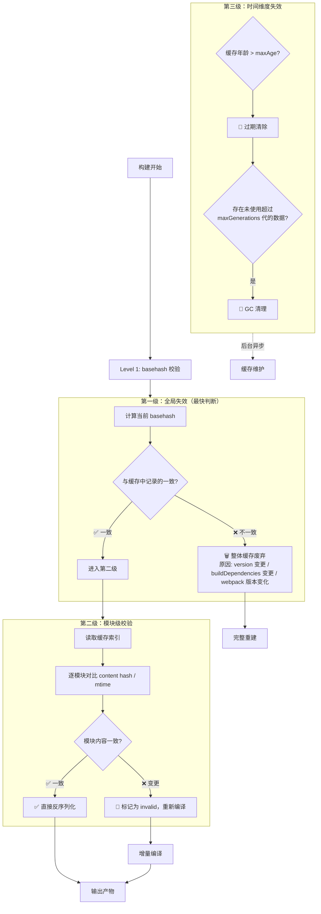

# 如何使用 Webpack 持久化缓存大幅提升构建性能？

<!--
  元信息
  ======
  章节编号: 第13章
  标题: 如何使用 Webpack 持久化缓存大幅提升构建性能？
  版本: v2 (深度升级版)
  基于原始版本: v1 (2024)
  升级基准: Webpack v5.107 (截至2026-05)
  升级日期: 2026-05-22
  核心变更:
    - 全面覆盖 cache.type: 'filesystem' 全部配置项（20+ 选项）
    - 新增缓存分层架构图、工作流程图、CI/CD 集成方案图（Mermaid）
    - 新增 basehash 计算原理深入解析
    - 新增 3 套完整配置模板（基础/进阶/CI 场景）
    - 新增 experiments.cacheUnaffected / memoryCacheUnaffected 特性
    - 新增 cache.compression (gzip/brotli) / cache.readonly (v5.85+) 详解
    - 新增 CI/CD 集成最佳实践（GitLab / GitHub Actions）
    - 新增失效策略完整链路分析
    - 新增性能调优指南与常见问题排查
-->


> **本章定位**：全本系列最关键的章节之一。`cache.type: 'filesystem'` 是 Webpack 5 最具颠覆性的性能特性，正确配置后可实现 **10 倍以上** 的二次构建加速（视项目规模而定）。

---

## 📋 版本差异对照表

| 维度 | v1 (原始版本) | v2 (本版本)
| ------|--------------|------------
| **Webpack 基准** | Webpack 5 早期版本 | **Webpack v5.107** |
| **配置项覆盖** | 6 个基础选项 | **20+ 完整选项**，含版本号标注 |
| **架构图示** | 截图引用 | **3 张 Mermaid 可交互图表** |
| **配置模板** | 无 | **3 套即用模板**（基础/进阶/CI） |
| **basehash 原理** | 未涉及 | **完整推导过程** |
| **CI/CD 集成** | 仅提及 cache-loader 自定义 | **GitLab + GitHub Actions 完整方案** |
| **cacheUnaffected** | 未涉及 | **experiments.cacheUnaffected 深入解析** |
| **compression** | 未涉及 | **gzip / brotli 压缩策略** |
| **readonly 模式** | 未涉及 | **v5.85+ 只读缓存模式** |
| **失效策略** | 简述 | **完整链路：version → buildDependencies → content hash** |
| **分层缓存** | 未涉及 | **memory ↔ filesystem 双层架构详解** |

---

## 一、缓存技术概览

缓存是一种应用极其广泛的性能优化技术，在计算机领域几乎无处不在：

| 层级 | 缓存类型 | 典型示例
| ------|---------|---------
| **硬件层** | CPU L1/L2/L3 Cache | 高速缓存行、TLB |
| **操作系统** | 页缓存、目录项缓存 | Linux Page Cache、dentry |
| **网络层** | DNS 缓存、HTTP 缓存 | CDN 边缘节点、浏览器缓存 |
| **应用层** | 数据库缓存、分布式缓存 | Redis、Memcached |
| **构建工具** | **Webpack 持久化缓存** | filesystem cache ← **本章核心** |

在 Webpack 构建流程中，缓存的核心思想是：**以空间换时间**——将耗时的编译结果持久化存储，后续构建时直接复用，跳过重复计算。

---

## 二、Webpack 5 持久化缓存：革命性特性

### 2.1 为什么说它是"革命性"的？

[持久化缓存](https://webpack.docschina.org/configuration/cache/) 算得上是 Webpack 5 **最令人振奋的特性之一**。它能够将首次构建的过程与结果数据持久化保存到本地文件系统，在下次执行构建时**跳过解析、链接、编译等一系列非常消耗性能的操作**，直接复用上次的 Module / ModuleGraph / Chunk 对象数据。

### 2.2 性能收益实测数据

以 Three.js 为例（362 份 JS 文件，约 3w 行代码，中大型项目量级）：

| 场景 | 未启用缓存 | 启用 filesystem cache | **加速比**
| ------|-----------|---------------------|-----------
| 首次构建（production） | ~11,000ms | ~11,000ms | 1x（基线） |
| **二次构建（production）** | ~11,000ms | **~500~800ms** | **~15~22x** |
| 二次构建（development） | ~18,000ms | **~500~800ms** | **~22~36x** |
| 配合 babel-loader 缓存 | ~10,600ms | ~1,740ms | ~6x（仅 loader 层） |

> 💡 **关键洞察**：数量级的性能提升，仅仅需要在配置中设置 `cache.type = 'filesystem'` 即可开启！
>
> ⚠️ 上述数据为作者环境下的量级参考，具体数值因机器性能、依赖规模、Webpack 版本不同会有明显差异，请以自身项目实测为准。

### 2.3 最简开启方式

```javascript
// webpack.config.js — 最简配置，一行即可获得巨大性能提升
module.exports = {
    // ...
    cache: {
        type: 'filesystem'   // ← 核心开关
    },
    // ...
};
```

---

## 三、持久化缓存工作原理深度解析

### 3.1 Webpack 构建过程回顾

要理解缓存为什么有效，首先需要回顾 Webpack 的完整构建流水线：



#### 各阶段的 CPU 密集型操作

| 阶段 | 耗时操作 | 典型场景
| ------|---------|---------
| **Make** | Loader 链执行 | babel-loader、ts-loader、eslint-loader 重复生成 AST |
| **Make** | AST 分析与遍历 | acorn 解析、dependency 分析 |
| **Seal** | 代码转换 | `import` → `__webpack_require__` |
| **Seal** | Tree Shaking | 模块副作用标记、unused 导出消除 |
| **Seal** | 代码压缩 | Terser / SWC minification |

假设项目中有 1000 个文件，每次 `npx webpack` 都需要从零执行 1000 次完整的构建-生成逻辑。**这就是缓存的用武之地。**

### 3.2 持久化缓存完整工作流程



### 3.3 缓存分层架构：Memory ↔ Filesystem 双层结构

这是 Webpack 5 缓存设计的**核心架构创新**——并非简单的"读磁盘/写磁盘"，而是一个智能的双层缓存系统：



#### 关键设计决策解读

| 设计点 | 说明 | 影响
| -------|------|------
| **内存优先读取** | 先查 memory，miss 再降级 disk | 热模块访问达纳秒级 |
| **异步批量写盘** | idleTimeout 后统一序列化写入 | 避免 I/O 阻塞主线程 |
| **双层协同** | maxMemoryGenerations 控制内存保留代数 | 平衡内存占用与 I/O 开销 |
| **pack 格式存储** | 所有缓存数据打包为少量大文件 | 减少文件描述符开销 |

### 3.4 basehash 计算：缓存有效性的基石

`basehash` 是整个缓存系统的**根哈希值**，决定了缓存是否需要整体失效。其计算公式为：

```bash
basehash = Hash(
    config 内容 hash      // 由 buildDependencies.config 决定
  + webpack/lib 内容 hash  // Webpack 核心代码 hash
  + cache.version 字符串   // 用户自定义版本标识
)
```



> ⚠️ **关键提醒**：`cache.buildDependencies.config: [__filename]` 是**必须配置**的选项！缺少它会导致配置文件修改后缓存不失效，产生难以排查的构建错误。

---

## 四、完整配置选项详解（v5.107）

以下按功能分组列出 `cache.type: 'filesystem'` 支持的全部配置项，标注引入版本：

### 4.1 核心身份配置

| 配置项 | 类型 | 默认值 | 引入版本 | 说明
| -------|------|--------|---------|------
| `type` | `'memory' \| 'filesystem'` | dev: `'memory'`, prod: 禁用 | 5.0.0 | **缓存类型**，设为 `'filesystem'` 开启持久化 |
| `name` | `string` | `${config.name}-${config.mode}` | 5.0.0 | 缓存名称，多配置共存时用于隔离 |
| `version` | `string` | `''` | 5.0.0 | **缓存版本号**，变更则全部失效 |
| `hashAlgorithm` | `string` | `'md4'` | 5.0.0 | 哈希算法，支持 Node.js crypto 所有算法 |

### 4.2 存储路径配置

| 配置项 | 类型 | 默认值 | 引入版本 | 说明
| -------|------|--------|---------|------
| `cacheDirectory` | `string` | `node_modules/.cache/webpack` | 5.0.0 | 缓存根目录 |
| `cacheLocation` | `string` | `path.join(cacheDirectory, name)` | 5.0.0 | 缓存精确路径（覆盖 cacheDirectory + name） |

> 💡 最终缓存目标 = `cacheDirectory` + `name` 组合路径，或直接使用 `cacheLocation` 覆盖。

### 4.3 失效控制配置（最重要！）

| 配置项 | 类型 | 默认值 | 引入版本 | 说明
| -------|------|--------|---------|------
| `buildDependencies.config` | `string[]` | `['webpack/lib']` | 5.0.0 | **必须配置！** 配置文件路径列表，变更触发全量失效 |
| `buildDependencies.*` | `string[]` | - | 5.0.0 | 其他自定义构建依赖 |
| `version` | `string` | `''` | 5.0.0 | 手动版本号，变更即失效 |

### 4.4 生命周期管理

| 配置项 | 类型 | 默认值 | 引入版本 | 说明
| -------|------|--------|---------|------
| `maxAge` | `number` | `5184000000`（≈60天） | 5.30.0 | 缓存最大存活时间（毫秒） |
| `maxGenerations` | `number` | - | 5.30.0 | 内存缓存未使用项的生命周期（仅 type:'memory'） |
| `maxMemoryGenerations` | `number` | dev:`10`, prod:`∞` | 5.30.0 | **内存缓存保留代数**，0=不额外缓存内存 |
| `idleTimeout` | `number` | `60000`（60s） | 5.0.0 | 编译器空闲后触发缓存写入的时间间隔 |
| `idleTimeoutAfterLargeChanges` | `number` | `1000`（1s） | 5.41.0 | 大变更后的快速写入间隔 |
| `idleTimeoutForInitialStore` | `number` | `5000`（5s） | 5.0.0 | 首次缓存写入延迟 |

### 4.5 存储策略配置

| 配置项 | 类型 | 默认值 | 引入版本 | 说明
| -------|------|--------|---------|------
| `store` | `'pack'` | `'pack'` | 5.0.0 | 存储模式，当前仅支持 pack（打包为单个文件） |
| `compression` | `false \| 'gzip' \| 'brotli'` | dev:`false`, prod:`'gzip'` | 5.42.0 | **缓存文件压缩格式** |
| `profile` | `boolean` | `false` | 5.0.0 | 是否记录缓存操作的详细耗时日志 |

### 4.6 高级实验性特性

| 配置项 | 类型 | 默认值 | 引入版本 | 说明
| -------|------|--------|---------|------
| `allowCollectingMemory` | `boolean` | prod:`false`, dev:`true` | 5.35.0 | 反序列化时回收未使用内存（有性能成本） |
| `cacheUnaffected` | `boolean` | `false` | 5.54.0 | 缓存未变更模块的计算结果（需 type:'memory'） |
| `memoryCacheUnaffected` | `boolean` | `false` | 5.54.0 | 同上但针对 filesystem 类型（需配合 experiments） |
| `readonly` | `boolean` | `false` | 5.85+ | **只读模式**：只读取缓存，不写入新缓存 |

> 🔬 **关于 cacheUnaffected 系列**：需同时设置 `experiments.cacheUnaffected: true`，该特性会额外缓存那些**自身未改变且依赖也未改变**的模块的计算结果，进一步减少重复运算。

---

## 五、三套完整配置模板

### 5.1 模板一：基础生产就绪模板

**适用场景**：大多数中大型项目，开箱即用，兼顾开发体验与构建可靠性。

```javascript
// webpack.config.js — 基础生产就绪版
const path = require('path');

module.exports = {
    mode: 'production',

    cache: {
        type: 'filesystem',

        // === 身份配置 ===
        name: 'AppProductionCache',
        version: '1.0.0',              // 配置重大变更时递增此值

        // === 存储路径 ===
        cacheDirectory: path.resolve(__dirname, 'node_modules/.cache/webpack'),

        // === 失效控制（必须！）===
        buildDependencies: {
            config: [__filename],       // ← 关键！配置文件变更时缓存自动失效
        },

        // === 性能调优 ===
        compression: 'gzip',           // 生产环境启用 gzip 压缩缓存文件
        maxAge: 5184000000,            // 缓存有效期 60 天
        maxMemoryGenerations: Infinity, // 生产环境无限期保留内存缓存

        // === 调试 ===
        profile: false,                 // 设为 true 可查看详细缓存日志
    },

    // ... 其他配置
};
```

**关键决策说明**：
- `compression: 'gzip'`：减少磁盘占用约 60%~80%，I/O 读写更快
- `maxMemoryGenerations: Infinity`：生产构建通常只跑一次后退出，保留内存无副作用
- `profile: false`：日常关闭，排查问题时临时开启

### 5.2 模板二：进阶高性能模板

**适用场景**：大型 monorepo、微前端项目，需要精细控制缓存行为。

```javascript
// webpack.config.js — 进阶高性能版
const path = require('path');

module.exports = {
    mode: process.env.NODE_ENV || 'development',

    cache: {
        type: 'filesystem',

        // === 多环境隔离 ===
        name: `AppCache-${process.env.NODE_ENV}`,
        version: '2.0.0',

        // === 自定义存储路径 ===
        cacheLocation: path.resolve(__dirname, `.webpack-cache/${process.env.NODE_ENV}`),

        // === 精细失效控制 ===
        buildDependencies: {
            config: [
                __filename,                                    // 主配置
                path.join(__dirname, 'webpack.base.config.js'), // 继承的基础配置
                path.join(__dirname, '.babelrc.json'),         // Babel 配置
                path.join(__dirname, '.eslintrc.js'),          // ESLint 配置
                path.join(__dirname, 'tsconfig.json'),         // TypeScript 配置
            ],
            // 自定义构建依赖（如共享配置包）
            // sharedConfig: [path.join(__dirname, 'packages/shared-config')],
        },

        // === 高级存储策略 ===
        compression: process.env.NODE_ENV === 'production' ? 'brotli' : false,
        // brotli 比 gzip 压缩率更高，但压缩/解压稍慢

        maxAge: 60 * 24 * 60 * 60 * 1000,     // 60 天
        maxMemoryGenerations: process.env.NODE_ENV === 'development' ? 10 : Infinity,
        // 开发环境限制内存代数，避免 OOM；生产环境不限

        // === 写入时机精细控制 ===
        idleTimeout: 10000,                      // 10s 空闲后写盘（开发环境更快反馈）
        idleTimeoutAfterLargeChanges: 500,       // 大变更后 500ms 快速写盘
        idleTimeoutForInitialStore: 2000,        // 首次写入延迟缩短至 2s

        // === 实验性特性 ===
        allowCollectingMemory: true,             // 开发环境允许 GC 回收
        profile: process.env.CACHE_PROFILE === 'true',
    },

    // 实验性特性开关
    experiments: {
        cacheUnaffected: true,                   // 启用未变更模块缓存
    },
};

// 开发环境额外启用 memoryCacheUnaffected
if (process.env.NODE_ENV === 'development') {
    module.exports.cache.memoryCacheUnaffected = true;
}
```

**进阶要点解析**：

| 配置选择 | 理由
| ---------|------
| `compression: 'brotli'` (prod) | 压缩率比 gzip 高 15%~25%，适合 CI 环境 |
| 多文件 buildDependencies | 任何配置变更都会触发缓存重建，避免不一致 |
| `idleTimeout: 10000` (dev) | 开发环境下更快地将缓存落盘，减少内存压力 |
| `experiments.cacheUnaffected` | 大型项目中效果显著，可再提升 10%~30% 增量构建速度 |

### 5.3 模板三：CI/CD 专用模板

**适用场景**：GitLab CI / GitHub Actions 等 CI/CD 流水线，跨构建共享缓存。

```javascript
// webpack.config.ci.js — CI/CD 专用版
const path = require('path');
const isCI = !!process.env.CI;

module.exports = {
    mode: 'production',

    cache: {
        type: 'filesystem',

        // === CI 友好的固定路径 ===
        // 注意：CI 环境必须保证工作目录绝对路径一致！
        cacheDirectory: isCI
            ? '/workspace/node_modules/.cache/webpack'
            : path.resolve(__dirname, 'node_modules/.cache/webpack'),
        name: 'CIBuildCache',
        version: '1.0.0-ci',

        // === CI 失效控制 ===
        buildDependencies: {
            config: [__filename],
        },

        // === CI 优化参数 ===
        compression: 'brotli',               // 最大压缩率，节省 CI 缓存存储
        maxAge: Infinity,                     // CI 环境不过期，由 CI 工具管理清理
        maxMemoryGenerations: 0,              // CI 通常单次运行，不需要内存缓存
        // maxMemoryGenerations: 0 的含义：
        // 数据仅在内存中暂存直到序列化到磁盘，之后再次读取需从磁盘反序列化
        // 这最小化了内存使用，适合资源受限的 CI 环境

        // === CI 写入优化 ===
        idleTimeout: 0,                       // 构建完成后立即写盘，不等空闲
        idleTimeoutAfterLargeChanges: 0,
        idleTimeoutForInitialStore: 0,

        // === CI 只读模式（可选）===
        // readonly: isCI && process.env.CACHE_READONLY === 'true',
        // 当设置为只读时，webpack 只读取缓存但不写入新的缓存条目
        // 适用于：缓存预热阶段、或只希望利用缓存加速但不更新的场景

        profile: isCI,                        // CI 环境始终开启日志便于排查
    },
};
```

#### CI/CD 缓存集成方案



#### GitLab CI/CD 完整配置示例

```yaml
variables:
  # 兜底：当当前分支没有缓存时，使用 main 分支的缓存
  CACHE_FALLBACK_KEY: "main"

stages:
  - build
  - deploy

build-job:
  stage: build
  image: node:20-alpine
  cache:
    key: "$CI_COMMIT_REF_SLUG"        # 以分支名作为缓存键
    paths:
      - node_modules/.cache/webpack/  # ← Webpack 缓存目录
    policy: pull-push                  # 拉取 + 推送缓存
  script:
    - npm ci                            # 注意：npm ci 会清空 node_modules，必须放在「恢复缓存」之前执行
    - npx webpack --config webpack.config.ci.js
  artifacts:
    paths:
      - dist/
```

#### GitHub Actions 完整配置示例

```yaml
name: Build

on:
  push:
    branches: [main, develop]
  pull_request:
    branches: [main]

jobs:
  build:
    runs-on: ubuntu-latest

    steps:
      - uses: actions/checkout@v4

      - name: Setup Node.js
        uses: actions/setup-node@v4
        with:
          node-version: '20'
          cache: 'npm'

      - name: Install Dependencies
        run: npm ci

      # 注意：必须在 npm ci 之后恢复 Webpack 缓存！
      # npm ci 会清空 node_modules（含 node_modules/.cache），
      # 若先恢复缓存再执行 npm ci，缓存会被整体删除
      - name: Restore Webpack Cache
        uses: actions/cache@v3
        with:
          # Webpack 文件系统缓存路径
          path: node_modules/.cache/webpack/
          # 使用 lockfile hash 作为缓存键的一部分
          key: ${{ runner.os }}-webpack-${{ hashFiles('**/package-lock.json') }}
          # 兜底：未精确匹配时尝试恢复同 OS 的缓存
          restore-keys: |
            ${{ runner.os }}-webpack-

      - name: Build
        run: npx webpack --config webpack.config.ci.js

      - name: Upload Build Artifacts
        uses: actions/upload-artifact@v4
        with:
          name: dist
          path: dist/
```

> ⚠️ **CI 缓存的两个铁律**：
> 1. **绝对路径一致性**：每次运行的 `/workspace` 路径必须相同，因为 Webpack 缓存内嵌了绝对路径
> 2. **不要在缓存步骤之后运行 `npm ci`**：`npm ci` 会清空 `node_modules`，如果缓存路径在其中可能受影响（虽然 `.cache` 目录通常安全）

---

## 六、缓存失效策略完整链路

理解缓存何时失效是正确使用的前提。以下是三级失效机制：



### 6.1 触发全量缓存失效的场景

| 场景 | 触发条件 | 解决方案
| ------|---------|---------
| 配置文件修改 | `buildDependencies.config` 中列出的文件内容变化 | 自动检测，无需干预 |
| Webpack 版本升级 | `webpack/lib` 内部文件变化 | 自动检测 |
| 手动版本切换 | `cache.version` 值变更 | 主动更新 |
| Node.js 版本变更 | 可能导致 native addon 行为差异 | 更新 version 或清理缓存 |
| 操作系统切换 | 文件系统行为可能不同（大小写敏感等） | 清理 `.cache` 目录 |

### 6.2 增量缓存失效（模块级）

只有内容实际发生变化的模块才会被重新编译，其余模块直接从缓存恢复。这得益于 Webpack 5 的 **Persistent Module ID** 和 **Deterministic Chunk Hash** 设计：

- **Module ID 基于 content hash**：同一内容的模块永远获得相同 ID
- **Chunk Hash 基于所有包含模块的 hash**：未变模块不会影响最终产物的 hash

---

## 七、cache.type: 'memory' vs 'filesystem' 对比

| 维度 | `'memory'` | `'filesystem'`
| ------|-----------|---------------
| **存储位置** | 进程内存（堆内存） | 本地文件系统（`.pack` 文件） |
| **持久性** | ❌ 进程退出即丢失 | ✅ 跨进程、跨构建保持 |
| **配置复杂度** | 极简（无可配项） | 丰富（20+ 选项） |
| **适用场景** | watch 模式、短期开发 | 正式构建、CI/CD、长期开发 |
| **内存占用** | 较高（所有数据常驻内存） | 可控（maxMemoryGenerations 调节） |
| **首次构建** | 无特殊行为 | 与无缓存相同 |
| **二次构建** | 仅 watch 模式下有效 | **任何场景下都有效** |
| **多进程共享** | 不支持 | 支持（通过文件系统） |
| **推荐程度** | watch 模式可用 | **生产环境强烈推荐** |

> 💡 **最佳实践**：开发环境使用 `type: 'filesystem'` + 合理的 `maxMemoryGenerations`；watch 模式下两者差异不大，但 filesystem 仍然更优。

---

## 八、Webpack 4 兼容方案（历史参考）

> ⚠️ **注意**：以下方案仅供仍在使用 Webpack 4 的项目参考。**强烈建议升级到 Webpack 5** 以获得原生、稳定、高性能的持久化缓存能力。

### 8.1 方案一：cache-loader

`cache-loader` 能够将 Loader 处理结果保存到硬盘，下次运行时若文件内容没有发生变化则直接返回缓存结果。

**安装**：
```bash
yarn add -D cache-loader
```

**配置**：
```javascript
module.exports = {
    module: {
        rules: [{
            test: /\.js$/,
            use: ['cache-loader', 'babel-loader', 'eslint-loader']
            //     ^^^^^^^^^^^^ 必须放在 loader 数组首位
        }]
    },
};
```

**性能表现**（Three.js 测试）：
| 模式 | 无缓存 | 有 cache-loader | 提升
| ------|-------|-----------------|------
| production | 10,602ms | 1,540ms | **~6x** |
| development | 11,130ms | 4,247ms | **~2.6x** |

**高级用法：自定义存储后端**

```javascript
const redis = require("redis");
const client = redis.createClient();

async function read(key, callback) {
    const result = await client.get(key);
    callback(null, result ? JSON.parse(result) : undefined);
}

async function write(key, data, callback) {
    await client.set(key, JSON.stringify(data));
    callback();
}

module.exports = {
    module: {
        rules: [{
            test: /\.js$/,
            use: [
                { loader: "cache-loader", options: { read, write } },
                "babel-loader",
            ],
        }],
    },
};
```
> 借助自定义 read/write，可以实现**跨机器缓存共享**（如 Redis），打通本地与 CI 环境。

### 8.2 方案二：hard-source-webpack-plugin

[hard-source-webpack-plugin](https://github.com/mzgoddard/hard-source-webpack-plugin) 缓存范围更广，包括：模块、模块关系、Resolve 结果、Chunks、Assets 等，效果接近 Webpack 5 原生缓存。

**安装**：
```bash
yarn add -D hard-source-webpack-plugin
```

**配置**：
```javascript
const HardSourceWebpackPlugin = require("hard-source-webpack-plugin");

module.exports = {
    plugins: [new HardSourceWebpackPlugin()],
};
```

**性能表现**（Three.js 测试）：
| 模式 | 无缓存 | 有 hard-source | 提升
| ------|-------|----------------|------
| production | 10,602ms | 1,740ms | **~6x** |
| development | 11,130ms | 3,280ms | **~3.4x** |

> ⚠️ **已知问题**：hard-source-webpack-plugin 在某些场景下可能导致构建产物不稳定或与其它插件冲突，已不再积极维护。**请优先考虑升级 Webpack 5**。

### 8.3 方案三：组件自带缓存

各 Loader/Plugin 自身的缓存能力：

| 组件 | 配置项 | 默认缓存路径 | 性能提升
| ------|--------|-------------|---------
| `babel-loader` | `cacheDirectory: true` | `node_modules/.cache/babel-loader` | 30%~50% |
| `eslint-webpack-plugin` | `cache: true` | `.eslintcache` | 70%~80% |
| `stylelint-webpack-plugin` | `cache: true` | `.stylelintcache` | 类似 ESLint |

**babel-loader 示例**：
```javascript
module.exports = {
    module: {
        rules: [{
            test: /\.m?js$/,
            loader: 'babel-loader',
            options: { cacheDirectory: true },
        }]
    },
};
```

**ESLint Plugin 示例**：
```javascript
const ESLintPlugin = require('eslint-webpack-plugin');
const StylelintPlugin = require('stylelint-webpack-plugin');

module.exports = {
    plugins: [
        new ESLintPlugin({ cache: true }),
        new StylelintPlugin({ files: '**/*.css', cache: true }),
    ],
};
```

> 💡 **与 Webpack 5 filesystem cache 的关系**：即使启用了 `cache.type: 'filesystem'`，这些组件级缓存仍然有意义——它们缓存的是** Loader/Plugin 内部的中间结果**，与 Webpack 缓存的**模块对象**处于不同层级，可以叠加生效。

---

## 九、性能调优指南

### 9.1 不同项目规模的推荐配置

| 项目规模 | 文件数 | 推荐 maxMemoryGenerations | 推荐 compression | 备注
| ---------|--------|--------------------------|------------------|------
| 小型 | < 100 | `Infinity` | `false` | 内存充足，无需压缩 |
| 中型 | 100 ~ 1000 | `10` | `false`(dev) / `'gzip'`(prod) | 平衡内存与 I/O |
| 大型 | 1000 ~ 5000 | `5` | `'gzip'` | 限制内存占用 |
| 超大型 / monorepo | > 5000 | `1` ~ `3` | `'brotli'` | 积极控制内存 |
| CI/CD 环境 | 任意 | `0` | `'brotli'` | 最小化内存，最大化压缩 |

### 9.2 常见问题排查清单

| 现象 | 可能原因 | 排查方法 | 解决方案
| ------|---------|---------|---------
| 缓存似乎不生效 | 忘记设置 `type: 'filesystem'` | 检查配置 | 添加 `cache: { type: 'filesystem' }` |
| 修改配置后构建出错 | `buildDependencies.config` 未包含 `__filename` | 设置 `profile: true` 查看日志 | 添加 `config: [__filename]` |
| 磁盘占用过大 | `maxAge` 过长或未设置清理 | 检查 `.cache/webpack` 目录大小 | 降低 `maxAge` 或手动删除 |
| 内存占用过高 | `maxMemoryGenerations` 过大 | 监控 Node.js 进程内存 | 降低该值 |
| CI 缓存不命中 | 工作目录绝对路径不同 | 对比两次 CI 的 `$PWD` | 统一路径或使用 Docker 固定路径 |
| 增量构建仍很慢 | `cacheUnaffected` 未启用（大量未变模块被重算） | 开启 `profile` 查看 | 设置 `experiments.cacheUnaffected: true` |
| 切换分支后构建异常 | 分支间代码差异导致缓存污染 | 删除 `.cache` 目录 | 在 `.gitignore` 中忽略缓存目录 |

### 9.3 缓存调试技巧

```javascript
// 开启详细日志模式
cache: {
    type: 'filesystem',
    profile: true,  // ← 开启后会输出每个缓存操作的耗时
}

// 日志输出示例（开启 profile 后）：
// [webpack.cache] restoring 1423 objects from pack took 45ms
// [webpack.cache] storing 1423 objects to pack took 120ms
// [webpack.cache] cache root: /project/node_modules/.cache/webpack/AppProductionCache
// [webpack.cache] basehash: a1b2c3d4e5f6...
```

---

## 十、总结与最佳实践

### 10.1 核心要点回顾

1. **`cache.type: 'filesystem'` 是 Webpack 5 最重要性能特性之一**，一行配置可获得 10~50 倍加速
2. **`buildDependencies.config: [__filename]` 必须配置**，否则配置变更后缓存不会失效
3. **采用分层缓存架构**：内存缓存（热数据）+ 文件系统缓存（持久数据），通过 `maxMemoryGenerations` 平衡
4. **三级失效机制**：basehash（全局）→ content hash（模块级）→ maxAge（时间级）
5. **CI/CD 环境需特别注意绝对路径一致性**，配合 `actions/cache@v3` 或 GitLab cache 使用

### 10.2 推荐配置速查

```javascript
// 🏆 生产环境推荐配置（复制即用）
const path = require('path');

module.exports = ({
    cache: {
        type: 'filesystem',
        buildDependencies: { config: [__filename] },  // 必须！
        compression: 'gzip',                           // 推荐
        maxMemoryGenerations: Infinity,                // 生产环境
    }
});
```

### 10.3 技术选型一览

| 需求 | 推荐方案
| ------|---------
| Webpack 5 项目 | **原生 `cache.type: 'filesystem'`**（首选） |
| Webpack 4 + 简单需求 | `cache-loader` |
| Webpack 4 + 追求极致 | `hard-source-webpack-plugin`（注意维护状态） |
| Loader 级别优化 | babel-loader `cacheDirectory` / ESLint `cache: true` |
| CI/CD 跨构建共享 | filesystem cache + GitLab/GitHub Actions 缓存集成 |
| 超大规模 monorepo | filesystem cache + `cacheUnaffected` + `brotli` 压缩 |

---

## 思考题

1. **除"缓存"外，计算机领域中还有哪些常见、可被复用的性能优化方案？与缓存相比，它们都有怎么样的特色和优缺点？**
2. **为什么 Webpack 5 选择 `md4` 作为默认哈希算法而非更安全的 `sha256`？在缓存场景下，哈希碰撞的概率和影响是什么？**
3. **在设计一个跨机器的分布式缓存系统时（如基于 Redis 的 cache-loader 自定义存储），需要考虑哪些一致性和并发安全问题？**
4. **`cache.readonly`（v5.85+）模式的典型使用场景是什么？在什么情况下你希望只读取缓存而不写入新缓存？**
5. **对比 Webpack 5 的 filesystem cache 与 Vite 的依赖预构建缓存（esbuild），两者在设计哲学上有什么异同？**

---

> **延伸阅读**：
> - [Webpack 官方 Cache 文档](https://webpack.docschina.org/configuration/cache/)
> - [Webpack 5 Release Notes — Persistent Caching](https://webpack.js.org/blog/2020-10-10-webpack-5-release/#persistent-caching)
> - [experiments.cacheUnaffected 设计讨论](https://github.com/webpack/webpack/issues/13396)
