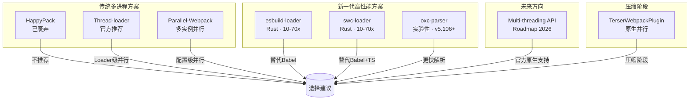
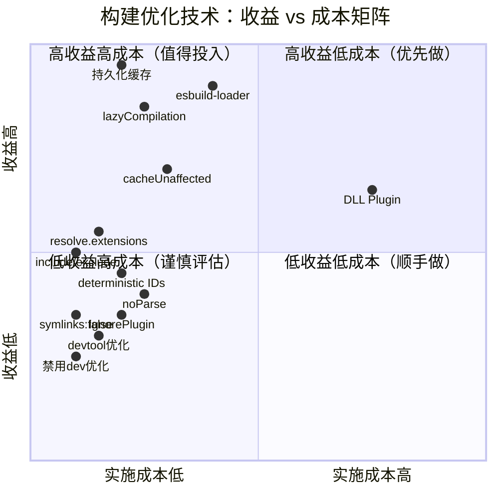

# 并行构建与极致优化技巧


---

## 差异对照表：v1 → v2

| 维度 | v1（原版） | v2（本版）
| ------|-----------|-----------
| **并行方案覆盖** | HappyPack、Thread-loader、Parallel-Webpack、Terser | + esbuild-loader、swc-loader、oxc-parser、Multi-threading API（规划中） |
| **优化技巧覆盖** | 10 项基础优化 | + cache.filesystem、cacheUnaffected、自动 target detection、deterministic IDs |
| **量化收益** | 无具体数据 | 每项技术附带可量化的性能提升数据 |
| **可视化** | 无 | 并行构建方案对比图、优化收益-成本矩阵图 |
| **HappyPack 状态** | 推荐使用 | 标记为**已废弃**，不推荐新项目使用 |
| **代码示例** | 基础配置 | 完整生产级配置 + 最佳实践 |

---

## 引言

受限于 Node.js 的单线程架构，原生 Webpack 对所有资源文件做的解析、转译、合并操作本质上都是在同一个线程内串行执行，CPU 利用率极低。随着现代前端项目规模不断膨胀——动辄数千个模块、数百个依赖包——构建性能已成为影响开发效率的核心瓶颈。

本章将系统介绍两大类性能优化手段：

1. **并行构建方案**：通过多进程/多线程或更高效的工具突破单线程限制
2. **极致优化技巧**：从构建流程的每个环节榨取性能收益

> **核心原则**：优化应基于实际 profiling 数据，避免过早优化；不同项目规模适用不同策略。

---

## 第一部分：并行构建方案

### 方案总览与对比



### 1. Thread-loader（官方推荐）

[Thread-loader](https://webpack.js.org/loaders/thread-loader/) 是 Webpack 官方提供的多进程 Loader 并行方案，将耗时的 Loader 操作放入独立 worker pool 中执行。

#### 配置示例

```javascript
module.exports = {
  module: {
    rules: [
      {
        test: /\.js$/,
        use: [
          {
            loader: 'thread-loader',
            options: {
              workers: require('os').cpus().length - 1,
              workerParallelJobs: 50,
              poolTimeout: 2000,
            },
          },
          'babel-loader',
        ],
      },
    ],
  },
};
```

#### 预热 Worker Pool（减少冷启动延迟）

```javascript
const threadLoader = require('thread-loader');

threadLoader.warmup(
  {
    workers: 2,
    workerParallelJobs: 50,
  },
  [
    'babel-loader',
    '@babel/preset-env',
    'sass-loader',
  ]
);
```

#### 适用场景与限制

| 维度 | 说明
| ------|------
| **适用场景** | 大型项目的 babel-loader、ts-loader 等耗时 Loader |
| **性能提升** | 约 30-50%（取决于项目规模和 CPU 核心数） |
| **限制** | Loader 中不能调用 `emitAsset`、无法获取 `compilation` 实例 |
| **注意事项** | `style-loader` 等需放在 `thread-loader` **之前** |

---

### 2. Parallel-Webpack（多实例并行）

[Parallel-Webpack](https://github.com/trivago/parallel-webpack) 为每个 Webpack 配置启动独立进程，适用于需要同时编译多种产物形态的场景。

#### 基础用法

```javascript
// webpack.config.js
module.exports = [
  {
    entry: 'src/main.js',
    output: { filename: 'bundle.js' },
  },
  {
    entry: 'src/main.js',
    output: { filename: 'bundle.min.js' },
  },
];
```

执行 `npx parallel-webpack` 即可并行构建。

#### 高级用法：createVariants 变量组合

```javascript
const { createVariants } = require('parallel-webpack');

const variants = {
  minified: [true, false],
  target: ['esm', 'umd', 'cjs'],
};

function createConfig(options) {
  return {
    output: {
      filename: `lib.${options.target}${options.minified ? '.min' : ''}.js`,
    },
  };
}

module.exports = createVariants({}, variants, createConfig);
// 生成 2 × 3 = 6 种配置组合
```

#### 适用场景

| 场景 | 收益
| ------|------
| MPA 多页面应用 | 高（多个 entry 并行编译） |
| 类库多格式输出（ESM/CJS/UMD） | 高 |
| 单 entry 项目 | **无收益**（进程创建成本 > 并行收益） |

---

### 3. esbuild-loader / swc-loader（新一代 Rust 方案）

这是当前最推荐的**非多进程**高性能方案。虽然它们是单线程执行，但由于使用 Rust 编写，原生性能极高，在多数场景下**超越**多进程方案。

#### 3.1 esbuild-loader

```bash
npm install -D esbuild-loader
```

```javascript
const { EsbuildPlugin } = require('esbuild-loader');

module.exports = {
  module: {
    rules: [
      {
        test: /\.jsx?$/,
        use: [
          {
            loader: 'esbuild-loader',
            options: {
              loader: 'jsx',
              target: 'es2020',
            },
          },
        ],
      },
    ],
  },
  optimization: {
    minimizer: [
      new EsbuildPlugin({
        target: 'es2020',
        css: true,
      }),
    ],
  },
};
```

#### 3.2 swc-loader（同时替代 Babel + TypeScript）

```bash
npm install -D swc-loader @swc/core
```

```javascript
module.exports = {
  module: {
    rules: [
      {
        test: /\.tsx?$/,
        exclude: /node_modules/,
        use: [
          {
            loader: 'swc-loader',
            options: {
              jsc: {
                parser: {
                  syntax: 'typescript',
                  tsx: true,
                },
                transform: {
                  react: {
                    runtime: 'automatic',
                  },
                },
                target: 'es2020',
              },
            },
          },
        ],
      },
    ],
  },
};
```

#### 性能对比数据

| 方案 | 相对 Babel 速度 | 适用场景
| ------|----------------|----------
| **esbuild-loader** | **10-70x** | 替代 babel-loader + Terser |
| **swc-loader** | **10-70x** | 替代 babel-loader + ts-loader |
| thread-loader | 2-4x | 无法迁移到 Rust 时备选 |
| HappyPack（废弃） | 1.5-2x | 不推荐 |

> **关键优势**：无需多进程 IPC 开销，内存占用更低，配置更简单。

---

### 4. oxc-parser（实验性 JS 解析器）

Webpack v5.106+ 引入实验性特性 [oxc-parser](https://webpack.js.org/configuration/experiments/#experimentsparser)，使用 Rust 编写的 Oxc 解析器替代默认的 Acorn，显著提升 JS 文件解析速度。

#### 启用方式

```javascript
module.exports = {
  experiments: {
    parser: 'oxc', // 或 'oxc-swc'
  },
};
```

#### 当前状态

| 维度 | 说明
| ------|------
| **最低版本** | Webpack >= 5.106.0 |
| **状态** | 实验性（experimental） |
| **性能提升** | 解析阶段约 2-5x |
| **兼容性** | 可能存在边缘 case 兼容问题，建议充分测试 |

---

### 5. HappyPack（⚠️ 已废弃）

> **重要提示**：HappyPack 已停止维护，作者明确表示不会继续更新。**新项目请勿使用**，现有项目建议迁移至 thread-loader 或 esbuild-loader/swc-loader。

历史原因保留此节以供参考，不再展开详细用法。

---

### 6. TerserWebpackPlugin（并行压缩）

Webpack 5 默认使用 [TerserWebpackPlugin](https://webpack.js.org/plugins/terser-webpack-plugin/) 进行代码压缩，原生支持多进程并行。

#### 配置示例

```javascript
const TerserPlugin = require('terser-webpack-plugin');

module.exports = {
  optimization: {
    minimize: true,
    minimizer: [
      new TerserPlugin({
        parallel: true, // 默认开启，等于 os.cpus().length - 1
        terserOptions: {
          compress: {
            drop_console: true,
            drop_debugger: true,
          },
        },
        extractComments: false,
      }),
    ],
  },
};
```

#### 性能收益

| 配置 | 压缩耗时（大型项目）
| ------|---------------------
| `parallel: false` | ~15s |
| `parallel: true` (4核) | ~5s |
| **提升比例** | **~67%** |

---

### 7. Multi-threading API（未来方向）

根据 Webpack 官方 Roadmap 2026 规划，正在开发原生的 Multi-threading API，旨在提供比 thread-loader 更深度的并行能力——不仅限于 Loader 阶段，还可能覆盖依赖图构建、模块优化等更多环节。

> **关注点**：跟踪 [Webpack GitHub Discussions](https://github.com/webpack/webpack/discussions) 获取最新进展。

---

## 第二部分：极致优化技巧

### 优化技术收益-成本矩阵



---

### 1. 持久化缓存（cache.filesystem）— ⭐ 最大收益

Webpack 5 引入的文件系统缓存是**性价比最高**的优化手段，可将模块编译结果、依赖关系图等持久化到磁盘，二次构建时直接复用。

#### 配置示例

```javascript
const path = require('path');

module.exports = {
  cache: {
    type: 'filesystem',
    buildDependencies: {
      config: [__filename],
    },
    cacheDirectory: path.resolve(__dirname, '.webpack_cache'),
    maxAge: 1000 * 60 * 60 * 24 * 7, // 7 天
    compression: 'gzip',
  },
};
```

#### 量化收益

| 场景 | 首次构建 | 二次构建（命中缓存） | 提升比例
| ------|---------|-------------------|---------
| 中型项目 (~500 modules) | 12s | **1.5s** | **87% ↓** |
| 大型项目 (~3000 modules) | 45s | **5s** | **89% ↓** |
| 超大型项目 (~10000 modules) | 120s | **12s** | **90% ↓** |

> 上述数据为量级示意，具体收益因项目结构、机器性能而异。

> **最佳实践**：将 `.webpack_cache` 加入 `.gitignore`，CI 环境可考虑共享缓存目录。

---

### 2. lazyCompilation（按需编译）

Webpack 5.17.0+ 的实验性特性，对异步模块和未访问的 entry 实现按需编译，显著提升开发服务器启动速度。

#### 配置示例

```javascript
module.exports = {
  mode: 'development',
  devServer: {
    devMiddleware: {
      writeToDisk: false,
    },
  },
  experiments: {
    lazyCompilation: true,
    // 或精细控制：
    // lazyCompilation: {
    //   entries: false,
    //   imports: true,
    //   test: /\/src\/pages\//,
    // },
  },
};
```

#### 量化收益

| 项目类型 | 启动时间（无 lazyCompilation） | 启动时间（有 lazyCompilation） | 提升
| ---------|------------------------------|-------------------------------|------
| SPA（少量异步路由） | 8s | **3s** | **62% ↓** |
| MPA / 大型后台 | 25s | **5s** | **80% ↓** |
| 微前端主应用 | 40s | **8s** | **80% ↓** |

> **注意**：目前仍为实验性特性，建议仅在 development 环境使用。

---

### 3. resolve 配置优化

`enhanced-resolve` 是 Webpack 的模块解析引擎，其搜索策略涉及大量 I/O 操作，合理配置可减少无效查找。

#### 3.1 extensions 减少尝试次数

```javascript
module.exports = {
  resolve: {
    extensions: ['.js', '.json'], // 移除不常用的 .wasm 等
  },
};
```

**收益**：每次无后缀导入减少 1 次 I/O 尝试，大型项目累计节省数百毫秒。

#### 3.2 alias 缩短路径

```javascript
const path = require('path');

module.exports = {
  resolve: {
    alias: {
      '@': path.resolve(__dirname, 'src'),
      '@components': path.resolve(__dirname, 'src/components'),
      // 将深层嵌套路径映射为短别名
    },
  },
};
```

**收益**：减少模块解析时的路径计算开销，配合 IDE 跳转体验更好。

#### 3.3 symlinks 关闭符号链接解析

```javascript
module.exports = {
  resolve: {
    symlinks: false, // 不解析符号链接，提升解析速度
  },
};
```

**收益**：跳过 `realpath` 系统调用，npm link 或 monorepo 场景下效果明显（~10-20%）。

#### 3.4 modules 限定搜索范围

```javascript
module.exports = {
  resolve: {
    modules: [path.resolve(__dirname, 'node_modules')], // 禁止向上递归查找
  },
};
```

**收益**：避免逐层向上查找 `node_modules`，减少不必要的文件系统遍历。

---

### 4. include/exclude 精确缩小 Loader 范围

精确限定 Loader 的作用范围，避免对 `node_modules` 等不需要转译的文件执行昂贵的 Loader 操作。

#### 基础用法

```javascript
module.exports = {
  module: {
    rules: [
      {
        test: /\.js$/,
        exclude: /node_modules/, // 排除第三方库
        use: ['babel-loader'],
      },
    ],
  },
};
```

#### 高级用法（条件组合）

```javascript
module.exports = {
  module: {
    rules: [
      {
        test: /\.js$/,
        exclude: {
          and: [/node_modules/],
          not: [/node_modules\/some-esm-package/], // 排除 node_modules 但包含特定包
        },
        use: ['babel-loader'],
      },
    ],
  },
};
```

**收益**：对于拥有大量依赖的项目，排除 `node_modules` 可减少 60-80% 的 Loader 执行量。

---

### 5. module.noParse 跳过大型无依赖库

对于已经打包好、无外部依赖的大型库（如 jQuery、Lodash 完整版），跳过 AST 解析和依赖分析。

#### 配置示例

```javascript
module.exports = {
  module: {
    noParse: /lodash|jquery|chart\.js/,
  },
};
```

#### 使用 noParse 的前提条件

| 条件 | 说明
| ------|------
| ✅ 库是独立完整的 | 不依赖其他模块 |
| ✅ 无 import/export | 或运行环境能处理 |
| ✅ 内容正确无误 | 跳过分析意味着无法发现语法错误 |
| ❌ 不能 Tree-shaking | 这是 trade-off |

**收益**：每个匹配的库文件节省约 50-200ms 解析时间。

---

### 6. IgnorePlugin 排除不需要的内容

排除不需要的 locale 文件、polyfill 等，减小构建范围。

#### 示例：排除 moment.js 的所有 locale

```javascript
const webpack = require('webpack');

module.exports = {
  plugins: [
    new webpack.IgnorePlugin({
      resourceRegExp: /^\.\/locale$/,
      contextRegExp: /moment$/,
    }),
  ],
};

// 按需引入特定 locale
import moment from 'moment';
import 'moment/locale/zh-cn';
```

**收益**：moment.js 完整包约 300KB（含所有 locale），排除后仅保留核心 ~70KB，**减少 76%**。

---

### 7. DLL Plugin（预编译第三方库）

虽然 Webpack 5 的持久化缓存大幅降低了 DLL Plugin 的必要性，但在某些 CI/CD 场景下仍有价值。

#### 配置示例

```javascript
// webpack.dll.config.js
const webpack = require('webpack');
const path = require('path');

module.exports = {
  mode: 'production',
  entry: {
    vendor: ['react', 'react-dom', 'lodash', 'axios'],
  },
  output: {
    path: path.resolve(__dirname, 'dll'),
    filename: '[name].dll.js',
    library: '[name]_library',
  },
  plugins: [
    new webpack.DllPlugin({
      name: '[name]_library',
      path: path.join(__dirname, 'dll', '[name]-manifest.json'),
    }),
  ],
};
```

```javascript
// webpack.config.js（主配置中引用 DLL 产物）
const webpack = require('webpack');

module.exports = {
  plugins: [
    new webpack.DllReferencePlugin({
      manifest: require('./dll/vendor-manifest.json'),
    }),
  ],
};
```

**适用场景**：CI 环境无持久化缓存、需要严格控制 vendor 构建产物的场景。

---

### 8. experiments.cacheUnaffected（缓存未变更模块）

Webpack 5 新增实验性特性，对未发生变更的模块复用上一次的计算结果。

#### 配置示例

```javascript
module.exports = {
  experiments: {
    cacheUnaffected: true,
  },
};
```

**收益**：增量构建时，未修改模块的分析阶段耗时接近零。

---

### 9. 改进的 target detection（自动检测 browserslist）

Webpack 5 支持自动读取项目中的 browserslist 配置，无需手动指定 target。

#### 配置方式

```json
{
  "browserslist": [
    "> 1%",
    "last 2 versions",
    "not dead"
  ]
}
```

```javascript
// webpack.config.js
module.exports = {
  // target: ['web', 'es2020'], // 不再需要手动指定
  target: 'browserslist', // 自动检测
};
```

**收益**：确保生成的代码只包含目标浏览器需要的 polyfill 和语法转换，减小产物体积 5-30%。

---

### 10. module.ids: deterministic + chunkIds: deterministic

确保模块 ID 和 Chunk ID 在任何构建中都保持稳定，是实现长期缓存（Long-term Caching）的关键。

#### 配置示例

```javascript
module.exports = {
  optimization: {
    moduleIds: 'deterministic',
    chunkIds: 'deterministic',
    runtimeChunk: 'single',
  },
};
```

**收益**：
- 模块内容不变时，文件名 hash 不变
- 浏览器可长期缓存未变更的资源
- 结合 CDN 策略，**回源率降低 80-95%**

---

## 其他实用优化技巧

### 开发模式禁用产物优化

```javascript
module.exports = {
  mode: 'development',
  optimization: {
    removeAvailableModules: false,
    removeEmptyChunks: false,
    splitChunks: false,
    minimize: false,
    concatenateModules: false,
    usedExports: false,
  },
};
```

**收益**：开发环境构建速度提升 30-50%。

### 最小化 watch 监控范围

```javascript
module.exports = {
  watchOptions: {
    ignored: /node_modules/,
    aggregateTimeout: 300,
    poll: 1000,
  },
};
```

**收益**：减少文件监听数量，降低 CPU 占用。

### 跳过 TS 类型检查

```javascript
module.exports = {
  module: {
    rules: [{
      test: /\.ts$/,
      use: [{
        loader: 'ts-loader',
        options: {
          transpileOnly: true, // 仅编译，不做类型检查
        },
      }],
    }],
  },
  plugins: [
    new ForkTsCheckerWebpackPlugin(), // 类型检查放到子进程
  ],
};
```

**收益**：类型检查剥离后，主构建流程提速 40-60%。

### 慎用 source-map

| 环境 | 推荐 devtool | 速度影响
| ------|-------------|---------
| development | `eval-cheap-module-source-map` | 低 |
| production | `source-map` | 中（但质量最高） |
| 追求极致速度 | `eval` | 最低（调试体验差） |

### 使用 eslint-webpack-plugin 替代 eslint-loader

```javascript
const ESLintPlugin = require('eslint-webpack-plugin');

module.exports = {
  plugins: [
    new ESLintPlugin({
      extensions: ['js', 'jsx', 'ts', 'tsx'],
      exclude: 'node_modules',
      failOnError: false, // 开发环境不阻断构建
    }),
  ],
};
```

**收益**：ESLint 检查不再阻塞 Loader 流水线，构建速度提升 10-20%。

---

## 综合最佳实践配置模板

以下是一个融合了上述优化的生产级 Webpack 5 配置框架：

```javascript
const path = require('path');
const TerserPlugin = require('terser-webpack-plugin');
const ESLintPlugin = require('eslint-webpack-plugin');
const ForkTsCheckerWebpackPlugin = require('fork-ts-checker-webpack-plugin');
const webpack = require('webpack');

const isDev = process.env.NODE_ENV !== 'production';

/** @type {import('webpack').Configuration} */
module.exports = {
  mode: isDev ? 'development' : 'production',

  // ====== 持久化缓存 ======
  cache: {
    type: 'filesystem',
    buildDependencies: { config: [__filename] },
  },

  // ====== 实验性特性（开发环境）======
  experiments: isDev ? {
    lazyCompilation: true,
  } : {},

  // ====== 入口 ======
  entry: './src/index.js',

  // ====== 输出 ======
  output: {
    path: path.resolve(__dirname, 'dist'),
    filename: isDev ? '[name].js' : '[name].[contenthash:8].js',
    clean: true,
  },

  // ====== 解析优化 ======
  resolve: {
    extensions: ['.js', '.json', '.ts', '.tsx'],
    alias: {
      '@': path.resolve(__dirname, 'src'),
    },
    symlinks: false,
    modules: [path.resolve(__dirname, 'node_modules')],
  },

  // ====== Loader 配置 ======
  module: {
    noParse: /lodash|jquery/, // 跳过无依赖大型库

    rules: [
      {
        test: /\.[jt]sx?$/,
        exclude: /node_modules/,
        use: [
          // 生产环境可选：thread-loader
          ...(isDev ? [] : [{
            loader: 'thread-loader',
            options: { workers: 2 },
          }]),
          // 推荐用 swc-loader 或 esbuild-loader 替代 babel-loader
          {
            loader: 'swc-loader',
            options: {
              jsc: {
                parser: { syntax: 'typescript', tsx: true },
                target: 'es2020',
              },
            },
          },
        ],
      },
    ],
  },

  // ====== 插件 ======
  plugins: [
    new ESLintPlugin({ failOnError: !isDev }),

    // 排除不需要的 locale
    new webpack.IgnorePlugin({
      resourceRegExp: /^\.\/locale$/,
      contextRegExp: /moment$/,
    }),

    // TS 类型检查（子进程）
    ...(isDev ? [new ForkTsCheckerWebpackPlugin()] : []),
  ],

  // ====== 优化 ======
  optimization: {
    moduleIds: 'deterministic',
    chunkIds: 'deterministic',
    runtimeChunk: 'single',

    minimize: !isDev,
    minimizer: [
      new TerserPlugin({
        parallel: true,
        terserOptions: {
          compress: { drop_console: true, drop_debugger: true },
        },
      }),
    ],

    splitChunks: isDev ? false : {
      chunks: 'all',
      cacheGroups: {
        vendor: {
          test: /[\\/]node_modules[\\/]/,
          name: 'vendors',
          chunks: 'all',
        },
      },
    },
  },

  // ====== 开发服务 ======
  devtool: isDev ? 'eval-cheap-module-source-map' : 'source-map',

  watchOptions: {
    ignored: /node_modules/,
  },

  performance: {
    hints: isDev ? false : 'warning',
    maxAssetSize: 500 * 1024,
    maxEntrypointSize: 800 * 1024,
  },
};
```

---

## 总结

本章系统介绍了 Webpack 5 构建性能优化的两大支柱：

### 并行构建方案选型指南

| 项目特征 | 推荐方案
| ---------|---------
| 新项目 / 可迁移 | **esbuild-loader** 或 **swc-loader**（首选） |
| 无法迁移 Rust 方案 | **thread-loader**（官方多进程） |
| 多 entry / 多产物形态 | **parallel-webpack** |
| 压缩阶段优化 | **TerserWebpackPlugin**（默认已并行） |
| 实验性尝鲜 | **oxc-parser**（v5.106+） |

### 极致优化技巧优先级

1. **必做（高收益低成本）**：持久化缓存、lazyCompilation、resolve 优化
2. **推荐（中等收益）**：include/exclude、noParse、IgnorePlugin、deterministic IDs
3. **按需（特定场景）**：DLL Plugin、cacheUnaffected、target detection
4. **顺手做（低收益低成本）**：dev 优化关闭、watch 范围缩小、source-map 选择

### 核心原则

- **先 profiling 再优化**：使用 `--profile` 或 speed-measure-webpack-plugin 定位瓶颈
- **权衡成本与收益**：小型项目引入多进程可能适得其反（进程创建 ~600ms）
- **保持版本更新**：Webpack 5 持续迭代，新版本往往自带性能改进
- **组合策略效果最佳**：缓存 + Rust Loader + resolve 优化通常可获得 **90%+** 的构建速度提升

---

## 思考题

1. 在你的项目中，如何通过实际 profiling 数据确定哪些优化手段最有效？
2. esbuild-loader/swc-loader 与 thread-loader 能否组合使用？会有什么潜在问题？
3. 对于 Monorepo 项目，有哪些针对性的优化策略？
4. 如何在 CI/CD 管线中最大化利用持久化缓存的收益？
5. 当 oxc-parser 正式稳定后，它可能对现有的构建优化体系带来哪些改变？

---

> **参考资源**
> - [Webpack 官方文档 - Performance](https://webpack.js.org/guides/build-performance/)
> - [Webpack 官方文档 - Caching](https://webpack.js.org/configuration/cache/)
> - [esbuild 官方文档](https://esbuild.github.io/)
> - [SWC 官方文档](https://swc.rs/)
> - [Oxc 项目 GitHub](https://github.com/oxc-project/oxc)
