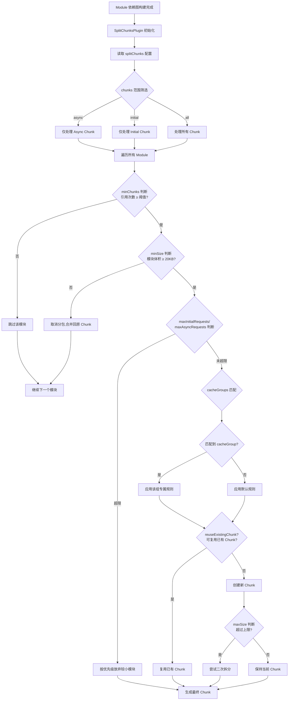
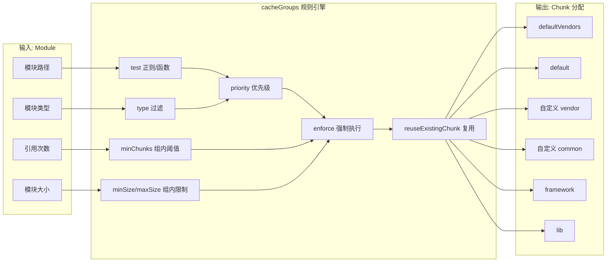
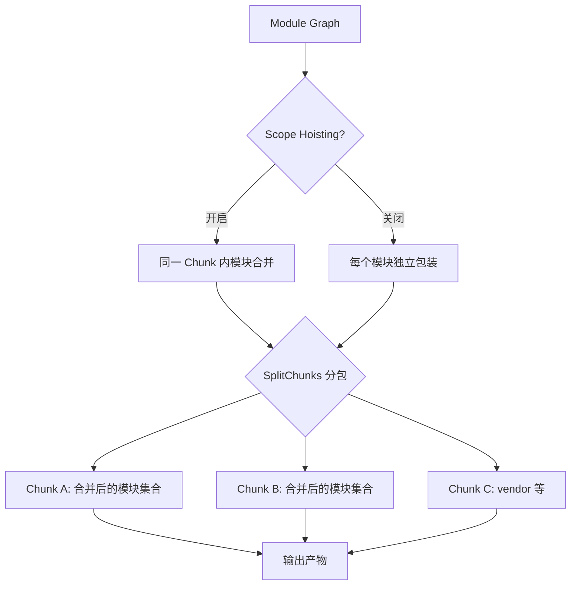
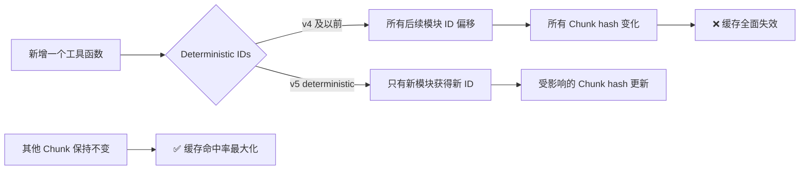
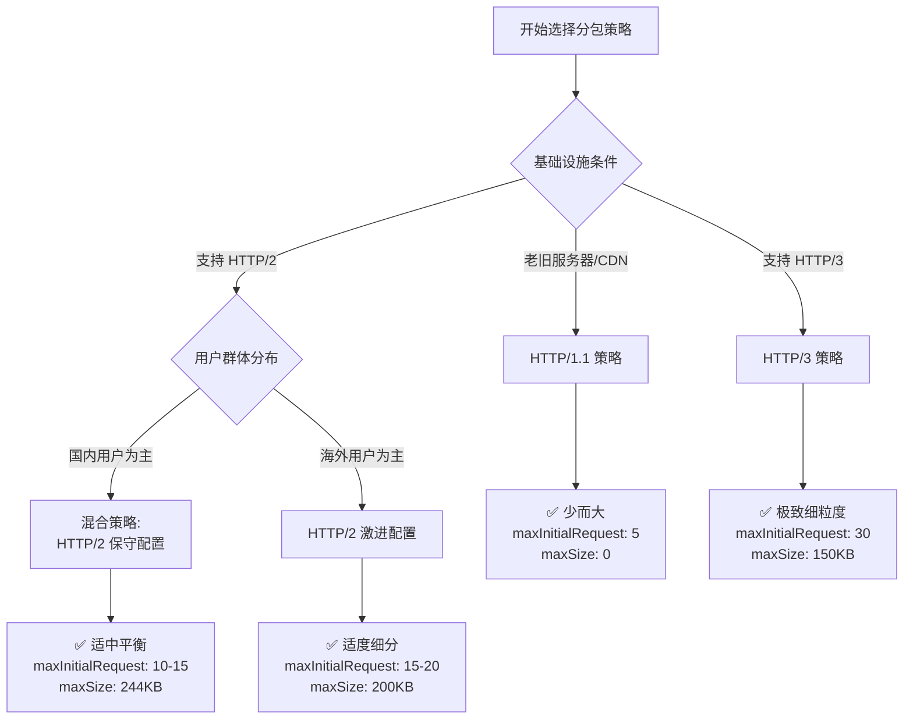

# 如何正确使用 SplitChunks 提升应用性能？


## 📋 版本差异对照表

| 维度 | v1 (旧版) | v2 (本版)
| ------|-----------|-----------
| **Webpack 版本** | 4.x / 5.x 早期 | **5.107** |
| **默认 chunks 值** | `'async'` | `'async'` (production 模式) |
| **minRemainingSize** | 未提及 | **0** (v5+ 新增) |
| **name 配置** | 允许自定义 | **false**（v5+ 默认自动命名，保障长期缓存） |
| **cacheGroups 默认值** | vendors/default | **defaultVendors/default** |
| **可视化图表** | 外链图片 | **Mermaid 内嵌流程图 + 决策矩阵** |
| **协议场景** | 仅 HTTP/1.1 | **HTTP/1.1 vs HTTP/2 vs HTTP/3 三场景对比** |
| **runtimeChunk** | 简要提及 | **深度配置指南 (single/multiple/object)** |
| **ModuleConcatenation** | 未涉及 | **与 SplitChunks 配合使用详解** |
| **Deterministic IDs** | 未涉及 | **缓存影响分析** |

---

## 一、为什么需要代码分割

Webpack 默认会将尽可能多的模块代码打包在一起，优点是能减少最终页面的 HTTP 请求数，但缺点也很明显：

1. **页面初始代码包过大**：影响首屏渲染性能（FCP/LCP 指标恶化）；
2. **无法有效应用浏览器缓存**：特别对于 NPM 包这类变动较少的代码，业务代码哪怕改了一行都会导致 NPM 包缓存失效；
3. **资源加载效率低**：用户必须等待整个包下载完毕才能交互，即使当前页面只用到了部分代码。

为此，Webpack 提供了 `SplitChunksPlugin` 插件（通过 `optimization.splitChunks` 配置），专门用于根据产物包的体积、引用次数等做**启发式分包优化**，规避上述问题。

> **v5.107 重要提示**：在 production 模式下，SplitChunksPlugin **默认自动启用**，无需手动安装或引入。

---

## 二、深入理解 Chunk

Chunk 是 Webpack 内部一个非常重要的底层设计，用于组织、管理、优化最终产物。在构建流程进入 **Seal 阶段**后，执行如下流程：

```mermaid
flowchart TD
    A[Entry 配置解析] --> B[创建 Initial Chunk]
    B --> C[遍历 Module 依赖图]
    C --> D{模块类型判断}
    D -->|同步模块| E[分配到对应 Entry Chunk]
    D -->|异步 import()| F[创建 Async Chunk]
    D -->|Runtime 代码| G[创建 Runtime Chunk]
    E --> H[Chunk 图构建完成]
    F --> H
    G --> H
    H --> I[SplitChunksPlugin 启动]
    I --> J{命中分包规则?}
    J -->|是| K[拆分/合并/优化 Chunk]
    J -->|否| L[保持原始 Chunk]
    K --> M[输出优化后的 Asset 文件]
    L --> M

```

### 2.1 Chunk 的三种类型

| 类型 | 来源 | 特点
| ------|------|------
| **Initial Chunk** | `entry` 配置的入口模块及同步依赖 | 页面加载时必须请求 |
| **Async Chunk** | `import()` 动态导入的模块及依赖 | 按需加载，可延迟请求 |
| **Runtime Chunk** | Webpack 运行时代码（模块加载逻辑） | 可通过 `runtimeChunk` 配置抽离 |

### 2.2 默认分包的问题

Webpack 默认的分包规则（Initial/Async/Runtime）存在两个明显问题：

#### 问题一：模块重复打包

假如多个 Chunk 同时依赖同一个 Module，这个 Module 会**不受限制地重复打包**进这些 Chunk：

```text
entry-a.js ──┐
              ├──→ common.js (被重复打包两次!)
entry-b.js ──┘
```

#### 问题二：资源冗余 & 低效缓存

- **资源冗余**：客户端必须等待整个应用的代码包都加载完毕才能启动运行；
- **缓存失效**：所有改动（即使只改了一个字符）都会导致整个包重新下载，缓存命中率极低。

---

## 三、SplitChunksPlugin 核心原理

### 3.1 完整工作流程



### 3.2 Webpack 5.107 完整默认配置

```javascript
// webpack.config.js - production 模式下的默认值
module.exports = {
  mode: 'production',
  optimization: {
    splitChunks: {
      // === 基础配置 ===
      chunks: 'async',                    // 仅对异步 chunk 生效 (v5 默认)
      minSize: 20000,                     // 最小 20KB 才分包 (压缩前)
      minRemainingSize: 0,                // v5+ 新增: 分包后剩余 chunk 最小尺寸
      maxSize: 0,                         // 0 表示不限制最大尺寸
      minChunks: 1,                       // 最少被 1 个 chunk 引用
      maxAsyncRequests: 30,               // 异步 chunk 最大并行请求数
      maxInitialRequests: 30,             // 初始 chunk 最大并行请求数
      automaticNameDelimiter: '~',        // 自动名称分隔符
      name: false,                        // v5+ 默认自动命名 (保障长期缓存)
      enforceSizeThreshold: 50000,        // 超过 50KB 强制分包 (cacheGroups 中可用)

      // === 内置缓存组 ===
      cacheGroups: {
        defaultVendors: {
          test: /[\\/]node_modules[\\/]/, // 匹配 node_modules
          priority: -10,                  // 优先级
          reuseExistingChunk: true,       // 复用已存在的 chunk
          name: undefined,                // 不允许自定义名称
        },
        default: {
          minChunks: 2,                   // 至少被 2 个 chunk 引用
          priority: -20,                  // 优先级低于 vendors
          reuseExistingChunk: true,
          name: undefined,
        },
      },
    },

    // === 运行时代码分离 (v5 推荐) ===
    runtimeChunk: false,                   // 可设为 'single' | 'multiple' | object

    // === 模块拼接 (与 splitChunks 配合) ===
    concatenateModules: true,             // Scope Hoisting (production 默认)
  },
};
```

### 3.3 关键配置项详解

#### 📌 chunks - 分包范围

| 值 | 说明 | 推荐场景
| ----|------|----------
| `'async'` | **默认值**，仅处理异步 chunk | 小型项目、SSR 场景 |
| `'initial'` | 仅处理初始 chunk | SPA 首屏优化 |
| `'all'` | **推荐**，处理所有 chunk | 大中型项目通用 |
| `Function` | 自定义函数返回 boolean | 极致定制需求 |

```javascript
// ✅ 推荐：对所有 chunk 启用分包
splitChunks: {
  chunks: 'all',
}

// 🔧 高级：自定义过滤
splitChunks: {
  chunks: (chunk) => {
    // 排除特定名称的 chunk
    return !chunk.name?.includes('legacy');
  },
}
```

#### 📌 minSize / maxSize - 体积控制

```javascript
splitChunks: {
  minSize: {
    javascript: 20000,   // JS 模块最小 20KB
    style: 5000,         // CSS 模块最小 5KB (MiniCssExtractPlugin)
  },
  maxSize: {
    javascript: 244000,  // JS 单个 chunk 最大 244KB (gzip 友好)
    style: 100000,       // CSS 单个 chunk 最大 100KB
  },
  // v5+ 支持 function 形式
  minSize: (module, count) => {
    // 动态计算最小尺寸
    return count * 10000;
  },
}
```

**体积阈值设计原则**：
- `minSize: 20KB`：避免产生过多微小 chunk（HTTP 开销 > 内容收益）
- `maxSize: 244KB`：配合 gzip 压缩后约 50-70KB，单次传输可控
- `enforceSizeThreshold`：超过阈值（默认 50KB）强制分包，忽略其他限制

#### 📌 minRemainingSize (v5+ 新增)

```javascript
splitChunks: {
  minRemainingSize: 0,  // 默认值
}
```

**作用**：防止因过度分包导致原 chunk 体积过小。当分包后剩余部分小于此阈值时，取消本次分包。

**典型场景**：
```text
原 chunk: 25KB (common 模块 15KB + 业务代码 10KB)
若 minRemainingSize: 0 → 正常分包
若 minRemainingSize: 12000 → 取消分包 (剩余 10KB < 12KB)
```

---

## 四、cacheGroups 深度配置

### 4.1 配置决策矩阵



### 4.2 完整属性列表

| 属性 | 类型 | 默认值 | 说明
| ------|------|--------|------
| `test` | RegExp/Function/String | `/./` | 匹配模块路径 |
| `type` | RegExp/Function/String | - | 匹配模块类型 (asset/javascript/css) |
| `priority` | Number | 0 | 优先级（数值越大越优先） |
| `minChunks` | Number | 继承全局 | 组内最小引用次数 |
| `minSize` | Number/Object | 继承全局 | 组内最小体积 |
| `maxSize` | Number/Object | 继承全局 | 组内最大体积 |
| `minRemainingSize` | Number | 继承全局 | v5+: 剩余 chunk 最小体积 |
| `enforce` | Boolean | false | **强制执行**，忽略其他限制 |
| `name` | Boolean/Function | false | v5+ 默认 false（自动命名），组内可显式指定但需注意多入口合并问题 |
| `filename` | String/Function | - | 自定义输出文件名模板 |
| `idHint` | String | - | Chunk ID 提示（用于生成 hash） |
| `reuseExistingChunk` | Boolean | false | 复用已有的同名 chunk |
| `layers` | String/RegExp/Function | - | 按 module.layer 分组 (v5+) |

### 4.3 典型配置模式

#### 模式一：基础 vendor/common 分离

```javascript
splitChunks: {
  chunks: 'all',
  cacheGroups: {
    vendor: {
      test: /[\\/]node_modules[\\/]/,
      name: 'vendors',
      chunks: 'all',
      priority: 10,
    },
    common: {
      name: 'common',
      minChunks: 2,
      chunks: 'all',
      priority: 5,
      reuseExistingChunk: true,
    },
  },
}
```

#### 模式二：精细化框架分离（推荐）

```javascript
splitChunks: {
  chunks: 'all',
  maxSize: 244000,
  cacheGroups: {
    // React 核心 (变动频率最低)
    react: {
      test: /[\\/]node_modules[\\/](react|react-dom)[\\/]/,
      name: 'react',
      chunks: 'all',
      priority: 20,
      enforce: true,  // 强制分包，不受 minSize 限制
    },
    // UI 组件库 (中等频率)
    antd: {
      test: /[\\/]node_modules[\\/]antd[\\/]/,
      name: 'antd',
      chunks: 'all',
      priority: 15,
      enforce: true,
    },
    // 其他第三方库
    vendor: {
      test: /[\\/]node_modules[\\/]/,
      name: 'vendor',
      chunks: 'all',
      priority: 10,
      minSize: 20000,
    },
    // 公共业务代码
    common: {
      name: 'common',
      minChunks: 2,
      chunks: 'all',
      priority: 5,
      reuseExistingChunk: true,
      minSize: 0,
    },
  },
}
```

#### 模式三：Monorepo 内部包分离

```javascript
splitChunks: {
  chunks: 'all',
  cacheGroups: {
    // 分离 monorepo 内部共享包
    shared: {
      test: /[\\/]packages[\\/](shared|utils|constants)[\\/]/,
      name: 'shared',
      chunks: 'all',
      priority: 15,
      enforce: true,
    },
    // 业务模块公共部分
    bizCommon: {
      minChunks: 2,
      name: 'biz-common',
      chunks: 'all',
      priority: 10,
    },
  },
}
```

---

## 五、runtimeChunk 深度配置

### 5.1 为什么需要分离 Runtime

Webpack 的 **Runtime** 包含：
- 模块加载/执行的引导代码
- Chunk 加载逻辑 (`__webpack_require__`)
- 异步模块加载 JSONP 逻辑
- HMR (Hot Module Replacement) 相关代码

**不分离的问题**：任何业务代码改动都会导致 Runtime 的 hash 变化，进而使所有依赖它的 chunk 缓存失效。

### 5.2 配置选项对比

```javascript
optimization: {
  runtimeChunk: false,     // ❌ 不分离 (development 默认)
  // runtimeChunk: true,    // ✅ 等价于 'single'
  // runtimeChunk: 'single', // ✅ 所有 entry 共享一个 runtime (推荐)
  // runtimeChunk: 'multiple', // ✅ 每个 entry 独立 runtime
  // runtimeChunk: { name: entrypoint => `runtime-${entrypoint.name}` }, // ✅ 自定义命名
}
```

| 模式 | 输出结果 | 适用场景
| ------|----------|----------
| `false` | Runtime 打包在每个 chunk 中 | Development / 小项目 |
| `'single'` | **单一** `runtime.xxx.js` | **SPA 推荐** - 最少请求数 |
| `'multiple'` | 每个 entry 一个 runtime | MPA / 多入口项目 |
| `Object` | 自定义命名规则 | 特殊需求定制 |

### 5.3 最佳实践示例

```javascript
// ✅ 推荐配置 (SPA 项目)
optimization: {
  runtimeChunk: {
    name: 'runtime',
  },
  splitChunks: {
    chunks: 'all',
    cacheGroups: {
      ... // 上述 cacheGroups 配置
    },
  },
}

// 最终产物结构:
// ├── runtime.[hash].js        (长期不变)
// ├── vendors.[hash].js        (依赖未变时不更新)
// ├── common.[hash].js         (公共模块变化时更新)
// ├── main.[hash].js           (主入口，频繁变化)
// └── async-[name].[hash].js   (异步组件)
```

---

## 六、ModuleConcatenationPlugin 与 SplitChunks 的配合

### 6.1 什么是 Module Concatenation (Scope Hoisting)

[`optimization.concatenateModules`](https://webpack.js.org/configuration/optimization/#optimizationconcatenatemodules) 在 **production 模式下默认开启**，作用是将所有模块合并到一个函数作用域中：

```javascript
// 未开启 (Concatenation off):
(function(module, exports, __webpack_require__) {
  // 模块 A
  var depA = __webpack_require__(2);
  exports.value = depA + 1;
});
(function(module, exports, __webpack_require__) {
  // 模块 B
  var depB = __webpack_require__(3);
  exports.value = depB + 2;
});

// 开启后 (Concatenation on):
(function(module, exports) {
  // 所有模块合并到一个闭包
  var depA = 42;  // 直接内联
  var depB = 100; // 直接内联
  exports.a = depA + 1;
  exports.b = depB + 2;
});
```

**收益**：
- 减少函数声明数量，降低内存占用
- 减小产物体积（省略 __webpack_require__ 调用）
- 提升 JavaScript 执行效率（V8 优化）

### 6.2 与 SplitChunks 的冲突与协调



**关键原则**：
1. **先分包，后拼接**：模块先由 SplitChunks 分配到各 Chunk，再在各 Chunk 内完成 Concatenation 合并
2. **跨 Chunk 的模块无法被 Concatenation**：如果模块 A 和模块 B 被 SplitChunks 分到不同 Chunk，它们不会被合并
3. **建议保持 concatenateModules: true**：除非遇到循环依赖问题

### 6.3 注意事项

```javascript
// ⚠️ 可能需要关闭的场景
optimization: {
  concatenateModules: false,  // 当出现以下问题时:
  // 1. 模块循环依赖导致报错
  // 2. 需要 eval source-map 进行调试
  // 3. 某些老旧库兼容性问题
}
```

---

## 七、Deterministic Module/Chunk IDs 与缓存

### 7.1 ID 生成策略演进

| Webpack 版本 | 策略 | 特点
| -------------|------|------
| 3.x | 数字递增 (0, 1, 2...) | 任意模块增删都会导致后续 ID 偏移 |
| 4.x | Hash (4位) | 冲突概率较低但仍可能变化 |
| **5.x** | **Deterministic Hash** | **基于模块路径+内容+位置生成固定 ID** |

### 7.2 Deterministic IDs 工作原理

```javascript
// webpack.config.js (v5 默认)
optimization: {
  moduleIds: 'deterministic',   // 模块 ID: 基于模块路径确定性生成
  chunkIds: 'deterministic',    // Chunk ID: 基于 chunk 内容确定性生成
}
```

**优势**：
- 模块 ID 固定不变（只要路径不变）
- 新增模块不会影响既有模块的 ID
- **完美配合长期缓存策略**

### 7.3 对 SplitChunks 的影响



**实际效果**：
```text
修改前:
├── main.a1b2c3.js      (包含模块 id: 10, 11, 12...)
├── vendors.d4e5f6.js    (包含模块 id: 20, 21, 22...)

新增 utils.js 后:
├── main.g7h8i9.js      ✅ 只有 main 变化 (包含新模块)
├── vendors.d4e5f6.js    ✅ vendors 未变! (ID 未偏移)
```

---

## 八、HTTP 协议场景最佳实践

### 8.1 三种协议特性对比

| 特性 | HTTP/1.1 | HTTP/2 | HTTP/3 (QUIC)
| ------|----------|--------|---------------
| **连接模型** | TCP 串行 | TCP 多路复用 | UDP 无队头阻塞 |
| **并行请求数** | 浏览器限制 (~6) | 无限制 | 无限制 |
| **请求开销** | 高 (TCP握手+慢启动) | 低 (连接复用) | 极低 (0-RTT) |
| **最佳分包策略** | **少而大** | **多而小** | **极致细粒度** |
| **推荐 chunk 数量** | 3-8 个 | 10-30 个 | 30+ 个 |
| **maxSize 建议** | 500KB+ | 150-244KB | 50-150KB |

### 8.2 场景一：HTTP/1.1 (传统环境)

**适用场景**：老旧服务器、CDN 不支持 HTTP/2、国内部分移动网络

```javascript
// ✅ HTTP/1.1 最佳实践: 少而大的 chunk
module.exports = {
  optimization: {
    splitChunks: {
      chunks: 'all',
      // 严格限制数量，避免过多请求
      maxInitialRequests: 5,     // 初始最多 5 个并行请求
      maxAsyncRequests: 5,       // 异步最多 5 个并行请求
      // 放宽体积限制，允许更大的 chunk
      minSize: 30000,            // 最小 30KB
      maxSize: 0,                // 不限制最大体积 (或设为 500000)
      cacheGroups: {
        // 将所有 node_modules 合并为一个大包
        vendors: {
          test: /[\\/]node_modules[\\/]/,
          name: 'vendors',
          chunks: 'all',
          priority: 10,
          enforce: true,
        },
        // 公共业务代码合并
        common: {
          name: 'common',
          minChunks: 3,          // 提高阈值，减少分包数
          chunks: 'all',
          priority: 5,
          reuseExistingChunk: true,
        },
      },
    },
    runtimeChunk: 'single',      // 单一 runtime 减少请求
  },
};

// 预期产物:
// ├── vendors.[hash].js      (~300-500KB)
// ├── common.[hash].js       (~50-100KB)
// ├── runtime.[hash].js      (~5KB)
// ├── main.[hash].js         (入口)
// └── async-[name].[hash].js (少量异步包)
```

**核心原则**：
- ✅ **控制总请求数 < 10 个**
- ✅ **合并 vendor 为单一/少数几个大包**
- ✅ **提高 minChunks 阈值 (≥3)**
- ✅ **禁用或不设置 maxSize**
- ❌ 避免将每个 npm 包单独打包

---

### 8.3 场景二：HTTP/2 (主流推荐)

**适用场景**：现代浏览器、主流 CDN (Cloudflare/AWS CloudFront/阿里云 CDN)

```javascript
// ✅ HTTP/2 最佳实践: 适度细分，平衡粒度与数量
module.exports = {
  optimization: {
    splitChunks: {
      chunks: 'all',
      // 适度放宽数量限制
      maxInitialRequests: 15,
      maxAsyncRequests: 15,
      // 适中的体积控制
      minSize: 20000,
      maxSize: 244000,           // gzip 后 ~50-70KB
      cacheGroups: {
        // 核心框架 (React/Vue) 单独分包
        framework: {
          test: /[\\/]node_modules[\\/](react|react-dom|vue|@vue)[\\/]/,
          name: 'framework',
          chunks: 'all',
          priority: 20,
          enforce: true,
        },
        // UI 组件库单独分包
        uiLibs: {
          test: /[\\/]node_modules[\\/](@ant-design|element-plus|vant)[\\/]/,
          name: 'ui-libs',
          chunks: 'all',
          priority: 15,
          enforce: true,
        },
        // 工具库单独分包
        utils: {
          test: /[\\/]node_modules[\\/(lodash|axios|dayjs|qs)][\\/]/,
          name: 'utils',
          chunks: 'all',
          priority: 12,
          enforce: true,
        },
        // 其余 vendor
        vendor: {
          test: /[\\/]node_modules[\\/]/,
          name: 'vendor',
          chunks: 'all',
          priority: 10,
          minSize: 20000,
          maxSize: 244000,
        },
        // 公共业务代码
        common: {
          name: 'common',
          minChunks: 2,
          chunks: 'all',
          priority: 5,
          reuseExistingChunk: true,
          maxSize: 244000,
        },
      },
    },
    runtimeChunk: 'single',
  },
};

// 预期产物 (10-18 个 chunk):
// ├── framework.[hash].js      (~120KB gzip: ~35KB)
// ├── ui-libs.[hash].js        (~200KB gzip: ~55KB)
// ├── utils.[hash].js          (~80KB gzip: ~25KB)
// ├── vendor.[hash].js         (~100KB gzip: ~30KB)
// ├── common.[hash].js         (~60KB gzip: ~18KB)
// ├── runtime.[hash].js        (~5KB)
// ├── main.[hash].js
// └── async-[name].[hash].js   (多个)
```

**核心原则**：
- ✅ **利用多路复用，允许 10-20 个并行请求**
- ✅ **按变更频率分层 (框架 < UI < 工具 < 业务)**
- ✅ **设置 maxSize=244KB 控制 chunk 上限**
- ✅ **启用 deterministic IDs 保障长期缓存**
- ⚠️ 避免过度碎片化 (< 5KB 的 chunk 无意义)

---

### 8.4 场景三：HTTP/3 (QUIC) (未来导向)

**适用场景**：支持 QUIC 的前沿环境 (Cloudflare/Google 服务)

```javascript
// ✅ HTTP/3 最佳实践: 极致细粒度，充分利用 0-RTT
module.exports = {
  optimization: {
    splitChunks: {
      chunks: 'all',
      // 宽松的数量限制
      maxInitialRequests: 30,
      maxAsyncRequests: 30,
      // 较小的体积阈值
      minSize: 10000,             // 降低到 10KB
      maxSize: 150000,            // 150KB 上限 (gzip 后 ~40KB)
      // 更激进的分包策略
      cacheGroups: {
        // React 核心
        reactCore: {
          test: /[\\/]node_modules[\\/](react|react-dom|scheduler)[\\/]/,
          name: 'react-core',
          chunks: 'all',
          priority: 30,
          enforce: true,
        },
        // React 生态 (Redux/Router)
        reactEco: {
          test: /[\\/]node_modules[\\/](redux|@reduxjs|react-router)[\\/]/,
          name: 'react-eco',
          chunks: 'all',
          priority: 28,
          enforce: true,
        },
        // UI 组件库
        antd: {
          test: /[\\/]node_modules[\\/]antd[\\/]/,
          name: 'antd',
          chunks: 'all',
          priority: 25,
          enforce: true,
        },
        // 图标库 (通常较大且独立)
        icons: {
          test: /[\\/]node_modules[\\/](@ant-design|@iconpark)[\\/]/,
          name: 'icons',
          chunks: 'all',
          priority: 23,
          enforce: true,
        },
        // 数据请求层
        network: {
          test: /[\\/]node_modules[\\/](axios|fetch-intercept)[\\/]/,
          name: 'network',
          chunks: 'all',
          priority: 20,
          enforce: true,
        },
        // 工具函数
        utilities: {
          test: /[\\/]node_modules[\\/](lodash|lodash-es|dayjs|qs)[\\/]/,
          name: 'utilities',
          chunks: 'all',
          priority: 18,
          enforce: true,
        },
        // 其余 vendor (自动按 maxSize 拆分)
        vendor: {
          test: /[\\/]node_modules[\\/]/,
          name: 'vendor',
          chunks: 'all',
          priority: 10,
          maxSize: 150000,
        },
        // 公共业务代码 (更低的复用阈值)
        common: {
          name: 'common',
          minChunks: 2,
          chunks: 'all',
          priority: 5,
          reuseExistingChunk: true,
          maxSize: 150000,
        },
      },
    },
    runtimeChunk: 'single',
  },
};

// 预期产物 (20-35 个 chunk):
// ├── react-core.[hash].js
// ├── react-eco.[hash].js
// ├── antd.[hash].js
// ├── icons.[hash].js
// ├── network.[hash].js
// ├── utilities.[hash].js
// ├── vendor~antd~icons.[hash].js  (vendor 可能被进一步拆分)
// ├── common.[hash].js
// ├── runtime.[hash].js
// ├── main.[hash].js
// └── async-*.[hash].js           (多个细粒度异步包)
```

**核心原则**：
- ✅ **充分利用 QUIC 并行能力，允许 30+ 请求**
- ✅ **每个主要依赖库独立分包**
- ✅ **降低 minSize 到 10KB**
- ✅ **maxSize 控制在 150KB 以内**
- ✅ **按功能域精细划分 cacheGroups**
- ⚠️ 需配合服务端支持 (HTTP/3 需要服务器/CDN 配置)

---

### 8.5 协议选择决策树



---

## 九、完整生产环境配置模板

### 9.1 通用推荐配置 (HTTP/2)

```javascript
// webpack.prod.config.js
const path = require('path');
const TerserPlugin = require('terser-webpack-plugin');
const CssMinimizerPlugin = require('css-minimizer-webpack-plugin');

module.exports = {
  mode: 'production',

  output: {
    path: path.resolve(__dirname, 'dist'),
    filename: '[name].[contenthash:8].js',
    chunkFilename: '[name].[contenthash:8].chunk.js',
    publicPath: '/',
    clean: true,
  },

  optimization: {
    minimize: true,
    minimizer: [
      new TerserPlugin({
        parallel: true,
        extractComments: false,
        terserOptions: {
          compress: {
            drop_console: true,
          },
        },
      }),
      new CssMinimizerPlugin(),
    ],

    // ✅ Deterministic IDs (v5 默认，显式声明增强可读性)
    moduleIds: 'deterministic',
    chunkIds: 'deterministic',

    // ✅ Scope Hoisting
    concatenateModules: true,

    // ✅ Runtime 分离
    runtimeChunk: {
      name: 'runtime',
    },

    // ✅ SplitChunks 核心配置
    splitChunks: {
      chunks: 'all',
      minSize: 20000,
      minRemainingSize: 0,
      maxSize: 244000,
      minChunks: 1,
      maxAsyncRequests: 30,
      maxInitialRequests: 30,
      enforceSizeThreshold: 30000,
      cacheGroups: {
        // 框架核心 (最低变动频率)
        framework: {
          test: /[\\/]node_modules[\\/](react|react-dom|vue|vue-router|pinia)[\\/]/,
          name: 'framework',
          priority: 20,
          chunks: 'all',
          enforce: true,
        },
        // 第三方库
        lib: {
          test: /[\\/]node_modules[\\/]/,
          name: 'lib',
          priority: 10,
          chunks: 'all',
          minSize: 20000,
          maxSize: 244000,
        },
        // 公共业务代码
        commons: {
          name: 'commons',
          minChunks: 2,
          priority: 5,
          chunks: 'all',
          reuseExistingChunk: true,
          maxSize: 244000,
        },
      },
    },
  },

  // ✅ 持久化缓存 (v5)
  cache: {
    type: 'filesystem',
    buildDependencies: {
      config: [__filename],
    },
  },
};
```

### 9.2 预期产物清单

```text
dist/
├── runtime.a1b2c3d4.js          # (~5KB) 运行时代码，极少变化
├── framework.e5f6g7h8.js        # (~130KB) React/Vue 核心
├── lib.i9j0k1l2.js             # (~200KB) 其他第三方库
├── lib~commons.m3n4o5p6.chunk.js  # (~80KB) 跨界共享的 node_modules
├── commons.q7r8s9t0.js          # (~60KB) 公共业务代码
├── main.u1v2w3x4.js            # 主入口
├── dashboard.y5z6a7b8.chunk.js  # 异步: Dashboard 页面
├── settings.c9d0e1f2.chunk.js   # 异步: 设置页
└── ...
```

### 9.3 缓存策略总结

| 资源类型 | 缓存策略 | 预计更新频率
| ----------|----------|--------------
| `runtime.*.js` | **Long-term cache** (1年+) | 仅 Webpack 版本升级时 |
| `framework.*.js` | **Long-term cache** (1月+) | 框架版本升级时 |
| `lib.*.js` | **Mid-term cache** (1周+) | 依赖版本更新时 |
| `commons.*.js` | **Short-term cache** (1天) | 公共业务代码变更时 |
| `main.*.js` | **No cache / ETag** | 每次部署都可能变 |
| `*.chunk.js` | **Short-term cache** (1天) | 对应功能模块变更时 |

---

## 十、常见问题排查

### 10.1 分包未生效

**症状**：配置了 splitChunks 但没有产生预期的分包

**排查清单**：
1. ✅ 确认 `mode: 'production'` 或手动启用了 splitChunks
2. ✅ 确认 `chunks: 'all'` （默认是 `'async'`）
3. ✅ 检查模块是否达到 `minSize` 阈值 (默认 20KB)
4. ✅ 检查是否达到 `minChunks` 阈值
5. ✅ 检查 `maxInitialRequests` / `maxAsyncRequests` 是否限制了数量
6. ✅ 使用 `webpack-bundle-analyzer` 可视化查看实际产物

```bash
npm install --save-dev webpack-bundle-analyzer
```

```js
// webpack.config.js
const BundleAnalyzerPlugin = require('webpack-bundle-analyzer').BundleAnalyzerPlugin;

module.exports = {
  plugins: [
    new BundleAnalyzerPlugin(),
  ],
};
```

### 10.2 chunk 名字包含乱码

**原因**：Webpack 5 默认 `splitChunks.name: false`（自动命名）。若在跨入口共享的 cacheGroup 中使用固定的 `name` 字符串，不同入口命中的分包会被合并到同一个 chunk，可能引发模块合并冲突与缓存失效问题。

**解决方案**：
```javascript
// ⚠️ 慎用（多入口场景会把分包合并到同一 chunk）
cacheGroups: {
  vendor: {
    name: 'vendor',
  }
}

// ✅ 正确方式 1: 使用 idHint (推荐)
cacheGroups: {
  vendor: {
    idHint: 'vendor',  // 仅作为 ID 提示，不影响 contenthash
  }
}

// ✅ 正确方式 2: 不设置 name，让 Webpack 自动生成
cacheGroups: {
  vendor: {
    // name: undefined (默认即可)
  }
}
```

### 10.3 循环依赖错误

**症状**：开启 `concatenateModules: true` 后报错

**解决方案**：
```javascript
// 方案 1: 关闭 Scope Hoisting (牺牲一定性能)
optimization: {
  concatenateModules: false,
}

// 方案 2: 修复循环依赖 (根本解决)
// 使用 webpack.circular-dependency-plugin 检测并修复
```

---

## 十一、总结

### 核心要点回顾

1. **Chunk 是 Webpack 分包的核心单元**：理解 Initial/Async/Runtime 三种类型是基础
2. **SplitChunksPlugin 采用启发式算法**：通过 minChunks/minSize/maxRequests 等多重条件综合决策
3. **cacheGroups 是分层配置的关键**：可以为不同类型的资源（框架/UI/工具/业务）设定差异化策略
4. **runtimeChunk 必须分离**：避免业务代码变动导致全量缓存失效
5. **Deterministic IDs 是长期缓存的基石**：确保模块 ID 稳定，提升缓存命中率
6. **协议决定策略**：HTTP/1.1 少而大、HTTP/2 适中、HTTP/3 极致细分

### 配置速查表

```javascript
// 🚀 一键复制: 生产环境推荐配置
optimization: {
  moduleIds: 'deterministic',
  chunkIds: 'deterministic',
  concatenateModules: true,
  runtimeChunk: 'single',
  splitChunks: {
    chunks: 'all',
    minSize: 20000,
    maxSize: 244000,
    cacheGroups: {
      framework: {
        test: /[\\/]node_modules[\\/](react|vue)[\\/]/,
        priority: 20,
        enforce: true,
      },
      vendor: {
        test: /[\\/]node_modules[\\/]/,
        priority: 10,
      },
      common: {
        minChunks: 2,
        priority: 5,
        reuseExistingChunk: true,
      },
    },
  },
}
```

---

## 十二、思考与实践

### 实践练习

1. **基础实验**：创建一个包含 3 个入口的项目，配置 `chunks: 'all'` 和 `minChunks: 2`，观察哪些模块被提取到 common chunk
2. **体积实验**：调整 `minSize` 和 `maxSize`，观察产物数量和体积的变化
3. **cacheGroups 实验**：分别测试 `test`、`priority`、`enforce` 属性的效果
4. **协议模拟**：分别应用 HTTP/1.1/2/3 的配置模板，使用 `webpack-bundle-analyzer` 分析差异
5. **缓存验证**：修改业务代码后观察各 chunk 的 hash 变化情况，验证 deterministic IDs 的效果

### 进阶探索

- 研究 [ModuleFederationPlugin](https://webpack.js.org/concepts/module-federation/) 与 SplitChunks 的配合
- 了解 [DllPlugin](https://webpack.js.org/plugins/dll-plugin/) 在超大项目中的替代方案
- 探索基于路由的自动化分包方案（如 `@babel/plugin-syntax-dynamic-import`）

---

> **参考资源**：
> - [Webpack 官方文档 - SplitChunksPlugin](https://webpack.js.org/plugins/split-chunks-plugin/)
> - [Webpack 官方文档 - Optimization](https://webpack.js.org/configuration/optimization/)
> - [Webpack 5 Release Notes](https://webpack.js.org/blog/2020-10-10-webpack-5-release/)
> - [HTTP/2 与前端性能优化](https://developers.google.com/web/fundamentals/performance/http2/)
