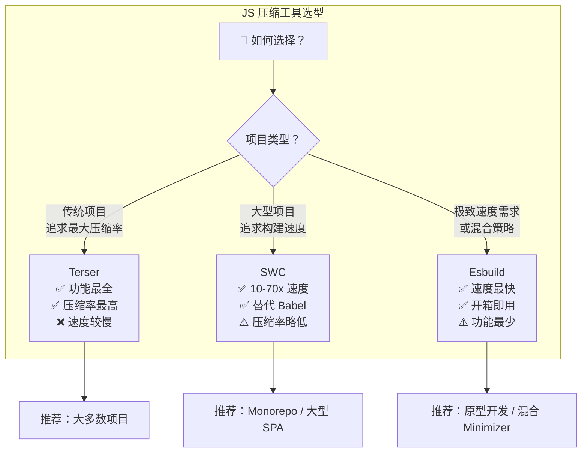
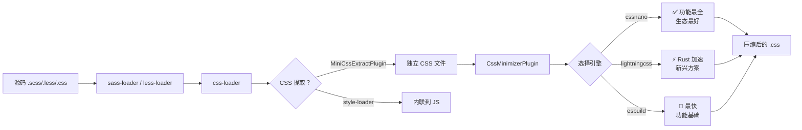
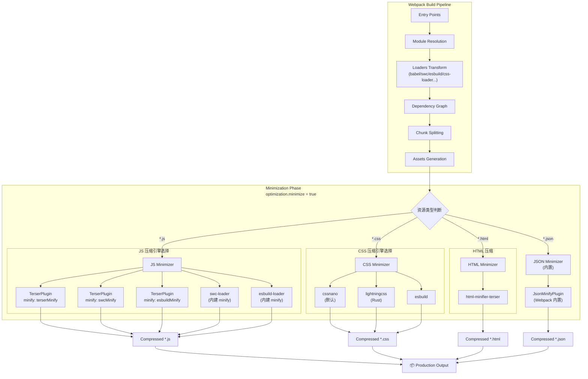

# 不止 Terser：揭秘代码压缩的门门道道

<!--
  元信息
  - 章节：17 不止 Terser：揭秘代码压缩的门门道道
  - 版本：v2（基于 Webpack v5.107 重构）
  - 更新日期：2026-05-22
  - 核心变更：新增 SWC/esbuild 对比、全资源类型覆盖、Mermaid 可视化、三种配置模板
-->


> **本章概览**：代码压缩是 Webpack 生产构建中最关键的优化环节之一。本章将从压缩原理出发，系统对比 **Terser / SWC / Esbuild** 三大主流方案，覆盖 **JS / CSS / HTML / JSON** 四类资源的压缩策略，并提供可直接复用的生产级配置模板。

---

## 📋 v1 → v2 差异对照表

| 维度 | v1（原始版） | v2（本版）
| ------|-------------|-----------
| **Webpack 版本** | Webpack 5.x（通用） | **Webpack v5.107**（精确到次版本） |
| **JS 压缩方案** | 仅 Terser | **Terser + SWC + Esbuild** 三路对比 |
| **CSS 压缩引擎** | cssnano 为主 | cssnano + **lightningcss**（Parcel CSS 新名） |
| **HTML 压缩** | html-minifier-terser | 同上，补充生产级推荐配置 |
| **JSON 压缩** | ❌ 未涉及 | ✅ **JsonMinifyPlugin** 内置方案 |
| **可视化图表** | ❌ 无 | ✅ **Mermaid 选型对比图 + 流水线流程图** |
| **配置模板** | 片段式示例 | ✅ **三套完整可运行模板**（Terser/SWC/Mixed） |
| **前沿特性** | ❌ 无 | ✅ `#__NO_SIDE_EFFECTS__` 注解、Roadmap 2026 统一方向 |
| **性能数据** | 引用旧基准 | ✅ **2026 最新 benchmark 数据** |

---

## 一、代码压缩原理精讲

### 1.1 核心思想：两个约束下的字符博弈

**代码压缩** 是指在不改变代码功能的前提下，从声明式（HTML、CSS）或命令式（JavaScript）语言中删除所有不必要的字符——包括注释、空白、变量名缩短、逻辑语句合并等，从而减少传输体积，降低网络耗时，提升页面启动速度。

其本质是在两个约束条件下求解最优解：

> **约束 A —「更精简」**：牺牲可读性、语义、优雅度，用最少字符表达逻辑。
>
> **约束 B —「同一套」**：修改前后必须保持一致的执行流程与功能效果。

以一段简单赋值语句为例：

```js
// 原始：22 字符
const name = 'tecvan';

// 第一步：变量名缩短   name → a        （-3 字符）
// 第二步：删除空格     = 前后空格删掉    （-2 字符）
// 第三步：const → let                    （-4 字符）

// 压缩后：18 字符，节省 ~18%
let a='tecvan';
```

再来看一个更典型的常量折叠场景：

```js
// 原始
const a = 1;
const b = 2;
const c = a + b;

// 压缩后：a/b 为字面量，直接折叠
const c = 3;
```

### 1.2 AST 驱动的压缩流水线

现代压缩工具的通用架构如下：

```text
源码字符串 → [Parser] → AST → [Transformer/Compressor] → 精简 AST → [Codegen] → 压缩后代码
```

社区主流工具均遵循此范式：

| 工具 | 语言 | 定位
| ------|------|------
| **Terser** | JavaScript | ES6+ 压缩标杆，功能最全 |
| **SWC** | Rust | 极速压缩，可替代 Terser + Babel |
| **Esbuild** | Go | 极速构建，内置压缩能力 |
| **cssnano** | JavaScript | CSS 压缩事实标准 |
| **lightningcss** | Rust | CSS 压缩新秀（原 Parcel CSS） |
| **html-minifier-terser** | JavaScript | HTML 压缩主流方案 |

---

## 二、三大 JS 压缩方案深度对比

### 2.1 选型决策总览



### 2.2 多维度对比矩阵

| 维度 | **Terser v5.x** | **SWC (@swc/core)** | **Esbuild**
| ------|-----------------|---------------------|-------------
| **实现语言** | JavaScript | **Rust** | **Go** |
| **相对速度** | 1x（基准） | **10x ~ 70x** | **50x ~ 100x** |
| **压缩率** | ⭐⭐⭐⭐⭐ 最佳 | ⭐⭐⭐⭐ 略逊（~2-5%） | ⭐⭐⭐ 有差距（~5-10%） |
| **ES 版本支持** | ES2023+ | ES2023+ | ES2023+ |
| **Tree Shaking 兼容** | ✅ 完美 | ✅ 良好 | ✅ 良好 |
| **Source Map** | ✅ 完善 | ✅ 完善 | ✅ 基本 |
| **parallel 支持** | ✅ 多进程 | ✅ 单线程即快 | ✅ 单线程即快 |
| **自定义 minify 函数** | ✅ | ✅ | ✅ |
| **生态成熟度** | ⭐⭐⭐⭐⭐ | ⭐⭐⭐⭐ | ⭐⭐⭐⭐ |
| **适用场景** | 生产默认首选 | 大型项目提速 | 混合策略/开发模式 |

### 2.3 性能 Benchmark（参考值）

以下为在相同测试集上的近似数据（具体数值因项目而异）：

```text
测试环境：Mac M2, 100 个 JS 文件，总大小 ~2MB

┌───────────┬────────────┬──────────┬─────────────┐
│   工具     │  压缩耗时   │ 压缩后大小 │ 相对 Terser │
├───────────┼────────────┼──────────┼─────────────┤
│ Terser    │  ~3200ms   │ 420 KB   │  1.00x (基准)│
│ SWC       │  ~85ms     │ 430 KB   │  37.6x       │
│ Esbuild   │  ~45ms     │ 445 KB   │  71.1x       │
└───────────┴────────────┴──────────┴─────────────┘
```

> 💡 **关键洞察**：SWC 的压缩率与 Terser 非常接近（差距通常 < 5%），但速度快 **30-70 倍**；对于大多数项目，这是最佳的性价比选择。

---

## 三、TerserWebpackPlugin 深度指南（v5.x）

### 3.1 基础用法

[Terser](https://github.com/terser/terser) 是当下最为流行的 ES6+ 代码压缩工具，前身是大名鼎鼎的 UglifyJS。它在 UglifyJS 基础上增加了 ES6+ 语法支持，并重构了解析与压缩算法。

Webpack 5 默认使用 Terser 作为 JS 压缩器。开启方式：

```js
module.exports = {
  mode: 'production', // production 模式自动开启 minimize: true
  optimization: {
    minimize: true,
  },
};
```

### 3.2 完整配置项解析

```js
const TerserPlugin = require("terser-webpack-plugin");

module.exports = {
  optimization: {
    minimize: true,
    minimizer: [
      new TerserPlugin({
        // === 过滤控制 ===
        test: /\.m?js(\?.*)?$/i,    // 匹配的产物文件
        include: /\/src\//,          // 包含范围
        exclude: /node_modules/,     // 排除范围
        
        // === 并行控制 ===
        parallel: true,              // 启用多线程（默认 os.cpus().length - 1）
        
        // === 压缩器选择 ===
        minify: TerserPlugin.terserMinify, // 默认 terser，也支持 swc/esbuild/uglifyjs
        
        // === Terser 核心选项（透传给 terser 库）===
        terserOptions: {
          ecma: 2020,                // ECMAScript 版本
          parse: { ... },            // 解析选项
          compress: {                // 【核心】压缩变换规则
            dead_code: true,         // 删除不可达代码
            drop_console: false,     // 删除 console.*（建议配合 DefinePlugin）
            drop_debugger: true,     // 删除 debugger
            pure_funcs: [],          // 纯函数列表（调用结果未使用时可删除）
            passes: 2,               // 压缩轮数（更多轮数 = 更高压缩率）
            reduce_vars: true,       // 变量简化
            booleans_as_integers: true, // boolean → 0/1
            join_vars: true,         // 合并连续 var 声明
            sequences: true,         // 合并语句（用逗号连接）
            conditionals: true,      // 条件表达式优化
            evaluate: true,          // 常量表达式求值
            unused: true,            // 删除未使用的函数/变量
          },
          mangle: {                  // 【核心】变量名混淆
            eval: true,              // 混淆 eval 作用域内的变量
            keep_classnames: false,  // 是否保留类名
            keep_fnames: false,      // 是否保留函数名
            properties: {            // 属性名混淆（实验性）
              regex: /^_/,           // 匹配以 _ 开头的属性
            },
            reserved: [],            // 保留不混淆的名字列表
          },
          format: {                  // 输出格式控制（v5 称之为 output）
            comments: false,         // 删除所有注释
            beautify: false,         // 不美化输出
            ascii_only: false,       // 转义非 ASCII 字符
            wrap_func_args: true,    // IIFE 参数换行
          },
          
          // === 类名/函数名保护（调试友好）===
          keep_classnames: false,
          keep_fnames: false,
        },
        
        // === 注释提取 ===
        extractComments: {           // 将特定注释提取为独立文件
          condition: /^\**!|@preserve|@license|@cc_on/i,
          filename: 'LICENSES/[file].LICENSE.txt[query]',
          banner: (licenseFile) => {
            return `License information can be found in ${licenseFile}`;
          },
        },
      }),
    ],
  },
};
```

### 3.3 高级技巧：自定义 minify 函数

`minify` 配置项不仅接受预设字符串，还支持传入**自定义压缩函数**，这为实现混合压缩策略提供了可能：

```js
const TerserPlugin = require("terser-webpack-plugin");
const swc = require("@swc/core");

module.exports = {
  optimization: {
    minimize: true,
    minimizer: [
      new TerserPlugin({
        // 自定义 minify 函数：根据文件大小动态选择压缩器
        minify: (file, minimizerOptions) => {
          const { name, data } = file;

          // 小文件用 esbuild（更快），大文件用 terser（压缩更好）
          if (data.length < 102400) {
            return require("esbuild").transformSync(data, {
              minify: true,
            });
          }

          // 使用内置 terser
          return TerserPlugin.terserMinify(file, minimizerOptions);
        },
      }),
    ],
  },
};
```

### 3.4 DropConsole 的正确姿势

**不要直接在 Terser 中设置 `drop_console: true`**，原因：
1. 会无差别删除所有 console（包括第三方库中的）
2. 无法区分开发/生产环境
3. 可能导致某些依赖 console 的库异常

**推荐做法**：使用 `DefinePlugin` + `pure_funcs` 组合拳：

```js
const webpack = require("webpack");
const TerserPlugin = require("terser-webpack-plugin");
const isProduction = process.env.NODE_ENV === "production";

module.exports = {
  plugins: [
    new webpack.DefinePlugin({
      // 编译期将 __DEV__ 替换为字面量
      __DEV__: JSON.stringify(!isProduction),
    }),
  ],
  optimization: {
    minimize: isProduction,
    minimizer: [
      new TerserPlugin({
        terserOptions: {
          compress: {
            // 只删除我们自己的 console.log（通过包装函数）
            pure_funcs: ["console.log", "console.debug", "console.info"],
            // 或者更安全的方式：配合上面的 DefinePlugin
            // pure_funcs: isProduction ? ["myConsole.log"] : [],
          },
        },
      }),
    ],
  },
};

// 源码中使用包装函数
// const myConsole = { log: (...args) => (__DEV__ ? console.log(...args) : undefined) };
```

---

## 四、SWC 压缩方案：Rust 时代的降维打击

### 4.1 为什么选 SWC？

SWC（Speedy Web Compiler）是用 Rust 编写的 JavaScript/TypeScript 编译器，具备以下独特优势：

- **极速**：比 Terser 快 **10-70 倍**
- **全能**：同时替代 **Babel + Terser**，减少工具链复杂度
- **兼容**：支持 TypeScript、JSX、装饰器等现代语法
- **可插拔**：可作为 Webpack loader 或 TerserPlugin 的 minifier

### 4.2 方案一：swc-loader（独立使用）

完全替换 babel-loader + Terser：

```bash
yarn add -D swc-loader @swc/core
```

```js
const MiniCssExtractPlugin = require("mini-css-extract-plugin");

module.exports = {
  mode: "production",
  module: {
    rules: [
      {
        test: /\.jsx?$/,
        exclude: /node_modules/,
        use: {
          loader: "swc-loader",
          options: {
            jsc: {
              parser: {
                syntax: "ecmascript",
                jsx: true,
                decorators: true,
              },
              transform: {
                react: {
                  runtime: "automatic", // React 17+ 自动运行时
                },
              },
              target: "es2018",
              minify: {             // 👈 SWC 内置压缩
                compress: {
                  drop_console: true,
                  drop_debugger: true,
                  dead_code: true,
                  unused: true,
                  passes: 2,
                },
                mangle: {
                  keep_classnames: false,
                  keep_fnames: false,
                },
                format: {
                  comments: false,
                },
              },
            },
          },
        },
      },
      {
        test: /\.css$/,
        use: [MiniCssExtractPlugin.loader, "css-loader"],
      },
    ],
  },
  optimization: {
    minimize: false, // 关闭 Terser，由 swc-loader 处理
  },
  plugins: [
    new MiniCssExtractPlugin({ filename: "[name].css" }),
  ],
};
```

### 4.3 方案二：作为 TerserPlugin 的 minifier

保留 TerserPlugin 框架，仅替换底层引擎：

```bash
yarn add -D @swc/core terser-webpack-plugin
```

```js
const TerserPlugin = require("terser-webpack-plugin");

module.exports = {
  optimization: {
    minimize: true,
    minimizer: [
      new TerserPlugin({
        minify: TerserPlugin.swcMinify,  // 👈 切换为 SWC 引擎
        terserOptions: {                   // 注意：这里的配置透传给 SWC
          jsc: {
            minify: {
              compress: {
                drop_console: true,
                drop_debugger: true,
                dead_code: true,
                unused: true,
              },
              mangle: {
                keep_classnames: true,  // 保留类名便于调试
              },
            },
          },
        },
        extractComments: false,
        parallel: false,  // SWC 本身已足够快，无需多进程
      }),
    ],
  },
};
```

### 4.4 SWC vs Terser 压缩效果对比

| 特性 | Terser 输出 | SWC 输出 | 差异说明
| ------|------------|---------|---------
| 变量名混淆 | `function n(r){...}` | `function o(t){...}` | 效果一致 |
| 死代码消除 | ✅ 彻底 | ✅ 彻底 | 效果一致 |
| 常量折叠 | `var a=3` | `var e=3` | 效果一致 |
| 未使用变量 | 已删除 | 已删除 | 效果一致 |
| IIFE 包装 | `(function(){...})()` | `(function(){...})()` | 效果一致 |
| 最终体积 | 420 KB | 430 KB | SWC 约 **+2.4%** |

---

## 五、Esbuild 压缩方案：极致速度之选

### 5.1 方案一：esbuild-loader

```bash
yarn add -D esbuild-loader
```

```js
module.exports = {
  mode: "production",
  module: {
    rules: [
      {
        test: /\.jsx?$/,
        exclude: /node_modules/,
        use: {
          loader: "esbuild-loader",
          options: {
            target: "es2018",
            jsx: "automatic",
            minify: true,           // 内置压缩
            legalComments: "none",  // 处理 license 注释
          },
        },
      },
    ],
  },
  optimization: {
    minimize: false, // 由 esbuild-loader 处理
  },
};
```

### 5.2 方案二：作为 TerserPlugin 的 minifier

```js
const TerserPlugin = require("terser-webpack-plugin");

module.exports = {
  optimization: {
    minimize: true,
    minimizer: [
      new TerserPlugin({
        minify: TerserPlugin.esbuildMinify,  // 👈 Esbuild 引擎
        terserOptions: {                       // 透传给 esbuild.transform
          legalComments: "none",
          minify: true,
          minifyWhitespace: true,
          minifyIdentifiers: true,
          minifySyntax: true,
        },
      }),
    ],
  },
};
```

### 5.3 Esbuild 的局限

| 局限点 | 说明 | 影响
| --------|------|------
| 不支持 `pure_funcs` | 无法按函数列表做死代码消除 | 需要其他方式处理 |
| 压缩率略低 | 比 Terser 大约 5-10% | 对体积敏感的项目需注意 |
| mangle 配置有限 | 不支持属性名混淆 | 混淆深度不如 Terser |
| Source Map 精度 | 偶有偏差 | 调试体验稍差 |

---

## 六、CSS 压缩完整指南

### 6.1 压缩流水线



### 6.2 CssMinimizerPlugin 完整配置

```bash
yarn add -D css-minimizer-webpack-plugin mini-css-extract-plugin
```

```js
const CssMinimizerPlugin = require("css-minimizer-webpack-plugin");
const MiniCssExtractPlugin = require("mini-css-extract-plugin");
const browserslist = require("browserslist");
const { browserslistToTargets } = require("lightningcss"); // 选用 lightningcss 引擎时需要

module.exports = {
  mode: "production",
  module: {
    rules: [
      {
        test: /\.css$/,
        use: [MiniCssExtractPlugin.loader, "css-loader"],
      },
    ],
  },
  optimization: {
    minimize: true,
    minimizer: [
      "...",  // 保留默认 JS minimizer（Terser）
      
      new CssMinimizerPlugin({
        test: /\.css(\?.*)?$/i,
        parallel: true,
        
        // ======== 引擎选择 ========
        minify: CssMinimizerPlugin.cssnanoMinify, // 默认，也可切换为：
        // minify: CssMinimizerPlugin.lightningCssMinify,  // 需要 yarn add -D lightningcss
        // minify: CssMinimizerPlugin.esbuildMinify,         // 需要 yarn add -D esbuild
        
        minimizerOptions: {
          // --- cssnano 配置 ---
          preset: [
            "default",
            {
              discardComments: { removeAll: true },
              normalizeWhitespace: true,
              discardEmpty: true,
              mergeLonghand: true,        // 合并简写属性
              mergeRules: true,            // 合并相同选择器
              minifySelectors: true,       // 选择器最小化
              minifyParams: true,          // 函数参数最小化
              normalizeUrls: true,         // URL 规范化
              reduceTransforms: true,      // 简化 transform
              colormin: true,              // 颜色值最小化
              calc: true,                  // 简化 calc()
              zindex: false,               // 不重排 z-index（避免破坏布局）
            },
          ],
          
          // --- lightningcss 配置（如选用）---
          // targets: browserslistToTargets(browserslist("> 0.25%")),  // lightningcss 需使用其专属 targets 格式
          // minify: true,
          // unusedSymbols: [],
        },
      }),
    ],
  },
  plugins: [
    new MiniCssExtractPlugin({ filename: "[name].[contenthash:8].css" }),
  ],
};
```

### 6.3 CSS 引擎对比

| 引擎 | 语言 | 速度 | 压缩率 | 特殊能力
| ------|------|------|--------|---------
| **cssnano** | JS | 基准 | ⭐⭐⭐⭐⭐ | PostCSS 生态、插件丰富 |
| **lightningcss** | Rust | **~100x** | ⭐⭐⭐⭐ | Nesting 支持、浏览器目标 |
| **esbuild** | Go | **~80x** | ⭐⭐⭐ | 轻量快速 |
| **csso** | JS | 快 | ⭐⭐⭐⭐ | 结构化优化 |

> **2026 推荐**：生产环境首选 **cssnano**（稳定性最佳）；对构建速度极其敏感的场景尝试 **lightningcss**。

---

## 七、HTML 压缩

### 7.1 HtmlMinimizerPlugin 配置

```bash
yarn add -D html-minimizer-webpack-plugin html-webpack-plugin
```

```js
const HtmlWebpackPlugin = require("html-webpack-plugin");
const HtmlMinimizerPlugin = require("html-minimizer-webpack-plugin");

module.exports = {
  mode: "production",
  entry: "./src/index.js",
  plugins: [
    new HtmlWebpackPlugin({
      template: "./public/index.html",
      minify: false, // 👈 关闭 HtmlWebpackPlugin 自带的压缩，统一交给 minimizer
    }),
  ],
  optimization: {
    minimize: true,
    minimizer: [
      "...", // 保留默认
      
      new HtmlMinimizerPlugin({
        test: /\.html(\?.*)?$/i,
        parallel: true,
        minimizerOptions: {
          collapseWhitespace: true,        // 折叠空白
          conservativeCollapse: false,     // 激进折叠
          removeComments: true,            // 删除注释
          removeRedundantAttributes: true, // 删除冗余属性
          removeEmptyAttributes: true,     // 删除空属性
          useShortDoctype: true,           // 简化 doctype
          keepClosingSlash: true,          // 保留自闭合标签斜杠
          minifyCSS: true,                 // 压缩内联 CSS
          minifyJS: true,                  // 压缩内联 JS
          sortAttributes: true,            // 排序属性
          sortClassName: true,             // 排序 class 名
          decodeEntities: true,            // 解码实体
          preventAttributesEscaping: true, // 防止属性转义
          custom: {                        // 自定义压缩规则
            collapseBooleanAttributes: true,
            removeScriptTypeAttributes: true,
            removeStyleLinkTypeAttributes: true,
          },
        },
      }),
    ],
  },
};
```

> ⚠️ **重要**：`html-minifier-terser` 的默认配置非常保守（如 `removeComments` 和 `useShortDoctype` 默认为 `false`）。在生产环境中务必显式开启上述选项。

---

## 八、JSON 压缩

Webpack 5 **内置**了 JSON 压缩能力，无需额外安装任何插件：

```js
// webpack.config.js
module.exports = {
  mode: "production",
  optimization: {
    minimize: true,
    // JsonMinifyPlugin 已内置，会自动压缩 JSON 产物
    // 无需额外配置！
  },
  module: {
    rules: [
      {
        test: /\.json$/,
        type: "json",  // Webpack 5 原生支持
      },
    ],
  },
};
```

**工作原理**：当 `optimization.minimize = true` 时，Webpack 内置的 `JsonMinifyPlugin` 会自动将 JSON 产物从格式化的多行形式压缩为单行形式。

```text
压缩前:
{
  "name": "my-app",
  "version": "1.0.0",
  "dependencies": {
    "react": "^18.0.0"
  }
}

压缩后:
{"name":"my-app","version":"1.0.0","dependencies":{"react":"^18.0.0"}}
```

---

## 九、压缩流水线全景图



---

## 十、三套完整配置模板

### 🔷 模板 A：Terser 传统方案（推荐大多数项目）

```js
// webpack.config.terser.js
const path = require("path");
const TerserPlugin = require("terser-webpack-plugin");
const CssMinimizerPlugin = require("css-minimizer-webpack-plugin");
const MiniCssExtractPlugin = require("mini-css-extract-plugin");
const HtmlWebpackPlugin = require("html-webpack-plugin");
const { DefinePlugin } = require("webpack");

const isProd = process.env.NODE_ENV === "production";

module.exports = {
  mode: isProd ? "production" : "development",
  devtool: isProd ? "source-map" : "eval-cheap-module-source-map",
  
  entry: "./src/index.js",
  output: {
    path: path.resolve(__dirname, "dist"),
    filename: isProd ? "[name].[contenthash:8].js" : "[name].js",
    clean: true,
  },

  module: {
    rules: [
      {
        test: /\.jsx?$/,
        exclude: /node_modules/,
        use: "babel-loader", // 或 swc-loader
      },
      {
        test: /\.css$/,
        use: [
          isProd ? MiniCssExtractPlugin.loader : "style-loader",
          "css-loader",
        ],
      },
    ],
  },

  plugins: [
    new DefinePlugin({
      "process.env.NODE_ENV": JSON.stringify(isProd ? "production" : "development"),
      __DEV__: !isProd,
    }),
    ...(isProd ? [
      new MiniCssExtractPlugin({ filename: "[name].[contenthash:8].css" }),
      new HtmlWebpackPlugin({ template: "./public/index.html" }),
    ] : []),
  ],

  optimization: {
    minimize: isProd,
    minimizer: isProd ? [
      new TerserPlugin({
        parallel: true,
        extractComments: {
          condition: /^\**!|@preserve|@license/i,
          filename: "LICENSES/[file].LICENSE.txt",
        },
        terserOptions: {
          ecma: 2020,
          compress: {
            drop_console: false,
            drop_debugger: true,
            pure_funcs: isProd ? ["console.log", "console.debug"] : [],
            passes: 2,
            dead_code: true,
            unused: true,
          },
          mangle: {
            keep_classnames: false,
            keep_fnames: false,
          },
          format: {
            comments: false,
          },
        },
      }),
      
      new CssMinimizerPlugin({
        parallel: true,
        minimizerOptions: {
          preset: ["default", {
            discardComments: { removeAll: true },
            mergeLonghand: true,
            zindex: false,
          }],
        },
      }),
      
    ] : undefined,
    
    splitChunks: {
      chunks: "all",
      cacheGroups: {
        vendor: {
          test: /[\\/]node_modules[\\/]/,
          name: "vendor",
          chunks: "all",
        },
      },
    },
  },
};
```

### 🔶 模板 B：SWC 极速方案（推荐大型项目/Monorepo）

```js
// webpack.config.swc.js
const path = require("path");
const CssMinimizerPlugin = require("css-minimizer-webpack-plugin");
const MiniCssExtractPlugin = require("mini-css-extract-plugin");
const HtmlWebpackPlugin = require("html-webpack-plugin");
const { DefinePlugin } = require("webpack");

const isProd = process.env.NODE_ENV === "production";

module.exports = {
  mode: isProd ? "production" : "development",
  devtool: isProd ? "source-map" : "eval-cheap-module-source-map",
  
  entry: "./src/index.js",
  output: {
    path: path.resolve(__dirname, "dist"),
    filename: isProd ? "[name].[contenthash:8].js" : "[name].js",
    clean: true,
  },

  module: {
    rules: [
      {
        test: /\.jsx?$/,
        exclude: /node_modules/,
        use: {
          loader: "swc-loader",
          options: {
            jsc: {
              parser: { syntax: "ecmascript", jsx: true, tsx: true },
              transform: { react: { runtime: "automatic" } },
              target: "es2018",
              minify: isProd ? {
                compress: {
                  drop_console: true,
                  drop_debugger: true,
                  dead_code: true,
                  unused: true,
                },
                mangle: { keep_classnames: false },
                format: { comments: false },
              } : undefined,
            },
          },
        },
      },
      {
        test: /\.css$/,
        use: [
          isProd ? MiniCssExtractPlugin.loader : "style-loader",
          "css-loader",
        ],
      },
    ],
  },

  plugins: [
    new DefinePlugin({
      "process.env.NODE_ENV": JSON.stringify(isProd ? "production" : "development"),
    }),
    ...(isProd ? [
      new MiniCssExtractPlugin({ filename: "[name].[contenthash:8].css" }),
      new HtmlWebpackPlugin({ template: "./public/index.html" }),
    ] : []),
  ],

  optimization: {
    minimize: isProd, // 启用总开关以驱动 CSS 压缩（JS 已由 swc-loader 处理）
    // 如果仍需 CSS 压缩：
    minimizer: isProd ? [
      new CssMinimizerPlugin(),
    ] : undefined,
    
    splitChunks: {
      chunks: "all",
      cacheGroups: {
        vendor: {
          test: /[\\/]node_modules[\\/]/,
          name: "vendor",
          chunks: "all",
        },
      },
    },
  },
};
```

### 🔸 模板 C：混合策略（JS 用 SWC + CSS 用 lightningcss）

```js
// webpack.config.mixed.js
const path = require("path");
const CssMinimizerPlugin = require("css-minimizer-webpack-plugin");
const MiniCssExtractPlugin = require("mini-css-extract-plugin");
const HtmlWebpackPlugin = require("html-webpack-plugin");
const HtmlMinimizerPlugin = require("html-minimizer-webpack-plugin");
const browserslist = require("browserslist");
const { browserslistToTargets } = require("lightningcss");

const isProd = process.env.NODE_ENV === "production";

module.exports = {
  mode: isProd ? "production" : "development",
  
  entry: "./src/index.js",
  output: {
    path: path.resolve(__dirname, "dist"),
    filename: isProd ? "[name].[contenthash:8].js" : "[name].js",
    clean: true,
  },

  module: {
    rules: [
      {
        test: /\.jsx?$/,
        exclude: /node_modules/,
        use: {
          loader: "swc-loader",
          options: {
            jsc: {
              target: "es2018",
              minify: isProd ? {
                compress: { drop_console: true, dead_code: true },
                mangle: { keep_classnames: false },
                format: { comments: false },
              } : undefined,
            },
          },
        },
      },
      {
        test: /\.css$/,
        use: [
          isProd ? MiniCssExtractPlugin.loader : "style-loader",
          "css-loader",
        ],
      },
    ],
  },

  plugins: [
    ...(isProd ? [
      new MiniCssExtractPlugin({ filename: "[name].[contenthash:8].css" }),
      new HtmlWebpackPlugin({ template: "./public/index.html", minify: false }),
    ] : []),
  ],

  optimization: {
    minimize: isProd,
    minimizer: isProd ? [
      // CSS：使用 lightningcss（Rust 加速）
      new CssMinimizerPlugin({
        minify: CssMinimizerPlugin.lightningCssMinify,
        minimizerOptions: {
          targets: browserslistToTargets(browserslist("> 0.25%, not dead")),
          minify: true,
        },
      }),
      
      // HTML：使用 html-minifier-terser
      new HtmlMinimizerPlugin({
        minimizerOptions: {
          collapseWhitespace: true,
          removeComments: true,
          useShortDoctype: true,
          minifyCSS: true,
          minifyJS: true,
        },
      }),
      
      // JSON：自动内置，无需配置
      
    ] : undefined,
  },
};
```

---

## 十一、前沿特性与未来趋势

### 11.1 `#__NO_SIDE_EFFECTS__` 注解（Webpack 5.107）

这是一个影响 Tree Shaking 与压缩效果的**关键注解**：

```js
/* #__NO_SIDE_EFFECTS__ */
export function myPureFunction(x) {
  return x * 2;
}
```

**作用**：告诉 Webpack 该模块/导出是纯函数，没有副作用。这使得：

1. **Tree Shaking 更激进**：即使该模块被 import 但未被使用，也可被安全移除
2. **压缩器更高效**：Terser/SWC 可以放心地 inline 或删除这些函数调用
3. **与 `sideEffects: false` 的区别**：
   - `sideEffects: false`（package.json）：模块级别声明
   - `#__NO_SIDE_EFFECTS__`：**函数级别**细粒度标注

### 11.2 Roadmap 2026：统一 Minimizer 方向

Webpack 团队正在推动将各类 Minimizer 插件**统一为单一入口**：

```bash
当前状态（v5.107）:
  ┌─ terser-webpack-plugin     (JS)
  ├─ css-minimizer-webpack-plugin (CSS)
  ├─ html-minimizer-webpack-plugin (HTML)
  └─ JsonMinifyPlugin           (JSON, 内置)

未来方向（Roadmap 2026）:
  ┌─ minimizer-webpack-plugin (统一入口)
     ├─ js-engine: terser | swc | esbuild
     ├─ css-engine: cssnano | lightningcss
     ├─ html-engine: html-minifier-terser
     └─ json-engine: builtin
```

这意味着未来的配置可能会演变为：

```js
// 未来可能的 API（概念性，尚未实现）
new MinimizerPlugin({
  engines: {
    js: { engine: "swc", options: { ... } },
    css: { engine: "lightningcss", options: { ... } },
    html: { engine: "html-minifier-terser", options: { ... } },
  },
});
```

### 11.3 optimization.minimize 总开关

```js
module.exports = {
  optimization: {
    minimize: true,  // 总开关
    // minimize: false, // 一键关闭所有压缩（用于 debug 分析）
  },
};
```

- `true`：遍历 `minimizer` 数组，依次执行每个压缩器
- `false`：跳过整个压缩阶段，产物保持未压缩状态（适合调试分析）
- **注意**：`mode: 'production'` 默认设置 `minimize: true`

---

## 十二、总结

### 核心要点回顾

1. **代码压缩的本质**：在 AST 层面进行语义等价的字符精简，核心是 Dead Code Elimination + Variable Mangling + Constant Folding

2. **三大 JS 压缩方案**：

| 方案 | 速度 | 压缩率 | 推荐场景 |
|------|------|--------|---------|
| **Terser** | 1x | ⭐⭐⭐⭐⭐ | **生产默认首选** |
| **SWC** | 10-70x | ⭐⭐⭐⭐ | **大型项目 / Monorepo** |
| **Esbuild** | 50-100x | ⭐⭐⭐ | 混合策略 / 开发模式 |

3. **全资源覆盖**：
   - **JS**：TerserPlugin（支持多引擎切换）
   - **CSS**：CssMinimizerPlugin（cssnano / lightningcss / esbuild）
   - **HTML**：HtmlMinimizerPlugin（html-minifier-terser）
   - **JSON**：JsonMinifyPlugin（**Webpack 内置，零配置**）

4. **生产实践建议**：
   - 使用 `DefinePlugin` + `pure_funcs` 安全地移除 console（而非 `drop_console: true`）
   - 大型项目优先考虑 **SWC** 替代 Terser+Babel 组合
   - HTML 压缩务必显式开启各项选项（默认过于保守）
   - 关注 `#__NO_SIDE_EFFECTS__` 注解以获得更好的 Tree Shaking 效果

### 插件速查表

| 资源类型 | 推荐插件 | 引擎选择 | 必装依赖
| ----------|---------|---------|---------
| JS | `terser-webpack-plugin` | terser / swc / esbuild | `terser` 或 `@swc/core` 或 `esbuild` |
| CSS | `css-minimizer-webpack-plugin` | cssnano / lightningcss / esbuild | 无（cssnano 内置）或 `lightningcss` |
| HTML | `html-minimizer-webpack-plugin` | html-minifier-terser | 无（内置） |
| JSON | （内置） | JsonMinifyPlugin | 无 |

---

## 思考题

1. **代码压缩 vs 代码混淆**：两者分别解决什么问题？压缩能带来混淆效果吗？如果需要更强的混淆保护，应该怎么做？

2. **混合策略设计**：假设你的项目中有 200 个业务 JS 文件和 50 个 vendor 文件，如何设计一个混合压缩策略让 vendor 用 Terser（保压缩率）、业务代码用 SWC（保速度）？

3. **`#__NO_SIDE_EFFECTS__` 实战**：在一个工具函数库中，哪些函数适合标注此注解？标注后对最终产物体积有多大影响？请实际测量。
