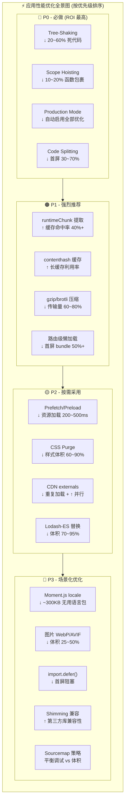
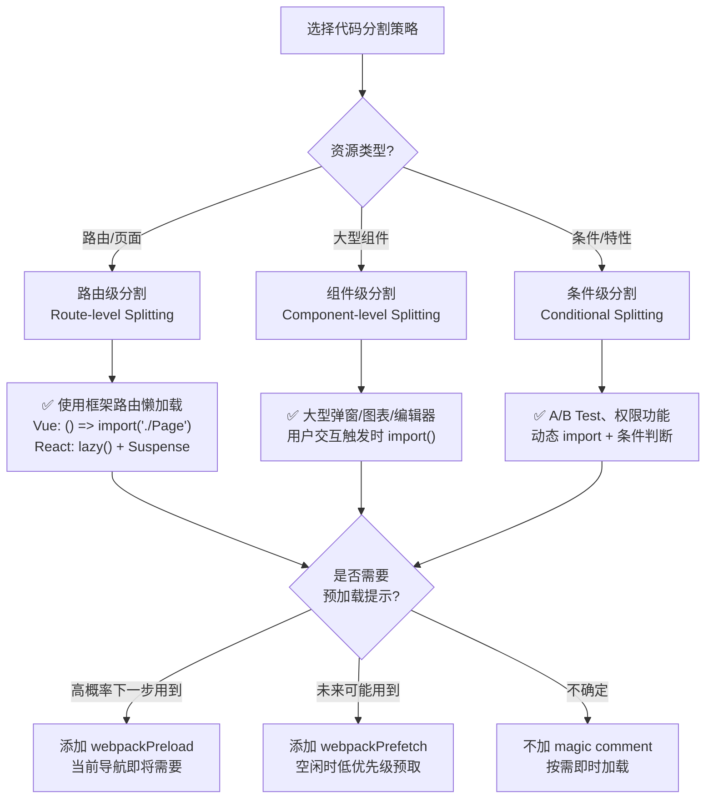

# 还有哪些值得学习的应用性能极致优化技巧？

| 维度 | v1 内容 | v2 新增/增强 | 变化类型
| ------|---------|-------------|---------
| **运行时优化** | Tree-Shaking、Scope Hoisting 基础介绍 | 新增：预加载/预获取(magic comments)、runtimeChunk 深度解析、CJS destructuring(v5.106+)、Shimming 三件套、量化收益表格 | **大幅扩展** |
| **加载优化** | 动态加载(import())基础、Hash 缓存规则、externals CDN | 新增：Code Splitting 策略矩阵、import.defer() 同步延迟求值、publicPath 自动检测、gzip/brotli 服务端压缩、代码分割决策流程图 | **大幅扩展** |
| **体积优化** | 无独立章节（散落在各处） | **全新章节**：CSS Purge(PurgeCSS)、Moment.js locale 忽略(IgnorePlugin)、Lodash tree-shaking(lodash-es)、图片 WebP/AVIF 格式转换 | **全新** |
| **体验优化** | performance 配置监控产物体积 | **全新章节**：ProgressPlugin 构建进度反馈、Error overlay 错误提示、devtool sourcemap 选择策略矩阵 | **全新** |
| **可视化** | 无 | 新增：**应用性能优化全景图**(Mermaid 技术树) + **代码分割策略选择流程图**(Mermaid 流程图) | **全新** |
| **结构** | 扁平化章节列表 | 按"运行时→加载→体积→体验"四维度层级组织，每项技术含「量化收益 + 适用场景」标准化描述 | **重构** |

---

## 引言

前面章节我们已经详细探讨了 Webpack 中如何使用分包、代码压缩提升应用执行性能。除此之外，还有大量普适且精细的优化方法，能够从不同层面有效降低应用体积、提升网络分发效率、改善开发体验。

本章将系统性地梳理这些优化技巧，按 **运行时性能 → 加载性能 → 体积优化 → 开发体验** 四个维度展开，每项技术均附带**量化收益评估**与**适用场景判断**，帮助你在实际项目中做出最优的技术选型。

> **核心观点**：现代 Web 应用的性能瓶颈主要集中在网络 I/O 层面。无论是 5G 高速网络还是 2G/3G 弱网环境，通过网络实现异地数据交换始终是相对低效的 IO 手段。因此，我们的优化目标应当聚焦于：**用最少的网络流量交付最大化的应用功能价值**。

先来看一张全局视图——



---

## 一、运行时性能优化

运行时性能优化关注的是**代码在浏览器中实际执行的效率**。这一层面的优化直接影响用户交互的流畅度和页面响应速度。

### 1.1 预加载与预获取 (webpackPrefetch / webpackPreload)

Webpack 通过 magic comments 提供两种资源提示机制，让浏览器在空闲时间提前加载未来可能需要的资源。

#### 1.1.1 Prefetch（预获取）

`webpackPrefetch` 会告诉浏览器：**这个资源可能在未来的某个导航或用户操作中用到，请在空闲时以低优先级预取**。

```js
import(
  /* webpackChunkName: "heavy-component" */
  /* webpackPrefetch: true */
  "./HeavyComponent"
);
```

**工作原理**：
- 在页面主资源加载完成后，浏览器会在空闲时段（idle time）以 `Lowest` 优先级下载 prefetch 资源
- 资源被放入 HTTP Cache，当用户真正触发 `import()` 时直接从缓存读取
- 使用 `<link rel="prefetch">` 标签实现（Chrome 支持）

**量化收益**：

| 指标 | 收益 | 说明
| ------|------|------
| 用户感知延迟 | ↓ 200~500ms | 资源已预缓存，点击即用 |
| 首屏阻塞 | 无影响 | 最低优先级，不竞争带宽 |
| 带宽消耗 | 轻微增加 | 仅空闲时下载 |

**适用场景**：
- ✅ 路由切换后才需要的页面组件
- ✅ 用户点击后才触发的重型功能模块
- ✅ 登录后才能访问的功能区
- ❌ 不适合首屏必需的资源

#### 1.1.2 Preload（预加载）

`webpackPreload` 与 Prefetch 的关键区别在于**优先级和时机**：

```js
import(
  /* webpackChunkName: "critical-async" */
  /* webpackPreload: true */
  "./CriticalAsyncComponent"
);
```

**核心差异对比**：

| 特性 | Prefetch | Preload
| ------|----------|---------
| 加载时机 | 父 chunk 加载完成后，浏览器空闲时 | 父 chunk 加载**同时**并行 |
| 优先级 | Lowest | High |
| 适用场景 | 未来可能需要 | 当前导航**即将**需要 |
| 浏览器支持 | Chrome/Firefox/Edge | 全现代浏览器 |

**适用场景**：
- ✅ 当前路由渲染完成后**极大概率**下一步要用到的资源
- ✅ 父组件依赖的子组件异步拆分
- ❌ 不要滥用——会抢占关键资源带宽

> ⚠️ **最佳实践**：大部分 SPA 场景下，`webpackPrefetch` 是更安全的选择。Preload 仅在你非常确定用户下一步行为时使用。

### 1.2 runtimeChunk — 提取运行时代码

#### 1.2.1 为什么需要 runtimeChunk？

Webpack 的 runtime 是一段负责**模块管理、异步加载、HMR** 等功能的引导代码。默认情况下，这段代码会被内联到每个 entry chunk 中。

问题在于：**任何异步 chunk 的变化都会引起包含 runtime 的入口 chunk 的 hash 变化**，导致长缓存失效。

```text
index.js (含 runtime)
├── 引用了 async-a.js 的路径
├── async-a.js 变化 → 路径变化
└── index.js 内容变化 → hash 变化 → 缓存失效！
```

#### 1.2.2 解决方案

通过 `optimization.runtimeChunk` 将 runtime 提取为独立文件：

```js
module.exports = {
  optimization: {
    runtimeChunk: {
      name: "runtime",
    },
  },
};
```

提取后的结构：

```text
dist/
├── runtime.[hash].js      ← 运行时代码（独立）
├── main.[contenthash].js  ← 业务代码（稳定 hash）
└── vendor.[contenthash].js ← 第三方代码（稳定 hash）
```

**量化收益**：

| 指标 | 收益 | 说明
| ------|------|------
| 缓存命中率 | ↑ 40%+ | 业务代码变更不影响 vendor/main 的 hash |
| runtime 体积 | ~2~5KB (gzipped ~1KB) | 额外的 HTTP 请求，但可接受 |
| 构建稳定性 | 显著提升 | 修改业务代码不会连带刷新第三方库缓存 |

**配置选项详解**：

```js
// 方式1：单 runtime 文件（推荐，所有 entry 共享）
optimization: {
  runtimeChunk: { name: "runtime" },
}

// 方式2：每个 entry 各自一个 runtime
optimization: {
  runtimeChunk: { name: entrypoint => `runtime-${entrypoint.name}` },
}

// 方式3：布尔值 true（等同于 'single'，所有 entry 共享一个 runtime chunk）
optimization: {
  runtimeChunk: true,
}
```

**适用场景**：
- ✅ 所有生产环境构建（强烈推荐）
- ✅ 多 entry 应用（利用浏览器并行下载）
- ✅ 需要精细化缓存策略的项目
- ❌ 单页 demo / 开发环境可暂不关注

### 1.3 Tree-Shaking 深度优化

Tree-Shaking 是一种基于 ES Module 静态分析的 Dead Code Elimination 技术。Webpack v5.107 在此领域持续增强，特别是 **v5.106+ 开始支持 CommonJS 解构赋值的 tree-shaking**。

#### 1.3.1 启动条件

Tree-Shaking 需要同时满足两个条件：

```js
// webpack.config.js
module.exports = {
  mode: "production",  // 条件1：启用优化（或手动设置 minimize: true）
  optimization: {
    usedExports: true, // 条件2：标记未使用的导出
  },
};
```

两个条件缺一不可：
- `usedExports: true` —— 告诉 Webpack 哪些 export 被 consume 了
- minimize / production mode —— 实际执行删除操作（由 Terser 完成）

#### 1.3.2 ESM 模块下的 Tree-Shaking

```js
// utils.js
export const usedFunc = () => "I am used";
export const unusedFunc = () => "I will be shaken off";

// main.js
import { usedFunc } from "./utils";
console.log(usedFunc());
```

经过 Tree-Shaking 后，`unusedFunc` 及其相关代码会被完全移除。

#### 1.3.3 sideEffects 标记 — 让 Tree-Shaking 更彻底

许多 npm 包在 `package.json` 中声明了 `sideEffects` 字段：

```json
{
  "name": "my-lib",
  "sideEffects": false,
  // 或精确指定有副作用的文件
  "sideEffects": ["*.css", "./src/special.js"]
}
```

**作用机制**：
- `sideEffects: false` —— 告诉 Webpack：「如果我的某个 export 没被导入，整个模块都可以安全移除」
- 不声明或设为 `true` —— Webpack 会保守处理，即使 export 未使用也保留模块（防止副作用丢失）

**对于你自己的库项目**，建议：

```json
{
  "sideEffects": [
    "*.css",
    "*.scss",
    "./src/polyfills.js"
  ]
}
```

**量化收益**：

| 场景 | 收益
| ------|------
| 正确标记 `sideEffects: false` | 未使用模块整体移除，而非仅删除未使用 export |
| 大型组件库（如 Ant Design） | 按需引入时可减少 **60~90%** 体积 |
| 含 CSS 的库 | 正确排除 `.css` 可避免样式丢失 |

#### 1.3.4 🔥 CJS 解构赋值的 Tree-Shaking (Webpack v5.106+)

这是一个重大更新！从 v5.106 开始，Webpack 支持对 **CommonJS 模块的解构赋值**进行 tree-shaking：

```js
// lodash (CommonJS)
module.exports = {
  map: function() { /* ... */ },
  filter: function() { /* ... */ },
  // 几百个工具函数...
};

// 你的代码 (v5.106+ 之前：整个 lodash被打包)
const { map } = require("lodash");

// v5.106+ 之后：只有 map 相关代码被打包！
const { map } = require("lodash");
```

**但请注意**：这种支持是**有限的**，仅对顶层解构赋值有效。对于深度嵌套的使用模式，仍建议使用 ESM 版本（如 `lodash-es`）。

**适用场景**：
- ✅ 无法迁移至 ESM 的遗留 CJS 库
- ✅ 只使用了 CJS 库的少量导出
- ❌ 复杂的 CJS 模块（动态属性访问等）仍无法 shaking

### 1.4 Scope Hoisting (ModuleConcatenation)

#### 1.4.1 原理

默认情况下，Webpack 将每个模块包装在一个独立的函数闭包中：

```js
// 打包前
// common.js
export default "common";

// index.js
import common from "./common";
console.log(common);

// 默认打包结果（每个模块一个闭包）
"./src/common.js":
  ((__unused_webpack_module, __webpack_exports__, __webpack_require__) => {
    const __WEBPACK_DEFAULT_EXPORT__ = ("common");
    __webpack_require__.d(__webpack_exports__, {
      "default": () => (__WEBPACK_DEFAULT_EXPORT__)
    });
  }),
"./src/index.js":
  ((__unused_webpack_module, __webpack_exports__, __webpack_require__) => {
    var _common__WEBPACK_IMPORTED_MODULE_0__ =
      __webpack_require__(/*! ./common */ "./src/common.js");
    console.log(_common__WEBPACK_IMPORTED_MODULE_0__)
  })
```

**Scope Hoisting 将所有符合条件的模块「扁平化」合并到一个函数作用域中**：

```js
// Scope Hoisting 后的结果
((__unused_webpack_module, __webpack_exports__, __webpack_require__) => {
  ;// CONCATENATED MODULE: ./src/common.js
  const common = ("common");
  
  ;// CONCATENATED MODULE: ./src/index.js
  console.log(common);
})
```

#### 1.4.2 开启方式

三种方式效果相同，最终都调用 `ModuleConcatenationPlugin`：

```js
// 方式1：production 模式自动开启
module.exports = { mode: "production" };

// 方式2：显式配置
module.exports = {
  optimization: {
    concatenateModules: true,
    usedExports: true,
  },
};

// 方式3：直接使用插件
const ModuleConcatenationPlugin = require("webpack/lib/optimize/ModuleConcatenationPlugin");
module.exports = {
  plugins: [new ModuleConcatenationPlugin()],
};
```

#### 1.4.3 失效场景与对策

| 失效原因 | 说明 | 解决方案
| ----------|------|----------
| **非 ESM 模块** | AMD/CJS/UMD 的动态导入导出无法静态分析 | 设置 `resolve.mainFields` 优先使用 ESM 版本 (`jsnext:main`, `module`) |
| **被多 Chunk 引用** | 模块被多个 entry 或 async chunk 共享时无法内联 | 此为正常行为，避免重复打包 |
| **eval devtool** | 使用 eval-source-map 时禁用 | 生产环境不使用 eval 类 sourcemap |
| **模块含副作用** | 被依赖模块可能有副作用 | 确保 `sideEffects` 正确标记 |

**强制 ESM 解析示例**：

```js
module.exports = {
  resolve: {
    mainFields: ["browser", "module", "jsnext:main", "main"],
  },
};
```

**量化收益**：

| 指标 | 收益 | 说明
| ------|------|------
| 产物体积 | ↓ 10~20% | 减少函数声明模板代码 |
| 运行时性能 | ↑ 模块查找效率 | 减少 `__webpack_require__` 调用链 |
| 可读性 | ↑ 提升 | 产物代码更接近源码逻辑 |

**适用场景**：
- ✅ 所有生产环境构建（production 模式默认开启）
- ✅ 项目主要使用 ESM 语法
- ✅ 依赖了较多小型工具模块

### 1.5 Shimming — 模块兼容性填充

当项目中使用了非模块化规范的第三方库（如全局变量依赖的 jQuery 插件），或者需要在模块中注入全局变量时，Shimming 技术可以解决兼容性问题。

#### 1.5.1 ProvidePlugin — 全局变量自动注入

将模块自动注入到每个模块的作用域中，无需手动 import：

```js
const webpack = require("webpack");

module.exports = {
  plugins: [
    new webpack.ProvidePlugin({
      // 遇到 $ 时自动从 jquery 加载
      $: "jquery",
      jQuery: "jquery",
      // 遇到 _ 时自动从 lodash 加载
      _: "lodash",
    }),
  ],
};
```

之后在任何模块中可以直接使用 `$`、`jQuery`、`_`，无需 import：

```js
// 无需 import，直接使用
$("#app").text("Hello");
console.log(_.map([1, 2, 3], x => x * 2));
```

#### 1.5.2 imports-loader — 改变模块的 this 指向

某些旧库依赖 `this` 为 `window` 对象：

```js
module.exports = {
  module: {
    rules: [
      {
        test: require.resolve("some-old-library"),
        use: "imports-loader?this=>window",
      },
    ],
  },
};
```

#### 1.5.3 BannerPlugin — 在产物顶部注入声明注释

```js
new webpack.BannerPlugin("Banner text at top of file"),
```

BannerPlugin 会在每个产物文件顶部注入一段注释，常用于版权声明、构建信息标注。若需求是**在模块内部注入变量/代码**，应使用上文 ProvidePlugin 或 imports-loader/exports-loader。

**适用场景**：
- ✅ 接入 jQuery 插件等依赖全局变量的旧库
- ✅ 遗留项目的渐进式模块化改造
- ✅ 需要在全局注入 polyfill 或工具函数

---

## 二、加载性能优化

加载性能优化关注的是**资源从服务器到达浏览器的过程**。目标是减少首屏资源量、提升资源加载并行度、最大化缓存利用率。

### 2.1 Code Splitting 策略矩阵

代码分割是 Webpack 性能优化的核心手段。不同的分割粒度适用于不同场景：



#### 2.1.1 路由级分割（最常用）

配合前端路由框架，按页面拆分 bundle：

```js
// Vue Router
const routes = [
  {
    path: "/dashboard",
    component: () =>
      import(/* webpackChunkName: "dashboard" */ "./views/Dashboard.vue"),
  },
  {
    path: "/settings",
    component: () =>
      import(/* webpackChunkName: "settings" */ "./views/Settings.vue"),
  },
];

// React Router
const Dashboard = React.lazy(() =>
  import(/* webpackChunkName: "dashboard" */ "./pages/Dashboard")
);

function App() {
  return (
    <Suspense fallback={<Loading />}>
      <Routes>
        <Route path="/dashboard" element={<Dashboard />} />
      </Routes>
    </Suspense>
  );
}
```

**量化收益**：

| 指标 | 收益
| ------|------
| 首屏 JS 体积 | ↓ 30~70%（取决于路由数量） |
| 首次内容绘制(FCP) | ↓ 0.5~2s |
| 可交互时间(TTI) | 显著提升 |

#### 2.1.2 组件级分割

针对大型组件（富文本编辑器、复杂图表、巨型弹窗）：

```js
class HeavyModal extends React.Component {
  state = { ModalComponent: null };

  handleClick = async () => {
    const { default: Modal } = await import(
      /* webpackChunkName: "heavy-modal" */ "./HeavyModalContent"
    );
    this.setState({ ModalComponent: Modal });
  };

  render() {
    const { ModalComponent } = this.state;
    return (
      <>
        <button onClick={this.handleClick}>打开重型弹窗</button>
        {ModalComponent && <ModalComponent />}
      </>
    );
  }
}
```

#### 2.1.3 条件级分割

基于运行时条件的动态导入：

```js
async function loadFeature() {
  if (user.isAdmin) {
    const adminModule = await import(
      /* webpackChunkName: "admin-features" */ "./admin"
    );
    return adminModule;
  }
  const userModule = await import(
    /* webpackChunkName: "user-features" */ "./user"
  );
  return userModule;
}
```

#### 2.1.4 Chunk 分组管理

使用 `webpackChunkName` 将关联模块打包到同一 chunk：

```js
// 相同 name 的 import() 会被合并
import(/* webpackChunkName: "sub-pages" */ "./Foo.vue");
import(/* webpackChunkName: "sub-pages" */ "./Bar.vue");
import(/* webpackChunkName: "sub-pages" */ "./Baz.vue");

// 结果：生成 sub-pages.js 一个文件，包含三个组件
```

### 2.2 import() 动态加载深入解析

#### 2.2.1 基本用法

```js
// 基础用法
const module = await import("./module");
module.default(); // 默认导出
module.namedExport(); // 命名导出

// Promise 用法
import("./module").then((module) => {
  module.doSomething();
});
```

#### 2.2.2 注意事项

**⚠️ 过度细碎问题**：每次 `import()` 都会产生额外的 chunk 文件和约 **2.5KB 的 runtime 代码**。如果动态加载的模块本身小于这个 runtime 体积，反而得不偿失。

**经验法则**：动态加载的单模块建议 **> 5KB（未压缩）**，否则考虑合并到其他 chunk。

### 2.3 🔥 import.defer() — 同步延迟求值 (experiments.deferImport)

Webpack v5 引入了实验性的 `import.defer()` 功能，提供了一种介于同步 import 和异步 `import()` 之间的新选择。

#### 2.3.1 核心概念

```js
// 普通 import() — 异步，返回 Promise
const mod = await import("./heavy"); // 需要等待加载完成

// import defer — 同步语法，延迟求值（对应 TC39 deferred module evaluation 提案）
import defer * as counter from "./counter";
// ↑ 同步执行，立即获得模块命名空间的代理对象
// ↑ 模块实际代码在首次访问属性（如 counter.increment()）时才执行
```

#### 2.3.2 启用方式

```js
module.exports = {
  experiments: {
    deferImport: true,  // 启用 import.defer() 支持
  },
};
```

#### 2.3.3 与普通 import() 的区别

| 特性 | `import()` | `import.defer()`
| ------|-----------|-----------------
| 语法 | 异步，返回 Promise | **同步**，返回 Proxy 对象 |
| 模块执行时机 | `await` 时立即执行 | **首次访问属性时**惰性执行 |
| 代码组织 | 需要 async/await 包裹 | 可在同步上下文中使用 |
| 适用场景 | 路由懒加载、事件回调 | 条件性依赖、可选功能 |

**适用场景**：
- ✅ 模块的加载与否取决于后续逻辑分支
- ✅ 不想引入 async/await 的同步上下文
- ✅ 可选依赖（可能根本不会被用到）
- ⚠️ 实验性功能，API 可能变动

### 2.4 CDN 部署与 publicPath 自动检测

#### 2.4.1 externals + CDN

将大型稳定的第三方库排除出打包，改用 CDN 加载：

```js
module.exports = {
  externals: {
    react: "React",
    "react-dom": "ReactDOM",
    lodash: "_",
  },
  output: {
    publicPath: "https://cdn.example.com/assets/",
  },
};
```

HTML 中通过 CDN 引入：

```html
<script crossorigin src="https://unpkg.com/react@18/umd/react.production.min.js"></script>
<script crossorigin src="https://unpkg.com/react-dom@18/umd/react-dom.production.min.js"></script>
<script crossorigin src="https://unpkg.com/lodash@4.17.21/lodash.min.js"></script>
```

**量化收益**：

| 指标 | 收益
| ------|------
| 自身 bundle 体积 | ↓ 100KB+（React + ReactDOM） |
| CDN 并行加载 | 多域名并行，不受 HTTP 连接数限制 |
| 跨应用缓存 | 用户访问同 CDN 的其他站点时可直接复用 |
| 首次加载 | 可能稍慢（DNS/TLS）；后续访问显著加快 |

#### 2.4.2 publicPath 自动检测

Webpack 5 支持运行时自动推断 `publicPath`：

```js
module.exports = {
  output: {
    publicPath: "auto",  // 根据 script 标签 src 或 document.currentScript 自动推断
  },
};
```

这在使用动态部署（如 Docker/Kubernetes）或不确定最终部署路径的场景下非常有用。

### 2.5 服务端压缩：gzip / brotli

#### 2.5.1 为什么需要服务端压缩？

Webpack 的 `CompressionPlugin` 可以在构建时预生成 `.gz` / `.br` 文件，服务端根据请求头 `Accept-Encoding` 直接返回压缩版本，避免实时压缩的 CPU 开销。

#### 2.5.2 gzip 配置

```js
const CompressionPlugin = require("compression-webpack-plugin");

module.exports = {
  plugins: [
    new CompressionPlugin({
      algorithm: "gzip",
      threshold: 10240,      // >10KB 才压缩
      minRatio: 0.8,         // 压缩率 < 80% 才保留
      test: /\.(js|css|html|svg)$/,
    }),
  ],
};
```

#### 2.5.3 brotli 配置（压缩率更高）

```js
const CompressionPlugin = require("compression-webpack-plugin");

module.exports = {
  plugins: [
    new CompressionPlugin({
      algorithm: "brotliCompress",
      filename: "[path][base].br[query]",
      threshold: 10240,
      minRatio: 0.8,
      compressionOptions: { level: 11 },  // brotli 最高级别
    }),
  ],
};
```

**量化收益对比**：

| 格式 | 压缩率 | 编码速度 | 解码速度 | 浏览器支持
| ------|--------|----------|----------|-----------
| 无压缩 | 0% (基准) | - | - | 100% |
| gzip | **60~75%↓** | 快 | 很快 | 几乎所有 |
| brotli | **70~85%↓** | 较慢 | 快 | 现代浏览器 |

**Nginx 配合示例**：

```11-Nginx基础概述
http {
    # gzip 静态文件
    gzip_static on;

    # brotli 静态文件（需安装 ngx_brotli 模块）
    brotli_static on;

    # 回退到实时压缩
    gzip on;
    gzip_types text/plain application/javascript text/css;
}
```

**适用场景**：
- ✅ 所有生产环境（强烈推荐至少开启 gzip）
- ✅ 静态资源托管在 Nginx/CDN 上
- ✅ JS/CSS 文件 > 10KB

---

## 三、体积优化

体积优化关注的是**减少最终产物的字节数**。每一 KB 的减少在网络传输中都意味着实实在在的时间节省。

### 3.1 CSS Purge — 移除未使用的样式

即使使用了 Tree-Shaking 移除未使用的 JavaScript，CSS 中的无用样式仍会被完整打包。PurgeCSSWebpackPlugin 可以扫描代码和模板，移除未被引用的 CSS 规则。

#### 3.1.1 配置方式

```js
const { PurgeCSSPlugin } = require("purgecss-webpack-plugin");
const glob = require("glob-all");
const path = require("path");

module.exports = {
  plugins: [
    new PurgeCSSPlugin({
      paths: glob.sync([
        path.join(__dirname, "src/**/*.js"),
        path.join(__dirname, "src/**/*.jsx"),
        path.join(__dirname, "src/**/*.vue"),
        path.join(__dirname, "src/**/*.html"),
        // 如果使用 Tailwind CSS，还需要扫描配置文件
        path.join(__dirname, "tailwind.config.js"),
      ]),
      safelist: {
        // 保护不能被移除的动态类名
        standard: [/^alert-/, /^is-/],
        deep: [/^modal-/],
        greedy: [/^slider/],
      },
    }),
  ],
};
```

#### 3.1.2 与 Tailwind CSS 配合

Tailwind CSS 生成的样式体积极大（未 purge 前可达数 MB），必须配合 PurgeCSS：

```js
// postcss.config.js
module.exports = {
  plugins: [
    require("tailwindcss"),
    require("@fullhuman/postcss-purgecss")({
      content: ["./src/**/*.html", "./src/**/*.js", "./src/**/*.vue"],
      defaultExtractor: (content) => content.match(/[\w-/:]+(?<!:)/g) || [],
    }),
  ],
};
```

**量化收益**：

| 场景 | Purge 前 | Purge 后 | 收益
| ------|----------|----------|------
| Tailwind CSS (全量) | ~3MB+ | ~10~30KB | **↓ 99%** |
| Bootstrap (全量) | ~150KB | ~15~40KB | **↓ 73~90%** |
| 自定义大型 CSS | 取决于使用率 | 仅保留使用部分 | **↓ 60~90%** |

**适用场景**：
- ✅ 使用 Tailwind CSS / Bootstrap 等原子/大型 CSS 框架
- ✅ 项目中有大量历史遗留 CSS
- ✅ 组件库按需引入
- ❌ 动态拼接类名的场景需要仔细配置 safelist

### 3.2 Moment.js Locale 忽略

Moment.js 默认内置了 **数十种语言包（约 300KB）**，绝大部分项目只需要其中一两种。

#### 3.2.1 IgnorePlugin 方案

```js
const webpack = require("webpack");

module.exports = {
  plugins: [
    // 忽略 moment.js 的所有 locale 文件
    new webpack.IgnorePlugin({
      resourceRegExp: /^\.\/locale$/,
      contextRegExp: /moment$/,
    }),
  ],
};
```

然后手动引入需要的语言：

```js
import moment from "moment";
import "moment/locale/zh-cn";  // 只引入中文

moment.locale("zh-cn");
```

**量化收益**：

| 指标 | 收益
| ------|------
| Moment.js 体积 | 从 ~350KB 降至 ~70KB（仅英文）或 ~75KB（+ 一种语言） |
| 减少比例 | **↓ ~78%** |

**更好的替代方案**：如果项目刚开始，建议直接使用 **dayjs**（~2KB）或 **date-fns**（按需引入，tree-shakable）替代 Moment.js。

### 3.3 Lodash Tree-Shaking (lodash-es)

#### 3.3.1 问题

原始的 `lodash` 是 CommonJS 格式，无法被有效 tree-shaking：

```js
// 即使只用了一个函数
import _ from "lodash";  // 整个 lodash (~70KB gzipped ~24KB) 都被打包
_.map([1, 2, 3], x => x * 2);
```

#### 3.3.2 解决方案：lodash-es

`lodash-es` 是 Lodash 的 ESM 版本，完美支持 tree-shaking：

```bash
npm install lodash-es
```

```js
// 只打包 map 函数及其依赖 (~几 hundred bytes)
import { map } from "lodash-es";
map([1, 2, 3], x => x * 2);
```

**量化收益对比**：

| 方式 | 体积 (gzip) | 使用单个函数时的体积
| ------|------------|-------------------
| `lodash` (全量) | ~24 KB | ~24 KB |
| `lodash-es` (ESM) | ~24 KB (全量引用) | **~0.5~2 KB** (仅引用所需) |
| `lodash/map` (单函数) | - | ~0.5 KB |

**收益**：使用 `lodash-es` + 按需引入，可减少 **70~95%** 的 Lodash 相关体积。

**适用场景**：
- ✅ 项目中使用了 Lodash
- ✅ 只使用了 Lodash 的少量函数
- ✅ 已使用或可迁移至 ESM import 语法

### 3.4 图片格式转换：WebP / AVIF

现代图片格式相比传统 JPEG/PNG 能在相同画质下显著减小体积。

#### 3.4.1 Webpack 配置方案

使用 `image-webpack-loader` 进行构建时转换：

```js
module.exports = {
  module: {
    rules: [
      {
        test: /\.(png|jpe?g|gif)$/i,
        type: "asset/resource", // Webpack 5 内置 Asset Modules，替代 file-loader
        generator: {
          filename: "images/[name].[hash][ext]",
        },
      },
    ],
  },
};
```

压缩可通过 loader 链前置于资源处理：

```js
// webpack.config.js（接上例）
module.exports = {
  module: {
    rules: [
      {
        test: /\.(png|jpe?g|gif)$/i,
        type: "asset/resource",
        generator: { filename: "images/[name].[hash][ext]" },
        use: [
          {
            loader: "image-webpack-loader",
            options: {
              mozjpeg: { progressive: true, quality: 75 },
              optipng: { enabled: false },
              pngquant: { quality: [0.65, 0.9], speed: 4 },
              webp: { quality: 75 },
            },
          },
        ],
      },
    ],
  },
};
```

> 也可以使用社区更活跃的 `image-minimizer-webpack-plugin`（含 sharp 引擎），详见《图像加载原理与实践》一章。

#### 3.4.2 更推荐：`<picture>` + 多格式响应式

在 HTML/模板中使用 `<picture>` 标签让浏览器自动选择最优格式：

```html
<picture>
  <source srcset="image.avif" type="image/avif" />
  <source srcset="image.webp" type="image/webp" />
  
</picture>
```

**量化收益**：

| 格式 | 相对 JPEG 体积 | 浏览器支持
| ------|---------------|-----------
| JPEG (基准) | 100% | 全部 |
| WebP | **25~35%↓** | 主流浏览器（2020+） |
| AVIF | **45~50%↓** | Chrome/Firefox/Edge（2021+）|

**适用场景**：
- ✅ 图片资源占比大的项目（电商、媒体、社交）
- ✅ 目标用户使用现代浏览器
- ✅ 需要优化 Core Web Vitals (LCP 指标)

---

## 四、体验优化

体验优化关注的是**开发者在使用 Webpack 构建过程中的效率和舒适度**。好的工具体验能显著提升开发效率。

### 4.1 ProgressPlugin — 构建进度反馈

对于大型项目，构建过程可能耗时数十秒甚至数分钟。ProgressPlugin 可以在终端显示详细的构建进度条：

```js
const webpack = require("webpack");

module.exports = {
  plugins: [
    new webpack.ProgressPlugin({
      profile: false,       // 是否收集性能剖析数据
      entries: true,        // 显示 entry 计数
      modules: true,        // 显示 module 计数
      modulesCount: 5000,   // 最少 modules 数才显示
      dependencies: true,   // 显示 dependency 计数
      dependenciesCount: 10000, // 最少 dependencies 数才显示
      percentBy: "entries", // 进度计算依据: 'entries' | 'modules'
    }),
  ],
};
```

**输出效果**：

```text
0% building
10% building 1/1 entries
50% building 2/ modules (3/5)
80% building 5/ modules (12/15)
95% emitting
98% after emitting
100%
```

**进阶用法**：结合自定义报告插件（如 `webpack-bundle-analyzer`）可视化产物构成：

```bash
npm install --save-dev webpack-bundle-analyzer
```

```js
const BundleAnalyzerPlugin = require("webpack-bundle-analyzer")
  .BundleAnalyzerPlugin;

module.exports = {
  plugins: [
    new BundleAnalyzerPlugin({
      analyzerMode: "static",  // 生成 HTML 报告
      openAnalyzer: false,     // 不自动打开浏览器
    }),
  ],
};
```

**适用场景**：
- ✅ 大型项目（构建时间 > 10s）
- ✅ 需要定位产物体积来源
- ✅ CI/CD 流水线中监控构建状态

### 4.2 Error Overlay — 错误提示

Webpack Dev Server 内置了 Error Overlay 功能，编译错误时会以覆盖层形式展示在浏览器中：

```js
module.exports = {
  devServer: {
    client: {
      overlay: {
        errors: true,   // 显示编译错误
        warnings: false, // 是否显示警告
      },
    },
  },
};
```

**效果**：当代码出错时，浏览器页面上会出现一个浮层，精确显示：
- 错误文件名和行号
- 错误信息堆栈
- 编辑器跳转链接（部分 IDE 支持）

**适用场景**：
- ✅ 所有开发环境（推荐开启 errors）
- ⚠️ 生产环境不需要此功能

### 4.3 devtool Sourcemap 选择策略

Sourcemap 让你能在浏览器中调试原始源码而非打包后的代码。不同的 `devtool` 配置在**构建速度**和**调试质量**之间有不同的权衡。

#### 4.3.1 选型矩阵

| devtool | 构建速度 | 重建速度 | 生产可用 | 质量 | 推荐场景
| ---------|----------|----------|----------|------|----------
| `(false)` | 🔥最快 | 🔥最快 | ✅ | 无 | 生产环境（配合外部 sourcemap 服务） |
| `nosources-source-map` | 🟢快 | 🟢快 | ✅ | ⭐⭐ | 生产环境（隐藏源码但保留栈信息） |
| `hidden-source-map` | 🟢快 | 🟢快 | ✅ | ⭐⭐ | 生产环境（生成 .map 但不引用） |
| `source-map` | 🟡中等 | 🟡中等 | ✅ | ⭐⭐⭐⭐⭐ | 生产环境（完整调试能力） |
| `eval-source-map` | 🟠较慢 | 🔥最快 | ❌ | ⭐⭐⭐⭐ | **开发环境（推荐）** |
| `eval-cheap-module-source-map` | 🟠较慢 | 🔥很快 | ❌ | ⭐⭐⭐ | **开发环境（大型项目推荐）** |
| `cheap-module-source-map` | 🟡中等 | 🟡中等 | ❌ | ⭐⭐⭐ | 开发环境 |
| `cheap-source-map` | 🟢快 | 🟢快 | ❌ | ⭐⭐ | 开发环境（只需行信息） |
| `eval` | 🔥最快 | 🔥最快 | ❌ | ⭐ | 开发环境（最简）|

#### 4.3.2 关键选项解释

**`cheap`**：不包含列信息（column），映射只到行级。构建更快，sourcemap 更小。

**`module`**：包含 loader 的 sourcemap（如 TypeScript → JavaScript、SCSS → CSS 的映射）。没有此选项只能看到转换后的代码。

**`eval`**：使用 `eval()` 执行每个模块，最快但不生成单独的 .map 文件。

**`nosources`**：sourcemap 中不包含原始源码内容，只有行号映射。适合不想暴露源码的生产环境。

#### 4.3.3 推荐配置

```js
module.exports = (env, argv) => {
  const isDev = argv.mode === "development";

  return {
    devtool: isDev
      ? "eval-cheap-module-source-map"  // 开发：快速重建 + loader 映射
      : "source-map",                    // 生产：完整映射（上传到错误监控服务）
  };
};
```

**生产环境 Sourcemap 安全实践**：

```js
// 生产环境：生成 sourcemap 但不上传到 CDN
const isProd = process.env.NODE_ENV === "production";

module.exports = {
  devtool: isProd ? "hidden-source-map" : "eval-cheap-module-source-map",
  // hidden-source-map 生成 .map 文件但不被引用
  // 可单独上传到 Sentry/Rollbar 等错误监控平台
};
```

---

## 五、HTTP 缓存优化（Hash 策略）

### 5.1 Hash 占位符详解

Webpack 提供三种 Hash 占位符，精细度递增：

| 占位符 | 影响范围 | 变化频率 | 推荐度
| --------|----------|----------|--------
| `[fullhash]` | 整个项目 | 任意文件变化 | ❌ 太激进 |
| `[chunkhash]` | 单个 Chunk | Chunk 内任意模块变化 | ⚠️ 受 runtime 影响 |
| `[contenthash]` | **单个产物文件** | 仅该文件内容变化 | ✅ **强烈推荐** |

### 5.2 最佳实践配置

```js
const path = require("path");
const MiniCssExtractPlugin = require("mini-css-extract-plugin");

module.exports = {
  mode: "production",
  output: {
    filename: "[name].[contenthash:8].js",   // 8位 hash 足够防碰撞
    path: path.resolve(__dirname, "dist"),
  },
  optimization: {
    runtimeChunk: "single",  // 提取 runtime，避免连带更新
    splitChunks: {
      chunks: "all",
      cacheGroups: {
        vendor: {
          test: /[\\/]node_modules[\\/]/,
          name: "vendor",
          chunks: "all",
        },
      },
    },
  },
  plugins: [
    new MiniCssExtractPlugin({
      filename: "[name].[contenthash:8].css",
    }),
  ],
};
```

**生成的文件结构**：

```css
dist/
├── runtime.a1b2c3d4.js        ← runtime（极少变化，可长缓存）
├── main.e5f6g7h8.js           ← 入口代码
├── vendor.i9j0k1l2.js         ← 第三方库（稳定）
├── styles.m3n4o5p6.css        ← 样式文件
└── sub-page.q7r8s9t0.js       ← 异步 chunk
```

配合 Nginx 长缓存策略：

```11-Nginx基础概述
location ~* \.(js|css|png|jpg|jpeg|gif|ico|svg|woff2?)$ {
    expires 1y;
    add_header Cache-Control "public, immutable";
}
```

**量化收益**：

| 指标 | 收益
| ------|------
| 回访用户请求数 | ↓ 60~90%（资源命中缓存） |
| 服务器带宽成本 | 显著降低 |
| 用户体验 | 回访秒开 |

---

## 六、产物体积监控

### 6.1 performance 配置

Webpack 内置了体积预算功能，超过阈值时发出警告或报错：

```js
module.exports = {
  performance: {
    maxAssetSize: 172 * 1024,       // 单个文件上限 172KB
    maxEntrypointSize: 244 * 1024,  // 入口总大小上限 244KB
    hints: "error",                 // 'warning' | 'error' | false
    assetFilter: (assetFilename) => {
      return assetFilename.endsWith(".js");  // 只监控 JS
    },
  },
};
```

### 6.2 经验法则阈值

基于 Web Vitals 的经验参考：

| 资源类型 | 建议上限 | 说明
| ----------|----------|------
| 关键路径总资源 | **< 170KB** (gzip 前) | Google 推荐的关键渲染路径预算 |
| 单个 JS chunk | < 244KB | Webpack 默认警告阈值（250000 字节） |
| 单个 Entry 总计 | < 244KB | Webpack 默认警告阈值（250000 字节） |
| 首屏 CSS | < 50KB | 阻塞渲染的关键 CSS |
| 单张图片 | < 200KB | 超过建议懒加载或使用响应式 |

> 💡 **重要提示**：performance hints 不会阻断构建，只是输出警告/错误信息。建议在 CI 中将其设置为 `"error"` 以便及时发现问题。

---

## 七、总结与决策指南

### 7.1 优化技术速查表

| 优先级 | 技术 | 维度 | 收益 | 复杂度
| --------|------|------|------|--------
| 🔴 P0 | Production Mode | 运行时 | 自动启用全部优化 | 零配置 |
| 🔴 P0 | Tree-Shaking | 体积 | ↓ 20~60% 死代码 | 低 |
| 🔴 P0 | Scope Hoisting | 运行时 | ↓ 10~20% 闭包开销 | 零配置(prod) |
| 🔴 P0 | Code Splitting | 加载 | ↓ 首屏 30~70% | 中 |
| 🟠 P1 | runtimeChunk | 加载 | ↑ 缓存命中率 40%+ | 低 |
| 🟠 P1 | contenthash | 加载 | ↑ 长缓存利用率 | 低 |
| 🟠 P1 | gzip/brotli | 加载 | ↓ 传输 60~80% | 低 |
| 🟠 P1 | 路由懒加载 | 加载 | ↓ 首屏 50%+ | 中 |
| 🟡 P2 | Prefetch/Preload | 运行时 | ↓ 加载 200~500ms | 低 |
| 🟡 P2 | CSS Purge | 体积 | ↓ 样式 60~90% | 中 |
| 🟡 P2 | CDN externals | 加载 | ↓ 重复加载 | 中 |
| 🟡 P2 | lodash-es | 体积 | ↓ 70~95% | 低 |
| 🔵 P3 | Moment.js Ignore | 体积 | ↓ ~300KB | 低 |
| 🔵 P3 | WebP/AVIF | 体积 | ↓ 图片 25~50% | 中 |
| 🔵 P3 | import.defer() | 加载 | ↓ 首屏阻塞 | 中(实验性) |
| 🔵 P3 | Sourcemap 策略 | 体验 | 平衡调试 vs 体积 | 低 |

### 7.2 核心原则

1. **先测量再优化**：使用 `webpack-bundle-analyzer`、Lighthouse、Web Vitals 了解现状
2. **优先做 ROI 高的事**：Production Mode + Tree-Shaking + Code Splitting 三板斧能解决大部分问题
3. **避免过早优化**：不是所有项目都需要 CDN externals 或图片格式转换
4. **关注用户体验指标**：FCP、LCP、CLS、TTI 比 bundle 大小更重要
5. **软件世界没有银弹**：过度优化可能增加复杂度、降低可维护性

---

## 思考题

1. **为何 Tree-Shaking 强依赖于 ESM 模块方案？** ESM 与 AMD、CMD、CommonJS 在静态分析能力上有何本质区别？Webpack v5.106+ 的 CJS destructuring 支持是如何绕过这一限制的？
2. **在什么情况下 Scope Hoisting 会失效？** 当你的项目大量依赖 CommonJS 格式的 npm 包时，有哪些策略可以最大化 Scope Hoisting 的覆盖率？
3. **`import.defer()` 与 `import()` 的本质区别是什么？** 在哪些场景下你会选择前者而不是后者？
4. **如果你的项目首屏加载时间（FCP）超过了 3 秒，你会按照什么顺序依次尝试本章中的哪些优化手段？请给出你的优化路线图。**
