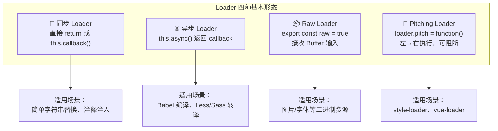
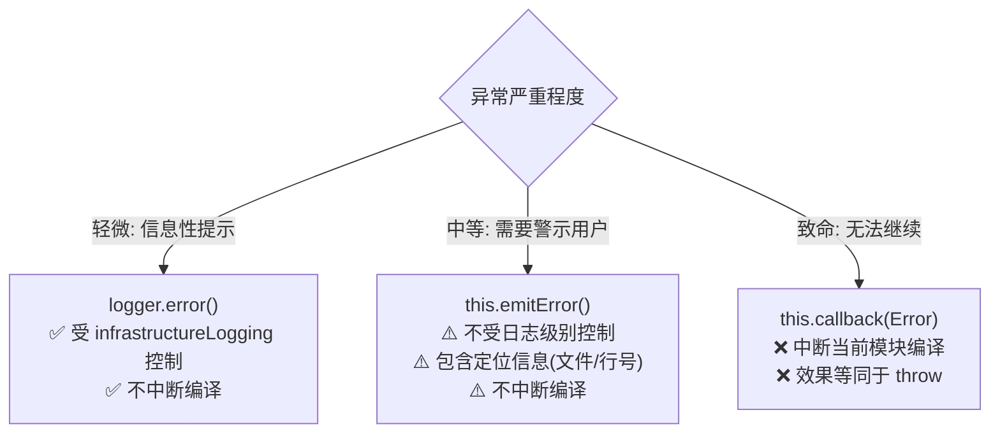
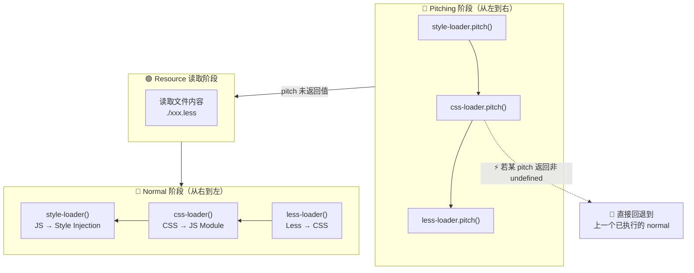
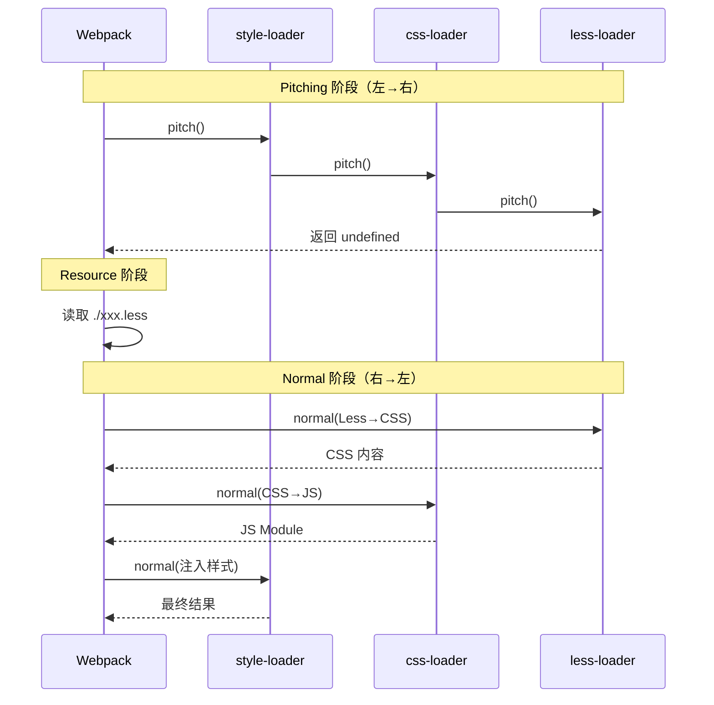
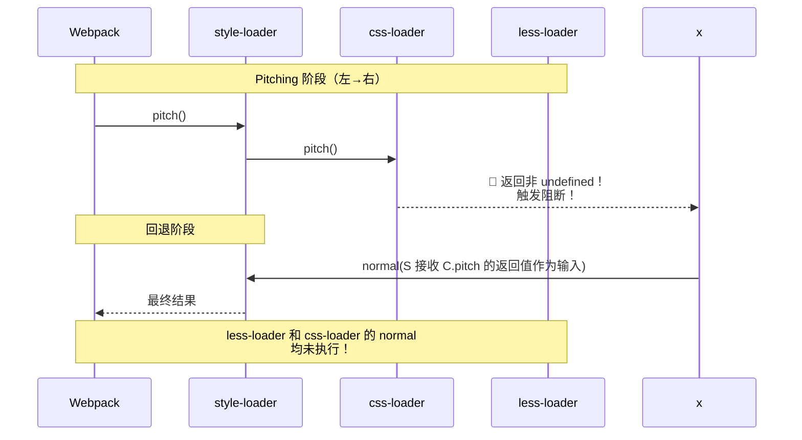
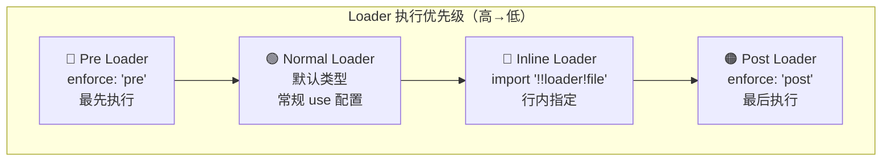
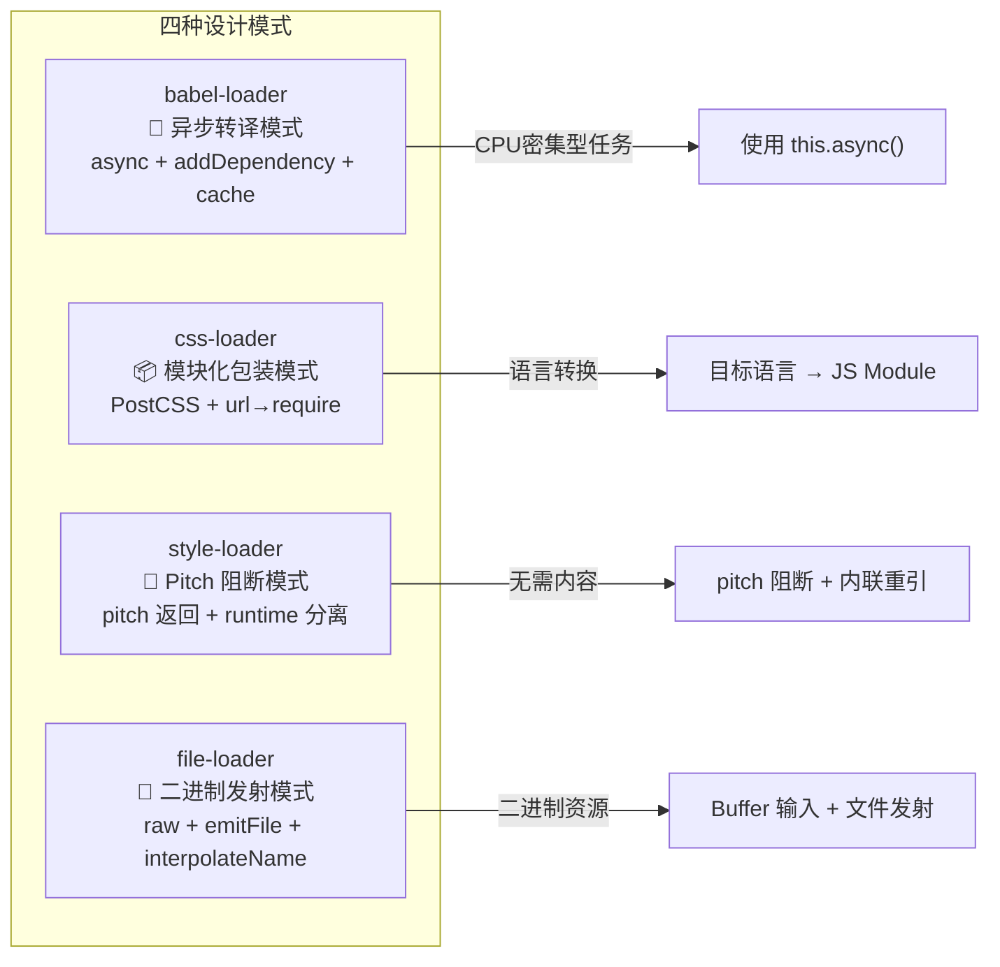
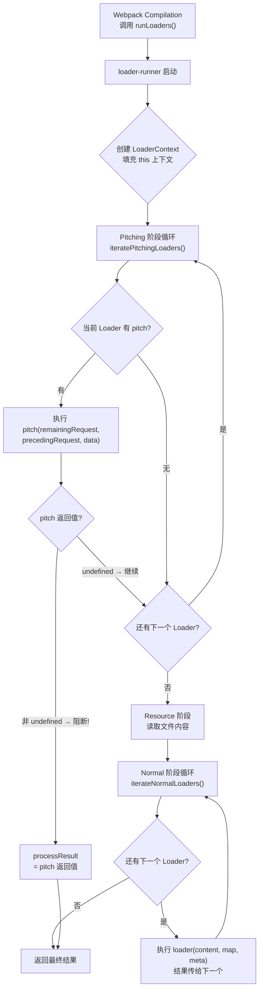

# Loader 开发基础：从开源项目学到的 Loader 开发技巧


## 差异对照表：v1 → v2

| 维度 | v1（原始文档） | v2（本文档）
| ------|---------------|-------------
| **Webpack 版本** | v5.x（未明确） | **v5.107** |
| **选项获取** | `this.getOptions()` / `loader-utils` 的 `getOptions` | **`this.getOptions(schema)`** 内置类型安全校验，替代 `loader-utils` |
| **Loader 函数签名** | `(source, sourceMap?, data?)` | **`(content: string\|Buffer, map?: SourceMap, meta?: any)`** — 参数名规范化 |
| **LoaderContext 属性** | 列举部分常用属性 | **完整全景图**（Mermaid），覆盖全部 30+ 属性，含 v5.32+ `importModule`、v5.95+ hash 系列、`hot`、`environment`、`getResolve` 等 |
| **执行流程** | 文字描述 + 截图 | **Mermaid 双阶段流程图**（Pitching → Resource → Normal），精确标注阻断逻辑 |
| **知名 Loader 分析** | 片段引用（raw-loader / eslint-loader / less-loader / file-loader / style-loader） | **4 个完整设计模式提炼**：babel-loader（异步转译）、css-loader（模块化包装）、style-loader（pitch 阻断）、file-loader（二进制发射） |
| **开发模板** | 最小示例（无测试） | **完整骨架 + 单元测试**（Jest + memory-fs + loader-runner） |
| **validate 机制** | 未涉及 | **新增 compiler.hooks.validate + compiler.validate()（v5.106+）** |
| **loader-runner** | 提及名称 | **内部执行流程深度剖析** |
| **架构图** | 无 | **LoaderContext 属性分类 Mermaid 图** |

---

如何扩展 Webpack？有两种主流方式：一是 **Loader** —— 主要负责将资源内容翻译成 Webpack 能够理解、处理的 JavaScript 代码；二是 **Plugin** —— 深度介入 Webpack 构建过程，**重塑**构建逻辑。

相对而言，Loader 的职责更单一，入门成本相对较低。

接下来我将集中介绍"**如何开发一个 Loader**"，由于内容较多，本文聚焦于基础核心：

- Loader 的基本形态与输入输出（**已更新至 v5.107 签名规范**）
- **LoaderContext 上下文接口全景图**（含 Mermaid 分类图谱）
- 如何使用上下文接口，并结合 **4 个知名开源项目**展开讲解
- **Loader 执行流程双阶段模型**（Pitching + Normal，含 Mermaid 流程图）
- **为 Loader 编写单元测试**（完整可运行模板）
- **从开源源码中提炼的设计模式**

## 为什么需要 Loader？

为什么 Webpack 需要设计出 Loader 这一扩展方式？本质上是因为计算机世界中的文件资源格式实在太多，不可能一一穷举。何不将"**解析**"资源这部分任务开放出去，由第三方实现呢？Loader 正是为了将文件资源的"读"与"处理"逻辑解耦——Webpack 内部只需实现对标准 JavaScript 代码解析/处理能力，由第三方开发者以 Loader 方式补充对特定资源的解析逻辑。

> **提示**：Webpack 5 之后增加了 Parser 对象，事实上已经内置支持图片、JSON、WASM 等格式的内容，不过这并不影响我们对 Loader 这一概念的理解。

### Loader 的基本形态

实现上，Loader 本质是一个导出函数的 JavaScript 模块。**Webpack v5.107 官方定义的标准函数签名**如下：

```ts
/**
 * @param {string|Buffer} content - 资源文件内容（第一个 Loader 为原始内容，后续为前一个 Loader 的输出）
 * @param {SourceMap} [map] - 可选的 SourceMap 数据
 * @param {any} [meta] - 可选的任意元数据（可在 Loader 链间传递，如 AST 对象）
 * @returns {string|Buffer|void} - 转换后的内容（同步模式）；异步模式返回 undefined
 */
function webpackLoader(content: string | Buffer, map?: SourceMap, meta?: any): string | Buffer | void {
  // ...
}
```

在 Webpack 进入构建阶段后，首先会通过 IO 接口读取文件内容，之后调用 [loader-runner](https://github.com/webpack/loader-runner) 并将文件内容以 `content` 参数形式传递到 Loader 数组。`content` 数据在 Loader 数组内可能会经过若干次形态转换，最终以标准 JavaScript 代码提交给 Webpack 主流程。

以 [webpack-contrib/raw-loader](https://github.com/webpack-contrib/raw-loader) 为例——它的核心就是将文本内容包裹成 JavaScript 模块：

```js
// raw-loader 核心逻辑（简化）
export default function rawLoader(source) {
  const options = this.getOptions();
  const json = JSON.stringify(source)
    .replace(/\u2028/g, '\\u2028')
    .replace(/\u2029/g, '\\u2029');

  const esModule =
    typeof options.esModule !== 'undefined' ? options.esModule : true;

  return `${esModule ? 'export default' : 'module.exports ='} ${json};`;
}
```

转换效果示例：

```js
// 输入 (source)
I am 范文杰

// 输出 (output)
module.exports = "I am 范文杰"
```

经过模块化包装之后，这段文本内容变成 Webpack 可以理解的 JavaScript，其它 Module 也就能引用、使用它了。

### 缓存机制

需要注意，Loader 中执行的各种资源内容转译操作通常都是 CPU 密集型——这在 JavaScript 单线程架构下可能导致性能问题；又或者异步 Loader 会挂起后续的加载器队列直到异步回调触发，稍不注意就可能导致整个链条执行时间过长。

为此，**Webpack 默认会缓存 Loader 的执行结果**直到资源或其依赖发生变化。开发者可以通过 `this.cacheable()` 显式控制缓存行为：

```js
module.exports = function(content) {
  // 默认即为缓存（cacheable(true)），以下代码显式关闭缓存
  this.cacheable(false);
  return output;
};
```

> **最佳实践**：只有当 Loader 的输出不确定时（如包含时间戳、随机数等非确定性因素）才需要调用 `this.cacheable(false)`。

---

## Loader 类型总览

在深入上下文接口之前，我们先梳理 Loader 的四种基本形态：



### 同步 Loader

最简单的形式——直接 `return` 或通过 `this.callback()` 同步返回结果：

```js
// 方式一：return 直接返回
export default function syncLoader(content) {
  return content.replace(/foo/g, 'bar');
}

// 方式二：callback 返回多个结果（source + sourceMap + meta）
export default function syncLoaderWithMeta(content, map, meta) {
  this.callback(null, someSyncOperation(content), map, meta);
  return; // 调用 callback 时必须 return undefined
}
```

### 异步 Loader

对于耗时操作（如 Babel 编译、网络请求），使用 `this.async()` 声明异步：

```js
export default function asyncLoader(content) {
  const callback = this.async(); // 告诉 loader-runner 等待回调

  someAsyncOperation(content, (err, result) => {
    if (err) return callback(err);
    callback(null, result);
  });

  return undefined; // 异步 Loader 必须返回 undefined
}
```

也可以使用 async/await 语法糖（Webpack 5 支持）：

```js
export default async function asyncAwaitLoader(content) {
  const result = await someAsyncOperation(content);
  return result;
}
```

### Raw Loader

设置 `export const raw = true` 后，Loader 接收到的 `content` 将是 **Buffer** 而非 UTF-8 字符串：

```js
export default function rawLoader(content) {
  console.log(content instanceof Buffer); // true
  // 处理二进制数据...
  return content;
}

export const raw = true;
```

典型应用：`file-loader`、`url-loader` 处理图片/字体文件。

### Pitching Loader

在 Loader 函数上挂载 `pitch` 属性，该函数会在 **Normal 阶段之前、从左到右** 执行（详见后文"链式调用模型"章节）。`pitch` 可以返回值来**阻断后续 Loader 执行**：

```js
const loader = function(content) {
  console.log('normal phase');
  return content;
};

loader.pitch = function(remainingRequest, precedingRequest, data) {
  console.log('pitch phase');
  if (someCondition()) {
    return `module.exports = require(${JSON.stringify('-!' + remainingRequest)});`; // 阻断！
  }
};

module.exports = loader;
```

---

## LoaderContext 上下文接口全景图

除了作为内容转换器外，Loader 运行过程还可以通过 **Loader Context** 接口有限制地影响 Webpack 编译过程。这些接口在运行时以 `this` 注入到 Loader 函数中。

下面用 Mermaid 绘制 LoaderContext 的**完整属性分类图谱**：

```mermaid
mindmap
  root((LoaderContext<br/>this))
    资源定位
      resourcePath : 当前资源文件的绝对路径
      resourceQuery : 文件请求参数 (?foo=bar)
      context : 资源所在目录
      rootContext : Webpack 配置根目录
    选项与配置
      getOptions(schema?) : 获取配置对象(v5内置,替代loader-utils)
      loaderIndex : 当前Loader在数组中的索引
      options : 已废弃,请用getOptions
    异步控制
      async() : 声明异步,返回callback
      callback(err,content,map,meta) : 返回多结果
    缓存控制
      cacheable(flag?) : 设置是否可缓存(默认true)
    文件依赖
      addDependency(file) : 添加文件依赖
      addContextDependency(dir) : 添加目录依赖
      addMissingDependency(file) : 添加不存在文件依赖
      clearDependencies() : 清除所有依赖
    文件系统
      fs : compilation.inputFileSystem
      emitFile(name,content,map) : 发射产物文件
    日志与错误
      getLogger(name) : 获取结构化日志器
      emitWarning(warn) : 发出警告(不中断编译)
      emitError(error) : 发出错误(不中断编译)
    解析相关
      resolve(context,request,callback) : 解析模块路径
      getResolve(options) : 创建自定义解析函数
      loadModule(request,callback) : 加载并编译模块
      importModule(request,options?,cb?) : 子编译加载(v5.32+)
    元信息
      data : pitch与normal间共享的数据对象
      version : Loader API版本号
      webpack : 是否在Webpack环境运行
      mode : development/production/none
      hot : HMR是否启用
      environment : 目标环境ES特性支持表
      hashFunction : 哈希算法(v5.95+)
      hashDigest : 哈希编码(v5.95+)
      hashDigestLength : 哈希长度(v5.95+)
      hashSalt : 哈希盐值(v5.95+)
    其它
      sourceMap : 是否应生成sourcemap
      target : 编译目标(web/node/...)
      request : 原始请求字符串
      line1 : 第一行行号(用于sourcemap偏移)
```

### 关键接口详解

#### 1. `this.getOptions(schema)` — 类型安全的选项获取 ⭐ v5 核心 API

**这是 v5 最重要的变化之一**。从 Webpack 5 开始，`this.getOptions` 作为 LoaderContext 内置方法，**完全替代**了 `loader-utils` 包的 `getOptions` 方法，并且支持传入 JSON Schema 进行自动校验：

```js
import { validate } from "schema-utils";
import schema from "./options.json";

export default function loader(content) {
  // ✅ v5 推荐：传入 schema 自动校验 + 类型推导
  const options = this.getOptions(schema);

  // 或者不传 schema（仅获取选项，不做校验）
  // const options = this.getOptions();

  return doSomething(content, options);
}
```

对应的 `options.json` Schema 定义：

```json
{
  "type": "object",
  "properties": {
    "name": { "type": "string" },
    "version": { "type": "number" },
    "esModule": { "type": "boolean" }
  },
  "additionalProperties": false
}
```

> **v1 → v2 差异**：旧版使用 `const options = loaderUtils.getOptions(this)` 或 `this.query`，v5 统一为 `this.getOptions(schema)`，自带 schema 校验能力。

#### 2. `this.async()` — 异步回调声明

```js
export default function asyncLoader(content) {
  const callback = this.async(); // 返回 this.callback 的引用

  setTimeout(() => {
    callback(null, processContent(content));
  }, 100);

  return undefined; // 必须返回 undefined！
}
```

`callback` 签名与 `this.callback` 完全一致：

```ts
this.callback(
  err: Error | null,
  content: string | Buffer,
  sourceMap?: SourceMap,
  meta?: any
);
```

#### 3. `this.emitFile(name, content, sourceMap, assetInfo)` — 产物发射

用于在 Chunk 之外产出额外文件。典型应用：`file-loader` 将图片复制到 output 目录：

```js
export default function fileLoader(content) {
  const options = this.getOptions(schema);
  const outputPath = generateOutputPath(options, this.resourcePath);

  this.emitFile(outputPath, content, null, assetInfo);

  return `module.exports = ${JSON.stringify(publicPath)};`;
}

export const raw = true;
```

#### 4. `this.addDependency(file)` — 隐式依赖声明

当 Loader 处理的资源引用了其他文件（但 Webpack 无法感知时），必须显式声明依赖：

```js
// less-loader 示例：将 @import 的文件注册为依赖
const result = await less.render(data, lessOptions);

result.imports.forEach((item) => {
  this.addDependency(path.normalize(item));
});
```

这样当被导入的 Less 文件变更时，当前文件也会触发重新编译。

#### 5. `this.getLogger(name)` — 结构化日志

```js
export default function loader(content) {
  const logger = this.getLogger("my-awesome-loader");
  logger.debug("processing %s", this.resourcePath);   // verbose 级别
  logger.info("starting transformation");              // info 级别
  logger.warn("deprecated option used");                // warn 级别
  logger.error("something went wrong");                 // error 级别

  return content;
}
```

用户可通过 `infrastructureLogging.level` 控制可见级别：

```js
// webpack.config.js
module.exports = {
  infrastructureLogging: {
    level: 'warn', // 只显示 warn 及以上
  },
};
```

#### 6. `this.importModule(request, options?, callback?)` — 子编译加载 ⭐ v5.32+

轻量级的子编译方案，可在构建时编译并执行某个模块请求：

```js
export async function pitch(remainingRequest) {
  const result = await this.importModule(
    `${this.resourcePath}.webpack[javascript/auto]!=!${remainingRequest}`
  );
  return result.default || result;
}
```

相比 `loadModule`（基于 callback），`importModule` 返回 Promise，更符合现代异步编程风格。

#### 7. Hash 相关属性 ⭐ v5.95+

```js
console.log(this.hashFunction);       // 'xxhash64' 或自定义哈希算法
console.log(this.hashDigest);         // 'hex' 编码方式
console.log(this.hashDigestLength);   // 20 位长度
console.log(this.hashSalt);           // 可选盐值
```

允许 Loader 在生成产物路径或内容哈希时，与 Webpack 配置保持一致。

---

## 错误处理策略对比

Webpack Loader 中有多种上报异常的方式，各有适用场景：



**选择建议**：

| 场景 | 推荐方式 | 理由
| ------|---------|------
| 可忽略的问题 | `logger.error()` | 用户可过滤，减少打扰 |
| 需要明确警示但不中断 | `this.emitError()` | 必然展示，带定位信息 |
| 严重到不能继续编译 | `this.callback(new Error(...))` | 立即终止 |

---

## Loader 执行流程：双阶段模型详解

### 从链式调用说起

当配置多个 Loader 时：

```js
module.exports = {
  module: {
    rules: [{
      test: /\.less$/i,
      use: ["style-loader", "css-loader", "less-loader"],
    }],
  },
};
```

Webpack 会按 **从右到左** 的顺序依次调用 Loader（Normal 阶段）：

```text
less-loader → css-loader → style-loader
```

但这只是故事的一半。完整的 Loader 执行流程分为 **三个阶段**：

### 完整执行流程图（Mermaid）



### Pitch 函数签名

```ts
function pitch(
  remainingRequest: string,  // 当前 Loader 之后的所有 Loader + 资源路径
  precedingRequest: string,  // 当前 Loader 之前已执行的 Loader 列表
  data: object               // 与 this.data 共享的对象（pitch ↔ normal 通信）
): void | string;
```

参数含义示例（以 `css-loader.pitch` 在上述配置中的视角）：

```js
// remainingRequest: "less-loader!./xxx.less"
// precedingRequest:  "style-loader"
// data: {}
```

### Pitch 阻断机制

**这是 Pitching Loader 最核心的能力**：若某个 `pitch` 函数返回了非 `undefined` 值，则：

1. **跳过后续所有 pitch**
2. **跳过 Resource 读取**
3. **跳过后续所有 normal**
4. **直接回退**到上一个已完成的 normal 阶段



**若 `css-loader.pitch` 返回了值**：



### 为什么要设计 Pitch？

两个字总结：**阻断**。

经典案例——**style-loader**：

```js
// style-loader 核心简化版
const loaderApi = () => {}; // normal 阶段什么都不做！

loaderApi.pitch = function(remainingRequest) {
  // 在 pitch 阶段直接拼接出最终 JS 代码：
  // 1. 引入 runtime 模块（负责将 CSS 注入页面）
  // 2. 用 !! 前缀内联引入 CSS（跳过 style-loader 自身，避免循环）
  return `
    var api = require(${stringifyRequest(this, './runtime/injectStylesIntoLinkTag.js')});
    var content = require(${stringifyRequest(this, '!!' + remainingRequest)});
    api.default(content);
  `;
};

export default loaderApi;
```

关键洞察：
- `loaderApi` 是空函数——**它根本不需要知道 CSS 的具体内容**
- 所有工作在 `pitch` 中完成——利用 `!!` 前缀重新发起请求，跳过自身
- 这避免了不必要的资源读取和内容转换，**性能更优**

---

## Pre / Post / Normal / Inline：四类 Loader 的执行优先级

除了 Pitching/Normal 两阶段外，Webpack 还将 Loader 分为四种执行优先级：



**内联 Loader 前缀**：

| 前缀 | 含义 | 效果
| ------|------|------
| （无） | 正常 | 所有 Loader 都执行 |
| `!` | 忽略 normal | pre、post 与 inline 均执行 |
| `!!` | 忽略所有配置 | 只执行 inline 指定的 Loader |
| `-!` | 忽略 pre + normal | 只执行 post + inline |

---

## 从开源项目学到的 4 种 Loader 设计模式

### 模式一：babel-loader — 异步转译 + 配置依赖追踪

**项目地址**：[babel-loader](https://github.com/babel/babel-loader)

**核心特征**：异步调用 Babel 编译、追踪 `.babelrc` 等配置文件依赖、支持缓存

```js
// babel-loader 核心简化版
import { transform } from '@babel/core';
import schema from './options.json';

export default function babelLoader(source, inputSourceMap) {
  // 1. 获取并校验选项（v5 API）
  const options = this.getOptions(schema);

  // 2. 声明异步
  const callback = this.async();

  // 3. 追踪 Babel 配置文件依赖（关键！）
  if (options.babelrc !== false) {
    this.addDependency(findBabelConfig(this.resourcePath));
  }
  if (options.configFile) {
    this.addDependency(path.resolve(options.configFile));
  }

  // 4. 异步转译
  transform(source, {
    filename: this.resourcePath,
    ...options,
    inputSourceMap: inputSourceMap || undefined,
  }, (err, result) => {
    if (err) return callback(err);
    callback(null, result.code, result.map || inputSourceMap);
  });
}
```

**设计要点提炼**：

| 要点 | 说明
| ------|------
| `this.async()` | Babel 编译是 CPU 密集操作，必须异步 |
| `this.getOptions(schema)` | 类型安全的配置获取，schema 定义所有 babel 选项 |
| `this.addDependency()` | 追踪 `.babelrc` / `babel.config.js`，配置变更时自动重建 |
| SourceMap 透传 | 保持 sourcemap 链路完整性 |
| `this.cacheable()` | 默认开启，相同输入不重复编译 |

---

### 模式二：css-loader — 模块化包装 + URL 重写

**项目地址**：[css-loader](https://github.com/webpack-contrib/css-loader)

**核心特征**：将 CSS 转换为 JS 模块、处理 `@import` / `url()` 引用、支持 CSS Modules

```js
// css-loader 核心简化版
import postcss from 'postcss';
import schema from './options.json';

export default function cssLoader(source, inputSourceMap) {
  const options = this.getOptions(schema);
  const callback = this.async();

  postcss([...plugins])
    .process(source, {
      from: this.resourcePath,
      to: this.resourcePath,
      map: { prev: inputSourceMap },
    })
    .then(result => {
      // 将 CSS 包装成 JS 模块导出
      const moduleCode = `
        // CSS 字符串导出
        export default ${JSON.stringify(result.css)};
        // url() 引用转为 require()
        exports.locals = ${JSON.stringify(result.messages)};
      `;

      // 将 @import 的文件添加为依赖
      result.messages
        .filter(m => m.type === 'dependency')
        .forEach(m => this.addDependency(m.file));

      callback(null, moduleCode, result.map ? result.map.toJSON() : inputSourceMap);
    })
    .catch(callback);
}
```

**设计要点提炼**：

| 要点 | 说明
| ------|------
| PostCSS 集成 | 利用 PostCSS 生态做 CSS 解析和转换 |
| `url()` → `require()` | 将 CSS 中的 URL 引用转为 Webpack 模块依赖 |
| CSS Modules | 通过 `exports.locals` 导出局部类名映射 |
| 依赖追踪 | PostCSS 插件报告的依赖通过 `addDependency` 注册 |

---

### 模式三：style-loader — Pitch 阻断 + Runtime 注入

**项目地址**：[style-loader](https://github.com/webpack-contrib/style-loader)

**核心特征**：**纯 Pitch Loader**（normal 为空函数）、运行时注入样式、多种注入策略

```js
// style-loader 核心简化版
import path from 'path';

// Normal 阶段：空函数，什么都不做！
const loaderApi = () => {};

// 所有逻辑都在 pitch 中完成
loaderApi.pitch = function pitch(remainingRequest) {
  const options = this.getOptions(schema);

  switch (options.injectType) {
    case 'linkTag':
      return `
        var api = require(${stringifyRequest(this, './runtime/injectStylesIntoLinkTag.js')});
        var content = require(${stringifyRequest(this, '!!' + remainingRequest)});
        api.default(content);
      `;

    case 'lazyStyleTag':
      return `
        var api = require(${stringifyRequest(this, './runtime/injectStylesIntoStyleTag.js')});
        var content = require(${stringifyRequest(this, '!!' + remainingRequest)});
        exports.use = () => api.default(content);
        exports.unuse = () => api.unuse();
      `;

    case 'styleTag':
    default:
      return `
        var content = require(${stringifyRequest(this, '!!' + remainingRequest)});
        var options = ${JSON.stringify(options.styleTagTransformOpts)};
        var update = require(${stringifyRequest(this, './runtime/injectStylesIntoStyleTag.js')}).default(content, options);
        // HMR 支持
        if (module.hot) {
          module.hot.dispose(update);
          module.hot.accept(update);
        }
      `;
  }
};

export default loaderApi;
```

**设计要点提炼**：

| 要点 | 说明
| ------|------
| **Pitch 阻断** | `pitch` 返回值后，后续 Loader 的 normal 全部跳过 |
| **`!!` 前缀** | 内联引入时排除自身（style-loader），避免死循环 |
| **Runtime 分离** | 样式注入逻辑抽离为独立 runtime 模块，减小产物体积 |
| **HMR 友好** | 通过 `module.hot` 支持热更新 |
| **多注入策略** | linkTag / lazyStyleTag / styleTag / singletonStyleTag 等多种模式 |

---

### 模式四：file-loader — Raw 二进制 + 产物发射

**项目地址**：[file-loader](https://github.com/webpack-contrib/file-loader)

**核心特征**：接收 Buffer 二进制输入、计算文件哈希、发射独立产物、输出 URL 引用

```js
import { validate } from 'schema-utils';
import schema from './options.json';
import * as path from 'path';

export default function fileLoader(content) {
  const options = this.getOptions(schema);
  const callback = this.async();

  const { name, regExp, ...restOptions } = options;
  const context = options.context || this.rootContext;

  // 1. 计算输出文件名（支持 [hash]、[name]、[ext] 占位符）
  const interpolatedName = interpolateName(this, name || '[contenthash].[ext]', {
    content,
    regExp,
    context,
  });

  let outputPath = path.join(options.outputPath || '', interpolatedName);

  // 2. 发射产物文件（写入 output 目录）
  if (typeof options.emitFile === 'undefined' || options.emitFile) {
    const { assetInfo } = prepareAssetInfo(this, content, interpolatedName);
    this.emitFile(outputPath, content, null, assetInfo);
  }

  // 3. 计算 publicPath（浏览器访问路径）
  const publicPath = JSON.stringify(
    `${options.publicPath || ''}${outputPath}`
  );

  // 4. 返回 JS 模块（导出文件 URL）
  const esModule =
    typeof options.esModule !== 'undefined' ? options.esModule : true;

  callback(
    null,
    `${esModule ? 'export default' : 'module.exports ='} ${publicPath};`
  );
}

export const raw = true; // 声明为 Raw Loader，接收 Buffer
```

**设计要点提炼**：

| 要点 | 说明
| ------|------
| `export const raw = true` | 接收 Buffer 二进制数据而非字符串 |
| `interpolateName()` | 来自 `loader-utils`，支持 `[hash]`/`[name]`/`[ext]`/`[path]` 等占位符 |
| `this.emitFile()` | 将原始文件内容原样写到 output 目录 |
| **关注点分离** | Loader 只负责"发射文件 + 返回 URL"，不做任何内容转换 |
| **publicPath 处理** | 支持自定义 CDN 前缀 |

---

### 四种模式对比总结



---

## loader-runner 内部执行流程

Loader 的实际执行由独立的 [loader-runner](https://github.com/webpack/loader-runner) 包驱动。理解其内部流程有助于调试复杂 Loader 问题：



**核心数据结构简化示意**：

```js
// loader-runner 核心流程伪代码
function runLoaders(options, callback) {
  // 1. 创建 LoaderContext
  const context = Object.assign({}, options.context || {}, {
    resource: options.resource,
    loaders: options.loaders,
    loaderIndex: 0,
    callback: null,

    // ... 填充所有上下文方法
    async: createAsyncCallback,
    callback: syncCallback,
    cacheable: (flag) => { context.cacheable = flag ?? true; },
    getOptions: (schema) => extractOptions(context.loaders[context.loaderIndex], schema),
    // ... 更多方法
  });

  // 2. 绑定 this
  const loaderObj = context.loaders[context.loaderIndex];
  const func = loaderObj.normal.bind(context);
  const pitchFunc = loaderObj.pitch?.bind(context);

  // 3. 先执行 pitch 阶段
  iteratePitchingLoaders(options, context, finalCallback);
}

function iteratePitchingLoaders(options, context, callback) {
  if (context.loaderIndex >= context.loaders.length) {
    // pitch 全部完成，进入 resource 阶段
    return readResource(options, context, (err, result) => {
      // 再进入 normal 阶段
      iterateNormalLoaders(options, context, [result], callback);
    });
  }

  const currentLoaderObject = context.loaders[context.loaderIndex];

  if (currentLoaderObject.pitchExecuted) {
    context.loaderIndex++;
    return iteratePitchingLoaders(options, context, callback);
  }

  // 加载 Loader 函数
  loadLoader(currentLoaderObject, (err, pitchFn) => {
    if (err) return callback(err);
    currentLoaderObject.pitch = pitchFn;
    currentLoaderObject.pitchExecuted = true;

    // 执行 pitch
    let pitchResult;
    try {
      if (pitchFn) {
        pitchResult = pitchFn.call(context, remainingRequest, precedingRequest, context.data);
      }
    } catch (e) {
      return callback(e);
    }

    // 阻断检测
    if (pitchResult !== undefined) {
      // pitch 返回了值 → 阻断！直接回退
      context.loaderIndex--;
      return iterateNormalLoaders(options, context, [pitchResult], callback);
    }

    context.loaderIndex++;
    return iteratePitchingLoaders(options, context, callback);
  });
}
```

---

## v5.106 新增：validate 机制

Webpack v5.106 引入了 **compiler.hooks.validate** 钩子和 **compiler.validate()** 方法，用于在编译开始前对配置进行验证：

```js
// webpack.config.js
const webpack = require('webpack');
const config = { /* ... */ };

const compiler = webpack(config);

// 使用 validate 钩子在编译前进行自定义验证
compiler.hooks.validate.tap('MyValidatePlugin', (validations) => {
  validations.push(async () => {
    // 自定义验证逻辑
    // 返回 warnings/errors 数组
    return [];
  });
});

// 手动触发验证
compiler.validate().then(({ errors, warnings }) => {
  if (errors.length > 0) {
    console.error('Validation failed:', errors);
    process.exit(1);
  }
  // 验证通过，开始编译
  compiler.run();
});
```

这对 Loader 开发的意义在于：可以在插件层面验证 Loader 的配置是否符合预期，而不仅依赖于 Loader 内部的 `schema-utils` 校验。

---

## 完整 Loader 开发模板（含测试）

下面提供一个生产级的 Loader 骨架，包含完整的目录结构、源码、Schema 定义和 Jest 单元测试。

### 目录结构

```text
my-awesome-loader/
├── src/
│   ├── index.js          # Loader 主逻辑
│   ├── options.json      # 配置 Schema
│   └── cjs.js            # CommonJS 兼容入口
├── test/
│   ├── loader.test.js    # Jest 测试文件
│   ├── fixtures/         # 测试用例文件
│   │   ├── basic.txt     # 基础测试用例
│   │   └── advanced.txt  # 高级测试用例
│   └── helpers/
│       └── compiler.js   # Webpack 测试辅助工具
├── package.json
└── babel.config.js
```

### Loader 源码

```js
// src/index.js
import { validate } from 'schema-utils';
import schema from './options.json';

/**
 * my-awesome-loader
 *
 * 功能：在资源内容前后注入自定义注释头尾
 */
export default function awesomeLoader(content, map, meta) {
  const options = this.getOptions(schema);

  const header = options.header
    ? `/**\n * ${options.header}\n */\n`
    : '';

  const footer = options.footer
    ? `\n/**\n * ${options.footer}\n */`
    : '';

  const processed = `${header}${content}${footer}`;

  this.callback(null, processed, map, meta);
  return;
}
```

```json
// src/options.json
{
  "type": "object",
  "properties": {
    "header": {
      "type": "string",
      "description": "注入到内容开头的注释文字"
    },
    "footer": {
      "type": "string",
      "description": "注入到内容末尾的注释文字"
    }
  },
  "additionalProperties": false
}
```

```js
// src/cjs.js
'use strict';
const loader = require('./index.cjs')?.default || require('./index');
module.exports = loader;
```

### 单元测试

```js
// test/loader.test.js
import path from 'path';
import { fileURLToPath } from 'url';
import webpack from 'webpack';
import { createFsFromVolume, Volume } from 'memfs';

const __dirname = path.dirname(fileURLToPath(import.meta.url));

/** 创建 Webpack 编译器的测试辅助函数 */
function compile(fixture, loaderOptions = {}, config = {}) {
  const fullConfig = {
    mode: 'development',
    devtool: false,
    context: path.resolve(__dirname, 'fixtures'),
    resolve: {
      extensions: ['.js', '.txt'],
    },
    module: {
      rules: [
        {
          test: /\.txt$/i,
          use: [
            {
              loader: path.resolve(__dirname, '../src/index.js'),
              options: loaderOptions,
            },
          ],
        },
      ],
    },
    ...config,
  };

  const compiler = webpack(fullConfig);

  // 使用内存文件系统，避免磁盘 IO
  const volume = new Volume();
  const memfs = createFsFromVolume(volume);
  compiler.outputFileSystem = memfs;

  return new Promise((resolve, reject) => {
    compiler.run((err, stats) => {
      if (err) reject(err);
      if (stats.hasErrors()) {
        reject(stats.compilation.errors);
      }
      resolve(stats);
    });
  });
}

/** 读取编译输出的产物内容 */
function getAsset(stats, assetPath) {
  const usedFs = stats.compilation.outputFileSystem;
  const outputPath = stats.compilation.outputOptions.path;
  return usedFs.readFileSync(path.join(outputPath, assetPath), 'utf-8');
}

describe('awesome-loader', () => {
  test('基本功能：应在内容前后注入注释', async () => {
    const stats = await compile('basic.txt', {
      header: 'Generated by awesome-loader',
      footer: 'End of processing',
    });

    const output = getAsset(stats, 'main.js');
    expect(output).toContain('/**');
    expect(output).toContain('Generated by awesome-loader');
    expect(output).toContain('Hello World'); // 原始内容保留
    expect(output).toContain('End of processing');
  });

  test('无选项时应原样返回内容', async () => {
    const stats = await compile('basic.txt', {});
    const output = getAsset(stats, 'main.js');
    expect(output).toContain('Hello World');
  });

  test('只提供 header 时不应有 footer', async () => {
    const stats = await compile('basic.txt', {
      header: 'Only Header',
    });
    const output = getAsset(stats, 'main.js');
    expect(output).toContain('Only Header');
    expect(output).not.toContain('End of processing');
  });

  test('无效选项应报错', async () => {
    await expect(
      compile('basic.txt', { invalidOption: true })
    ).rejects.toThrow();
  });

  test('应正确处理多行内容', async () => {
    const stats = await compile('advanced.txt', {
      header: 'Multi-line test',
    });
    const output = getAsset(stats, 'main.js');
    expect(output).toContain('Line 1');
    expect(output).toContain('Line 2');
    expect(output).toContain('Line 3');
  });
});
```

```js
// test/helpers/compiler.js
/**
 * 通用 Webpack 测试辅助工具
 * 可复用于不同 Loader 项目
 */
import path from 'path';
import webpack from 'webpack';
import { createFsFromVolume, Volume } from 'memfs';

export function createCompiler(fixture, loader, loaderOptions = {}, webpackConfig = {}) {
  const fullConfig = {
    mode: 'development',
    devtool: false,
    context: path.resolve(__dirname, '..', 'fixtures'),
    entry: path.resolve(__dirname, '..', 'fixtures', fixture),
    output: {
      path: path.resolve(__dirname, '..', 'outputs'),
      filename: 'bundle.js',
    },
    module: {
      rules: [
        {
          test: /\.[jt]s$/i,
          use: [
            {
              loader: path.resolve(__dirname, '..', 'src', loader),
              options: loaderOptions,
            },
          ],
        },
      ],
    },
    ...webpackConfig,
  };

  const compiler = webpack(fullConfig);
  const volume = new Volume();
  compiler.outputFileSystem = createFsFromVolume(volume);

  return compiler;
}

export function runCompiler(compiler) {
  return new Promise((resolve, reject) => {
    compiler.run((err, stats) => {
      if (err) return reject(err);
      if (stats.hasErrors()) return reject(stats.compilation.errors);
      resolve(stats);
    });
  });
}

export function readOutputAsset(compiler, stats, filename) {
  const fs = compiler.outputFileSystem;
  const outputPath = stats.compilation.outputOptions.path;
  return fs.readFileSync(path.join(outputPath, filename), 'utf-8');
}
```

### package.json

```json
{
  "name": "my-awesome-loader",
  "version": "1.0.0",
  "description": "A well-structured Webpack loader template",
  "main": "dist/cjs.js",
  "module": "src/index.js",
  "scripts": {
    "build": "babel src --out-dir dist --copy-files",
    "test": "jest --verbose",
    "test:watch": "jest --watch"
  },
  "devDependencies": {
    "@babel/core": "^7.24.0",
    "@babel/preset-env": "^7.24.0",
    "jest": "^29.7.0",
    "memory-fs": "^0.5.0",
    "memfs": "^4.6.0",
    "webpack": "^5.90.0",
    "webpack-cli": "^5.1.0"
  },
  "dependencies": {
    "schema-utils": "^4.2.0"
  },
  "peerDependencies": {
    "webpack": "^5.0.0"
  }
}
```

### 快速启动：create-webpack-app

如果你不想手动搭建脚手架，可以使用社区工具快速生成：

```bash
npx create-webpack-app@latest my-loader --template loader
```

生成的骨架已经包含了：
- ✅ 标准 Loader 结构（src/index.js + options.json）
- ✅ Schema 校验配置
- ✅ Jest 测试框架集成
- ✅ memory-fs 内存文件系统
- ✅ CommonJS + ESM 双入口

---

## 为 Loader 编写单元测试：最佳实践总结

### 三大核心步骤


### 方法一：真实 Webpack 编译（推荐）

大多数主流 Loader（vue-loader、stylus-loader、babel-loader、posthtml-loader）都采用这种方式：

**优点**：运行效果最接近真实环境，能发现边界问题  
**缺点**：速度略慢（可用 memory-fs 弥补）

```js
// 关键技巧：使用 memory-fs 替代磁盘 IO
import { createFsFromVolume, Volume } from 'memfs';

const compiler = webpack(config);
compiler.outputFileSystem = createFsFromVolume(new Volume());
```

### 方法二：Snapshot 快照测试

适用于输出内容较长且不易逐字段断言的场景：

```js
test('输出应符合快照', async () => {
  const stats = await compile('complex.vue');
  expect(getOutput(stats)).toMatchSnapshot();
});
```

首次运行会生成快照文件，后续运行会比对差异。

### 方法三：双重编译比对

适用于转译类 Loader（如 less-loader）：同一份输入分别用 Loader 和原生库编译，比较输出一致性：

```js
test('Loader 输出应与原生库一致', async () => {
  const source = readFixture('test.less');

  // 方式一：通过 Webpack + Loader 编译
  const loaderOutput = await compileWithWebpack(source);

  // 方式二：直接调用原生库编译
  const nativeOutput = await less.render(source, lessOptions);

  expect(loaderOutput.css).toBe(nativeOutput.css);
});
```

---

## 总结

本文从 Loader 的基本形态出发，系统介绍了 Webpack v5.107 下开发 Loader 所需掌握的核心知识：

1. **Loader 函数签名**：`(content, map, meta)` 三参数规范，支持同步/异步/Raw/Pitching 四种形态
2. **LoaderContext 全景**：30+ 个上下文属性与方法，其中 `this.getOptions(schema)` 是 v5 最关键的 API 升级
3. **双阶段执行模型**：Pitching（左→右，可阻断）+ Normal（右→左，内容转换），理解此模型是掌握 Loader 链的关键
4. **四种设计模式**：从 babel-loader / css-loader / style-loader / file-loader 源码中提炼出的成熟模式
5. **完整开发模板**：含 Schema 定义、Jest 测试、memory-fs 加速的生产级骨架

下一篇将继续沿着"如何开发 Loader"这一主题，介绍 `loader-utils`、`schema-utils` 等辅助工具的进阶用法，以及作为综合实践案例，深度剖析 `vue-loader` 的实现逻辑。

---

## 思考题

读完文章后，建议大家同步阅读以下知名 Loader 的源码，学习它们的开发模式，巩固对上述各项接口的认识：

| Loader | 推荐关注点
| --------|-----------
| [babel-loader](https://github.com/babel/babel-loader) | 异步转译 + 配置依赖追踪 + 缓存策略 |
| [css-loader](https://github.com/webpack-contrib/css-loader) | CSS Modules 实现 + `url()` 重写 + ICSS |
| [style-loader](https://github.com/webpack-contrib/style-loader) | Pitch 阻断 + Runtime 分离 + 多注入策略 |
| [file-loader](https://github.com/webpack-contrib/file-loader) | Raw Loader + `emitFile` + `interpolateName` |
| [vue-loader](https://github.com/vuejs/vue-loader) | Pitch 阻断 + SFC 分块编译 + 选择性复用 |
| [sass-loader](https://github.com/webpack-contrib/sass-loader) | 自定义实现（dart-sass/node-sass）+ 依赖追踪 + importer |
| [eslint-loader](https://github.com/webpack-contrib/eslint-loader) | `callback` 返回多结果（content + map） |
| [posthtml-loader](https://github.com/posthtml/posthtml-loader) | AST 传递（meta 参数）+ 完整测试套件 |

**进阶挑战**：尝试实现一个 `markdown-loader`，要求：
1. 使用 `this.getOptions(schema)` 获取渲染选项
2. 支持异步渲染（marked 库）
3. 追踪 markdown 文件中 `` 引用的图片依赖
4. 为其编写不少于 5 个 Jest 测试用例
