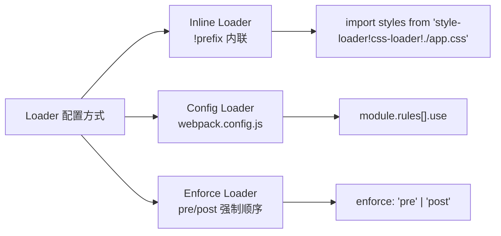
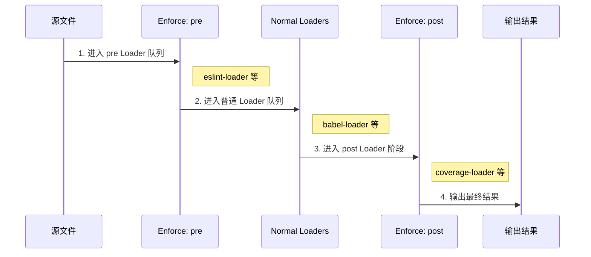
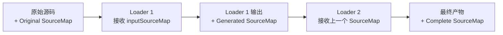
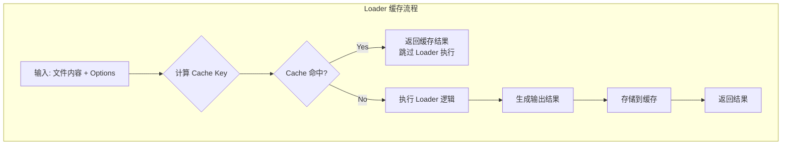
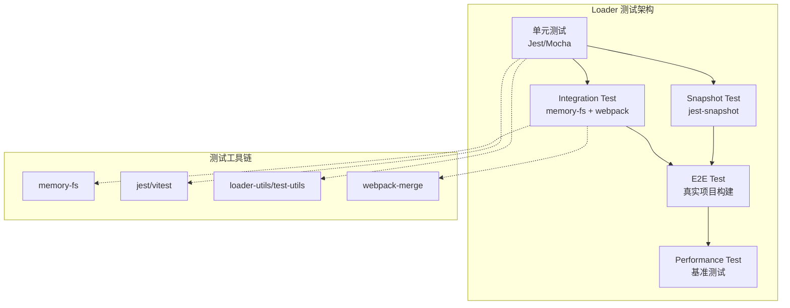
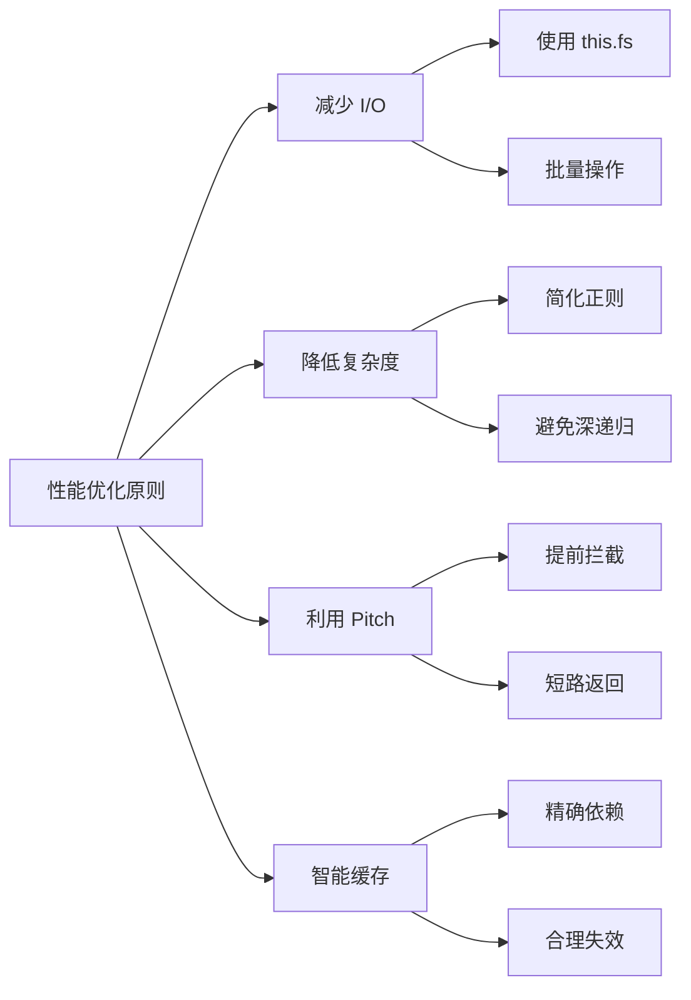
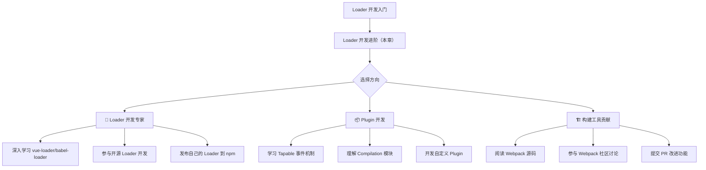

# Loader 开发进阶：如何用好 Loader 扩展开发工具？

> **文档元信息**
>
> - **章节编号**：第 20 章
> - **适用版本**：Webpack v5.107+
> - **更新日期**：2026-05-22
> - **作者**：掘金本系列技术团队
> - **版本**：v2（升级版）
> - **前置知识**：[第19章 Loader 开发基础](18-Loader开发基础.md)
> - **难度等级**：⭐⭐⭐⭐☆（高级）

---

## 🎯 本章导读

在上一篇文章中，我们已经详细了解了开发 Webpack Loader 需要用到的基本技能，包括：Loader 基本形态、如何构建测试环境、如何使用 Loader Context 接口等。

**本章将深入探讨 Loader 开发的进阶主题，帮助你从"能写 Loader"升级到"写好 Loader"。**

我们将系统学习以下核心能力：

```mermaid
graph TB
    A[Loader 进阶能力体系] --> B[虚拟模块]
    A --> C[内联与配置管理]
    A --> D[文件系统操作]
    A --> E[参数校验]
    A --> F[错误处理]
    A --> G[Source Map]
    A --> H[缓存策略]

    B --> B1[this.resolve]
    B --> B2[this.addDependency]
    B --> B3[动态生成不存在的文件]

    C --> C1[inline loader]
    C --> C2[config loader]
    C --> C3[enforce pre/post]

    D --> D1[this.fs 读写]
    D --> D2[memory-fs 集成]
    D --> D3[避免磁盘 I/O]

    E --> E1[schema-utils]
    E --> E2[JSON Schema]
    E --> E3[v5.106 validate hook]

    F --> F1[this.callback 四参数]
    F --> F2[错误分类处理]
    F --> F3[警告 vs 错误]

    G --> G1[this.sourceMap]
    G --> G2[this.inputSourceMap]
    G --> G3[Source Map 传递链]

    H --> H1[this.cacheable]
    H --> H2[强制失效机制]
    H --> H3[缓存键设计]
```



---

## 一、虚拟模块（Virtual Modules）：突破文件系统的限制

### 1.1 什么是虚拟模块？

虚拟模块是指在 Loader 运行时动态生成的、**在磁盘上不存在**的模块。这是 Loader 开发中非常强大的能力，可以让你：

- 动态生成配置文件
- 注入运行时代码
- 创建代理模块
- 实现条件性模块加载

### 1.2 核心实现原理

虚拟模块的实现依赖于两个关键 API：

- `this.resolve()`：解析模块路径
- `this.addDependency()`：添加依赖关系

#### 示例 1：基础虚拟模块

```javascript
// virtual-module-loader.js
const path = require('path');

module.exports = function(source) {
  // 解析虚拟模块路径
  const virtualModulePath = path.resolve(
    this.rootContext,
    'virtual-modules',
    'generated-config.js'
  );

  // 将虚拟模块添加到依赖图中
  this.addDependency(virtualModulePath);

  // 在内存中创建虚拟模块内容
  const virtualContent = `
    // 这是动态生成的虚拟模块
    export const config = {
      generatedAt: '${new Date().toISOString()}',
      sourceFile: '${this.resourcePath}'
    };

    export default config;
  `;

  // 使用 callback 将虚拟模块内容写入内存文件系统
  this.fs.writeFile(virtualModulePath, virtualContent);

  // 返回导入虚拟模块的代码
  return `
    ${source}

    // 导入虚拟模块
    import virtualConfig from '${virtualModulePath}';
    console.log('Virtual module loaded:', virtualConfig);
  `;
};
```

#### 示例 2：带依赖追踪的虚拟模块

```javascript
// advanced-virtual-loader.js
const crypto = require('crypto');
const path = require('path');

module.exports = function(source) {
  const options = this.getOptions({
    type: 'object',
    properties: {
      moduleName: { type: 'string' },
      transform: { instanceof: 'Function' }
    },
    required: ['moduleName']
  });

  // 生成唯一的虚拟模块标识符
  const hash = crypto.createHash('md5')
    .update(this.resourcePath)
    .update(JSON.stringify(options))
    .digest('hex')
    .slice(0, 8);

  const virtualModuleName = `${options.moduleName}-${hash}`;
  const virtualModulePath = path.join(
    __dirname,
    'virtual-modules',
    `${virtualModuleName}.js`
  );

  // 应用用户自定义的转换函数
  let processedContent = source;
  if (options.transform) {
    processedContent = options.transform.call(this, source, {
      resourcePath: this.resourcePath,
      resourceQuery: this.resourceQuery
    });
  }

  // 构建虚拟模块内容
  const virtualModuleContent = `
    /**
     * Virtual Module: ${virtualModuleName}
     * Generated from: ${path.basename(this.resourcePath)}
     * Generated at: ${new Date().toISOString()}
     */

    // 原始内容（经过转换）
    const originalContent = \`${processedContent.replace(/`/g, '\\`')}\`;

    // 导出接口
    export default originalContent;
    export const metadata = {
      source: '${this.resourcePath}',
      generated: true,
      hash: '${hash}'
    };
  `;

  // 写入内存文件系统并添加依赖
  this.fs.mkdirpSync(path.dirname(virtualModulePath));
  this.fs.writeFileSync(virtualModulePath, virtualModuleContent);
  this.addDependency(virtualModulePath);

  // 返回包装后的代码
  return `
    import virtualModule from '${virtualModulePath}';
    import { metadata } from '${virtualModulePath}';

    // 原始模块导出
    ${source}

    // 虚拟模块增强
    if (typeof module !== 'undefined' && module.exports) {
      module.exports.__virtualModule = virtualModule;
      module.exports.__metadata = metadata;
    }

    export { virtualModule, metadata };
  `;
};
```

### 1.3 虚拟模块的典型应用场景

#### 场景 1：环境变量注入

```javascript
// env-injection-loader.js
const path = require('path');

module.exports = function(source) {
  const envContent = Object.keys(process.env)
    .filter(key => key.startsWith('APP_'))
    .map(key => `export const ${key} = '${process.env[key]}';`)
    .join('\n');

  // 注意：this.resolve 是 callback 式异步 API 且无返回值，
  // 这里直接用 path 拼接虚拟模块路径
  const envModulePath = path.join(
    this.rootContext,
    './virtual-env.js'
  );

  this.fs.writeFileSync(envModulePath, envContent);
  this.addDependency(envModulePath);

  return `
    import * as ENV from '${envModulePath}';
    ${source}
  `;
};
```

#### 场景 2：API 代理模块生成

```javascript
// api-proxy-loader.js
const path = require('path');

module.exports = function(source) {
  // 解析源文件中的 API 定义
  const apiDefinitions = parseApiDefinitions(source);

  // 生成代理模块
  const proxyContent = generateProxyModule(apiDefinitions);

  const proxyPath = path.join(
    this.rootContext,
    './api-proxy.generated.js'
  );

  this.fs.writeFileSync(proxyPath, proxyContent);
  this.addDependency(proxyPath);

  return `
    import { createApiProxy } from '${proxyPath}';
    ${source.replace(/export\s+default/g, 'const _originalExport =')}
    export default createApiProxy(_originalExport);
  `;
};

function parseApiDefinitions(source) {
  // 解析逻辑...
  return {};
}

function generateProxyModule(definitions) {
  // 生成逻辑...
  return '';
}
```

---

## 二、Loader 内联与配置：精细控制执行顺序

### 2.1 三种 Loader 配置方式对比

Webpack 提供三种方式来配置和使用 Loader：



### 2.2 Inline Loader（内联 Loader）

内联 Loader 通过在 `import/require` 语句中使用 `!` 前缀来指定：

```javascript
// 基础语法
import styles from 'style-loader!css-loader!./app.css';

// 禁用预置的 Loader（使用 !!）
import script from '!!babel-loader!./script.js';

// 只禁用 pre 和 post Loader（使用 -!）
import data from '-!json-loader!./data.json';

// 组合使用多个 Inline Loader
import result from 'loader-a?param1=value1!loader-b?param2=value2!./file.js';
```

#### 完整示例：Inline Loader 的实际应用

```javascript
// 特定文件需要特殊的 Loader 处理
import specialStyles from '!!style-loader/useable!css-loader?modules&localIdentName=[local]_[hash:base64:5]!./special.css';

// 条件性使用 Loader
function loadComponent(isDev) {
  if (isDev) {
    // 开发环境使用完整的 Loader 链
    return require('!!vue-style-loader!css-loader!postcss-loader!./component.css');
  } else {
    // 生产环境简化 Loader 链
    return require('!!style-loader!css-loader!./component.css');
  }
}
```

### 2.3 Config Loader（配置式 Loader）

通过 `webpack.config.js` 的 `module.rules` 配置：

```javascript
// webpack.config.js
module.exports = {
  module: {
    rules: [
      {
        test: /\.css$/,
        use: [
          { loader: 'style-loader' },
          {
            loader: 'css-loader',
            options: {
              modules: true,
              localIdentName: '[hash:base64:5]'
            }
          },
          { loader: 'postcss-loader' }
        ]
      },
      {
        test: /\.jsx$/,
        exclude: /node_modules/,
        use: {
          loader: 'babel-loader',
          options: {
            presets: ['@babel/preset-react'],
            plugins: ['@babel/plugin-transform-runtime']
          }
        }
      }
    ]
  }
};
```

### 2.4 Enforce Loader（强制顺序 Loader）

使用 `enforce` 属性强制指定 Loader 的执行位置：

```javascript
// webpack.config.js
module.exports = {
  module: {
    rules: [
      // 强制最先执行的 Loader（pre）
      {
        enforce: 'pre',
        test: /\.(js|jsx)$/,
        exclude: /node_modules/,
        use: [{ loader: 'eslint-loader' }]
      },

      // 普通 Loader（正常顺序）
      {
        test: /\.(js|jsx)$/,
        exclude: /node_modules/,
        use: [{ loader: 'babel-loader' }]
      },

      // 强制最后执行的 Loader（post）
      {
        enforce: 'post',
        test: /\.(js|jsx)$/,
        use: [{ loader: 'coverage-loader' }]
      }
    ]
  }
};
```

#### 执行顺序可视化



### 2.5 最佳实践建议

```javascript
// 推荐的 Loader 配置模式
module.exports = {
  module: {
    rules: [
      // 1. 代码质量检查（pre）
      {
        enforce: 'pre',
        test: /\.(js|ts)x?$/,
        exclude: /node_modules/,
        use: [
          {
            loader: 'eslint-loader',
            options: {
              cache: true,
              failOnError: process.env.NODE_ENV === 'production'
            }
          }
        ]
      },

      // 2. 核心转译（normal）
      {
        test: /\.(js|ts)x?$/,
        exclude: /node_modules/,
        use: [
          {
            loader: 'babel-loader',
            options: {
              cacheDirectory: true,
              presets: [
                ['@babel/preset-env', { targets: 'defaults' }],
                '@babel/preset-typescript',
                '@babel/preset-react'
              ]
            }
          }
        ]
      },

      // 3. 样式处理（normal）
      {
        test: /\.css$/,
        use: [
          'style-loader',
          {
            loader: 'css-loader',
            options: {
              modules: {
                localIdentName: '[name]__[local]--[hash:base64:5]'
              }
            }
          },
          'postcss-loader'
        ]
      },

      // 4. 资源处理（post）
      {
        enforce: 'post',
        test: /\.(png|jpe?g|gif|svg)$/i,
        use: [
          {
            loader: 'image-webpack-loader',
            options: {
              mozjpeg: { progressive: true, quality: 75 },
              optipng: { enabled: false },
              pngquant: { quality: [0.65, 0.9], speed: 4 }
            }
          }
        ]
      }
    ]
  }
};
```

---

## 三、自定义文件系统：this.fs 内存文件系统操作

### 3.1 为什么需要自定义文件系统？

Webpack 5 引入了全新的持久化缓存系统，默认使用**内存文件系统（Memory File System）**来提升性能。作为 Loader 开发者，你需要了解如何正确地使用 `this.fs` API：

**关键优势：**
- ✅ 避免磁盘 I/O 操作，显著提升性能
- ✅ 支持热更新（HMR）时的快速重建
- ✅ 与 Webpack 缓存系统集成
- ✅ 支持虚拟模块的创建和管理

### 3.2 this.fs 核心 API

```javascript
// file-system-loader.js
const path = require('path');
const crypto = require('crypto');

module.exports = function(source) {
  const context = this.rootContext;
  const outputPath = path.join(context, '.cache', 'loader-output');

  // ✅ 1. 创建目录（同步）
  this.fs.mkdirpSync(outputPath);

  // ✅ 2. 写入文件（同步）
  const outputFilePath = path.join(outputPath, `${getHash(source)}.cache`);
  this.fs.writeFileSync(outputFilePath, JSON.stringify({
    content: source,
    timestamp: Date.now(),
    resourcePath: this.resourcePath
  }));

  // ✅ 3. 读取文件（同步）
  if (this.fs.existsSync(outputFilePath)) {
    const cachedData = JSON.parse(this.fs.readFileSync(outputFilePath, 'utf-8'));
    console.log('Cached data:', cachedData);
  }

  // ✅ 4. 删除文件
  // this.fs.unlinkSync(outputFilePath);

  // ✅ 5. 读取目录
  // const files = this.fs.readdirSync(outputPath);

  // ✅ 6. 检查文件是否存在
  // const exists = this.fs.existsSync(outputFilePath);

  // 添加依赖关系
  this.addDependency(outputFilePath);

  return source;
};

function getHash(content) {
  return crypto.createHash('md5').update(content).digest('hex').slice(0, 12);
}
```

### 3.3 异步文件操作

对于大型文件或需要异步处理的场景：

```javascript
// async-file-system-loader.js
const path = require('path');

module.exports = function(source) {
  const callback = this.async();
  const cacheDir = path.join(this.rootContext, '.cache', 'async-loader');

  // 异步创建目录
  this.fs.mkdirp(cacheDir, (err) => {
    if (err) {
      return callback(err);
    }

    const cacheFile = path.join(cacheDir, `${Date.now()}.tmp`);

    // 异步写入文件
    this.fs.writeFile(cacheFile, source, (writeErr) => {
      if (writeErr) {
        return callback(writeErr);
      }

      // 添加依赖
      this.addDependency(cacheFile);

      // 异步读取验证
      this.fs.readFile(cacheFile, 'utf-8', (readErr, data) => {
        if (readErr) {
          return callback(readErr);
        }

        console.log('Async operation completed:', data.length, 'bytes');

        // 返回处理后的结果
        callback(null, `
          ${source}

          // Async processing complete
          console.log('Processed with async fs operations');
        `);
      });
    });
  });
};
```

### 3.4 与 memory-fs 的集成

```javascript
// memory-fs-integration-loader.js
const MemoryFS = require('memory-fs');
const path = require('path');

let memFsInstance = null;

function getMemoryFS() {
  if (!memFsInstance) {
    memFsInstance = new MemoryFS();
  }
  return memFsInstance;
}

module.exports = function(source) {
  const memfs = getMemoryFS();

  // 在 MemoryFS 中创建临时工作区
  const workDir = '/virtual-workspace';
  if (!memfs.existsSync(workDir)) {
    memfs.mkdirpSync(workDir);
  }

  // 写入输入文件
  const inputFile = path.join(workDir, 'input.txt');
  memfs.writeFileSync(inputFile, source);

  // 执行一些复杂的转换操作
  const outputFile = path.join(workDir, 'output.txt');
  const transformed = performComplexTransformation(source, memfs);
  memfs.writeFileSync(outputFile, transformed);

  // 读取输出结果
  const result = memfs.readFileSync(outputFile, 'utf-8');

  // 同步到 this.fs
  const targetPath = path.join(this.rootContext, '.cache', 'transformed.txt');
  this.fs.mkdirpSync(path.dirname(targetPath));
  this.fs.writeFileSync(targetPath, result);
  this.addDependency(targetPath);

  return result;
};

function performComplexTransformation(content, fs) {
  // 这里可以实现复杂的文件操作逻辑
  // 例如：多文件生成、依赖分析等
  return content.toUpperCase(); // 示例：简单转换为大写
}
```

### 3.5 性能对比：this.fs vs 原生 fs

```javascript
// performance-comparison.js
const fs = require('fs');
const path = require('path');

// ❌ 不推荐：直接使用原生 fs（会绕过 Webpack 缓存）
module.exports = function badPractice(source) {
  const cachePath = path.join(__dirname, '.cache', 'bad-practice.json');

  // 直接写入磁盘 - 绕过了 Webpack 的文件系统抽象
  fs.writeFileSync(cachePath, JSON.stringify({ source }));

  // 不会触发 Webpack 的重新编译和缓存更新
  return source;
};

// ✅ 推荐：使用 this.fs（集成 Webpack 缓存系统）
module.exports = function goodPractice(source) {
  const cachePath = path.join(this.rootContext, '.cache', 'good-practice.json');

  // 通过 this.fs 操作 - 正确集成到 Webpack 系统
  this.fs.mkdirpSync(path.dirname(cachePath));
  this.fs.writeFileSync(cachePath, JSON.stringify({ source }));
  this.addDependency(cachePath); // 重要：添加依赖追踪

  return source;
};
```

---

## 四、Schema 校验：validate hook 与 getOptions 深度集成

### 4.1 Schema 校验的重要性

在生产级 Loader 中，**参数校验**是必不可少的环节。它能够：
- 提供友好的错误提示
- 防止运行时异常
- 提升 Developer Experience (DX)
- 自动生成文档

### 4.2 传统方式：schema-utils

```javascript
// traditional-validation-loader.js
import { validate } from 'schema-utils';
import schema from './options.json';

// Schema 定义文件
/*
{
  "type": "object",
  "properties": {
    "name": { "type": "string" },
    "version": { "type": "number", "minimum": 1 },
    "enabled": { "type": "boolean" },
    "plugins": {
      "type": "array",
      "items": { "type": "string" }
    },
    "options": {
      "type": "object",
      "properties": {
        "debug": { "type": "boolean" },
        "timeout": { "type": "number", "minimum": 0 }
      }
    }
  },
  "required": ["name"],
  "additionalProperties": false
}
*/

export default function loader(source) {
  const options = this.getOptions();

  // 方式一：手动调用 validate
  validate(schema, options, {
    name: 'My Awesome Loader',
    baseDataPath: 'options'
  });

  // 使用校验过的 options 进行后续处理...
  return processWithValidatedOptions(source, options);
}
```

### 4.3 Webpack 5 方式：getOptions 内置校验

从 Webpack 5 开始，`getOptions()` 方法支持直接传入 Schema 对象进行自动校验：

```javascript
// webpack5-validation-loader.js
export default function loader(source) {
  // ✅ 推荐：直接传入 Schema，自动完成校验
  const options = this.getOptions({
    type: 'object',
    properties: {
      name: {
        type: 'string',
        description: '组件名称'
      },
      version: {
        type: 'number',
        minimum: 1,
        description: '版本号'
      },
      enabled: {
        type: 'boolean',
        default: true
      },
      plugins: {
        type: 'array',
        items: {
          anyOf: [
            { type: 'string' },
            {
              type: 'object',
              properties: {
                name: { type: 'string' },
                options: { type: 'object' }
              }
            }
          ]
        }
      },
      transform: {
        instanceof: 'Function',
        description: '自定义转换函数'
      }
    },
    required: ['name'],
    additionalProperties: false
  });

  // 如果传入的 options 不符合 Schema，Webpack 会自动抛出详细的错误信息
  console.log('Validated options:', options);

  return source;
}
```

### 4.4 v5.106+ 新特性：validate Hook

Webpack v5.106 引入了新的 `validate` hook，提供更强大的校验能力：

```javascript
// validate-hook-loader.js
const schema = {
  type: 'object',
  properties: {
    mode: {
      type: 'string',
      enum: ['production', 'development', 'test'],
      description: '构建模式'
    },
    features: {
      type: 'object',
      properties: {
        sourceMap: { type: 'boolean' },
        minification: { type: 'boolean' },
        treeShaking: { type: 'boolean' }
      },
      additionalProperties: false
    },
    performance: {
      type: 'object',
      properties: {
        maxAssetSize: { type: 'number', minimum: 0 },
        maxEntrypointSize: { type: 'number', minimum: 0 },
        hints: {
          type: 'string',
          enum: ['warning', 'error', false]
        }
      }
    }
  },
  required: ['mode'],
  allOf: [
    {
      if: {
        properties: { mode: { const: 'production' } }
      },
      then: {
        properties: {
          features: {
            properties: {
              minification: { const: true },
              treeShaking: { const: true }
            }
          }
        }
      }
    }
  ]
};

export default function loader(source) {
  // 使用 validate hook（v5.106+）
  const options = this.getOptions(schema);

  // 或者使用独立的 validate 函数
  /*
  const { validate } = require('schema-utils');
  const validation = validate(schema, options, {
    name: 'Advanced Loader',
    postData: { schema, options }
  });

  if (!validation.valid) {
    // 自定义错误处理
    const error = new Error(`Validation failed: ${validation.errors.map(e => e.message).join(', ')}`);
    error.details = validation.errors;
    throw error;
  }
  */

  return applyTransformations(source, options);
}

function applyTransformations(source, options) {
  let result = source;

  // 根据 mode 应用不同的转换
  switch (options.mode) {
    case 'production':
      if (options.features?.minification) {
        result = minify(result);
      }
      break;
    case 'development':
      if (options.features?.sourceMap) {
        result = addSourceMap(result);
      }
      break;
    case 'test':
      result = addTestHelpers(result);
      break;
  }

  return result;
}

function minify(code) {
  // 压缩逻辑...
  return code;
}

function addSourceMap(code) {
  // Source Map 逻辑...
  return code;
}

function addTestHelpers(code) {
  // 测试辅助函数注入...
  return code;
}
```

### 4.5 高级 Schema 技巧

#### 技巧 1：条件校验（if/then/else）

```javascript
const conditionalSchema = {
  type: 'object',
  properties: {
    outputFormat: {
      type: 'string',
      enum: ['esm', 'cjs', 'umd']
    },
    esmOptions: {
      type: 'object',
      properties: {
        moduleName: { type: 'string' }
      }
    },
    cjsOptions: {
      type: 'object',
      properties: {
        globalVariable: { type: 'string' }
      }
    }
  },
  if: {
    properties: { outputFormat: { const: 'esm' } }
  },
  then: {
    required: ['esmOptions'],
    properties: {
      cjsOptions: false  // ESM 模式下不允许 cjsOptions
    }
  },
  else: {
    if: {
      properties: { outputFormat: { const: 'cjs' } }
    },
    then: {
      required: ['cjsOptions']
    }
  }
};
```

#### 技巧 2：复合类型（anyOf/oneOf/allOf）

```javascript
const complexTypeSchema = {
  type: 'object',
  properties: {
    loaderConfig: {
      oneOf: [
        // 字符串形式：简单的 loader 名称
        { type: 'string' },

        // 数组形式：loader 链
        {
          type: 'array',
          items: {
            oneOf: [
              { type: 'string' },
              {
                type: 'object',
                properties: {
                  loader: { type: 'string' },
                  options: { type: 'object' }
                },
                required: ['loader']
              }
            ]
          }
        },

        // 对象形式：带选项的单个 loader
        {
          type: 'object',
          properties: {
            loader: { type: 'string' },
            options: { type: 'object' },
            enforce: {
              type: 'string',
              enum: ['pre', 'post']
            }
          },
          required: ['loader']
        }
      ]
    },

    transformRules: {
      type: 'array',
      items: {
        allOf: [
          { type: 'object' },
          {
            oneOf: [
              {
                properties: {
                  pattern: { type: 'string' },
                  replacement: { type: 'string' }
                },
                required: ['pattern', 'replacement']
              },
              {
                properties: {
                  pattern: { type: 'string' },
                  transformer: { instanceof: 'Function' }
                },
                required: ['pattern', 'transformer']
              }
            ]
          }
        ]
      }
    }
  }
};
```

---

## 五、错误处理：this.callback 四参数模式

### 5.1 错误处理的重要性

良好的错误处理是生产级 Loader 的标志。正确的错误处理能够：
- 提供清晰的错误定位信息
- 区分不同类型的错误（语法错误、运行时错误、配置错误）
- 支持 Source Map 的错误映射
- 集成到 Webpack 的错误报告系统

### 5.2 this.callback 四参数详解

```javascript
/**
 * this.callback(
 *   err: Error | null,           // 第一个参数：错误对象
 *   content: string | Buffer,   // 第二个参数：转换后的内容
 *   sourceMap?: SourceMap,       // 第三个参数：Source Map 对象
 *   meta?: object               // 第四个参数：元数据（可被下一个 Loader 访问）
 * )
 */
```

#### 完整的错误处理示例

```javascript
// error-handling-loader.js
const path = require('path');

module.exports = function(source) {
  const callback = this.async();
  const options = this.getOptions({
    type: 'object',
    properties: {
      strictMode: { type: 'boolean', default: false },
      throwOnWarning: { type: 'boolean', default: false }
    }
  });

  try {
    // 1. 参数校验阶段
    if (!source || typeof source !== 'string') {
      throw new Error(
        `[MyLoader] Invalid input: expected string, got ${typeof source}`
      );
    }

    // 2. 内容解析阶段
    let parsedAST;
    try {
      parsedAST = parseSourceCode(source);
    } catch (parseError) {
      const enhancedError = enhanceParseError(parseError, source, this.resourcePath);
      return callback(enhancedError);
    }

    // 3. 转换阶段
    let transformed;
    let warnings = [];
    try {
      const result = transformAST(parsedAST, options);
      transformed = result.code;
      warnings = result.warnings || [];

      // 处理警告
      if (warnings.length > 0) {
        if (options.throwOnWarning) {
          const warningError = new Error(
            `[MyLoader] Warnings treated as errors:\n${warnings.join('\n')}`
          );
          warningError.warnings = warnings;
          return callback(warningError);
        } else {
          warnings.forEach(warning => {
            this.emitWarning(new Error(warning));
          });
        }
      }

    } catch (transformError) {
      const enhancedError = enhanceTransformError(transformError, parsedAST);
      return callback(enhancedError);
    }

    // 4. Source Map 生成
    const sourceMap = generateSourceMap(source, transformed);

    // 5. 元数据准备
    const meta = {
      ast: parsedAST,
      stats: {
        originalSize: source.length,
        transformedSize: transformed.length,
        compressionRatio: (transformed.length / source.length * 100).toFixed(2) + '%'
      },
      timestamp: Date.now()
    };

    // 6. 成功返回（四参数模式）
    callback(null, transformed, sourceMap, meta);

  } catch (unexpectedError) {
    // 兜底错误处理
    callback(
      new Error(
        `[MyLoader] Unexpected error processing ${this.resourcePath}: ${unexpectedError.message}`
      )
    );
  }
};

function parseSourceCode(source) {
  // 解析逻辑...
  return {}; // AST
}

function transformAST(ast, options) {
  // 转换逻辑...
  return { code: '', warnings: [] };
}

function generateSourceMap(original, transformed) {
  // Source Map 生成逻辑...
  return {
    version: 3,
    sources: [path.basename(__filename)],
    names: [],
    mappings: '',
    file: 'output.js',
    sourcesContent: [original]
  };
}

function enhanceParseError(error, source, filePath) {
  const enhanced = new Error(
    `[MyLoader] Parse error in ${filePath}: ${error.message}\n` +
    `Line ${error.line || 'unknown'}, Column ${error.column || 'unknown'}`
  );
  enhanced.originalError = error;
  enhanced.file = filePath;
  enhanced.source = source;
  return enhanced;
}

function enhanceTransformError(error, ast) {
  const enhanced = new Error(
    `[MyLoader] Transform failed: ${error.message}`
  );
  enhanced.originalError = error;
  enhanced.ast = ast;
  return enhanced;
}
```

### 5.3 错误分类与最佳实践

```javascript
// error-classification-loader.js

class LoaderError extends Error {
  constructor(message, type, details = {}) {
    super(message);
    this.name = 'LoaderError';
    this.type = type; // 'CONFIG' | 'PARSE' | 'TRANSFORM' | 'RUNTIME' | 'SYSTEM'
    this.details = details;
    this.timestamp = Date.now();
  }
}

class ConfigurationError extends LoaderError {
  constructor(message, invalidOption, expectedType) {
    super(message, 'CONFIG', { invalidOption, expectedType });
    this.name = 'ConfigurationError';
  }
}

class ParseError extends LoaderError {
  constructor(message, line, column, sourceSnippet) {
    super(message, 'PARSE', { line, column, sourceSnippet });
    this.name = 'ParseError';
    this.line = line;
    this.column = column;
  }
}

class TransformError extends LoaderError {
  constructor(message, node, transformation) {
    super(message, 'TRANSFORM', { node, transformation });
    this.name = 'TransformError';
  }
}

module.exports = function(source) {
  const callback = this.async();

  try {
    // 配置校验
    const options = validateConfiguration(this.getOptions());

    // 解析阶段
    const ast = safeParse(source, (line, col, snippet) => {
      throw new ParseError(
        `Syntax error at line ${line}, column ${col}`,
        line,
        col,
        snippet
      );
    });

    // 转换阶段
    const result = safeTransform(ast, options, (node, transform) => {
      throw new TransformError(
        `Failed to apply transformation: ${transform}`,
        node,
        transform
      );
    });

    callback(null, result.code, result.sourceMap, result.meta);

  } catch (error) {
    // 统一错误处理
    if (error instanceof LoaderError) {
      // 已知的 Loader 错误，附加上下文信息
      error.loader = 'my-awesome-loader';
      error.resource = this.resourcePath;
      callback(error);
    } else {
      // 未知错误，包装后抛出
      callback(new LoaderError(
        `Unexpected error: ${error.message}`,
        'RUNTIME',
        { originalError: error }
      ));
    }
  }
};

function validateConfiguration(options) {
  if (!options.name) {
    throw new ConfigurationError(
      '"name" option is required',
      'name',
      'string'
    );
  }
  return options;
}

function safeParse(source, onError) {
  try {
    return JSON.parse(source); // 示例：JSON 解析
  } catch (e) {
    const match = e.message.match(/position (\d+)/);
    const pos = match ? parseInt(match[1]) : 0;
    const lines = source.substring(0, pos).split('\n');
    const line = lines.length;
    const column = lines[lines.length - 1].length;
    onError(line, column, source.split('\n')[line - 1]);
  }
}

function safeTransform(ast, options, onError) {
  // 安全转换逻辑...
  return { code: '', sourceMap: null, meta: {} };
}
```

---

## 六、Source Map 生成与传递：保持调试体验

### 6.1 Source Map 在 Loader 中的重要性

当 Loader 对源代码进行转换后，如果没有正确传递 Source Map：
- ❌ 调试器无法正确定位原始代码位置
- ❌ 错误堆栈指向转换后的代码而非源代码
- ❌ 开发体验极差

### 6.2 Source Map 传递链



### 6.3 读取输入 Source Map

```javascript
// source-map-input-loader.js
module.exports = function(source) {
  // 方式一：通过 this.inputSourceMap 获取前一个 Loader 生成的 Source Map
  const inputSourceMap = this.inputSourceMap;

  if (inputSourceMap) {
    console.log('Received Source Map from previous loader:');
    console.log('- Version:', inputSourceMap.version);
    console.log('- Sources:', inputSourceMap.sources);
    console.log('- Mappings length:', inputSourceMap.mappings.length);
  } else {
    console.log('No input Source Map available');
  }

  // 方式二：检查是否需要生成 Source Map
  const shouldGenerateSourceMap = this.sourceMap;

  console.log('Source Map generation enabled:', shouldGenerateSourceMap);

  return source;
};
```

### 6.4 生成和输出 Source Map

```javascript
// source-map-generation-loader.js
const { SourceNode, SourceMapConsumer, SourceMapGenerator } = require('source-map');
const path = require('path');

module.exports = function(source) {
  const callback = this.async();
  const options = this.getOptions({
    type: 'object',
    properties: {
      prefix: { type: 'string', default: '// Processed by my-loader\n' },
      suffix: { type: 'string', default: '' }
    }
  });

  // 获取输入 Source Map
  const inputSourceMap = this.inputSourceMap;

  // 使用 SourceMapSource 库进行精确的 Source Map 管理
  const sourceNode = new SourceNode(
    null, null, null,
    [
      new SourceNode(1, 1, path.basename(this.resourcePath), options.prefix),
      new SourceNode(1, 1, path.basename(this.resourcePath), source),
      options.suffix ? new SourceNode(1, 1, path.basename(this.resourcePath), options.suffix) : null
    ].filter(Boolean)
  );

  // 如果有输入 Source Map，将其合并
  if (inputSourceMap) {
    SourceMapConsumer.with(inputSourceMap, null, consumer => {
      // 合并逻辑...
      consumer.destroy();
    }).then(() => {
      finishProcessing();
    }).catch(callback);
  } else {
    finishProcessing();
  }

  const finishProcessing = () => {
    const result = sourceNode.toStringWithSourceMap({
      file: path.basename(this.resourcePath)
    });

    // 返回四参数：content, sourceMap, meta
    callback(null, result.code, result.map.toJSON(), {
      generated: true,
      loaderVersion: '1.0.0'
    });
  };
};
```

### 6.5 完整的 Source Map 传递示例

```javascript
// complete-sourcemap-loader.js
const { SourceMapConsumer, SourceMapGenerator } = require('source-map');
const path = require('path');

module.exports = function(source) {
  const callback = this.async();

  // 步骤 1：解析输入 Source Map（如果存在）
  let inputConsumer = null;
  const inputSourceMap = this.inputSourceMap;

  Promise.resolve()
    .then(async () => {
      if (inputSourceMap) {
        inputConsumer = await new SourceMapConsumer(inputSourceMap);
      }

      // 步骤 2：执行代码转换
      const transformed = transformCode(source);

      // 步骤 3：生成新的 Source Map
      const generator = new SourceMapGenerator({
        file: path.basename(this.resourcePath),
        sourceRoot: ''
      });

      // 映射每一行
      const originalLines = source.split('\n');
      const transformedLines = transformed.split('\n');

      originalLines.forEach((originalLine, index) => {
        const lineNumber = index + 1;
        const column = 0;

        if (inputConsumer) {
          // 如果有输入 Source Map，查找原始位置
          const originalPosition = inputConsumer.originalPositionFor({
            line: lineNumber,
            column: column
          });

          generator.addMapping({
            generated: { line: lineNumber + 1, column: 0 }, // +1 因为我们添加了前缀行
            original: {
              line: originalPosition.line || lineNumber,
              column: originalPosition.column || 0
            },
            source: originalPosition.source || path.basename(this.resourcePath),
            name: originalPosition.name || null
          });
        } else {
          // 没有 Source Map，直接映射
          generator.addMapping({
            generated: { line: lineNumber + 1, column: 0 },
            original: { line: lineNumber, column: 0 },
            source: path.basename(this.resourcePath),
            name: null
          });
        }
      });

      // 设置源内容
      generator.setSourceContent(path.basename(this.resourcePath), source);

      // 步骤 4：清理资源
      if (inputConsumer) {
        inputConsumer.destroy();
      }

      // 步骤 5：返回结果
      const outputSourceMap = generator.toJSON();

      callback(null, transformed, outputSourceMap, {
        sourcemapGenerated: true,
        transformations: ['prefix-addition', 'code-transform']
      });

    })
    .catch(error => {
      callback(error);
    });
};

function transformCode(code) {
  // 添加前缀注释
  const prefix = '// Transformed by My Loader\n';
  return prefix + code;
}
```

### 6.6 Source Map 最佳实践清单

```markdown
## Source Map 最佳实践 ✓

- [ ] **始终检查 `this.inputSourceMap`**：不要忽略上游 Loader 的 Source Map
- [ ] **尊重 `this.sourceMap` 标志**：只在需要时生成 Source Map
- [ ] **使用成熟的库**：如 `source-map`, `magic-string` 等
- [ ] **正确处理合并**：使用 `SourceMapConsumer` 合并多个 Source Map
- [ ] **设置 `sourcesContent`**：便于调试时查看原始源码
- [ ] **及时销毁 Consumer**：避免内存泄漏
- [ ] **通过 `this.callback` 传递**：使用第三个参数传递 Source Map
- [ ] **测试验证**：确保断点能正确定位到原始代码
```

---

## 七、缓存策略：this.cacheable() 与强制失效

### 7.1 理解 Loader 缓存机制

Webpack 的 Loader 缓存系统能够显著提升构建速度，但需要正确配置才能发挥最大效用：



### 7.2 基础缓存配置

```javascript
// basic-cache-loader.js
module.exports = function(source) {
  // ✅ 声明此 Loader 是可缓存的（默认行为）
  this.cacheable();

  // 或者明确禁用缓存
  // this.cacheable(false);

  // 执行昂贵的转换操作
  const result = expensiveTransformation(source);

  return result;
};

function expensiveTransformation(code) {
  // 模拟耗时操作
  for (let i = 0; i < 1000000; i++) {}
  return code.toUpperCase();
}
```

### 7.3 自定义缓存键

默认情况下，Webpack 使用 `filePath + content` 作为缓存键。但有时你需要更细粒度的控制：

```javascript
// custom-cache-key-loader.js
const crypto = require('crypto');

module.exports = function(source) {
  const options = this.getOptions({
    type: 'object',
    properties: {
      environment: { type: 'string' },
      version: { type: 'string' },
      externalConfig: { type: 'string' }
    }
  });

  // 构建自定义缓存键
  const cacheDependencies = [
    this.resourcePath,           // 文件路径
    source,                      // 文件内容
    JSON.stringify(options),     // Loader 选项
    process.env.NODE_ENV,        // 环境变量
    options.version,             // 外部版本号
    options.externalConfig       // 外部配置
  ];

  const cacheKey = crypto.createHash('sha256')
    .update(cacheDependencies.join('|'))
    .digest('hex');

  // 注意：Webpack 5 不再支持自定义 cacheKey 方法
  // 但你可以通过 this.addDependency 和 this.addContextDependency
  // 来影响缓存失效逻辑

  // 添加额外的依赖项以触发缓存失效
  if (options.externalConfig) {
    this.addDependency(options.externalConfig);
  }

  this.cacheable();

  return transformBasedOnEnvironment(source, options.environment);
};

function transformBasedOnEnvironment(code, environment) {
  switch (environment) {
    case 'development':
      return `// Development mode\n${code}`;
    case 'production':
      return `// Production mode\n${code.trim()}`;
    default:
      return code;
  }
}
```

### 7.4 强制缓存失效的策略

#### 策略 1：基于文件依赖

```javascript
// file-dependency-cache-loader.js
const path = require('path');

module.exports = function(source) {
  const configPath = path.resolve(
    this.rootContext,
    'my-loader.config.json'
  );

  // 添加配置文件为依赖
  // 当配置文件变化时，缓存自动失效
  this.addDependency(configPath);

  // 读取配置
  let config = {};
  if (this.fs.existsSync(configPath)) {
    try {
      config = JSON.parse(this.fs.readFileSync(configPath, 'utf-8'));
    } catch (e) {
      // 配置文件无效，使用默认值
    }
  }

  this.cacheable();

  return applyConfig(source, config);
};

function applyConfig(code, config) {
  // 根据配置应用转换...
  return code;
}
```

#### 策略 2：基于上下文依赖

```javascript
// context-dependency-cache-loader.js
const path = require('path');

module.exports = function(source) {
  // 添加整个目录为依赖
  // 目录内任何文件的变化都会导致缓存失效
  const componentsDir = path.resolve(
    this.rootContext,
    'src/components'
  );

  this.addContextDependency(componentsDir);

  this.cacheable();

  // 当 components 目录下的任何文件发生变化时，
  // 所有经过此 Loader 的文件都会重新处理
  return scanAndProcessComponents(source, componentsDir);
};

function scanAndProcessComponents(code, dir) {
  // 扫描组件目录的逻辑...
  return code;
}
```

#### 策略 3：基于时间戳或版本号

```javascript
// version-based-cache-loader.js
module.exports = function(source) {
  const options = this.getOptions({
    type: 'object',
    properties: {
      cacheVersion: { type: 'string' },
      invalidatePattern: { type: 'string' }
    }
  });

  // 方案 A：显式的版本号
  if (options.cacheVersion) {
    // 将版本号嵌入到转换结果中
    // 这样即使内容相同，版本不同也会产生不同的输出
    source = `/* cache-version: ${options.cacheVersion} */\n${source}`;
  }

  // 方案 B：基于时间的失效模式
  if (options.invalidatePattern === 'hourly') {
    const currentHour = new Date().getHours();
    source = `/* hour: ${currentHour} */\n${source}`;
  }

  this.cacheable();

  return source;
};
```

### 7.5 缓存调试与分析

```javascript
// cache-debug-loader.js
const perf_hooks = require('perf_hooks');

module.exports = function(source) {
  const startTime = perf_hooks.performance.now();

  this.cacheable();

  // 模拟复杂的处理逻辑
  const result = complexProcessing(source);

  const endTime = perf_hooks.performance.now();
  const duration = endTime - startTime;

  // 输出缓存和性能信息（仅在开发环境）
  if (process.env.NODE_ENV !== 'production') {
    console.log(`
      [MyLoader] Performance Report:
      - File: ${this.resourcePath}
      - Processing time: ${duration.toFixed(2)}ms
      - Input size: ${(source.length / 1024).toFixed(2)} KB
      - Output size: ${(result.length / 1024).toFixed(2)} KB
      - Cache key dependencies:
        * Path: ${this.resourcePath}
        * Content hash: ${hashContent(source)}
    `);
  }

  return result;
};

function complexProcessing(code) {
  // 复杂处理逻辑...
  return code;
}

function hashContent(content) {
  const crypto = require('crypto');
  return crypto.createHash('md5').update(content).digest('hex').substring(0, 8);
}
```

---

## 八、调试技巧：快速定位问题

### 8.1 使用 loader-runner 直接调试

`loader-runner` 是 Webpack 内部使用的 Loader 执行引擎，可以直接用来调试 Loader：

```bash
npm install --save-dev loader-runner
```

```javascript
// debug-with-loader-runner.js
const { runLoaders } = require('loader-runner');
const path = require('path');

// 要处理的文件
const filePath = path.resolve(__dirname, 'test-file.js');

// Loader 配置
const loaderConfig = {
  // Loader 数组（从右到左执行）
  loaders: [
    {
      loader: path.resolve(__dirname, '../lib/my-loader.js'),
      options: {
        debug: true,
        verbose: true
      }
    },
    // 可以添加更多 Loader
  ],

  // 资源文件
  resource: filePath,

  // 同步或异步
  readResource: (filePath, callback) => {
    const fs = require('fs');
    fs.readFile(filePath, 'utf-8', callback);
  },
};

// 运行 Loader
runLoaders(loaderConfig, (err, result) => {
  if (err) {
    console.error('Loader execution failed:');
    console.error(err);
    return;
  }

  console.log('✅ Loader executed successfully!');
  console.log('Result:', result.result);
  console.log('ResourceBuffer:', result.resourceBuffer ? result.resourceBuffer.toString() : 'N/A');
  console.log('Cacheable:', result.cacheable);
  console.log('FileDependencies:', result.fileDependencies);
  console.log('ContextDependencies:', result.contextDependencies);
});
```

### 8.2 使用 Webpack Debug 模式

```bash
webpack --debug

node --inspect-brk ./node_modules/.bin/webpack --config webpack.config.js

{
  "scripts": {
    "debug:webpack": "node --inspect-brk ./node_modules/webpack/bin/webpack.js --debug"
  }
}
```

### 8.3 在 Loader 中使用 Console Log

```javascript
// debugging-loader.js
module.exports = function(source) {
  const isDebugMode = process.env.LOADER_DEBUG === 'true';

  if (isDebugMode) {
    console.group('[MyLoader] Debug Info');
    console.log('Resource Path:', this.resourcePath);
    console.log('Resource Query:', this.resourceQuery);
    console.log('Input size:', source.length, 'bytes');
    console.log('Options:', this.getOptions());
    console.log('--- Source Preview ---');
    console.log(source.substring(0, 200) + (source.length > 200 ? '...' : ''));
    console.groupEnd();
  }

  // 处理逻辑...
  const result = process(source);

  if (isDebugMode) {
    console.log('Output size:', result.length, 'bytes');
  }

  return result;
};
```

### 8.4 使用 VS Code 调试

创建 `.vscode/launch.json`：

```json
{
  "version": "0.2.0",
  "configurations": [
    {
      "type": "node",
      "request": "launch",
      "name": "Debug Webpack",
      "program": "${workspaceFolder}/node_modules/webpack/bin/webpack.js",
      "args": ["--config", "webpack.config.js"],
      "console": "integratedTerminal",
      "skipFiles": ["<node_internals>/**"],
      "env": {
        "LOADER_DEBUG": "true"
      }
    },
    {
      "type": "node",
      "request": "launch",
      "name": "Debug Loader Directly",
      "program": "${workspaceFolder}/debug-with-loader-runner.js",
      "console": "integratedTerminal",
      "skipFiles": ["<node_internals>/**"]
    }
  ]
}
```

---

## 九、测试方法：构建可靠的 Loader 测试体系

### 9.1 测试架构总览



### 9.2 单元测试基础

```javascript
// __tests__/my-loader.test.js
const path = require('path');
const { loader } = require('../lib/my-loader');
const { getOptions } = require('loader-utils');

// Mock Loader Context
function createLoaderContext(overrides = {}) {
  return {
    async: jest.fn(() => (err, content, map, meta) => {}),
    cacheable: jest.fn(),
    getOptions: jest.fn((schema) => overrides.options || {}),
    addDependency: jest.fn(),
    addContextDependency: jest.fn(),
    emitWarning: jest.fn(),
    emitError: jest.fn(),
    rootContext: '/mock/root',
    resourcePath: '/mock/path/file.js',
    resourceQuery: '',
    sourceMap: true,
    inputSourceMap: null,
    fs: {
      mkdirpSync: jest.fn(),
      writeFileSync: jest.fn(),
      readFileSync: jest.fn(() => '{}'),
      existsSync: jest.fn(() => false)
    },
    ...overrides
  };
}

describe('MyLoader', () => {
  test('should process basic JavaScript', () => {
    const source = 'const x = 1;';
    const context = createLoaderContext();

    // 绑定 context 并执行 loader
    const result = loader.call(context, source);

    expect(result).toBeDefined();
    expect(typeof result).toBe('string');
    expect(context.cacheable).toHaveBeenCalled();
  });

  test('should handle empty source', () => {
    const source = '';
    const context = createLoaderContext();

    const result = loader.call(context, source);

    expect(result).toBe('');
  });

  test('should call addDependency when needed', () => {
    const source = 'import "./dep";';
    const context = createLoaderContext({ options: { trackDeps: true } });

    loader.call(context, source);

    expect(context.addDependency).toHaveBeenCalled();
  });

  test('should handle async operations', (done) => {
    const source = 'async code;';
    const context = createLoaderContext({
      async: jest.fn(() => (err, content) => {
        expect(err).toBeNull();
        expect(content).toBeDefined();
        done();
      })
    });

    loader.call(context, source);
  });

  test('should validate options correctly', () => {
    const validOptions = { name: 'test', version: 1 };
    const context = createLoaderContext({ options: validOptions });

    expect(() => loader.call(context, 'code')).not.toThrow();
  });

  test('should throw on invalid options', () => {
    const invalidOptions = {}; // missing required 'name'
    const context = createLoaderContext({
      options: invalidOptions,
      getOptions: jest.fn(() => invalidOptions)
    });

    expect(() => loader.call(context, 'code')).toThrow();
  });
});
```

### 9.3 集成测试：memory-fs + Webpack

```javascript
// __tests__/integration.test.js
const webpack = require('webpack');
const MemoryFS = require('memory-fs');
const path = require('path');

function createCompiler(configOverrides = {}) {
  const config = {
    mode: 'development',
    context: __dirname,
    entry: './test-entry.js',
    output: {
      path: '/dist',
      filename: 'bundle.js',
      libraryTarget: 'commonjs2'
    },
    module: {
      rules: [
        {
          test: /\.test\.js$/,
          use: [{
            loader: path.resolve(__dirname, '../lib/my-loader.js'),
            options: {
              testMode: true
            }
          }]
        }
      ]
    },
    ...configOverrides
  };

  const compiler = webpack(config);
  compiler.outputFileSystem = new MemoryFS();

  return compiler;
}

describe('Integration Tests', () => {
  let mfs;

  beforeEach(() => {
    mfs = new MemoryFS();
    // 设置测试入口文件
    mfs.writeFileSync('/test-entry.js', `
      const value = require('./fixture.test.js');
      module.exports = value;
    `);

    // 设置测试 fixture
    mfs.writeFileSync('/fixture.test.js', `
      export const test = 'hello world';
      console.log('Fixture loaded');
    `);
  });

  test('should compile successfully with my-loader', (done) => {
    const compiler = createCompiler();
    compiler.inputFileSystem = mfs;

    compiler.run((err, stats) => {
      if (err) {
        done.fail(err);
        return;
      }

      if (stats.hasErrors()) {
        done.fail(stats.compilation.errors);
        return;
      }

      // 读取输出
      const output = compiler.outputFileSystem.readFileSync('/dist/bundle.js', 'utf-8');
      expect(output).toContain('hello world');
      expect(output).toContain('Processed by my-loader'); // 假设 Loader 会添加这个标记

      done();
    });
  });

  test('should handle errors gracefully', (done) => {
    // 写入一个会导致 Loader 出错的文件
    mfs.writeFileSync('/error-fixture.test.js', 'INVALID SYNTAX {{{');

    const compiler = createCompiler();
    compiler.inputFileSystem = mfs;

    compiler.run((err, stats) => {
      // 应该有错误但不应该崩溃
      expect(stats.hasErrors()).toBe(true);
      expect(stats.compilation.errors.length).toBeGreaterThan(0);
      done();
    });
  });

  test('should support source maps', (done) => {
    const compiler = createCompiler({
      devtool: 'source-map'
    });
    compiler.inputFileSystem = mfs;

    compiler.run((err, stats) => {
      expect(err).toBeNull();
      expect(stats.hasErrors()).toBe(false);

      // 检查是否生成了 source map 文件
      const files = Object.keys(compiler.outputFileSystem.data);
      const sourceMapFile = files.find(f => f.endsWith('.map'));
      expect(sourceMapFile).toBeDefined();

      done();
    });
  });
});
```

### 9.4 Snapshot Testing

```javascript
// __tests__/snapshot.test.js
const path = require('path');
const { loader } = require('../lib/my-loader');

function createContext(options = {}) {
  return {
    cacheable: () => {},
    getOptions: () => options,
    addDependency: () => {},
    resourcePath: '/test/file.js',
    sourceMap: false,
    fs: { mkdirpSync: () => {}, writeFileSync: () => {} },
    ...options.contextMethods
  };
}

describe('Snapshot Tests', () => {
  test('basic transformation snapshot', () => {
    const source = `
      function hello(name) {
        return \`Hello, \${name}!\`;
      }

      export default hello;
    `;

    const result = loader.call(createContext(), source);

    expect(result).toMatchSnapshot();
  });

  test('transformation with options', () => {
    const source = 'const x = 42;';
    const result = loader.call(createContext({
      prefix: '/* PRODUCTION */',
      minify: true
    }), source);

    expect(result).toMatchSnapshot();
  });

  test('complex code structure', () => {
    const source = `
      class MyClass {
        constructor(value) {
          this.value = value;
        }

        getValue() {
          return this.value;
        }

        setValue(newValue) {
          this.value = newValue;
        }
      }

      export default MyClass;
    `;

    const result = loader.call(createContext(), source);
    expect(result).toMatchSnapshot();
  });
});

// 更新快照命令：
// npm test -- --updateSnapshot
```

### 9.5 性能测试

```javascript
// __tests__/performance.test.js
const { performance, PerformanceObserver } = require('perf_hooks');
const { loader } = require('../lib/my-loader');

function createContext() {
  return {
    cacheable: () => {},
    getOptions: () => ({}),
    addDependency: () => {},
    resourcePath: '/test/perf.js',
    sourceMap: false,
    fs: { mkdirpSync: () => {}, writeFileSync: () => {} }
  };
}

describe('Performance Tests', () => {
  const ITERATIONS = 1000;
  const LARGE_FILE_SIZE = 100 * 1024; // 100KB

  test('should process small files efficiently', () => {
    const smallSource = 'const x = 1;\n'.repeat(10);
    const context = createContext();

    const start = performance.now();
    for (let i = 0; i < ITERATIONS; i++) {
      loader.call(context, smallSource);
    }
    const duration = performance.now() - start;

    console.log(`Small file (${smallSource.length} bytes): ${duration.toFixed(2)}ms for ${ITERATIONS} iterations`);

    // 性能基线：1000次迭代应该在合理时间内完成（例如 < 500ms）
    expect(duration).toBeLessThan(500);
  });

  test('should handle large files within acceptable time', () => {
    // 生成大文件内容
    const largeSource = Array(LARGE_FILE_SIZE).fill('x').join('');
    const context = createContext();

    const start = performance.now();
    const result = loader.call(context, largeSource);
    const duration = performance.now() - start;

    console.log(`Large file (${LARGE_FILE_SIZE} bytes): ${duration.toFixed(2)}ms`);

    expect(duration).toBeLessThan(100); // 单次大文件处理 < 100ms
    expect(result.length).toBeGreaterThan(0);
  });

  test('cached execution should be faster', () => {
    const source = 'const cached = true;';
    const context = createContext();

    // 第一次执行（无缓存）
    const startFirst = performance.now();
    loader.call(context, source);
    const firstDuration = performance.now() - startFirst;

    // 第二次执行（模拟缓存命中）
    const startSecond = performance.now();
    loader.call(context, source);
    const secondDuration = performance.now() - startSecond;

    console.log(`First execution: ${firstDuration.toFixed(2)}ms`);
    console.log(`Second execution: ${secondDuration.toFixed(2)}ms`);

    // 后续执行通常更快（如果有缓存优化）
    expect(secondDuration).toBeLessThanOrEqual(firstDuration * 1.5);
  });
});
```

---

## 十、性能考量：打造高性能 Loader

### 10.1 性能优化原则



### 10.2 避免 I/O 操作

```javascript
// ❌ 不推荐：频繁的磁盘 I/O
const fs = require('fs');
const path = require('path');

module.exports = function badIOLoader(source) {
  // 每次都读取配置文件
  const configPath = path.resolve(__dirname, 'config.json');
  const config = JSON.parse(fs.readFileSync(configPath, 'utf-8'));

  // 每次都写入临时文件
  const tempPath = path.resolve(__dirname, '.temp', Date.now() + '.txt');
  fs.writeFileSync(tempPath, source);

  // 处理逻辑...
  const result = process(source, config);

  // 清理临时文件
  fs.unlinkSync(tempPath);

  return result;
};

// ✅ 推荐：使用 this.fs（内存文件系统）
module.exports = function goodIOLoader(source) {
  const configPath = path.resolve(this.rootContext, 'config.json');

  // 使用 this.fs 读取（可能在内存中）
  let config = {};
  if (this.fs.existsSync(configPath)) {
    config = JSON.parse(this.fs.readFileSync(configPath, 'utf-8'));
  }

  // 使用 this.fs 写入（内存操作）
  const tempPath = path.join(this.rootContext, '.cache', 'temp.txt');
  this.fs.mkdirpSync(path.dirname(tempPath));
  this.fs.writeFileSync(tempPath, source);
  this.addDependency(tempPath);

  return process(source, config);
};
```

### 10.3 降低正则复杂度

```javascript
// ❌ 不推荐：复杂且低效的正则表达式
module.exports = function badRegexLoader(source) {
  // 回溯陷阱：灾难性的回溯
  const badRegex = /^(a+)+$/;
  const match = source.match(badRegex);

  // 过于宽泛的匹配
  const looseMatch = source.match(/.*?(foo.*?bar.*?baz.*?)*/);

  // 多个连续的正则替换
  let result = source
    .replace(/\s+/g, ' ')
    .replace(/\/\*[\s\S]*?\*\//g, '')
    .replace(/\/\/.*$/gm, '')
    .replace(/^\s+|\s+$/g, '');

  return result;
};

// ✅ 推荐：高效且精准的正则表达式
module.exports = function goodRegexLoader(source) {
  // 使用原子分组（通过先行断言 + 反向引用模拟，JS 不支持占有量词 a++）避免回溯
  const goodRegex = /^(?=(a+))\1$/;

  // 更具体的匹配模式
  const specificMatch = source.match(/foo[^]*?bar[^]*?baz/);

  // 合并为单个正则（如果可能）
  const combinedRegex = /(\s+)|(\/\*[\s\S]*?\*\/)|(\/\/.*$)/g;
  let result = source.replace(combinedRegex, (match, whitespace, comment, lineComment) => {
    if (whitespace) return ' ';
    if (comment || lineComment) return '';
    return match;
  }).trim();

  return result;
};
```

### 10.4 利用 Pitch 跳过不必要的处理

```javascript
// pitch-optimization-loader.js

// Pitch 阶段：用于提前判断和短路
module.exports.pitch = function(remainingRequest) {
  // 场景 1：根据文件扩展名判断是否需要处理
  if (this.resourcePath.endsWith('.skip.js')) {
    console.log(`Skipping ${this.resourcePath} via pitch`);
    return `// Skipped by pitch loader\nmodule.exports = require(${JSON.stringify(remainingRequest)});`;
  }

  // 场景 2：根据内容特征判断
  if (this.resourcePath.includes('node_modules') && !this.resourcePath.includes('@my-org')) {
    // 第三方模块，跳过复杂处理
    return undefined; // 返回 undefined，让后续 pitch 与 normal 正常执行
  }

  // 场景 3：检查缓存有效性
  const cacheKey = getCacheKey(this.resourcePath);
  if (checkCache(cacheKey)) {
    const cachedResult = getCachedResult(cacheKey);
    return cachedResult;
  }

  // 不返回任何内容，继续执行 Normal Loader
  return undefined;
};

// Normal 阶段：实际的转换逻辑
module.exports = function(source) {
  // 只有在 Pitch 阶段没有返回时才会执行到这里
  console.log(`Processing ${this.resourcePath} in normal phase`);

  const result = heavyTransformation(source);

  // 缓存结果
  setCache(getCacheKey(this.resourcePath), result);

  return result;
};

function getCacheKey(filePath) {
  const crypto = require('crypto');
  return crypto.createHash('md5').update(filePath).digest('hex');
}

function checkCache(key) {
  // 缓存检查逻辑...
  return false;
}

function getCachedResult(key) {
  // 获取缓存结果...
  return '';
}

function setCache(key, value) {
  // 设置缓存...
}

function heavyTransformation(code) {
  // 重型转换逻辑...
  return code;
}
```

### 10.5 其他性能优化技巧

```javascript
// performance-tips-loader.js
const crypto = require('crypto');

module.exports = function(source) {
  const options = this.getOptions();

  // 技巧 1：延迟计算 - 只在需要时计算昂贵操作
  let computedValue = null;
  function getComputedValue() {
    if (!computedValue) {
      computedValue = expensiveComputation(source);
    }
    return computedValue;
  }

  // 技巧 2：使用 StringBuilder 模式拼接字符串
  const parts = [];
  parts.push('// Header\n');
  parts.push(source);
  if (options.addFooter) {
    parts.push('// Footer\n');
  }
  const result = parts.join('');

  // 技巧 3：对大文件使用流式处理
  if (source.length > 1024 * 1024) { // > 1MB
    return processLargeFileInChunks(source);
  }

  // 技巧 4：使用对象池复用对象
  const buffer = getBufferFromPool();
  try {
    buffer.write(source);
    const processed = processBuffer(buffer);
    return processed;
  } finally {
    returnBufferToPool(buffer);
  }

  // 技巧 5：并行处理独立任务（仅适用于异步 Loader）
  /*
  const callback = this.async();
  Promise.all([
    task1(source),
    task2(source),
    task3(source)
  ]).then(results => {
    callback(null, combineResults(results));
  }).catch(callback);
  */
};

function expensiveComputation(code) {
  // 昂贵计算...
  return code;
}

function processLargeFileInChunks(code) {
  const chunkSize = 64 * 1024; // 64KB chunks
  const results = [];
  for (let i = 0; i < code.length; i += chunkSize) {
    const chunk = code.substring(i, i + chunkSize);
    results.push(processChunk(chunk));
  }
  return results.join('');
}

function processChunk(chunk) {
  // 分块处理逻辑...
  return chunk;
}

let bufferPool = [];
function getBufferFromPool() {
  return bufferPool.pop() || { data: '', write: function(c) { this.data = c; } };
}

function returnBufferToPool(buffer) {
  if (bufferPool.length < 10) { // 限制池大小
    buffer.data = '';
    bufferPool.push(buffer);
  }
}

function processBuffer(buffer) {
  // 处理缓冲区...
  return buffer.data;
}
```

---

## 十一、综合实战：生产级 Loader 完整示例

### 11.1 项目结构

```bash
my-production-loader/
├── lib/
│   ├── index.js                 # 主 Loader 入口
│   ├── parser.js                # 代码解析器
│   ├── transformer.js           # 转换器
│   ├── generator.js             # 代码生成器
│   └── utils/
│       ├── schema.js            # Schema 定义
│       ├── source-map.js        # Source Map 工具
│       └── cache.js             # 缓存管理
├── schemas/
│   └── options.json             # JSON Schema
├── __tests__/
│   ├── unit.test.js             # 单元测试
│   ├── integration.test.js      # 集成测试
│   └── snapshot.test.js         # 快照测试
├── examples/
│   ├── basic/
│   │   ├── src/
│   │   │   └── example.js
│   │   └── webpack.config.js
│   └── advanced/
│       ├── src/
│       └── webpack.config.js
├── package.json
├── README.md
└── jest.config.js
```

### 11.2 主 Loader 实现

```javascript
// lib/index.js
const path = require('path');
const crypto = require('crypto');
const { validate } = require('schema-utils');
const schema = require('../schemas/options.json');
const { parseSource } = require('./parser');
const { transformAST } = require('./transformer');
const { generateCode } = require('./generator');
const { createSourceMap } = require('./utils/source-map');
const { computeCacheKey } = require('./utils/cache');

const LOADER_NAME = 'my-production-loader';
const VERSION = '2.0.0';

/**
 * 生产级 Loader 主函数
 *
 * @param {string|Buffer} source - 输入源码
 * @returns {string|void} - 输出结果（同步）或通过 callback 返回（异步）
 */
module.exports = function productionLoader(source) {
  const callback = this.async();

  // 步骤 1：参数校验
  let options;
  try {
    options = this.getOptions(schema);
  } catch (validationError) {
    return callback(
      enhanceError(validationError, 'CONFIG_VALIDATION', {
        schema: schema.$id || 'unknown'
      })
    );
  }

  // 步骤 2：初始化上下文
  const context = {
    resourcePath: this.resourcePath,
    resourceQuery: this.resourceQuery,
    rootContext: this.rootContext,
    sourceMap: this.sourceMap,
    inputSourceMap: this.inputSourceMap,
    fs: this.fs,
    mode: this.mode || 'production',
    // 传递 emitWarning，供流水线内部的普通函数使用（避免 this 指向丢失）
    emitWarning: (warning) => this.emitWarning(warning)
  };

  // 步骤 3：设置缓存
  this.cacheable();
  const cacheKey = computeCacheKey(source, options, context);

  // 添加外部依赖
  if (options.configPath) {
    this.addDependency(path.resolve(context.rootContext, options.configPath));
  }

  // 步骤 4：执行处理流程
  executePipeline(source, options, context)
    .then(({ code, map, meta }) => {
      // 成功回调（四参数模式）
      callback(null, code, map, {
        ...meta,
        loaderName: LOADER_NAME,
        version: VERSION,
        cacheKey,
        timestamp: Date.now()
      });
    })
    .catch(error => {
      // 错误处理
      callback(
        error instanceof Error ? error : new Error(String(error))
      );
    });
};

/**
 * 执行完整的处理流水线
 */
async function executePipeline(source, options, context) {
  // Phase 1: 解析
  let ast;
  try {
    ast = await parseSource(source, {
      resourcePath: context.resourcePath,
      sourceFilename: path.basename(context.resourcePath)
    });
  } catch (parseError) {
    throw enhanceError(parseError, 'PARSE_ERROR', {
      source: source.substring(0, 500)
    });
  }

  // Phase 2: 转换
  let transformedAST;
  try {
    transformedAST = await transformAST(ast, options, context);
  } catch (transformError) {
    throw enhanceError(transformError, 'TRANSFORM_ERROR', {
      astSummary: summarizeAST(ast)
    });
  }

  // Phase 3: 代码生成
  let generatedCode;
  try {
    generatedCode = await generateCode(transformedAST, options);
  } catch (generateError) {
    throw enhanceError(generateError, 'GENERATION_ERROR', {});
  }

  // Phase 4: Source Map 生成
  let sourceMap = null;
  if (context.sourceMap) {
    try {
      sourceMap = await createSourceMap(source, generatedCode, {
        inputSourceMap: context.inputSourceMap,
        resourcePath: context.resourcePath
      });
    } catch (mapError) {
      // Source Map 生成失败不应阻止构建
      context.emitWarning(mapError);
    }
  }

  // Phase 5: 元数据收集
  const meta = collectMetadata(source, generatedCode, ast, options);

  return {
    code: generatedCode,
    map: sourceMap,
    meta
  };
}

/**
 * 增强错误信息
 */
function enhanceError(error, type, details) {
  const enhanced = new Error(
    `[${LOADER_NAME}] ${type}: ${error.message}`
  );

  enhanced.name = `${LOADER_NAME}${type.charAt(0).toUpperCase() + type.slice(1)}Error`;
  enhanced.type = type;
  enhanced.details = details;
  enhanced.originalError = error;
  enhanced.stack = error.stack;

  // 保留原始错误的属性
  if (error.line) enhanced.line = error.line;
  if (error.column) enhanced.column = error.column;

  return enhanced;
}

/**
 * 收集元数据
 */
function collectMetadata(input, output, ast, options) {
  return {
    statistics: {
      inputSize: input.length,
      outputSize: output.length,
      compressionRatio: ((output.length / input.length) * 100).toFixed(2) + '%'
    },
    astInfo: {
      nodeCount: countNodes(ast),
      depth: calculateDepth(ast)
    },
    options: {
      // 只记录非敏感选项
      mode: options.mode,
      features: options.features
    }
  };
}

function countNodes(ast) {
  // 计算 AST 节点数...
  return 0;
}

function calculateDepth(ast) {
  // 计算 AST 深度...
  return 0;
}

function summarizeAST(ast) {
  // 生成 AST 摘要...
  return {};
}

// 导出 Pitch Loader（可选）
module.exports.pitch = function(remainingRequest) {
  // 快速路径：某些情况下跳过处理
  if (shouldSkip(this.resourcePath)) {
    return `module.exports = require(${JSON.stringify(remainingRequest)});`;
  }
  return undefined;
};

function shouldSkip(resourcePath) {
  // 判断是否应跳过处理的逻辑
  return false;
}

// 导出 raw 模式（处理二进制文件）
module.exports.raw = false;
```

### 11.3 Schema 定义

```json
// schemas/options.json
{
  "$id": "https://example.com/schemas/my-loader-options.json",
  "$schema": "http://json-schema.org/draft-07/schema#",
  "title": "My Production Loader Options",
  "description": "Configuration options for the production-grade loader",
  "type": "object",
  "properties": {
    "mode": {
      "description": "Operation mode",
      "type": "string",
      "enum": ["full", "minimal", "transform-only"],
      "default": "full"
    },
    "features": {
      "description": "Feature flags",
      "type": "object",
      "properties": {
        "minification": {
          "type": "boolean",
          "default": false,
          "description": "Enable code minification"
        },
        "sourceMaps": {
          "type": "boolean",
          "default": true,
          "description": "Generate source maps"
        },
        "annotations": {
          "type": "boolean",
          "default": true,
          "description": "Add diagnostic annotations"
        },
        "treeShakingHints": {
          "type": "boolean",
          "default": false,
          "description": "Add tree-shaking compatibility hints"
        }
      },
      "additionalProperties": false
    },
    "transformations": {
      "description": "Transformation rules to apply",
      "type": "array",
      "items": {
        "oneOf": [
          {
            "type": "object",
            "properties": {
              "type": { "const": "replace" },
              "pattern": { "type": "string" },
              "replacement": { "type": "string" },
              "flags": { "type": "string" }
            },
            "required": ["type", "pattern", "replacement"]
          },
          {
            "type": "object",
            "properties": {
              "type": { "const": "inject" },
              "position": { "enum": ["top", "bottom", "before-imports"] },
              "content": { "type": "string" }
            },
            "required": ["type", "position", "content"]
          },
          {
            "type": "object",
            "properties": {
              "type": { "const": "custom" },
              "handler": { "instanceof": "Function" }
            },
            "required": ["type", "handler"]
          }
        ]
      }
    },
    "configPath": {
      "description": "Path to external configuration file",
      "type": "string"
    },
    "excludePatterns": {
      "description": "Glob patterns to exclude from processing",
      "type": "array",
      "items": { "type": "string" }
    },
    "performance": {
      "description": "Performance tuning options",
      "type": "object",
      "properties": {
        "maxFileSize": {
          "type": "number",
          "minimum": 0,
          "description": "Maximum file size to process (bytes)"
        },
        "parallelProcessing": {
          "type": "boolean",
          "default": false
        },
        "cacheStrategy": {
          "type": "string",
          "enum": ["default", "aggressive", "conservative"],
          "default": "default"
        }
      }
    }
  },
  "required": ["mode"],
  "additionalProperties": false,

  "allOf": [
    {
      "if": {
        "properties": { "mode": { "const": "full" } }
      },
      "then": {
        "properties": {
          "features": {
            "properties": {
              "sourceMaps": { "const": true },
              "annotations": { "const": true }
            }
          }
        }
      }
    },
    {
      "if": {
        "properties": { "mode": { "const": "minimal" } }
      },
      "then": {
        "properties": {
          "features": {
            "properties": {
              "minification": { "const": false },
              "annotations": { "const": false }
            }
          }
        }
      }
    }
  ]
}
```

### 11.4 完整测试套件

```javascript
// __tests__/complete.test.js
const path = require('path');
const webpack = require('webpack');
const MemoryFS = require('memory-fs');
const loader = require('../lib/index');

// ==================== 单元测试 ====================

describe('Production Loader Unit Tests', () => {
  const createMockContext = (overrides = {}) => ({
    async: jest.fn(),
    cacheable: jest.fn(),
    getOptions: jest.fn(() => overrides.options || {
      mode: 'full',
      features: { sourceMaps: true, annotations: true }
    }),
    addDependency: jest.fn(),
    emitWarning: jest.fn(),
    resourcePath: '/test/example.js',
    resourceQuery: '',
    rootContext: '/project',
    sourceMap: true,
    inputSourceMap: null,
    mode: 'test',
    fs: {
      mkdirpSync: jest.fn(),
      writeFileSync: jest.fn(),
      readFileSync: jest.fn(() => '{}'),
      existsSync: jest.fn(() => false)
    },
    ...overrides
  });

  test('should successfully process simple JavaScript', (done) => {
    const source = `
      const greeting = (name) => \`Hello, \${name}!\`;
      export default greeting;
    `;

    const context = createMockContext();
    context.async.mockReturnValue((err, content, map, meta) => {
      expect(err).toBeNull();
      expect(content).toBeDefined();
      expect(typeof content).toBe('string');
      expect(meta).toBeDefined();
      expect(meta.loaderName).toBe('my-production-loader');
      expect(context.cacheable).toHaveBeenCalled();
      done();
    });

    loader.call(context, source);
  });

  test('should reject invalid configuration', (done) => {
    const context = createMockContext({
      options: {} // Missing required 'mode'
    });

    context.async.mockReturnValue((err) => {
      expect(err).toBeDefined();
      expect(err.message).toContain('CONFIG_VALIDATION');
      done();
    });

    loader.call(context, 'test code');
  });

  test('should handle syntax errors gracefully', (done) => {
    const invalidSource = 'const x = ;'; // Syntax error

    const context = createMockContext();
    context.async.mockReturnValue((err) => {
      expect(err).toBeDefined();
      expect(err.type).toBe('PARSE_ERROR');
      done();
    });

    loader.call(context, invalidSource);
  });

  test('should generate source maps when enabled', (done) => {
    const source = 'function add(a, b) { return a + b; }';

    const context = createMockContext({
      sourceMap: true
    });

    context.async.mockReturnValue((err, content, map) => {
      expect(err).toBeNull();
      expect(map).toBeDefined();
      expect(map.version).toBe(3);
      expect(map.sources).toBeDefined();
      expect(map.mappings).toBeDefined();
      done();
    });

    loader.call(context, source);
  });

  test('should respect mode configuration', (done) => {
    const source = 'export const value = 42;';

    const minimalContext = createMockContext({
      options: {
        mode: 'minimal',
        features: { sourceMaps: false, annotations: false }
      }
    });

    minimalContext.async.mockReturnValue((err, content, _, meta) => {
      expect(err).toBeNull();
      // Minimal mode 应该有不同的输出特征
      expect(content).toBeDefined();
      done();
    });

    loader.call(minimalContext, source);
  });
});

// ==================== 集成测试 ====================

describe('Integration Tests with Webpack', () => {
  let mfs;

  const createTestCompiler = (loaderOptions = {}) => {
    const config = {
      mode: 'development',
      context: '/',
      entry: '/entry.js',
      output: {
        path: '/dist',
        filename: 'bundle.js',
        libraryTarget: 'commonjs2'
      },
      module: {
        rules: [{
          test: /\.js$/,
          exclude: /node_modules/,
          use: [{
            loader: path.resolve(__dirname, '../lib/index.js'),
            options: {
              mode: 'full',
              ...loaderOptions
            }
          }]
        }]
      },
      devtool: 'source-map'
    };

    const compiler = webpack(config);
    compiler.outputFileSystem = new MemoryFS();
    return compiler;
  };

  beforeEach(() => {
    mfs = new MemoryFS();
    mfs.writeFileSync('/entry.js', `
      import { greet } from './module.js';
      console.log(greet('World'));
    `);
    mfs.writeFileSync('/module.js', `
      export function greet(name) {
        return \`Hello, \${name}!\`;
      }
    `);
  });

  test('should build successfully with the loader', (done) => {
    const compiler = createTestCompiler();
    compiler.inputFileSystem = mfs;

    compiler.run((err, stats) => {
      expect(err).toBeNull();
      expect(stats.hasErrors()).toBe(false);

      const bundle = compiler.outputFileSystem.readFileSync('/dist/bundle.js', 'utf-8');
      expect(bundle).toContain('Hello');
      expect(bundle).toContain('World');

      done();
    });
  });

  test('should generate source map files', (done) => {
    const compiler = createTestCompiler();
    compiler.inputFileSystem = mfs;

    compiler.run((err, stats) => {
      expect(err).toBeNull();
      expect(stats.hasErrors()).toBe(false);

      const outputFiles = Object.keys(compiler.outputFileSystem.data || {});
      const hasSourceMap = outputFiles.some(file => file.endsWith('.map'));
      expect(hasSourceMap).toBe(true);

      done();
    });
  });

  test('should report meaningful errors for invalid syntax', (done) => {
    mfs.writeFileSync('/bad-syntax.js', 'const broken = ;;');

    const compiler = createTestCompiler();
    compiler.inputFileSystem = mfs;

    compiler.run((err, stats) => {
      expect(stats.hasErrors()).toBe(true);
      expect(stats.compilation.errors.length).toBeGreaterThan(0);

      const errorMessage = stats.compilation.errors[0].message || '';
      expect(errorMessage).toMatch(/PARSE_ERROR|syntax/i);

      done();
    });
  });
});

// ==================== Snapshot 测试 ====================

describe('Snapshot Tests', () => {
  const createContext = (options = {}) => ({
    async: jest.fn((cb) => cb(null, '', null, {})),
    cacheable: jest.fn(),
    getOptions: jest.fn(() => ({
      mode: 'full',
      features: { sourceMaps: false, annotations: true },
      ...options
    })),
    addDependency: jest.fn(),
    resourcePath: '/snapshot-test.js',
    rootContext: '/project',
    sourceMap: false,
    inputSourceMap: null,
    mode: 'test',
    fs: { mkdirpSync: jest.fn(), writeFileSync: jest.fn() }
  });

  test('ESM module transformation', () => {
    const source = `
      export class Calculator {
        constructor(initialValue = 0) {
          this.value = initialValue;
        }

        add(num) {
          this.value += num;
          return this;
        }

        multiply(num) {
          this.value *= num;
          return this;
        }

        getResult() {
          return this.value;
        }
      }

      export default Calculator;
    `;

    const context = createContext();
    loader.call(context, source);

    const callbackArgs = context.async.mock.calls[0];
    const [, content] = callbackArgs;
    expect(content).toMatchSnapshot();
  });

  test('CommonJS module transformation', () => {
    const source = `
      const utils = {
        formatDate(date) {
          return date.toISOString().split('T')[0];
        },
        parseQueryString(str) {
          return Object.fromEntries(new URLSearchParams(str));
        }
      };

      module.exports = utils;
    `;

    const context = createContext();
    loader.call(context, source);

    const callbackArgs = context.async.mock.calls[0];
    const [, content] = callbackArgs;
    expect(content).toMatchSnapshot();
  });

  test('TypeScript-like code transformation', () => {
    const source = `
      interface User {
        id: number;
        name: string;
        email: string;
      }

      function createUser(userData): User {
        return {
          id: userData.id || Date.now(),
          name: userData.name,
          email: userData.email
        };
      }

      export { createUser, User };
    `;

    const context = createContext({
      mode: 'transform-only',
      features: { annotations: true }
    });
    loader.call(context, source);

    const callbackArgs = context.async.mock.calls[0];
    const [, content] = callbackArgs;
    expect(content).toMatchSnapshot();
  });
});

// ==================== 性能测试 ====================

describe('Performance Benchmarks', () => {
  const { performance } = require('perf_hooks');

  const createContext = () => ({
    async: jest.fn((cb) => cb(null, '', null, {})),
    cacheable: jest.fn(),
    getOptions: jest.fn(() => ({ mode: 'full' })),
    addDependency: jest.fn(),
    resourcePath: '/perf-test.js',
    rootContext: '/project',
    sourceMap: false,
    inputSourceMap: null,
    fs: { mkdirpSync: jest.fn(), writeFileSync: jest.fn() }
  });

  test('should process small files under 50ms', () => {
    const smallSource = 'export const x = 1;\n'.repeat(50);
    const context = createContext();

    const start = performance.now();
    loader.call(context, smallSource);
    const duration = performance.now() - start;

    expect(duration).toBeLessThan(50);
  });

  test('should scale linearly with file size', () => {
    const sizes = [1000, 10000, 50000];
    const times = [];

    sizes.forEach(size => {
      const source = 'x'.repeat(size);
      const context = createContext();

      const start = performance.now();
      loader.call(context, source);
      const duration = performance.now() - start;

      times.push({ size, duration });
    });

    // 验证增长趋势接近线性（不是指数级）
    const ratio = times[2].duration / times[0].duration;
    const sizeRatio = sizes[2] / sizes[0];

    // 时间增长不应该超过大小增长的 2 倍（考虑常数开销）
    expect(ratio).toBeLessThan(sizeRatio * 2);
  });
});
```

### 11.5 使用示例

```javascript
// examples/basic/webpack.config.js
const path = require('path');

module.exports = {
  mode: 'development',
  entry: './src/example.js',
  output: {
    path: path.resolve(__dirname, 'dist'),
    filename: 'bundle.js'
  },
  module: {
    rules: [
      {
        test: /\.js$/,
        exclude: /node_modules/,
        use: [
          {
            loader: path.resolve(__dirname, '../../lib/index.js'),
            options: {
              mode: 'full',
              features: {
                sourceMaps: true,
                annotations: true,
                minification: false,
                treeShakingHints: true
              },
              transformations: [
                {
                  type: 'inject',
                  position: 'top',
                  content: '// Processed by My Production Loader\n'
                }
              ],
              performance: {
                maxFileSize: 1024 * 1024,
                cacheStrategy: 'aggressive'
              }
            }
          }
        ]
      }
    ]
  },
  devtool: 'source-map'
};
```

```javascript
// examples/basic/src/example.js
class UserService {
  constructor(apiClient) {
    this.apiClient = apiClient;
    this.cache = new Map();
  }

  async getUser(id) {
    if (this.cache.has(id)) {
      return this.cache.get(id);
    }

    const user = await this.apiClient.get(`/users/${id}`);
    this.cache.set(id, user);
    return user;
  }

  async updateUser(id, updates) {
    const updatedUser = await this.apiClient.patch(`/users/${id}`, updates);
    this.cache.set(id, updatedUser);
    return updatedUser;
  }
}

export default new UserService(createAPIClient());
```

---

## 十二、总结与最佳实践清单

### 12.1 核心知识点回顾

本章我们深入学习了 Loader 开发的七大进阶主题：

| 主题 | 核心要点 | 关键 API
| ------|----------|----------
| **虚拟模块** | 动态生成不存在的文件，突破文件系统限制 | `this.resolve()`, `this.addDependency()`, `this.fs` |
| **内联与配置** | 三种配置方式的区别与应用场景 | inline (`!prefix`), config, enforce |
| **文件系统操作** | 使用内存文件系统提升性能 | `this.fs.*` 系列 API |
| **Schema 校验** | 参数校验与 v5.106 validate hook | `getOptions(schema)`, `schema-utils` |
| **错误处理** | 四参数模式与错误分类 | `this.callback(err, content, map, meta)` |
| **Source Map** | 保持调试体验的关键 | `this.sourceMap`, `this.inputSourceMap` |
| **缓存策略** | 提升构建速度的核心 | `this.cacheable()`, 依赖管理 |

### 12.2 生产级 Loader 检查清单

```markdown
## ✅ 发布前检查清单

### 功能完整性
- [ ] 支持同步和异步两种模式
- [ ] 正确实现 `module.exports.raw` （如需处理二进制）
- [ ] 可选实现 `module.exports.pitch` （如需预处理）
- [ ] 支持 Source Map 的输入和输出
- [ ] 提供清晰的错误信息和错误分类

### 性能优化
- [ ] 使用 `this.cacheable()` 声明可缓存
- [ ] 使用 `this.fs` 而非原生 `fs`
- [ ] 避免过于复杂的正则表达式
- [ ] 利用 Pitch Loader 进行短路优化
- [ ] 大文件考虑分块或流式处理

### 参数校验
- [ ] 使用 JSON Schema 定义所有配置项
- [ ] 通过 `this.getOptions(schema)` 自动校验
- [ ] 为每个配置项提供描述和默认值
- [ ] 使用条件校验处理复杂场景

### 测试覆盖
- [ ] 单元测试覆盖所有主要功能分支
- [ ] 集成测试使用 memory-fs + webpack
- [ ] 快照测试防止意外变更
- [ ] 性能测试建立基线
- [ ] 边界情况测试（空文件、超大文件、非法输入等）

### 开发体验
- [ ] 提供详细的 README 文档
- [ ] 包含丰富的使用示例
- [ ] 提供 TypeScript 类型定义（可选）
- [ ] 支持 `--debug` 模式的诊断输出
- [ ] 公开版本号和更新日志

### 工程规范
- [ ] 遵循语义化版本 (SemVer)
- [ ] 配置 ESLint 和 Prettier
- [ ] 设置 Husky pre-commit hooks
- [ ] 提供 CI/CD 配置
- [ ] 许可证声明清晰
```

### 12.3 进阶学习路线图



### 12.4 推荐资源

**官方文档：**
- [Webpack Loader API](https://webpack.js.org/api/loaders/)
- [Writing a Loader](https://webpack.js.org/contribute/write-a-loader/)
- [JSON Schema 规范](https://json-schema.org/)

**优秀实践案例：**
- [babel-loader](https://github.com/babel/babel-loader)
- [css-loader](https://github.com/webpack-contrib/css-loader)
- [vue-loader](https://github.com/vuejs/vue-loader)
- [ts-loader](https://github.com/TypeStrong/ts-loader)

**工具库：**
- [schema-utils](https://www.npmjs.com/package/schema-utils)
- [loader-utils](https://www.npmjs.com/package/loader-utils)
- [source-map](https://www.npmjs.com/package/source-map)
- [memory-fs](https://www.npmjs.com/package/memory-fs)

---

## 思考题

1. **虚拟模块的实际应用**：请设计一个场景，说明虚拟模块比传统文件生成方式的优势在哪里？

2. **Loader 执行顺序**：给定以下配置，请画出 Loader 的完整执行流程（包括 Pitch 和 Normal 阶段）：
   ```javascript
   rules: [
     { enforce: 'pre', test: /\.js$/, use: ['eslint-loader'] },
     { test: /\.js$/, use: ['babel-loader', 'my-loader'] },
     { enforce: 'post', test: /\.js$/, use: ['coverage-loader'] }
   ]
   ```

3. **Source Map 传递链**：如果一个文件经过了 5 个 Loader，每个都修改了代码，如何保证最终的 Source Map 能正确指向原始代码的位置？

4. **缓存失效策略**：假设你的 Loader 依赖于一个外部的配置文件，但这个配置文件每小时才变化一次，你会如何设计缓存策略以平衡性能和准确性？

5. **生产级 Loader 设计**：如果要为一个团队开发一个通用的代码规范 Loader（类似 ESLint 但针对团队特定规则），你会如何设计它的架构？请列出关键模块和它们之间的交互关系。

---

> **下一章预告**：第 21 章《Plugin 开发进阶：深入 Webpack 插件系统的核心机制》将带你进入 Plugin 开发的世界，探索 Tapable 事件系统、Compilation 生命周期等高级主题。
