# 插件开发基础：实例剖析插件基本形态与架构逻辑

## 📋 版本差异对照表

| 维度 | v1 (原始版本) | v2 (当前版本) |
|------|---------------|---------------|
| **Webpack版本** | v5.x (未明确) | **v5.107** |
| **Hook类型覆盖** | 基础介绍 | **8种完整类型详解** |
| **可视化图表** | 截图引用 | **3个 Mermaid 交互式图表** |
| **核心对象分析** | 文字描述 | **UML关系图 + 接口清单** |
| **设计模式提炼** | 无 | **3种经典模式 + 源码示例** |
| **开发模板** | 无 | **完整可运行模板** |
| **新增钩子** | 未提及 | **compiler.hooks.validate (v5.106+)** |
| **知名插件案例** | 3个基础案例 | **6个深度剖析 + 模式总结** |
| **代码示例** | 片段式 | **完整可运行 + 注释详尽** |

---

## 本章概览

Webpack 对外提供了 Loader 与 Plugin 两种扩展方式，其中 Loader 职责比较单一，开发方法比较简单容易理解；Plugin 则功能强大，借助 Webpack 数量庞大的 Hook，我们几乎能改写 Webpack 所有特性，但也伴随着巨大的开发复杂度。

> 💡 **v2 更新提示**：本章基于 **Webpack v5.107** 全面重构，新增 Tapable Hook 完整类型体系、生命周期时序图、对象关系图等可视化内容，并从 HtmlWebpackPlugin、MiniCssExtractPlugin、DefinePlugin、CopyWebpackPlugin 等知名插件中提炼出 3 种经典设计模式。

学习如何开发 Webpack 插件并不是一件简单的事情，所以我打算用 3 个连续的章节，力求足够全面地剖析如何开发一款成熟、稳定的插件。本文将聚焦在插件代码形态、插件架构、Hook 与上下文参数等内容，同时深入剖析若干常用插件的实现原理，帮你构建起关于 Webpack 插件开发的基本认知。

---

## 一、插件基本形态

### 1.1 最简 Plugin 结构

从形态上看，插件通常是一个带有 `apply` 函数的类：

```js
class MyPlugin {
  apply(compiler) {
    // 在这里注册 Hook 回调
  }
}

// 使用方式
module.exports = {
  plugins: [new MyPlugin()]
}
```

### 1.2 标准 Plugin 结构（推荐）

```js
const pluginName = 'MyPlugin';

class MyPlugin {
  constructor(options = {}) {
    this.options = options;
  }

  apply(compiler) {
    // 使用 compiler.hooks 访问钩子
    compiler.hooks.thisCompilation.tap(pluginName, (compilation) => {
      // 在这里操作 compilation 对象
    });
  }
}

module.exports = MyPlugin;
```

**关键要点**：
- `apply` 方法是 Webpack 调用插件的唯一入口
- `compiler` 参数是全局唯一的编译器实例
- 插件名建议使用 `this.constructor.name` 或常量定义
- 通过 `tap/tapAsync/tapPromise` 注册回调函数

### 1.3 Plugin 执行时机

Webpack 在启动时会按顺序执行以下步骤：

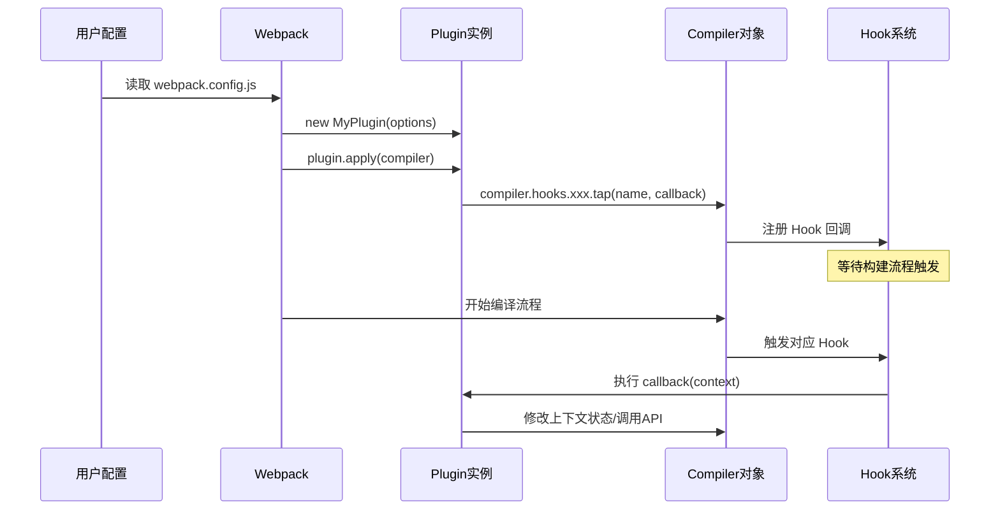

---

## 二、Tapable Hook 系统深度解析

### 2.1 Hook 类型总览（8种）

Webpack 基于 [Tapable](https://github.com/webpack/tapable) 库实现了完整的 Hook 系统。本文聚焦 Webpack 中最常用的 **8 种 Hook 类型**（Tapable 还提供 `SyncLoopHook` 等循环类变体，Webpack 内部基本未使用）：

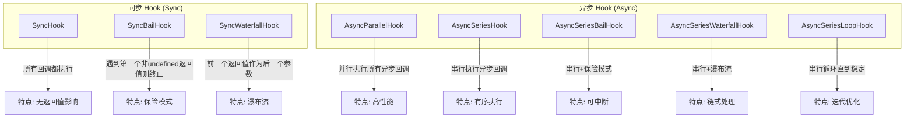

### 2.2 Hook 类型详细对比

| Hook 类型 | 同步/异步 | 执行方式 | 返回值影响 | 适用场景 | 注册方式 |
|-----------|-----------|----------|------------|----------|----------|
| **SyncHook** | 同步 | 顺序执行 | 无 | 简单通知 | `tap` |
| **SyncBailHook** | 同步 | 顺序执行 | 首个非 undefined 终止 | 条件判断（如 shouldEmit） | `tap` |
| **SyncWaterfallHook** | 同步 | 顺序执行 | 前一个输出作为后一个输入 | 值传递与转换 | `tap` |
| **AsyncParallelHook** | 异步 | 并发执行 | 无 | 并行任务（如日志收集） | `tap/tapAsync/tapPromise` |
| **AsyncSeriesHook** | 异步 | 串行执行 | 无 | 有序异步任务（如 emit） | `tap/tapAsync/tapPromise` |
| **AsyncSeriesBailHook** | 异步 | 串行执行 | 首个非 undefined 终止 | 异步条件判断 | `tap/tapAsync/tapPromise` |
| **AsyncSeriesWaterfallHook** | 异步 | 串行执行 | 前一个输出作为后一个输入 | 异步链式处理 | `tap/tapAsync/tapPromise` |
| **AsyncSeriesLoopHook** | 异步 | 循环执行 | 直到返回 undefined | 迭代优化（如 optimize） | `tap/tapAsync/tapPromise` |

### 2.3 三种注册方式对比

```js
// 方式一：tap - 同步注册（适用于 SyncHook 和部分 AsyncHook）
compiler.hooks.compile.tap('MyPlugin', (params) => {
  console.log('同步执行');
});

// 方式二：tapAsync - 异步回调注册
compiler.hooks.emit.tapAsync('MyPlugin', (compilation, callback) => {
  setTimeout(() => {
    console.log('异步完成');
    callback();
  }, 100);
});

// 方式三：tapPromise - Promise 注册（推荐）
compiler.hooks.emit.tapPromise('MyPlugin', async (compilation) => {
  await doSomethingAsync();
  console.log('Promise 完成');
});
```

**选择建议**：
- ✅ **优先使用 `tapPromise`**：代码更简洁，支持 async/await
- ⚠️ **使用 `tapAsync`**：需要兼容旧版 Node.js (< 8)
- 🎯 **使用 `tap`**：仅用于同步 Hook 或不需要等待的场景

### 2.4 Hook 接口层次结构

Webpack 的 Hook 分布在不同的对象上，形成清晰的层次结构：

```mermaid
graph TD
    A[compiler.hooks] --> B[环境初始化]
    A --> C[编译流程]
    A --> D[产物输出]
    A --> E[v5.106+ 新增]

    B --> B1[entryOption]
    B --> B2[afterPlugins]
    B --> B3[beforeRun]
    B --> B4[run]

    C --> C1[compile]
    C --> C2[thisCompilation]
    C --> C3[compilation]
    C --> C4[make]
    C --> C5[afterCompile]

    D --> D1[shouldEmit]
    D --> D2[emit]
    D --> D3[assetEmitted]
    D --> D4[afterEmit]
    D --> D5[done]

    E --> E1[validate]

    F[compilation.hooks] --> F1[模块处理]
    F --> F2[资源管理]
    F --> F3[优化阶段]

    F1 --> F1a[succeedModule]
    F1 --> F1b[failedModule]
    F1 --> F1c[finishModules]

    F2 --> F2a[processAssets]
    F2 --> F2b[additionalAssets]

    F3 --> F3a[optimizeChunks]
    F3 --> F3b[optimizeModules]
    F3 --> F3c[optimizeTree]

    G[normalModuleFactory.hooks] --> G1[parser]
    G --> G2[factory]
    G --> G3[resolver]
```

---

## 三、核心对象深度解析

### 3.1 Compiler vs Compilation 关系图

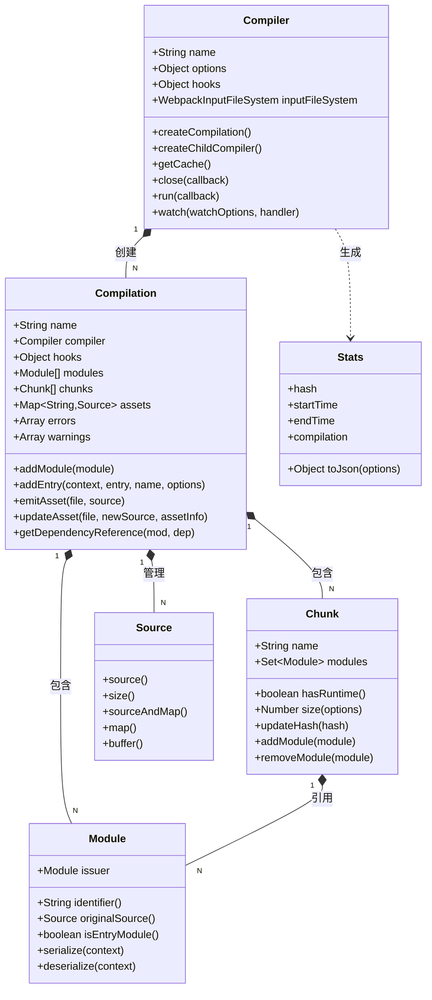

### 3.2 核心对象职责对比

| 对象 | 生命周期 | 主要职责 | 典型接口 |
|------|----------|----------|----------|
| **Compiler** | 全局唯一，跨 build 共享 | 配置管理、插件调度、编译启动 | `createCompilation`, `run`, `watch`, `getCache` |
| **Compilation** | 每次 build 创建 | 模块管理、依赖分析、产物生成 | `addModule`, `emitAsset`, `addEntry` |
| **Module** | 编译过程中创建 | 资源抽象、依赖声明、源码管理 | `identifier`, `originalSource`, `issuer` |
| **Chunk** | seal 阶段创建 | 模块分组、产物组织、哈希计算 | `addModule`, `hasRuntime`, `updateHash` |
| **Source** | emit 阶段使用 | 文件内容抽象、Sourcemap 支持 | `source()`, `size()`, `buffer()` |
| **Stats** | 编译完成后创建 | 构建统计、错误收集、报告生成 | `toJson()`, `hasErrors()`, `hasWarnings()` |

### 3.3 Compiler 核心接口详解

```js
class Compiler {
  // === 生命周期控制 ===
  run(callback) {}                    // 启动单次编译
  watch(watchOptions, handler) {}     // 启动监听模式
  close(callback) {}                  // 关闭编译器

  // === 编译管理 ===
  createCompilation(params) {}        // 创建新 compilation
  createChildCompiler(              // 创建子编译器（多配置场景）
    compilation,
    compilerName,
    compilerIndex
  ) {}

  // === 缓存与日志 ===
  getCache() {}                       // 获取缓存实例（v5 持久化缓存）
  getInfrastructureLogger(name) {}   // 获取基础设施日志器

  // === 文件系统 ===
  inputFileSystem                     // 输入文件系统
  outputFileSystem                    // 输出文件系统
  watchFileSystem                     // 监听文件系统
}
```

### 3.4 Compilation 核心接口详解

```js
class Compilation {
  // === 模块管理 ===
  addModule(module)                   // 添加模块到构建队列
  getModule(moduleIdentifier)         // 根据 ID 获取模块
  waitForFinished()                  // 等待所有模块构建完成

  // === 入口管理 ===
  addEntry(context, entry, name, options) {}  // 动态添加入口

  // === 产物管理 ===
  emitAsset(file, source, assetInfo) {}       // 发射产物文件
  updateAsset(file, newSource, assetInfo) {}  // 更新产物内容
  deleteAsset(file)                           // 删除产物文件
  getAsset(name)                              // 获取产物对象

  // === 错误与警告 ===
  errors: Array<Error>            // 错误列表（会导致构建失败）
  warnings: Array<Error>          // 警告列表（不会阻断构建）

  // === 依赖查询 ===
  getDependencyReference(module, dependency) {}  // 获取依赖引用

  // === 上下文访问 ===
  compiler: Compiler              // 关联的 compiler 实例
  options: Object                 // 当前编译配置
}
```

---

## 四、Plugin 完整生命周期时序图

### 4.1 主要阶段与 Hook 时序

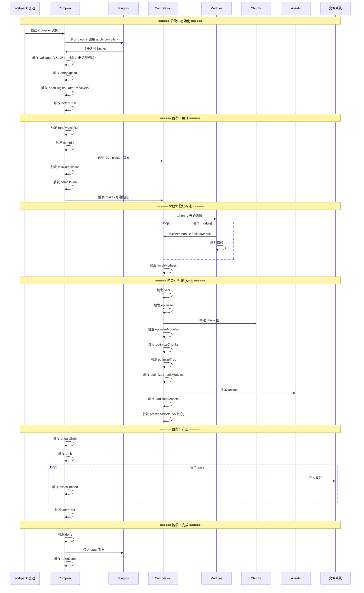

### 4.2 关键 Hook 详细说明

#### Compiler 层级 Hook

| Hook 名称 | 类型 | 触发时机 | 参数 | 典型用途 |
|-----------|------|----------|------|----------|
| `entryOption` | SyncBailHook | 读取 entry 配置后 | context, entry | 修改入口配置 |
| `afterPlugins` | SyncHook | 所有插件初始化完成后 | compiler | 插件间通信 |
| `beforeRun` | AsyncSeriesHook | 编译开始前 | compiler | 清理临时文件 |
| `run` | AsyncSeriesHook | 编译开始（非 watch） | compiler | 启动监控 |
| `watchRun` | AsyncSeriesHook | 监听模式下重新编译前 | compiler | 增量编译准备 |
| `compile` | SyncHook | 创建 compilation 前 | params | 编译参数修改 |
| `thisCompilation` | SyncHook | 创建新的 compilation 时 | compilation, params | **最常用** - 获取 compilation |
| `compilation` | SyncHook | thisCompilation 之后 | compilation, params | 备选方案 |
| `make` | AsyncParallelHook | 正式开始构建时 | compilation | **核心** - 添加入口/模块 |
| `afterCompile` | AsyncSeriesHook | 编译完成后 | compilation | 检查错误/警告 |
| `shouldEmit` | SyncBailHook | 是否应该 emit | compilation | 条件性跳过输出 |
| **`validate`** | SyncHook | **v5.106+** 插件应用后、构建前（初始化阶段） | 无参数 | **新增** - 插件注册自身选项的 schema 校验（`compiler.validate()`） |
| `emit` | AsyncSeriesHook | 生成产物到输出目录 | compilation | **最常用** - 修改产物 |
| `assetEmitted` | AsyncSeriesHook | 单个文件输出后 | file, info（含 content 等） | 文件级处理 |
| `afterEmit` | AsyncSeriesHook | 所有文件输出后 | compilation | 后处理 |
| `done` | AsyncSeriesHook | 编译完成 | stats | 构建报告/通知 |
| `failed` | SyncHook | 编译失败 | error | 错误处理 |
| `invalid` | SyncHook | 监听模式下文件变更 | filename, changeTime | 触发重编译 |
| `watchClose` | SyncHook | 停止监听 | watcher | 清理资源 |

#### Compilation 层级 Hook

| Hook 名称 | 类型 | 触发时机 | 参数 | 典型用途 |
|-----------|------|----------|------|----------|
| `succeedModule` | SyncHook | 单个模块成功编译 | module | 模块级处理 |
| `failedModule` | SyncHook | 单个模块编译失败 | module, error | 错误收集 |
| `finishModules` | AsyncSeriesHook | 所有模块编译完成 | modules | Lint 检查 |
| `seal` | SyncHook | 开始封装阶段 | - | 准备优化 |
| `optimize` | SyncHook | 开始优化 | - | 全局优化 |
| `optimizeModules` | SyncBailHook | 优化模块 | modules | 模块级优化 |
| `optimizeChunks` | SyncBailHook | 优化 chunk | chunks, chunkGroups | chunk 合并/拆分 |
| `optimizeTree` | AsyncSeriesHook | 优化模块树 | chunks, modules | 深度优化 |
| `additionalAssets` | AsyncSeriesHook | 额外资产生成 | - | 动态添加资源 |
| `processAssets` | AsyncSeriesHook | **v5 核心** 处理资产 | assets | **最常用** - 修改最终产物 |

---

## 五、知名插件设计模式剖析

### 5.1 设计模式总览

从 Webpack 生态中广泛使用的插件中，我们可以提炼出 **3 种经典设计模式**：

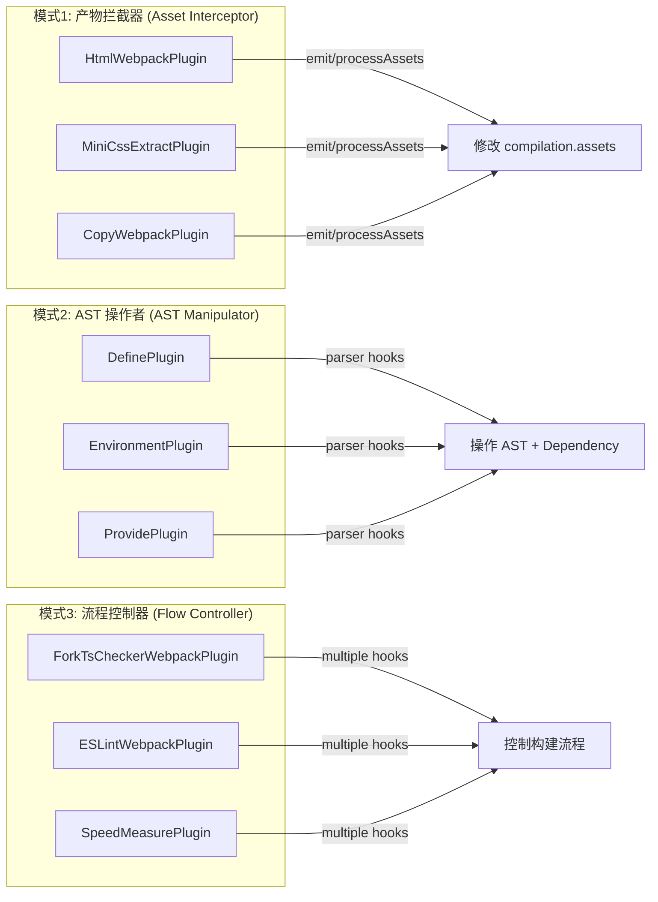

---

### 5.2 模式一：产物拦截器 (Asset Interceptor Pattern)

**典型代表**：HtmlWebpackPlugin、MiniCssExtractPlugin、CopyWebpackPlugin

#### 核心特征：
- ✅ 在 `emit` 或 `processAssets` 阶段介入
- ✅ 直接操作 `compilation.assets` 对象
- ✅ 读取/修改/删除/新增产物文件
- ✅ 通常配合模板引擎或文件复制工具

#### 案例：MiniCssExtractPlugin 精简实现

```js
const { sources } = require('webpack-sources');

class MiniCssExtractPlugin {
  constructor(options = {}) {
    this.options = {
      filename: '[name].css',
      chunkFilename: '[id].css',
      ...options
    };
  }

  apply(compiler) {
    // ========== 模式要点1：监听 processAssets 钩子 ==========
    compiler.hooks.thisCompilation.tap(
      'MiniCssExtractPlugin',
      (compilation) => {
        // v5 推荐：使用 processAssets 替代旧的 emit 钩子
        compilation.hooks.processAssets.tap(
          {
            name: 'MiniCssExtractPlugin',
            stage: compiler.webpack.Compilation.PROCESS_ASSETS_STAGE_OPTIMIZE  // 优化阶段
          },
          (assets) => {
            this.extractCSS(compilation);
          }
        );
      }
    );

    // ========== 模式要点2：监听渲染钩子注入 runtime ==========
    compiler.hooks.thisCompilation.tap(
      'MiniCssExtractPlugin',
      (compilation) => {
        compilation.hooks.renderManifest.tap(
          'MiniCssExtractPlugin',
          (result, { chunk }) => {
            // 为每个 chunk 生成对应的 CSS 文件
            const cssFilename = this.options.filename.replace(
              '[name]',
              chunk.name
            );

            result.push({
              render: () => new sources.RawSource(this.getCSSContentForChunk(chunk)),
              filename: cssFilename,
              info: { development: true },
              additionalAssets: []
            });
          }
        );
      }
    );
  }

  extractCSS(compilation) {
    // ========== 模式要点3：遍历并提取 CSS ==========
    for (const [filename, asset] of Object.entries(compilation.assets)) {
      if (this.isCSSModule(filename)) {
        const source = asset.source();

        // 从 JS 中提取 CSS 内容
        const extractedCSS = this.extractCSSFromJS(source);

        if (extractedCSS) {
          // 生成新的 CSS 文件
          const cssFilename = filename.replace('.js', '.css');
          compilation.emitAsset(
            cssFilename,
            new sources.RawSource(extractedCSS)
          );

          // 可选：从原文件移除 CSS（已提取）
          // delete compilation.assets[filename];
        }
      }
    }
  }

  isCSSModule(filename) {
    return filename.endsWith('.css.js') || filename.includes('.css');
  }

  extractCSSFromJS(source) {
    // 简化的 CSS 提取逻辑
    const cssMatch = source.match(/\/\*__CSS_CONTENT__\*\/([\s\S]*?)\/\*__END_CSS__\*\//);
    return cssMatch ? cssMatch[1] : null;
  }

  getCSSContentForChunk(chunk) {
    let css = '';
    for (const module of chunk.modulesIterable) {
      if (module.type === 'css/mini-extract') {
        css += module.originalSource()?.source() || '';
      }
    }
    return css;
  }
}

module.exports = MiniCssExtractPlugin;
```

**模式总结**：
```js
// ✅ 产物拦截器模式通用模板
class AssetInterceptorPlugin {
  apply(compiler) {
    compiler.hooks.thisCompilation.tap(pluginName, (compilation) => {
      // 方案A：使用 processAssets（v5 推荐）
      compilation.hooks.processAssets.tap(
        { name: pluginName, stage: compiler.webpack.Compilation.PROCESS_ASSETS_STAGE_OPTIMIZE },
        (assets) => {
          // 1. 遍历 assets
          for (const [file, asset] of Object.entries(compilation.assets)) {
            // 2. 读取内容
            const content = asset.source();

            // 3. 处理内容
            const processed = this.process(content);

            // 4. 更新/新增/删除
            compilation.updateAsset(file, new RawSource(processed));
            // 或: compilation.emitAsset(newFile, new RawSource(data));
            // 或: compilation.deleteAsset(file);
          }
        }
      );

      // 方案B：使用 emit（兼容旧版）
      // compiler.hooks.emit.tapAsync(pluginName, (compilation, cb) => { ... });
    });
  }
}
```

---

### 5.3 模式二：AST 操作者 (AST Manipulator Pattern)

**典型代表**：DefinePlugin、EnvironmentPlugin、ProvidePlugin

#### 核心特征：
- ✅ 在 Parser 阶段介入（编译早期）
- ✅ 通过 `normalModuleFactory.hooks.parser` 获取解析器
- ✅ 利用 `parser.hooks.expression` 等 Hook 操作 AST
- ✅ 创建 Dependency 对象声明代码依赖
- ✅ 最终由 Template 替换代码内容

#### 案例：DefinePlugin 核心逻辑精解

```js
const ConstDependency = require('webpack/lib/dependencies/ConstDependency');

class DefinePlugin {
  constructor(definitions) {
    this.definitions = definitions;
  }

  apply(compiler) {
    // ========== 模式要点1：获取 Parser 实例 ==========
    compiler.hooks.compilation.tap(
      'DefinePlugin',
      (compilation, { normalModuleFactory }) => {

        // ========== 模式要点2：为不同模块类型注册处理器 ==========
        const handler = (parser) => {
          // 递归处理定义的对象
          this.walkDefinitions(parser, this.definitions, '');
        };

        // 支持多种 JavaScript 模块类型
        for (const type of ['javascript/auto', 'javascript/dynamic', 'javascript/esm']) {
          normalModuleFactory.hooks.parser
            .for(type)
            .tap('DefinePlugin', handler);
        }
      }
    );
  }

  walkDefinitions(parser, definitions, prefix) {
    for (const key of Object.keys(definitions)) {
      const code = definitions[key];

      if (typeof code === 'object' && code && !Array.isArray(code)) {
        // 递归处理嵌套对象
        this.walkDefinitions(parser, code, prefix + key + '.');
        this.applyObjectDefine(parser, prefix + key, code);
      } else {
        // 处理基本类型值
        this.applyDefineKey(parser, prefix, key);
        this.applyDefine(parser, prefix + key, code);
      }
    }
  }

  applyDefine(parser, expressionName, code) {
    // ========== 模式要点3：注册表达式替换回调 ==========
    parser.hooks.expression
      .for(expressionName)
      .tap('DefinePlugin', (expr) => {
        // 与真实 DefinePlugin 一致：字符串值视为代码片段原样注入，
        // 其余类型经 JSON 序列化为字面量（如 true -> true、"abc" -> "abc"）
        const replacement = typeof code === 'string' ? code : JSON.stringify(code);

        // ========== 模式要点4：创建 ConstDependency ==========
        const dep = new ConstDependency(
          replacement,             // 替换后的代码
          expr.range               // 要替换的位置范围
        );
        dep.loc = expr.loc;        // 保留位置信息（用于 sourcemap）

        // 将依赖添加到当前模块
        parser.state.module.addPresentationalDependency(dep);

        return true;               // 告诉 Parser 已处理该节点
      });

    // 处理 typeof 场景：typeof PROD -> typeof (true)
    parser.hooks.typeof
      .for(expressionName)
      .tap('DefinePlugin', (expr) => {
        const replacement = typeof code === 'string' ? code : JSON.stringify(code);
        const dep = new ConstDependency(
          `typeof (${replacement})`,
          expr.range
        );
        dep.loc = expr.loc;
        parser.state.module.addPresentationalDependency(dep);
        return true;
      });
  }

  applyObjectDefine(parser, expressionName, obj) {
    // 处理对象类型：{ KEY: { subKey: value } } -> KEY.subKey = value
    parser.hooks.expression
      .for(expressionName)
      .tap('DefinePlugin', (expr) => {
        const dep = new ConstDependency(
          `(${JSON.stringify(obj)})`,
          expr.range
        );
        dep.loc = expr.loc;
        parser.state.module.addPresentationalDependency(dep);
        return true;
      });
  }
}

module.exports = DefinePlugin;
```

**执行流程示意**：

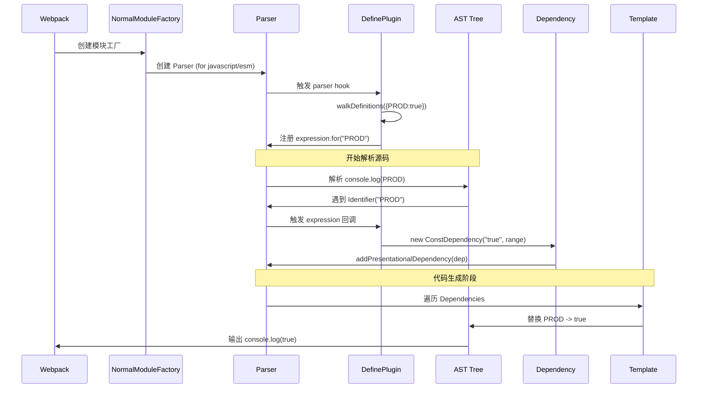

**模式总结**：
```js
// ✅ AST 操作者模式通用模板
class ASTManipulatorPlugin {
  apply(compiler) {
    compiler.hooks.compilation.tap(pluginName, (compilation, params) => {
      const { normalModuleFactory } = params;

      const handler = (parser) => {
        // 1. 注册表达式级别 Hook
        parser.hooks.expression.for('TARGET_VAR').tap(pluginName, (expr) => {
          const dep = new ConstReplacement(
            replacementCode,  // 替换内容
            expr.range        // 替换位置
          );
          parser.state.module.addPresentationalDependency(dep);
          return true;
        });

        // 2. 注册语句级别 Hook（可选）
        parser.hooks.statementIf.tap(pluginName, (statement) => {
          // 处理 if 语句等
        });

        // 3. 注册其他 Parser Hook
        // parser.hooks.call.for('xxx').tap(...)
        // parser.hooks.evaluateTypeof.for('xxx').tap(...)
        // parser.hooks.canRename.for('xxx').tap(...)
      };

      // 支持多种模块类型
      ['javascript/auto', 'javascript/dynamic', 'javascript/esm'].forEach(type => {
        normalModuleFactory.hooks.parser.for(type).tap(pluginName, handler);
      });
    });
  }
}
```

---

### 5.4 模式三：流程控制器 (Flow Controller Pattern)

**典型代表**：ESLintWebpackPlugin、ForkTsCheckerWebpackPlugin、SpeedMeasurePlugin

#### 核心特征：
- ✅ 使用多个 Hook 协同工作
- ✅ 在不同时间点执行不同任务
- ✅ 可能涉及异步任务协调
- ✅ 通过 `errors/warnings` 收集问题
- ✅ 不直接修改产物，而是控制/监控流程

#### 案例：ESLintWebpackPlugin 精简实现

```js
class ESLintWebpackPlugin {
  constructor(options = {}) {
    this.options = {
      extensions: ['js', 'jsx'],
      exclude: /node_modules/,
      failOnError: false,
      failOnWarning: false,
      threads: true,
      ...options
    };
    this.key = 'ESLintWebpackPlugin';
  }

  apply(compiler) {
    // ========== 模式要点1：多层 Hook 协调 ==========
    // 第一层：编译启动时初始化
    compiler.hooks.run.tapPromise(this.key, (compiler) =>
      this.initializeLinting(compiler)
    );

    // 第二层：每次 compilation 创建时设置
    compiler.hooks.compilation.tap(this.key, (compilation) => {
      this.setupCompilationHooks(compilation);
    });
  }

  async initializeLinting(compiler) {
    // 初始化 ESLint 实例、线程池等
    this.linter = await this.createLinter();
  }

  setupCompilationHooks(compilation) {
    const filesToLint = [];

    // ========== 模式要点2：模块级 Hook - 逐个检查 ==========
    compilation.hooks.succeedModule.tap(this.key, (module) => {
      const file = module.resource;

      // 过滤不符合条件的文件
      if (!file || !this.shouldLint(file)) return;

      // 非阻塞地提交检查任务
      filesToLint.push(file);

      if (this.linter) {
        this.linter.lint(file);  // 异步执行，不阻塞构建
      }
    });

    // ========== 模式要点3：批量处理 Hook - 收集结果 ==========
    compilation.hooks.finishModules.tapAsync(this.key, (modules, callback) => {
      // 所有模块处理完毕，可以批量处理剩余文件
      if (filesToLint.length > 0 && !this.options.threads) {
        this.linter.lint(filesToLint);
      }
      callback();
    });

    // ========== 模式要点4：结果处理 Hook - 报告问题 ==========
    compilation.hooks.additionalAssets.tapPromise(this.key, async () => {
      await this.reportResults(compilation);
    });
  }

  shouldLint(filepath) {
    const ext = filepath.split('.').pop();
    const hasValidExtension = this.options.extensions.includes(ext);
    const isNotExcluded = !this.options.exclude.test(filepath);
    return hasValidExtension && isNotExcluded;
  }

  async reportResults(compilation) {
    // 等待所有 lint 任务完成
    const { errors, warnings } = await this.linter.getResults();

    // ========== 模式要点5：通过 compilation API 提交问题 ==========
    if (warnings?.length > 0) {
      if (this.options.failOnWarning) {
        compilation.errors.push(...warnings);
      } else {
        compilation.warnings.push(...warnings);
      }
    }

    if (errors?.length > 0) {
      if (this.options.failOnError) {
        compilation.errors.push(...errors);
      } else {
        compilation.warnings.push(...errors);
      }
    }
  }

  async createLinter() {
    // 创建 ESLint 实例（简化版）
    return {
      lint(files) {
        console.log(`[ESLint] Linting: ${files}`);
      },
      async getResults() {
        return { errors: [], warnings: [] };
      }
    };
  }
}

module.exports = ESLintWebpackPlugin;
```

**Hook 协调时序**：

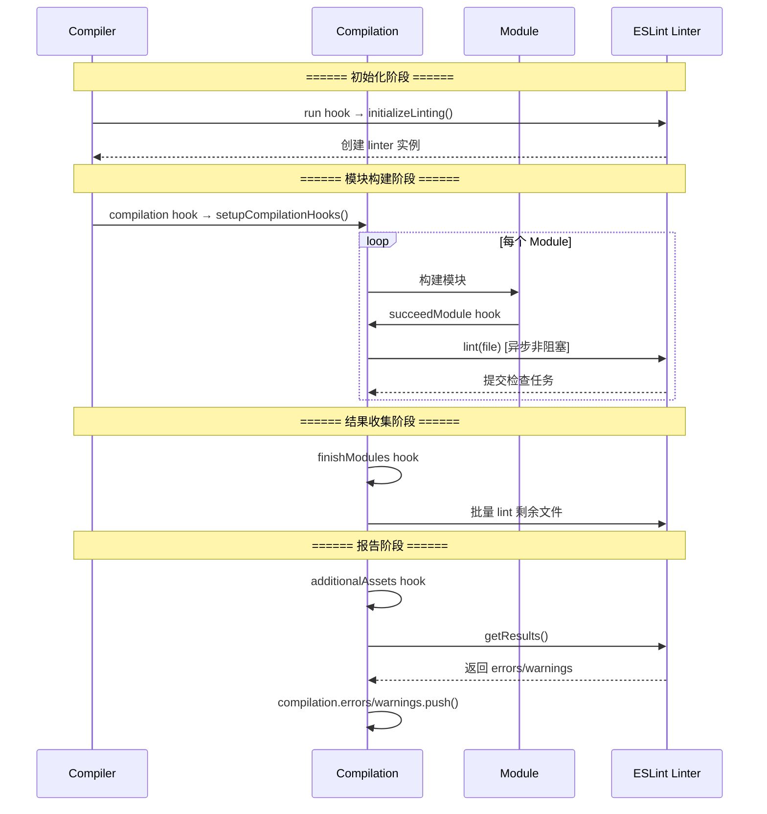

**模式总结**：
```js
// ✅ 流程控制器模式通用模板
class FlowControllerPlugin {
  apply(compiler) {
    // 1. 初始化阶段
    compiler.hooks.run.tapPromise(pluginName, async (compiler) => {
      await this.init();
    });

    // 2. 每次编译设置
    compiler.hooks.compilation.tap(pluginName, (compilation) => {
      // 2a. 模块级处理（高频触发）
      compilation.hooks.succeedModule.tap(pluginName, (module) => {
        this.processModule(module);  // 快速、非阻塞
      });

      // 2b. 批量处理（低频触发）
      compilation.hooks.finishModules.tap(pluginName, (modules) => {
        this.batchProcess(modules);
      });

      // 2c. 结果汇总
      compilation.hooks.additionalAssets.tapPromise(pluginName, async () => {
        await this.collectResults(compilation);
      });
    });
  }

  async init() {}
  processModule(module) {}
  batchProcess(modules) {}
  async collectResults(compilation) {
    // 使用 compilation.errors/warnings 提交问题
  }
}
```

---

### 5.5 三种模式选择指南

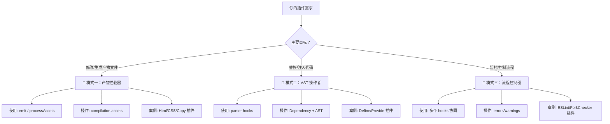

| 维度 | 产物拦截器 | AST 操作者 | 流程控制器 |
|------|-----------|-----------|-----------|
| **介入时机** | emit / processAssets | Parser 阶段 | 多个阶段 |
| **操作对象** | compilation.assets | AST / Dependency | errors / warnings |
| **复杂度** | ⭐⭐ | ⭐⭐⭐⭐ | ⭐⭐⭐ |
| **适用场景** | 文件处理、模板渲染 | 代码转换、变量注入 | 代码检查、性能监控 |
| **典型插件** | HtmlWebpackPlugin | DefinePlugin | ESLintWebpackPlugin |

---

## 六、完整 Plugin 开发模板

### 6.1 基础模板（推荐）

```js
/**
 * @fileoverview 你的插件名称和简要描述
 * @version 1.0.0
 * @author Your Name
 */

'use strict';

const PLUGIN_NAME = 'YourPluginName';

class YourPluginName {
  /**
   * @param {Object} [options={}] - 插件配置选项
   * @param {boolean} [options.debug=false] - 调试模式
   * @param {RegExp} [options.test=/\.js$/] - 匹配规则
   */
  constructor(options = {}) {
    this.options = {
      debug: false,
      test: /\.js$/,
      ...options
    };

    this._validateOptions();
  }

  _validateOptions() {
    // 参数校验逻辑
    if (this.options.test && !(this.options.test instanceof RegExp)) {
      throw new Error(`${PLUGIN_NAME}: "test" option must be a RegExp`);
    }
  }

  /**
   * Webpack 插件入口方法
   * @param {import('webpack').Compiler} compiler - 编译器实例
   */
  apply(compiler) {
    // 获取 webpack 实例（兼容性处理）
    const webpack = compiler.webpack || require('webpack');

    // 日志工具
    const logger = compiler.getInfrastructureLogger(PLUGIN_NAME);

    // ========== Hook 注册区 ==========

    // 1. 编译初始化阶段
    compiler.hooks.thisCompilation.tap(PLUGIN_NAME, (compilation) => {
      logger.debug('compilation created:', compilation.name);

      // 2. 资源处理阶段（v5 推荐）
      compilation.hooks.processAssets.tap(
        {
          name: PLUGIN_NAME,
          stage: webpack.Compilation.PROCESS_ASSETS_STAGE_OPTIMIZE
        },
        (assets) => {
          this.processAssets(compilation, assets, logger);
        }
      );
    });

    // 3. （可选）使用 emit 钩子（兼容旧版）
    // compiler.hooks.emit.tapAsync(PLUGIN_NAME, (compilation, callback) => {
    //   this.handleEmit(compilation, logger);
    //   callback();
    // });

    // 4. （可选）编译完成阶段
    compiler.hooks.done.tap(PLUGIN_NAME, (stats) => {
      if (this.options.debug) {
        logger.info('Build completed:', {
          time: stats.endTime - stats.startTime,
          hasErrors: stats.hasErrors(),
          hasWarnings: stats.hasWarnings()
        });
      }
    });
  }

  /**
   * 处理资源文件
   * @param {import('webpack').Compilation} compilation
   * @param {Object} assets
   * @param {Object} logger
   */
  processAssets(compilation, assets, logger) {
    const { sources } = require('webpack-sources');

    for (const [filename, asset] of Object.entries(compilation.assets)) {
      if (!this.options.test.test(filename)) continue;

      try {
        const source = asset.source();
        const processed = this.transformSource(source, filename);

        if (processed !== null) {
          compilation.updateAsset(
            filename,
            new sources.RawSource(processed),
            { [PLUGIN_NAME]: true }  // assetInfo 元数据
          );

          logger.info(`Processed: ${filename}`);
        }
      } catch (error) {
        compilation.errors.push(
          new Error(`${PLUGIN_NAME}: Error processing ${filename}: ${error.message}`)
        );
      }
    }
  }

  /**
   * 转换源码（自定义逻辑）
   * @param {string} source - 原始源码
   * @param {string} filename - 文件名
   * @returns {string|null} 转换后的源码，返回 null 表示不处理
   */
  transformSource(source, filename) {
    // TODO: 实现你的转换逻辑
    // 示例：添加注释头
    return `/* Generated by ${PLUGIN_NAME} */\n${source}`;
  }
}

module.exports = YourPluginName;
```

### 6.2 使用示例

```js
// webpack.config.js
const path = require('path');
const YourPluginName = require('./your-plugin-name');

module.exports = {
  mode: 'production',
  entry: './src/index.js',
  output: {
    path: path.resolve(__dirname, 'dist'),
    filename: '[name].[contenthash].js'
  },
  plugins: [
    new YourPluginName({
      debug: true,
      test: /\.(js|css)$/,
      // 其他自定义选项...
    })
  ]
};
```

### 6.3 TypeScript 版本模板

```typescript
import type { Compiler, Compilation, Asset } from 'webpack';
import type { Sources } from 'webpack-sources';

interface PluginOptions {
  debug?: boolean;
  test?: RegExp;
  [key: string]: any;
}

const PLUGIN_NAME = 'YourPluginName';

export default class YourPluginName {
  private readonly options: Required<PluginOptions>;

  constructor(options: PluginOptions = {}) {
    this.options = {
      debug: false,
      test: /\.js$/,
      ...options
    };
  }

  apply(compiler: Compiler): void {
    const webpack = compiler.webpack || require('webpack') as typeof import('webpack');
    const logger = compiler.getInfrastructureLogger(PLUGIN_NAME);

    compiler.hooks.thisCompilation.tap(PLUGIN_NAME, (compilation: Compilation) => {
      compilation.hooks.processAssets.tap(
        {
          name: PLUGIN_NAME,
          stage: webpack.Compilation.PROCESS_ASSETS_STAGE_OPTIMIZE
        },
        (assets: Record<string, Asset>) => {
          this.processAssets(compilation, assets, logger);
        }
      );
    });
  }

  private processAssets(
    compilation: Compilation,
    assets: Record<string, Asset>,
    logger: ReturnType<Compiler['getInfrastructureLogger']>
  ): void {
    const { RawSource } = require('webpack-sources') as typeof import('webpack-sources');

    for (const [filename, asset] of Object.entries(compilation.assets)) {
      if (!this.options.test.test(filename)) continue;

      const source = asset.source();
      const processed = this.transformSource(source, filename);

      if (processed !== null) {
        compilation.updateAsset(
          filename,
          new RawSource(processed),
          { [PLUGIN_NAME]: true }
        );
      }
    }
  }

  private transformSource(source: string, filename: string): string | null {
    return `/* Generated by ${PLUGIN_NAME} */\n${source}`;
  }
}
```

---

## 七、实战技巧与最佳实践

### 7.1 Hook 选择决策树

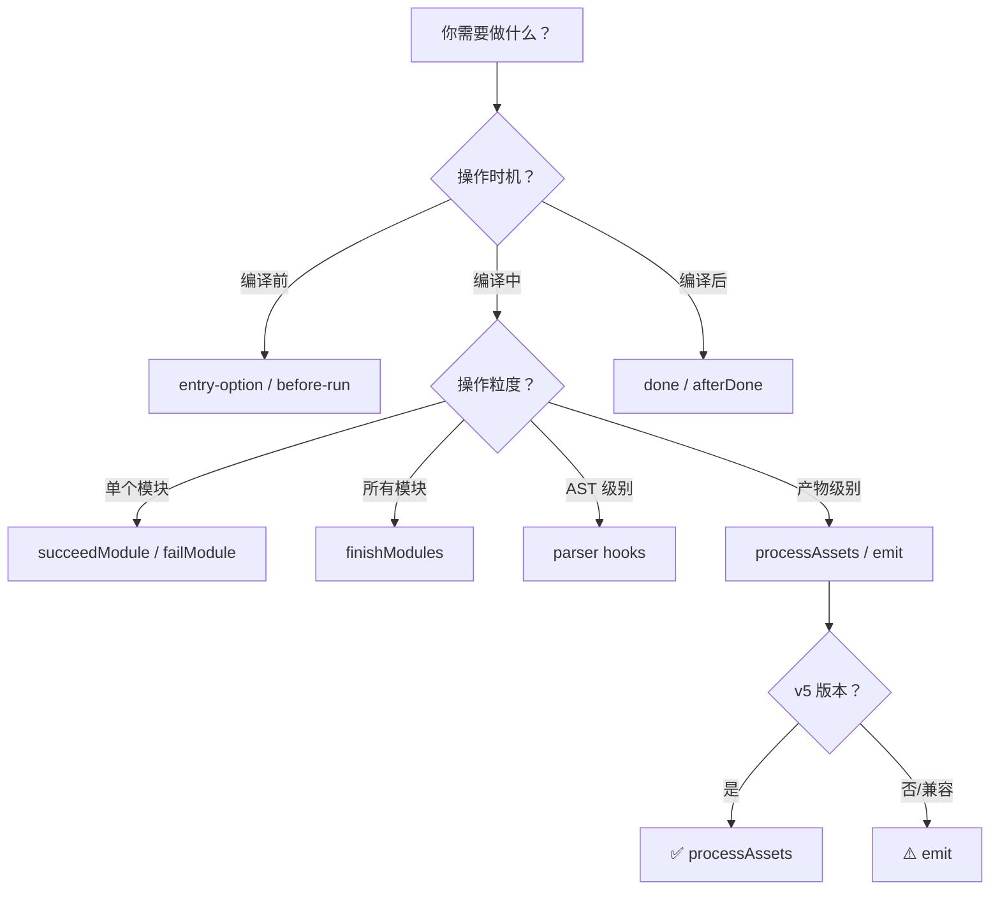

### 7.2 常见问题排查

| 问题现象 | 可能原因 | 解决方案 |
|----------|----------|----------|
| Hook 不触发 | Hook 名称拼写错误 | 查阅官方 API 文档确认名称 |
| tapAsync 卡住 | 忘记调用 callback() | 确保在异步操作完成后调用 callback |
| 产物修改无效 | 阶段太晚/太早 | 调整 `stage` 参数 |
| 编译报错 | 上下文 API 用错 | 检查对象类型和方法签名 |
| 性能问题 | 在同步 Hook 中做耗时操作 | 改用 `tapAsync`/`tapPromise` |
| 内存泄漏 | 事件监听未清理 | 在适当 Hook 中清理资源 |

### 7.3 调试技巧

```js
class DebugHelperPlugin {
  apply(compiler) {
    const logger = compiler.getInfrastructureLogger('DebugHelper');

    // 监听 emit 钩子（异步 Hook 需用 tap 注册，webpack 内部通过 callAsync 触发）
    compiler.hooks.emit.tap('DebugHelper', (compilation) => {
      logger.warn('=== EMIT HOOK TRIGGERED ===');
      logger.warn('compilation.assets keys:', Object.keys(compilation.assets));
    });

    // 打印 compilation 创建信息
    compiler.hooks.thisCompilation.tap('DebugHelper', (compilation) => {
      logger.info('New compilation created:', {
        name: compilation.name,
        compiler: compilation.compiler.name
      });
    });
  }
}
```

### 7.4 性能优化建议

1. **避免不必要的操作**
   ```js
   // ❌ 差：每次都遍历所有 assets
   compilation.hooks.processAssets.tap(pluginName, (assets) => {
     for (const file of Object.keys(assets)) { /* ... */ }
   });

   // ✅ 好：提前过滤
   compilation.hooks.processAssets.tap(pluginName, (assets) => {
     const targetFiles = Object.keys(assets).filter(f => f.endsWith('.js'));
     for (const file of targetFiles) { /* ... */ }
   });
   ```

2. **利用缓存**
   ```js
   const { RawSource } = require('webpack-sources');

   class CachedPlugin {
     constructor() {
       this.cache = new Map();
     }

     // 代价较高的转换逻辑（此处以大写转换示意）
     process(source) {
       return source.toUpperCase();
     }

     apply(compiler) {
       compiler.hooks.thisCompilation.tap(pluginName, (compilation) => {
         compilation.hooks.processAssets.tap(pluginName, (assets) => {
           for (const [file, asset] of Object.entries(assets)) {
             const cacheKey = `${file}:${asset.source().length}`;

             if (this.cache.has(cacheKey)) {
               // 使用缓存结果
               compilation.updateAsset(file, this.cache.get(cacheKey));
             } else {
               // 处理并存入缓存
               const result = new RawSource(this.process(asset.source()));
               this.cache.set(cacheKey, result);
               compilation.updateAsset(file, result);
             }
           }
         });
       });
     }
   }
   ```

3. **合理设置 stage**
   ```js
   compilation.hooks.processAssets.tap(
     {
       name: pluginName,
       // 根据需求选择合适的阶段
       stage: compilation.PROCESS_ASSETS_STAGE_OPTIMIZE  // 优化阶段
       // compilation.PROCESS_ASSETS_STAGE_PRE_PROCESS   // 预处理
       // compilation.PROCESS_ASSETS_STAGE_DERIVED       // 衍生资源
       // compilation.PROCESS_ASSETS_STAGE_ADDITIONAL     // 额外资源
       // compilation.PROCESS_ASSETS_STAGE_OPTIMIZE_SIZE  // 大小优化
       // compilation.PROCESS_ASSETS_STAGE_DEV_TOOLING    // 开发工具
       // compilation.PROCESS_ASSETS_STAGE_OPTIMIZE_COUNT // 优化计数
       // compilation.PROCESS_ASSETS_STAGE_SUMMARIZE      // 汇总
       // compilation.PROCESS_ASSETS_STAGE_REPORT         // 报告
     },
     handler
   );
   ```

---

## 八、v5.106+ 新特性：validate 钩子

Webpack v5.106 新增了 `compiler.hooks.validate` 钩子（`SyncHook`，无参数），在**所有插件 `apply` 执行完、构建开始前**的初始化阶段触发。它用于插件向 webpack 统一的校验流程**注册自身的选项 schema 校验**（内部插件如 BannerPlugin 即此用法），而不是在 emit 前检查产物：

```js
class ValidationPlugin {
  constructor(options = {}) {
    this.options = options;
  }

  apply(compiler) {
    // v5.106+ 新增；低版本不存在该钩子，先做特性检测
    if (compiler.hooks.validate) {
      compiler.hooks.validate.tap('ValidationPlugin', () => {
        // 通过 compiler.validate() 走 webpack 统一的 schema 校验与错误报告
        compiler.validate(
          () => require('./validation-plugin.schema.json'),
          this.options,
          { name: 'Validation Plugin', baseDataPath: 'options' },
          (options) => require('./validation-plugin.schema.check')(options)
        );
      });
    }
  }
}
```

若需要在产物输出前做**产物级**检查，应使用 `compilation.hooks.processAssets`（或 `compiler.hooks.emit`）：

```js
class EmptyAssetCheckPlugin {
  apply(compiler) {
    compiler.hooks.thisCompilation.tap('EmptyAssetCheckPlugin', (compilation) => {
      compilation.hooks.processAssets.tap(
        { name: 'EmptyAssetCheckPlugin', stage: compiler.webpack.Compilation.PROCESS_ASSETS_STAGE_ANALYSE },
        () => {
          // 示例：确保没有空文件
          for (const [filename, asset] of Object.entries(compilation.assets)) {
            if (asset.size() === 0) {
              compilation.warnings.push(new Error(`Empty asset detected: ${filename}`));
            }
          }
        }
      );
    });
  }
}
```

**使用场景**：
- ✅ 插件选项的 schema 校验（validate 钩子）
- ✅ 产物完整性检查（processAssets）
- ✅ 安全策略验证
- ✅ 自定义约束条件

---

## 九、知名插件速查表

| 插件名称 | 设计模式 | 核心 Hook | 功能描述 |
|----------|----------|-----------|----------|
| **HtmlWebpackPlugin** | 产物拦截器 | `processAssets` | 生成 HTML 并自动引入资源 |
| **MiniCssExtractPlugin** | 产物拦截器 | `processAssets` + `renderManifest` | 提取 CSS 到独立文件 |
| **CopyWebpackPlugin** | 产物拦截器 | `processAssets` | 复制静态资源到输出目录 |
| **DefinePlugin** | AST 操作者 | `parser.hooks.expression` | 编译时注入全局常量 |
| **ProvidePlugin** | AST 操作者 | `parser.hooks.expression` | 自动加载模块无需 import |
| **EnvironmentPlugin** | AST 操作者 | `parser.hooks.expression` | 从 process.env 定义常量 |
| **ESLintWebpackPlugin** | 流程控制器 | `succeedModule` + `additionalAssets` | ESLint 代码检查 |
| **ForkTsCheckerWebpackPlugin** | 流程控制器 | `make` + `done` | 外部进程 TS 类型检查 |
| **ImageminWebpackPlugin** | 产物拦截器 | `emit` | 图片压缩优化 |
| **CompressionPlugin** | 产物拦截器 | `processAssets` | 生成 gzip/brotli 压缩文件 |
| **BannerPlugin** | 产物拦截器 | `processAssets`（+ `validate` 注册选项校验） | 在产物头部/尾部添加 banner 注释 |
| **HotModuleReplacementPlugin** | 流程控制器 | 多个 hooks | 模块热替换支持 |

---

## 十、总结

本章我们从 **插件基本形态** 出发，深入剖析了 Webpack 的 **Tapable Hook 系统**（8 种类型）、**核心对象体系**（Compiler/Compilation/Module/Chunk）、**完整生命周期**（6 大阶段 30+ 个 Hook），并通过 **3 种经典设计模式**（产物拦截器、AST 操作者、流程控制器）结合 **6 个知名插件** 的源码分析，为你构建了完整的 Webpack 插件开发知识体系。

### 核心知识点回顾

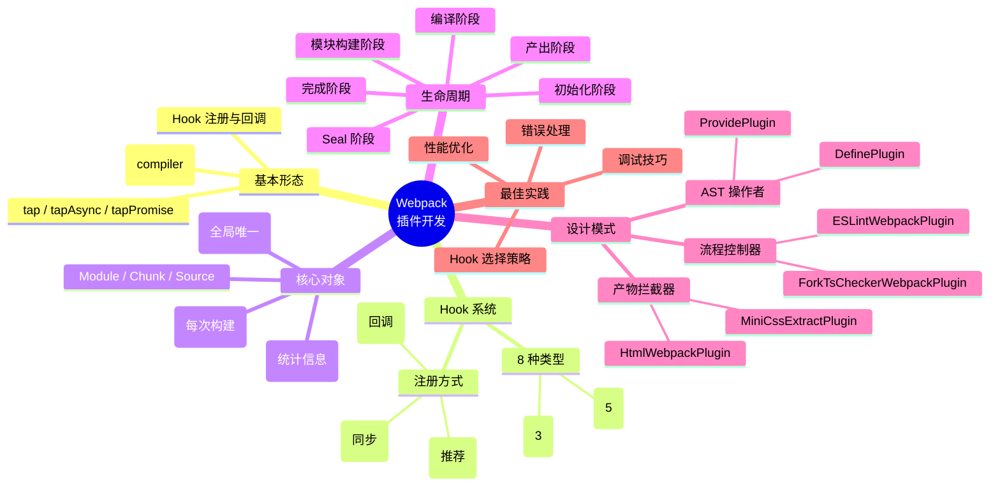

### 学习路径建议

1. **入门阶段**：理解基本形态，尝试编写简单的产物处理插件
2. **进阶阶段**：掌握 8 种 Hook 类型和 3 种注册方式的区别
3. **熟练阶段**：能够根据需求选择合适的设计模式和 Hook 组合
4. **精通阶段**：阅读官方插件源码，理解底层实现原理

### 下一章预告

下一章节我们将继续深入，包括：
- 🔧 **插件参数校验**：使用 schema 进行严格的参数验证
- 📝 **日志系统**：正确使用 `getInfrastructureLogger`
- 🧪 **自动化测试**：搭建插件单元测试和集成测试环境
- 📦 **发布流程**：将插件发布到 npm 的最佳实践

---

## 思考题

1. **对比分析**：Rollup 的插件架构（基于 Acorn + Magic String）与 Webpack（基于 Tapable + AST）有何异同？各有什么优缺点？

2. **场景实践**：假设你需要开发一个插件，功能是"自动为所有生成的 JS 文件添加构建时间和 Git Commit Hash 的注释"，你会选择哪种设计模式？使用哪些 Hook？请给出大致的实现思路。

3. **性能挑战**：如果一个项目有 500 个模块，你的插件需要在每个模块编译完成后进行耗时 50ms 的外部 API 调用，如何避免严重拖慢构建速度？

4. **扩展思考**：Webpack v5 的 Module Federation（模块联邦）对插件开发带来了哪些新的可能性？如何在插件中利用这一特性？

---

## 参考资源

### 官方文档
- [Webpack Plugin API](https://webpack.js.org/api/plugins/)
- [Compiler Hooks](https://webpack.js.org/api/compiler-hooks/)
- [Compilation Hooks](https://webpack.js.org/api/compilation-hooks/)
- [Tapable Documentation](https://github.com/webpack/tapable)

### 源码仓库
- [Webpack Core](https://github.com/webpack/webpack)
- [Tapable](https://github.com/webpack/tapable)
- [webpack-sources](https://github.com/webpack/webpack-sources)

### 知名插件
- [HtmlWebpackPlugin](https://github.com/jantimon/html-webpack-plugin)
- [MiniCssExtractPlugin](https://github.com/webpack-contrib/mini-css-extract-plugin)
- [ESLintWebpackPlugin](https://github.com/webpack-contrib/eslint-webpack-plugin)
- [CopyWebpackPlugin](https://github.com/webpack-contrib/copy-webpack-plugin)

---

> 📖 **版本说明**：本文档基于 **Webpack v5.107** 编写，涵盖最新的 Hook 系统、API 变更和最佳实践。如发现内容与最新版本不符，欢迎提 Issue 反馈。
>
> 💡 **互动提示**：建议读者在阅读时结合实际项目练习，先从简单的产物处理插件开始，逐步过渡到复杂的 AST 操作和流程控制类插件。
