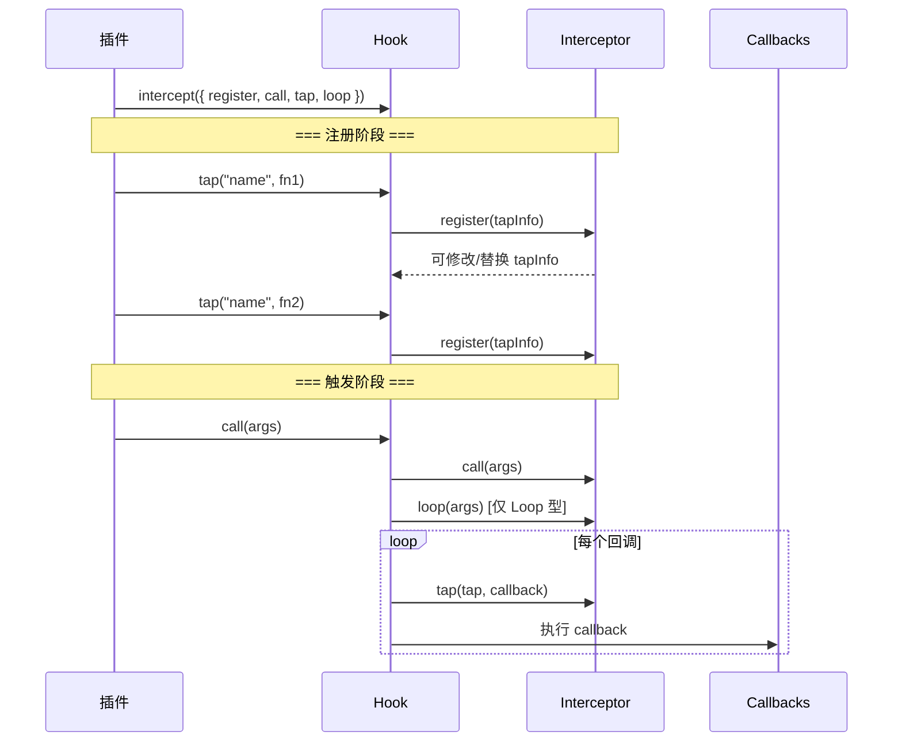

# 插件开发进阶与Hook架构


## 差异对照表：v1 → v2

| 维度 | 原始第22章 (v1) | 原始第23章 (v1) | 本文档 (v2) |
|------|-----------------|-----------------|-------------|
| **日志系统** | `compilation.getLogger` 基础用法 | — | ✅ 补充 `infrastructureLogging` 完整配置、log level 等级体系、debug/trace/warn 用法 |
| **错误处理** | 4种错误上报方式 | — | ✅ 新增 `webpack.WebpackError` 规范化错误类型 |
| **Schema 校验** | `schema-utils` 基础用法 | — | ✅ 补充 `validate` Hook（webpack 内置校验钩子，v5.106+） |
| **版本兼容** | 未涉及 | — | ✅ 新增 `peerDependencies` 声明、运行时版本检测方案 |
| **性能监控** | ProgressPlugin + stats | — | ✅ 补充性能钩子 `compilation.hooks.processAssets` 阶段计时、构建时间统计最佳实践 |
| **Hook 类型** | — | 10种 Tapable Hook 详解 | ✅ 保留完整解析 + 新增**继承关系图**、各类型在 Webpack 中的使用频次统计（v5.107 更新） |
| **动态编译** | — | `new Function` 动态生成逻辑 | ✅ 保留核心原理 + 补充 HookCodeFactory 编译流程图解 |
| **Intercept** | — | 基础 intercept API | ✅ 补充**拦截机制图**、实际应用场景扩展（日志/监控/权限控制） |
| **HookMap** | — | 基础用法 + Parser 示例 | ✅ 补充 MultiHook、条件化注册模式 |
| **自定义 Hook 扩展** | — | 未涉及 | ✅ 新增 Compiler/Compilation 自定义 Hook 扩展方法 |
| **Hooks 参考列表** | — | 部分提及 | ✅ **完整的** Compiler / Compilation / NormalModuleFactory Hooks 列表 |
| **Mermaid 图表** | 无 | 无 | ✅ 3张：生命周期时序图 + 继承关系图 + 拦截机制图 |
| **健壮性检查清单** | 无 | 无 | ✅ 新增生产级插件健壮性 Checklist |

---

## 一、插件健壮性体系

开发一个生产级 Webpack 插件，除了实现核心功能外，还需要在**日志管理、错误处理、参数校验、版本兼容、性能监控**等方面建立完善的防御体系。本节将系统介绍这些提升插件健壮性的关键技巧。

### 1.1 日志系统：infrastructureLogging

Webpack 内置了类似 log4js/winston 的分级日志基础设施 —— [infrastructureLogging](https://webpack.js.org/configuration/other-options/#infrastructurelogging)，插件开发时应复用这套体系，而非自行使用 `console.log`。

#### 获取 Logger 对象

```js
const PLUGIN_NAME = "FooPlugin";

class FooPlugin {
  apply(compiler) {
    compiler.hooks.compilation.tap(PLUGIN_NAME, (compilation) => {
      const logger = compilation.getLogger(PLUGIN_NAME);
    });
  }
}
```

两种获取方式：

| 方式 | API | 适用场景 |
|------|-----|----------|
| Compilation 级别 | `compilation.getLogger(name)` | 大多数插件场景，与具体 compilation 绑定 |
| Compiler 级别 | `compiler.getInfrastructureLogger(name)` | 跨 compilation 的全局日志 |

#### 日志等级体系

Logger 支持 **5 个等级**，受 `infrastructureLogging.level` 配置控制：

```text
verbose < log < info < warn < error
```

```js
const logger = compilation.getLogger(PLUGIN_NAME);

logger.verbose('详细调试信息，仅在 verbose 级别显示');
logger.log('常规运行日志');
logger.info('信息提示');
logger.warn('警告信息');
logger.error('错误信息');
```

#### infrastructureLogging 配置

用户可在 webpack 配置中控制日志输出：

```js
module.exports = {
  infrastructureLogging: {
    level: 'log',     // 控制台输出的最低级别
    debug: false,      // 是否开启调试模式
    trace: false,      // 是否追踪日志调用栈
    stream: process.stderr, // 输出流
  },
};
```

| level 值 | 输出内容 |
|----------|---------|
| `'none'` | 不输出任何日志 |
| `'error'` | 仅 error |
| `'warn'` | warn + error |
| `'info'` | info + warn + error |
| `'log'` | log + info + warn + error（默认） |
| `'verbose'` | 全部输出 |

### 1.2 错误处理：四种策略与选择指南

Webpack 插件中有 **4 种错误/警告上报方式**，各自适用于不同场景：

#### 方式一：`compilation.errors / compilation.warnings`（推荐）

最常用的方式，柔和地记录异常，不中断构建流程：

```js
class FooPlugin {
  apply(compiler) {
    compiler.hooks.compilation.tap(PLUGIN_NAME, (compilation) => {
      if (!this.validateOptions()) {
        compilation.errors.push(
          new Error(`${PLUGIN_NAME}: 配置参数无效`)
        );
      }
      if (this.hasDeprecation()) {
        compilation.warnings.push(
          `${PLUGIN_NAME}: 当前选项即将废弃`
        );
      }
    });
  }
}
```

**特点**：
- 不中断构建流程
- 错误信息汇总到 `stats` 对象，支持后续分析
- 被 eslint-webpack-plugin、copy-webpack-plugin 等广泛使用

#### 方式二：规范化错误类型（v5 增强）

Webpack v5 提供 `webpack.WebpackError` 用于创建结构化的错误对象（webpack 仅直接导出这一个错误基类，模块级的 `ModuleBuildError`/`ModuleError` 等并未从入口导出）：

```js
const { WebpackError } = require('webpack');

class FooPlugin {
  apply(compiler) {
    compiler.hooks.compilation.tap(PLUGIN_NAME, (compilation) => {
      compilation.hooks.buildModule.tap(PLUGIN_NAME, (module) => {
        try {
          this.processModule(module);
        } catch (err) {
          const error = new WebpackError(`${PLUGIN_NAME}: 处理模块失败（${module.identifier()}）`);
          error.details = err.stack; // details 字段携带额外上下文
          compilation.errors.push(error);
        }
      });
    });
  }
}
```

**优势**：
- 错误信息中带上模块标识符，方便定位出错的模块
- `WebpackError` 提供统一的错误格式，stats 输出更规范
- 支持 `details` 字段携带额外上下文信息

#### 方式三：Hook Callback 透传

将错误传递给 Hook 的 callback 参数，由上游决定处理方式：

```js
class ImageminPlugin {
  apply(compiler) {
    const onEmit = async (compilation, callback) => {
      try {
        await this.optimizeImages(compilation);
        callback();
      } catch (err) {
        callback(err); // 透传给 Webpack 处理
      }
    };
    compiler.hooks.emit.tapAsync(this.constructor.name, onEmit);
  }
}
```

**适用场景**：`tapAsync` 注册的异步 Hook 回调

#### 方式四：直接抛出异常

```js
class FooPlugin {
  apply(compiler) {
    compiler.hooks.compilation.tap(PLUGIN_NAME, () => {
      throw new Error('致命错误，必须终止构建');
    });
  }
}
```

**适用场景**：遇到致命错误、不可恢复的状态时

#### 选择决策树

```text
需要中断构建？
├── 是 → 直接 throw Error
└── 否 ├── 需要记录模块级错误？
│       └── 是 → new CompilationModuleError(module, err)
│       └── 否 ├── 需要结构化错误？
│               └── 是 → new WebpackError(details)
│               └── 否 → compilation.errors.push(...)
```

**推荐优先级**：
1. **首选**：`compilation.errors/warnings` + 规范化错误类
2. **次选**：callback 透传（仅限 tapAsync 场景）
3. **兜底**：直接抛异常（仅限致命错误）

### 1.3 Schema 校验

#### schema-utils 标准用法

```js
const { validate } = require("schema-utils");

const schema = {
  type: "object",
  properties: {
    test: {
      type: "string",
      minLength: 1,
    },
    exclude: {
      type: "array",
      items: { type: "string" },
    },
  },
  additionalProperties: false,
};

class FooPlugin {
  constructor(options = {}) {
    validate(schema, options, {
      name: "Foo Plugin",
      baseDataPath: "options",
    });
    this.options = options;
  }
}
```

#### v5.106+ 新增：validate Hook

Webpack v5.106 引入了 `validate` Hook，允许插件把自身的选项校验挂到 webpack 统一的校验流程中。该 Hook 为无参数的 `SyncHook`，在**插件应用完成后、构建开始前**触发（`webpack()` 初始化阶段）；插件应在回调中调用 `compiler.validate()`，由 webpack 汇总校验错误：

```js
class FooPlugin {
  constructor(options = {}) {
    this.options = options;
  }

  apply(compiler) {
    compiler.hooks.validate.tap("FooPlugin", () => {
      // 由 webpack 统一执行并报告校验错误（内置插件如 BannerPlugin 即此用法）
      compiler.validate(
        () => require("./plugin.schema.json"),
        this.options,
        { name: "Foo Plugin", baseDataPath: "options" },
        (options) => require("./plugin.schema.check")(options) // 预编译检查函数（可选）
      );
    });
  }
}
```

**优势**：
- 与 webpack 内置校验流程集成
- 统一的校验错误报告格式
- 支持与其他插件的校验结果合并展示

### 1.4 版本兼容性管理

#### peerDependencies 声明

```json
{
  "name": "foo-webpack-plugin",
  "peerDependencies": {
    "webpack": "^5.0.0"
  }
}
```

#### 运行时版本检测

```js
class FooPlugin {
  apply(compiler) {
    const webpackVersion = typeof compiler.webpack === 'function'
      ? compiler.webpack.version
      : require('webpack/package.json').version;

    const majorVersion = parseInt(webpackVersion.split('.')[0], 10);

    if (majorVersion !== 5) {
      throw new Error(
        `${PLUGIN_NAME}: 此插件仅支持 Webpack 5.x，当前版本 ${webpackVersion}`
      );
    }

    // 检测特定功能是否可用
    if (typeof compiler.hooks.validate === 'undefined') {
      console.warn(`${PLUGIN_NAME}: 当前 Webpack 版本不支持 validate hook`);
    }
  }
}
```

### 1.5 性能监控与进度上报

#### ProgressPlugin 进度上报

对于耗时操作（CSS 抽取、图片压缩、代码混淆），应通过 `ProgressPlugin.getReporter` 上报进度：

```js
const { ProgressPlugin } = require("webpack");
const PLUGIN_NAME = "HeavyPlugin";
const noop = () => ({});

class HeavyPlugin {
  apply(compiler) {
    compiler.hooks.compilation.tap(PLUGIN_NAME, (compilation) => {
      compilation.hooks.processAssets.tapAsync(
        { name: PLUGIN_NAME, stage: compiler.webpack.Compilation.PROCESS_ASSETS_STAGE_OPTIMIZE },
        async (assets, callback) => {
          const reportProgress = ProgressPlugin.getReporter(compiler) || noop;
          const tasks = Object.keys(assets);

          for (let i = 0; i < tasks.length; i++) {
            await this.processAsset(tasks[i]);
            reportProgress(i / tasks.length, `[${PLUGIN_NAME}] 处理 ${tasks[i]}`);
          }
          reportProgress(1, `[${PLUGIN_NAME}] 完成`);
          callback();
        }
      );
    });
  }
}
```

**注意**：若用户未启用 ProgressPlugin，`getReporter` 返回 `undefined`，需用 `|| noop` 兜底。

#### Stats 统计数据扩展

通过 `statsFactory` hook 向 stats 对象注入自定义统计数据：

```js
class FooPlugin {
  apply(compiler) {
    compiler.hooks.compilation.tap(PLUGIN_NAME, (compilation) => {
      const timingMap = new Map();

      compilation.hooks.buildModule.tap(PLUGIN_NAME, (module) => {
        const start = Date.now();
        this.processModule(module);
        timingMap.set(module.identifier(), Date.now() - start);
      });

      compilation.hooks.statsFactory.tap(PLUGIN_NAME, (factory) => {
        factory.hooks.result.for("module").tap(PLUGIN_NAME, (module, context) => {
          module[`${PLUGIN_NAME}Duration`] = timingMap.get(module.identifier()) || 0;
        });
      });

      compilation.hooks.statsPreset.tap(PLUGIN_NAME, (result, context) => {
        result[`${PLUGIN_NAME}Summary`] = {
          totalProcessed: timingMap.size,
          avgDuration: Array.from(timingMap.values())
            .reduce((a, b) => a + b, 0) / timingMap.size || 0,
        };
      });
    });
  }
}
```

输出示例：

```json
{
  "modules": [
    {
      "identifier": "./src/index.js",
      "fooPluginDuration": 124
    }
  ],
  "fooPluginSummary": {
    "totalProcessed": 42,
    "avgDuration": 87.3
  }
}
```

---

## 二、Tapable Hook 体系深度解析

Webpack 之所以能够应对 Web 场景下极度复杂、多样的构建需求，关键就在于其基于 [Tapable](https://github.com/webpack/tapable) 实现的强耦合插件架构。不同于松耦合的事件订阅模式，Tapable 在触发钩子时会附带上足够的上下文信息，插件回调能与这些上下文背后的数据结构产生 side effect，进而影响编译状态和后续流程。

### 2.1 Tapable 使用三步法

```js
const { SyncHook } = require("tapable");

// Step 1: 创建钩子实例
const sleep = new SyncHook();

// Step 2: 订阅接口注册回调（tap / tapAsync / tapPromise）
sleep.tap("test", () => {
  console.log("callback A");
});

// Step 3: 发布接口触发回调（call / callAsync / promise）
sleep.call();
```

### 2.2 Hook 类型全景

Tapable 共提供 **10 种 Hook 类型**，按两条维度分类：

**维度一 —— 回调逻辑**：

| 类型关键字 | 特性 |
|-----------|------|
| （基本型） | 按注册顺序逐次调用，忽略返回值 |
| `Waterfall` | 前一个回调的返回值作为下一个回调的参数传入 |
| `Bail` | 任一回调返回非 `undefined` 值则熔断，终止后续调用 |
| `Loop` | 循环执行单个回调直到其返回 `undefined` |

**维度二 —— 执行方式**：

| 类型关键字 | 特性 | 订阅/发布 API |
|-----------|------|--------------|
| `Sync` | 同步执行 | `tap` / `call` |
| `AsyncSeries` | 异步串行执行 | `tapAsync/tapPromise` / `callAsync/promise` |
| `AsyncParallel` | 异步并行执行 | `tapAsync/tapPromise` / `callAsync/promise` |

#### 完整类型矩阵

下表"使用次数"为基于 webpack v5.107 `lib/` 源码中 `new XxxHook(...)` 声明的粗略统计（示意量级，随版本变化，以实际源码为准）：

| 名称 | 类型 | Webpack v5.107 使用次数 | 典型代表 |
|------|------|------------------------|---------|
| `SyncHook` | 同步基本 | ~90 次 | `Compiler.hooks.compilation` |
| `SyncBailHook` | 同步熔断 | ~100 次 | `Compiler.hooks.shouldEmit` |
| `SyncWaterfallHook` | 同步瀑布流 | ~37 次 | `Compilation.hooks.assetPath` |
| `SyncLoopHook` | 同步循环 | 未使用 | — |
| `AsyncParallelHook` | 异步并行基本 | ~6 次 | `Compiler.hooks.make` |
| `AsyncParallelBailHook` | 异步并行熔断 | 未使用 | — |
| `AsyncSeriesHook` | 异步串行基本 | ~22 次 | `Compiler.hooks.done` |
| `AsyncSeriesBailHook` | 异步串行熔断 | ~11 次 | `Compilation.hooks.optimizeChunkModules` |
| `AsyncSeriesLoopHook` | 异步串行循环 | 未使用 | — |
| `AsyncSeriesWaterfallHook` | 异步串行瀑布流 | ~3 次 | `NormalModuleFactory.hooks.beforeResolve` |

### 2.3 Tapable Hook 类型继承关系

```mermaid
classDiagram
    class Hook {
        +tap(options, fn)
        +tapAsync(options, fn)
        +tapPromise(options, fn)
        +call(...args)
        +callAsync(...args)
        +promise(...args)
        +intercept(interceptor)
        +_x: Array~Function~
        +interceptors: Array~Object~
        +isUsed(): boolean
    }

    class SyncHook {
        +call(...args): undefined
        +constructor(args)
    }

    class SyncBailHook {
        +call(...args): any
        +constructor(args)
    }

    class SyncWaterfallHook {
        +call(...args): any
        +constructor(args)
    }

    class SyncLoopHook {
        +call(...args): undefined
        +constructor(args)
    }

    class AsyncParallelHook {
        +callAsync(...args, cb)
        +promise(...args): Promise
        +constructor(args)
    }

    class AsyncParallelBailHook {
        +callAsync(...args, cb)
        +promise(...args): Promise
        +constructor(args)
    }

    class AsyncSeriesHook {
        +callAsync(...args, cb)
        +promise(...args): Promise
        +constructor(args)
    }

    class AsyncSeriesBailHook {
        +callAsync(...args, cb)
        +promise(...args): Promise
        +constructor(args)
    }

    class AsyncSeriesLoopHook {
        +callAsync(...args, cb)
        +promise(...args): Promise
        +constructor(args)
    }

    class AsyncSeriesWaterfallHook {
        +callAsync(...args, cb)
        +promise(...args): Promise
        +constructor(args)
    }

    Hook <|-- SyncHook : extends
    Hook <|-- SyncBailHook : extends
    Hook <|-- SyncWaterfallHook : extends
    Hook <|-- SyncLoopHook : extends
    Hook <|-- AsyncParallelHook : extends
    Hook <|-- AsyncParallelBailHook : extends
    Hook <|-- AsyncSeriesHook : extends
    Hook <|-- AsyncSeriesBailHook : extends
    Hook <|-- AsyncSeriesLoopHook : extends
    Hook <|-- AsyncSeriesWaterfallHook : extends

    note for Hook "基类\n提供 tap/call/intercept\n统一接口"
    note for SyncHook "同步顺序执行\n忽略返回值"
    note for SyncBailHook "同步 + 熔断\n返回首个非 undefined 值"
    note for SyncWaterfallHook "同步 + 瀑布流\n返回值链式传递"
    note for SyncLoopHook "同步 + 循环\n直到返回 undefined"
    note for AsyncParallelHook "异步并行\n互不等待"
    note for AsyncSeriesHook "异步串行\n依次等待完成"
```



### 2.4 各类型 Hook 详细解析

#### SyncHook —— 同步基本钩子

最简单的钩子，按注册顺序逐个调用回调，忽略所有返回值：

```js
const { SyncHook } = require("tapable");

const hook = new SyncHook(["arg1", "arg2"]);

hook.tap("A", (arg1, arg2) => console.log(`A: ${arg1}, ${arg2}`));
hook.tap("B", (arg1, arg2) => console.log(`B: ${arg1}, ${arg2}`));

hook.call("hello", "world");
// A: hello, world
// B: hello, world
```

**底层逻辑等价于**：

```js
function syncCall() {
  const callbacks = [fn1, fn2, fn3];
  for (let i = 0; i < callbacks.length; i++) {
    callbacks[i](...args);
  }
}
```

**Webpack 应用**：`Compiler.hooks.compilation`、`Compilation.hooks.finishModules` 等（约 90 处）。

#### SyncBailHook —— 同步熔断钩子

任一回调返回非 `undefined` 值时立即终止，将该值作为 `call` 的返回值：

```js
const { SyncBailHook } = require("tapable");

const hook = new SyncBailHook(["value"]);

hook.tap("validator", (value) => {
  if (value < 0) return { valid: false };
});

hook.tap("transformer", (value) => {
  return value * 2;
});

const result = hook.call(5);
console.log(result); // 10

const result2 = hook.call(-1);
console.log(result2); // { valid: false } ← 在 validator 处熔断
```

**底层逻辑等价于**：

```js
function bailCall() {
  for (const cb of callbacks) {
    const result = cb(...args);
    if (result !== undefined) return result;
  }
  return undefined;
}
```

**Webpack 应用**：
- `Compiler.hooks.shouldEmit` —— 决定是否 emit 产物
- `NormalModuleFactory.hooks.createModule` —— 返回 Module 对象或跳过
- `Compilation.hooks.needAdditionalPass` —— 判定是否需要额外编译轮次

#### SyncWaterfallHook —— 同步瀑布流钩子

前一个回调的返回值作为下一个回调的参数，最终返回最后一个回调的结果：

```js
const { SyncWaterfallHook } = require("tapable");

const hook = new SyncWaterfallHook(["value"]);

hook.tap("addOne", (val) => {
  console.log(`addOne 收到: ${val}`);
  return val + 1;
});

hook.tap("double", (val) => {
  console.log(`double 收到: ${val}`);
  return val * 2;
});

const result = hook.call(1);
// addOne 收到: 1
// double 收到: 2
console.log(`最终结果: ${result}`); // 4
```

**注意**：构造函数**必须**声明参数列表 `new SyncWaterfallHook(["value"])`，用于动态编译。

**Webpack 应用**：
- `Compilation.hooks.assetPath` —— 路径模板逐步替换
- `NormalModuleFactory.hooks.factory` —— Module 对象的链式创建过程

#### SyncLoopHook —— 同步循环钩子

单个回调循环执行，直到返回 `undefined` 后才推进到下一个回调：

```js
const { SyncLoopHook } = require("tapable");

const hook = new SyncLoopHook();

let count = 0;

hook.tap("retry", () => {
  count++;
  console.log(`第 ${count} 次执行`);
  return count < 3 ? count : undefined; // 返回非 undefined 则继续循环
});

hook.tap("done", () => console.log("全部完成"));

hook.call();
// 第 1 次执行
// 第 2 次执行
// 第 3 次执行
// 全部完成
```

⚠️ **Webpack 内部未使用此类型**，了解即可，需特别注意避免死循环。

#### AsyncSeriesHook —— 异步串行钩子

支持异步回调，**串行**执行（前一个完成后才执行下一个）：

```js
const { AsyncSeriesHook } = require("tapable");

const hook = new AsyncSeriesHook();

// callback 风格
hook.tapAsync("A", (cb) => {
  setTimeout(() => {
    console.log("A 完成");
    cb();
  }, 100);
});

// promise 风格
hook.tapPromise("B", () => {
  return new Promise((resolve) => {
    setTimeout(() => {
      console.log("B 完成");
      resolve();
    }, 100);
  });
});

hook.callAsync(() => console.log("全部结束"));
// A 完成 → B 完成 → 全部结束
```

**Webpack 应用**：`Compiler.hooks.done`、`Compiler.hooks.emit` 等（约 22 处）。

#### AsyncParallelHook —— 异步并行钩子

支持异步回调，**并行**同时执行所有回调：

```js
const { AsyncParallelHook } = require("tapable");

const hook = new AsyncParallelHook();

hook.tapAsync("A", (cb) => {
  setTimeout(() => { console.log("A"); cb(); }, 100);
});

hook.tapAsync("B", (cb) => {
  setTimeout(() => { console.log("B"); cb(); }, 50);
});

hook.callAsync(() => console.log("结束"));
// B → A → 结束（B 先完成但不阻塞 A）
```

**Webpack 应用**：`Compiler.hooks.make`、`Compilation.hooks.prepareModuleExecution` 及 Cache 相关钩子等少量场景 —— `make` 即并行开始所有 entry 的构建。

### 2.5 Hook 动态编译原理

Tapable 的核心魔法在于 **动态编译（Dynamic Compilation）**。所有 Hook 的 `call/callAsync/promise` 方法并非预先写死，而是在首次调用时根据以下因素**动态拼接 JavaScript 函数**：

- Hook 类型（Sync/Bail/Waterfall/Loop/Series/Parallel）
- 参数列表
- 已注册的回调队列

#### 编译流程

```mermaid
flowchart TD
    A["hook.call(arg1, arg2)"] --> B{是否已编译?}
    B -->|否| C["Hook.createCall()"]
    C --> D["子类 compiler 函数<br/>如 SyncHookCodeFactory"]
    D --> E["HookCodeFactory.setup()")
    E --> F["HookCodeFactory.create()"]
    F --> G["new Function(params, body)<br/>动态生成执行函数"]
    G --> H["缓存到 hook.call"]
    H --> I["执行生成的函数"]
    B -->|是| I

```

#### 生成函数示例

以 `AsyncSeriesWaterfallHook` 为例，Tapable 会动态生成如下函数：

```js
(function anonymous(name, _callback) {
  "use strict";
  var _x = this._x;

  function _next1() {
    var _fn2 = _x[2];
    _fn2(name, function(_err2, _result2) {
      if (_err2) {
        _callback(_err2);
      } else {
        if (_result2 !== undefined) name = _result2;
        _callback(null, name);
      }
    });
  }

  function _next0() {
    var _fn1 = _x[1];
    _fn1(name, function(_err1, _result1) {
      if (_err1) {
        _callback(_err1);
      } else {
        if (_result1 !== undefined) name = _result1;
        _next1();
      }
    });
  }

  var _fn0 = _x[0];
  _fn0(name, function(_err0, _result0) {
    if (_err0) {
      _callback(_err0);
    } else {
      if (_result0 !== undefined) name = _result0;
      _next0();
    }
  });
});
```

**设计意义**：相比递归/循环硬编码，动态生成的代码逻辑清晰、无抽象开销，且每种 Hook 类型都能获得最优的控制流实现。

**调试技巧**：在 [tapable/lib/Hook.js](https://github.com/webpack/tapable/blob/master/lib/Hook.js) 的 `CALL_DELEGATE` / `CALL_ASYNC_DELEGATE` / `PROMISE_DELEGATE` 处打断点，配合 `ndb` 可查看实时生成的函数代码。

---

## 三、高级特性

### 3.1 Intercept —— Hook 拦截机制

Tapable 提供了类似中间件的 `intercept` 机制，允许在 Hook 生命周期的关键节点注入自定义逻辑：



#### Interceptor API

```js
hook.intercept({
  call: (...args) => {
    console.log("call/callAsync/promise 被调用时触发");
  },

  tap: (tap) => {
    console.log(`每个回调执行前触发, 当前: ${tap.name}`);
  },

  loop: (...args) => {
    console.log("每次循环迭代开始前触发（仅 Loop 型有效）");
  },

  register: (tap) => {
    console.log("每次 tap/tapAsync/tapPromise 被调用时触发");
    tap.context = { customData: true }; // 可修改 tap 信息
    return tap; // 返回修改后的 tap（返回 undefined 则沿用原 tap）
  },
});
```

> ⚠️ 注意：`register` 返回 `undefined` 时 Tapable 会沿用原 tap，**并不会取消注册**。若要"拦截"某个回调，应返回替换后的 tap 对象（见下文场景二）。

| 拦截器 | 签名 | 触发时机 |
|--------|------|---------|
| `call` | `(...args) => void` | `call/callAsync/promise` 被调用时 |
| `tap` | `(tap: Tap) => void` | 每个回调函数执行之前 |
| `loop` | `(...args) => void` | Loop 型钩子的每次循环迭代前 |
| `register` | `(tap: Tap) => Tap` | 每次 `tap/tapAsync/tapPromise` 调用时（返回新 tap 替换原 tap；返回 `undefined` 表示沿用原 tap，并不会取消注册） |

#### 实际应用场景

**场景一：进度监控**

```js
class ProgressInterceptor {
  static applyTo(hook, reporter) {
    let total = 0;
    let current = 0;

    hook.intercept({
      register: () => { total++; },
      call: () => { current = 0; },
      tap: (tap) => {
        current++;
        reporter(current / total, `${tap.name}`);
      },
    });
  }
}

ProgressInterceptor.applyTo(compilation.hooks.processAssets, reportProgress);
```

**场景二：权限过滤**

```js
hook.intercept({
  register: (tap) => {
    if (!allowedPlugins.includes(tap.name)) {
      // register 无法取消注册（返回 undefined 只会沿用原 tap），
      // 这里用空实现替换原回调并告警，实现"软拦截"
      console.warn(`[hook] 未授权的插件尝试注册: ${tap.name}`);
      return { ...tap, fn: () => {} };
    }
    return tap;
  },
});
```

**场景三：调用耗时统计**

```js
hook.intercept({
  call: () => { this._startTime = Date.now(); },
  tap: (tap) => {
    const start = Date.now();
    return {
      ...tap,
      fn: (...args) => {
        const result = tap.fn(...args);
        console.log(`${tap.name} 耗时: ${Date.now() - start}ms`);
        return result;
      },
    };
  },
});
```

### 3.2 HookMap —— 条件化 Hook 管理

`HookMap` 提供了基于 key 的条件化 Hook 注册能力，避免为每种情况预创建独立 Hook：

```js
const { SyncHook, HookMap } = require("tapable");

const map = new HookMap((key) => new SyncHook(["data"]));

// 通过 for 指定 key 进行注册
map.for("javascript").tap("JsHandler", (data) => { /* ... */ });
map.for("css").tap("CssHandler", (data) => { /* ... */ });
map.for("html").tap("HtmlHandler", (data) => { /* ... */ });

// 通过 get 获取指定 key 的 Hook 并触发
map.get("javascript").call(someData);
```

#### Webpack 实战：Parser.hooks.expression

Parser 在遍历 AST 时使用 HookMap 按表达式名称分发事件，无需枚举所有可能的表达式：

```js
class Parser {
  constructor() {
    this.hooks = {
      expression: new HookMap(() => new SyncBailHook(["expression"])),
    };
  }

  walkMemberExpression(expression) {
    const exprName = this.getNameForExpression(expression);
    if (exprName?.free) {
      const hook = this.hooks.expression.get(exprName.name);
      if (hook !== undefined) {
        const result = hook.call(expression);
        if (result === true) return;
      }
    }
  }
}
```

插件消费端通过 `for` 精确监听感兴趣的表达式：

```js
class CommonJsStuffPlugin {
  apply(compiler) {
    compiler.hooks.compilation.tap("CJS", (compilation, { normalModuleFactory }) => {
      normalModuleFactory.hooks.parser
        .for("javascript/auto")
        .tap("CJS", (parser, parserOptions) => {
          parser.hooks.expression
            .for("require.main")
            .tap("CJS", ParserHelpers.toConstantDependency(parser, "..."));

          parser.hooks.expression
            .for("__dirname")
            .tap("CJS", ParserHelpers.toConstantDependency(parser, "__dirname"));
        });
    });
  }
}
```

### 3.3 MultiHook —— 多实例聚合

`MultiHook` 用于将多个 Hook 实例聚合成一个统一接口，一次性向多个 Hook 注册相同的回调：

```js
const { SyncHook, MultiHook } = require("tapable");

const hook1 = new SyncHook();
const hook2 = new SyncHook();
const hook3 = new SyncHook();

const multi = new MultiHook([hook1, hook2, hook3]);

multi.tap("sharedCallback", () => {
  console.log("这个回调会注册到 hook1, hook2, hook3");
});
```

**典型应用**：当插件需要同时监听多个相似 Hook 时（如不同 module 类型的 buildModule），减少重复代码。

### 3.4 自定义 Compiler/Compilation Hook 扩展

插件可以通过 monkey-patch 的方式向 Compiler 或 Compilation 对象添加自定义 Hook：

```js
const { SyncHook, AsyncSeriesHook } = require("tapable");

class CustomPlugin {
  apply(compiler) {
    // 扩展 Compiler hooks
    compiler.hooks.myCustomHook = new SyncHook(["data"]);

    // 扩展 Compilation hooks
    compiler.hooks.compilation.tap("CustomPlugin", (compilation) => {
      compilation.hooks.myCustomCompilationHook = new AsyncSeriesHook(["asset"]);
    });

    // 使用自定义 Hook
    compiler.hooks.myCustomHook.tap("CustomPlugin", (data) => {
      console.log("自定义 Compiler Hook 触发:", data);
    });
  }
}
```

**最佳实践**：
- 使用命名空间前缀避免冲突：`hooks['myPlugin/customHook']`
- 在文档中明确说明新增 Hook 的签名和行为
- 考虑提供 TypeScript 类型声明

---

## 四、Webpack Hook 生命周期时序图

理解 Webpack 构建流程中各 Hook 的触发时机是编写高质量插件的关键。下图展示了从初始化到产物输出的完整生命周期：

```mermaid
sequenceDiagram
    participant User as 用户调用
    participant C as Compiler
    participant Comp as Compilation
    participant NMF as NormalModuleFactory
    participant MF as ModuleFactory
    participant Parser as Parser
    participant Template as MainTemplate

    Note over User,C: ====== 初始化阶段 ======

    User->>C: webpack(config).run()
    C->>C: environment
    C->>C: afterEnvironment

    loop 每个 entry
        C->>C: entryOption
    end

    C->>C: afterPlugins
    C->>C: afterResolvers

    Note over User,C: ====== 运行前阶段 ======

    C->>C: beforeRun
    C->>C: beforeCompile

    Note over User,C: ====== 编译阶段 ======

    C->>C: compile
    C->>Comp: thisCompilation (新建 Compilation)
    C->>Comp: compilation

    Note over Comp: ====== Make 阶段 ======

    C->>Comp: make (AsyncParallelHook)
    Comp->>Comp: addEntry

    loop 每个 entry
        Comp->>Comp: succeedEntry
        Comp->>NMF: createModule (SyncBailHook - factory)
        NMF->>NMF: resolver (SyncWaterfallHook)
        NMF->>Parser: parse (for each module)

        loop 解析每个 import/require
            Parser->>Parser: expression (HookMap)
            Parser->>Parser: statement (SyncBailHook)
            Parser->>Parser: call (HookMap)
        end

        Comp->>Comp: buildModule
        Comp->>Comp: succeedModule
        Comp->>Comp: failedModule [如果失败]
    end

    Comp->>C: finishMake

    Note over User,C: ====== Seal 阶段 ======

    Comp->>Comp: seal
    Comp->>Comp: optimizeDependencies (SyncBailHook)
    Comp->>Comp: afterOptimizeDependencies
    Comp->>Comp: optimize

    subgraph 优化流水线
        Comp->>Comp: optimizeModules (SyncBailHook)
        Comp->>Comp: afterOptimizeModules
        Comp->>Comp: optimizeChunks (SyncBailHook)
        Comp->>Comp: afterOptimizeChunks
        Comp->>Comp: optimizeTree (AsyncSeriesHook)
        Comp->>Comp: afterOptimizeTree
        Comp->>Comp: optimizeChunkModules (AsyncSeriesBailHook)
        Comp->>Comp: afterOptimizeChunkModules
        Comp->>Comp: shouldRecord (SyncBailHook)
    end

    Comp->>Comp: reviveModules / reviveChunks (records)
    Comp->>Comp: beforeModuleIds → moduleIds
    Comp->>Comp: beforeRuntimeRequirements
    Comp->>Comp: runtimeRequirementInTree (HookMap)
    Comp->>Comp: runtimeModule (注入运行时模块)
    Comp->>Comp: afterRuntimeRequirements

    Note over Comp: ====== 产物生成阶段 ======

    Comp->>Comp: processAssets (AsyncSeriesHook)
    Note right of Comp: ⭐ 最常用的插件介入点<br/>支持 stage 优先级控制

    loop 按 stage 顺序
        Comp->>Comp: assetEmitted (每个 asset)
    end

    Comp->>Comp: afterProcessAssets
    Comp->>Comp: needAdditionalSeal (SyncBailHook)

    alt needAdditionalSeal 返回 true
        Comp->>Comp: unseal
        Comp->>Comp: seal (重新进入 Seal)
    end

    Note over User,C: ====== Emit 阶段 ======

    C->>C: shouldEmit (SyncBailHook)

    alt shouldEmit 不为 false
        C->>C: emit (AsyncSeriesHook)
        loop 每个 asset
            C->>C: assetEmitted
        end
        C->>C: afterEmit (AsyncSeriesHook)
    end

    Note over User,C: ====== 完成阶段 ======

    C->>Comp: afterCompile
    C->>C: done (AsyncSeriesHook)

    alt watch 模式
        C->>C: invalid
        C->>C: watchRun
    end

    C->>User: callback(error, stats)
```

### 关键 Hook 阶段说明

| 阶段 | 关键 Hook | 类型 | 说明 |
|------|----------|------|------|
| **Init** | `environment` | SyncHook | 编译环境准备完毕 |
| | `afterEnvironment` | SyncHook | 环境设置完成 |
| | `entryOption` | SyncHook | entry 配置处理后 |
| | `afterPlugins` | SyncHook | 所有插件初始化完成 |
| **Before Run** | `beforeRun` | AsyncSeriesHook | 编译前准备 |
| | `beforeCompile` | AsyncSeriesHook | 编译前预处理 |
| **Compile** | `compile` | SyncHook | 创建 Compilation 对象 |
| | `thisCompilation` | SyncHook | 新建 Compilation 前 |
| | `compilation` | SyncHook | Compilation 就绪 |
| **Make** | `make` | **AsyncParallelHook** | 开始构建 modules（并行） |
| | `finishMake` | AsyncSeriesHook | make 阶段结束 |
| **Seal** | `seal` | SyncHook | 封闭 Compilation |
| | `optimizeModules` | **SyncBailHook** | 模块优化（可熔断） |
| | `optimizeChunks` | **SyncBailHook** | Chunk 优化 |
| | `processAssets` | **AsyncSeriesHook** | ⭐ 产物处理（最常用） |
| **Emit** | `shouldEmit` | **SyncBailHook** | 是否输出产物 |
| | `emit` | AsyncSeriesHook | 写入文件系统 |
| | `done` | AsyncSeriesHook | 编译完成 |

---

## 五、完整 Hooks 参考列表

### 5.1 Compiler Hooks 完整列表

| Hook 名 | 类型 | 参数 | 触发时机 |
|---------|------|------|---------|
| `environment` | SyncHook | — | 编译环境就绪后 |
| `afterEnvironment` | SyncHook | — | 环境安装完成后 |
| `entryOption` | **SyncBailHook** | `context, entry` | entry 配置被处理后 |
| `afterPlugins` | SyncHook | `compiler` | 所有插件 `apply` 执行完 |
| `afterResolvers` | SyncHook | `compiler` | resolver 设置完成后 |
| `validate` | SyncHook | —（无参数） | 插件应用后、构建前，插件在此注册自身选项校验（v5.106+） |
| `initialize` | SyncHook | — | WebpackOptionsApply 处理完成后 |
| `beforeRun` | AsyncSeriesHook | `compiler` | run/runWatch 开始前 |
| `beforeCompile` | AsyncSeriesHook | `params` | 编译参数创建前 |
| `compile` | SyncHook | `params` | 新 Compilation 创建前 |
| `thisCompilation` | SyncHook | `compilation, params` | Compilation 发射前 |
| `compilation` | SyncHook | `compilation, params` | Compilation 创建完成后 |
| `make` | **AsyncParallelHook** | `compilation` | 正式开始构建模块 |
| `finishMake` | AsyncSeriesHook | `compilation` | make 阶段完成 |
| `afterCompile` | AsyncSeriesHook | `compilation` | 编译完成后 |
| `shouldEmit` | **SyncBailHook** | `compilation` | 是否 emit 产物 |
| `emit` | AsyncSeriesHook | `compilation` | 产物写入磁盘前 |
| `assetEmitted` | AsyncSeriesHook | `file, info` | 单个产物写入后（`info` 含 `content`/`source`/`outputPath`/`targetPath` 等） |
| `afterEmit` | AsyncSeriesHook | `compilation` | 产物写入完成后 |
| `done` | AsyncSeriesHook | `stats` | 编译全部完成 |
| `failed` | SyncHook | `error` | 编译失败 |
| `invalid` | SyncHook | `filename, changeTime` | 监听模式下文件变更 |
| `watchRun` | AsyncSeriesHook | `compiler` | watch 重新编译开始 |
| `watchClose` | SyncHook | — | watch 停止 |
| `shutdown` | AsyncSeriesHook | — | 关闭编译器 |
| `infrastructureLog` | SyncBailHook | `origin, type, args` | 基础设施日志 |

### 5.2 Compilation Hooks 完整列表

> 以下为主要 Hook（完整清单以 `webpack/lib/Compilation.js` 为准）：

| Hook 名 | 类型 | 参数 | 触发时机 |
|---------|------|------|---------|
| `buildModule` | SyncHook | `module` | 模块构建开始 |
| `rebuildModule` | SyncHook | `module` | 模块重新构建 |
| `succeedModule` | SyncHook | `module` | 模块构建成功 |
| `failedModule` | SyncHook | `module, error` | 模块构建失败 |
| `finishModules` | AsyncSeriesHook | `modules` | 所有模块构建完成 |
| `seal` | SyncHook | — | 封闭 compilation |
| `unseal` | SyncHook | — | 解封 compilation（重新开放修改） |
| `needAdditionalSeal` | **SyncBailHook** | — | 是否需要再次 seal |
| `afterSeal` | AsyncSeriesHook | — | seal 完成 |
| `addEntry` | SyncHook | `entry, options` | 添加入口 |
| `succeedEntry` | SyncHook | `entry, options, module` | 入口处理成功 |
| `optimizeDependencies` | **SyncBailHook** | `modules` | 依赖优化开始 |
| `afterOptimizeDependencies` | SyncHook | `modules` | 依赖优化结束 |
| `optimize` | SyncHook | — | 全局优化开始 |
| `optimizeModules` | **SyncBailHook** | `modules` | 模块优化（可中断） |
| `afterOptimizeModules` | SyncHook | `modules` | 模块优化后 |
| `optimizeChunks` | **SyncBailHook** | `chunks, chunkGroups` | Chunk 优化（可中断） |
| `afterOptimizeChunks` | SyncHook | `chunks, chunkGroups` | Chunk 优化后 |
| `optimizeTree` | **AsyncSeriesHook** | `chunks, modules` | 树优化 |
| `afterOptimizeTree` | SyncHook | `chunks, modules` | 树优化后 |
| `optimizeChunkModules` | **AsyncSeriesBailHook** | `chunks, modules` | Chunk 模块优化（可中断） |
| `afterOptimizeChunkModules` | SyncHook | `chunks, modules` | Chunk 模块优化后 |
| `shouldRecord` | **SyncBailHook** | — | 是否记录 |
| `reviveModules` | SyncHook | `modules, records` | 从记录恢复模块 |
| `beforeModuleIds` | SyncHook | `modules` | 模块 id 分配前 |
| `moduleIds` | SyncHook | `modules` | 模块 id 分配 |
| `beforeChunkIds` | SyncHook | `chunks` | Chunk id 分配前 |
| `chunkIds` | SyncHook | `chunks` | Chunk id 分配 |
| `optimizeChunkIds` | SyncHook | `chunks` | Chunk id 优化 |
| `recordModules` | SyncHook | `modules, records` | 记录模块信息 |
| `recordChunks` | SyncHook | `chunks, records` | 记录 Chunk 信息 |
| `beforeModuleHash` | SyncHook | — | 模块哈希计算前 |
| `beforeCodeGeneration` | SyncHook | — | 代码生成前 |
| `beforeRuntimeRequirements` | SyncHook | — | runtime 要求计算前 |
| `runtimeRequirementInTree` | HookMap（SyncBailHook） | `chunk, runtimeRequirements, context` | 处理 runtime 依赖树 |
| `runtimeModule` | SyncHook | `module, chunk` | 运行时模块生成 |
| `afterRuntimeRequirements` | SyncHook | — | runtime 要求收集后 |
| `beforeChunkAssets` | SyncHook | — | Chunk 产物生成前 |
| `chunkAsset` | SyncHook | `chunk, filename` | chunk 产物路径确定 |
| `renderManifest` | SyncWaterfallHook | `result, options` | 产物渲染清单 |
| `assetPath` | SyncWaterfallHook | `filename, data, assetInfo` | 产物路径模板替换 |
| `processAssets` | **AsyncSeriesHook** | `assets` | ⭐ **核心产物处理**（支持 stage 排序） |
| `afterProcessAssets` | SyncHook | `assets` | 产物处理完成 |
| `needAdditionalPass` | **SyncBailHook** | — | 是否需要额外编译轮次 |
| `childCompiler` | SyncHook | `childCompiler, compilation, name` | 子编译器创建 |
| `log` | SyncBailHook | `origin, logEntry` | 日志条目 |
| `statsFactory` / `statsPrinter` / `statsNormalize` | SyncHook | — | stats 定制 |

#### processAssets 的 Stage 常量

`compilation.hooks.processAssets` 支持 `stage` 参数控制执行顺序：

```js
compilation.hooks.processAssets.tap(
  {
    name: "MyPlugin",
    stage: compiler.webpack.Compilation.PROCESS_ASSETS_STAGE_OPTIMIZE, // 数值越小越先执行
  },
  (assets) => { /* ... */ }
);
```

| Stage 常量 | 值 | 说明 |
|-----------|-----|------|
| `PROCESS_ASSETS_STAGE_ADDITIONAL` | -2000 | 额外资源添加 |
| `PROCESS_ASSETS_STAGE_PRE_PROCESS` | -1000 | 预处理 |
| `PROCESS_ASSETS_STAGE_DERIVED` | -750 | 派生资源 |
| `PROCESS_ASSETS_STAGE_ADDITIONS` | -500 | 添加资源 |
| `PROCESS_ASSETS_STAGE_TRANSFER` | -250 | 资源转移 |
| `PROCESS_ASSETS_STAGE_OPTIMIZE` | 100 | ⭐ **优化**（最常用） |
| `PROCESS_ASSETS_STAGE_OPTIMIZE_COUNT` | 1000 | 优化计数 |
| `PROCESS_ASSETS_STAGE_OPTIMIZE_COMPATIBILITY` | 2000 | 兼容性优化 |
| `PROCESS_ASSETS_STAGE_OPTIMIZE_SIZE` | 3000 | 体积优化 |
| `PROCESS_ASSETS_STAGE_DEV_TOOLING` | 4000 | 开发工具 |
| `PROCESS_ASSETS_STAGE_OPTIMIZE_INLINE` | 4500 | 内联优化 |
| `PROCESS_ASSETS_STAGE_SUMMARIZE` | 5000 | 汇总 |
| `PROCESS_ASSETS_STAGE_OPTIMIZE_HASH` | 7000 | Hash 优化 |
| `PROCESS_ASSETS_STAGE_ANALYSE` | 8000 | 分析 |
| `PROCESS_ASSETS_STAGE_REPORT` | 9000 | 报告 |

### 5.3 NormalModuleFactory Hooks 常用列表

| Hook 名 | 类型 | 说明 |
|---------|------|------|
| `beforeResolve` | **AsyncSeriesWaterfallHook** | resolve 前可修改请求 |
| `factory` | **SyncWaterfallHook** | 创建 Module 对象 |
| `resolver` | **SyncWaterfallHook** | 自定义 resolve 逻辑 |
| `createModule` | **SyncBailHook** | Module 创建（可返回 Module 或跳过） |
| `module` | SyncHook | Module 创建完成 |
| `parser` | HookMap | 按 module 类型获取 Parser |
| `generator` | HookMap | 按 module 类型获取 Generator |

### 5.4 Parser Hooks（HookMap）

Parser 使用 `HookMap` 按代码结构分发事件，常用 key 包括：

| HookMap Key | 类型 | 触发时机 |
|-------------|------|---------|
| `expression` | **SyncBailHook** | 遇到表达式求值时 |
| `statement` | **SyncBailHook** | 遇到语句时 |
| `statementIf` | SyncBailHook | 遇到 if 语句 |
| `label` | SyncBailHook | 遇到 label |
| `varDeclaration` | SyncBailHook | 遇到 var 声明 |
| `varDeclarationLet` | SyncBailHook | 遇到 let 声明 |
| `varDeclarationConst` | SyncBailHook | 遇到 const 声明 |
| `canRename` | SyncBailHook | 判断标识符是否可重命名 |
| `rename` | SyncHook | 重命名标识符 |
| `assign` | SyncBailHook | 赋值操作 |
| `typeof` | SyncBailHook | typeof 操作 |
| `import` | SyncBailHook | import 语句 |
| `importSpecifier` | SyncBailHook | import specifier |
| `export` | SyncBailHook | export 语句 |
| `exportImport` | SyncBailHook | export { ... } from |
| `program` | SyncBailHook | AST 遍历完成时的顶层节点 |
| `call` | SyncBailHook | 函数调用表达式 |
| `new` | SyncBailHook | new 表达式 |
| `memberChainOfCallMemberChain` | SyncBailHook | 成员链调用 |

---

## 六、健壮性检查清单

以下是生产级 Webpack 插件应遵循的健壮性 Checklist：

### 6.1 错误处理 ☐

- [ ] **使用 `compilation.errors/warnings` 记录非致命问题**，而非 `console.error`
- [ ] **使用 `webpack.WebpackError`** 创建结构化错误对象
- [ ] **仅在致命错误时直接 `throw`**，其他情况走 errors 数组
- [ ] **tapAsync 回调中使用 `callback(err)` 透传错误**
- [ ] **对用户输入进行防御性校验**，给出清晰的错误提示

### 6.2 日志规范 ☐

- [ ] **使用 `compilation.getLogger(name)` 获取 Logger**，禁止 `console.log`
- [ ] **正确区分日志等级**：verbose（调试）/ log（常规）/ info（提示）/ warn（警告）/ error（错误）
- [ ] **敏感信息不入日志**（密码、token、密钥等）
- [ ] **考虑 `infrastructureLogging.level` 配置**，用户可能关闭部分日志

### 6.3 参数校验 ☐

- [ ] **使用 `schema-utils` 定义并校验选项 Schema**
- [ ] **利用 v5.106+ 的 `validate` hook** 与 webpack 校验流程集成
- [ ] **Schema 中使用 `additionalProperties: false`** 防止未知选项
- [ ] **为必填项提供默认值**，并在 Schema 中标注

### 6.4 版本兼容 ☐

- [ ] **在 `package.json` 中声明 `peerDependencies`** 指定 webpack 版本范围
- [ ] **运行时检测 webpack 版本**，不兼容时给出明确错误信息
- [ ] **渐进检测新 API 可用性**，使用 `typeof` 检查后再调用
- [ ] **在 README 中注明支持的 webpack 版本范围**

### 6.5 性能考量 ☐

- [ ] **耗时操作通过 `ProgressPlugin.getReporter` 上报进度**
- [ ] **重度操作通过 `statsFactory/statsPreset` 注入性能数据**
- [ ] **避免在同步 Hook 中执行 I/O 或 CPU 密集任务**
- [ ] **合理选择 `processAssets` 的 stage**，避免不必要的重复遍历
- [ ] **大文件处理考虑流式读写**

### 6.6 内存安全 ☐

- [ ] **及时释放大对象的引用**，避免内存泄漏
- [ ] **Map/Set 使用后清理**（尤其在多 compilation 场景）
- [ ] **不在 Hook 回调中闭包捕获 compilation 外的大对象**
- [ ] **watch 模式下注意清理上次构建的状态**

### 6.7 测试覆盖 ☐

- [ ] **搭建 Jest/Mocha 自动测试环境**
- [ ] **使用 `memfs` 内存文件系统**加速测试
- [ ] **验证 `errors/warnings` 数组是否符合预期**
- [ ] **验证构建产物内容是否正确**
- [ ] **测试边界情况**：空配置、非法输入、无 entry 等
- [ ] **测试多 compilation 场景**（watch 模式）

### 6.8 代码质量 ☐

- [ ] **插件名常量统一使用 `PLUGIN_NAME`**
- [ ] **tap 注册时始终传入 `{ name: PLUGIN_NAME }`**
- [ ] **导出的 Class 和文件名保持一致**
- [ ] **提供 TypeScript 类型声明（`.d.ts`）**
- [ ] **README 包含完整 Options 说明和使用示例**

---

## 七、自动测试环境搭建

### 7.1 测试工具函数

将通用的 Webpack 运行逻辑封装为工具函数：

```js
import path from "path";
import webpack from "webpack";
import { merge } from "webpack-merge";
import { createFsFromVolume, Volume } from "memfs";

export function runCompile(options) {
  const config = merge(
    {
      mode: "development",
      devtool: false,
      entry: path.join(__dirname, "./fixtures/entry.js"),
      output: { path: path.resolve(__dirname, "../dist") },
    },
    options
  );

  const compiler = webpack(config);
  compiler.outputFileSystem = createFsFromVolume(new Volume());

  return new Promise((resolve, reject) => {
    compiler.run((error, stats) => {
      if (error) return reject(error);
      resolve({ stats, compiler });
    });
  });
}
```

**为什么使用 memfs？** 将文件系统写入内存，避免磁盘 IO，大幅提升测试速度，且无需手动清理 dist 目录。

### 7.2 测试用例示例

```js
import path from "path";
import { promisify } from "util";
import { runCompile } from "./helpers";
import FooPlugin from "../src/FooPlugin";

describe("FooPlugin", () => {
  it("should work without errors", async () => {
    const { stats } = await runCompile({
      plugins: [new FooPlugin()],
    });

    expect(stats.hasErrors()).toBe(false);
    expect(stats.hasWarnings()).toBe(false);
  });

  it("should inject banner to output assets", async () => {
    const { stats, compiler } = await runCompile({
      plugins: [new FooPlugin({ banner: "// Injected by FooPlugin" })],
    });

    const { outputPath } = stats.compilation.options.output;
    const assets = stats.toJson().assetsByChunkName;

    for (const name of Object.values(assets)) {
      const filePath = path.join(outputPath, name);
      const content = await promisify(compiler.outputFileSystem.readFile)(
        filePath,
        { encoding: "utf-8" }
      );
      expect(content).toContain("// Injected by FooPlugin");
    }
  });

  it("should report warning for invalid option", async () => {
    const { stats } = await runCompile({
      plugins: [new FooPlugin({ invalidOption: true })],
    });

    expect(stats.hasWarnings()).toBe(true);
  });

  it("should handle empty entry gracefully", async () => {
    const { stats } = await runCompile({
      entry: {},
      plugins: [new FooPlugin()],
    });

    expect(stats.hasErrors()).toBe(false);
  });
});
```

### 7.3 项目依赖安装

```bash
yarn add -D jest babel-jest @babel/core @babel/preset-env memfs webpack-merge webpack
```

**Babel 配置** (`babel.config.js`)：

```js
module.exports = {
  presets: [['@babel/preset-env', { targets: { node: 'current' } }]],
};
```

**Jest 配置** (`jest.config.js`)：

```js
module.exports = {
  testEnvironment: "node",
  testMatch: ["<rootDir>/test/**/*.test.js"],
};
```

---

## 八、总结

本文从**插件健壮性**和 **Hook 架构**两个维度，系统地介绍了 Webpack 插件开发的进阶知识：

### 健壮性层面

1. **日志系统**：复用 `infrastructureLogging` 分级日志体系，通过 `compilation.getLogger` / `compiler.getInfrastructureLogger` 获取 Logger
2. **错误处理**：四种策略各有适用场景，优先使用 `compilation.errors/warnings` + `WebpackError` 规范化错误
3. **参数校验**：`schema-utils` + v5.106+ 的 `validate` hook 双重保障
4. **版本兼容**：`peerDependencies` 声明 + 运行时版本检测
5. **性能监控**：`ProgressPlugin.getReporter` 上报进度 + `statsFactory` 注入统计数据

### Hook 架构层面

1. **Tapable 10 种 Hook 类型**：按同步/异步 × 基本/熔断/瀑布流/循环 两个维度分类，每种类型有不同的执行语义
2. **动态编译原理**：Tapable 通过 `new Function` 根据 Hook 类型、参数、回调队列动态生成最优执行函数
3. **Intercept 拦截机制**：提供 `register/call/tap/loop` 四种拦截点，可用于进度监控、权限过滤、性能统计
4. **HookMap 条件化管理**：按 key 动态创建和获取 Hook 实例，降低复杂度
5. **完整生命周期**：从 `environment` 到 `done`，涵盖 Init → BeforeRun → Compile → Make → Seal → Emit → Done 全部阶段

掌握这些知识，你就能编写出既功能完善又健壮可靠的生产级 Webpack 插件。

---

## 思考题

1. **Logger 的 `warn/error` 接口与 `compilation.errors/warnings` 数组有什么本质区别？分别适用于什么场景？哪种方式更适合自动化测试断言？**

2. **为什么 Webpack 内部需要 `SyncBailHook` 这种具有熔断特性的钩子？在我们日常业务开发中，能否复用这一类流程控制能力？请举例说明。**

3. **`processAssets` hook 的 `stage` 参数是如何影响插件执行顺序的？如果你编写的插件需要在 terser 压缩之后、hash 计算之前执行，应该选择哪个 stage 值？**

4. **假设你需要编写一个插件来统计每个模块的构建耗时并通过 `stats` 输出，你会选择哪些 Hook 来埋点？如何确保 watch 模式下的多次构建不会导致内存泄漏？**
