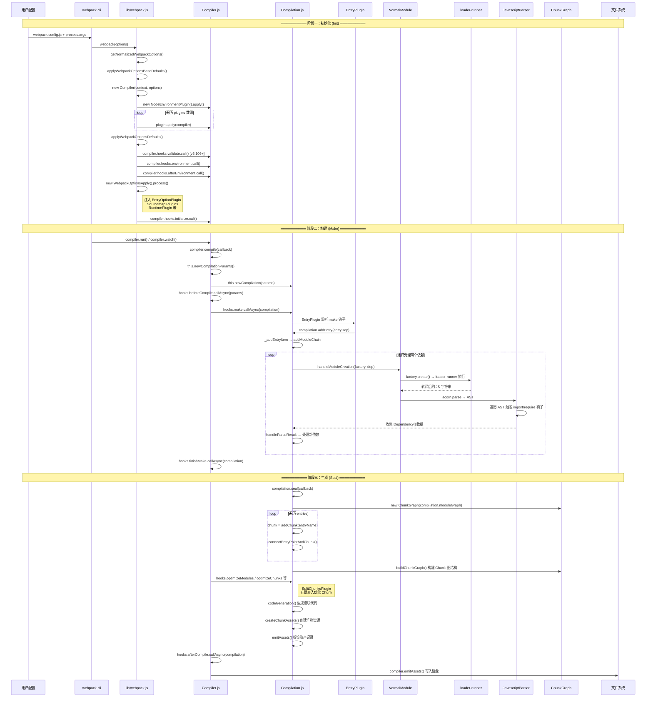
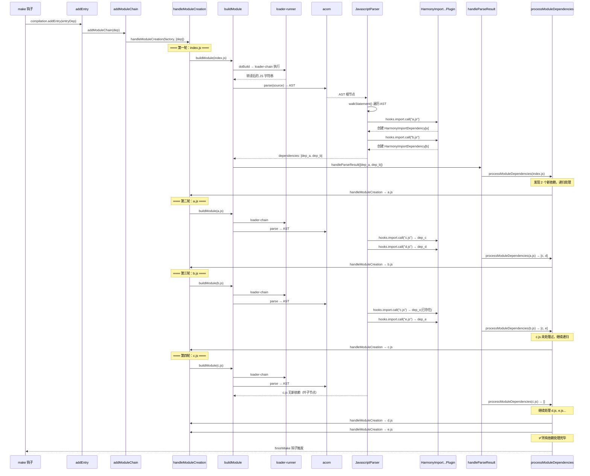

# Init_Make_Seal：真正读懂 Webpack 核心流程

> **本章定位**：全本系列最重要的核心原理章节之一，是理解 Webpack 底层运作机制的基石。

## 前言：为什么需要理解这三阶段？

前面章节中，我们详细讲解了 Webpack 的基本应用、性能优化、Loader 与 Plugin 组件开发方方面面的知识，相信学习过这些内容之后，你已经对 Webpack 有相当深入的理解了，可以开始从更底层的视角，自底向上重新审视 Webpack 实现原理。

Webpack 的功能集非常庞大：模块打包、代码分割、按需加载、Hot Module Replacement、文件监听、Tree-shaking、Sourcemap、Module Federation、Dev Server、DLL、多进程打包、Persistent Cache 等，但抛开这些花里胡哨的能力，最最核心的功能依然是：**At its core, webpack is a static module bundler for modern JavaScript applications**，也就是所谓的**静态模块打包能力**。

Webpack 能够将各种类型的资源 —— 包括图片、音视频、CSS、JavaScript 代码等，通通转译、组合、拼接、生成标准的、能够在不同版本浏览器兼容执行的 JavaScript 代码文件，这一特性能够轻易抹平开发 Web 应用时处理不同资源的逻辑差异，使得开发者以一致的心智模型开发、消费这些不同的资源文件。

## 全景架构：Init-Make-Seal 三阶段总览

为了方便理解，我把整个构建过程划分为三个阶段，下面用一张完整的**泳道图**来展示三个阶段的协作关系与关键节点：



> **上图关键解读**：
> - **横向维度**：展示参与的核心对象及其职责边界
> - **纵向维度**：时间线从上到下严格串行执行
> - **虚线框**：清晰划分三个阶段的边界
> - **循环框**：Make 阶段的递归本质是核心难点

下面我们对每个阶段进行**逐行级源码深挖**。

---

## 阶段一：初始化阶段 (Initialization Phase)

初始化阶段是整个构建流程的起点，主要完成四大职责：**配置合并与校验 → Compiler 对象创建 → 插件系统初始化 → 内置插件注入**。

### 1.1 配置处理流水线

启动时，Webpack 会按顺序执行以下配置处理步骤：

```js
// 📍 lib/webpack.js — 入口函数（完整源码约 230 行）
// 关键函数：createCompiler() — L68~L120

const createCompiler = (rawOptions, compilerIndex) => {
    // Step 1: 配置标准化（去除无效属性、统一格式）
    let options = getNormalizedWebpackOptions(rawOptions);

    // Step 2: 应用基础默认值（mode、context、devtool 等）
    applyWebpackOptionsBaseDefaults(options);

    // Step 3: 配置拦截器处理（允许外部修改配置）
    let interception;
    ({ options, interception } = applyWebpackOptionsInterception(options));

    // Step 4: 创建 Compiler 实例
    const compiler = new Compiler(
        /** @type {string} */ (options.context),
        options
    );

    // Step 5: 注入 Node 环境插件（文件系统等基础能力）
    new NodeEnvironmentPlugin({
        infrastructureLogging: options.infrastructureLogging
    }).apply(compiler);

    // Step 6: 遍历用户 plugins，逐一执行 .apply(compiler)
    if (Array.isArray(options.plugins)) {
        for (const plugin of options.plugins) {
            if (typeof plugin === "function") {
                (plugin).call(compiler, compiler);
            } else if (plugin) {
                plugin.apply(compiler);
            }
        }
    }

    // Step 7: 应用最终默认值（含 mode 相关的优化默认值）
    const resolvedDefaultOptions = applyWebpackOptionsDefaults(
        options,
        compilerIndex
    );

    // Step 8: 【v5.106+ 新增】validate 钩子
    // 允许插件在编译前做最终的配置校验
    if (options.validate) {
        compiler.hooks.validate.call();
    }

    // Step 9: 触发环境就绪钩子
    compiler.hooks.environment.call();
    compiler.hooks.afterEnvironment.call();

    // Step 10: 【核心】根据配置动态注入内置插件
    new WebpackOptionsApply().process(options, compiler, interception);

    // Step 11: 初始化完成钩子
    compiler.hooks.initialize.call();

    return compiler;
};
```

### 1.2 WebpackOptionsApply：内置插件注入枢纽

`WebpackOptionsApply.process()` 是初始化阶段最关键的步骤之一，它根据用户配置**动态决定注入哪些内置插件**：

```js
// 📍 lib/WebpackOptionsApply.js
// process() 方法根据不同配置分支注入对应插件

process(options, compiler, interception) {
    // ① Entry 处理：根据 entry 类型注入 EntryPlugin 或 DynamicEntryPlugin
    new EntryOptionPlugin().apply(compiler);
    compiler.hooks.entryOption.call(options.context, options.entry);

    // ② Devtool 处理：根据 devtool 字符串组合注入对应插件（示意）
    if (options.devtool) {
        if (options.devtool.includes("eval") && options.devtool.includes("source-map")) {
            new EvalSourceMapDevToolPlugin(options.devtool).apply(compiler);
        } else if (options.devtool.includes("source-map")) {
            new SourceMapDevToolPlugin(options.devtool).apply(compiler);
        }
        // ... 更多组合（eval、cheap-module- 等）
    }

    // ③ Runtime 注入：注入运行时代码处理逻辑
    new RuntimePlugin().apply(compiler);

    // ④ 【v5 新增】experiments.lazyCompilation 处理
    if (options.experiments && options.experiments.lazyCompilation) {
        new LazyCompilationPlugin(options.lazyCompilation).apply(compiler);
    }

    // ⑤ 【v5 新增】experiments.css 处理
    if (options.experiments && options.experiments.css) {
        new CssModulesPlugin().apply(compiler);
    }

    // ⑥ 持久化缓存：cache.type === "filesystem" 时注入缓存插件
    //    （AddBuildDependenciesPlugin / MemoryCachePlugin / FileCachePlugin 等）
    if (options.cache && options.cache.type === "filesystem") {
        // ... 注入缓存相关插件
    }
}
```

### 1.3 Compiler.hooks 全貌

Compiler 在构造函数中注册了所有生命周期钩子，这些钩子构成了 Webpack 插件系统的骨架：

```js
// 📍 lib/Compiler.js — 构造函数中的 hooks 定义（L80~L160）

this.hooks = Object.freeze({
    // ===== 初始化阶段 =====
    initialize: new SyncHook([]),           // 编译器初始化完成
    validate: new SyncHook([]),             // [v5.106+] 配置校验
    environment: new SyncHook([]),          // 环境变量准备好
    afterEnvironment: new SyncHook([]),     // 环境设置完成后

    // ===== 编译阶段 =====
    beforeCompile: new AsyncSeriesHook(["params"]),
    compile: new SyncHook(["params"]),
    make: new AsyncParallelHook(["compilation"]),   // ⭐ 核心钩子！
    finishMake: new AsyncSeriesHook(["compilation"]),
    afterCompile: new AsyncSeriesHook(["compilation"]),

    // ===== 生成阶段 =====
    shouldEmit: new SyncBailHook(["compilation"]),
    emit: new AsyncSeriesHook(["compilation"]),
    assetEmitted: new AsyncSeriesHook(["file", "info"]),
    afterEmit: new AsyncSeriesHook(["compilation"]),

    // ===== 运行控制 =====
    beforeRun: new AsyncSeriesHook(["compiler"]),
    run: new AsyncSeriesHook(["compiler"]),
    watchRun: new AsyncSeriesHook(["compiler"]),
    done: new AsyncSeriesHook(["stats"]),
    // ... 更多 hooks
});
```

### 1.4 compile()：通往 Make 阶段的桥梁

初始化阶段的最后一步是调用 `compiler.compile()` 方法，这个方法虽然本身不复杂，但它**搭建起了后续两个阶段的完整框架**：

```js
// 📍 lib/Compiler.js — compile() 方法（约 L1380）

compile(callback) {
    // 创建 CompilationParams（包含 NormalModuleFactory 和 ContextModuleFactory）
    const params = this.newCompilationParams();

    this.hooks.beforeCompile.callAsync(params, err => {
        if (err) return callback(err);

        this.hooks.compile.call(params);

        // ⭐ 创建 Compilation 对象 —— 单次构建过程的管理者
        const compilation = this.newCompilation(params);

        // ⭐⭐⭐ 触发 make 钩子 —— 进入「构建阶段」的入口
        this.hooks.make.callAsync(compilation, err => {
            if (err) return callback(err);

            this.hooks.finishMake.callAsync(compilation, err => {
                if (err) return callback(err);

                // 使用 process.nextTick 让出主线程
                process.nextTick(() => {
                    compilation.finish(err => {
                        if (err) return callback(err);

                        // ⭐⭐⭐ 调用 seal() —— 进入「生成阶段」
                        compilation.seal(err => {
                            if (err) return callback(err);

                            // 触发 afterCompile 钩子 —— 编译完成收尾
                            this.hooks.afterCompile.callAsync(compilation, err => {
                                if (err) return callback(err);
                                return callback(null, compilation);
                            });
                        });
                    });
                });
            });
        });
    });
}
```

> **关键洞察**：`compile()` 方法的精妙之处在于它通过**嵌套回调**串联了三个阶段的所有关键节点。注意 `process.nextTick()` 的使用 —— 它确保在进入 seal 之前，当前事件循环中的微任务已全部完成。

---

## 阶段二：构建阶段 (Make Phase)

**构建阶段是 Webpack 最核心、最复杂的阶段**。它的任务是从 entry 模块出发，递归地读取、转译、解析每一个模块，最终构建出完整的**模块依赖关系图 (Module Dependency Graph)**。

### 2.1 构建阶段入口：EntryPlugin 监听 make 钩子

当 `compiler.hooks.make` 被触发时，之前在初始化阶段通过 `EntryOptionPlugin` 注册的 `EntryPlugin` 开始工作：

```js
// 📍 lib/EntryPlugin.js（约 L40~L60）

class EntryPlugin {
    constructor(context, entry, options = {}) {
        this.context = context;
        this.entry = entry;
        this.options = options || "default";
    }

    apply(compiler) {
        // 创建入口依赖对象（EntryDependency 记录入口路径和类型）
        const dep = EntryPlugin.createDependency(this.entry, this.options);

        // ⭐ 监听 make 钩子 —— 这是构建阶段的真正起点
        compiler.hooks.make.tapAsync("EntryPlugin", (compilation, callback) => {
            compilation.addEntry(
                this.context,
                dep,
                this.options,
                err => {
                    callback(err);
                }
            );
        });
    }
}
```

### 2.2 addEntry → addModuleChain：构建链路的启动

`compilation.addEntry()` 是构建阶段的 API 入口，内部经过几层委托后到达真正的构建引擎：

```js
// 📍 lib/Compilation.js — addEntry 及其调用链

// addEntry（约 L2511）：入口函数
addEntry(context, entry, optionsOrName, callback) {
    // ...
    this._addEntryItem(context, entry, optionsOrName, callback);
}

// _addEntryItem（约 L2440）：创建入口 Module
_addEntryItem(context, entry, optionsOrName, callback) {
    // ...
    this.addModuleChain(
        context,
        entry,
        (err, module) => { callback(err); }
    );
}

// addModuleChain（约 L2444）：核心构建链路
addModuleChain(context, dependency, callback) {
    // ...

    // ⭐ 根据依赖类型选择对应的 Module Factory
    const moduleFactory = this.dependencyFactories.get(dependency.constructor);

    // ⭐ 进入模块创建核心流程
    this.handleModuleCreation(
        {
            factory: moduleFactory,
            dependencies: [dependency],
            contextInfo,
            context
        },
        (err) => { callback(err, module); }
    );
}
```

### 2.3 handleModuleCreation：模块创建的核心引擎

这是构建阶段最核心的方法，负责将一个依赖 (Dependency) 转换为一个模块 (Module)：

```js
// 📍 lib/Compilation.js — handleModuleCreation（约 L2205）

handleModuleCreation({factory, dependencies, originModule, contextInfo, context, ...}, callback) {
    // Step 1: factorizeModule —— 调用 factory.create() 将 Dependency 工厂化为 Module
    this.factorizeModule(
        { factory, dependencies, originModule, contextInfo, context },
        (err, factoryResult) => {
            if (err) { this.errors.push(err); return callback(err); }
            const newModule = factoryResult.module;

            // Step 2: addModule —— 加入模块集合（内部含去重判断）
            this.addModule(newModule, (err, module) => {
                if (err) { this.errors.push(err); return callback(err); }

                // ⭐ Step 3: buildModule（读文件 → loader → AST → 依赖收集）
                this.buildModule(module, (err) => {
                    if (err) return callback(err);

                    // Step 4: 处理该模块收集到的依赖
                    this.processModuleDependencies(
                        module,
                        (err) => {
                            // ⭐⭐⭐ 递归：对新发现的依赖再次调用 handleModuleCreation
                            callback(err);
                        }
                    );
                });
            });
        }
    );
}
```

### 2.4 buildModule：loader 执行与 AST 解析

`buildModule` 是单个模块的构建过程，涉及 **loader-runner** 和 **acorn AST 解析**两大核心操作：

```js
// 📍 lib/Compilation.js — buildModule（约 L2000 附近）

buildModule(module, callback) {
    // 触发 buildModule 钩子后调用 module.build() —— 对于 NormalModule 来说：
    //   1. 读取原始文件内容
    //   2. 执行 loader chain（通过 loader-runner）
    //   3. 将结果交给 parser 做 AST 分析
    this.hooks.buildModule.call(module);
    module.build(this.options, this, this.resolverFactory, this.inputFileSystem, err => {
        // ...
        callback();
    });
}
```

对于最常见的 `NormalModule`（即 `.js`/`.ts`/`.css` 等普通文件模块），其 `build()` 方法的内部流程如下：

```js
// 📍 lib/NormalModule.js — build() 方法（约 L1300 附近）

build(options, compilation, resolverFactory, fileSystem, callback) {
    // Step 1: 读取文件内容
    return this.doBuild(options, compilation, resolverFactory, fileSystem, err => {
        // Step 2: doBuild 内部调用 loader-runner
        // 所有配置的 loader 按规则（enforce/pre/normal/post）依次执行
        // 最终输出标准的 JavaScript 字符串（存于 this._source）

        try {
            const source = this._source.source();

            // Step 3: 【关键】JavascriptParser 同步解析 AST 并收集依赖
            // 依赖通过 state.current.addDependency() 挂到当前模块上
            this.parser.parse(this._ast || source, {
                source,
                current: this,       // 当前 module 引用
                module: this,
                compilation: compilation,
                options
            });
        } catch (parseErr) {
            return callback(parseErr);
        }

        // Step 4: 解析得到的依赖交由上层 processModuleDependencies 递归处理
        callback();
    });
}
```

### 2.5 JavascriptParser：AST 遍历与依赖收集

`JavascriptParser` 是 Webpack 的**依赖分析引擎**，它基于 [acorn](https://github.com/acornjs/acorn) 将 JavaScript 代码解析为 AST，然后遍历 AST 收集所有模块导入语句：

```js
// 📍 lib/javascript/JavascriptParser.js — 核心解析方法（约 L4892）

class JavascriptParser {
    // parse() 方法：AST 解析入口（同步执行，解析失败直接抛错）
    parse(source, state) {
        // Step 1: 使用 acorn 将源码解析为 AST
        let ast;
        ast = acorn.parse(source, {
            ecmaVersion: "latest",
            sourceType: "module",
            // ... 其他 parser 选项
        });

        // Step 2: 【核心】触发 program 钩子后遍历 AST
        if (this.hooks.program.call(ast) === undefined) {
            this.prewalkStatements(ast.body);  // 预遍历（函数提升等）
            this.walkStatements(ast.body);     // 逐语句遍历，触发各类钩子
        }

        // Step 3: 依赖已在遍历过程中通过 state.current.addDependency() 收集完成
        return state;
    }

    // 当遇到 import 语句时的处理
    import(statement, source) {
        // ⭐ 触发 import 钩子 —— HarmonyImportDependencyParserPlugin 监听此钩子
        this.hooks.import.call(statement, source);
    }

    // 当遇到 require() 调用时的处理
    // call 是 HookMap，按被调用函数名分发（如 "require"、"require.ensure"）
    call(expression) {
        if (expression.callee.type === "Identifier" &&
            expression.callee.name === "require") {
            // ⭐ 触发 call 钩子
            this.hooks.call.for("require").call(expression);
        }
    }

    // 当遇到 import() 动态导入时的处理（代码分割的入口之一）
    importCall(expression) {
        // ⭐ 触发 importCall 钩子 —— ImportParserPlugin 监听此钩子
        this.hooks.importCall.call(expression);
    }
}
```

### 2.6 HarmonyImportDependencyParserPlugin：ESM 依赖收集器

这是一个**内置 Parser Plugin**，专门负责监听 `import` 语句并将其转换为 `HarmonyImportDependency` 对象：

```js
// 📍 lib/dependencies/HarmonyImportDependencyParserPlugin.js（约 L150~L200）

class HarmonyImportDependencyParserPlugin {
    apply(parser) {
        // 监听 import 钩子 —— 每个 import 语句都会触发
        parser.hooks.import.tap(
            "HarmonyImportDependencyParserPlugin",
            (statement, source) => {
                // 清除缓存，确保每次都重新解析
                parser.state.lastHarmonyImportOrder =
                    (parser.state.lastHarmonyImportOrder || 0) + 1;

                // ⭐ 创建 HarmonyImportDependency 对象
                const dep = new HarmonyImportDependency(
                    source,                              // 模块路径
                    parser.state.lastHarmonyImportOrder  // 导入顺序
                );
                dep.loc = statement.loc;                 // 源码位置信息

                // ⭐ 将依赖添加到当前 Module
                parser.state.module.addDependency(dep);
                parser.state.lastHarmonyImport = dep;
            }
        );

        // 同时监听 export 钩子 —— 处理 export 语句
        parser.hooks.export.tap(/* ... */);
        parser.hooks.exportImport.tap(/* ... */);
    }
}
```

### 2.7 递归构建：Make 阶段的灵魂

当第一个模块（entry）的依赖被收集完毕后，Webpack 会**递归地对每一个新发现的依赖重复上述流程**。下面用时序图展示这个递归过程的完整细节：



> **时序图要点**：
> - 每个模块经历相同的 `buildModule → loader → AST → 依赖收集` 流程
> - **去重机制**：如果某个依赖已经被其他模块引入过（如 `c.js`），会复用已有的 Module 对象
> - **广度优先**：Webpack 采用类似 BFS 的策略，先处理完当前层的所有依赖再深入下一层
> - **终止条件**：当 `processModuleDependencies` 发现没有新的未处理依赖时，递归结束

### 2.8 v5 新增：条件分支节点

在 v5 中，构建阶段新增了几个重要的条件分支：

#### 2.8.1 Persistent Cache（持久化缓存）

```js
// 📍 lib/Compilation.js — 缓存检查逻辑

// 如果开启了 filesystem cache，会先尝试从缓存恢复 Module
if (this.cache && this.cache.enabled) {
    const cacheKey = this.getCacheModuleKey(module);
    const cachedModule = await this.cache.get(cacheKey);

    if (cachedModule && !isModuleInvalid(cachedModule)) {
        // 直接使用缓存的 Module，跳过 loader 和 AST 解析
        this.addModule(cachedModule);
        return callback(null, cachedModule);
    }
}

// 缓存未命中或失效，走正常构建流程
this.buildModule(module, callback);
```

#### 2.8.2 LazyCompilation（延迟编译）

```js
// 📍 lib/LazyCompilationPlugin.js（概念示意）

// 当开启 lazyCompilation 时，entry 模块不会立即构建所有依赖
// 而是在实际被请求时才触发构建
if (options.experiments?.lazyCompilation) {
    compiler.hooks.make.tapAsync("LazyCompilation", (compilation, callback) => {
        // 只编译 entry 本身，不递归处理依赖
        compilation.addEntry(entryDep, (err, entryModule) => {
            // 依赖将在运行时（如 HTTP 请求）才触发编译
            callback(err);
        });
    });
}
```

#### 2.8.3 Experiments.CSS（原生 CSS 支持）

```js
// 当开启 experiments.css 时，CSS 模块走特殊处理路径
if (options.experiments?.css) {
    // CSS 文件不会被转为 JS，而是由 CssModule 处理
    // 最终生成独立的 CSS asset 或注入到 JS runtime 中
    compilation.dependencyFactories.set(CssDependency, new CssModuleFactory());
}
```

---

## 阶段三：生成阶段 (Seal Phase)

**生成阶段**解决的是资源的"输出"问题：将上一步构建出的所有 Module 对象，按照特定规则组织成 Chunk，经过一系列优化后，翻译为适合目标环境运行的产物代码，最终写入文件系统。

### 3.1 seal()：生成阶段的入口

`seal()` 函数名原意为"密封"，在 Webpack 语境下可以理解为"**将模块锁定进 Chunk，不再接受新的模块加入**"：

```js
// 📍 lib/Compilation.js — seal() 方法（约 L3261）

seal(callback) {
    // Step 1: 创建 ChunkGraph 对象
    // ChunkGraph 维护 Module ↔ Chunk 之间的映射关系
    this.chunkGraph = new ChunkGraph(this.moduleGraph);

    // Step 2: 遍历所有 entries，为每个入口创建 Chunk
    for (const [entryName, entry] of this.entries) {
        const chunk = this.addChunk(entryName);          // 创建 EntryPoint Chunk
        entrypoint.connectChunk(chunk);                   // 关联 Entrypoint 与 Chunk
    }

    // Step 3: 【关键】构建 Chunk Graph 结构（同步执行）
    // 将 Module 按照依赖关系分配到各个 Chunk 中
    buildChunkGraph(this, chunkGraphInit);
    this.hooks.afterChunks.call(this.chunks);

    // Step 4: 触发一系列优化钩子
    // 这里的钩子是 SplitChunksPlugin 等优化插件的介入点
    // 注意：optimizeModules/optimizeChunks 是 SyncBailHook（用 call），
    //       optimizeTree/optimizeChunkModules 是异步钩子（用 callAsync）
    while (this.hooks.optimizeModules.call(this.modules)) { /* 返回真值则重复执行 */ }
    while (this.hooks.optimizeChunks.call(this.chunks, this.chunkGroups)) { /* ... */ }
    this.hooks.optimizeTree.callAsync(this.chunks, this.modules, (err) => {
        if (err) return callback(err);

        this.hooks.optimizeChunkModules.callAsync(this.chunks, this.modules, (err) => {
            if (err) return callback(err);

            // Step 5: 【核心】代码生成
            this.codeGeneration((err) => {
                if (err) return callback(err);

                // Step 6: 为每个 Chunk 创建 Asset
                this.createChunkAssets((err) => {
                    if (err) return callback(err);
                    callback();
                    // 至此 seal 结束；产物写盘由 Compiler.emitAssets 完成（见 3.5）
                });
            });
        });
    });
}
```

### 3.2 ChunkGraph：Module 到 Chunk 的映射中枢

`ChunkGraph` 是生成阶段最重要的数据结构之一，它记录了**哪些 Module 属于哪个 Chunk**：

```js
// 📍 lib/ChunkGraph.js（核心数据结构示意）

class ChunkGraph {
    constructor(moduleGraph) {
        this._modules = new Set();              // 所有 Module
        this._chunks = new Set();               // 所有 Chunk
        this._chunkModuleMap = new Map();       // Chunk → Set<Module>
        this._moduleChunkMap = new Map();       // Module → Set<Chunk>
        this._entrypointChunkMap = new Map();   // Entrypoint → Chunk
    }

    // 将 Module 连接到 Chunk
    connectChunkAndModule(chunk, module) {
        if (!this._chunkModuleMap.has(chunk)) {
            this._chunkModuleMap.set(chunk, new Set());
        }
        this._chunkModuleMap.get(chunk).add(module);

        if (!this._moduleChunkMap.has(module)) {
            this._moduleChunkMap.set(module, new Set());
        }
        this._moduleChunkMap.get(module).add(chunk);
    }

    // 获取 Chunk 包含的所有 Modules
    getChunkModules(chunk, type) {
        return this._chunkModuleMap.get(chunk) || new Set();
    }

    // 获取 Module 所属的所有 Chunks
    getModuleChunks(module) {
        return this._moduleChunkMap.get(module) || new Set();
    }
}
```

### 3.3 codeGeneration：模块代码生成

`codeGeneration()` 是将 Module 的内部表示转换为可输出的 JavaScript 代码的过程：

```js
// 📍 lib/Compilation.js — codeGeneration()（约 L3686）

codeGeneration(callback) {
    // 遍历所有需要生成代码的 Module
    for (const module of this.modules) {
        this._codeGenerationModule(
            module,
            this.artifacts,
            (err, result) => {
                // result 包含生成的代码和 sourcemap
                // 不同类型的 Module 有不同的 codeGeneration 实现：
                //
                // NormalModule:
                //   → 输出经过 loader 转译后的 JS 代码
                //   + __webpack_require__ 包装
                //   + module.exports 赋值
                //
                // CssModule (experiments.css):
                //   → 输出 CSS 字符串
                //   或 CSS Module 的映射对象
                //
                // JsonModule:
                //   → JSON.parse(...) 包装
            }
        );
    }
    callback();
}
```

### 3.4 createChunkAssets：从 Chunk 到 Asset

seal 的最后一步是将 Chunk 转换为 Asset 记录（此时还未写入磁盘）：

```js
// 📍 lib/Compilation.js — createChunkAssets()（约 L5196）

createChunkAssets(callback) {
    for (const chunk of this.chunks) {
        // 根据 output.filename 模板生成文件名
        // 如 [name].[contenthash:8].js → main.a1b2c3d4.js
        const filenameTemplate = this.outputOptions.filename;
        const filename = this.getPath(filenameTemplate, {
            chunk,
            contentHash: chunk.hash,
            hash: this.hash,
        });

        // webpack 5 渲染链路：触发 renderManifest 钩子收集渲染任务
        // （由 JavascriptModulesPlugin 等内置插件注册，拼接 runtime + 各模块代码）
        const renderManifest = [];
        this.hooks.renderManifest.call(renderManifest, { chunk, outputOptions: this.outputOptions });

        for (const entry of renderManifest) {
            // 渲染任务执行后返回 Source（含 sourcemap 信息）
            const source = entry.render();

            // ⭐ 创建 Asset 记录（此时还未写入磁盘）
            this.emitAsset(filename, source);
        }
    }
    callback();
}
```

> 📌 注意：产物记录完成后，`assetEmitted` 钩子并不会在 Compilation 内触发 —— 它在下一节 `Compiler.emitAssets` 真正写盘后逐文件触发。

### 3.5 最终输出：Compiler.emitAssets 写入文件系统

当 `seal()` 完成后，控制流回到 `Compiler`，最终调用文件系统 API 写入磁盘：

```js
// 📍 lib/Compiler.js — emitAssets()（约 L724）

emitAssets(compilation, callback) {
    // 遍历 compilation.assets，逐个写入
    let filePaths = [];
    asyncLib.forEach(
        compilation.assets,
        (source, filename, callback) => {
            // 计算最终输出路径
            const outputPath = this.outputFileSystem.join(
                this.outputPath,
                filename
            );

            // ⭐⭐⭐ 真正的文件写入操作
            this.outputFileSystem.writeFile(
                outputPath,
                source.source(),
                () => {
                    filePaths.push(outputPath);
                    callback();
                }
            );
        },
        (err) => {
            // 所有文件写入完成；done 钩子由 run() 流程在 emit 之后触发
            callback(err);
        }
    );
}
```

---

## 资源形态流转全景图

在整个构建过程中，资源经历了多次形态变换。下面用一张完整的流转图来展示每种形态的含义和转换时机：

```mermaid
flowchart LR
    subgraph Input["📥 输入层"]
        SF["Source File<br/>src/index.js<br/>src/App.css<br/>assets/logo.png"]
    end

    subgraph Dep["🔗 依赖层"]
        D["Dependence<br/><b>EntryDependency</b><br/><b>HarmonyImportDependency</b><br/><b>CssDependency</b><br/>记录: 类型 · 路径 · 请求范围"]
    end

    subgraph Mod["📦 模块层"]
        M["Module<br/><b>NormalModule</b><br/><b>CssModule</b><br/><b>JsonModule</b><br/>包含: source · dependencies · buildInfo · hash"]
    end

    subgraph Chunk["🧱 组合层"]
        C["Chunk<br/><b>EntryPoint Chunk</b><br/><b>Async Chunk</b><br/>组织: Module集合 · runtime · 入口映射"]
    end

    subgraph Output["📤 输出层"]
        A["Asset<br/><b>RawSource</b><br/><b>OriginalSource</b><br/>包含: 内容 · sourcemap · size"]
        OF["Output File<br/>dist/main.a1b2c3d4.js<br/>dist/main.a1b2c3d4.css"]
    end

    SF -->|"make 阶段<br/>EntryPlugin.createDependency()"| D
    D -->|"handleModuleCreation()<br/>factory.create()"| M
    M -->|"seal 阶段<br/>buildChunkGraph()<br/>connectChunkAndModule()"| C
    C -->|"codeGeneration()<br/>createChunkAssets()"| A
    A -->|"Compiler.emitAssets()<br/>outputFS.writeFile()"| OF

```



### 各形态详细说明

| 形态 | 核心类型 | 创建时机 | 存储位置 | 关键属性 |
|------|----------|----------|----------|----------|
| **Source File** | 原始文件 | 用户编写 | 项目 `src/` 目录 | 原始内容、文件扩展名 |
| **Dependence** | `EntryDependency` / `HarmonyImportDependency` | `make` 阶段 | `module.dependencies` | `request`(路径)、`type`、`userRequest`、`loc` |
| **Module** | `NormalModule` / `CssModule` / `JsonModule` | `handleModuleCreation` | `compilation.modules` | `_source`(转译后内容)、`dependencies[]`、`buildInfo`、`hash` |
| **Chunk** | `Chunk` | `seal` → `addChunk` | `compilation.chunks` | `name`、`modules`(Set)、`entryModule`、`runtime` |
| **Asset** | `RawSource` / `OriginalSource` | `createChunkAssets` | `compilation.assets`(Map) | `_value`(内容)、`size()`、`source()`、`map()` |
| **Output File** | 物理文件 | `Compiler.emitAssets` | `dist/` 目录 | 文件名(含 hash)、文件内容 |

### 核心对象速查

| 对象 | 生命周期 | 数量 | 职责 |
|------|----------|------|------|
| **Compiler** | 进程级别（`watch` 模式下长期存活） | 1 个 | 编译管理器，持有 hooks、cache、fileSystem |
| **Compilation** | 单次编译过程 | 每次 build 1 个 | 本次构建的管理者，持有 modules/chunks/assets |
| **ModuleGraph** | 单次编译过程 | 1 个 | Module 之间的连接关系（谁依赖谁） |
| **ChunkGraph** | `seal` 之后 | 1 个 | Module ↔ Chunk 的归属关系 |
| **Module** | 按项目文件数 | N 个 | 单个文件的内部表示 |
| **Dependency** | 按 import/require 语句数 | M 个 | 单条导入声明的抽象表示 |
| **Chunk** | 按 entry + 异步分割数 | K 个 | 输出文件的逻辑分组 |

---

## 实例演示：从配置到产物的完整流转

假设有如下项目结构和配置：

```js
// webpack.config.js
module.exports = {
  mode: 'production',
  entry: {
    main: './src/index.js',
    vendor: './src/vendor.js'
  },
  output: {
    filename: '[name].[contenthash:8].js',
    path: path.resolve(__dirname, 'dist')
  },
  optimization: {
    splitChunks: {
      chunks: 'all'
    }
  }
};
```

```js
// src/index.js
import { foo } from './utils/a.js';
import { bar } from './utils/b.js';
console.log(foo, bar);
```

```js
// src/utils/a.js
import { shared } from './shared.js';
export const foo = () => shared + '-from-a';
```

```js
// src/utils/b.js
import { shared } from './shared.js';
export const bar = () => shared + '-from-b';
```

```js
// src/vendor.js
import lodash from 'lodash';
export default lodash;
```

### 构建过程推演

```text
┌─────────────────────────────────────────────────────────────────────┐
│  初始化阶段                                                         │
│  ├─ 合并配置 → 校验 schema → 创建 Compiler                          │
│  ├─ 运行用户 plugins                                                │
│  └─ WebpackOptionsApply 注入:                                       │
│     ├─ EntryOptionPlugin → 注册 EntryPlugin × 2 (main + vendor)    │
│     └─ SplitChunksPlugin (optimization.splitChunks)                 │
│     （mode=production 时 optimization.minimizer 默认含 TerserPlugin）│
└─────────────────────────────────────────────────────────────────────┘
                                    ↓
┌─────────────────────────────────────────────────────────────────────┐
│  构建阶段 (Make)                                                    │
│                                                                     │
│  Entry[main] → index.js                                             │
│    ├── Dependence: ./utils/a.js                                     │
│    │   └── Module[a.js] → Dependence: ./shared.js                   │
│    │       └── Module[shared.js] → (无新依赖 ✓)                     │
│    └── Dependence: ./utils/b.js                                     │
│        └── Module[b.js] → Dependence: ./shared.js                   │
│            └── Module[shared.js] ← 复用已有 ✓                       │
│                                                                     │
│  Entry[vendor] → vendor.js                                          │
│    └── Dependence: lodash                                           │
│        └── Module[lodash] → (无新依赖 ✓)                            │
│                                                                     │
│  Module Graph 完成: 6 个 Module                                      │
└─────────────────────────────────────────────────────────────────────┘
                                    ↓
┌─────────────────────────────────────────────────────────────────────┐
│  生成阶段 (Seal)                                                    │
│                                                                     │
│  1. 创建 Chunk:                                                     │
│     ├─ Chunk[main]  ← index.js + a.js + b.js + shared.js            │
│     ├─ Chunk[vendor] ← vendor.js + lodash                           │
│                                                                     │
│  2. SplitChunksPlugin 优化:                                         │
│     └─ shared.js 被 2 个 Chunk 共用 → 提取为独立 Chunk              │
│                                                                     │
│  3. 最终 Chunk 结构:                                                 │
│     ├─ Chunk[vendors]   ← lodash                                   │
│     ├─ Chunk[main]      ← index.js + a.js + b.js                   │
│     └─ Chunk[shared]    ← shared.js                                │
│                                                                     │
│  4. codeGeneration → createChunkAssets → emitAssets                 │
│                                                                     │
│  5. 输出文件:                                                        │
│     dist/vendors.xxxx.js                                            │
│     dist/main.xxxx.js                                               │
│     dist/shared.xxxx.js                                             │
└─────────────────────────────────────────────────────────────────────┘
```

---

## 总结

综上，Webpack 底层源码非常复杂，但撇除所有分支逻辑后，构建主流程可以简单划分为三个阶段：

| 阶段 | 核心任务 | 解决的问题 | 关键输入 | 关键输出 |
|------|----------|------------|----------|----------|
| **Init（初始化）** | 配置合并校验、创建 Compiler、运行插件、注入内置插件 | "构建环境如何准备？" | `webpack.config.js` + CLI 参数 | `compiler` 对象（含完整 hooks） |
| **Make（构建）** | 从 entry 出发递归解析模块、loader 转译、AST 分析、依赖收集 | "项目有哪些文件？它们怎么互相依赖？" | entry 文件路径 | `Module Graph`（完整模块依赖关系图） |
| **Seal（生成）** | 组织 Chunk、优化拆分、代码生成、写出产物 | "最终输出什么文件？每个文件包含什么内容？" | `Module Graph` + entry 配置 | `dist/` 目录下的产物文件 |

### 三个阶段的设计哲学

1. **关注点分离**：每个阶段只做一件事，边界清晰
2. **Hook 驱动**：每个阶段的衔接点都是 Tapable Hook，插件可以在任意环节介入
3. **递归展开**：Make 阶段的递归是理解 Webpack 模块化能力的钥匙
4. **渐进封闭**：从开放的模块收集到 sealed 的 Chunk 输出，体现了"先收集后冻结"的思想

这个过程串起资源「输入」到「输出」的关键步骤，可以说是 Webpack 最重要的流程骨架，**没有之一**！

> 💡 **建议**：务必跟随上述各个阶段的介绍，翻阅 [Webpack GitHub 源库](https://github.com/webpack/webpack/tree/main/lib) 中对应的具体代码，深度理解 Webpack 构建功能的实现细节。特别是 `lib/webpack.js`、`lib/Compiler.js`、`lib/Compilation.js` 这三个文件，是理解整个流程的关键。

在后面章节中，我还会在这个流程骨架基础上，继续展开一些有代表性的对象、分支、功能实现逻辑，帮助你更体系化理解 Webpack 实现原理。

---

## 思考题

1. **【基础】** 在「构建阶段」，为什么需要先将依赖文件构建为 `Dependency`，之后再根据 `Dependency` 创建对应的 `Module` 对象？`Dependency` 对象到底有什么作用？这种间接层设计带来了什么好处？

2. **【进阶】** `ChunkGraph` 和 `ModuleGraph` 分别维护什么关系？为什么 Webpack 需要这两个独立的图结构而不是合二为一？

3. **【挑战】** 如果你要实现一个自定义 Plugin，希望在 `codeGeneration` 阶段修改某个 Module 生成的代码（比如注入全局变量声明），你应该监听哪个 Hook？在这个 Hook 的回调中你能访问到什么数据？

4. **【v5 特性】** 开启 `cache: { type: 'filesystem' }` 后，第二次构建的 Make 阶段会有什么不同的行为？Webpack 如何判断某个 Module 的缓存是否仍然有效？

---

## 附录：关键源码索引

| 文件路径 | 关键方法/类 | 行号范围（约） | 说明 |
|----------|-------------|----------------|------|
| `lib/webpack.js` | `createCompiler()` | L81~L130 | Compiler 创建入口 |
| `lib/webpack.js` | `webpack()` | L170~L230 | 导出函数，schema 校验 |
| `lib/Compiler.js` | `constructor` | L50~L180 | Hooks 注册 |
| `lib/Compiler.js` | `compile()` | 约 L1380 | 三阶段调度中心 |
| `lib/Compiler.js` | `emitAssets()` | 约 L724 | 文件写入 |
| `lib/Compilation.js` | `addEntry()` | 约 L2511 | 构建入口 |
| `lib/Compilation.js` | `handleModuleCreation()` | 约 L2205 | 模块创建核心 |
| `lib/Compilation.js` | `seal()` | 约 L3261 | 生成阶段入口 |
| `lib/Compilation.js` | `codeGeneration()` | 约 L3686 | 代码生成 |
| `lib/Compilation.js` | `createChunkAssets()` | 约 L5196 | 资产创建 |
| `lib/NormalModule.js` | `build()` | 约 L1300 | 单模块构建 |
| `lib/javascript/JavascriptParser.js` | `parse()` | 约 L4892 | AST 解析与依赖收集 |
| `lib/dependencies/HarmonyImportDependencyParserPlugin.js` | `apply()` | L150~L200 | ESM import 依赖收集 |
| `lib/EntryPlugin.js` | `apply()` | L40~L60 | make 钩子监听 |
| `lib/WebpackOptionsApply.js` | `process()` | 全文 | 内置插件动态注入 |
| `lib/ChunkGraph.js` | 类定义 | 全文 | Module-Chunk 映射 |
