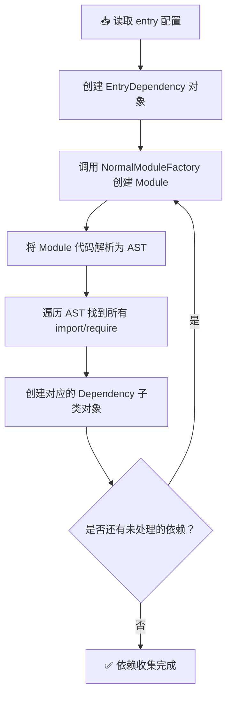
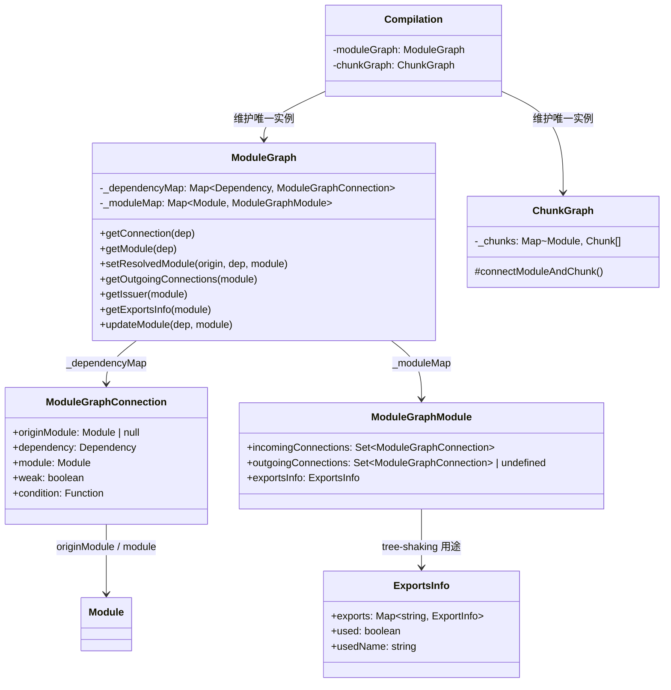
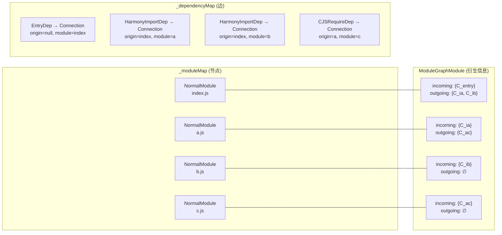
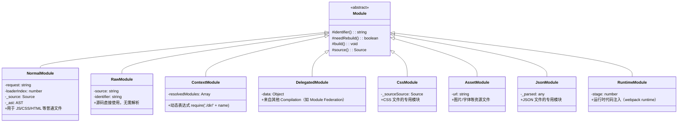
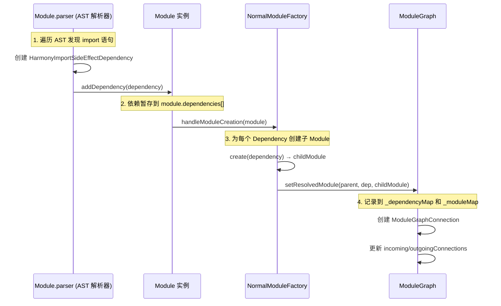
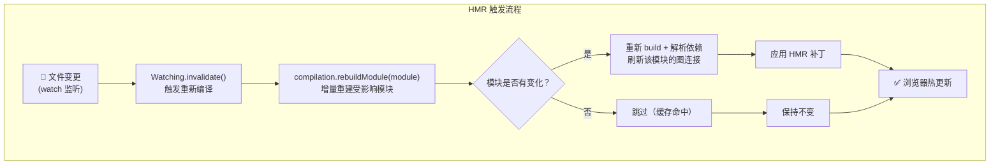
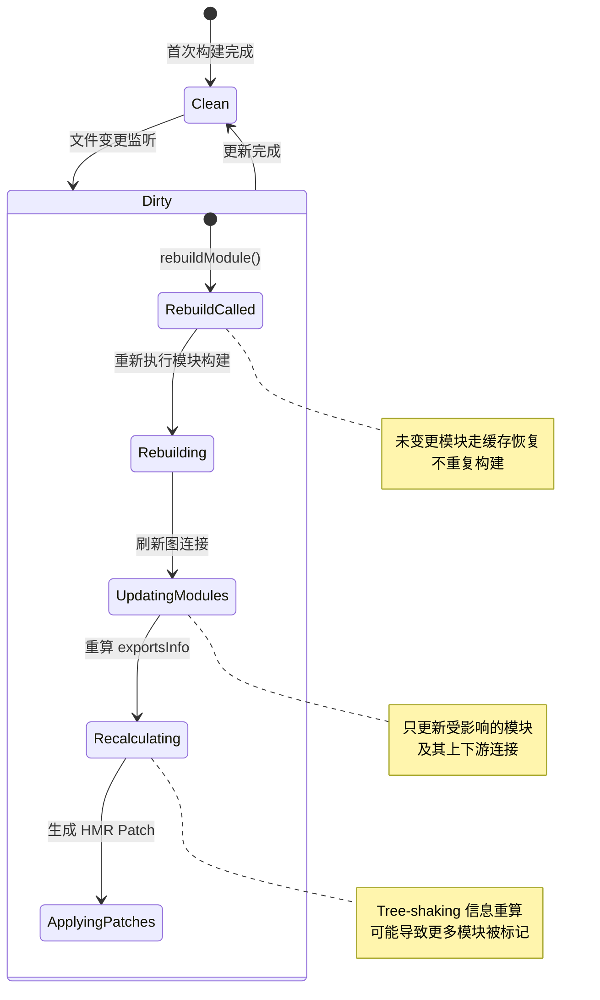
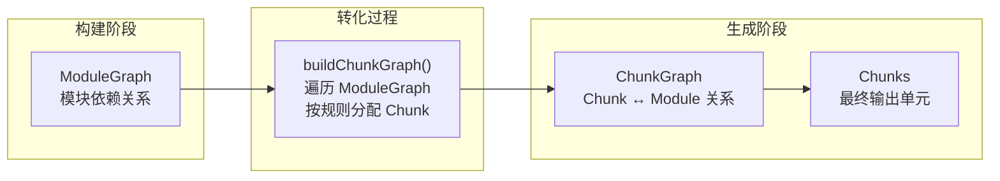
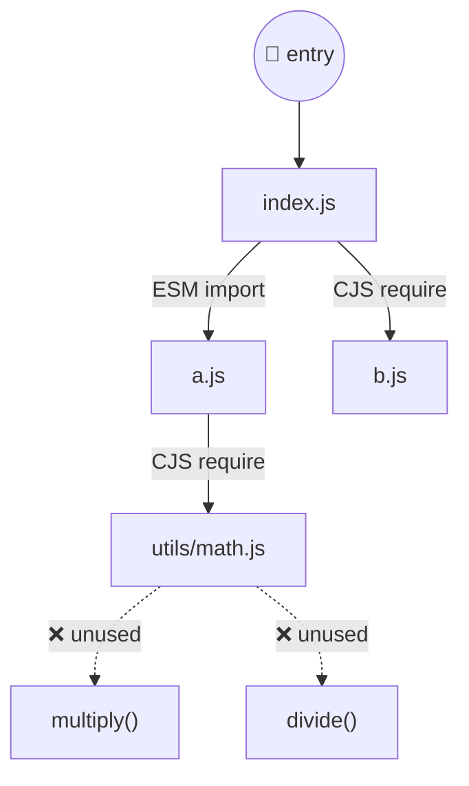
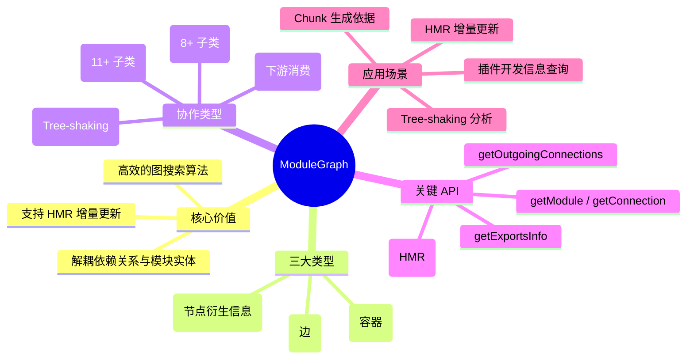

# Dependency Graph：如何管理模块间依赖？


> **概念来源**：[Dependency Graph \| webpack](https://webpack.js.org/concepts/dependency-graph/)
>
> > Any time one file depends on another, webpack treats this as a *dependency*. This allows webpack to take non-code assets, such as images or web fonts, and also provide them as *dependencies* for your application.
> >
> > When webpack processes your application, it starts from a list of modules defined on the command line or in its configuration file. Starting from these *[entry points](https://webpack.js.org/concepts/entry-points/)*, webpack recursively builds a *dependency graph* that includes every module your application needs, then bundles all of those modules into a small number of *bundles* - often, just one - to be loaded by the browser.

**大意**：Webpack 处理应用代码时，会从开发者提供的 `entry` 开始递归地组建起包含所有模块的 **Dependency Graph**，之后再将这些 `module` 打包为 `bundles`。

然而事实远不止官网描述的这么简单。Dependency Graph 贯穿 Webpack 整个运行周期——从「**构建阶段**」的模块解析，到「**生成阶段**」的 Chunk 生成，以及 Tree-shaking、HMR 等功能都高度依赖于它。它是 Webpack 资源构建流程中**最核心的数据结构**。

---

## 一、为什么需要 Dependency Graph？

### 1.1 构建阶段的关键过程

在正式介绍数据结构之前，先回顾 Webpack 构建阶段的关键步骤：



这个过程从 `entry` 模块开始，逐步递归找出所有依赖文件，模块之间隐式形成了：
- **节点（Node）**：每个 Module
- **边（Edge）**：import/require 等导入导出依赖
- **起点（Root）**：entry 入口模块

这就是一张**有向图**（CJS 循环引用会形成环，多数场景无环）——也就是 Webpack 官方所称的 **Dependency Graph**。

### 1.2 v5 之前的设计问题

Webpack 5 之前，依赖关系隐含在 `DependenciesBlock` / `Module` 对象的属性中：

```javascript
// ❌ 旧设计 (Webpack 4.x)
class Module extends DependenciesBlock {
  // 问题1: 依赖关系耦合在 Module 内部
  dependencies: Dependency[];       // 该模块依赖了谁
  issuer: Module | null;            // 谁引用了我（单向引用）

  // 问题2: 模块搜索算法与资源构建逻辑混在一起
  // 问题3: 同一 Module 无法在多个 Graph 之间共享
}
```

这种设计存在三大问题：

| 问题 | 说明 | 影响 |
|------|------|------|
| **职责混乱** | 模块关系管理 + 资源构建逻辑耦合在同一个 Class | `Module` 类复杂度极高，难以维护 |
| **关系隐晦** | 依赖关系散落在多处属性中 | 开发者/插件作者难以理解模块拓扑 |
| **无法复用** | Module 对象持有强引用 | 同一 Module 无法跨 Compilation 共享 |

### 1.3 v5 的重构决策

Webpack 5 对此进行了**架构级重构**：

> **核心思想**：将依赖关系从 `Module`/`Dependency` 类型中**解耦抽离**，以独立的 Graph 数据结构记录模块间关系，并基于原生 `Map`/`Set` 实现更高效的搜索、校验、遍历算法。
>
> —— [Webpack 5 Release Notes — Module and Chunk Graph](https://webpack.js.org/blog/2020-10-10-webpack-5-release/#module-and-chunk-graph)

---

## 二、ModuleGraph 数据结构详解（v5 新架构）

### 2.1 核心类型总览

Webpack 5 的 Dependency Graph 由以下核心类型协作构成：



### 2.2 三大核心类型的职责

#### ① `ModuleGraph` —— 依赖图的容器

```javascript
// webpack/lib/ModuleGraph.js (简化)
class ModuleGraph {
  constructor() {
    /** Dependency → Connection 映射 */
    this._dependencyMap = new Map();
    /** Module → 衍生信息 映射 */
    this._moduleMap = new Map();
  }
}
```

**关键属性**：

| 属性 | 类型 | 作用 |
|------|------|------|
| `_dependencyMap` | `Map<Dependency, ModuleGraphConnection>` | 根据 Dependency 快速找到连接信息（谁引用了谁、为什么引用） |
| `_moduleMap` | `Map<Module, ModuleGraphModule>` | 根据 Module 找到其衍生信息（入边、出边、导出信息） |

#### ② `ModuleGraphConnection` —— 单条连接

每条连接代表**一个依赖关系**，包含完整的上下文：

```javascript
class ModuleGraphConnection {
  constructor(originModule, dependency, module, explanation, weak, condition) {
    /** 引用发起者（父模块），入口模块为 null */
    this.originModule = originModule;
    /** 产生这个连接的原因（如 import 语句） */
    this.dependency = dependency;
    /** 被引用的目标（子模块） */
    this.module = module;
    /** 连接说明（如 "import" 等描述文本） */
    this.explanation = explanation;
    /** 是否为弱依赖（不影响 chunk 包含判断） */
    this.weak = weak;
    /** 条件加载（如动态 import()） */
    this.condition = condition;
  }
}
```

#### ③ `ModuleGraphModule` —— 模块的衍生信息

```javascript
class ModuleGraphModule {
  constructor() {
    /** 谁引用了我？（入边集合） */
    this.incomingConnections = undefined;
    /** 我引用了谁？（出边集合） */
    this.outgoingConnections = undefined;
    /** 导出信息（Tree-shaking 核心） */
    this.exportsInfo = new ExportsInfo();
  }
}
```

### 2.3 数据结构的内存布局示意

对于如下简单的依赖关系：

```text
index.js ──import──▶ a.js
index.js ──import──▶ b.js
a.js   ──require──▶ c.js
```

在 ModuleGraph 中会形成如下结构：



本质上，`_moduleMap` 形成了一个**有向图**：
- **Key** = 图的节点（Module）
- **Value.outgoingConnections** = 图的边（指向其他 Module）

---

## 三、Module 类型体系

Webpack 5 支持多种 Module 子类，每种对应不同的资源处理策略：



### 各 Module 类型使用场景

| Module 类型 | 典型场景 | 示例 |
|-------------|---------|------|
| **NormalModule** | 最常用，JS/CSS/HTML 文件 | `import './style.css'` |
| **RawModule** | 外部注入的源码，无需 AST 解析 | Plugin 动态创建 |
| **ContextModule** | 动态路径表达式 | `require('./locale/' + lang)` |
| **DelegatedModule** | Module Federation 远程模块 | `remotes: { app: 'app@http://' }` |
| **CssModule** | CSS Modules / MiniCssExtractPlugin | `.module.css` |
| **AssetModule** | Asset Modules (v5 新增) | `import logo from './logo.png'` |
| **JsonModule** | JSON 文件（v5 内置支持） | `import data from './data.json'` |
| **RuntimeModule** | Webpack 运行时辅助函数 | `__webpack_require__` 等 |

---

## 四、Dependency 类型体系

Dependency 是产生连接的**原因**，不同语法对应不同的 Dependency 子类：

```mermaid
classDiagram
    class Dependency {
        <<abstract>>
        +request: string
        +userRequest: string
        +weak: boolean
        +getCondition(): Function
    }

    class HarmonyImportSideEffectDependency {
        +ESM import（带副作用标记）
    }

    class HarmonyExportSpecifierDependency {
        +ESM named export
    }

    class HarmonyExportImportedSpecifierDependency {
        +export { foo } from './bar'
    }

    class CommonJsRequireDependency {
        +const foo = require('./foo')
    }

    class CommonJsExportsDependency {
        +module.exports = ...
    }

    class CssImportDependency {
        +@import './other.css'
    }

    class UrlDependency {
        +url('./image.png') 或 background: url()
    }

    class AssetDependency {
        +import asset from './file.png'
    }

    class EntryDependency {
        +entry 配置项产生的依赖
    }

    class ModuleHotAcceptDependency {
        +if (module.hot) { accept(...) }
    }

    class ConstDependency {
        +编译时常量注入（如 __webpack_hash__）
    }

    Dependency <|-- HarmonyImportSideEffectDependency
    Dependency <|-- HarmonyExportSpecifierDependency
    Dependency <|-- HarmonyExportImportedSpecifierDependency
    Dependency <|-- CommonJsRequireDependency
    Dependency <|-- CommonJsExportsDependency
    Dependency <|-- CssImportDependency
    Dependency <|-- UrlDependency
    Dependency <|-- AssetDependency
    Dependency <|-- EntryDependency
    Dependency <|-- ModuleHotAcceptDependency
    Dependency <|-- ConstDependency
```

### 各 Dependency 类型触发场景

| Dependency 类型 | 触发语法 | 模块系统 |
|-----------------|---------|---------|
| `HarmonyImportSideEffectDependency` | `import foo from './foo'` | ESM |
| `HarmonyExportSpecifierDependency` | `export const foo = 1` | ESM |
| `CommonJsRequireDependency` | `const foo = require('./foo')` | CJS |
| `CommonJsExportsDependency` | `module.exports = { ... }` | CJS |
| `CssImportDependency` | `@import './style.css'` | CSS |
| `UrlDependency` | `url('./img.png')` | CSS |
| `AssetDependency` | `import img from './img.png'` | Asset |
| `EntryDependency` | `entry: './index.js'` | Config |
| `ModuleHotAcceptDependency` | `module.hot.accept(...)` | HMR |
| `ConstDependency` | 编译时变量替换 | Internal |

---

## 五、依赖关系的收集过程

依赖关系主要在构建阶段的两个关键节点被收集到 ModuleGraph 中：

### 5.1 收集时机



### 5.2 setResolvedModule 核心实现

```javascript
// webpack/lib/ModuleGraph.js (v5.107 精简版)
class ModuleGraph {
  constructor() {
    this._dependencyMap = new Map();
    this._moduleMap = new Map();
  }

  /**
   * 记录一条已解析的模块依赖关系
   *
   * @param {Module} originModule - 引用发起者（父模块）
   * @param {Dependency} dependency - 依赖对象（原因）
   * @param {Module} module - 被引用的目标（子模块）
   */
  setResolvedModule(originModule, dependency, module) {
    // 1. 创建连接对象
    const connection = new ModuleGraphConnection(
      originModule,
      dependency,
      module,
      undefined,
      dependency.weak,
      dependency.getCondition(this)
    );

    // 2. 记录到 _dependencyMap：dep → connection
    this._dependencyMap.set(dependency, connection);

    // 3. 更新目标模块的入边（谁引用了我）
    const targetMgm = this._getModuleGraphModule(module);
    if (targetMgm.incomingConnections === undefined) {
      targetMgm.incomingConnections = new Set();
    }
    targetMgm.incomingConnections.add(connection);

    // 4. 更新源模块的出边（我引用了谁）
    if (originModule) {
      const sourceMgm = this._getModuleGraphModule(originModule);
      if (sourceMgm.outgoingConnections === undefined) {
        sourceMgm.outgoingConnections = new Set();
      }
      sourceMgm.outgoingConnections.add(connection);
    }
  }

  _getModuleGraphModule(module) {
    let mgm = this._moduleMap.get(module);
    if (mgm === undefined) {
      mgm = new ModuleGraphModule(module);
      this._moduleMap.set(module, mgm);
    }
    return mgm;
  }
}
```

---

## 六、ModuleGraph API 详解与代码示例

### 6.1 常用 API 速查

| 方法 | 签名 | 返回值 | 用途 |
|------|------|--------|------|
| `getConnection` | `(dep: Dependency)` | `Connection\|null` | 获取某依赖对应的连接 |
| `getModule` | `(dep: Dependency)` | `Module\|undefined` | 获取某依赖解析到的模块 |
| `getResolvedModule` | `(origin, dep)` | `Module\|undefined` | 获取特定连接的目标模块 |
| `getOutgoingConnections` | `(module: Module)` | `Connection[]` | 获取模块的所有出边 |
| `getIncomingConnections` | `(module: Module)` | `Connection[]` | 获取模块的所有入边 |
| `getIssuer` | `(module: Module)` | `Module\|null` | 获取直接引用者 |
| `getExportsInfo` | `(module: Module)` | `ExportsInfo` | 获取导出信息（Tree-shaking） |
| `updateModule` | `(dep: Dependency, module: Module)` | `void` | 将某依赖解析到的目标模块替换为新模块（见示例 4） |

### 6.2 插件中使用 ModuleGraph 的示例

#### 示例 1：查询模块的所有依赖

```javascript
const plugin = {
  apply(compiler) {
    compiler.hooks.thisCompilation.tap('MyPlugin', (compilation) => {
      compilation.hooks.processAssets.tap(
        {
          stage: compiler.webpack.Compilation.PROCESS_ASSETS_STAGE_ADDITIONS,
        },
        () => {
          const moduleGraph = compilation.moduleGraph;

          for (const [module, mgm] of moduleGraph._moduleMap) {
            const outgoing = moduleGraph.getOutgoingConnections(module);

            console.log(`📦 ${module.identifier()}:`);
            for (const conn of outgoing) {
              console.log(`   └─→ ${conn.module.identifier()} `
                + `[原因: ${conn.dependency.constructor.name}]`);
            }
          }
        }
      );
    });
  }
};
```

**输出示例**：
```text
📦 ./src/index.js:
   └─→ ./src/a.js [原因: HarmonyImportSideEffectDependency]
   └─→ ./src/b.js [原因: HarmonyImportSideEffectDependency]
📦 ./src/a.js:
   └─→ ./src/utils.js [原因: CommonJsRequireDependency]
```

#### 示例 2：追踪模块被谁引用

```javascript
function findWhoImports(compilation, targetModuleIdent) {
  const moduleGraph = compilation.moduleGraph;

  for (const [module, mgm] of moduleGraph._moduleMap) {
    if (!mgm.incomingConnections) continue;

    for (const conn of mgm.incomingConnections) {
      if (conn.module.identifier() === targetModuleIdent) {
        const importer = conn.originModule
          ? conn.originModule.identifier()
          : '(entry)';
        const reason = conn.dependency.constructor.name;

        console.log(`${targetModuleIdent} 被 ${importer} 通过 ${reason} 引用`);
      }
    }
  }
}

// 用法：查找 lodash 被哪些模块引入
findWhoImports(compilation, 'lodash');
```

#### 示例 3：获取导出信息（Tree-shaking 分析）

```javascript
function analyzeExportsInfo(compilation) {
  const moduleGraph = compilation.moduleGraph;

  for (const [module] of moduleGraph._moduleMap) {
    const exportsInfo = moduleGraph.getExportsInfo(module);

    console.log(`\n📤 ${module.identifier()} 的导出情况:`);

    for (const [exportName, exportInfo] of exportsInfo._exports) {
      const used = exportInfo.getUsed(undefined); // undefined = 不限定使用者
      const usedName = exportInfo.getUsedName(undefined);

      console.log(
        `   ${exportName}: ` +
        `${used ? '✅ 已使用' : '⚪ 未使用'} ` +
        (usedName ? `→ 别名: "${usedName}"` : '')
      );
    }
  }
}
```

**输出示例**：
```text
📤 ./src/utils.js 的导出情况:
   add: ✅ 已使用 → 别名: "add"
   subtract: ⚪ 未使用
   multiply: ⚪ 未使用
   helper: ✅ 已使用 → 别名: "helperFn"
```

#### 示例 4：自定义插件中修改依赖关系

```javascript
const { NormalModule } = require('webpack');

class RewriteImportPlugin {
  apply(compiler) {
    compiler.hooks.compilation.tap('RewriteImport', (compilation) => {
      compilation.hooks.succeedModule.tap('RewriteImport', (module) => {
        if (!(module instanceof NormalModule)) return;

        const moduleGraph = compilation.moduleGraph;

        for (const dep of module.dependencies) {
          if (
            dep.userRequest &&
            dep.userRequest.includes('old-library')
          ) {
            // 将该依赖解析到的目标模块替换为新模块
            // （真实签名 updateModule(dependency, module)，SideEffectsFlagPlugin 即此用法）
            const newModule = /* ... 获取或创建新模块 ... */;
            moduleGraph.updateModule(dep, newModule);
            console.log(`🔄 重写依赖: ${dep.userRequest}`);
          }
        }
      });
    });
  }
}
```

---

## 七、HMR 场景下的 ModuleGraph 更新机制

### 7.1 为什么需要更新机制？

当开发服务器开启 Hot Module Replacement 时，文件变更后需要**增量重建**受影响的模块，而非全量重建：



> 📌 注意：每次（重）编译都会创建新的 Compilation 与 ModuleGraph 实例，未变更的模块从缓存中恢复并重新接入图结构。ModuleGraph 本身并没有"标记整图为脏"的 `invalidate()` API。

### 7.2 相关 API 的职责

| API | 作用范围 | 性能影响 | 使用场景 |
|------|---------|---------|---------|
| `compilation.rebuildModule(module)` | **单个模块**（重建 + 刷新连接） | 较小（局部重建） | HMR 单文件修改 |
| `moduleGraph.updateModule(dep, module)` | **单条连接** | 极小 | 插件把某依赖的解析目标替换为新模块（如 SideEffectsFlagPlugin） |

### 7.3 updateModule 的内部逻辑

```javascript
// webpack/lib/ModuleGraph.js (v5.107 精简版)
class ModuleGraph {
  /**
   * 将某条依赖解析到的目标模块替换为新模块
   *
   * @param {Dependency} dependency - 引用方的依赖对象
   * @param {Module} module - 新的目标模块
   */
  updateModule(dependency, module) {
    const connection = this.getConnection(dependency);
    if (connection.module === module) return;

    // 1. 克隆旧连接并把目标指向新模块
    const newConnection = connection.clone();
    newConnection.module = module;
    this._dependencyMap.set(dependency, newConnection);

    // 2. 旧连接置为非激活（不再参与优化判断）
    connection.setActive(false);

    // 3. 把新连接挂到源模块的出边与目标模块的入边
    const originMgm = this._getModuleGraphModule(connection.originModule);
    originMgm.outgoingConnections.add(newConnection);
    const targetMgm = this._getModuleGraphModule(module);
    targetMgm.incomingConnections.add(newConnection);
  }
}
```

### 7.4 HMR 更新的完整生命周期



---

## 八、ModuleGraph 与 ChunkGraph 的协作

进入「**生成阶段**」后，Webpack 会将 ModuleGraph 中的依赖关系转化为 ChunkGraph：



**两者的区别**：

| 维度 | ModuleGraph | ChunkGraph |
|------|------------|------------|
| **关注点** | 模块间的**代码依赖**关系 | 模块与输出 **Chunk** 的归属关系 |
| **边的含义** | import/require（为什么依赖） | 属于哪个打包产物 |
| **使用阶段** | 构建 + 生成阶段均活跃 | 主要在 seal 阶段使用 |
| **典型操作** | getModule / getIssuer | getModuleChunks / isModuleInChunk |

> 💡 **提示**：ChunkGraph 的详细内容将在下一章《ChunkGraph：如何管理模块与 Chunk 的映射？》中深入讲解。

---

## 九、完整实例解析

### 9.1 示例项目结构

```text
src/
├── index.js          # entry
├── a.js              # ESM 模块
├── b.js              # CJS 模块
└── utils/
    └── math.js       # 工具函数
```

### 9.2 源码

```javascript
// index.js
import { add } from './a';
const b = require('./b');
console.log(add(1, 2), b.value);

// a.js
export function add(x, y) {
  const { multiply } = require('./utils/math');
  return x + y; // multiply 未使用 → 可被 tree-shaking
}

// b.js
module.exports = { value: 42 };

// utils/math.js
export function multiply(x, y) { return x * y; }
export function divide(x, y) { return x / y; }
```

### 9.3 构建后的 ModuleGraph 数据（伪代码表示）

```javascript
{
  // ========== _dependencyMap: 所有的边 ==========
  _dependencyMap: Map(6) {
    // 入口连接
    [EntryDependency("./src/index.js")] → Connection {
      originModule: null,
      module: NormalModule("./src/index.js"),
      dependency: EntryDependency("./src/index.js")
    },

    // index → a (ESM import)
    [HarmonyImportSideEffectDependency("./src/a.js")] → Connection {
      originModule: NormalModule("./src/index.js"),
      module: NormalModule("./src/a.js"),
      dependency: HarmonyImportSideEffectDependency("./src/a.js"),
      weak: false
    },

    // index → b (CJS require)
    [CommonJsRequireDependency("./src/b.js")] → Connection {
      originModule: NormalModule("./src/index.js"),
      module: NormalModule("./src/b.js"),
      dependency: CommonJsRequireDependency("./src/b.js")
    },

    // a → math (CJS require)
    [CommonJsRequireDependency("./src/utils/math.js")] → Connection {
      originModule: NormalModule("./src/a.js"),
      module: NormalModule("./src/utils/math.js"),
      dependency: CommonJsRequireDependency("./src/utils/math.js")
    },

    // math.js 自身的导出依赖（用于导出跟踪）
    [HarmonyExportSpecifierDependency("multiply")] → Connection { ... },
    [HarmonyExportSpecifierDependency("divide")] → Connection { ... }
  },

  // ========== _moduleMap: 所有的节点及衍生信息 ==========
  _moduleMap: Map(4) {
    [NormalModule("./src/index.js")] → ModuleGraphModule({
      incomingConnections: Set([
        Connection{ originModule: null }  // 入口
      ]),
      outgoingConnections: Set([
        Connection{ module: "./src/a.js" },  // ESM import
        Connection{ module: "./src/b.js" }   // CJS require
      ]),
      exportsInfo: ExportsInfo({ /* index 无命名导出 */ })
    }),

    [NormalModule("./src/a.js")] → ModuleGraphModule({
      incomingConnections: Set([
        Connection{ originModule: "./src/index.js" }
      ]),
      outgoingConnections: Set([
        Connection{ module: "./src/utils/math.js" }  // require
      ]),
      exportsInfo: ExportsInfo({
        exports: Map {
          "add" → ExportInfo({ used: true, usedName: "add" })
        }
      })
    }),

    [NormalModule("./src/b.js")] → ModuleGraphModule({
      incomingConnections: Set([Connection{ originModule: "./src/index.js" }]),
      outgoingConnections: undefined,  // 无下游依赖
      exportsInfo: ExportsInfo({ exports: Map {} })
    }),

    [NormalModule("./src/utils/math.js")] → ModuleGraphModule({
      incomingConnections: Set([Connection{ originModule: "./src/a.js" }]),
      outgoingConnections: undefined,
      exportsInfo: ExportsInfo({
        exports: Map {
          "multiply" → ExportInfo({ used: false }),  // ⚠️ 可被 tree-shaking
          "divide"   → ExportInfo({ used: false })   // ⚠️ 可被 tree-shaking
        }
      })
    })
  }
}
```

### 9.4 从 ModuleGraph 能分析出的信息



通过 ModuleGraph 可以得出：
1. **依赖链路**：`index → a → math` 和 `index → b`
2. **未使用的导出**：`math.multiply` 和 `math.divide`（Tree-shaking 候选）
3. **模块系统混合**：同一项目中存在 ESM 和 CJS 的混用
4. **Chunk 分配依据**：可用于 Code Splitting 决策

---

## 十、总结

### 10.1 核心要点回顾



### 10.2 v5 vs v4 架构对比

| 特性 | Webpack 4 (DependenciesBlock) | Webpack 5 (ModuleGraph) |
|------|-------------------------------|------------------------|
| **存储位置** | `module.dependencies[]` | 独立的 `ModuleGraph` 实例 |
| **反向索引** | `module.issuer` (单一引用) | `incomingConnections` (多引用集合) |
| **搜索效率** | O(n) 遍历 | O(1) Map/Set 查找 |
| **共享能力** | 无法跨 Compilation 共享 | 天然支持（Graph 独立于 Module） |
| **增量更新** | 不支持 | `invalidate()` + `update(module)` |
| **扩展性** | 修改需改动 Module 类 | 只需扩展 Graph 方法 |

### 10.3 学习 Dependency Graph 的意义

1. **深入理解构建流程**：从数据结构角度理解 Webpack 如何读入、解析、关联模块
2. **编写高效插件**：利用 `ModuleGraph` API 查询模块依赖关系，实现精准的自定义优化
3. **调试构建问题**：理解 Chunk 生成、Tree-shaking 结果的根本原因
4. **掌握 HMR 原理**：理解增量更新的底层机制

---

## 思考题

1. **Dependency Graph 在「构建阶段」和「生成阶段」分别扮演什么角色？**
2. **如果一个模块同时被 ESM `import` 和 CJS `require` 引用，ModuleGraph 中会创建几个 Connection？它们的 Dependency 类型分别是什么？**
3. **在 HMR 场景下，`invalidate()` 和 `update(module)` 分别适合什么场景？选择不当会有什么后果？**
4. **如何利用 `exportsInfo` 判断某个导出是否被 Tree-shaking 移除？**

---

> **下一章预告**：《ChunkGraph：如何管理模块与 Chunk 的映射？》将深入讲解 ModuleGraph 的依赖关系如何在 seal 阶段转化为 ChunkGraph，以及 Code Splitting 的具体实现原理。
