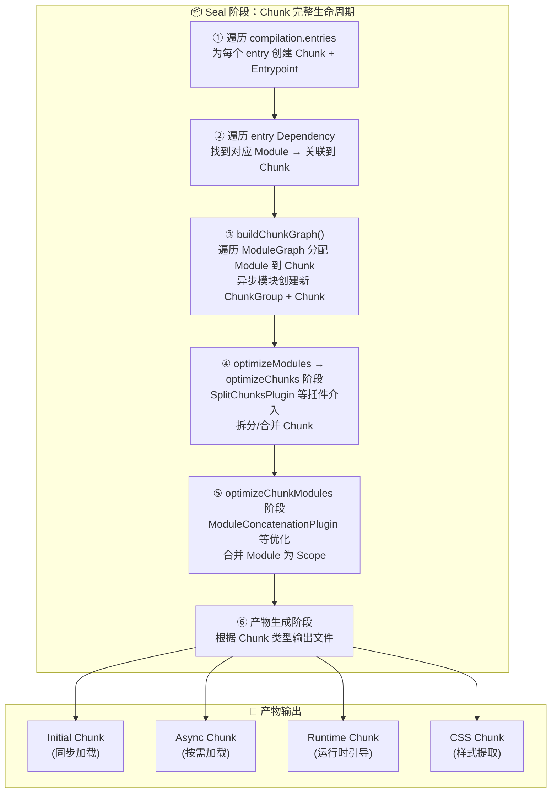
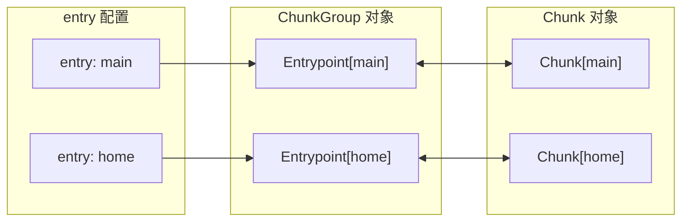
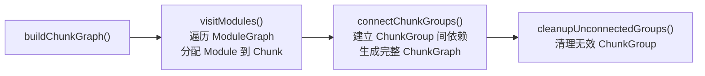
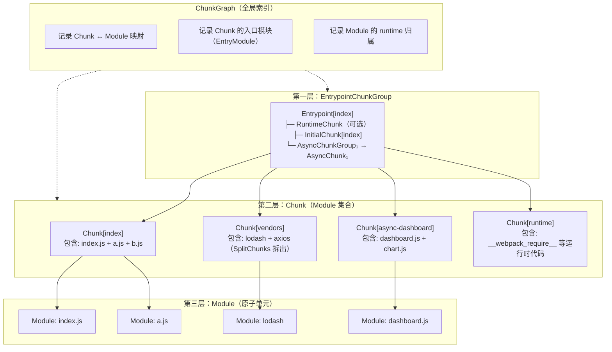
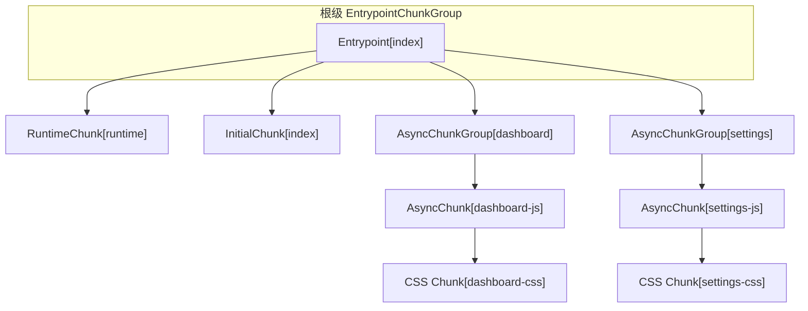
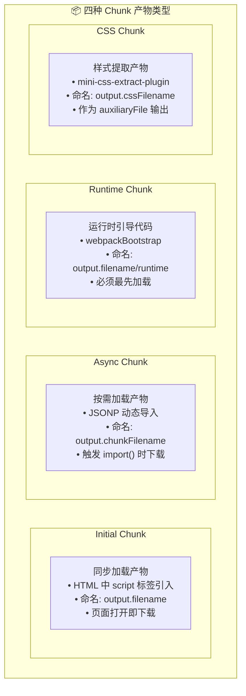
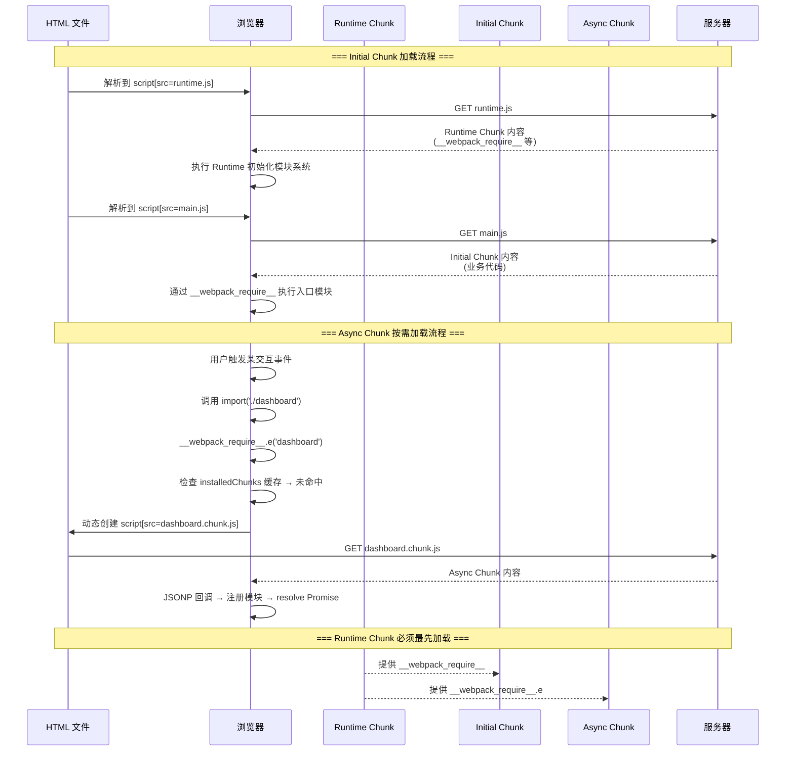
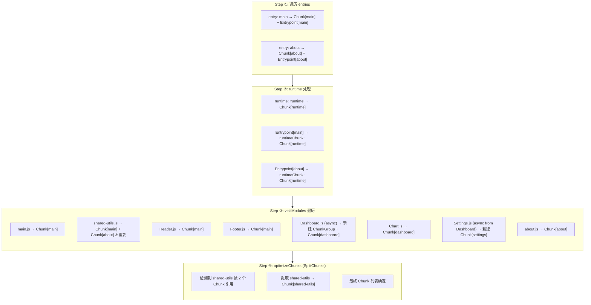
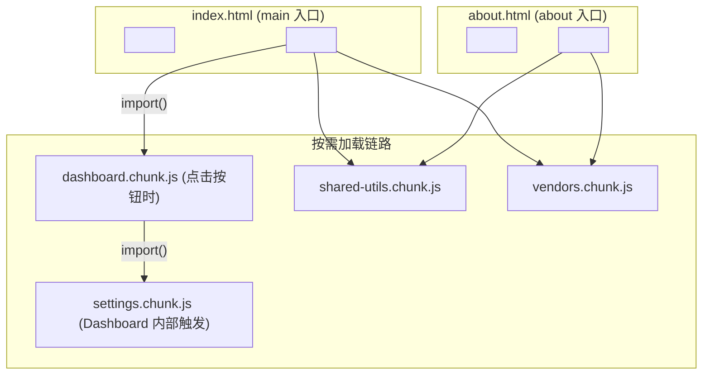

# Chunk：三种产物的打包逻辑

| 维度 | v1（原始版本） | v2（当前版本） |
|------|---------------|---------------|
| **Webpack 版本** | Webpack 5.x 通用 | Webpack **5.107** 精确对齐 |
| **seal 阶段流程** | 4 步概览（创建 Entry → visitModules → connectChunkGroups → cleanup） | **5 步完整生命周期**（Entry 创建 → Module 遍历关联 → ChunkGraph 构建 → 优化阶段 → 产物生成） |
| **图表** | 外链图片（4 张） | **3 张 Mermaid 原生流程图**（可交互渲染） |
| **Chunk 概念** | Entry/Async/Runtime 三种 Chunk | 扩展为 **Initial/Async/Runtime + CSS Chunk** 四种产物 |
| **示例深度** | 单 entry 基础示例 | **多 entry + code splitting 完整推演** |
| **新增内容** | - | output.chunkFilename / cssFilename、deterministic IDs、experiments.css、Chunk.files 与 auxiliaryFiles 区分 |
| **优化阶段** | 仅提及 SplitChunksPlugin | 详细展开 **optimizeModules → optimizeChunks → optimizeCodeGeneration** 三层优化链路 |
| **代码引用** | Webpack 早期源码片段 | 对齐 **webpack@5.107** 最新源码路径与逻辑 |

---


在上一篇文章《Dependency Graph：如何管理模块间依赖？》中，我们已经详细讲解了「构建」阶段如何从 Entry 开始逐步递归读入、解析模块内容，并最终构建出模块依赖关系图 —— `ModuleGraph` 对象。本文我们继续往下，讲解在接下来的「封装」（seal）阶段，如何根据 `ModuleGraph` 内容组织 **Chunk**，并进一步构建出 `ChunkGroup`、`ChunkGraph` 依赖关系对象的**完整主流程**。

> **核心认知先行**：**Chunk 是产物的组织单位**。一个 Chunk 最终对应一个或多个输出文件（JS/CSS/资源文件），而 Chunk 本身是若干 Module 的集合容器。理解 Chunk，就是理解 Webpack 如何决定「哪些模块被打包到哪个文件」。

主流程之外，我们还会详细拆解几个关键概念：

- `Chunk`、`ChunkGroup`、`ChunkGraph` 对象分别是什么？互相之间存在怎样的层级与交互关系？
- Webpack 内置的三种（实际四种）分包规则及其产物特征。
- seal 阶段完整的 Chunk 生命周期：从创建到优化的全链路。
- `output.chunkFilename`、`deterministic module/chunk IDs` 等高级配置对产物的影响。

---

## 一、seal 阶段总览：Chunk 的完整生命周期

在《Init、Make、Seal：真正读懂 Webpack 核心流程》中，我们已经介绍了 Webpack 底层构建逻辑大体上可以划分为：「**初始化 → 构建 → 封装**」三个阶段：

```text
┌──────────┐    ┌──────────┐    ┌──────────┐
│   Init   │ → │   Make   │ → │   Seal   │
│ 初始化   │    │  构建    │    │  封装    │
└──────────┘    └──────────┘    └──────────┘
                 │                │
                 ▼                ▼
            ModuleGraph        ChunkGraph
           (模块依赖图)       (产物组织图)
```

其中：
- **Make（构建）阶段**：分析模块间的依赖关系，建立 `ModuleGraph`
- **Seal（封装）阶段**：根据 `ModuleGraph` 将模块分配进 `Chunk`，构建 `ChunkGraph`，经过一系列优化后最终产出文件

Seal 阶段是 Chunk 诞生的唯一场所。下面这张 Mermaid 图完整展示了 Chunk 从创建到最终产出的全过程：



下面我们对每个步骤逐一深入剖析。

---

## 二、步骤详解：Chunk 的创建、关联与优化

### 步骤 ①：遍历 entries —— 为每个 entry 创建 Chunk 与 Entrypoint

调用 `compilation.seal()` 后，Webpack 首先遍历 `entry` 配置项，为每一个入口执行以下操作：

```js
// webpack@5.107 lib/Compilation.js — seal() 方法关键片段
class Compilation {
  seal(callback) {
    const chunkGraphInit = new Map();

    // 遍历入口模块列表
    for (const [name, { dependencies, includeDependencies, options }] of this.entries) {

      // 1. 为每一个 entry 创建对应的 Chunk 对象
      const chunk = this.addChunk(name);

      // 2. 为每一个 entry 创建对应的 Entrypoint 对象（Entrypoint 继承自 ChunkGroup）
      const entrypoint = new Entrypoint(options);
      entrypoint.setEntrypointChunk(chunk);

      // 3. 关联 Chunk 与 ChunkGroup（双向绑定）
      if (entrypoint.pushChunk(chunk)) {
        chunk.addGroup(entrypoint);
      }

      // 4. 遍历 entry 的 Dependency 列表
      for (const dep of [...this.globalEntry.dependencies, ...dependencies]) {
        // 记录入口依赖的来源信息
        entrypoint.addOrigin(null, { name }, dep.request);

        // 通过 moduleGraph 找到 dependency 对应的 Module
        const module = this.moduleGraph.getModule(dep);
        if (module) {
          // 在 ChunkGraph 中记录「入口模块 ↔ Chunk」的映射关系
          this.chunkGraph.connectChunkAndEntryModule(chunk, module, entrypoint);
        }
      }

      // 5. 若 entry 配置了 runtime 属性，为其创建独立的 Runtime Chunk
      if (options.runtime) {
        const runtimeChunk = this.addChunk(options.runtime);
        entrypoint.setRuntimeChunk(runtimeChunk);
      }
    }

    // 调用 buildChunkGraph，进入下一步骤
    buildChunkGraph(this, chunkGraphInit);
  }
}
```

**这一步完成后形成的数据结构**：



> **关键点**：此时 Chunk 中只有入口模块本身，尚未包含其依赖的子模块。

### 步骤 ②：处理 Runtime Chunk 提取

如果 entry 配置中声明了 `runtime` 属性，Webpack 会在此阶段为运行时代码创建独立 Chunk：

```js
// 示例配置
module.exports = {
  entry: {
    index: { import: "./src/index", runtime: "solid-runtime" },
    home: { import: "./src/home", runtime: "solid-runtime" },
  },
};
```

当多个 entry 共享同一个 `runtime` 名称时，它们的运行时代码会被**合并到同一个 Runtime Chunk** 中，避免重复打包。这是 Webpack 5 推荐的多 entry 运行时优化方案。

### 步骤 ③：buildChunkGraph() —— 构建完整的 Chunk 图结构

这是 seal 阶段最核心的方法，位于 [lib/buildChunkGraph.js](https://github.com/webpack/webpack/blob/v5.107.0/lib/buildChunkGraph.js)。它内部依次调用三个关键函数：



#### ③-a：visitModules() —— 遍历 ModuleGraph，分配 Module

`visitModules` 函数递归遍历 `ModuleGraph` 中的每个 Module，按照以下规则将其分配到 Chunk：

| Module 类型 | 分配行为 |
|------------|---------|
| 同步依赖的 Module | 加入**当前 Chunk**（即所属 entry 的 Chunk） |
| 异步依赖的 Module（`import()` / `require.ensure`） | **创建新的 ChunkGroup + Chunk**，将该 Module 及其同步子模块加入新 Chunk |

伪代码逻辑如下：

```js
// lib/buildChunkGraph.js — visitModules 核心逻辑（简化）
function visitModules(compilation, chunkGraph) {
  for (const module of compilation.modules) {
    for (const connection of chunkGraph.getModuleConnections(module)) {
      const targetModule = connection.module;

      if (connection.isTargetActive()) {
        if (connection.isAsyncDependency()) {
          // 异步依赖 → 创建新 ChunkGroup 和 Chunk
          const asyncChunkGroup = new ChunkGroup();
          const asyncChunk = compilation.addChunk();
          connectChunkGroupAndChunk(asyncChunkGroup, asyncChunk);
          // 将异步模块及其同步子模块加入新 Chunk
          chunkGraph.connectChunkAndModule(asyncChunk, targetModule);
          // 建立 ChunkGroup 间的父子关系
          currentChunkGroup.addChild(asyncChunkGroup);
          asyncChunkGroup.addParent(currentChunkGroup);
        } else {
          // 同步依赖 → 直接加入当前 Chunk
          chunkGraph.connectChunkAndModule(currentChunk, targetModule);
        }
      }
    }
  }
}
```

#### ③-b：connectChunkGroups() —— 建立 ChunkGroup 依赖关系

此方法将上一步产生的 ChunkGroup 之间的父子关系固化到 `ChunkGraph` 数据结构中，形成完整的依赖拓扑。

#### ③-c：cleanupUnconnectedGroups() —— 清理无效节点

移除没有任何 Module 引用的孤立 ChunkGroup，纯性能优化。

### 步骤 ④：optimizeModules → optimizeChunks —— SplitChunksPlugin 等优化插件介入

`buildChunkGraph` 完成后，Chunk 的初始结构已经确定。接下来进入**优化阶段**，各类插件可以修改 Chunk 结构：

```js
// lib/Compilation.js — seal() 中的优化钩子调用顺序
seal(callback) {
  // ... buildChunkGraph 完成 ...

  // ① Module 级别优化
  this.hooks.optimizeModules.call(this.modules);
  // 此时插件可以对 Module 集合做整体调整

  // ② Chunk 级别优化（SplitChunksPlugin 在此处介入）
  this.hooks.optimizeChunks.call(this.chunks, this.chunkGroups);
  // 此时 SplitChunksPlugin 可以：拆分公共模块为新 Chunk、合并小 Chunk 等

  // ③ 代码生成优化
  this.hooks.optimizeCodeGeneration.call(this.modules);

  // ... optimizeTree / optimizeChunkModules 等后续流程 ...
}
```

> **重点理解**：`SplitChunksPlugin` 并不参与 Chunk 的初始创建，它是在 `buildChunkGraph` 完成后，通过 `optimizeChunks` 钩子**二次重组** Chunk 结构的。这意味着内置的三种 Chunk 规则（Entry/Async/Runtime）是基础，SplitChunks 是在此基础上进行的**启发式优化**。

### 步骤 ⑤：optimizeChunkModules —— Module Concatenation 等优化

Module 级别的优化中，最典型的是 **ModuleConcatenation（作用域提升）**：将多个 IIFE 包裹的 Module 合并到同一个函数作用域中，减少运行时的模块查找开销。注意 `ModuleConcatenationPlugin` 实际注册在 `compilation.hooks.optimizeChunkModules` 钩子上（经 `optimizeTree` 之后触发）。

### 步骤 ⑥：产物生成 —— 根据 Chunk 类型输出文件

最终，Webpack 遍历所有 Chunk，根据其类型和配置的 filename 模板，将 Module 内容序列化为文件输出：

```js
// 每个 Chunk 可能产出：
// - chunk.files:         主产物文件列表（如 .js）
// - chunk.auxiliaryFiles: 辅助产物文件列表（如 .map、CSS 文件等）
```

---

## 三、Chunk vs ChunkGroup vs ChunkGraph —— 三者关系全景

上述构建过程涉及三个核心数据对象，它们形成了清晰的层级关系：



### 各对象职责一览

| 对象 | 职责 | 关键属性 |
|------|------|---------|
| **Chunk** | Module 的集合容器，产物的直接来源 | `id`, `name`, `files`, `auxiliaryFiles`, `entryModule` |
| **ChunkGroup** | Chunk 的分组管理器，维护加载顺序和父子关系 | `_chunks[]`, `_parents[]`, `_children[]`, `origins[]` |
| **Entrypoint** | 继承自 ChunkGroup，代表一个入口点 | 新增 `runtimeChunk` 属性 |
| **ChunkGraph** | 全局索引，记录 Chunk/Module/Entrypoint 间所有映射关系 | `getChunkModules()`, `getModuleChunks()`, `connectChunkAndEntryModule()` |

### ChunkGroup 的层级关系细节



**关键理解**：
- `Entrypoint` 是 ChunkGroup 的子类，代表一个入口点
- 一个 Entrypoint 可以包含**多个 Chunk**（Runtime + Initial + Async children）
- Async ChunkGroup 形成了**懒加载链路**：父 ChunkGroup 加载完成后再按需加载子 ChunkGroup
- CSS Chunk 作为 Async Chunk 的辅助产物（auxiliaryFile）存在

---

## 四、四种产物类型的详细解析

Webpack 5 最终会产出**四类**不同性质的 Chunk 文件：



### 4.1 Initial Chunk（入口 Chunk）

**定义**：对应 `entry` 配置的同步加载产物，通过 HTML 中的 `<script>` 标签直接引入。

**命名规则**：由 `output.filename` 控制

```js
// webpack.config.js
module.exports = {
  output: {
    filename: '[name].[contenthash:8].js',  // 主 Chunk 命名
    // 例如: main.a3b2c1d4.js
  },
  entry: {
    main: './src/main.js',
  },
};
```

**特征**：
- 包含入口模块及其所有**同步依赖**
- 页面加载时必须立即下载（除非使用 `<script defer/async>`）
- 可被浏览器缓存（配合 contenthash）

### 4.2 Async Chunk（异步 Chunk）

**定义**：由动态 `import()` 或 `require.ensure()` 触发的按需加载产物。

**命名规则**：由 `output.chunkFilename` 控制（注意不是 `filename`！）

```js
module.exports = {
  output: {
    filename: '[name].[contenthash:8].js',
    chunkFilename: '[name].[contenthash:8].chunk.js',  // Async Chunk 命名
    // 例如: src_dashboard_js.7e8f9g0h.chunk.js
  },
};
```

> **常见坑点**：很多开发者只配了 `filename` 而忘了 `chunkFilename`，导致 Async Chunk 使用默认的 `[id].js` 命名，不利于长期缓存。

**加载方式**：通过 JSONP（JSON with Padding）机制动态插入 `<script>` 标签加载：

```js
// Webpack 生成的动态加载代码（简化）
__webpack_require__.e("src_dashboard_js")  // Promise
  .then(__webpack_require__.bind(__webpack_require__, "src_dashboard_js"))
  .then(module => { /* 使用 module */ });
```

**`__webpack_require__.e` 的内部逻辑**：
1. 检查该 Chunk 是否已加载（通过 installedChunks 缓存）
2. 若未加载，创建 `<script>` 标签，`src` 指向 chunkFilename 生成的 URL
3. 通过 JSONP 回调标记 `installedChunks` 已加载，并执行模块工厂注册模块
4. resolve Promise

### 4.3 Runtime Chunk（运行时 Chunk）

**定义**：Webpack 注入的引导代码，负责：
- 实现 `__webpack_require__` 模块系统
- 管理 Module 缓存 (`installedModules`)
- 处理 HMR（热更新）连接
- 处理异步加载 (`__webpack_require__.e`)
- 处理 Module Federation 远程模块解析

**提取方式**：

```js
// 方式一：entry.runtime 配置（推荐用于多 entry 共享 runtime）
module.exports = {
  entry: {
    main: { import: './src/main.js', runtime: 'runtime' },
    about: { import: './src/about.js', runtime: 'runtime' },
  },
};

// 方式二：runtimeChunk 配置（更简洁）
module.exports = {
  optimization: {
    runtimeChunk: {
      name: 'runtime',  // 或 true（自动命名）
    },
  },
};

// 方式三：单 name 字符串（等同于 { name: 'xxx' }）
module.exports = {
  optimization: {
    runtimeChunk: 'single',  // 所有 entry 共享一个 runtime
  },
};
```

**三种 runtimeChunk 值对比**：

| 值 | 行为 | 适用场景 |
|----|------|---------|
| `false` / 不配置 | Runtime 内嵌在每个 Initial Chunk 中 | SPA 单页应用 |
| `true` / `'single'` | 所有 entry 共享一个 Runtime Chunk | 多 entry 应用 |
| `'multiple'` | 每个 entry 独立的 Runtime Chunk | 微前端 / 独立部署场景 |
| `{ name: 'xxx' }` | 自定义名称，共享同一个 Runtime | 需要精确控制名称时 |

### 4.4 CSS Chunk（样式 Chunk）

**定义**：通过 `mini-css-extract-plugin`（或 Webpack 5 的 `experiments.css`）提取的 CSS 产物。

**命名规则**：

```js
const MiniCssExtractPlugin = require('mini-css-extract-plugin');

module.exports = {
  plugins: [
    new MiniCssExtractPlugin({
      filename: '[name].[contenthash:8].css',       // Initial CSS
      chunkFilename: '[id].[contenthash:8].chunk.css', // Async CSS
    }),
  ],
};
```

> **Webpack 5 experiments.css**：Webpack 5 实验性地支持原生 CSS 处理（无需额外 Loader），可通过 `experiments.css: true` 启用，此时 CSS 模块会被视为一等公民 Module，最终以 CSS Chunk 形式输出。

**CSS Chunk 的特殊之处**：
- 它不是 Chunk 的**主产物**（`files`），而是**辅助产物**（`auxiliaryFiles`）
- 这意味着一个 JS Chunk 可以同时关联一个 CSS Chunk
- CSS Chunk 的加载时机由 JS Chunk 决定（通过 `link` 标签注入）

---

## 五、三种产物类型的输出流程对比

下面这张图清晰展示了三类 JS 产物从 Chunk 到最终加载的完整链路差异：



---

## 六、完整示例推演：多 Entry + Code Splitting

下面我们用一个完整的例子，从头到尾推演 Chunk 的创建过程。

### 6.1 项目结构与配置

```text
src/
├── main.js              # 入口 A
├── about.js             # 入口 B
├── shared-utils.js      # 公共工具（被两个入口共同依赖）
├── components/
│   ├── Header.js        # main.js 同步依赖
│   ├── Footer.js        # main.js 同步依赖
│   ├── Chart.js         # Dashboard.js 同步依赖
│   └── Dashboard.js     # main.js 异步依赖
├── pages/
│   └── Settings.js      # Dashboard.js 异步依赖
```

```js
// main.js
import './shared-utils.js';
import Header from './components/Header.js';
import Footer from './components/Footer.js';

Header.render();
Footer.render();

document.getElementById('btn').addEventListener('click', () => {
  import(/* webpackChunkName: 'dashboard' */ './components/Dashboard.js')
    .then(({ default: Dashboard }) => Dashboard.render());
});
```

```js
// about.js
import './shared-utils.js';

console.log('About page');
```

```js
// components/Dashboard.js
import Chart from './Chart.js';  // 同步依赖
import(/* webpackChunkName: 'settings' */ '../pages/Settings.js');  // 异步嵌套

export default { render: () => console.log('Dashboard') };
```

```js
// webpack.config.js
module.exports = {
  mode: 'production',
  entry: {
    main: { import: './src/main.js', runtime: 'runtime' },
    about: { import: './src/about.js', runtime: 'runtime' },
  },
  output: {
    filename: '[name].[contenthash:8].js',
    chunkFilename: '[name].[contenthash:8].chunk.js',
    clean: true,
  },
  optimization: {
    splitChunks: {
      chunks: 'all',
      cacheGroups: {
        vendor: {
          test: /[\\/]node_modules[\\/]/,
          name: 'vendors',
          chunks: 'all',
        },
      },
    },
  },
};
```

### 6.2 Chunk 创建推演



> 📌 简化说明：实际 `SplitChunksPlugin` 还要求候选模块满足 `minSize`、`minChunks`、`maxAsyncRequests` 等阈值（production 默认 `minSize: 20000`），小模块不会被提取；此处推演省略了阈值判断。

### 6.3 最终产物清单

经过完整流程后，Webpack 将输出以下文件：

| 文件名 | 类型 | 来源 | 说明 |
|--------|------|------|------|
| `runtime.xxx.js` | Runtime Chunk | 自动生成 | 运行时引导代码，main 和 about 共享 |
| `main.xxx.js` | Initial Chunk | entry.main | 入口 main 的业务代码 |
| `about.xxx.js` | Initial Chunk | entry.about | 入口 about 的业务代码 |
| `dashboard.xxx.chunk.js` | Async Chunk | `import(Dashboard)` | 按需加载的仪表盘模块 |
| `settings.xxx.chunk.js` | Async Chunk | `import(Settings)` (嵌套异步) | 设置页面（Dashboard 的子异步) |
| `shared-utils.xxx.chunk.js` | Initial Chunk（splitChunks 提取） | SplitChunks 提取 | 被抽取的公共模块（示意，实际需满足 minSize 等阈值） |
| `vendors.xxx.chunk.js` | Initial Chunk（splitChunks 提取） | SplitChunks 提取 | node_modules 第三方库（如有） |

### 6.4 ChunkGroup 依赖关系图



---

## 七、Deterministic Module/Chunk IDs —— 保证长期缓存稳定

Webpack 5 引入了 **Deterministic（确定性）ID 算法**，解决了长期缓存的一个核心痛点：**新增/删除模块不应影响其他模块的 ID**。

### 问题背景

在 Webpack 4 及之前，默认使用数字自增 ID（0, 1, 2, ...）。问题在于：

```text
构建第 1 次:  main(0), utils(1), dashboard(2)
构建第 2 次:  main(0), utils(1), new-feature(2), dashboard(3) ← dashboard ID 变了!
```

一旦某个 Module 的 ID 变化，依赖它的 Chunk 的 hash 也会变化，导致**缓存失效范围扩大**。

### Deterministic ID 算法

Webpack 5 在 production 模式下默认使用 `deterministic` 模式：

```js
module.exports = {
  optimization: {
    moduleIds: 'deterministic',  // 默认值（production 模式下）
    chunkIds: 'deterministic',   // 默认值（production 模式下）
  },
};
```

**工作原理**：
- 基于 Module/Chunk 的**内容哈希**和**路径信息**生成短 hash ID（通常 3-4 位字符）
- 相同内容的 Module 在不同构建间获得相同 ID
- 新增 Module 不会改变已有 Module 的 ID

```text
构建第 1 次:  main(a1b), utils(c2d), dashboard(e3f)
构建第 2 次:  main(a1b), utils(c2d), new-feature(g4h), dashboard(e3f) ← dashboard ID 不变 ✓
```

### ID 策略选项

| 值 | 产物大小 | 长期缓存 | 适用场景 |
|----|---------|---------|---------|
| `'natural'` | 最小 | ❌ 差 | 开发模式 |
| `'named'` | 大（路径名可读） | ✅ 中 | 开发调试 |
| `'deterministic'` | 小 | ✅✅ 最佳 | **生产环境推荐** |
| `'size'` | 最小 | ✅ 中 | 极致体积优化 |

---

## 八、output 配置对 Chunk 命名的完整影响

### 8.1 filename vs chunkFilename

```js
module.exports = {
  output: {
    path: path.resolve(__dirname, 'dist'),

    // 控制 Initial Chunk + Runtime Chunk 的命名
    filename: (pathData) => {
      const isRuntime = pathData.chunk.name === 'runtime';
      return isRuntime
        ? 'runtime.[fullhash:8].js'
        : '[name].[contenthash:8].js';
    },

    // 控制 Async Chunk 的命名
    chunkFilename: '[name].[contenthash:8].lazy.js',

    // Webpack 5: CSS 文件命名（experiments.css 启用时）
    // cssFilename: '[name].[contenthash:8].css',
    // cssChunkFilename: '[id].[contenthash:8].css',

    // 自动推断 publicPath（Webpack 5 特性）
    // auto: true,
  },
};
```

### 8.2 可用的占位符

| 占位符 | 说明 | 示例 |
|--------|------|------|
| `[name]` | Chunk 名称 | `main`, `dashboard` |
| `[id]` | Chunk ID（deterministic hash） | `a1b` |
| `[contenthash:8]` | Chunk 内容哈希（前 8 位） | `e3f7a2b1` |
| `[fullhash:8]` | 整次构建的完整哈希 | `c4d8f1a2` |
| `[ext]` | 文件扩展名 | `js` |
| `[query]` | 查询参数 | （URL 参数） |

---

## 九、默认分包规则的问题与演进

### 9.1 核心问题：模块重复

默认分包规则最大的问题是**无法解决跨 Chunk 的模块重复**：

```text
Chunk[main]  ──→ shared-utils.js ✓
Chunk[about] ──→ shared-utils.js ✓  ← 重复打包！
```

在没有 `splitChunks` 的情况下，Webpack 只是将 Module 机械地分配到各个 Chunk，不做去重处理。

### 9.2 历史演进

| 版本 | 方案 | 问题 |
|------|------|------|
| Webpack 1-2 | 无解决方案 | 模块完全重复 |
| Webpack 3 | `CommonsChunkPlugin` | 基于简单父子链，容易误判父子关系，反而可能恶化性能 |
| Webpack 4+ | `SplitChunksPlugin` + `ChunkGroup` | **启发式算法**，基于图结构智能分析，支持多维度策略 |
| Webpack 5 | 优化 `SplitChunks` + `deterministic IDs` | 更稳定的长期缓存 + 更细粒度的控制 |

### 9.3 为什么 CommonsChunkPlugin 失败了？

`CommonsChunkPlugin` 的本质缺陷在于它基于 **Chunk 之间简单的线性父子关系** 来提取公共模块。但实际的依赖关系是一个**有向无环图（DAG）**，而非线性链条：

```text
实际情况（DAG）:
    Chunk[main]
       │
       ├──→ Chunk[vendor]
       │
       └──→ Chunk[common]

    Chunk[about]
       │
       ├──→ Chunk[vendor]
       │
       └──→ Chunk[common]

CommonsChunkPlugin 错误地假设为线性关系:
    Chunk[common] → Chunk[vendor] → Chunk[main]
                                    → Chunk[about]
```

这种错误假设导致它无法正确判断提取出的公共 Chunk 应该作为**父 Chunk 还是子 Chunk**，某些场景下反而增加了请求次数。

Webpack 4 引入的 `ChunkGroup` 数据结构彻底解决了这个问题——它能够表达复杂的**多对多依赖关系**，配合 `SplitChunksPlugin` 的图论算法实现真正的智能分包。

---

## 十、总结

让我们用一张全景图回顾 Chunk 的完整世界：

```mermaid
mindmap
  root((Chunk 体系))
    生命周期
      seal() 入口
      Entry 创建
      Module 遍历关联
      buildChunkGraph
      优化阶段
      产物输出
    核心对象
      Chunk
        Module 集合
        files / auxiliaryFiles
      ChunkGroup
        Chunk 分组
        父子依赖
      Entrypoint
        入口组
        runtimeChunk
      ChunkGraph
        全局索引
        映射关系
    产物类型
      Initial Chunk
        同步加载
        output.filename
      Async Chunk
        按需加载
        output.chunkFilename
        JSONP
      Runtime Chunk
        运行时代码
        optimization.runtimeChunk
      CSS Chunk
        样式提取
        auxiliaryFile
    高级特性
      deterministic IDs
        长期缓存稳定
      SplitChunksPlugin
        启发式分包
      code splitting
        import()
        魔法注释
```

**核心要点回顾**：

1. **Chunk 是产物的组织单位**：一个 Chunk 是一组 Module 的集合，最终输出为一个或多个文件
2. **seal 阶段的五个关键步骤**：Entry 创建 → Module 关联 → ChunkGraph 构建 → 优化 → 产物输出
3. **ChunkGroup 表达了 Chunk 间的加载顺序和依赖关系**：Entrypoint → Initial/Async/Runtime Chunks
4. **四种产物类型各有不同的加载方式和命名规则**：Initial（同步）、Async（按需）、Runtime（引导）、CSS（辅助）
5. **SplitChunksPlugin 在优化阶段介入**，是对内置分包规则的二次重组，而非替代
6. **Deterministic IDs 保证长期缓存稳定性**，是生产环境的最佳实践

> 「封装」阶段最重要的目标始终是：**确定有多少个 Chunk，以及每一个 Chunk 中包含哪些 Module** —— 这些才是真正影响最终打包结果的关键因素。其它一切优化（压缩、Tree Shaking、SplitChunks）都是围绕这个目标服务的手段而已。

---

## 思考题

1. **Chunk 一定会且只会产生一个产物文件吗？为什么？** `mini-css-extract-plugin`、`file-loader` 这一类能写出额外文件的插件，底层是怎么实现的？（提示：关注 `chunk.auxiliaryFiles`）

2. **如果一个 Module 同时被一个 Initial Chunk 和一个 Async Chunk 引用，在默认分包规则和开启 `splitChunks.chunks: 'all'` 时，这个 Module 分别会如何处理？**

3. **`optimization.runtimeChunk: 'multiple'` 和 `runtimeChunk: 'single'` 在微前端场景下各有什么优劣？如何选择？**

4. **Deterministic ID 的长度（默认 3-4 位）是否可能发生碰撞？Webpack 如何处理潜在的 ID 冲突？**

---

> **参考源码路径（Webpack 5.107）**：
> - [`lib/Compilation.js`](https://github.com/webpack/webpack/blob/v5.107.0/lib/Compilation.js) — `seal()` 方法
> - [`lib/buildChunkGraph.js`](https://github.com/webpack/webpack/blob/v5.107.0/lib/buildChunkGraph.js) — ChunkGraph 构建核心
> - [`lib/Entrypoint.js`](https://github.com/webpack/webpack/blob/v5.107.0/lib/Entrypoint.js) — Entrypoint 类
> - [`lib/ChunkGroup.js`](https://github.com/webpack/webpack/blob/v5.107.0/lib/ChunkGroup.js) — ChunkGroup 类
> - [`lib/Chunk.js`](https://github.com/webpack/webpack/blob/v5.107.0/lib/Chunk.js) — Chunk 类
> - [`lib/ids/DeterministicModuleIdsPlugin.js`](https://github.com/webpack/webpack/blob/v5.107.0/lib/ids/DeterministicModuleIdsPlugin.js) — Deterministic ID 算法
