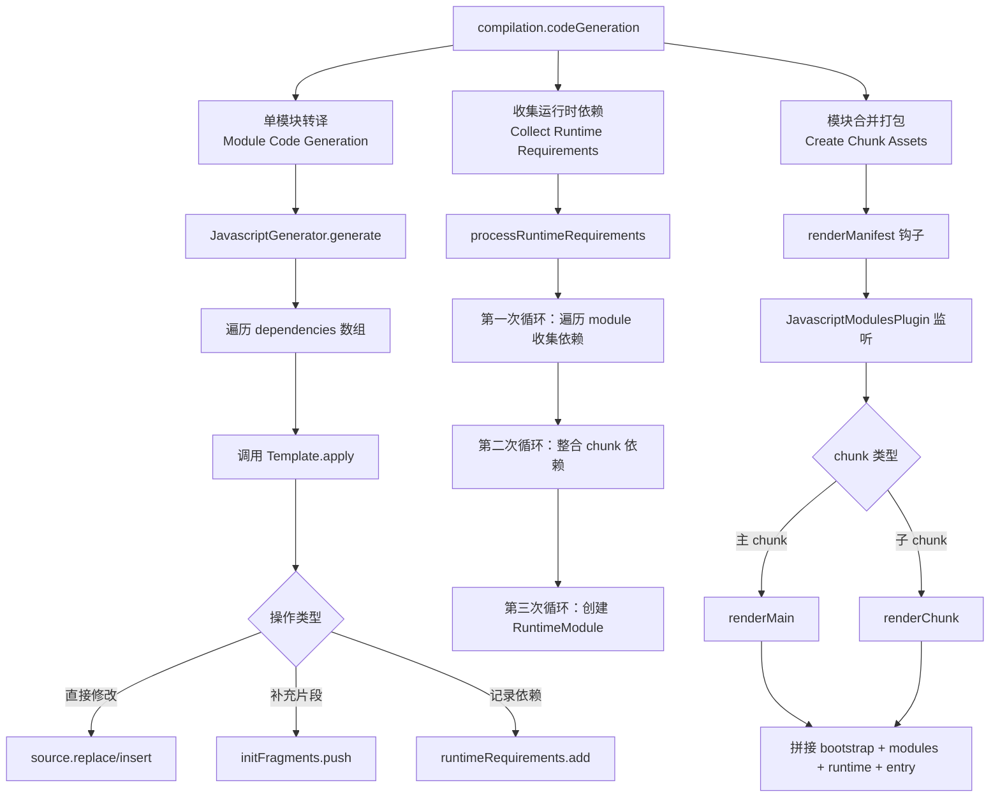
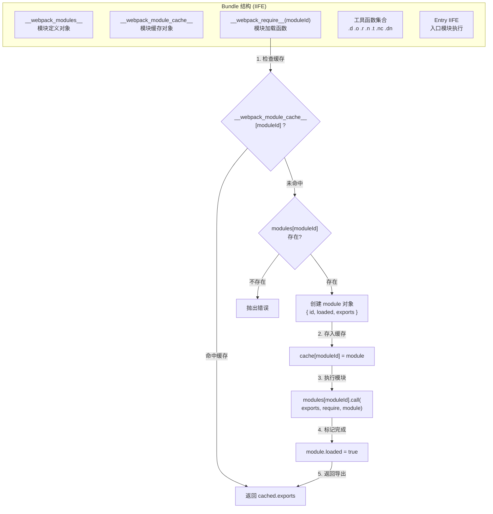
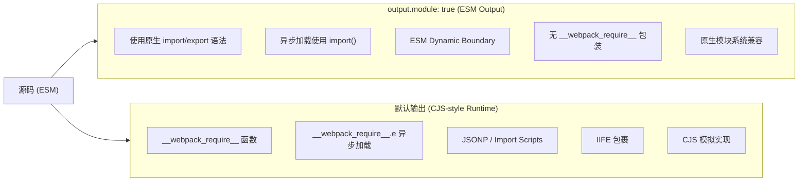
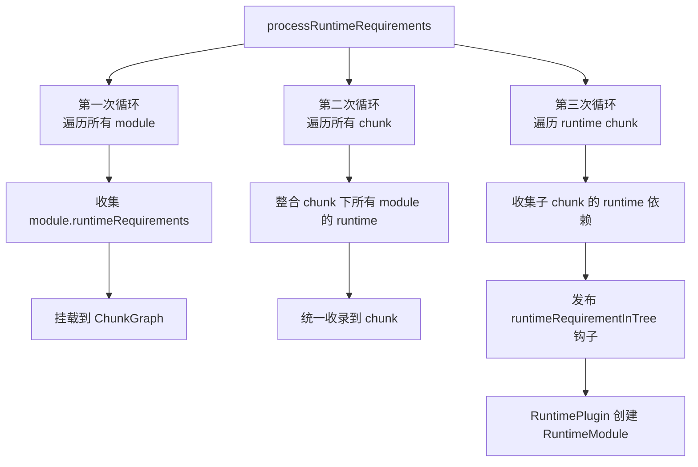
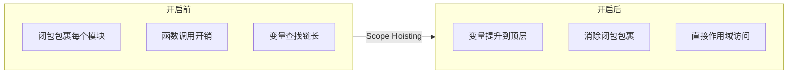

# Runtime：模块编译打包及运行时逻辑


## 📋 版本差异对照表

| 特性 | v1 (原始版) | v2 (当前版) |
|------|------------|------------|
| **基准版本** | Webpack 5.x (未明确) | **Webpack 5.107.0** |
| **运行时函数** | 基础介绍 | 完整 `__webpack_require__` 函数族详解 + Mermaid 流程图 |
| **ESM Output** | 未涉及 | 新增 `output.module: true` 时原生 ESM 运行时分析 |
| **RuntimeChunk** | 简要提及 | 三种提取策略（single/multiple/false）深度对比 |
| **异步加载** | JSONP 概述 | JSONP + Import Scripts 双模式 + ESM dynamic boundary |
| **Scope Hoisting** | 未详细展开 | 对运行时的性能影响及变量提升机制 |
| **可视化图表** | 截图为主 | **新增 2 个 Mermaid 流程图** |
| **新特性覆盖** | - | v5.107 `__webpack_require__.dn` 辅助函数 |

---

## 核心概念回顾

在前面章节中，我们已经介绍了 Webpack 从模块解析到 Chunk 封装的完整流程。构建过程会根据 `Module` 之间的引用关系构建 `ModuleGraph` 对象；接下来按照内置规则将 `Module` 组织进不同 `Chunk` 对象中，形成 `ChunkGraph` 关系图。

接下来，构建流程将来到最后一个重要步骤：**生成产物代码**。这个过程会将所有 `Module` 内容转换为适当的产物代码形态，并以 `Chunk` 为单位合并 `Module` 产物代码，之后根据 `Module` 中出现的特性依赖，补充相应运行时代码，最终构建出我们日常所见的 Webpack Bundle 代码文件。

## 什么是模块转译？

众所周知，Webpack 的打包功能并不是将原始文件代码"复制-粘贴"到产物文件那么简单。为了确保代码能在不同环境 —— 多种版本的浏览器、Node.js、Electron 等正常运行，构建时需要对模块源码适当做一些转换操作。

### 转译示例

假设有以下两个 JS 代码模块：

```js
// name.js
export default 'tecvan';

// index.js
import name from './name';
console.log(`hello ${name}`);
```

经过 Webpack 构建后生成的产物文件包含三块内容：

1. **`name.js` 模块对应的转译代码**：被包裹进 IIFE（立即执行函数）
2. **Webpack 按需注入的运行时代码**
3. **`index.js` 模块对应的 IIFE 转译代码**

编译前后代码功能逻辑相同，但表现形式发生了较大变化：

- 整个模块被包裹进 **IIFE** 中
- 添加 `__webpack_require__.r(__webpack_exports__)` 语句，用于适配 ESM 规范
- 源码中的 `import` 语句被转译为 `__webpack_require__` 函数调用
- 源码 `console` 语句所使用的 `name` 变量被转译为 `_name__WEBPACK_IMPORTED_MODULE_0__.default`
- 添加若干注释

这种代码转换功能具体是怎么实现的呢？让我们深入源码一探究竟。

## 模块转译主流程

在上一章《Chunk：三种产物的打包逻辑》中，我们已介绍 `compilation.seal` 函数内会调用 `buildChunkGraph` 生成 Chunk 依赖关系图。在此之后，`seal` 函数会触发一堆优化钩子，借助插件对 ChunkGraph 做优化操作，并在最后调用 [compilation.codeGeneration](https://github.com/webpack/webpack/blob/v5.107.0/lib/Compilation.js#L3160-L3162) 方法：

```js
// Webpack 5.107
// lib/Compilation.js
class Compilation {
  seal(callback) {
    // 初始化 ChunkGraph、ChunkGroup 对象
    for (const [name, { dependencies, includeDependencies, options }] of this.entries) {
      // ...
    }
    // 构建 ChunkGroup
    buildChunkGraph(this, chunkGraphInit);
    // 执行诸多优化钩子
    this.hooks.optimize.call();
    // ...

    this.hooks.optimizeTree.callAsync(this.chunks, this.modules, (err) => {
      // ...
      this.hooks.optimizeChunkModules.callAsync(this.chunks, this.modules, (err) => {
          // ...
          this.hooks.beforeCodeGeneration.call();
          // 开始生成最终产物代码
          this.codeGeneration(/* ... */);
        }
      );
    });
  }
}
```

`codeGeneration` 方法负责生成最终的资产代码，主要流程包含三个关键步骤：

### 流程概览图



#### 步骤一：单模块转译

这一步主要用于计算模块实际输出代码，遍历 `compilation.modules` 数组，调用 `module` 对象的 `codeGeneration` 方法，执行模块转译计算：

- [调用](https://github.com/webpack/webpack/blob/v5.107.0/lib/NormalModule.js#L1564) `JavascriptGenerator` 的 [generate](https://github.com/webpack/webpack/blob/v5.107.0/lib/javascript/JavascriptGenerator.js#L260) 方法
- [遍历](https://github.com/webpack/webpack/blob/v5.107.0/lib/javascript/JavascriptGenerator.js#L260) `module` 对象的 `dependencies` 与 `presentationalDependencies` 数组
- 执行每个数组项 `dependency` 对象对应的 `template.apply` 方法，方法中视情况可能产生三种副作用：
  - 直接修改模块 `source` 数据，如 [ConstDependency.Template](https://github.com/webpack/webpack/blob/v5.107.0/lib/dependencies/ConstDependency.js#L107)
  - 将结果记录到 `initFragments` 数组如 [HarmonyExportSpecifierDependency](https://github.com/webpack/webpack/blob/v5.107.0/lib/dependencies/HarmonyExportSpecifierDependency.js#L117-L126)
  - 将运行时依赖记录到 `runtimeRequirements` 数组如 [HarmonyImportDependency](https://github.com/webpack/webpack/blob/v5.107.0/lib/dependencies/HarmonyImportDependency.js#L189-L195)

#### 步骤二：收集运行时依赖

计算模块运行时，首先调用 `compilation.processRuntimeRequirements` 方法，将上一步生成的 `runtimeRequirements` 数组一一转换为 `RuntimeModule` 对象，并挂载到 `Chunk` 中。

#### 步骤三：模块合并

调用 `compilation.createChunkAssets` 方法，以 Chunk 为单位，将相应的所有 `module` 及 `runtimeModule` 按规则塞进「**产物框架**」中，最终合并输出成完整的 Bundle 文件。

---

## 单模块转译深度解析

「**模块转译**」操作从 `module.codeGeneration` 调用开始。这个过程首先调用 `JavascriptGenerator.generate` 函数，遍历模块的 `dependencies` 数组，依次调用依赖对象对应的 `Template` 子类 `apply` 方法更新模块内容。

### JavascriptGenerator.generate 核心伪代码

```js
// Webpack 5.107
// lib/javascript/JavascriptGenerator.js
class JavascriptGenerator {
    generate(module, generateContext) {
        // 先取出 module 的原始代码内容
        const source = new ReplaceSource(module.originalSource());
        const { dependencies, presentationalDependencies } = module;
        const initFragments = [];
        for (const dependency of [...dependencies, ...presentationalDependencies]) {
            // 找到 dependency 对应的 template
            const template = generateContext.dependencyTemplates.get(dependency.constructor);
            // 调用 template.apply，传入 source、initFragments
            template.apply(dependency, source, {initFragments})
        }
        // 遍历完毕后，调用 InitFragment.addToSource 合并 source 与 initFragments
        return InitFragment.addToSource(source, initFragments, generateContext);
    }
}

// Dependency 子类示例
class HarmonyImportSpecifierDependency extends Dependency {}

// Dependency 子类对应的 Template 定义
HarmonyImportSpecifierDependency.Template = class extends Template {
    apply(dep, source, templateContext) {
        const dep = /** @type {HarmonyImportSpecifierDependency} */ (dependency);
        const ids = dep.getIds(moduleGraph);
        const exportExpr = this._getCodeForIds(dep, source, templateContext, ids);
        const range = dep.range;
        if (dep.shorthand) {
            source.insert(range[1], `: ${exportExpr}`);
        } else {
            source.replace(range[0], range[1] - 1, exportExpr);
        }
    }
};
```

从上述伪代码可以看出，`JavascriptGenerator.generate` 函数的逻辑相对比较固化：

1. 初始化 `source`、`initFragments` 等变量
2. 遍历 `module` 对象的依赖数组，找到每个 `dependency` 对应的 `template` 对象，调用 `template.apply` 函数修改模块内容
3. 调用 `InitFragment.addToSource` 方法，合并 `source` 与 `initFragments` 数组，生成最终结果

**关键点**：`JavascriptGenerator.generate` 函数并不直接操作 `module` 源码，它仅仅提供一个执行框架，真正处理模块内容转译的逻辑都在各 `xxxDependencyTemplate` 对象的 `apply` 函数实现。

### Template 对象的三种影响方式

`Template` 对象会通过三种方法影响产物代码：

1. **直接操作 `source` 对象**：修改模块代码，该对象最初的内容等于模块的源码，经过多个 `Template.apply` 函数流转后逐渐被替换成新的代码形式
2. **操作 `initFragments` 数组**：在模块源码之外插入补充代码片段
3. **将运行时依赖记录到 `runtimeRequirements` 数组**

其中第 1、2 种操作所产生的副作用，最终都会被传入 `InitFragment.addToSource` 函数，合并成最终结果。

#### 通过 `source` 修改模块代码

[webpack-sources](https://github.com/webpack/webpack-sources) 是 Webpack 中用于编辑字符串的一套工具类库，它提供了一系列代码编辑方法：

- 字符串合并、替换、插入等
- 模块代码缓存、sourcemap 映射、hash 计算等

逻辑上，在启动模块代码生成流程时，Webpack 会先用模块原始内容初始化 `Source` 对象：

```js
const source = new ReplaceSource(module.originalSource());
```

之后，不同 `Dependency` 子类按序、按需更改 `source` 内容。例如对于下面的简单代码：

```js
import bar from "./bar";
console.log(bar);
```

会产生 `HarmonyImportSpecifierDependency` 与 `ConstDependency` 两个依赖对象，处理过程如下：

```js
// 源码：
import bar from "./bar";
console.log(bar);

// 第一步：HarmonyImportSpecifierDependency 替换导入变量名：
import bar from "./bar";
console.log(_bar__WEBPACK_IMPORTED_MODULE_1__["default"]);

// 第二步：ConstDependency 删除模块导入语句：
console.log(_bar__WEBPACK_IMPORTED_MODULE_1__["default"]);
```

可以看出，这部分逻辑的效果与 Babel 类似，会直接修改模块源码，实现语言层面的向下兼容。

#### `initFragments` 数组的作用

除直接操作 `source` 外，`Template.apply` 中还可能通过 `initFragments` 数组达成修改模块产物的效果。`initFragments` 数组项为 [InitFragment](https://github.com/webpack/webpack/blob/v5.107.0/lib/InitFragment.js) 子类实例，它们带有两个关键函数：`getContent`、`getEndContent`，分别用于获取代码片段的头尾部分。

例如 `HarmonyImportDependencyTemplate` 的 [apply](https://github.com/webpack/webpack/blob/v5.107.0/lib/dependencies/HarmonyImportDependency.js#L443) 函数中：

```js
HarmonyImportDependency.Template = class HarmonyImportDependencyTemplate extends (
  ModuleDependency.Template
) {
  apply(dependency, source, templateContext) {
    // ...
    templateContext.initFragments.push(
        new ConditionalInitFragment(
          importStatement[0] + importStatement[1],
          InitFragment.STAGE_HARMONY_IMPORTS,
          dep.sourceOrder,
          key,
          runtimeCondition
        )
      );
    //...
  }
 }
```

也就是根据模块需求，不断增加新的代码片段 `initFragments`。所有 `Dependency` 执行完毕后，接着就需要调用 `InitFragment.addToSource` 函数将两者合并为模块产物：

```js
// Webpack 5.107
// lib/InitFragment.js
class InitFragment {
  static addToSource(source, initFragments, generateContext) {
    // 先排好顺序
    const sortedFragments = initFragments
      .map(extractFragmentIndex)
      .sort(sortFragmentWithIndex);
    // ...

    const concatSource = new ConcatSource();
    const endContents = [];
    for (const fragment of sortedFragments) {
      // 合并 fragment.getContent 取出的片段内容
      concatSource.add(fragment.getContent(generateContext));
      const endContent = fragment.getEndContent(generateContext);
      if (endContent) {
        endContents.push(endContent);
      }
    }

    // 合并 source
    concatSource.add(source);
    // 合并 fragment.getEndContent 取出的片段内容
    for (const content of endContents.reverse()) {
      concatSource.add(content);
    }
    return concatSource;
  }
}
```

`addToSource` 函数的逻辑：

1. 遍历 `initFragments` 数组，按顺序合并 `fragment.getContent()` 的产物
2. 合并 `source` 对象
3. 遍历 `initFragments` 数组，按顺序合并 `fragment.getEndContent()` 的产物

所以，模块代码合并操作主要就是用 `initFragments` 数组一层一层包裹住模块代码 `source`，而两者都在 `Template.apply` 层面维护。还是上面那个简单例子，经过这段 `Template` 处理后，最终转化为：

```js
// 最终产物：
/* harmony import */ var _bar__WEBPACK_IMPORTED_MODULE_1__ = __webpack_require__(/*! ./bar */ "./src/bar.js");
console.log(_bar__WEBPACK_IMPORTED_MODULE_1__["default"]);
```

### 自定义 Template.apply 示例

为了加深理解，接下来我们尝试开发一个简单的 Banner 插件：实现在每个模块前自动插入一段字符串：

```js
const { Dependency, Template } = require("webpack");

class DemoDependency extends Dependency {
  constructor() {
    super();
  }
}

DemoDependency.Template = class DemoDependencyTemplate extends Template {
  apply(dependency, source) {
    const today = new Date().toLocaleDateString();
    source.insert(0, `/* Author: Tecvan */
/* Date: ${today} */
`);
  }
};

module.exports = class DemoPlugin {
  apply(compiler) {
    compiler.hooks.thisCompilation.tap("DemoPlugin", (compilation) => {
      compilation.dependencyTemplates.set(
        DemoDependency,
        new DemoDependency.Template()
      );
      compilation.hooks.succeedModule.tap("DemoPlugin", (module) => {
        module.addDependency(new DemoDependency());
      });
    });
  }
};
```

示例插件的关键步骤：

1. 编写 `DemoDependency` 与 `DemoDependencyTemplate` 类，其中 `DemoDependencyTemplate` 在其 `apply` 中调用 `source.insert` 插入字符串
2. 使用 `compilation.dependencyTemplates` 注册映射关系
3. 使用 `thisCompilation` 钩子取得 `compilation` 对象
4. 使用 `succeedModule` 钩子订阅模块构建完毕事件，并调用 `module.addDependency` 方法添加依赖

---

## __webpack_require__ 运行时函数体系详解

为了正常运行业务项目，Webpack 需要将开发者编写的业务代码以及支撑这些业务代码的 **运行时** 一并打包到产物中。以建筑作类比的话，业务代码相当于砖瓦水泥，是看得见摸得着能直接感知的逻辑；运行时相当于掩埋在砖瓦之下的钢筋地基。

大多数 Webpack 特性都需要特定运行时才能跑起来，包括：异步加载、HMR、WASM、Module Federation 等。即使没有用到这些特性，仅仅是最简单的模块导入导出，也需要生成若干模拟 CommonJS 模块化方案的运行时代码。

### __webpack_require__ 执行流程图



### 核心运行时函数详解

#### 1. __webpack_module_cache__ 缓存对象

```js
var __webpack_module_cache__ = {};
```

用于存储已被引用过的模块，避免重复执行。

#### 2. __webpack_require__(moduleId) 模块加载函数

```js
function __webpack_require__(moduleId) {
  // 检查缓存
  var cachedModule = __webpack_module_cache__[moduleId];
  if (cachedModule !== undefined) {
    return cachedModule.exports;
  }

  // 创建新模块并存入缓存
  var module = __webpack_module_cache__[moduleId] = {
    id: moduleId,
    loaded: false,
    exports: {}
  };

  // 执行模块函数
  __webpack_modules__[moduleId](module.exports,%20__webpack_require__,%20module);

  // 标记加载完成
  module.loaded = true;

  // 返回导出对象
  return module.exports;
}
```

#### 3. __webpack_require__.d (define property) — ESM 导出辅助

```js
__webpack_require__.d = (exports, definition) => {
  for (var key in definition) {
    if (__webpack_require__.o(definition, key) &&
        !__webpack_require__.o(exports, key)) {
      Object.defineProperty(exports, key, {
        enumerable: true,
        get: definition[key]
      });
    }
  }
};
```

用于将具名导出以 getter 形式挂载到 `exports` 对象上，实现 ESM 的 **live binding**（绑定导出）特性。

#### 4. __webpack_require__.o (object property) — 属性检查

```js
__webpack_require__.o = (obj, prop) =>
  Object.prototype.hasOwnProperty.call(obj, prop);
```

简洁的属性存在性检查工具函数。

#### 5. __webpack_require__.n (default export) — 默认导出包装

```js
__webpack_require__.n = (module) => {
  var getter = module && module.__esModule
    ? () => module['default']
    : () => module;
  __webpack_require__.d(getter, { a: getter });
  return getter;
};
```

统一处理 ESM 和 CJS 模块的默认导出获取方式。

#### 6. __webpack_require__.r (export symbol) — ESM 标识标记

```js
__webpack_require__.r = (exports) => {
  if (typeof Symbol !== 'undefined' && Symbol.toStringTag) {
    Object.defineProperty(exports, Symbol.toStringTag, {
      value: 'Module'
    });
  }
  Object.defineProperty(exports, '__esModule', {
    value: true
  });
};
```

标记模块为 ESM 类型，设置 `__esModule` 标志和 `Symbol.toStringTag`。

#### 7. __webpack_require__.t (create namespace object) — 命名空间创建

```js
__webpack_require__.t = function (value, mode) {
  // this(value) 即 __webpack_require__(value)，按需加载模块
  if (mode & 1) value = this(value);
  if (mode & 8) return value;
  if ((mode & 4) && typeof value === 'object' && value && value.__esModule)
    return value;
  var ns = Object.create(null);
  __webpack_require__.r(ns);
  Object.defineProperty(ns, 'default', {
    enumerable: true,
    value: value
  });
  if (mode & 2 && typeof value !== 'string')
    for (var key in value)
      __webpack_require__.d(ns, function (key) { return value[key]; }.bind(null, key));
  return ns;
};
```

用于创建命名空间对象，支持不同的导出模式组合。注意这里必须使用普通 `function`（而非箭头函数）：`mode & 1` 分支依赖 `this` 指向 `__webpack_require__`；`for...in` 循环中用 `bind` 固定 `key` 以避免闭包共享循环变量。

#### 8. __webpack_require__.nc (nonce) — CSP nonce 支持

```js
__webpack_require__.nc = void 0;
```

用于 Content Security Policy 的 script nonce 支持，可在配置中设置。

#### 9. __webpack_require__.dn (set anonymous default name) — ⭐ v5.107 新增

```js
// v5.107 新增（RuntimeGlobals.setAnonymousDefaultName）
// 由 runtime/SetAnonymousDefaultNameRuntimeModule 提供，依据 ES 规范
// 为匿名函数/类形式的默认导出补上 .name = "default"
__webpack_require__.dn = (x) =>
  (Object.getOwnPropertyDescriptor(x, "name") || {}).writable ||
  Object.defineProperty(x, "name", { value: "default", configurable: true });
```

当模块使用匿名函数/类作为 `export default` 且该导出被使用时，产物中会插入 `__webpack_require__.dn(_defaultExport)` 调用（由 `HarmonyExportExpressionDependency` 注入）。

> **v5.107 改进**：将此前重复的内联 `Object.defineProperty` / `Object.getOwnPropertyDescriptor` 调用替换为单个短调用，减少输出体积。可通过 `module.parser.javascript.anonymousDefaultExportName` 选项控制行为（应用模式默认 `true`，library 模式默认 `false`）。

### ESM vs CJS Runtime 对比图



### 详细对比表格

| 特性 | CJS-style Runtime (默认) | ESM Output (`output.module: true`) |
|------|-------------------------|----------------------------------|
| **模块加载** | `__webpack_require__(id)` | 原生 `import`/`export` |
| **异步加载** | `__webpack_require__.e(chunkId)` | 动态 `import()` |
| **包裹形式** | IIFE (立即执行函数) | ESM bundle 或无包裹 |
| **导出机制** | `__webpack_require__.d` 定义属性 | 原生 `export` 语句 |
| **默认导出** | `__webpack_require__.n` 包装 | 直接 `export default` |
| **ESM 标记** | `__webpack_require__.r` 设置标志 | 无需标记 |
| **浏览器兼容** | ✅ 广泛兼容 | ⚠️ 需支持 `<script type="module">` |
| **Tree Shaking** | 依赖 Terser | 可利用原生引擎优化 |
| **代码体积** | 含运行时开销 | 更精简（无运行时包装） |

---

## RuntimeChunk 提取策略

Webpack 提供 `optimization.runtimeChunk` 配置项来控制运行时代码的提取策略：

### 三种策略对比

| 策略 | 配置值 | 说明 | 适用场景 |
|------|--------|------|----------|
| **不提取** | `false` 或不配置 | 运行时内联到每个 entry chunk | 单 entry 应用、开发环境 |
| **单 runtime** | `'single'` 或 `true` | 所有 entry 共享一个 runtime chunk | 多 entry 应用、长期缓存优化 |
| **多 runtime** | `'multiple'` | 每个 entry 有独立的 runtime chunk | 需要完全独立 entry 的场景 |
| **自定义** | `{ name: 'runtime' }` | 自定义 runtime chunk 名称 | 需要精细控制的场景 |

### 配置示例

```js
// webpack.config.js
module.exports = {
  optimization: {
    runtimeChunk: {
      name: (entrypoint) => `runtime-${entrypoint.name}`,
    },
  },
};
```

**效果**：提取 runtime 后，业务代码变更不会影响 runtime chunk 的 hash，有利于长期缓存策略。

---

## 收集运行时模块

### 收集流程概述

早在「构建」阶段，Webpack 就已经开始持续收集运行时依赖。当所有模块处理完毕，进入 `codeGeneration` 函数后，Webpack 会进一步将这些依赖对象挂载到 Chunk 中。

这个过程集中在 `compilation.processRuntimeRequirements` 函数，函数中包含 **三次循环**：



#### 第一次循环：收集模块依赖

在「模块转译主流程」中，`Template.apply` 函数可能修改模块的 `runtimeRequirements` 数组，最终形成枚举值（如 `__webpack_require__`），并调用 `compilation.processRuntimeRequirements` 进入第一重循环，将上述 `runtimeRequirements` 数组[挂载](https://github.com/webpack/webpack/blob/v5.107.0/lib/Compilation.js#L3933) 到 `ChunkGraph` 对象中。

#### 第二次循环：整合 chunk 依赖

第一次循环针对 module 收集依赖，第二次循环则遍历 chunk 数组，收集将其对应所有 module 的 runtime 依赖。例如：`module a` 包含两个运行时依赖；`module b` 包含一个运行时依赖，则经过第二次循环整合后，对应的 `chunk` 会包含两个模块所包含的三个运行时依赖。

#### 第三次循环：依赖标识转 RuntimeModule 对象

源码中，第三次循环的代码最少但逻辑最复杂，大致上执行三个操作：

1. 遍历所有 runtime chunk，收集其所有子 chunk 的 runtime 依赖
2. 为该 runtime chunk 下的所有依赖发布 `runtimeRequirementInTree` 钩子
3. `RuntimePlugin` 监听钩子，并根据 runtime 依赖的标识信息创建对应的 `RuntimeModule` 子类对象，并将对象加入到 `ModuleGraph` / `ChunkGraph` 体系中管理

至此，runtime 依赖完成了从 module 内容解析 → 收集 → 创建依赖对应的 `Module` 子类 → 加入到 `ModuleGraph` / `ChunkGraph` 体系的全流程。

---

## 合并最终产物

讲完单个模块转译以及运行时模块收集过程后，我们终于来到最后一步：**模块合并打包**。

### 模块合并主流程

在 `compilation.codeGeneration` 执行完毕后，`seal` 函数调用 `compilation.createChunkAssets` 函数，触发 `renderManifest` 钩子，`JavascriptModulesPlugin` 插件监听到这个钩子消息后开始组装 bundle：

```js
// Webpack 5.107
// lib/Compilation.js
class Compilation {
  seal(callback) {
    // 先把所有模块的代码都转译，准备好
    this.codeGeneration((err) => {
      if (err) return callback(err);
      // 调用 createChunkAssets
      this.createChunkAssets(callback);
    });
  }

  createChunkAssets(callback) {
    // 遍历 chunks，为每个 chunk 执行 render 操作
    for (const chunk of this.chunks) {
      // 触发 renderManifest 钩子
      const manifest = this.hooks.renderManifest.call([], {
        chunk,
        codeGenerationResults: this.codeGenerationResults,
        ...others,
      });
      // 提交组装结果（每个渲染任务包含 render 与 filename）
      for (const entry of manifest) {
        this.emitAsset(entry.filename, entry.render());
      }
    }
    callback();
  }
}

// lib/javascript/JavascriptModulesPlugin.js
class JavascriptModulesPlugin {
  apply() {
    compiler.hooks.compilation.tap("JavascriptModulesPlugin", (compilation) => {
      compilation.hooks.renderManifest.tap("JavascriptModulesPlugin", (result, options) => {
          // JavascriptModulesPlugin 插件中通过 renderManifest 钩子返回组装函数 render
          const render = () =>
            // render 内部根据 chunk 内容，选择使用模板 `renderMain` 或 `renderChunk`
            this.renderMain(options);

          result.push({ render /* arguments */ });
          return result;
        }
      );
    });
  }

  renderMain() {/* 渲染主 chunk */}
  renderChunk() {/* 渲染子 chunk */}
}
```

这里的核心逻辑是，`compilation` 以 `renderManifest` 钩子方式对外发布 bundle 打包需求；`JavascriptModulesPlugin` 监听这个钩子，按照 chunk 的内容特性，调用不同的打包函数。

> 💡 **提示**：上述仅针对 Webpack 5 有效，在 Webpack 4 中，打包逻辑集中在 `MainTemplate` 完成。

### JavascriptModulesPlugin.renderMain 函数

`renderMain` 函数涉及比较多场景判断，我摘了几个重点步骤：

```js
// Webpack 5.107
// lib/javascript/JavascriptModulesPlugin.js
class JavascriptModulesPlugin {
  renderMain(renderContext, hooks, compilation) {
    const { chunk, chunkGraph, runtimeTemplate } = renderContext;
    const source = new ConcatSource();

    // 1. 先计算出 bundle 的 CJS 核心代码，包含：
    //    - "var __webpack_module_cache__ = {};" 语句
    //    - "__webpack_require__" 函数
    const bootstrap = this.renderBootstrap(renderContext, hooks);

    // 2. 计算出当前 chunk 下，除 entry 外其它模块的代码
    const chunkModules = Template.renderChunkModules(
      renderContext,
      inlinedModules
        ? allModules.filter((m) => !inlinedModules.has(m))
        : allModules,
      (module) =>
        this.renderModule(
          module,
          renderContext,
          hooks,
          allStrict ? "strict" : true
        ),
      prefix
    );

    // 3. 计算出运行时模块代码
    const runtimeModules =
      renderContext.chunkGraph.getChunkRuntimeModulesInOrder(chunk);

    // 4. 重点来了，开始拼接 bundle
    // 4.1 首先，合并核心 CJS 实现，即上述 bootstrap 代码
    const beforeStartup = Template.asString(bootstrap.beforeStartup) + "\n";
    source.add(
      new PrefixSource(
        prefix,
        useSourceMap
          ? new OriginalSource(beforeStartup, "webpack/before-startup")
          : new RawSource(beforeStartup)
      )
    );

    // 4.2 合并 runtime 模块代码
    if (runtimeModules.length > 0) {
      for (const module of runtimeModules) {
        compilation.codeGeneratedModules.add(module);
      }
    }

    // 4.3 合并除 entry 外其它模块代码
    for (const m of chunkModules) {
      const renderedModule = this.renderModule(m, renderContext, hooks, false);
      source.add(renderedModule);
    }

    // 4.4 合并 entry 模块代码
    if (
      hasEntryModules &&
      runtimeRequirements.has(RuntimeGlobals.returnExportsFromRuntime)
    ) {
      source.add(`${prefix}return __webpack_exports__;\n`);
    }

    return source;
  }
}
```

**核心逻辑**：

1. 先计算出 bundle 的 CJS 代码，即 `__webpack_require__` 函数
2. 计算出当前 chunk 下，除 entry 外其它模块代码 `chunkModules`
3. 计算出运行时模块代码
4. 开始执行合并操作：
   - 合并 CMD 代码
   - 合并 runtime 模块代码
   - 遍历 `chunkModules` 变量，合并除 entry 外其它模块代码
   - 合并 entry 模块代码
5. 返回结果

### 最终产物模板框架

示例右边 bundle 文件中，红框部分为用户代码文件及运行时模块生成的产物，其余部分撑起了一个 IIFE 形式的运行框架，即为**模板框架**：

```js
(() => { // webpackBootstrap
    "use strict";
    var __webpack_modules__ = ({
        "module-a": ((__unused_webpack_module, __webpack_exports__, __webpack_require__) => {
            // ! module a 代码
        }),
        "module-b": ((__unused_webpack_module, __webpack_exports__, __webpack_require__) => {
            // ! module b 代码
        })
    });
    // The module cache
    var __webpack_module_cache__ = {};
    // The require function
    function __webpack_require__(moduleId) {
        // ! webpack CMD 实现
    }
    /************************************************************************/
    // ! 各种 runtime helpers (.d, .o, .r, .n, .t, .nc, .dn)
    /************************************************************************/
    var __webpack_exports__ = {};
    // This entry need to be wrapped in an IIFE
    (() => {
        // ! entry 模块代码
    })();
})();
```

运行框架包含的关键部分：

- 最外层是一个 **IIFE** 包裹
- 一个记录了除 `entry` 外其它模块代码的 `__webpack_modules__` 对象
- 一个极度简化的 **CJS 实现**：`__webpack_require__` 函数
- 最后，一个包裹了 `entry` 代码的 **IIFE** 函数

---

## 异步模块加载机制

Webpack 支持两种异步模块加载方式：

### 1. JSONP 方式（默认）

通过动态创建 `<script>` 标签加载远程 chunk 文件，利用 JSONP 回调机制传递模块数据。

```js
// __webpack_require__.e 简化实现
__webpack_require__.e = (chunkId) => {
  return Promise.all(Object.keys(__webpack_require__.f).reduce((promises, key) => {
    __webpack_require__.f[key](chunkId,%20promises);
    return promises;
  }, []));
};
```

### 2. Import Scripts 方式

通过 `output.chunkLoading: 'import-scripts'` 配置启用，使用 `import()` 加载脚本：

```js
// webpack.config.js
module.exports = {
  output: {
    chunkLoading: 'import-scripts',
  },
};
```

### ESM Dynamic Boundary（ESM Output 模式）

当 `output.module: true` 时，异步加载使用原生的动态 `import()` 语法，无需 JSONP 包装：

```js
// ESM output 下的异步加载
import(/* webpackChunkName: "async-module" */ './async').then(module => {
  console.log(module.default);
});
```

**优势**：浏览器原生支持预加载、流式解析，性能更优。

---

## HMR 运行时接口

热模块替换（Hot Module Replacement）需要特定的运行时支持：

### 核心 API

```js
if (module.hot) {
  module.hot.accept('./component', () => {
    // 注意：Webpack 5 的 accept 回调不再自动传入新模块，需要自行重新 require
    render(require('./component').default);
  });

  module.hot.dispose((data) => {
    // 模块即将被替换前执行
    data.state = saveState();
  });
}
```

### 运行时注入

当启用 HMR 时，Webpack 会注入以下运行时代码：

- `__webpack_require__.hmrD` — HMR 模块数据（RuntimeGlobals.hmrModuleData）
- `__webpack_require__.hmrC` — HMR 更新下载处理器（RuntimeGlobals.hmrDownloadUpdateHandlers）
- `webpack/runtime/hot` — HMR 主模块

---

## Scope Hoisting 对运行时的影响

Scope Hoisting（ModuleConcatenation）是 Webpack 3 引入的特性，在 Webpack 5 中通过 `optimization.concatenateModules: true` 启用。

### 性能影响



**主要优势**：

1. **减少函数声明**：多个模块合并到一个函数作用域
2. **变量提升**：模块级别的变量提升到共享作用域
3. **消除闭包开销**：无需为每个模块创建新的执行上下文
4. **减小包体积**：减少运行时包装代码

**限制条件**：

- 必须是 ES Module 格式的模块
- 不能被其他模块通过 `require()` 导入
- 模块不能被多次引用（除非启用了特定的优化）

---

## 总结

从《Init、Make、Seal：真正读懂 Webpack 核心流程》开始，我们花了四节篇幅，终于讲完了 Webpack 构建主流程中方方面面的原理：

- Webpack 构建过程可以简单划分为 **Init、Make、Seal** 三个阶段
- **Init** 阶段负责初始化 Webpack 内部若干插件与状态
- **Make** 阶段解决资源读入问题，递归读入、解析所有模块内容，构建 ModuleGraph
- **Seal** 阶段更复杂：
  - 根据 ModuleGraph 构建 ChunkGraph
  - 遍历 ChunkGraph，转译每一个模块代码
  - 将所有模块与模块运行时依赖合并为最终输出的 Bundle

**本章重点**：

1. **`__webpack_require__` 函数族**：理解了 9 个核心运行时函数的作用和实现原理
2. **模块转译机制**：`JavascriptGenerator` + `Template.apply` 体系的协作模式
3. **运行时收集与合并**：三次循环收集依赖，最终组装为完整 Bundle
4. **ESM vs CJS Runtime**：两种输出模式的差异和适用场景
5. **v5.107 新增特性**：`__webpack_require__.dn` 辅助函数优化默认导出处理

这些内容都是介绍 Webpack 实现原理的核心知识，能够帮助你：

- 分析、理解复杂开源代码的能力
- 理解 Webpack 架构及实现细节，遇到问题时能迅速定位根源
- 理解 Webpack 为 hooks、loader 提供的上下文，自如地实现自己的组件

希望你能沿着这个思路，反复、仔细阅读这些章节，深入理解底层实现原理，成为真正意义上的 **Webpack 专家**。

---

## 思考题

1. **Dependency、Module 之间是什么关系？为什么需要设计 Dependency 这个看似可有可无的结构？**

2. **在什么场景下应该选择 `output.module: true`？它有哪些限制？**

3. **如何优化 runtime chunk 的缓存策略？请结合 HTTP 缓存机制说明。**

4. **v5.107 新增的 `__webpack_require__.dn` 函数解决了什么问题？它的设计考量是什么？**

---

## 参考资源

- [Webpack v5.107.0 Release Notes](https://github.com/webpack/webpack/releases/tag/v5.107.0)
- [Webpack v5.106.0 Release Notes](https://github.com/webpack/webpack/releases/tag/v5.106.0)
- [Webpack Source Code (GitHub)](https://github.com/webpack/webpack/tree/v5.107.0)
- [Compilation.js](https://github.com/webpack/webpack/blob/v5.107.0/lib/Compilation.js)
- [FlagDependencyExportsPlugin.js](https://github.com/webpack/webpack/blob/v5.107.0/lib/FlagDependencyExportsPlugin.js)
- [JavascriptGenerator.js](https://github.com/webpack/webpack/blob/v5.107.0/lib/javascript/JavascriptGenerator.js)
