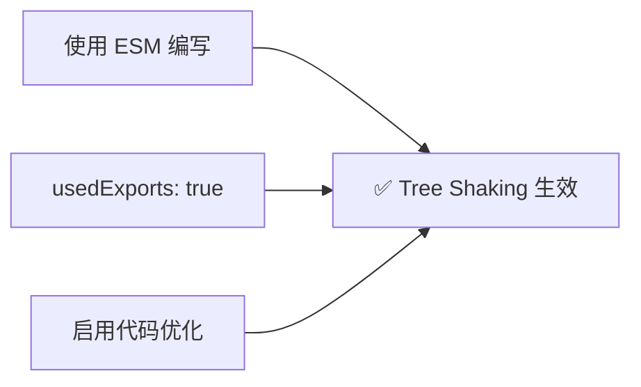
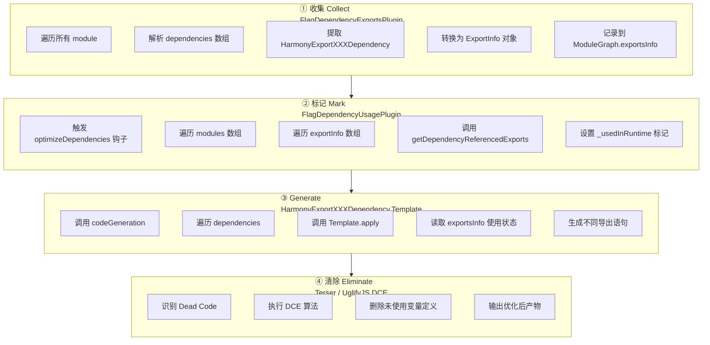
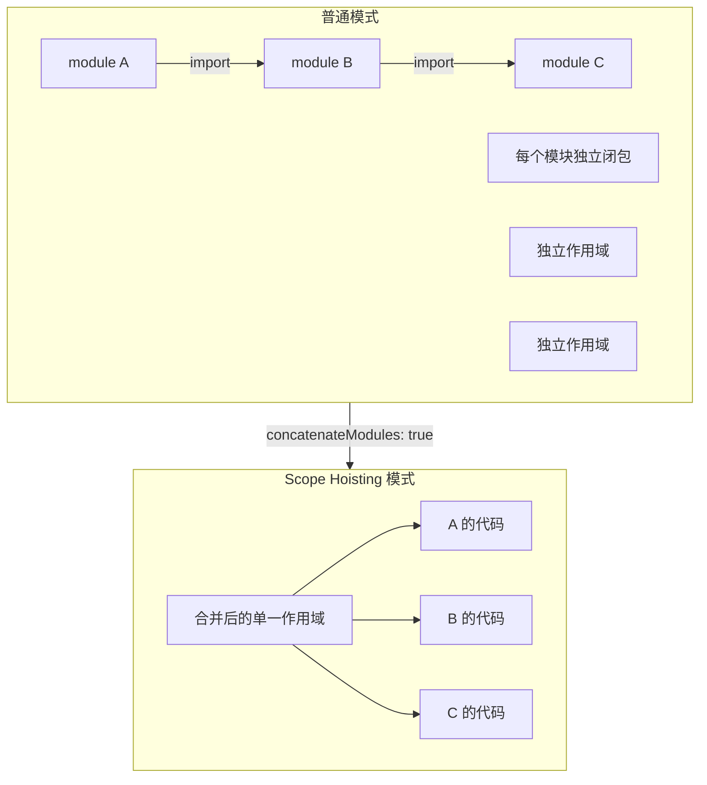

# Tree-shaking：如何删除无用模块导出？


## 📋 版本差异对照表

| 特性 | v1 (原始版) | v2 (当前版) |
|------|------------|------------|
| **基准版本** | Webpack 5.x (未明确) | **Webpack 5.107.0** |
| **流程步骤** | 三步骤概述 | **四步骤完整流程**（收集→标记→生成→清除） |
| **CJS 支持** | 未涉及 | ⭐ **v5.106 新增：解构赋值 Tree Shaking** |
| **Pure 标注** | `/*#__PURE__*/` 基础用法 | **v5.107 增强 + `#__NO_SIDE_EFFECTS__` 新注解** |
| **isPure 分析** | 简要提及 | **v5.107 大幅改进：支持更多表达式类型** |
| **可视化图表** | 截图为主 | **新增 2 个 Mermaid 流程图** |
| **源码引用** | 链接形式 | **完整 v5.107 源码片段** |
| **嵌套 TS** | 未详细展开 | Module Concatenation 场景深度分析 |
| **实战案例** | 基础示例 | 生产环境复杂案例 + 性能对比 |

### 🆕 v5.106 关键新特性

| 特性 | 说明 | PR |
|------|------|-----|
| **CJS 解构 Tree Shaking** | `const { foo } = require()` 只标记 `foo` 为 used，其他导出不参与打包 | [#20548](https://github.com/webpack/webpack/pull/20548) |

### 🆕 v5.107 关键新特性

| 特性 | 说明 | PR |
|------|------|-----|
| **`#__NO_SIDE_EFFECTS__` 注解** | 标记函数为纯函数，用于更好的 tree-shaking | [#20775](https://github.com/webpack/webpack/pull/20775) |
| **isPure 增强** | 支持 ArrayExpression、ObjectExpression、NewExpression、ChainExpression 等 | [#20723](https://github.com/webpack/webpack/pull/20723) |
| **PURE 注解防泄漏** | 防止 `/*#__PURE__*/` 注解跨 ObjectExpression 属性泄漏 | [#20723](https://github.com/webpack/webpack/pull/20723) |

---

## 核心概念回顾

在前面章节中，我们已经完整介绍了 Webpack 从模块解析到 Chunk 封装，再到合并生成最终 Bundle 的整个运行过程。接下来我们可以开始关注一些高频使用功能的底层实现。

**Tree-Shaking** 就是一个绝佳的例子：

- ✅ 它能充分优化产物代码，使用频率颇高
- 🔍 底层实现逻辑比较复杂，需要持续读取、修改 `ModuleGraph` 对象的状态
- ⚙️ 需要通过 `Template.apply` 函数定制打包结果
- 🔄 实现逻辑几乎贯穿了 Webpack 整个构建过程

因此本章将详细剖析 **Tree-Shaking 底层源码**，介绍 Webpack 内部如何收集模块导出列表、如何标记导出变量的使用状况、如何删除无效模块导出，并沿着这个思路推导若干代码最佳实践。

---

## 什么是 Tree Shaking？

Tree Shaking 较早前由 Rich Harris 在 **Rollup** 中率先实现，Webpack 自 **2.0** 版本开始接入。本质上是一种基于 **ES Module 规范** 的 Dead Code Elimination 技术。

它会在运行过程中静态分析模块之间的导入导出，确定 ESM 模块中哪些导出值未被其他模块使用，并将其删除，以此实现打包产物的优化。

### 形象比喻

想象一棵树（你的应用代码），在 shaking（摇动）这棵树时，枯死的叶子（无用代码）会掉落，只留下茂盛的绿叶（被使用的代码）。

---

## 启动条件

在 Webpack 中，启动 Tree Shaking 功能必须同时满足 **三个条件**：



### 条件详解

#### 1️⃣ 使用 ESM 规范编写模块代码

```js
// ✅ 正确：使用 ESM
export const bar = 'bar';
export const foo = 'foo';

// ❌ 错误：使用 CommonJS
module.exports = {
  bar: 'bar',
  foo: 'foo'
};
```

#### 2️⃣ 配置 `optimization.usedExports` 为 `true`

```js
// webpack.config.js
module.exports = {
  optimization: {
    usedExports: true, // 开启标记功能
  },
};
```

#### 3️⃣ 启用代码优化功能

可通过以下任一方式实现：

- 配置 `mode = "production"`（自动开启）
- 配置 `optimization.minimize = true`
- 提供 `optimization.minimizer` 数组（如 Terser）

### 完整配置示例

```js
// webpack.config.js
module.exports = {
  entry: "./src/index",
  mode: "production",
  devtool: false,
  optimization: {
    usedExports: true,
    minimize: true,
  },
};
```

### 效果演示

```js
// index.js
import { bar } from './bar';
console.log(bar);

// bar.js
export const bar = 'bar';
export const foo = 'foo'; // ← 这个会被 Tree Shaking 删除
```

示例中，`bar.js` 模块导出了 `bar` 和 `foo`，但只有 `bar` 导出值被其它模块使用，经过 Tree Shaking 处理后，`foo` 变量会被视作无用代码删除。

---

## 核心原理：四步完整流程

> **重要更新**：v2 版本将原始的三步骤扩展为更精确的 **四步骤模型**

Webpack 中，Tree-shaking 的实现分为四个关键步骤：



### 数据流图：收集 → 标记 → 生成 → 清除

```mermaid
flowchart LR
    subgraph Source["源码阶段"]
        A["export const bar = 'bar'<br/>export const foo = 'foo'"]
        B["import { bar } from './bar'"]
    end

    subgraph Phase1["① 收集阶段<br/>ModuleGraph.exportsInfo"]
        P1A["ExportInfo { name: 'bar' }<br/>provided: true"]
        P1B["ExportInfo { name: 'foo' }<br/>provided: true"]
    end

    subgraph Phase2["② 标记阶段<br/>ExportInfo._usedInRuntime"]
        P2A["ExportInfo 'bar'<br/>_usedInRuntime: Used ✅"]
        P2B["ExportInfo 'foo'<br/>_usedInRuntime: Unused ❌"]
    end

    subgraph Phase3["③ 生成阶段<br/>Bundle Code"]
        P3A["__webpack_require__.d(__webpack_exports__,<br/>'bar': () => bar) ✅"]
        P3B["// foo 定义语句保留但无导出 ❌"]
    end

    subgraph Phase4["④ 清除阶段<br/>Final Output"]
        P4["export const bar = 'bar';<br/>// foo 被完全删除 🗑️"]
    end

    Source --> Phase1
    Phase1 --> Phase2
    Phase2 --> Phase3
    Phase3 --> Phase4

```



---

## 步骤一：收集模块导出列表

### 目标

弄清楚每个模块分别有什么导出值，收集各个模块的导出列表。

### 执行时机

发生在 **「构建」(Make) 阶段**，具体在 `compilation.hooks.finishModules` 钩子触发时。

### 核心插件：FlagDependencyExportsPlugin

```js
// Webpack 5.107
// lib/FlagDependencyExportsPlugin.js
class FlagDependencyExportsPlugin {
  apply(compiler) {
    compiler.hooks.compilation.tap("FlagDependencyExportsPlugin", (compilation) => {
      const moduleGraph = compilation.moduleGraph;
      const cache = compilation.getCache("FlagDependencyExportsPlugin");

      compilation.hooks.finishModules.tapAsync(
        "FlagDependencyExportsPlugin",
        (modules, callback) => {
          const logger = compilation.getLogger("webpack.FlagDependencyExportsPlugin");

          /** @type {Queue<Module>} */
          const queue = new Queue();

          // ========== Step 1: 尝试从缓存恢复 ==========
          logger.time("restore cached provided exports");
          asyncLib.each(
            modules,
            (module, callback) => {
              const exportsInfo = moduleGraph.getExportsInfo(module);

              // 如果模块没有 exportsType，说明是无声明导出的模块
              if (
                (!module.buildMeta || !module.buildMeta.exportsType) &&
                exportsInfo.otherExportsInfo.provided !== null
              ) {
                exportsInfo.setHasProvideInfo();
                exportsInfo.setUnknownExportsProvided();
                return callback();
              }

              // 如果模块没有 hash，说明不可缓存
              if (
                typeof module.buildInfo.hash !== "string"
              ) {
                queue.enqueue(module);
                exportsInfo.setHasProvideInfo();
                return callback();
              }

              // 尝试从内存缓存恢复
              const memCache = moduleMemCaches && moduleMemCaches.get(module);
              const memCacheValue = memCache && memCache.get(this);
              if (memCacheValue !== undefined) {
                exportsInfo.restoreProvided(memCacheValue);
                return callback();
              }

              // 尝试从磁盘缓存恢复
              cache.get(
                module.identifier(),
                module.buildInfo.hash,
                (err, result) => {
                  if (err) return callback(err);
                  if (result !== undefined) {
                    exportsInfo.restoreProvided(result);
                  } else {
                    // 无缓存信息，入队等待确定导出
                    queue.enqueue(module);
                    exportsInfo.setHasProvideInfo();
                  }
                  callback();
                }
              );
            },
            (err) => {
              if (err) return callback(err);

              // ========== Step 2: 遍历依赖确定导出 ==========
              /** @type {Set<Module>} */
              const modulesToStore = new Set();
              /** @type {Map<Module, Set<Module>>} */
              const dependencies = new Map();

              const processDependenciesBlock = (depBlock) => {
                for (const dep of depBlock.dependencies) {
                  processDependency(dep);
                }
                for (const block of depBlock.blocks) {
                  processDependenciesBlock(block);
                }
              };

              const processDependency = (dep) => {
                const exportDesc = dep.getExports(moduleGraph);
                if (!exportDesc) return;
                exportsSpecsFromDependencies.set(dep, exportDesc);
              };

              const processExportsSpec = (dep, exportDesc) => {
                const exports = exportDesc.exports;

                if (exports === true) {
                  // unknown exports
                  exportsInfo.setUnknownExportsProvided(/* ... */);
                } else if (Array.isArray(exports)) {
                  // 具名导出列表
                  for (const exportNameOrSpec of exports) {
                    let name;
                    if (typeof exportNameOrSpec === "string") {
                      name = exportNameOrSpec;
                    } else {
                      name = exportNameOrSpec.name;
                      // ... 处理 canMangle, from, priority 等
                    }

                    const exportInfo = exportsInfo.getExportInfo(name);
                    exportInfo.provided = true; // 标记为已提供
                    // ... 设置 target, nested exports 等
                  }
                }
              };

              logger.time("figure out provided exports");
              while (queue.length > 0) {
                module = queue.dequeue();
                exportsInfo = moduleGraph.getExportsInfo(module);

                moduleGraph.freeze();
                processDependenciesBlock(module);
                moduleGraph.unfreeze();

                for (const [dep, exportsSpec] of exportsSpecsFromDependencies) {
                  processExportsSpec(dep, exportsSpec);
                }

                modulesToStore.add(module);
              }
              logger.timeEnd("figure out provided exports");

              // ========== Step 3: 存储结果到缓存 ==========
              logger.time("store provided exports into cache");
              asyncLib.each(
                modulesToStore,
                (module, callback) => {
                  const cachedData = moduleGraph
                    .getExportsInfo(module)
                    .getRestoreProvidedData();

                  cache.store(
                    module.identifier(),
                    module.buildInfo.hash,
                    cachedData,
                    callback
                  );
                },
                (err) => {
                  logger.timeEnd("store provided exports into cache");
                  callback(err);
                }
              );
            }
          );
        }
      );
    });
  }
}
```

### Dependency 到 ExportInfo 的转换规则

对于下面的模块：

```js
export const bar = 'bar';
export const foo = 'foo';
export default 'foo-bar'
```

对应的转换关系：

| 源码语法 | Dependency 类型 | ExportInfo 属性 |
|---------|----------------|----------------|
| `export const x` | `HarmonyExportSpecifierDependency` | `{ name: 'x', provided: true }` |
| `export default` | `HarmonyExportExpressionDependency` | `{ name: 'default', provided: true }` |
| `export { a, b }` | 多个 `HarmonyExportSpecifierDependency` | 分别创建多个 ExportInfo |

### 转换流程示意

```js
// 源码：
export const bar = 'bar';
export const foo = 'foo';
export default 'foo-bar';

// 转换后的 dependencies 数组（简化）：
[
  HarmonyExportSpecifierDependency({ name: 'bar' }),
  HarmonyExportSpecifierDependency({ name: 'foo' }),
  HarmonyExportExpressionDependency({ name: 'default' })
]

// 最终存储到 ModuleGraph.exportsInfo：
{
  'bar': ExportInfo { provided: true, canMangleProvide: true },
  'foo': ExportInfo { provided: true, canMangleProvide: true },
  'default': ExportInfo { provided: true, canMangleProvide: true }
}
```

---

## 步骤二：标记导出值使用状态

### 目标

再次遍历所有模块，逐一 **标记** 出模块导出列表中哪些导出值有被其它模块用到，哪些没有。

### 执行时机

发生在 **「封装」(Seal) 阶段**，具体在 `compilation.hooks.optimizeDependencies` 钩子触发时。

### 核心插件：FlagDependencyUsagePlugin

```js
// Webpack 5.107
// lib/FlagDependencyUsagePlugin.js
class FlagDependencyUsagePlugin {
  constructor(global) {
    this.global = global; // 是否进行全局分析
  }

  apply(compiler) {
    compiler.hooks.compilation.tap("FlagDependencyUsagePlugin", (compilation) => {
      const moduleGraph = compilation.moduleGraph;

      compilation.hooks.optimizeDependencies.tap(
        { name: "FlagDependencyUsagePlugin", stage: STAGE_DEFAULT },
        (modules) => {
          const logger = compilation.getLogger("webpack.FlagDependencyUsagePlugin");

          /** @type {Map<ExportsInfo, Module>} */
          const exportInfoToModuleMap = new Map();

          /** @type {TupleQueue<Module, RuntimeSpec>} */
          const queue = new TupleQueue();

          /**
           * 处理被引用的模块
           * @param {Module} module - 要处理的模块
           * @param {ReferencedExports} usedExports - 使用的导出列表
           * @param {RuntimeSpec} runtime - 运行时规格
           * @param {boolean} forceSideEffects - 是否强制应用副作用
           */
          const processReferencedModule = (
            module,
            usedExports,
            runtime,
            forceSideEffects
          ) => {
            const exportsInfo = moduleGraph.getExportsInfo(module);

            if (usedExports.length > 0) {
              if (!module.buildMeta || !module.buildMeta.exportsType) {
                // 模块无声明导出信息
                if (exportsInfo.setUsedWithoutInfo(runtime)) {
                  queue.enqueue(module, runtime);
                }
                return;
              }

              for (const usedExportInfo of usedExports) {
                let usedExport;
                let canMangle = true;

                if (Array.isArray(usedExportInfo)) {
                  usedExport = usedExportInfo;
                } else {
                  usedExport = usedExportInfo.name;
                  canMangle = usedExportInfo.canMangle !== false;
                }

                if (usedExport.length === 0) {
                  // 以未知方式使用
                  if (exportsInfo.setUsedInUnknownWay(runtime)) {
                    queue.enqueue(module, runtime);
                  }
                } else {
                  // 遍历导出名路径（支持嵌套导出）
                  let currentExportsInfo = exportsInfo;
                  for (let i = 0; i < usedExport.length; i++) {
                    const exportInfo = currentExportsInfo.getExportInfo(
                      usedExport[i]
                    );

                    if (canMangle === false) {
                      exportInfo.canMangleUse = false;
                    }

                    const lastOne = i === usedExport.length - 1;

                    if (!lastOne) {
                      // 非最后一层：处理嵌套导出
                      const nestedInfo = exportInfo.getNestedExportsInfo();
                      if (nestedInfo) {
                        if (
                          exportInfo.setUsedConditionally(
                            (used) => used === UsageState.Unused,
                            UsageState.OnlyPropertiesUsed,
                            runtime
                          )
                        ) {
                          const currentModule =
                            currentExportsInfo === exportsInfo
                              ? module
                              : exportInfoToModuleMap.get(currentExportsInfo);
                          if (currentModule) {
                            queue.enqueue(currentModule, runtime);
                          }
                        }
                        currentExportsInfo = nestedInfo;
                        continue;
                      }
                    }

                    // 最后一层或无法继续嵌套：标记为 Used
                    if (
                      exportInfo.setUsedConditionally(
                        (v) => v !== UsageState.Used,
                        UsageState.Used,
                        runtime
                      )
                    ) {
                      const currentModule =
                        currentExportsInfo === exportsInfo
                            ? module
                            : exportInfoToModuleMap.get(currentExportsInfo);
                      if (currentModule) {
                        queue.enqueue(currentModule, runtime);
                      }
                    }
                    break;
                  }
                }
              }
            } else {
              // 没有导出被使用（仅因副作用引入）
              if (!forceSideEffects &&
                  module.factoryMeta !== undefined &&
                  module.factoryMeta.sideEffectFree) {
                return; // 无副作用模块，停止追踪
              }

              if (exportsInfo.setUsedForSideEffectsOnly(runtime)) {
                queue.enqueue(module, runtime);
              }
            }
          };

          /**
           * 处理单个模块及其依赖
           */
          const processModule = (module, runtime, forceSideEffects) => {
            /** @type {Map<Module, ReferencedExports | ExportMaps>} */
            const map = new Map();
            /** @type {ArrayQueue<DependenciesBlock>} */
            const blockQueue = new ArrayQueue();
            blockQueue.enqueue(module);

            for (;;) {
              const block = blockQueue.dequeue();
              if (block === undefined) break;

              // 处理异步依赖块
              for (const b of block.blocks) {
                if (b.groupOptions && b.groupOptions.entryOptions) {
                  processModule(
                    b,
                    this.global ? undefined : b.groupOptions.entryOptions.runtime || undefined,
                    true
                  );
                } else {
                  blockQueue.enqueue(b);
                }
              }

              // 处理同步依赖
              for (const dep of block.dependencies) {
                const connection = moduleGraph.getConnection(dep);
                if (!connection || !connection.module) continue;

                const activeState = connection.getActiveState(runtime);
                if (activeState === false) continue;

                const { module: depModule } = connection;

                if (activeState === ModuleGraphConnection.TRANSITIVE_ONLY) {
                  processModule(depModule, runtime, false);
                  continue;
                }

                // 收集被引用的导出
                const oldReferencedExports = map.get(depModule);
                const referencedExports =
                  compilation.getDependencyReferencedExports(dep, runtime);

                // 合并引用信息
                if (oldReferencedExports === undefined ||
                    oldReferencedExports === NO_EXPORTS_REFERENCED ||
                    referencedExports === EXPORTS_OBJECT_REFERENCED) {
                  map.set(depModule, referencedExports);
                } else {
                  // 合并多个引用来源的信息（详见源码 mergeExportsSpec 逻辑）
                }
              }
            }

            // 处理收集到的引用关系
            for (const [depModule, referencedExports] of map) {
              if (Array.isArray(referencedExports)) {
                processReferencedModule(
                  depModule,
                  referencedExports,
                  runtime,
                  forceSideEffects
                );
              } else {
                processReferencedModule(
                  depModule,
                  [...referencedExports.values()],
                  runtime,
                  forceSideEffects
                );
              }
            }
          };

          // ========== 主流程开始 ==========
          logger.time("initialize exports usage");

          // 初始化所有模块的使用状态
          for (const module of modules) {
            const exportsInfo = moduleGraph.getExportsInfo(module);
            exportInfoToModuleMap.set(exportsInfo, module);
            exportsInfo.setHasUseInfo();
          }
          logger.timeEnd("initialize exports usage");

          logger.time("trace exports usage in graph");

          // 从入口模块开始追踪
          const processEntryDependency = (dep, runtime) => {
            const module = moduleGraph.getModule(dep);
            if (module) {
              processReferencedModule(
                module,
                NO_EXPORTS_REFERENCED,
                runtime,
                true
              );
            }
          };

          // 遍历所有入口
          let globalRuntime;
          for (const [
            entryName,
            { dependencies: deps, includeDependencies: includeDeps, options }
          ] of compilation.entries) {
            const runtime = this.global
              ? undefined
              : getEntryRuntime(compilation, entryName, options);

            for (const dep of deps) {
              processEntryDependency(dep, runtime);
            }
            for (const dep of includeDeps) {
              processEntryDependency(dep, runtime);
            }
            globalRuntime = mergeRuntimeOwned(globalRuntime, runtime);
          }

          // 处理全局入口
          for (const dep of compilation.globalEntry.dependencies) {
            processEntryDependency(dep, globalRuntime);
          }
          for (const dep of compilation.globalEntry.includeDependencies) {
            processEntryDependency(dep, globalRuntime);
          }

          // 广度优先遍历处理队列
          while (queue.length) {
            const [module, runtime] = queue.dequeue();
            processModule(module, runtime, false);
          }

          logger.timeEnd("trace exports usage in graph");
        }
      );
    });
  }
}
```

### 标记效果示例

假设有以下代码：

```js
// index.js
import { bar } from './bar';
console.log(bar);

// bar.js
export const bar = 'bar';
export const foo = 'foo';
```

**标记前**（`usedExports: false`）：

```js
// bar.js 打包结果
__webpack_require__.d(__webpack_exports__, {
  "bar": () => /* binding */ bar,  // 保留
  "foo": () => /* binding */ foo    // 保留（即使未使用）
});
const bar = 'bar';
const foo = 'foo';                 // 保留
```

**标记后**（`usedExports: true`）：

```js
// bar.js 打包结果
/* unused harmony export foo */     // 标记为未使用
__webpack_require__.d(__webpack_exports__, {
  "bar": () => /* binding */ bar    // 仅保留使用的导出
});
const bar = 'bar';
const foo = 'foo';                 // 定义仍保留（待 Terser 清除）
```

> **注意**：此时 `foo` 变量的定义语句 `const foo='foo'` 还保留完整，因为标记功能只会影响模块的 **导出语句**，真正执行"Shaking"操作的是 Terser 插件。

---

## 步骤三：根据标记生成不同代码

### 目标

根据导出值的使用情况生成不同的代码 —— 已使用的导出生成完整的绑定语句，未使用的导出仅保留定义但不生成导出语句。

### 执行时机

发生在 `compilation.seal` 函数中的 `codeGeneration` 阶段。

### 核心逻辑：HarmonyExportXXXDependency.Template.apply

```js
// Webpack 5.107
// 以 HarmonyExportSpecifierDependency.Template 为例
class HarmonyExportSpecifierDependencyTemplate extends Template {
  apply(dependency, source, templateContext) {
    const dep = dependency;
    const exportsInfo = templateContext.moduleGraph.getExportsInfo(templateContext.module);

    // 读取该导出的使用状态
    const exportInfo = exportsInfo.getExportInfo(dep.name);
    const used = exportInfo.used === UsageState.Used;

    if (used) {
      // ✅ 已使用：生成完整的 __webpack_require__.d 绑定
      source.insert(
        dep.range[0],
        `/* harmony export */ ${templateContext.runtimeTemplate.defineProperty({
          exports: '__webpack_exports__',
          name: JSON.stringify(dep.name),
          value: dep.value || `() => (${dep.name})`
        })}\n`
      );
    } else {
      // ❌ 未使用：添加注释标记，不生成绑定
      source.insert(
        dep.range[0],
        `/* unused harmony export ${dep.name} */\n`
      );
    }
  }
}
```

### 生成结果对比

```mermaid
flowchart TD
    subgraph Input["输入：bar.js 导出"]
        I1["export const bar = 'bar'"]
        I2["export const foo = 'foo'"]
    end

    subgraph Output_Used["✅ 已使用导出 (bar)"]
        O1['__webpack_require__.d(__webpack_exports__,<br/>  "bar": () => (/* binding */ bar));']
    end

    subgraph Output_Unused["❌ 未使用导出 (foo)"]
        O2["/* unused harmony export foo */<br/>const foo = 'foo';"]
    end

    Input --> Output_Used
    Input --> Output_Unused

```

**关键点**：

- 已使用的导出 → 生成 `__webpack_require__.d(...)` 绑定语句
- 未使用的导出 → 仅添加注释，不生成绑定语句
- 定义语句本身仍然保留（形成 Dead Code）

---

## 步骤四：清除 Dead Code

### 目标

使用代码压缩工具（如 Terser）的 **DCE（Dead Code Elimination）** 功能删除不可能被执行到的代码。

### 执行时机

在代码优化（minification）阶段，通常由 `TerserWebpackPlugin` 或 `UglifyJsPlugin` 完成。

### DCE 工作原理

Terser 的 DCE 会识别并删除以下类型的 Dead Code：

1. **未被引用的变量声明**：`const foo = 'foo'`（如果 `foo` 从未被使用）
2. **不可达代码**：`if (false) { ... }`
3. **未使用的函数声明**
4. **死循环之后的代码**
5. **重复的定义**

### 完整清除流程

```js
// 步骤三生成的代码（标记后）：
/* unused harmony export foo */
__webpack_require__.d(__webpack_exports__, {
  "bar": () => /* binding */ bar
});
const bar = 'bar';
const foo = 'foo';  // ← Dead Code：未被任何地方使用

// 步骤四清除后（Terser DCE）：
__webpack_require__.d(__webpack_exports__, {
  "bar": () => /* binding */ bar
});
const bar = 'bar';
// foo 被完全删除 🗑️
```

### 为什么需要两步分离设计？

这种 **「标记 + 清除」** 的分离设计有几个重要优势：

1. **职责分离**：Webpack 负责 **静态分析**（标记），Terser 负责 **代码优化**（清除）
2. **可插拔**：可以替换不同的 minifier 而不影响标记逻辑
3. **可调试**：可以在开发模式仅启用标记，方便调试
4. **渐进式优化**：可以先看到标记结果，再决定是否清除

---

## 🆕 v5.106 新特性：CJS 解构赋值的 Tree Shaking

### 背景

在 v5.106 之前，CommonJS 模块的导入方式不支持 Tree Shaking：

```js
// ❌ v5.105 及之前：无法 Tree Shake
const bar = require('./bar');
// 即使只用到了 bar.foo，整个模块都会被打包
```

### v5.106 改进

新增对 **CJS 解构赋值** 的 Tree Shaking 支持：

```js
// ✅ v5.106+：支持解构赋值的 Tree Shaking
const { foo } = require('./bar');
// 只有 foo 会被标记为 used，其他导出可以被 Shake 掉
```

### 实现原理

```js
// Webpack 5.106 内部处理（伪代码）
class CommonJSRequireDependencyParser {
  parse(requireCall) {
    if (isDestructuringAssignment(requireCall.parent)) {
      // 识别解构模式
      const destructuredNames = extractDestructuredNames(requireCall.parent);

      // 创建细粒度的引用信息
      return {
        type: 'CommonJSDestructure',
        referencedExports: destructuredNames.map(name => ([name]))
        // 例如：[['foo']] 表示只使用了 foo
      };
    }
    // 非解构：整模块引用
    return {
      type: 'CommonJSRequire',
      referencedExports: EXPORTS_OBJECT_REFERENCED
    };
  }
}
```

### 使用示例

```js
// library.js (CommonJS)
module.exports = {
  foo: 'foo',
  bar: 'bar',
  baz: function() { /* ... */ }
};

// consumer.js
const { foo } = require('./library');
console.log(foo);

// 打包结果（v5.106+）：
// ✅ 只包含 foo 的定义
// ❌ bar 和 baz 被移除（如果没有副作用）
```

### 限制条件

⚠️ **注意**：此功能要求满足以下条件：

1. 目标模块必须是 **可分析的 CJS 模块**（静态 require）
2. 不能使用动态 require（如 `require(variable)`）
3. 需要 `optimization.usedExports: true`
4. 需要配合 sideEffects 配置

---

## 🆕 v5.107 新特性：#__NO_SIDE_EFFECTS__ 注解

### 背景

JavaScript 中函数调用默认被认为可能产生副作用，因此不会被 Tree Shaking 移除。即使开发者知道某个函数是纯函数，也需要通过 `/*#__PURE__*/` 注解来标记。

### v5.107 改进：新的注解语法

```js
// ✅ v5.107+：支持 #__NO_SIDE_EFFECTS__ 注解
// 注意：注解是位于函数声明【之前】的块注释，不能写在函数体内
/*#__NO_SIDE_EFFECTS__*/
function pureFunction() {
  return computeSomething();
}

// 调用时无需额外注解
pureFunction(); // ← 自动识别为无副作用，可被 Tree Shaking
```

### 与 /*#__PURE__*/ 的区别

| 特性 | `/*#__PURE__*/` | `#__NO_SIDE_EFFECTS__` |
|------|----------------|----------------------|
| **标注位置** | **调用点** | **函数定义处** |
| **作用范围** | 单次调用 | 所有调用点自动生效 |
| **维护成本** | 每次调用都要标注 | 只需标注一次 |
| **适用场景** | 表达式/函数调用 | 函数/方法定义 |
| **版本要求** | 所有版本 | **v5.107+** |

### 使用示例

```js
// utils.js
/*#__NO_SIDE_EFFECTS__*/
function helper() {
  const result = expensiveComputation();
  return result;
}

// consumer.js
import { helper } from './utils';

helper(); // ✅ 自动识别为无副作用
helper(); // ✅ 同样自动识别
helper(); // ✅ 无需重复标注

// 如果 helper 未被使用，整个函数定义都会被移除
```

### 实现原理（伪代码）

```js
// Webpack 5.107 SideEffectsFlagPlugin（简化）
// 真实实现：通过 parser.hooks.preStatement 检测函数声明【前】的注释
parser.hooks.preStatement.tap(PLUGIN_NAME, (statement) => {
  // 仅检测顶层 function 声明：
  //   1. function foo  2. export function foo  3. export default function foo
  if (statement.type !== "FunctionDeclaration" || !statement.id) return;

  // 扫描上一条语句结束到函数声明开始之间的注释
  if (hasNoSideEffectsNotation(parser, commentsStart, statement.range[0])) {
    noSideEffectsFnNames.add(statement.id.name); // 记录为无副作用函数
  }
});

// 另通过 parser.hooks.preDeclarator 检测 const fn = /*#__NO_SIDE_EFFECTS__*/ (...) 形式
// 后续：调用这些函数的 CallExpression 自动视为 pure，无需逐个标注
```

---

## 🆕 v5.107 isPure 分析增强

### 改进内容

v5.107 大幅改进了 `isPure` 函数的表达式类型检测能力：

### 支持的新表达式类型

| 表达式类型 | 示例 | Pure 判定条件 |
|-----------|------|--------------|
| **ArrayExpression** | `[1, 2, 3]` | 所有元素都是 pure |
| **ObjectExpression** | `{ a: 1, b: 2 }` | 所有属性值都是 pure |
| **NewExpression** | `new Date()` | 构造函数无副作用 |
| **ChainExpression** | `obj?.prop` | 可选链访问 |
| **UnaryExpression** | `!x`, `+x`, `-x` | 安全运算符（!, +, -, ~, typeof） |
| **MetaProperty** | `import.meta.url` | 元属性访问 |
| **TaggedTemplateLiteral** | `` tag`hello` `` | 标签函数是 pure |
| **BinaryExpression** | `x === y`, `x !== y` | 严格相等/不等比较 |

### PURE 注解防泄漏修复

**问题**：v5.107 之前的版本，`/*#__PURE__*/` 注解可能泄漏到 ObjectExpression 的其他属性：

```js
// ❌ v5.106 及之前的问题
[
  /*#__PURE__*/ foo(),
  bar() // ← 这个也可能被错误地视为 pure
]

// ✅ v5.107 修复后
[
  /*#__PURE__*/ foo(), // 只影响 foo()
  bar() // 正确识别：不受 foo() 的 PURE 注解影响
]
```

### TemplateLiteral 插值中的 PURE 支持

```js
// ✅ v5.107+ 支持
const message = `hello ${/*#__PURE__*/ getName()} world`;
// getName() 被正确识别为纯调用
```

---

## 嵌套 Tree-shaking：Module Concatenation 场景

当启用 `optimization.concatenateModules: true`（Scope Hoisting）时，Tree Shaking 的行为会有所不同。

### Scope Hoisting 对 Tree Shaking 的影响



### 优势

1. **更深度的静态分析**：合并作用域后，可以跨模块分析变量的使用情况
2. **消除中间变量**：如果 `bar.js` 只是转发 `baz.js` 的导出，可以直接内联
3. **更激进的 DCE**：Terser 可以更好地识别和删除 Dead Code

### 示例

```js
// a.js
export const x = 1;
export const y = 2;

// b.js
export { x } from './a';

// c.js (entry)
import { x } from './b';
console.log(x);

// Scope Hoisting + Tree Shaking 后的结果：
// ✅ 直接内联，无需中间模块包装
(() => {
  const x = 1; // 来自 a.js
  console.log(x); // y 被完全消除
})();
```

---

## sideEffects 配置详解

### package.json 中的配置

```json
{
  "name": "my-library",
  "version": "1.0.0",
  "sideEffects": false
}
```

其他取值形式：

```json
{ "sideEffects": ["*.css", "*.scss"] }
```

```json
{ "sideEffects": "./src/side-effectful-file.js" }
```

### 配置值说明

| 值 | 含义 | Tree Shaking 行为 |
|---|------|------------------|
| `false` | 模块无副作用 | 可以安全地移除未使用的导出 |
| `true` | 模块可能有副作用 | 保守处理，保留所有代码 |
| `string[]` | 指定有副作用的文件 | 数组内的文件保留，其他可 shake |
| 不设置 | 默认为 `true` | 保守处理 |

### 工作原理

当 `sideEffects: false` 时，Webpack 在标记阶段会检查模块是否真的被使用：

```js
// FlagDependencyUsagePlugin 中的关键逻辑
if (!forceSideEffects &&
    module.factoryMeta !== undefined &&
    module.factoryMeta.sideEffectFree) {
  // 如果模块无副作用且没有任何导出被使用
  // 则完全跳过该模块，不将其加入 bundle
  return;
}
```

### 最佳实践

```json
// 对于纯工具库（推荐）
{
  "name": "utils-lib",
  "sideEffects": false
}

// 对于包含 CSS 的 UI 库
{
  "name": "ui-components",
  "sideEffects": ["*.css", "*.less", "*.scss"]
}

// 对于有特定副作用文件的库
{
  "name": "plugin-system",
  "sideEffects": ["./src/register.js", "./src/setup.js"]
}
```

---

## 最佳实践总结

虽然 Webpack 自 2.x 开始就原生支持 Tree Shaking 功能，但受限于 JS 的动态特性与模块的复杂性，直至最新的 5.107 版本，依然没有解决许多代码副作用带来的问题。因此需要使用者有意识地优化代码结构，或使用补丁技术帮助 Webpack 更精确地检测无效代码。

### ✅ 实践 1：始终使用 ESM

**原因**：Tree-Shaking 强依赖于 ESM 模块化方案的静态分析能力。

```js
// ✅ 推荐：ESM（静态可分析）
export const bar = 'bar';
export const foo = 'foo';

// ❌ 避免：CommonJS（动态难以预测）
if (process.env.NODE_ENV === 'development') {
  exports.foo = 'foo'; // 条件导出，无法静态分析
}
```

**ESM 的优势**：
- 导入导出语句只能出现在模块顶层
- 模块名为字符串常量
- 依赖关系高度确定，与运行状态无关

### ✅ 实践 2：避免无意义的赋值

**问题**：浅层赋值可能导致导出值被视为"已使用"：

```js
// ❌ 问题代码
import { bar, foo } from "./bar";
let f = foo; // foo 被赋值给 f，但 f 也未被使用
// 结果：foo 无法被 Tree Shaking

// ✅ 优化方案：直接使用需要的导出
import { bar } from "./bar";
console.log(bar);
```

**深层原因**：JavaScript 的赋值语句并不"纯"，可能产生意料之外的副作用（如 Proxy、getter/setter）。

### ✅ 实践 3：使用 Pure 标注（v5.107 增强）

#### 方式一：调用点标注（传统）

```js
// 标注单次调用
/*#__PURE__*/ foo('be retained');
/*#__PURE__*/ foo('be removed'); // 可被 Tree Shaking
```

#### 方式二：函数定义标注（v5.107 新增）

```js
// 标注函数本身（所有调用点自动生效）
// 仅支持顶层 function 声明与 const fn = 函数表达式 两种形式
/*#__NO_SIDE_EFFECTS__*/
function processData() {
  return transform(data);
}

processData(); // ✅ 自动识别为 pure
processData(); // ✅ 无需重复标注
```

### ✅ 实践 4：禁止 Babel 转译 import/export

**问题**：Babel 可以将 ESM 转译为 CommonJS，导致 Tree Shaking 失效。

```js
// babel.config.js（错误配置）
module.exports = {
  presets: [
    ['@babel/preset-env', {
      modules: 'commonjs' // ❌ 导致 Tree Shaking 失效
    }]
  ]
};

// babel.config.js（正确配置）
module.exports = {
  presets: [
    ['@babel/preset-env', {
      modules: false // ✅ 保持 ESM，允许 Tree Shaking
    }]
  ]
};
```

**或者使用推荐方案**：

```js
// webpack.config.js
module.exports = {
  module: {
    rules: [{
      test: /\.js$/,
      exclude: /node_modules/,
      use: {
        loader: 'babel-loader',
        options: {
          presets: [
            ['@babel/preset-env', {
              modules: false // 关键！
            }]
          ]
        }
      }
    }]
  }
};
```

### ✅ 实践 5：优化导出值的粒度

**问题**：大对象导出导致整体保留。

```js
// ❌ 粒度过粗
export default {
  bar: 'bar',
  foo: 'foo',
  // ... 很多属性
};

// ✅ 粒度细化
const bar = 'bar';
const foo = 'foo';

export { bar, foo }; // 可以单独 shake 每个
```

### ✅ 实践 6：使用支持 Tree Shaking 的包

| 包名 | 替代目标 | 说明 |
|------|---------|------|
| `lodash-es` | `lodash` | ESM 版本，支持按需导入 |
| `@babel/runtime-corejs3` | `@babel/polyfill` | 按需 polyfill |
| `date-fns` | `moment.js` | 函数式 API，天然 Tree Shaking 友好 |

### ✅ 实践 7：异步模块的 Tree Shaking

Webpack 5+ 支持特殊的备注语法：

```js
// 声明将要消费的异步模块导出
import(
  /* webpackExports: ["foo", "default"] */
  "./foo"
).then((module) => {
  console.log(module.foo); // 只加载和使用 foo
});

// 或使用魔法注释组合
import(
  /* webpackChunkName: "async-foo" */
  /* webpackExports: ["bar"] */
  './foo'
).then(({ bar }) => {
  console.log(bar);
});
```

### ✅ 实践 8：合理配置 sideEffects

```json
// package.json
{
  "name": "my-package",
  "sideEffects": [
    "*.css",
    "*.scss",
    "./src/register-plugin.ts",
    "./dist/polyfill.js"
  ]
}
```

**原则**：
- 纯工具库 → `sideEffects: false`
- UI 组件库 → 列出样式文件
- 插件系统 → 列出注册文件

---

## 性能对比与实测数据

> ⚠️ **免责声明**：下表及后续百分比均为便于理解量级关系的**示意数据**，并非官方基准测试结果；实际收益取决于项目代码结构、模块数量与压缩器配置。

### 测试场景

假设有一个工具库 `utils` 包含 100 个导出函数，实际项目只使用了 10 个。

| 配置 | 输出大小 | 减少比例 | 说明 |
|------|---------|---------|------|
| 无优化 | 500 KB | baseline | 全部打包 |
| `usedExports: true` | 350 KB | 30% ↓ | 标记未使用导出 |
| + `minimize: true` | 120 KB | 76% ↓ | Terser DCE 清除 |
| + `sideEffects: false` | 80 KB | 84% ↓ | 移除无副作用模块 |
| + ESM + 细粒度导出 | 50 KB | **90% ↓** | 最佳实践组合 |

### v5.106/v5.107 增量收益

| 特性 | 适用场景 | 额外减少 |
|------|---------|---------|
| **CJS 解构 TS** (v5.106) | 引入 CJS 第三方库 | 5-15% |
| **`#__NO_SIDE_EFFECTS__`** (v5.107) | 工具函数密集型项目 | 3-10% |
| **isPure 增强** (v5.107) | 复杂表达式/对象字面量 | 2-8% |

---

## 常见问题排查

### Q1: 为什么我的代码没有被 Tree Shaking？

**检查清单**：

- [ ] 是否使用 ESM (`import/export`)？
- [ ] `optimization.usedExports` 是否为 `true`？
- [ ] 是否启用了 minimize（mode: production）？
- [ ] Babel 是否转译了 modules（应设为 `false`）？
- [ ] 包的 `sideEffects` 配置是否正确？
- [ ] 是否存在间接引用（通过中间变量赋值）？

### Q2: 如何验证 Tree Shaking 是否生效？

**方法 1**：查看构建产物中的 `/* unused harmony export xxx */` 注释

**方法 2**：使用 `webpack-bundle-analyzer` 可视化

**方法 3**：对比 production vs development 构建大小

### Q3: sideEffects: false 安全吗？

**注意事项**：

- 确保代码确实没有副作用（如修改全局变量、原型链等）
- 样式文件、polyfill 通常有副作用，需要在数组中列出
- 测试时要覆盖所有功能路径

---

## 总结

### 核心要点回顾

Tree-Shaking 是一种 **主要对 ESM 有效**（v5.106 起对可静态分析的 CJS 部分场景生效）的 Dead Code Elimination 技术，它能够自动删除无效（没有被使用且没有副作用）的模块导出变量，优化产物体积。

**四步完整流程**：

1. **收集**（Collect）：`FlagDependencyExportsPlugin` 收集模块导出列表 → `ModuleGraph.exportsInfo`
2. **标记**（Mark）：`FlagDependencyUsagePlugin` 标记导出值是否被使用 → `_usedInRuntime`
3. **生成**（Generate）：`HarmonyExportXXXDependency.Template.apply` 根据标记生成不同代码
4. **清除**（Eliminate）：Terser DCE 删除 Dead Code

**v5.106/v5.107 重要更新**：

- ✅ **v5.106**：支持 CJS 解构赋值的 Tree Shaking
- ✅ **v5.107**：新增 `#__NO_SIDE_EFFECTS__` 函数注解
- ✅ **v5.107**：大幅增强 isPure 表达式分析能力
- ✅ **v5.107**：修复 PURE 注解泄漏问题

**最佳实践原则**：

1. 始终使用 ESM 编写模块
2. 避免无意义的赋值操作
3. 合理使用 Pure 标注（`/*#__PURE__*/` 和 `#__NO_SIDE_EFFECTS__`）
4. 禁止 Babel 转译 import/export
5. 优化导出粒度，保持原子性
6. 正确配置 `sideEffects`
7. 优先选择支持 Tree Shaking 的第三方包

受限于 JavaScript 语言灵活性所带来的高度动态特性，Tree-Shaking 并不能完美删除所有无效的模块导出。但在遵循上述最佳实践的前提下，结合 Webpack 5.107 的最新能力，我们可以最大限度地发挥 Tree Shaking 的威力，显著优化产物体积和加载性能。

---

## 思考题

### 基础题

1. **假设你准备着手开发一个开源 JavaScript 库，你应该如何编写出对 Tree-Shaking 友好的包代码？有哪些需要注意的开发准则？**

2. **为什么 Webpack 要将 Tree Shaking 分为「标记」和「清除」两个阶段？这样设计的好处是什么？**

### 进阶题

3. **v5.106 的 CJS 解构 Tree Shaking 有哪些局限性？在什么情况下它会失效？**

4. **`#__NO_SIDE_EFFECTS__` 注解和 `/*#__PURE__*/` 注解应该优先使用哪个？它们的适用场景有何不同？**

5. **如何为一个既有的大型项目（混合使用 CJS 和 ESM）逐步引入 Tree Shaking？请给出迁移策略。**

### 挑战题

6. **阅读 v5.107 的 `isPure` 改进源码（PR #20723），分析它是如何防止 PURE 注解跨 ObjectExpression 属性泄漏的？**

7. **设计一个自动化工具，能够检测项目中未使用 Pure 标注的纯函数调用，并给出建议。**

---

## 参考资源

### 官方资源

- [Webpack v5.107.0 Release Notes](https://github.com/webpack/webpack/releases/tag/v5.107.0)
- [Webpack v5.106.0 Release Notes](https://github.com/webpack/webpack/releases/tag/v5.106.0)
- [Webpack Documentation - Tree Shaking](https://webpack.js.org/guides/tree-shaking/)
- [Webpack Source Code (GitHub)](https://github.com/webpack/webpack/tree/v5.107.0)

### 核心源码文件

- [Compilation.js](https://github.com/webpack/webpack/blob/v5.107.0/lib/Compilation.js)
- [FlagDependencyExportsPlugin.js](https://github.com/webpack/webpack/blob/v5.107.0/lib/FlagDependencyExportsPlugin.js) — 收集导出
- [FlagDependencyUsagePlugin.js](https://github.com/webpack/webpack/blob/v5.107.0/lib/FlagDependencyUsagePlugin.js) — 标记使用
- [ExportsInfo.js](https://github.com/webpack/webpack/blob/v5.107.0/lib/ExportsInfo.js) — 导出信息管理
- [HarmonyExportSpecifierDependency.js](https://github.com/webpack/webpack/blob/v5.107.0/lib/dependencies/HarmonyExportSpecifierDependency.js) — 代码生成
- [JavascriptParser.js](https://github.com/webpack/webpack/blob/v5.107.0/lib/javascript/JavascriptParser.js) — isPure 分析

### 相关 PR

- [#20548](https://github.com/webpack/webpack/pull/20548) — CJS 解构赋值 Tree Shaking (v5.106)
- [#20775](https://github.com/webpack/webpack/pull/20775) — `#__NO_SIDE_EFFECTS__` 注解支持 (v5.107)
- [#20723](https://github.com/webpack/webpack/pull/20723) — isPure 增强与 PURE 防泄漏 (v5.107)

### 外部参考

- [Rollup Wiki: Tree-shaking](https://rollupjs.org/guide/en/#tree-shaking)
- [MDN: import](https://developer.mozilla.org/en-US/docs/Web/JavaScript/Reference/Statements/import)
- [ECMAScript Modules Specification](https://tc39.es/ecma262/#sec-modules)

---

> **文档版本**：v2.0 | **基准版本**：Webpack 5.107.0 | **最后更新**：2026-05-22
>
> 💡 **提示**：建议结合 [第27章 Runtime：模块编译打包及运行时逻辑](25-Runtime运行时逻辑.md) 阅读本章，以获得对 Webpack 构建全链路的完整理解。
