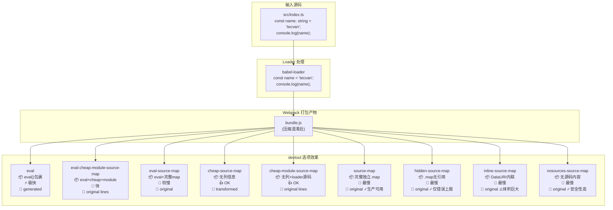
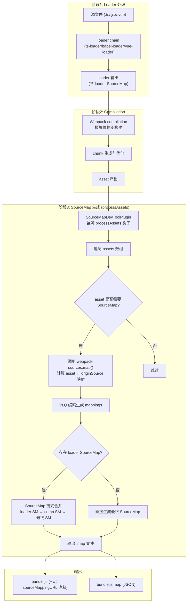

# Sourcemap：源码映射原理与应用技巧

## 差异对照表

| 维度 | v1（原版） | v2（本版） |
|------|-----------|-----------|
| **Webpack 版本** | v5.x 通用 | **v5.107** |
| **devtool 语法** | 仅字符串值 | **支持字符串 + 数组值**（v5.105+，数组项为 `{ type, use }` 对象） |
| **devtool 候选项** | 25 种 | **27+ 种（含组合模式）** |
| **SourceMap 链** | 简要提及 | **完整讲解 loader → compilation → 最终合并流程** |
| **CSS SourceMap** | 未涉及 | **新增 experiments.css 下的 CSS SourceMap** |
| **性能数据** | 定性描述 | **量化构建速度对比表** |
| **可视化** | 无 | **Mermaid 图：devtool 对比图 + 生成合并流程图** |

---

Sourcemap 协议最初由 Google 设计并率先在 Closure Inspector 实现，它的主要作用就是将经过压缩、混淆、合并的产物代码还原回未打包的原始形态，帮助开发者在生产环境中精确定位问题发生的行列位置。

在 Webpack 内部，这段生成 Sourcemap 映射数据的逻辑并不复杂，一句话总结：在 `processAssets` 钩子遍历产物文件 `assets` 数组，调用 `webpack-sources` 提供的 `map` 方法，最终计算出 `asset` 与源码 `originSource` 之间的映射关系。

这个过程真正的难点在于「如何计算映射关系」，因此本文会展开详细讲解 Sourcemap 映射结构与 VLQ 编码规则，以及 Webpack 提供的 `devtool` 配置项的详细用法——包括 **v5.105+ 新增的数组值语法**。

---

## 一、Sourcemap 映射结构

Sourcemap 最初版本生成的 `.map` 文件非常大，体积大概为编译产物的 10 倍；V2 之后引入 Base64 编码等算法，将之减少 20% ~ 30%；而最新版本 V3 又在 V2 基础上引入 VLQ 算法，体积进一步压缩了 50%。

这一系列进化造就了一个效率极高的 Sourcemap 体系，但伴随而来的则是较为复杂的 `mappings` 编码规则。V3 版本 Sourcemap 文件由三部分组成：

- 开发者编写的原始代码；
- 经过 Webpack 压缩、转化、合并后的产物，且产物中必须包含指向 Sourcemap 文件地址的 `//# sourceMappingURL=https://xxxx/bundle.js.map` 指令；
- 记录原始代码与经过工程化处理代码之间位置映射关系的 `.map` 文件。

页面初始运行时只会加载编译构建产物，直到特定事件发生——例如在 Chrome 打开 DevTools 面板时，才会根据 `//# sourceMappingURL` 内容自动加载 Map 文件，并按 Sourcemap 协议约定的映射规则将代码重构还原回原始形态。这既能保证终端用户的性能体验，又能帮助开发者快速还原现场，提升线上问题的定位与调试效率。

### 1.1 Map 文件的 JSON 结构

在 Webpack 中设置 `devtool = 'source-map'` 即可同时打包出代码产物 `xxx.js` 文件与同名 `xxx.js.map` 文件。Map 文件为 JSON 格式，标准结构如下：

```json
{
    "version": 3,
    "sources": [
        "webpack:///./src/index.js"
    ],
    "names": ["name", "console", "log"],
    "mappings": ";;;;;AAAA,IAAMA,IAAI,GAAG,QAAb;AAEAC,OAAO,CAACC,GAAR,CAAYF,IAAZ,E",
    "file": "main.js",
    "sourcesContent": [
        "const name = 'tecvan';\n\nconsole.log(name)"
    ],
    "sourceRoot": ""
}
```

各字段含义：

| 字段 | 类型 | 说明 |
|------|------|------|
| `version` | number | Sourcemap 版本号，当前最新为 **3** |
| `sources` | string[] | 原始文件路径列表，与 `sourcesContent` 一一对应 |
| `names` | string[] | 原始代码中出现的变量名 / 函数名 / 标识符 |
| `mappings` | string | 核心字段，记录产物代码到源码的位置映射（VLQ 编码） |
| `file` | string | 该 Map 对应的编译产物文件名 |
| `sourcesContent` | string[] | 原始文件的完整源码内容 |
| `sourceRoot` | string | 源文件根目录路径前缀 |

使用时，浏览器按照 `mappings` 记录的数值关系，将产物代码映射回 `sourcesContent` 记录的原始文件、行、列位置。这里面最复杂难懂的就是 `mappings` 字段的编码规则。

### 1.2 mappings 的三层结构

对于如下编译前后对应关系：

| 编译前 | 编译后 |
|--------|--------|
| `const name = 'tecvan'; console.log(name)` | `/******/ (() => { var __webpack_exports__ = {}; var name = 'tecvan'; console.log(name); })();` |

当 `devtool = 'source-map'` 时，Webpack 生成的 `mappings` 为：

```text
;;;;;AAAA,IAAMA,IAAI,GAAG,QAAb;AAEAC,OAAO,CAACC,GAAR,CAAYF,IAAZ,E
```

`mappings` 采用**三层嵌套编码**：

#### 第一层：行映射（`;` 分割）

每一个 `;` 对应产物的一行：

```js
[
  '', '', '', '', '',           // 产物第 1-5 行（Webpack runtime，无映射）
  'AAAA,IAAMA,IAAI,GAAG,QAAb', // 产物第 6 行的映射
  'AAEAC,OAAO,CAACC,GAAR,CAAYF,IAAZ,E' // 产物第 7 行的映射
]
```

#### 第二层：片段映射（`,` 分割）

每一行内以 `,` 分割每个代码片段：

```js
[
  ['AAAA', 'IAAMA', 'IAAI', 'GAAG', 'QAAb'],     // 第 6 行各片段
  ['AAEAC', 'OAAO', 'CAACC', 'GAAR', 'CAAYF', 'IAAZ', 'E'] // 第 7 行各片段
]
```

#### 第三层：位置映射（VLQ Base64 编码）

每个片段用 **5 个 VLQ 编码值** 描述位置关系。以 `IAAMA` 为例：

| 位序 | 含义 | 解码值示例 |
|------|------|-----------|
| 第 1 位 | **产物列偏移**（相对前一片段） | `I` → 列 +8 |
| 第 2 位 | **source 文件索引**（指向 `sources[]`） | `A` → sources[0] |
| 第 3 位 | **源码行号**（绝对值） | `A` → 第 0 行 |
| 第 4 位 | **源码列号**（绝对值） | `M` → 第 12 列 |
| 第 5 位 | **names 索引**（指向 `names[]`） | `A` → names[0] |

> **关键点**：片段之间的列偏移是**累加关系**，而非绝对值。例如第六行五个片段的列偏移分别为 `A(0)`, `I(8)`, `I(8)`, `G(6)`, `Q(16)`，实际列位置依次为 0, 8, 16, 22, 38。这种相对偏移设计显著压缩了 mappings 体积。

### 1.3 完整解码示例

以第 6 行 `['AAAA', 'IAAMA', 'IAAI', 'GAAG', 'QAAb']` 为例：

- `AAAA` → `[0, 0, 0, 0, 0]`：产物第 6 行第 **0** 列 → `sources[0]` 第 **0** 行第 **0** 列（即 `var` ↔ `const`）
- `IAAMA` → `[8, 0, 0, 12, 0]`：产物第 6 行第 **8** 列 → `sources[0]` 第 **0** 行第 **12** 列（即 `name` ↔ `name`）

其它片段以此类推。Webpack 在生成 `.map` 时，只需在 `webpack-sources` 库中按此编码规则计算编译前后的代码映射即可。

---

## 二、VLQ 编码详解

[VLQ](https://en.wikipedia.org/wiki/Variable-length_quantity) 是一种将任意大整数转换为 Base64 可见字符的变长编码算法。它先将整数拆分为一系列 6-bit 分组，再按 Base64 映射表转为字符。

### 2.1 单分组编码

每个 6-bit 分组的比特布局：

```text
┌───┬─────────┬───┐
│ C │ DDDD    │ S │
└───┴─────────┴───┘
 C = Continuation（连续标志位，1 表示后续还有分组）
 S = Sign（符号位，0=正，1=负）
 DDDD = 数据位（4 bit，范围 -15 ~ +15）
```

数字 **7** 的编码过程：

```text
十进制 7 → 二进制 00111 → VLQ 分组: 0 0011 1 0 → 即 001110 (二进制) = 14 (十进制)
Base64[14] = 'O'
```

### 2.2 多分组编码

单个分组只能表达 **-15 ~ +15**。超出范围时需拆分为多个分组：

- 最后一个分组的连续标志位 C = 0
- 其余分组的连续标志位 C = 1
- 除末组外，每组有效数据位扩展为 **5 bit**

**示例：-17**

```text
17 的二进制: 10001 (5位)
拆分: [1][0001] → 两组
第一组: C=1, 数据=0001, S=1 → 100011 → 'j'
第二组: C=0, 数据=00001       → 000001 → 'B'
结果: "jB"
```

**示例：1200**

```text
1200 的二进制: 10010110000 (11位)
从后向前每5位一组: [00000][01011][00010]
第一组: C=1, 数据=00000, S=0 → 100000 → 'g'
第二组: C=1, 数据=01011       → 101011 → 'r'
第三组: C=0, data=00010       → 000010 → 'C'
结果: "grC"
```

### 2.3 Base64 变量索引表

```text
 A   B   C   D   E   F   G   H   I   J   K   L   M
 0   1   2   3   4   5   6   7   8   9  10  11  12

 N   O   P   Q   R   S   T   U   V   W   X   Y   Z
13  14  15  16  17  18  19  20  21  22  23  24  25

 a   b   c   d   e   f   g   h   i   j   k   l   m
26  27  28  29  30  31  32  33  34  35  36  37  38

 n   o   p   q   r   s   t   u   v   w   x   y   z
39  40  41  42  43  44  45  46  47  48  49  50  51

 0   1   2   3   4   5   6   7   8   9   +   /
52  53  54  55  56  57  58  59  60  61  62  63
```

---

## 三、`devtool` 规则详解（v5.105+ 更新）

Webpack 提供两种设置 Sourcemap 的方式：

1. **`devtool` 配置项**：使用规则短语（推荐大多数场景）
2. **插件方式**：直接使用 `SourceMapDevToolPlugin` 或 `EvalSourceMapDevToolPlugin`（深度定制场景）

### 3.1 关键字组合体系

`devtool` 的所有枚举值均由以下 **7 种关键字** 组合而成：

| 关键字 | 效果 | 适用场景 |
|--------|------|---------|
| `eval` | 模块代码用 `eval()` 执行，通过 `sourceURL` 关联 | 开发环境，追求构建速度 |
| `source-map` | 生成独立的 `.map` 文件 | 生产环境 / 需要完整映射 |
| `cheap` | 舍弃**列**维度信息，只保留行级映射 | 不需要精确到列的场景 |
| `module` | （仅配合 cheap 使用）映射到 **loader 处理前的原始源码** | 需要 TS/JSX 等转译前源码 |
| `nosources` | 移除 `sourcesContent`，不暴露源码正文 | 生产环境安全需求 |
| `inline` | 将 `.map` 内容以 Data URI 内联到产物中 | 单文件发布场景 |
| `hidden` | 生成 `.map` 但不在产物中添加引用注释 | 仅用于错误上报（如 Sentry） |

> **v5.105+ 新增**：`devtool` 支持**数组值**，可为不同产物类型（`all` / `javascript` / `css`）分别指定策略；数组项为 `{ type, use }` 对象而非字符串：
>
> ```js
> module.exports = {
>   // JavaScript 产物用 eval 系加速开发构建，CSS 产物生成独立 .map
>   devtool: [
>     { type: 'javascript', use: 'eval-cheap-module-source-map' },
>     { type: 'css', use: 'source-map' }
>   ]
> };
> ```

### 3.2 devtool 各选项效果对比



### 3.3 完整选项速查表

| devtool | 首次构建 | 增量重建 | 可用于生产 | 映射质量 | 推荐场景 |
|---------|----------|----------|-----------|---------|---------|
| `(none)` | 🚀最快 | 🚀最快 | ✅ | bundle（无映射） | 生产环境最高性能 |
| `eval` | 🚀快 | 🚀最快 | ❌ | generated | 开发环境极速体验 |
| `eval-cheap-source-map` | 👍OK | 🚀快 | ❌ | transformed | 开发折中选择 |
| `eval-cheap-module-source-map` | 🐌慢 | 🚀快 | ❌ | original lines | 开发折中选择 |
| `eval-source-map` | 🐌最慢 | 👍OK | ❌ | original | 开发高质量调试 |
| `cheap-source-map` | 👍OK | 🐌慢 | ❌ | transformed | - |
| `cheap-module-source-map` | 🐌慢 | 🐌慢 | ❌ | original lines | - |
| `source-map` | 🐌最慢 | 🐌最慢 | ✅ | original | **生产环境首选** |
| `hidden-source-map` | 🐌最慢 | 🐌最慢 | ✅ | original | Sentry 错误上报 |
| `nosources-source-map` | 🐌最慢 | 🐌最慢 | ✅ | original | 高安全要求的生产环境 |
| `inline-source-map` | 🐌最慢 | 🐌最慢 | ❌ | original | 单文件发布 |
| `inline-cheap-source-map` | 👍OK | 🐌慢 | ❌ | transformed | - |
| `inline-cheap-module-source-map` | 🐌慢 | 🐌慢 | ❌ | original lines | - |
| *(以上 + nosources)* | 同左 | 同左 | 部分 | 同左 | 不暴露源码正文 |
| *(以上 + hidden)* | 同左 | 同左 | 同左 | 同左 | 不自动加载 .map |

### 3.4 各关键字详细说明

#### `eval` 关键字

当 `devtool` 包含 `eval` 时，模块代码被包裹进 `eval()` 函数，Sourcemap 通过 `//# sourceURL` 挂载：

```js
eval("var foo = 'bar'\n\n\n//# sourceURL=webpack:///./src/index.ts?")
```

特点：构建速度极快，但产物直接包含映射信息，**仅适合开发环境**。

#### `source-map` 关键字

核心关键字，触发 `.map` 文件生成。除纯 `eval` 外的所有选项都隐含此关键字。

#### `cheap` 关键字

舍弃**列**维度，mappings 大幅简化：

```json
{
  "mappings": "AAAA"          // cheap：每行只有一个片段
  // vs
  "mappings": "AACAA,QAAQC,IADI"  // 完整：精确到列
}
```

浏览器只能定位到**行级别**：

#### `module` 关键字（仅配合 `cheap` 生效）

决定映射目标为 **loader 处理前的源码**还是处理后的代码：

| devtool | sourcesContent 映射目标 |
|---------|----------------------|
| `cheap-source-map` | babel-loader 输出（转译后） |
| `cheap-module-source-map` | **原始 TS 源码**（转译前） |

#### `nosources` 关键字

移除 `sourcesContent` 字段，`.map` 中只保留文件名、mappings、变量名等元信息：

```json
{
  "version": 3,
  "sources": ["webpack:///./src/index.ts"],
  "names": ["console", "log"],
  "mappings": "AACAA,QAAQC,IADI",
  "file": "bundle.js",
  "sourceRoot": ""
}
```

适用于生产环境配合 Sentry 等平台做异地堆栈还原，不向浏览器暴露源码。

#### `inline` 关键字

将 `.map` 以 Base64 Data URI 直接嵌入产物尾部：

```js
console.log("bar");
//# sourceMappingURL=data:application/json;charset=utf-8;base64,eyJ2ZXJzaW9uIjoz...
```

产物体积膨胀严重，**仅适合单文件发布或开发调试**。

#### `hidden` 关键字

生成 `.map` 但产物中**不含** `//# sourceMappingURL=` 引用注释：

| `hidden-source-map` | `source-map` |
|---------------------|--------------|
| 产物末尾**无**引用注释 | 产物末尾有 `//# sourceMappingURL=bundle.js.map` |

适用于只需 `.map` 用于错误上报（如 Sentry），而不希望浏览器 DevTools 自动加载的场景。

### 3.5 场景推荐汇总

**开发环境**：

| 追求目标 | 推荐 devtool | 理由 |
|---------|-------------|------|
| 极致速度 | `eval` | 构建最快，但只能看到生成代码结构 |
| 速度与质量平衡 | `eval-cheap-module-source-map` | 能看到原始源码，不含列信息 |
| 最高调试质量 | `eval-source-map` | 完整映射，首次构建较慢 |

**生产环境**：

| 安全需求 | 推荐 devtool | 理由 |
|---------|-------------|------|
| 完整调试能力 | `source-map` | 信息最完整，注意源码泄露风险 |
| 错误上报专用 | `hidden-source-map` | 有 .map 但不自动加载 |
| 高安全要求 | `nosources-source-map` | 不含源码正文，配合 Sentry 还原 |

---

## 四、SourceMap 生成与合并流程

### 4.1 Webpack 内部生成流程



### 4.2 SourceMap 链式合并

在实际项目中，SourceMap 往往经历**多级转换**：

```text
原始 TS 源码
    ↓ ts-loader (生成 SourceMap #1)
转译后的 JS
    ↓ babel-loader (生成 SourceMap #2，基于 #1)
转译后的 JS (ES5)
    ↓ Webpack concat/minify (生成 SourceMap #3，基于 #2)
最终产物 + 最终 SourceMap
```

Webpack 使用 `source-map` 库的 `SourceMapConsumer` / `SourceMapGenerator` API 进行链式合并：

```js
// 伪代码示意（webpack-sources 内部逻辑）
const mergedMap = sourceMap.SourceMapGenerator.fromSourceMap(
  new sourceMap.SourceMapConsumer(loaderSourceMap)
);
mergedMap.applySourceMap(compilationSourceMap);
return mergedMap.toString();
```

### 4.3 CSS SourceMap（experiments.css）

Webpack 5 启用 `experiments.css` 后，CSS 模块作为原生 asset 处理，SourceMap 生成行为有所不同：

```js
module.exports = {
  experiments: {
    css: true
  },
  devtool: 'source-map',
  module: {
    rules: [{
      test: /\.css$/,
      type: 'css/export',  // 或 'css/global'
      parser: { exportType: 'style' }  // 或 'link'
    }]
  }
};
```

| exportType | SourceMap 行为 |
|-----------|---------------|
| `'style'` | CSS 通过 JS `<style>` 标签注入，SourceMap 由 runtime 管理 |
| `'link'` | CSS 作为独立文件输出，附带独立 `.css.map` 文件 |

---

## 五、性能影响分析

不同 `devtool` 选项对构建性能的影响差异显著（下表为相对量级示意，非官方基准数据，具体数值因项目而异）：

| devtool | 首次构建耗时（相对值） | 重建耗时（相对值） | .map 体积占比 |
|---------|---------------------|------------------|-------------|
| `(none)` | 1.0x | 1.0x | 0% |
| `eval` | 1.2x | 1.05x | ~5%（内联于 eval） |
| `eval-cheap-module-source-map` | 1.5x | 1.2x | ~15% |
| `eval-source-map` | 2.0x | 1.5x | ~40% |
| `cheap-module-source-map` | 1.8x | 1.8x | ~20% |
| `source-map` | 2.5x | 2.5x | ~100%（独立文件） |
| `inline-source-map` | 2.8x | 2.8x | N/A（内联于产物） |

> **结论**：开发环境优先选择 `eval-*` 系列；生产环境若必须用 `source-map`，建议配合 CI/CD 流程将 `.map` 文件上传至 Sentry 等平台后从部署包中移除。

---

## 六、使用 SourceMap 插件深度定制

`devtool` 本质上是 `SourceMapDevToolPlugin` 与 `EvalSourceMapDevToolPlugin` 的便捷别名。插件提供更细粒度的控制：

```js
const webpack = require('webpack');

module.exports = {
  devtool: false,  // 禁用内置 devtool
  plugins: [
    new webpack.SourceMapDevToolPlugin({
      test: /\.(js|ts)$/,           // 匹配需要生成 SourceMap 的文件
      include: /src/,               // 只处理 src 目录
      exclude: [/vendor/, /node_modules/],  // 排除第三方库
      filename: '[file].map',       // .map 文件命名模板
      append: '\n//# sourceMappingURL=[url]',  // 引用注释格式
      moduleFilenameTemplate: 'webpack://[absolute-resource-path]',
      publicPath: 'https://cdn.example.com/sourcemaps/',
      noSources: false,
      columns: true
    })
  ]
};
```

**常用配置项**：

| 参数 | 类型 | 说明 |
|------|------|------|
| `test` | RegExp | 匹配需生成 SourceMap 的 asset 文件名 |
| `include` | RegExp | 限定处理的目录范围 |
| `exclude` | RegExp | 排除不需要的文件（如 vendor） |
| `filename` | string | `.map` 文件名模板，支持 `[file]`, `[hash]` 等占位符 |
| `publicPath` | string | `.map` 文件的公开访问 URL 前缀 |
| `noSources` | boolean | 等同于 `nosources` 关键字 |
| `columns` | boolean | 是否包含列信息（false = cheap） |

---

## 七、最佳实践清单

1. **开发环境**：`devtool: 'eval-cheap-module-source-map'` —— 兼顾速度与源码可读性
2. **生产环境（需调试）**：`devtool: 'source-map'` + CI 上传 `.map` 至 Sentry 后删除
3. **生产环境（高安全）**：`devtool: 'nosources-source-map'` + Sentry 异地还原
4. **单文件组件/库发布**：`devtool: 'inline-source-map'`（注意体积）
5. **错误监控专用**：`devtool: 'hidden-source-map'` + 手动上传 `.map`
6. **排除大型 vendor**：使用 `SourceMapDevToolPlugin` 的 `exclude` 过滤第三方库
7. **v5.105+ 组合模式**：`devtool: [{ type: 'javascript', use: 'eval-cheap-module-source-map' }, { type: 'css', use: 'source-map' }]` 为不同产物类型分别指定

---

## 总结

Sourcemap 是一种高效的位置映射算法，它通过 **mappings 三层分层设计** 与 **VLQ Base64 变长编码**，将产物到源码之间的位置关系紧凑表达，再通过 Chrome DevTools、VS Code、Sentry 等工具异地还原为接近开发状态的源码形式。

在 Webpack 5.107 中，通常只需要选择适当的 `devtool` 短语即可满足大多数场景需求。**v5.105+ 新增的数组值语法**允许为 JavaScript/CSS 等不同产物类型分别指定 SourceMap 策略，为复杂工程场景提供了更大灵活性。特殊情况下也可以直接使用 `SourceMapDevToolPlugin` 做更深度的定制化。

## 思考题

1. 为什么 Sourcemap 要设计三层结构 + VLQ 编码做行列映射？假设直接记录 `{line, column}` 绝对坐标对，会有什么问题？
2. `devtool: [{ type: 'javascript', use: 'eval-cheap-module-source-map' }, { type: 'css', use: 'source-map' }]` 这种数组值语法的典型使用场景是什么？它和单一值相比有什么优势？
3. 在 monorepo 项目中，如何合理配置 `SourceMapDevToolPlugin` 的 `publicPath` 来统一管理跨包的 SourceMap？
