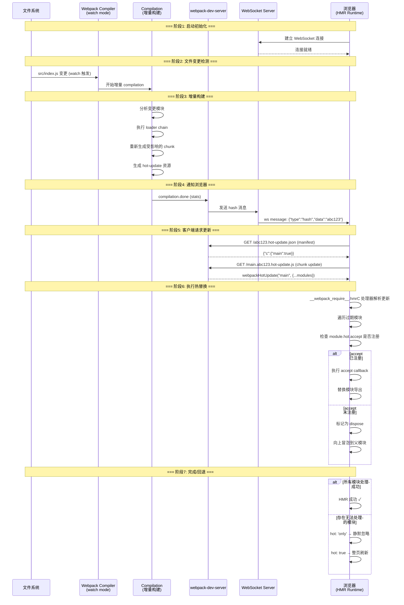
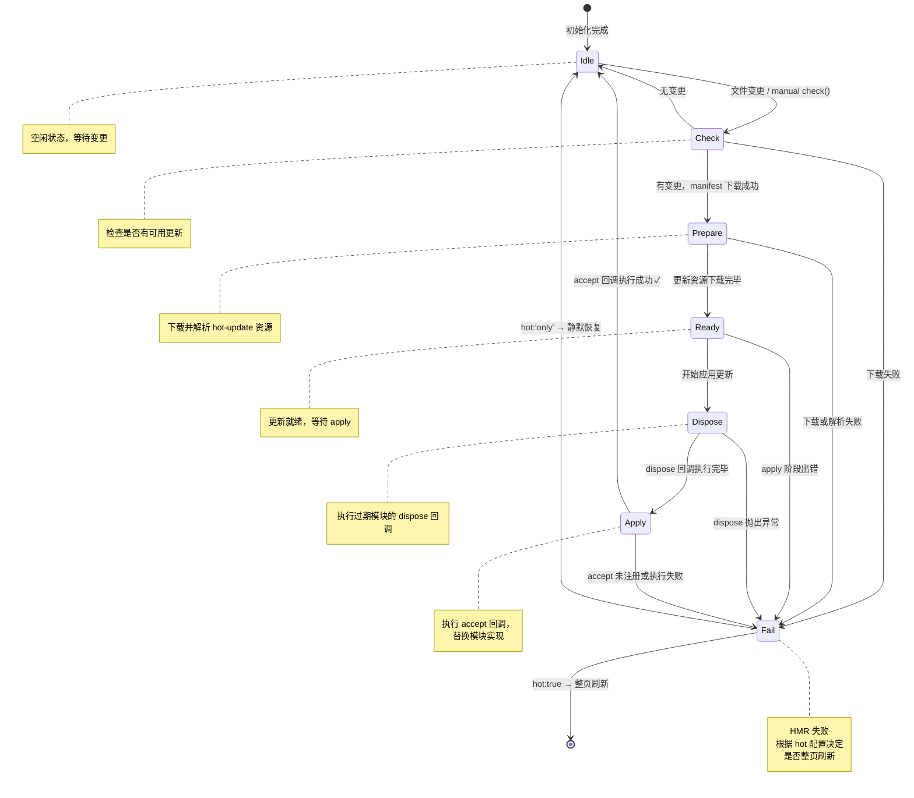
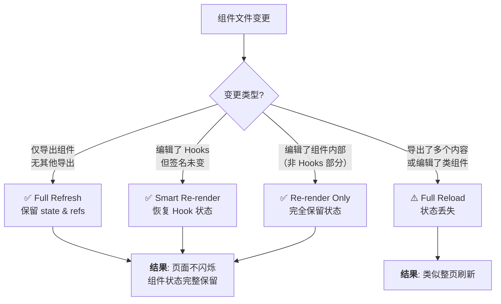

# HMR：如何动态替换页面代码？

## 差异对照表

| 维度 | v1（原版） | v2（本版） |
|------|-----------|-----------|
| **Webpack 版本** | v5.x 通用 | **v5.107** |
| **HMR 流程** | 概述性流程图 | **完整时序图（文件变更→页面更新全链路）** |
| **HMR API** | 仅 accept / dispose | **完整 API 体系 + 状态机图** |
| **运行时细节** | 简要提及 | **`__webpack_require__.hmrM/hmrC/hmrD` 内部实现** |
| **CSS HMR** | 未涉及 | **style-loader HMR vs experiments.css 原生 HMR** |
| **React Fast Refresh** | 未涉及 | **react-refresh-webpack-plugin 完整解析** |
| **WDS 配置** | 仅 `hot: true` | **hot:'only' / liveReload / devMiddleware 全配置** |
| **WebSocket 协议** | 仅 hash 事件 | **完整消息类型与数据格式** |
| **可视化** | 无 | **Mermaid 图：时序图 + 状态机图** |

---

HMR 全称 Hot Module Replacement（模块热替换），最初由 Webpack 设计实现，至今已几乎成为现代前端工程化必备能力之一。它能够在**保持页面状态不变**的情况下动态替换、删除、添加代码模块，提供丝滑顺畅的开发体验。

### 为什么需要 HMR？

在 HMR 出现之前，应用代码的更新是一种**页面级原子操作**——即使只改了一个字符，也需要刷新整个页面：

- 复杂表单场景 → 所有已填字段清空
- 弹窗/对话框消失 → 必须重新触发交互
- 路由状态丢失 → 需要重新导航

引入 HMR 后，大多数小改动都可以通过**模块粒度的热替换**更新到页面上，确保连续、顺畅的开发调试体验。

---

## 一、HMR 基础使用

### 1.1 快速启动

Webpack 生态下启动 HMR 只需两步：

**第一步**：配置 `devServer.hot`

```js
// webpack.config.js
const path = require('path');

module.exports = {
  mode: 'development',
  entry: './src/index.js',
  devServer: {
    hot: true,   // 启用 HMR
    // v5.107 推荐写法：
    // hot: 'only'  // HMR 失败时不回退到整页刷新
  },
};
```

**第二步**：在业务代码中调用 `module.hot.accept()` 声明热替换逻辑

```js
import component from "./component";
let demoComponent = component();

document.body.appendChild(demoComponent);

if (module.hot) {
  module.hot.accept("./component", () => {
    const nextComponent = component();
    document.body.replaceChild(nextComponent, demoComponent);
    demoComponent = nextComponent;
  });
}
```

> `module.hot` 是 Webpack HMR 运行时注入到每个模块的全局对象，仅在启用了 HMR（如 `devServer.hot: true`）的构建中存在。生产构建（未启用 HMR）时该对象为 `undefined`，因此 `if (module.hot)` 兼容判断是安全且推荐的做法。

### 1.2 devServer 相关配置（v5.107）

```js
module.exports = {
  devServer: {
    hot: 'only',       // 'true' | 'false' | 'only'
                       // 'only': HMR 失败时不刷新页面（推荐）
    liveReload: false, // 禁用 liveReload（当 hot: 'only' 时建议关闭）

    // devMiddleware 配置
    devMiddleware: {
      writeToDisk: true,  // 将产物写入磁盘（调试用）
    },

    // WebSocket 配置
    client: {
      logging: 'warn',     // 控制台日志级别
      overlay: {           // 编译错误覆盖层
        errors: true,
        warnings: false
      },
      progress: true,      // 显示编译进度
    },

    // WDS 内部使用
    webSocketServer: 'ws', // WebSocket 实现
  }
};
```

| 配置项 | 值 | 说明 |
|--------|-----|------|
| `hot` | `true` | 启用 HMR，失败时回退到整页刷新 |
| `hot` | `'only'` | 启用 HMR，失败时**不刷新**（静默） |
| `hot` | `false` | 禁用 HMR |
| `liveReload` | `true/false` | 文件变更后是否整页刷新（与 HMR 互补） |

---

## 二、HMR 完整工作流

### 2.1 从文件变更到页面更新的全链路



### 2.2 各阶段详解

#### 阶段 1-2：启动与监听

执行 `npx webpack serve` 后：

1. **`webpack-dev-server`** 启动本地 HTTP 服务（默认 `localhost:8080`）
2. **`HotModuleReplacementPlugin`** 向主 chunk 注入 HMR Runtime 代码
3. **Compiler 进入 watch 模式**，通过 `watchpack` 监听文件变化
4. 浏览器加载页面后，HMR Runtime 自动建立 **WebSocket 连接**

#### 阶段 3：增量构建

文件变更后，Webpack 执行**增量 compilation**（而非全量重建）：

- 仅重新编译发生变化的模块及其依赖链
- 输出两类热更新资源：

| 资源 | 文件名格式 | 内容 |
|------|-----------|------|
| Manifest | `[hash].hot-update.json` | 本轮更新的 chunk 列表 |
| Chunk Update | `[chunkname].[hash].hot-update.js` | 更新后的模块代码 |

> **注意**：热更新以 **chunk 为单位**。同一 chunk 下任意文件变更只会生成一个 `.hot-update.js` 文件。

Manifest 示例：

```json
{
  "c": {
    "main": true
  },
  "r": 0,
  "h": "abc123def456"
}
```

Chunk Update 示例（实际是可执行的 JS）：

```js
webpackHotUpdate("main", {
  "./src/index.js": (module, exports, require) => {
    eval("const name = 'updated';\nconsole.log(name);\n//# sourceURL=webpack:///./src/index.js?");
  }
});
```

#### 阶段 4：WebSocket 通信协议

WDS 通过 WebSocket 向客户端推送消息。v5.107 支持以下消息类型：

| type | data | 说明 |
|------|------|------|
| `hash` | `{string}` 新 hash | 通知客户端有新的构建产出 |
| `ok` | - | 编译成功（无错误） |
| `errors` | `{string[]}` 错误列表 | 编译失败 |
| `warnings` | `{string[]}` 警告列表 | 编译有警告 |
| `static-changed` | - | 静态资源变更（liveReload） |

**核心消息——hash**：

```json
{"type": "hash", "data": "abc123def456789"}
```

客户端收到 hash 后，以此值作为版本标识去请求后续的热更新资源。

#### 阶段 5-6：下载与执行更新

```js
// HMR Runtime 内部逻辑（简化）
function hotCheck(hash) {
  // 1. 请求 manifest
  fetch(`/${hash}.hot-update.json`)
    .then(r => r.json())
    .then(manifest => {
      const chunkIds = Object.keys(manifest.c);
      return Promise.all(
        chunkIds.map(id => fetch(`/${id}.${hash}.hot-update.js`))
      );
    })
    .then(responses => {
      // 2. 执行 hot-update 脚本，调用 webpackHotUpdate()
      responses.forEach(r => r.text().then(eval));
    });
}

// webpackHotUpdate 全局函数（由 hot-update.js 调用）
function webpackHotUpdate(chunkId, modules) {
  for (const moduleId in modules) {
    // 3. 将新模块代码注册到模块缓存
    __webpack_modules__[moduleId] = modules[moduleId];
  }
  // 4. 触发 HMR 处理流程
  __webpack_require__.hmrC[chunkId]( /* 下载更新处理器 */ );
}
```

#### 阶段 7：accept / dispose 回调

这是 HMR 的**核心决策点**——决定模块能否被安全替换：

```js
if (module.hot) {
  module.hot.accept(() => {
    // 模块自身变更时的回调（无参数形式）
  });

  module.hot.dispose((data) => {
    // 模块即将被移除前的清理回调
    // data 对象会传递给下一个 accept 回调
    data.someState = preserveState();
  });

  module.hot.decline();  // 明确声明此模块不支持 HMR
}
```

---

## 三、HMR API 完整参考

### 3.1 API 总览

| API | 签名 | 说明 |
|-----|------|------|
| `accept` | `(deps?, callback?)` | 接受模块变更，执行热替换 |
| `dispose` | `(callback)` | 模块卸载前清理资源 |
| `decline` | `()` | 声明拒绝热替换 |
| `invalidate` | `()` | 标记当前模块为过期，下次 tick 重新执行 |
| `status` | `()` | 获取当前 HMR 状态 |
| `check` | `(callback?)` | 手动触发热更新检查 |
| `addDisposeHandler` | `(callback)` | 注册清理处理器 |
| `addStatusHandler` | `(callback)` | 注册状态变更监听器 |
| `removeStatusHandler` | `(callback)` | 移除状态监听器 |

### 3.2 核心API详解

#### `module.hot.accept(dependencies, callback)`

三种调用形式：

```js
// 形式1：接受自身变更
module.hot.accept(() => {
  console.log('自身模块已更新，从头重新执行');
});

// 形式2：接受指定依赖的变更
module.hot.accept('./dependency', () => {
  const updatedDep = require('./dependency');
  // 使用最新的 dependency 重新渲染
});

// 形式3：接受多个依赖的变更
module.hot.accept(['./dep1', './dep2'], () => {
  // dep1 或 dep2 任一变更时触发
});
```

**事件冒泡规则**：`accept` 只能捕获**子孙模块**的更新事件，沿依赖树自底向上传递：

```text
index.js ──→ foo.js ──→ foo-child.js
   │
   └───→ bar.js ──→ bar-1.js
                   └──→ bar-2.js
```

- 在 `foo.js` 可以捕获 `foo-child.js` 的变更 ✅
- 在 `bar.js` 可以捕获 `bar-1.js` 和 `bar-2.js` 的变更 ✅
- 在 `index.js` 可以捕获所有子模块的变更 ✅
- 在 `foo.js` **不能**捕获 `bar.js` 子树的变更 ❌
- 在 `bar-1.js` **不能**捕获 `bar.js` 自身的变更 ❌

> **实践建议**：拿不准依赖关系时，直接在入口文件编写 `accept` 逻辑最稳妥。

#### `module.hot.dispose(callback)`

在模块被替换前执行清理操作，支持**跨生命周期传参**：

```js
let timerId = null;
let componentState = {};

if (module.hot) {
  // 初始化
  timerId = setInterval(updateData, 1000);
  componentState = loadInitialState();

  module.hot.dispose((data) => {
    // 清理副作用
    clearInterval(timerId);
    // 将状态传递给下一个版本的模块
    data.state = componentState;
  });

  module.hot.accept();

  // 新版模块重新执行时，从 module.hot.data 恢复 dispose 阶段保存的状态
  // （注意：accept 回调本身不接收 data 参数）
  if (module.hot.data && module.hot.data.state) {
    componentState = module.hot.data.state;
  }
}
```

#### 其他重要 API

```js
// decline: 明确拒绝 HMR（强制整页刷新此模块变更时）
module.hot.decline();

// invalidate: 使当前模块"过期"，下次 check 时重新执行
// 用于异步依赖更新的场景
module.hot.invalidate();

// status: 获取当前 HMR 状态
const currentStatus = module.hot.status();
// 可能返回: 'idle' | 'check' | 'prepare' | 'ready' | 'dispose' | 'apply' | 'fail'

// check: 手动触发一轮 HMR 检查（Webpack 5 返回 Promise）
module.hot
  .check(false) // false = 不跳过 idle 状态检查
  .then((outdatedModules) => console.log('outdated:', outdatedModules))
  .catch((err) => console.error('HMR check failed:', err));

// addStatusHandler: 监听状态流转
module.hot.addStatusHandler((status) => {
  console.log('HMR status:', status);
});
```

### 3.3 HMR 状态机



**各状态说明**：

| 状态 | 含义 | 可执行的操作 |
|------|------|------------|
| `idle` | 空闲，等待变更 | `check()` |
| `check` | 正在检查是否有更新 | （等待中） |
| `prepare` | 正在下载和准备更新资源 | （等待中） |
| `ready` | 更新资源已就绪 | （等待中） |
| `dispose` | 正在执行 dispose 回调 | （等待中） |
| `apply` | 正在执行 accept 回调 | （等待中） |
| `fail` | HMR 过程失败 | 恢复到 idle 或刷新 |

---

## 四、HMR 运行时内部实现

### 4.1 关键运行时变量

Webpack 5 HMR Runtime 注入两个核心变量到 bundle 中：

```js
// 下载 hot-update manifest 的处理器列表（hmrDownloadManifest）
__webpack_require__.hmrM = {};
// 下载更新脚本后按 chunk 执行的处理器列表（hmrDownloadUpdateHandlers）
__webpack_require__.hmrC = {};
// 所有模块的 HMR 元数据（hmrModuleData，记录过期模块、dispose 数据等）
__webpack_require__.hmrD = {};
// manifest 文件名生成函数（getUpdateManifestFilename）
__webpack_require__.hmrF = () => {};  // 返回 "<hash>.hot-update.json"
```

### 4.2 热更新核心流程源码解读

以下是 HMR Runtime 中最关键的 `hotApply` 函数的逻辑框架（基于 Webpack 5.107 源码简化重写，省略了队列调度与错误聚合细节，`getModulesToUpdate` / `invalidModules` 为省略的辅助逻辑）：

```js
function hotApply(options) {
  // 1. 收集所有过期模块（hotUpdateModules 为本轮更新携带的模块表，示意）
  const outdatedModules = [];
  const outdatedDependencies = {};

  for (const id in hotUpdateModules) {
    const meta = __webpack_require__.hmrD[id];
    if (meta) {
      outdatedModules.push(id);
      // 记录哪些模块依赖于这个过期模块
      for (const depId in meta.requireDeprecations || {}) {
        (outdatedDependencies[depId] =
          outdatedDependencies[depId] || []).push(id);
      }
    }
  }

  // 2. 执行 dispose 阶段
  const disposeHandlers = [];
  for (let i = 0; i < outdatedModules.length; i++) {
    const id = outdatedModules[i];
    const module = installedModules[id];
    if (module && module.hot._disposeHandlers) {
      for (let j = 0; j < module.hot._disposeHandlers.length; j++) {
        disposeHandlers.push({
          handler: module.hot._disposeHandlers[j],
          error: undefined
        });
      }
    }
  }

  // 3. 按 ID 逆序执行 dispose（子模块先于父模块）
  const idxToDispose = outdatedModules.slice().reverse();
  for (let j = 0; j < idxToDispose.length; j++) {
    const moduleId = idxToDispose[j];
    const module = installedModules[moduleId];
    if (module) {
      const data = {};
      module.hot._disposeHandlers.forEach(fn => fn(data));
      module.hot.data = data;  // 保存供 accept 使用
    }
    delete installedModules[moduleId];  // 从缓存移除
  }

  // 4. 执行 accept 阶段 —— 冒泡查找 accept handler
  let acceptanceResult;
  for (const moduleId of getModulesToUpdate(outdatedDependencies)) {
    const module = installedModules[moduleId];
    if (module && module.hot._acceptHandlers &&
        module.hot._acceptHandlers.length > 0) {
      acceptanceResult = {
        accepted: true,
        moduleId: moduleId
      };
      break;  // 找到第一个 accept 就停止冒泡
    }
  }

  // 5. 如果没有找到 accept handler
  if (!acceptanceResult || !acceptanceResult.accepted) {
    if (options.ignoreUnaccepted) {
      // hot: 'only' 模式，静默忽略
      return Promise.resolve();
    } else {
      // hot: true 模式，触发整页刷新
      window.location.reload();
    }
  }

  // 6. 执行 accept callback
  const module = installedModules[acceptanceResult.moduleId];
  if (module && module.hot._acceptHandlers) {
    module.hot._acceptHandlers.forEach(fn => fn());
  }

  // 7. 重新执行被标记为 invalid 的模块
  for (const id of invalidModules) {
    __webpack_require__(id);  // 重新 require 会执行新代码
  }
}
```

---

## 五、各类资源的 HMR 实现

### 5.1 CSS HMR

#### style-loader 的 HMR 实现

传统方式下，`style-loader` 通过 JS 注入 `<style>` 标签来处理 CSS，其 HMR 实现非常巧妙：

```js
// style-loader 注入的运行时代码（简化）
let stylesInDom = [];
const moduleIdToStyle = new Map();

if (module.hot) {
  module.hot.accept();

  // 当 CSS 模块变更时
  module.hot.dispose((data) => {
    // 找到旧的 <style> 标签并移除
    const oldStyle = moduleIdToStyle.get(module.id);
    if (oldStyle && oldStyle.parentNode) {
      oldStyle.parentNode.removeChild(oldStyle);
    }
    moduleIdToStyle.delete(module.id);
  });

  // style-loader 的 HMR 不需要显式 accept callback
  // 因为它使用了 module.hot.accept() 无参形式
  // 模块重新执行时会自动创建新的 <style> 标签
}
```

**原理**：CSS 模块变更 → `module.hot.accept()` 无参调用 → 模块从头重新执行 → 先 dispose 移除旧 `<style>` 标签 → 再执行新代码插入新的 `<style>` 标签。

#### experiments.css 原生 CSS HMR（v5 新特性）

启用 `experiments.css` 后，CSS 作为原生 asset 类型处理：

```js
module.exports = {
  experiments: {
    css: true
  },
  module: {
    rules: [{
      test: /\.css$/,
      type: 'css/export',
      parser: {
        exportType: 'style'  // 或 'link'
      }
    }]
  }
};
```

| exportType | HMR 行为 | 适用场景 |
|-----------|---------|---------|
| `'style'` | 通过 runtime 管理 `<style>` 标签的增删改 | 开发环境 |
| `'link'` | 生成独立 `.css` 文件，通过 `<link>` 标签引用 | 生产环境 / 需要 CSS 提取 |

原生 CSS 模块的 HMR 由 Webpack 内置的 CSS runtime 直接管理，无需 style-loader 介入。

### 5.2 Vue SFC 的 HMR（vue-loader）

[`vue-loader`](https://vue-loader.vuejs.org/) 为 Vue 单文件组件（SFC）实现了精细化的 HMR：

```js
// vue-loader 注入的 HMR 代码（简化版）
if (module.hot) {
  const api = __webpack_require__('vue-hot-reload-api');
  api.install(__webpack_require__('vue'));

  if (api.compatible) {
    // 1. 接受 script 部分的变更
    module.hot.accept();
    if (!api.isRecorded(componentId)) {
      api.createRecord(componentId, componentOptions);
    } else {
      api.reload(componentId, componentOptions);  // 销毁+重建实例
    }

    // 2. 接受 template 部分的变更
    module.hot.accept(
      '!!./a.vue?vue&type=template&id=xxx&',
      () => {
        api.rerender(componentId, {
          render: templateModule.render,
          staticRenderFns: templateModule.staticRenderFns
        });  // 仅重新渲染，不销毁实例
      }
    );
  }
}
```

关键点：

- **script 变更** → `api.reload()` → 销毁旧实例 + 创建新实例（状态丢失）
- **template 变更** → `api.rerender()` → 保持实例，仅重新渲染（**状态保留** ✅）

> 为什么需要两次 `accept`？因为 vue-loader 将 SFC 的 `<template>` 和 `<script>` 拆分为**独立的 Webpack 模块**，各自需要单独注册 HMR 处理。

### 5.3 React Fast Refresh

[React Fast Refresh](https://github.com/facebook/react/tree/main/packages/react-refresh) 是 React 官方的热替换方案，比传统的 `react-hot-loader` 性能更好、体验更顺滑。

**集成方式**（v5.107 推荐）：

```js
// webpack.config.js
const ReactRefreshWebpackPlugin = require('@pmmmwh/react-refresh-webpack-plugin');

module.exports = {
  mode: 'development',
  plugins: [
    new ReactRefreshWebpackPlugin({
      overlay: {
        sockIntegration: 'wds',  // 与 webpack-dev-server 集成
      },
    }),
  ],
  module: {
    rules: [
      {
        test: /\.[jt]sx?$/,
        exclude: /node_modules/,
        use: [
          {
            loader: 'babel-loader',
            options: {
              plugins: [
                // 开发环境才启用
                require.resolve('react-refresh/babel'),
              ].filter(Boolean),
            },
          },
        ],
      },
    ],
  },
};
```

**Fast Refresh vs 传统 HMR**：

| 维度 | 传统 HMR (`react-hot-loader`) | Fast Refresh |
|------|------------------------------|-------------|
| 组件状态保留 | ❌ 大部分情况丢失 | ✅ **智能保留** |
| 编辑 hooks 时 | ❌ 需要整页刷新 | ✅ **自动恢复** |
| 编辑函数组件 | ⚠️ 有状态丢失风险 | ✅ **完美保留** |
| 编辑类组件 | ⚠️ 不支持 | ⚠️ 不支持 |
| only: false 时 | 整页刷新 | **仅重渲染组件** |
| 性能开销 | 较高 | **极低** |

**Fast Refresh 核心原理**：



---

## 六、HMR 常见问题与排查

### 6.1 HMR 不生效的常见原因

| 现象 | 原因 | 解决方案 |
|------|------|---------|
| 改代码后整页刷新 | 未写 `module.hot.accept()` | 添加 accept 回调 |
| 改代码后无反应 | `hot: 'only'` + 未 accept 且无报错提示 | 改为 `hot: true` 或添加 accept |
| CSS 修改不生效 | 使用 `mini-css-extract-plugin` | 开发环境改用 `style-loader` 或 `experiments.css` |
| Vue 组件修改丢失状态 | 修改了 `<script>` 部分 | 这是预期行为；尽量只改 `<template>` |
| React 组件修改丢失状态 | 未配置 Fast Refresh | 安装 `react-refresh-webpack-plugin` |
| WSS 连接失败 | 代理配置问题 | 检查 `devServer.proxy` 和防火墙 |

### 6.2 调试技巧

```js
// 在入口文件添加 HMR 状态监控
if (module.hot) {
  module.hot.addStatusHandler((status) => {
    console.log('[HMR]', status);
  });

  module.hot
    .check(false)
    .then((outdatedModules) => {
      console.log('[HMR] outdated modules:', outdatedModules);
    })
    .catch((err) => {
      console.error('[HMR] check failed:', err);
    });
}
```

---

## 七、最佳实践清单

1. **始终使用 `hot: 'only'`**：避免意外的整页刷新打断开发心流
2. **入口文件统一 accept**：在 `index.js` 中对主要依赖树做 accept，避免遗漏
3. **善用 `dispose` 传参**：通过 `data` 对象在模块替换间传递状态
4. **CSS 开发用 `style-loader`**：生产再用 `MiniCssExtractPlugin`
5. **React 项目必配 Fast Refresh**：体验远超传统 react-hot-loader
6. **Vue 项目无需额外配置**：vue-loader 内置完善 HMR 支持
7. **大型项目拆分 accept 逻辑**：按功能模块分别管理 HMR 回调
8. **CI/CD 环境禁用 HMR**：确保 `mode: 'production'`，CI 中直接使用 `webpack build` 而非 `webpack serve`

---

## 总结

Webpack HMR 的本质是一个**双向协作体系**：

- **服务端**（webpack-dev-server）：watch 文件 → 增量构建 → WebSocket 推送更新
- **客户端**（HMR Runtime）：接收更新 → 下载资源 → 执行 `accept`/`dispose` 回调

开发者唯一需要关心的就是为需要热替换的模块编写 `module.hot.accept()` 逻辑。对于主流框架（Vue/React），社区方案（vue-loader / react-refresh-webpack-plugin）已经封装好了完善的 HMR 支持，大多数情况下开箱即用。

理解 HMR 的完整工作流和状态机，有助于在遇到热替换异常时快速定位问题根因。

## 思考题

1. Webpack HMR 这种模块粒度的更新规则，真的能完美适配所有代码更新场景吗？什么情况下什么类型文件的更新可能无法实现热更效果，而不得不回退到整页更新？
2. `hot: 'only'` 和 `hot: true` 在实际项目中各适合什么场景？为什么官方推荐生产级开发体验使用 `'only'`？
3. 如果一个模块同时被多个父模块 `accept`，Webpack 如何决定执行哪个 accept 回调？这种设计有什么潜在问题？
