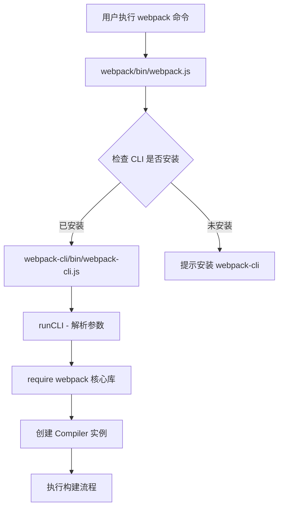
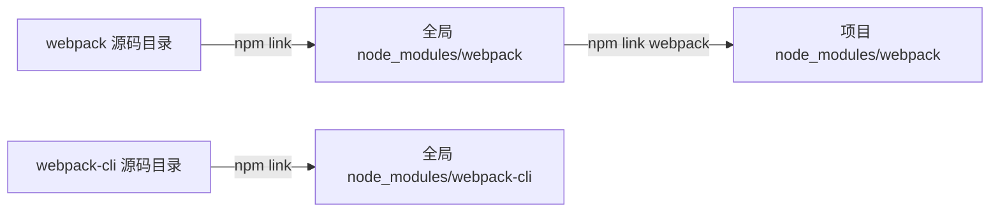
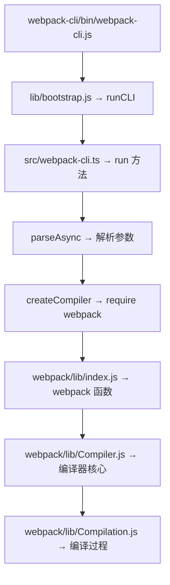

# Webpack 源码调试环境搭建

## 概述

深入理解 Webpack 打包原理的最佳方式是搭建源码调试环境，通过断点跟踪完整构建流程。本文介绍如何从零搭建 Webpack + Webpack CLI 的本地源码调试环境，涵盖源码下载、构建、npm link 软链接以及 VS Code 调试配置。

## 前置知识

- Node.js >= 14.15.0（推荐 18.x LTS）
- Git 基本操作
- VS Code 调试基础
- 参见：[深入理解 Webpack 核心配置结构](11-核心配置结构深入.md)

## 学习目标

- 理解源码调试相比 node_modules 调试的优势
- 掌握 Webpack 与 Webpack CLI 的版本对应关系
- 完成源码下载、依赖安装与构建
- 理解 npm link 的工作原理并完成软链接配置
- 配置 VS Code launch.json 实现断点调试

## 一、源码调试的价值

### 1.1 为什么不直接调试 node_modules

| 对比维度 | node_modules 中的代码 | 克隆的源码 |
|----------|----------------------|------------|
| 代码形态 | 仅编译产物（dist） | 源码 + 编译产物 |
| Source Map | 通常不包含 | 可手动生成 |
| 可读性 | 压缩/转换后难以阅读 | 原始实现，注释完整 |
| 可修改性 | 修改后 reinstall 丢失 | 可自由修改并测试 |
| 调试体验 | 无法在源码断点 | 完整断点支持 |

### 1.2 Webpack 与 CLI 的关系



两个核心仓库：

| 项目 | 语言 | 职责 | GitHub |
|------|------|------|--------|
| webpack | JavaScript (CommonJS) | 核心打包逻辑 | webpack/webpack |
| webpack-cli | TypeScript | 命令行参数解析与调度 | webpack/webpack-cli |

## 二、环境搭建完整流程

### 2.1 项目初始化

```bash
# 创建工作目录
mkdir webpack-source-debug && cd webpack-source-debug
npm init -y

# 创建测试文件
mkdir src
echo 'export const sum = (a, b) => a + b;' > src/utils.js
printf 'import { sum } from "./utils.js";\nconsole.log(sum(1, 2));\n' > src/index.js

# 创建最简配置
cat > webpack.config.js << 'EOF'
module.exports = {
  mode: "development",
  entry: "./src/index.js"
};
EOF
```

### 2.2 下载源码

```bash
# 克隆 Webpack 核心库
git clone https://github.com/webpack/webpack.git

# 克隆 Webpack CLI
git clone https://github.com/webpack/webpack-cli.git
```

> 如果网络不稳定，也可以从 GitHub 下载对应版本的 ZIP 包解压到项目根目录。

### 2.3 目标项目结构

```
webpack-source-debug/
├── webpack/              # Webpack 核心源码
├── webpack-cli/          # Webpack CLI 源码
├── src/
│   ├── index.js          # 测试入口
│   └── utils.js          # 测试模块
├── webpack.config.js     # 构建配置
├── .vscode/
│   └── launch.json       # 调试配置（后续创建）
└── package.json
```

## 三、源码构建

### 3.1 Webpack CLI 构建（TypeScript）

Webpack CLI 使用 TypeScript 编写，必须先编译才能在 Node.js 中运行：

```bash
cd webpack-cli

# 安装依赖（推荐 yarn）
yarn install

# 安装 monorepo 子包依赖
yarn bootstrap

# 编译 TypeScript → JavaScript
cd packages/webpack-cli
npx tsc --build
```

编译产物结构：

```
webpack-cli/packages/webpack-cli/
├── src/                  # TypeScript 源码
│   ├── index.ts
│   ├── bootstrap.ts
│   └── webpack-cli.ts   # 核心类（约 2500 行）
├── lib/                  # 编译产物
│   ├── index.js
│   ├── bootstrap.js
│   └── webpack-cli.js
└── bin/
    └── webpack-cli.js    # 命令行入口
```

### 3.2 Webpack 核心库构建

Webpack 使用 CommonJS 规范编写，通常不需要额外构建：

```bash
cd webpack
yarn install
# 如需构建：yarn build（执行 tsc --build）
```

## 四、npm link 软链接配置

### 4.1 工作原理

npm link 通过创建符号链接（symlink），使项目中的 `require('webpack')` 指向本地源码而非 npm 仓库版本：



### 4.2 执行链接

```bash
# 步骤一：将 webpack-cli 链接到全局
cd webpack-cli
npm link

# 步骤二：将 webpack 链接到全局
cd ../webpack
npm link

# 步骤三：在项目根目录，将全局 webpack 链接到项目 node_modules
cd ..
npm link webpack
```

### 4.3 验证链接

```bash
# 验证全局链接
ls -la $(npm root -g) | grep webpack
# 应显示：webpack -> /path/to/webpack-source-debug/webpack
# 应显示：webpack-cli -> /path/to/webpack-source-debug/webpack-cli

# 验证 CLI 可用
webpack --version
```

### 4.4 CLI 如何查找 Webpack

Webpack CLI 内部通过以下逻辑定位 webpack 核心库：

```javascript
// webpack-cli/bin/webpack-cli.js（简化）
if (process.env.WEBPACK_PACKAGE) {
  // 使用环境变量指定的自定义路径
  webpack = require(process.env.WEBPACK_PACKAGE);
} else {
  // 默认从 node_modules 中查找
  webpack = require("webpack");
}
```

因此必须确保项目 `node_modules/webpack` 指向源码（通过 npm link），否则调试的仍是发布版本。

**替代方案（环境变量）：**

```bash
export WEBPACK_PACKAGE=/path/to/webpack/lib/index.js
export WEBPACK_IS_CUSTOM=true
```

## 五、VS Code 调试配置

### 5.1 创建 launch.json

```json
// .vscode/launch.json
{
  "version": "0.2.0",
  "configurations": [
    {
      "name": "Debug Webpack",
      "type": "node",
      "request": "launch",
      "program": "${workspaceFolder}/webpack-cli/packages/webpack-cli/bin/webpack-cli.js",
      "runtimeVersion": "18.15.0",
      "args": ["--config", "webpack.config.js"],
      "console": "integratedTerminal",
      "internalConsoleOptions": "neverOpen"
    }
  ]
}
```

### 5.2 配置项说明

| 配置项 | 作用 |
|--------|------|
| `program` | 调试入口文件（CLI 的 bin 文件） |
| `runtimeVersion` | 指定 Node.js 版本（需与 nvm 对应） |
| `args` | 传递给程序的命令行参数 |
| `console` | 使用集成终端输出 |

### 5.3 断点调试流程

1. 在 `webpack-cli/packages/webpack-cli/bin/webpack-cli.js` 入口行打断点
2. 按 `F5` 启动调试
3. 程序停在断点处
4. 使用 `F11`（Step Into）逐层进入源码
5. 观察变量面板和调用堆栈

### 5.4 调试快捷键

| 快捷键 | 功能 |
|--------|------|
| F5 | 开始/继续调试 |
| F9 | 切换断点 |
| F10 | 单步跳过（不进入函数） |
| F11 | 单步进入（进入函数内部） |
| Shift+F11 | 跳出当前函数 |

## 六、源码阅读路径

推荐的阅读顺序：



## 常见问题

| 问题 | 原因 | 解决方案 |
|------|------|----------|
| `webpack: command not found` | 未执行 npm link | 在 webpack-cli 目录执行 `npm link` |
| `Cannot find module 'webpack'` | 项目 node_modules 中无 webpack | 在项目根目录执行 `npm link webpack` |
| TypeScript 编译失败 | 依赖未安装完整 | 先 `yarn install && yarn bootstrap` 再 `tsc --build` |
| 断点不生效 | program 路径错误 | 检查 launch.json 中 program 指向正确的 bin 文件 |
| 调试直接进入编译后 JS | 未配置 Source Map | 参见下一篇 TypeScript 源码调试配置 |
| Windows 下 npm link 失败 | 权限不足 | 以管理员身份运行终端 |

## 最佳实践

1. **版本锁定**：克隆源码时切换到与项目一致的 tag（如 `git checkout v5.107.0`），避免版本不匹配
2. **独立工作区**：源码调试项目与业务项目分离，避免 node_modules 冲突
3. **先通读 CONTRIBUTING.md**：官方贡献指南包含构建步骤和代码规范
4. **善用条件断点**：右键断点设置条件表达式，避免在循环中频繁中断
5. **记录调用栈**：调试时截图调用堆栈，便于后续回顾整体流程

## 延伸阅读

- [Webpack GitHub 仓库](https://github.com/webpack/webpack)
- [Webpack CLI GitHub 仓库](https://github.com/webpack/webpack-cli)
- [Webpack Contributing Guide](https://github.com/webpack/webpack/blob/main/CONTRIBUTING.md)
- [npm link 官方文档](https://docs.npmjs.com/cli/v10/commands/npm-link)
- [VS Code Node.js 调试指南](https://code.visualstudio.com/docs/nodejs/nodejs-debugging)

---

**下一篇：** [Webpack CLI TypeScript 源码调试](30-CLI-TypeScript调试.md) — Source Map 配置与 TS 源码断点调试
