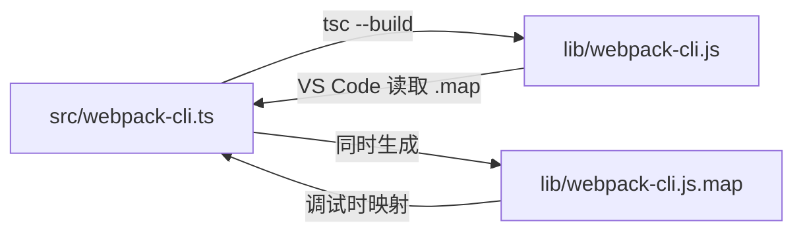
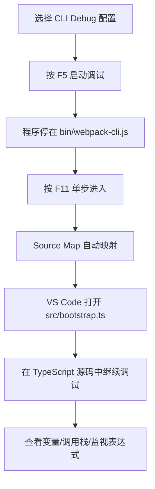
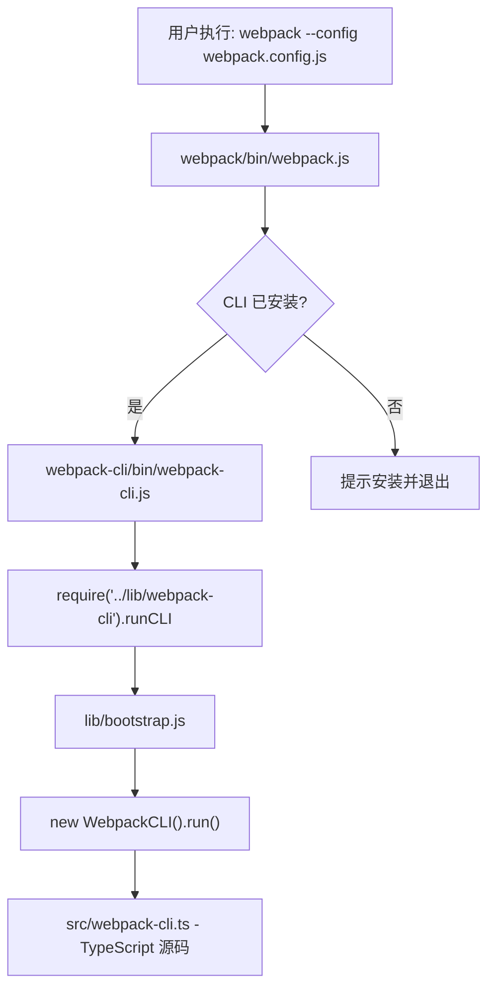

# Webpack CLI TypeScript 源码调试

## 概述

Webpack CLI 使用 TypeScript 编写，直接调试编译后的 JavaScript 文件无法看到类型定义和原始设计意图。通过配置 Source Map，VS Code 可以将调试断点自动映射回 TypeScript 源码，提供接近原生 TS 的调试体验。

## 前置知识

- 已完成 Webpack 源码调试环境搭建
- TypeScript 编译基础（tsconfig.json）
- Source Map 基本概念
- 参见：[Webpack 源码调试环境搭建](29-源码调试环境搭建.md)

## 学习目标

- 理解 Source Map 在 TypeScript 调试中的作用
- 配置 tsconfig.json 生成 Source Map
- 掌握 VS Code launch.json 中 sourceMaps 和 outFiles 配置
- 能够在 TypeScript 源码中直接打断点调试

## 一、Source Map 映射原理

### 1.1 编译前后的对应关系



Source Map 文件（`.js.map`）记录了编译后 JavaScript 每一行代码对应的原始 TypeScript 位置信息，使调试工具能够：

- 将断点从 TS 源码映射到 JS 编译产物
- 在调试面板中显示原始 TypeScript 代码
- 正确展示变量名和类型信息

### 1.2 Source Map 文件结构

```json
{
  "version": 3,
  "file": "webpack-cli.js",
  "sourceRoot": "",
  "sources": ["../src/webpack-cli.ts"],
  "names": [],
  "mappings": "AAAA;..."
}
```

| 字段 | 说明 |
|------|------|
| `version` | Source Map 规范版本（当前为 3） |
| `file` | 编译后的文件名 |
| `sources` | 原始源文件相对路径 |
| `mappings` | Base64 VLQ 编码的位置映射 |

## 二、配置 tsconfig.json

### 2.1 启用 Source Map

配置文件位置：`webpack-cli/packages/webpack-cli/tsconfig.json`

```json
{
  "compilerOptions": {
    "sourceMap": true,
    "outDir": "./lib",
    "rootDir": "./src",
    "target": "ES2020",
    "module": "commonjs"
  }
}
```

关键配置项：

| 配置项 | 值 | 作用 |
|--------|-----|------|
| `sourceMap` | `true` | 编译时生成 `.js.map` 文件 |
| `outDir` | `"./lib"` | 编译输出目录 |
| `rootDir` | `"./src"` | 源码根目录（影响 map 中的路径） |

### 2.2 编译并验证

```bash
cd webpack-cli/packages/webpack-cli

# 编译 TypeScript
npx tsc --build

# 验证 Source Map 已生成
ls lib/*.map
# 预期输出：
# bootstrap.js.map  index.js.map  webpack-cli.js.map
```

> Webpack CLI 的构建脚本（`scripts/setup-build.js`）会在 CI 构建前自动设置 `sourceMap: true`，本地开发时需手动确认。

## 三、VS Code 调试配置进阶

### 3.1 完整 launch.json

```json
{
  "version": "0.2.0",
  "configurations": [
    {
      "name": "Debug Webpack (via webpack entry)",
      "type": "node",
      "request": "launch",
      "program": "${workspaceFolder}/webpack/bin/webpack.js",
      "runtimeVersion": "18.15.0",
      "args": ["--config", "webpack.config.js"],
      "console": "integratedTerminal",
      "internalConsoleOptions": "neverOpen"
    },
    {
      "name": "Debug CLI (TypeScript Source)",
      "type": "node",
      "request": "launch",
      "program": "${workspaceFolder}/webpack-cli/packages/webpack-cli/bin/webpack-cli.js",
      "runtimeVersion": "18.15.0",
      "args": ["--config", "webpack.config.js"],
      "console": "integratedTerminal",
      "internalConsoleOptions": "neverOpen",
      "sourceMaps": true,
      "outFiles": [
        "${workspaceFolder}/webpack-cli/packages/webpack-cli/lib/**/*.js"
      ]
    }
  ]
}
```

### 3.2 两种配置的区别

| 配置 | 入口 | 适用场景 |
|------|------|----------|
| Debug Webpack | webpack/bin/webpack.js | 从 Webpack 入口开始，经过 CLI 安装检查 |
| Debug CLI (TypeScript Source) | webpack-cli/bin/webpack-cli.js | 直接进入 CLI，跳过检查，配合 Source Map |

### 3.3 关键配置项

| 配置项 | 作用 |
|--------|------|
| `sourceMaps: true` | 启用 Source Map 支持，自动查找 `.map` 文件 |
| `outFiles` | 指定编译产物目录，帮助 VS Code 定位 `.js` 和 `.js.map` |

## 四、TypeScript 源码断点调试

### 4.1 断点策略

**策略一：从入口逐层进入**

```javascript
// webpack-cli/packages/webpack-cli/bin/webpack-cli.js（第 17 行）
const runCLI = require('../lib/webpack-cli').runCLI;  // ← 断点
runCLI(process.argv);
```

按 F11 进入后，VS Code 自动通过 Source Map 跳转到 `src/bootstrap.ts`。

**策略二：直接在 TS 源码打断点**

```typescript
// webpack-cli/packages/webpack-cli/src/index.ts
import { CLI } from './webpack-cli';
const cli = new CLI();  // ← 直接在 TS 文件打断点
cli.run(process.argv);
```

**策略三：核心类方法断点**

```typescript
// webpack-cli/packages/webpack-cli/src/webpack-cli.ts（第 86 行）
export class WebpackCLI {
  async run(args: string[] = process.argv) {  // ← 断点
    // 主入口逻辑
  }
}
```

### 4.2 调试流程



### 4.3 调试面板使用

| 面板 | 用途 |
|------|------|
| 变量（Variables） | 查看当前作用域内所有变量值 |
| 监视（Watch） | 添加自定义表达式持续监控 |
| 调用堆栈（Call Stack） | 查看函数调用链，点击栈帧跳转 |
| 断点（Breakpoints） | 管理所有断点，支持条件断点 |

## 五、Webpack 与 CLI 入口关系

### 5.1 命令执行链路



### 5.2 为什么有两个入口

- **webpack/bin/webpack.js**：npm 全局安装 `webpack` 后的命令入口，负责检查 CLI 是否存在
- **webpack-cli/bin/webpack-cli.js**：CLI 自身的入口，直接调用 runCLI

调试时推荐使用 CLI 入口（跳过检查步骤，更快到达核心逻辑）。

## 常见问题

| 问题 | 原因 | 解决方案 |
|------|------|----------|
| 断点停在 JS 而非 TS 源码 | Source Map 未生成 | 确认 tsconfig.json 中 `sourceMap: true` 并重新编译 |
| VS Code 提示"未验证的断点" | outFiles 路径不匹配 | 检查 outFiles glob 是否覆盖 lib 目录 |
| 调试时显示编译后代码 | launch.json 缺少 sourceMaps | 添加 `"sourceMaps": true` |
| `.map` 文件中路径错误 | rootDir 配置不正确 | 确保 rootDir 指向 src 目录 |
| F11 进入了无关函数 | 光标位置不对 | 确认要进入的函数调用在当前行 |

## 最佳实践

1. **编译后立即验证**：运行 `ls lib/*.map` 确认 Source Map 文件存在
2. **使用 CLI Debug 配置**：直接从 CLI 入口调试，减少无关跳转
3. **善用调用堆栈**：在复杂调用链中通过 Call Stack 面板快速定位上下文
4. **条件断点减少噪音**：对循环内的断点设置条件（如 `i === 100`）
5. **调试控制台执行代码**：断点暂停时可在 Debug Console 中直接执行表达式查看运行时状态

## 延伸阅读

- [TypeScript tsconfig - sourceMap](https://www.typescriptlang.org/tsconfig#sourceMap)
- [VS Code Node.js Debugging](https://code.visualstudio.com/docs/nodejs/nodejs-debugging)
- [Source Map 规范（v3）](https://sourcemaps.info/spec.html)
- [source-map 库（Mozilla）](https://github.com/mozilla/source-map)

---

**上一篇：** [Webpack 源码调试环境搭建](29-源码调试环境搭建.md)
**下一篇：** [Webpack CLI 执行流程深度解析](31-CLI执行流程.md) — 入口定位、run() 四阶段、发布订阅模式
