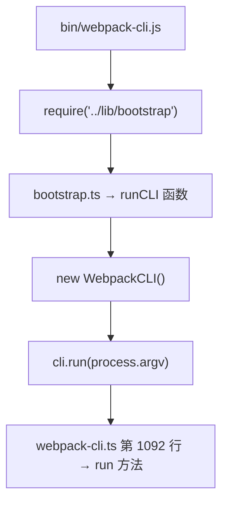
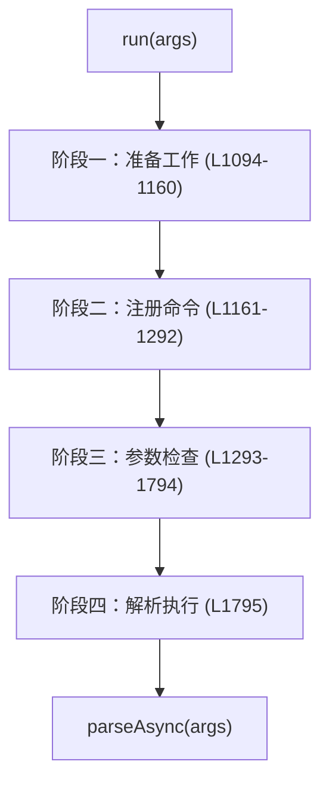
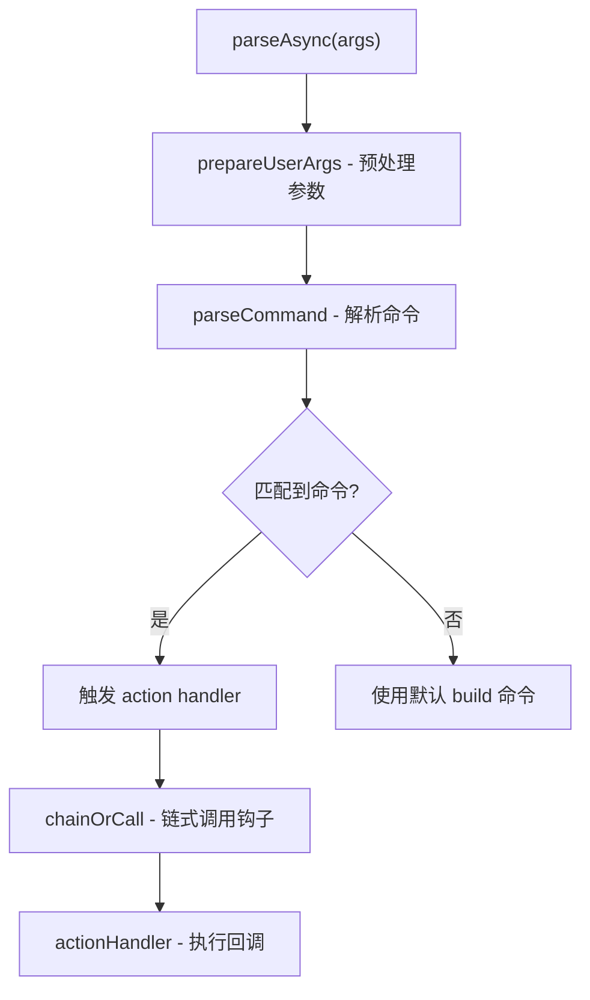
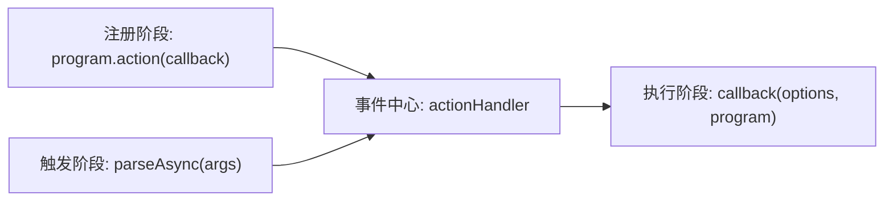

# Webpack CLI 执行流程深度解析

## 概述

Webpack CLI 基于 Commander.js 构建，采用发布订阅模式实现命令注册与执行解耦。本文通过源码调试追踪 CLI 从入口到构建命令触发的完整执行链路，剖析 `run()` 方法的四阶段流程以及 `parseAsync` 参数解析机制。

## 前置知识

- 已完成 Webpack CLI TypeScript 源码调试配置
- Commander.js 基本用法
- 发布订阅模式概念
- 参见：[Webpack CLI TypeScript 源码调试](30-CLI-TypeScript调试.md)

## 学习目标

- 掌握通过 package.json 定位程序入口的方法
- 理解 CLI 入口调用链（bin → bootstrap → runCLI → run）
- 掌握 run() 方法的四阶段执行流程
- 理解 parseAsync 参数解析与发布订阅模式的应用

## 一、程序入口定位

### 1.1 通过 package.json 定位

```json
// webpack-cli/packages/webpack-cli/package.json
{
  "main": "lib/index.js",
  "bin": {
    "webpack-cli": "./bin/webpack-cli.js"
  }
}
```

- `main` 字段：模块被 require 时的入口（编译后才有）
- `bin` 字段：命令行可执行文件的入口

### 1.2 入口调用链



### 1.3 核心文件结构

```
webpack-cli/packages/webpack-cli/
├── bin/
│   └── webpack-cli.js        # 命令行入口（#!/usr/bin/env node）
├── src/
│   ├── index.ts              # 模块导出入口
│   ├── bootstrap.ts          # 启动引导（runCLI）
│   └── webpack-cli.ts        # 核心类（约 2500 行）
└── lib/                      # 编译产物
```

## 二、WebpackCLI 类结构

### 2.1 核心类概览

```typescript
// src/webpack-cli.ts
import { Command } from 'commander';

class WebpackCLI {
  private program: Command;

  constructor() {
    this.program = new Command();
  }

  // 主入口方法
  async run(args: string[] = process.argv): Promise<void> { ... }

  // 参数处理
  async processArguments(command, options): Promise<void> { ... }

  // 创建编译器
  async createCompiler(options): Promise<Compiler> { ... }

  // 执行构建
  async runWebpack(options): Promise<void> { ... }
}
```

### 2.2 快速浏览类方法

在 VS Code 中使用 `Cmd + Shift + O`（Mac）/ `Ctrl + Shift + O`（Windows）打开符号大纲，可一览所有方法并快速跳转。

## 三、run() 方法四阶段

### 3.1 阶段概览



### 3.2 阶段一：准备工作

```typescript
async run(args: string[] = process.argv) {
  // 定义 webpack 支持的所有配置选项
  const webpackOptions = {
    config: { /* 配置文件路径 */ },
    mode: { /* development | production | none */ },
    entry: { /* 入口模块 */ },
    output: { /* 输出配置 */ },
    // ... 更多选项
  };

  // 定义辅助函数
  const isCommand = (name: string) => { /* ... */ };
  const isOption = (name: string) => { /* ... */ };
}
```

### 3.3 阶段二：注册命令

```typescript
// 使用 Commander.js 注册子命令
this.program
  .command('build')
  .description('Run webpack (default command)')
  .action(buildActionHandler);

this.program
  .command('serve')
  .description('Run webpack-dev-server')
  .action(serveActionHandler);

this.program
  .command('init')
  .description('Initialize a new webpack project')
  .action(initActionHandler);
```

### 3.4 阶段三：参数检查

```typescript
// 一系列校验确保参数合法
outputHelpIfNeeded();              // --help 检查
checkForMissingAndRequiredOptions(); // 必要参数检查
checkForConflictingOptions();      // 冲突参数检查
```

### 3.5 阶段四：解析执行

```typescript
// 第 1795 行 - 触发参数解析与命令执行
await this.program.parseAsync(this.args);
```

## 四、parseAsync 执行流程

### 4.1 内部调用链



### 4.2 命令名称获取

```typescript
const commandName = this.getCommandName();
// webpack build  → 'build'
// webpack serve  → 'serve'
// webpack        → 'build'（默认命令）
```

## 五、发布订阅模式

### 5.1 模式原理

Webpack CLI 的命令注册与执行采用发布订阅模式实现解耦：



### 5.2 在 CLI 中的体现

```typescript
// 订阅：注册 action 回调
this.program.action(async (options, program) => {
  const command = await this.getBuiltInCommand('build');
  return command;
});

// 发布：解析参数时自动触发
await this.program.parseAsync(args);
// 内部解析完成后 → 调用已注册的 actionHandler → 执行回调
```

### 5.3 为什么使用异步

Webpack 命令的参数处理可能涉及：
- 异步读取配置文件
- 动态加载插件
- 网络请求（如 init 命令下载模板）

使用 `parseAsync` 统一处理同步和异步场景，确保流程一致性。

## 六、极简 CLI 示例

通过简化实现理解核心机制：

```typescript
import { Command } from 'commander';

class MiniCLI {
  private program: Command;
  private actionHandler: Function | null = null;

  constructor() {
    this.program = new Command();
  }

  run() {
    // 1. 注册回调（订阅）
    this.program.action(async (options, program) => {
      console.log('执行构建，options:', options);
      return 'build';
    });

    // 2. 保存 handler 引用
    this.actionHandler = (options: any, program: any) => {
      console.log('回调被执行');
    };

    // 3. 解析参数（发布）
    this.parseCommand();
  }

  private parseCommand() {
    if (this.actionHandler) {
      // 使用 apply 传递参数
      this.actionHandler.apply(null, [/* options, program */]);
    }
  }
}

new MiniCLI().run();
```

核心要点：
- `action()` 注册回调 → 保存到 `actionHandler`
- `parseCommand()` 触发 → 通过 `apply` 调用回调
- 参数通过 `apply` 的第二个参数数组传递

## 七、关键方法速查

| 方法 | 位置 | 职责 |
|------|------|------|
| `run()` | L1092 | 主入口，编排四阶段 |
| `parseAsync()` | L1795 | 触发 Commander 参数解析 |
| `parseCommand()` | Commander 内部 | 匹配命令 |
| `chainOrCall()` | - | 链式调用生命周期钩子 |
| `processArguments()` | L1279 | 参数校验与处理 |
| `actionHandler()` | - | 执行注册的命令回调 |

## 常见问题

| 问题 | 解答 |
|------|------|
| 为什么 run() 方法有 2500 行？ | 包含所有命令的选项定义、参数校验、帮助文本生成 |
| parseAsync 和 parse 的区别？ | parseAsync 支持异步 action handler，parse 仅支持同步 |
| 默认命令是什么？ | 未指定子命令时默认执行 `build` |
| Commander.js 在其中的角色？ | 提供命令注册、参数解析、帮助生成的基础框架 |

## 最佳实践

1. **从 run() 入口开始跟踪**：先建立全局视图，再深入具体分支
2. **使用代码折叠**：`Cmd+K Cmd+1` 折叠所有方法体，只看类结构
3. **关注 parseAsync 调用点**：这是从"准备"到"执行"的分水岭
4. **对比 Commander.js 文档**：理解 `action`、`parseAsync` 等 API 的语义
5. **画调用链图**：调试时在纸上记录函数调用顺序，避免迷失在 2500 行代码中

## 延伸阅读

- [Commander.js 官方文档](https://github.com/tj/commander.js)
- [Webpack CLI 源码](https://github.com/webpack/webpack-cli)
- [观察者模式（Patterns.dev）](https://www.patterns.dev/posts/observer-pattern)
- [Function.prototype.apply - MDN](https://developer.mozilla.org/zh-CN/docs/Web/JavaScript/Reference/Global_Objects/Function/apply)

---

**上一篇：** [Webpack CLI TypeScript 源码调试](30-CLI-TypeScript调试.md)
**下一篇：** [Webpack CLI build 命令执行流程](32-build命令执行流程.md) — 两次 parseAsync、命令分发、Compiler 创建
