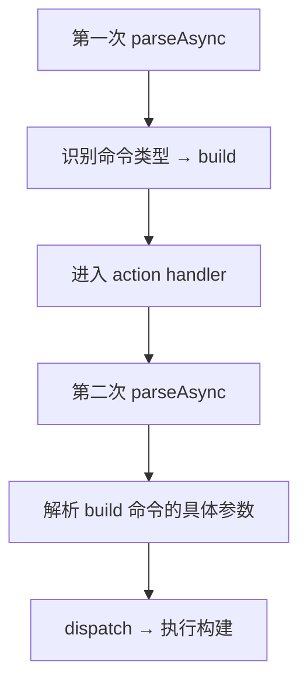
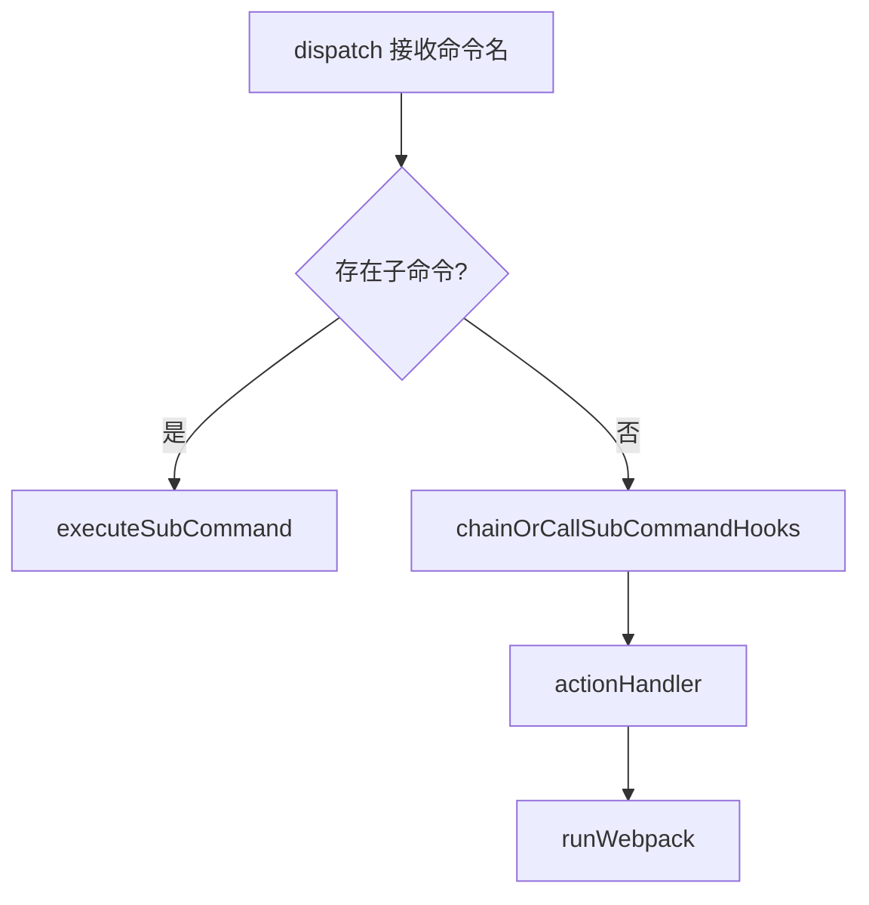
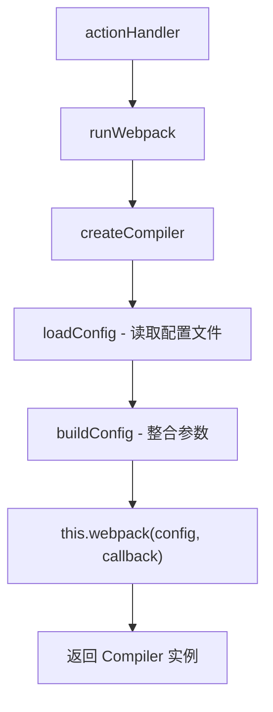
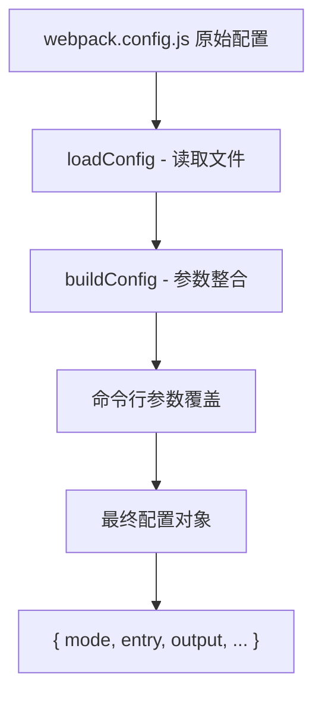
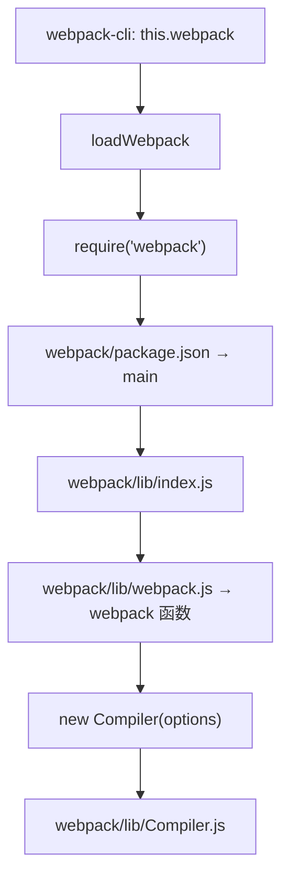
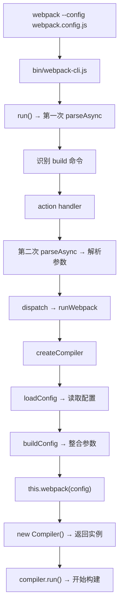

# Webpack CLI build 命令执行流程

## 概述

当用户执行 `webpack --config webpack.config.js` 时，CLI 内部经历两次 `parseAsync` 调用、命令分发（dispatch）、配置加载与整合，最终通过 `this.webpack()` 创建 Compiler 实例。本文逐层剖析 build 命令从参数解析到编译器创建的完整链路。

## 前置知识

- Webpack CLI 执行流程（run 四阶段、parseAsync）
- Commander.js 命令注册机制
- 参见：[Webpack CLI 执行流程深度解析](31-CLI执行流程.md)

## 学习目标

- 理解两次 parseAsync 的触发时机与各自职责
- 掌握命令分发（dispatch）机制
- 理解 createCompiler 的三步流程（loadConfig → buildConfig → webpack）
- 掌握 Webpack 核心库的导入与 Compiler 实例创建

## 一、两次 parseAsync 机制

### 1.1 为什么需要两次解析

Webpack CLI 的 build 命令执行需要两次 `parseAsync`：



| 次序 | 触发时机 | 职责 |
|------|----------|------|
| 第一次 | run() 阶段四 | 识别用户要执行哪个命令（build/serve/init） |
| 第二次 | action handler 内部 | 解析该命令的详细参数（--config、--mode 等） |

### 1.2 第一次 parseCommand

```typescript
// 第一次进入 parseCommand
parseCommand() {
  // options 为空 → 返回默认 build 命令
  if (!options) {
    return this.getBuiltInCommand('build');
  }
}
```

### 1.3 第二次 parseCommand

```typescript
// 第二次进入 parseCommand（action handler 触发后）
parseCommand() {
  // options 有值 → 进行命令分发
  if (options) {
    const commandName = options[0];
    this.dispatchCommand(commandName);
  }
}
```

## 二、命令分发（dispatch）

### 2.1 dispatch 方法

```typescript
async dispatch(command: string) {
  // 1. 检查是否有注册的子命令
  const subCommand = this.getSubCommand(command);
  if (subCommand) {
    return this.executeSubCommand(subCommand);
  }

  // 2. 执行生命周期钩子
  await this.chainOrCallSubCommandHooks();

  // 3. 执行 action handler
  await this.actionHandler(options, program);
}
```

### 2.2 分发流程



## 三、Compiler 创建过程

### 3.1 调用链



### 3.2 runWebpack 方法

```typescript
// webpack-cli.ts 第 1213 行
async runWebpack() {
  let compiler: Compiler;

  // 获取环境变量
  const webpackBuildEnv = process.env.WEBPACK_BUILD;

  // 准备配置选项
  const options = {
    config: configPath,
    env: envOptions
  };

  // 非 watch 模式下创建 compiler
  if (!isWatch) {
    compiler = await this.createCompiler(options);
  }

  return compiler;
}
```

### 3.3 createCompiler 方法

```typescript
createCompiler(options) {
  // 步骤一：加载配置文件
  const config = this.loadConfig(options.config);

  // 步骤二：构建最终配置
  const builtConfig = this.buildConfig(config);

  // 步骤三：调用 webpack 核心库创建编译器
  const compiler = this.webpack(builtConfig, callback);

  return compiler;
}
```

## 四、配置文件加载与整合

### 4.1 loadConfig

使用 fs 模块读取配置文件：

```typescript
loadConfig(configPath: string) {
  const configContent = fs.readFileSync(configPath, 'utf-8');
  return configContent;
}
```

### 4.2 buildConfig

```typescript
// webpack-cli.ts 第 2184 行
buildConfig(config) {
  // 1. 检查 watch 模式
  const isWatchMode = config.watch;

  // 2. 获取构建选项
  const buildOptions = this.getBuildOptions(config);

  // 3. 使用 reduce 整合命令行参数
  const processedArgs = processArguments.reduce((acc, arg) => {
    return { ...acc, ...arg };
  }, {});

  // 4. 返回最终配置
  return {
    ...buildOptions,
    ...processedArgs,
    mode: config.mode,
    entry: config.entry
  };
}
```

### 4.3 配置整合流程



## 五、Webpack 核心库导入

### 5.1 loadWebpack 方法

```typescript
loadWebpack() {
  try {
    return require('webpack');
  } catch (e) {
    // 降级为动态 import
    return import('webpack');
  }
}
```

### 5.2 Webpack 包入口

```json
// webpack/package.json
{ "main": "lib/index.js" }
```

```javascript
// webpack/lib/index.js - 导出内容
module.exports = {
  webpack,          // 核心函数
  Compiler,         // 编译器类
  optimize,         // 优化相关
  library,          // 库输出相关
  // ...
};
```

### 5.3 webpack 函数与 Compiler 创建

```javascript
// webpack/lib/webpack.js 第 188 行（简化，省略插件应用与默认值处理）
const webpack = (options, callback) => {
  // 1. 验证配置合法性
  validateOptions(options);

  // 2. 创建 Compiler 实例（真实实现位于 createCompiler()：
  //    会依次应用用户插件、注入内置插件并应用默认配置，见第 22 篇）
  const compiler = new Compiler(options.context);

  // 3. 如果提供回调则直接运行
  if (callback) {
    compiler.run(callback);
  }

  return compiler;
};
```

### 5.4 完整导入关系



## 六、完整执行流程



## 常见问题

| 问题 | 解答 |
|------|------|
| 为什么需要两次 parseAsync？ | 第一次确定命令类型，第二次解析该命令的具体参数 |
| 命令行参数和配置文件冲突时谁优先？ | 命令行参数优先（通过 reduce 后展开覆盖） |
| loadWebpack 为什么用 try-catch？ | 兼容 ESM 环境，require 失败时降级为动态 import |
| Compiler 创建后何时开始构建？ | 如果传入 callback 则立即 run()，否则需手动调用 compiler.run() |

## 最佳实践

1. **断点设在 createCompiler**：这是 CLI 与 Webpack 核心库的衔接点
2. **观察 builtConfig 对象**：在 buildConfig 返回处打断点，查看最终配置
3. **区分 watch 与非 watch**：watch 模式下 compiler 的创建时机不同
4. **关注环境变量**：`WEBPACK_BUILD`、`WEBPACK_BUNDLE` 影响构建行为

## 延伸阅读

- [Webpack Compiler API](https://webpack.js.org/api/compiler-hooks/)
- [Webpack CLI 源码 - webpack-cli.ts](https://github.com/webpack/webpack-cli/blob/master/packages/webpack-cli/src/webpack-cli.ts)
- [Webpack 源码 - lib/webpack.js](https://github.com/webpack/webpack/blob/main/lib/webpack.js)

---

**上一篇：** [Webpack CLI 执行流程深度解析](31-CLI执行流程.md)
**下一篇：** [Webpack 源码调试 - npm 链接技巧](33-npm链接调试技巧.md) — 将 CLI 调试链路延伸到 Webpack 核心源码
