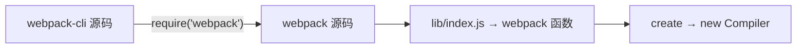
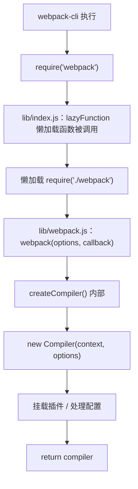
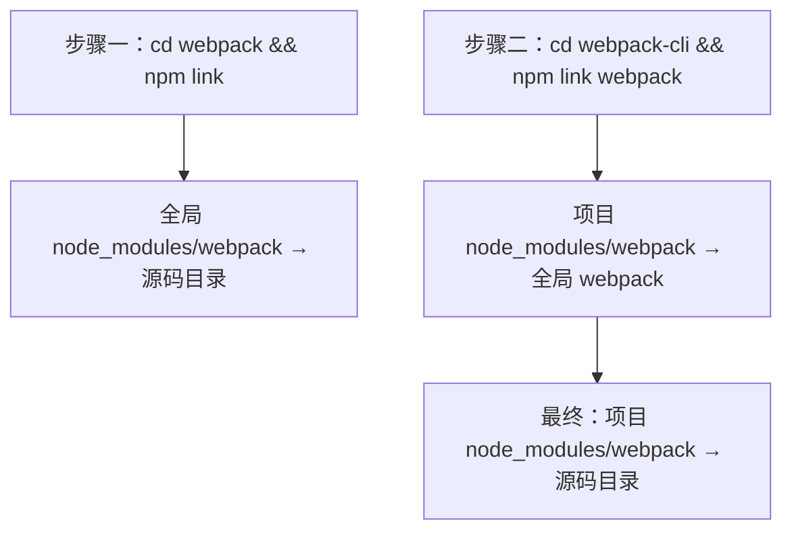

# Webpack 源码调试 - npm 链接技巧

## 概述

在调试 Webpack CLI 时，`require('webpack')` 默认加载的是 `node_modules` 中的发布版本而非克隆的源码。通过 `npm link webpack` 将项目依赖指向本地源码，可以在 CLI 调试过程中无缝跳转到 Webpack 核心库源码，实现端到端的断点跟踪。

## 前置知识

- 已完成 Webpack 源码调试环境搭建（npm link 基础操作）
- 理解 Webpack CLI build 命令执行流程
- 参见：[Webpack 源码调试环境搭建](29-源码调试环境搭建.md)、[Webpack CLI build 命令执行流程](32-build命令执行流程.md)

## 学习目标

- 理解 CLI 调试时 webpack 模块解析的问题
- 掌握在 CLI 项目中链接 webpack 源码的操作
- 能够在 webpack/lib/index.js 中设置断点并跟踪 Compiler 创建

## 一、问题场景

### 1.1 调试链路断裂

在 CLI 源码中跟踪到 `require('webpack')` 时，调试器跳转到了 `node_modules/webpack`（npm 发布版本），而非我们克隆的源码：

```
项目结构：
├── webpack-cli/           # 克隆的 CLI 源码（正在调试）
│   └── node_modules/
│       └── webpack/       # npm 安装的发布版本 ← 调试到这里
│
└── webpack/               # 克隆的 webpack 源码（希望调试到这里）
```

### 1.2 期望的调试链路



## 二、解决方案：npm link webpack

### 2.1 操作步骤

```bash
# 前提：webpack 源码已链接到全局（环境搭建时完成）
cd /path/to/webpack
npm link

# 在 CLI 项目中链接 webpack
cd /path/to/webpack-cli
npm link webpack
```

### 2.2 链接前后对比

| 状态 | node_modules/webpack 指向 |
|------|--------------------------|
| 链接前 | npm 仓库发布的版本 |
| 链接后 | 全局 webpack → 本地 webpack 源码 |

### 2.3 验证链接成功

在 VS Code 文件资源管理器中，`node_modules/webpack` 旁会显示箭头图标（→），表示这是一个符号链接而非真实目录。

## 三、Webpack 源码断点调试

### 3.1 核心入口文件

链接成功后，`require('webpack')` 将解析到 `webpack/lib/index.js`：

```javascript
// webpack/lib/index.js（简化）
// require('webpack') 返回一个懒加载函数：首次调用时才真正加载 webpack 核心模块
const fn = lazyFunction(() => require("./webpack")); // 【断点 1】
module.exports = mergeExports(fn, { /* webpack.Compiler 等懒加载导出 */ });

// webpack/lib/webpack.js（简化）
const webpack = (options, callback) => {
  // 【断点 2】进入 createCompiler，创建 Compiler 实例
  const compiler = createCompiler(options);
  if (callback) {
    /* compiler.run(callback) */
  }
  return compiler;
};
```

### 3.2 调试操作

1. 在 `webpack/lib/index.js` 第 8 行打断点
2. 启动调试（F5）
3. CLI 执行到 `require('webpack')` 后自动停在断点
4. 使用 F11 进入 `createCompiler` 方法

### 3.3 执行流程



### 3.4 create 方法核心逻辑

```javascript
// webpack/lib/webpack.js — createCompiler()（简化）
const createCompiler = (rawOptions, compilerIndex) => {
  // 1. 配置标准化与默认值处理
  // 2. 创建 Compiler 实例
  const compiler = new Compiler(context, options);

  // 3. 挂载内置插件与用户插件
  // 4. 初始化文件系统

  return compiler;
};
```

## 四、npm link 工作原理

### 4.1 两步链接机制



### 4.2 符号链接本质

```bash
# 查看链接关系
ls -la node_modules/webpack
# 输出：webpack -> /path/to/webpack-source-debug/webpack
```

操作系统层面的符号链接（symlink），所有对 `node_modules/webpack` 的文件访问都会被重定向到源码目录。

## 五、调试技巧总结

| 技巧 | 说明 |
|------|------|
| 符号链接识别 | VS Code 中文件名旁出现箭头图标 |
| 断点验证 | 调试时能进入源码目录的文件即链接成功 |
| 条件断点 | 右键断点可设置触发条件（如 `options.mode === 'production'`） |
| 调试控制台 | 断点暂停时可执行代码查看变量 |
| 日志断点 | 右键 → "Logpoint" 不暂停只输出日志 |

## 常见问题

| 问题 | 解决方案 |
|------|----------|
| 链接后调试仍进入 node_modules 旧版本 | 删除 node_modules 重新安装，再执行 `npm link webpack` |
| Windows 权限问题 | 以管理员身份运行终端 |
| 多版本冲突 | `npm unlink webpack` 取消链接后重新操作 |
| 链接后 CLI 报模块找不到 | 确认 webpack 源码已执行 `yarn install` 安装依赖 |
| 修改源码后不生效 | Webpack 是 CommonJS 无需编译，检查是否有缓存（清除 require.cache） |

## 最佳实践

1. **先验证再调试**：执行 `node -e "console.log(require.resolve('webpack'))"` 确认解析路径
2. **保持源码更新**：定期 `git pull` 同步上游修复
3. **配合 Git 分支**：在源码中创建实验分支，自由添加 console.log 辅助理解
4. **调试完成后 unlink**：避免影响其他项目的正常 npm install

## 延伸阅读

- [npm link 官方文档](https://docs.npmjs.com/cli/v10/commands/npm-link)
- [Webpack 源码结构](https://github.com/webpack/webpack/tree/main/lib)
- [VS Code 调试指南](https://code.visualstudio.com/docs/editor/debugging)

---

**上一篇：** [Webpack CLI build 命令执行流程](32-build命令执行流程.md)
**下一篇：** [tapable 核心库详解](34-tapable核心库.md) — Webpack 插件系统的钩子机制基石
