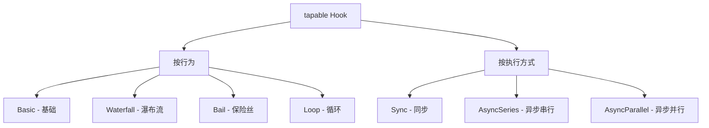
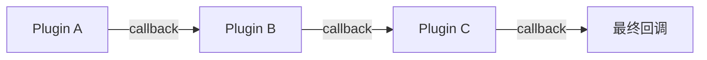
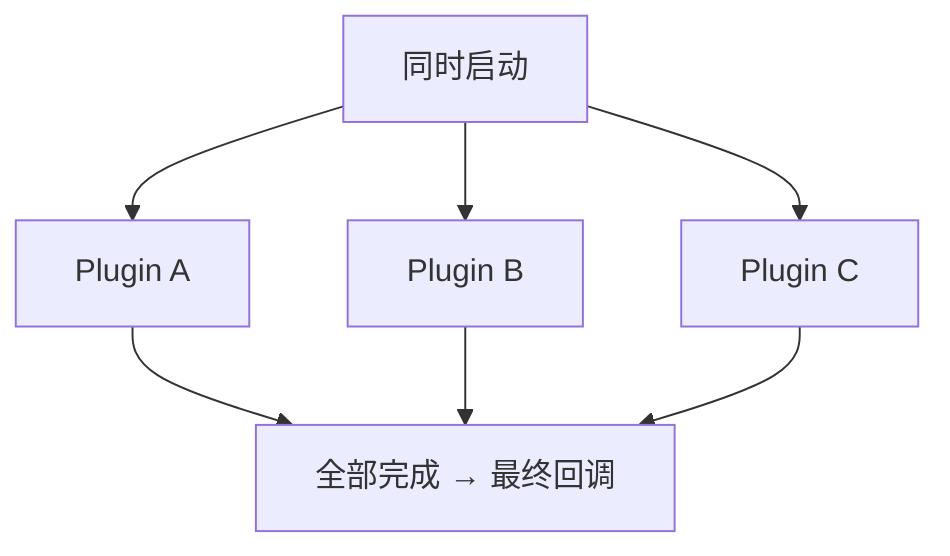

# tapable 核心库详解

## 概述

tapable 是 Webpack 插件系统的基石，为 Compiler 和 Compilation 提供生命周期钩子机制。所有 Webpack 插件通过 tapable 的 Hook 实例介入构建流程。本文系统梳理 tapable 的 Hook 类型分类、执行机制、注册与调用方法以及拦截器。

## 前置知识

- Webpack Compiler 创建流程
- 发布订阅模式
- JavaScript 回调函数与 Promise
- 参见：[Webpack CLI build 命令执行流程](32-build命令执行流程.md)

## 学习目标

- 理解 tapable 在 Webpack 架构中的定位
- 掌握四种 Hook 行为类型（Basic/Waterfall/Bail/Loop）
- 掌握同步与异步（串行/并行）执行机制
- 熟练使用三组注册/调用方法（tap/call、tapAsync/callAsync、tapPromise/promise）
- 了解拦截器（intercept）机制

## 一、tapable 在 Webpack 中的定位

### 1.1 Compiler 中的 Hooks

```javascript
// webpack/lib/Compiler.js
const { SyncHook, SyncBailHook, AsyncSeriesHook, AsyncParallelHook } = require('tapable');

class Compiler {
  constructor() {
    this.hooks = {
      initialize: new SyncHook([]),
      shouldEmit: new SyncBailHook(['compilation']),
      done: new AsyncSeriesHook(['stats']),
      beforeRun: new AsyncSeriesHook(['compiler']),
      run: new AsyncSeriesHook(['compiler']),
      emit: new AsyncSeriesHook(['compilation']),
      compile: new SyncHook(['params']),
      make: new AsyncParallelHook(['compilation']),
      afterCompile: new AsyncSeriesHook(['compilation']),
      // ...
    };
  }
}
```

### 1.2 插件介入方式

```javascript
class MyPlugin {
  apply(compiler) {
    // 同步钩子 → tap
    compiler.hooks.compile.tap('MyPlugin', (params) => {
      console.log('编译开始');
    });

    // 异步钩子 → tapAsync
    compiler.hooks.emit.tapAsync('MyPlugin', (compilation, callback) => {
      setTimeout(() => callback(), 1000);
    });

    // Promise 方式 → tapPromise
    compiler.hooks.done.tapPromise('MyPlugin', (stats) => {
      return Promise.resolve();
    });
  }
}
```

### 1.3 核心价值

| 作用 | 说明 |
|------|------|
| 生命周期控制 | 定义构建各阶段的介入点 |
| 插件化解耦 | 插件无需了解彼此，通过 Hook 通信 |
| 流程编排 | 支持串行/并行/截断/循环等执行策略 |

## 二、Hook 类型分类

### 2.1 分类维度



### 2.2 完整类型列表

| 同步 | 异步串行 | 异步并行 |
|------|----------|----------|
| SyncHook | AsyncSeriesHook | AsyncParallelHook |
| SyncBailHook | AsyncSeriesBailHook | AsyncParallelBailHook |
| SyncWaterfallHook | AsyncSeriesWaterfallHook | — |
| SyncLoopHook | AsyncSeriesLoopHook | — |

## 三、四种行为类型详解

### 3.1 Basic（基础）

所有注册的回调依次执行，互不影响：

```javascript
const { SyncHook } = require('tapable');
const hook = new SyncHook(['name']);

hook.tap('A', (name) => console.log('A:', name));
hook.tap('B', (name) => console.log('B:', name));

hook.call('webpack');
// A: webpack
// B: webpack
```

### 3.2 Waterfall（瀑布流）

上一个回调的返回值作为下一个回调的输入参数：

```javascript
const { SyncWaterfallHook } = require('tapable');
const hook = new SyncWaterfallHook(['value']);

hook.tap('A', (val) => val + 1);   // 0 → 1
hook.tap('B', (val) => val * 2);   // 1 → 2
hook.tap('C', (val) => val + 10);  // 2 → 12

const result = hook.call(0);
console.log(result); // 12
```

### 3.3 Bail（保险丝/截断）

任一回调返回非 `undefined` 值时，立即停止后续执行：

```javascript
const { SyncBailHook } = require('tapable');
const hook = new SyncBailHook(['value']);

hook.tap('A', (val) => {
  console.log('A:', val);
  return undefined;  // 继续
});

hook.tap('B', (val) => {
  console.log('B:', val);
  return 'stop';     // 截断！后续不执行
});

hook.tap('C', (val) => {
  console.log('C:', val);  // 永远不会执行
});

hook.call('test');
// A: test
// B: test
```

### 3.4 Loop（循环）

当前回调循环执行，直到它返回 `undefined` 才推进到下一个回调（注意：是从当前回调重新执行，而非回到第一个回调）：

```javascript
const { SyncLoopHook } = require('tapable');
let count = 0;
const hook = new SyncLoopHook([]);

hook.tap('A', () => {
  console.log('A');
  return undefined;  // 返回 undefined → 推进到下一个 tap
});

hook.tap('B', () => {
  count++;
  console.log('B');
  if (count < 3) return 'retry';  // 非 undefined → 当前 tap 再次执行
  return undefined;               // 第 3 次返回 undefined → 结束
});

hook.call();
// 输出：A B B B（B 自身循环 3 次后结束）
```

## 四、执行机制

### 4.1 同步执行

```
注册：hook.tap(name, callback)
调用：hook.call(...args)
特点：依次调用，同步阻塞
```

### 4.2 异步串行（AsyncSeries）



依次执行，等待上一个完成后才执行下一个。总时间 = 各任务时间之和。

### 4.3 异步并行（AsyncParallel）



同时执行，等待全部完成后触发回调。总时间 = 最慢任务的时间。

## 五、注册与调用方法对照

### 5.1 三组方法

| 注册方法 | 调用方法 | 适用场景 |
|----------|----------|----------|
| `hook.tap(name, fn)` | `hook.call(...args)` | 同步 Hook |
| `hook.tapAsync(name, fn)` | `hook.callAsync(...args, cb)` | 异步回调式 |
| `hook.tapPromise(name, fn)` | `hook.promise(...args)` | 异步 Promise 式 |

### 5.2 异步回调约定

```javascript
// tapAsync：最后一个参数是 callback
hook.tapAsync('MyPlugin', (arg1, arg2, callback) => {
  // 正常完成
  callback();
  // 报错中断
  callback(new Error('something wrong'));
});

// tapPromise：返回 Promise
hook.tapPromise('MyPlugin', (arg1, arg2) => {
  return new Promise((resolve, reject) => {
    // 正常完成
    resolve();
    // 报错中断
    reject(new Error('something wrong'));
  });
});
```

### 5.3 方法对照速查

| tapAsync | tapPromise |
|----------|------------|
| `callback()` | `resolve()` |
| `callback(err)` | `reject(err)` |
| `hook.callAsync(args, cb)` | `hook.promise(args).then().catch()` |

## 六、拦截器（Intercept）

### 6.1 四种拦截时机

```javascript
hook.intercept({
  // 所有 tap 执行前
  call: (...args) => {
    console.log('Hook 被调用，参数:', args);
  },
  // 每个 tap 注册时
  register: (tap) => {
    console.log('新 tap 注册:', tap.name);
    return tap;
  },
  // 每个 tap 执行前
  tap: (tap) => {
    console.log('即将执行:', tap.name);
  },
  // 循环 Hook 每轮开始时
  loop: (...args) => {
    console.log('新一轮循环');
  }
});
```

### 6.2 应用场景

| 拦截器 | 典型用途 |
|--------|----------|
| `call` | 日志记录、性能计时 |
| `register` | 动态修改 tap 配置 |
| `tap` | 条件跳过某些插件 |
| `loop` | 循环次数监控 |

## 七、Webpack 中的典型应用

| Hook | 类型 | 触发时机 |
|------|------|----------|
| `compiler.hooks.initialize` | SyncHook | 编译器初始化完成 |
| `compiler.hooks.beforeRun` | AsyncSeriesHook | run() 执行前 |
| `compiler.hooks.compile` | SyncHook | 编译开始 |
| `compiler.hooks.make` | AsyncParallelHook | 模块构建（并行） |
| `compiler.hooks.emit` | AsyncSeriesHook | 输出文件前 |
| `compiler.hooks.done` | AsyncSeriesHook | 构建完成 |
| `compiler.hooks.shouldEmit` | SyncBailHook | 是否输出（可截断） |

## 常见问题

| 问题 | 解答 |
|------|------|
| tap 和 tapAsync 能混用吗？ | 可以。异步 Hook 支持混合注册：tap（同步回调，触发时内联执行）、tapAsync、tapPromise 可并存 |
| Waterfall Hook 回调不返回值会怎样？ | 下一个回调收到 undefined |
| Bail Hook 返回 null 会截断吗？ | 会。只有 undefined 才继续，null 也会截断 |
| 异步并行中某个任务报错会怎样？ | 立即触发最终回调（带错误），其他任务仍执行但结果被忽略 |

## 最佳实践

1. **插件命名唯一**：`tap('MyPlugin', ...)` 中的名称用于调试和拦截器识别
2. **异步 Hook 必须调用 callback**：忘记调用会导致构建挂起
3. **优先使用 tapPromise**：比 tapAsync 更符合现代异步编程习惯
4. **避免在 Loop Hook 中写无终止条件的逻辑**：可能导致死循环
5. **利用拦截器做性能分析**：在 call 和 tap 中记录时间戳

## 延伸阅读

- [tapable GitHub 仓库](https://github.com/webpack/tapable)
- [Webpack Compiler Hooks 官方文档](https://webpack.js.org/api/compiler-hooks/)
- [Webpack Plugin API](https://webpack.js.org/api/plugins/)

---

**上一篇：** [Webpack 源码调试 - npm 链接技巧](33-npm链接调试技巧.md)
**下一篇：** [tapable 实践练习](35-tapable实践.md) — 动手实现各类 Hook 的注册与调用