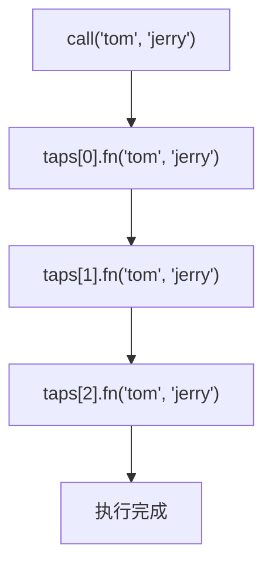
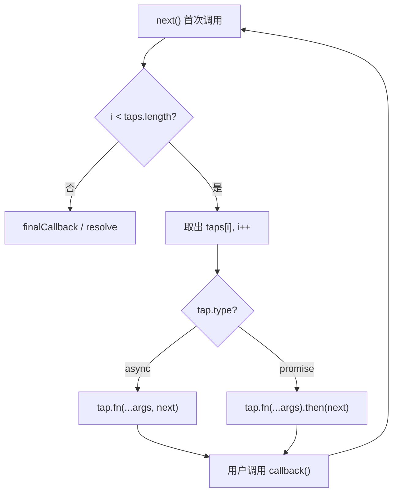

# tapable 源码实现

## 概述

通过手动实现 SyncHook 和 AsyncSeriesHook 的核心逻辑，深入理解 tapable 的设计原理。SyncHook 的本质是数组存储 + for 循环执行；AsyncSeriesHook 的核心是 next 递归函数控制串行流程。掌握这些基础实现后，可轻松扩展到 Bail、Waterfall、Loop 等变体。

## 前置知识

- tapable 实践练习（各类 Hook 的使用方法）
- TypeScript 基础（类、泛型、接口）
- 递归函数与异步流程控制
- 参见：[tapable 实践练习](35-tapable实践.md)

## 学习目标

- 实现 SyncHook 的 tap/call 核心逻辑
- 实现 AsyncSeriesHook 的 tapAsync/tapPromise/callAsync/promise
- 理解 next 函数控制串行执行的原理
- 掌握 Bail/Waterfall/Loop 的扩展实现思路

## 一、项目准备

```bash
mkdir tapable-impl && cd tapable-impl
npm init -y
npm install tsx -D
```

```bash
# 运行 TypeScript 文件（支持 watch 模式）
npx tsx watch sync.ts
```

## 二、实现 SyncHook

### 2.1 设计分析

```
SyncHook 核心功能：
├── constructor(args: string[]) → 存储参数名列表
├── tap(name, fn) → 将回调推入数组
└── call(...args) → for 循环依次执行所有回调
```

### 2.2 完整实现

```typescript
// sync.ts

interface TapItem {
  name: string;
  fn: Function;
}

class SyncHook {
  private args: string[];
  private taps: TapItem[] = [];

  constructor(args: string[]) {
    this.args = args;
  }

  tap(name: string, fn: Function): void {
    this.taps.push({ name, fn });
  }

  call(...args: any[]): void {
    for (const tap of this.taps) {
      tap.fn(...args);
    }
  }
}
```

### 2.3 使用验证

```typescript
const hook = new SyncHook(['arg1', 'arg2']);

hook.tap('A', (a: string, b: string) => console.log('A:', a, b));
hook.tap('B', (a: string, b: string) => console.log('B:', a, b));
hook.tap('C', (a: string, b: string) => console.log('C:', a, b));

hook.call('tom', 'jerry');
// A: tom jerry
// B: tom jerry
// C: tom jerry
```

### 2.4 执行流程



## 三、实现 AsyncSeriesHook

### 3.1 设计分析

```
AsyncSeriesHook 核心功能：
├── tapAsync(name, fn) → 注册 callback 式回调
├── tapPromise(name, fn) → 注册 Promise 式回调
├── callAsync(...args, finalCb) → 串行执行 + 最终回调
├── promise(...args) → 串行执行 + 返回 Promise
└── 关键：next 函数控制流程
```

### 3.2 完整实现

```typescript
// async.ts

type TapType = 'async' | 'promise';

interface TapItem {
  name: string;
  fn: Function;
  type: TapType;
}

class AsyncSeriesHook {
  private args: string[];
  private taps: TapItem[] = [];

  constructor(args: string[]) {
    this.args = args;
  }

  tapAsync(name: string, fn: Function): void {
    this.taps.push({ name, fn, type: 'async' });
  }

  tapPromise(name: string, fn: Function): void {
    this.taps.push({ name, fn, type: 'promise' });
  }

  callAsync(...args: any[]): void {
    // 最后一个是最终回调
    const finalCallback = args.pop();
    let i = 0;

    const next = (error?: any) => {
      // 错误 → 立即终止
      if (error) return finalCallback(error);
      // 全部完成 → 调用最终回调
      if (i >= this.taps.length) return finalCallback();

      const tap = this.taps[i++];

      if (tap.type === 'async') {
        // callback 式：将 next 作为 callback 传入
        tap.fn(...args, next);
      } else {
        // Promise 式：then/catch 控制流程
        tap.fn(...args)
          .then(() => next())
          .catch((err: any) => next(err));
      }
    };

    next();
  }

  promise(...args: any[]): Promise<void> {
    return new Promise<void>((resolve, reject) => {
      let i = 0;

      const next = (error?: any) => {
        if (error) return reject(error);
        if (i >= this.taps.length) return resolve();

        const tap = this.taps[i++];

        if (tap.type === 'async') {
          tap.fn(...args, next);
        } else {
          tap.fn(...args)
            .then(() => next())
            .catch((err: any) => next(err));
        }
      };

      next();
    });
  }
}
```

### 3.3 next 函数原理



核心思想：将 `next` 函数自身作为 callback 传递给每个 tap，当用户调用 `callback()` 时触发下一轮 `next()`，形成递归调用链。

### 3.4 使用验证

```typescript
const hook = new AsyncSeriesHook(['arg1']);

console.time('total');

hook.tapAsync('A', (arg: string, cb: Function) => {
  setTimeout(() => { console.log('A:', arg); cb(); }, 1000);
});

hook.tapPromise('B', (arg: string) => {
  return new Promise((resolve) => {
    setTimeout(() => { console.log('B:', arg); resolve(); }, 500);
  });
});

hook.callAsync('test', (err: any) => {
  console.timeEnd('total');  // ~1.5s（串行）
  console.log(err || 'Done');
});
```

## 四、SyncHook vs AsyncSeriesHook 对比

| 特性 | SyncHook | AsyncSeriesHook |
|------|----------|-----------------|
| 数据结构 | `{ name, fn }` | `{ name, fn, type }` |
| 执行方式 | for 循环 | next 递归 |
| 流程控制 | 无（顺序执行） | 错误中断、串行等待 |
| 调用方法 | call | callAsync / promise |
| 复杂度 | O(n) 遍历 | 递归 + 异步调度 |

## 五、扩展实现思路

### 5.1 SyncBailHook

```typescript
call(...args: any[]): any {
  for (const tap of this.taps) {
    const result = tap.fn(...args);
    if (result !== undefined) {
      return result;  // 截断
    }
  }
}
```

### 5.2 SyncWaterfallHook

```typescript
call(...args: any[]): any {
  let result = args[0];
  for (const tap of this.taps) {
    result = tap.fn(result);  // 上一个返回值作为下一个输入
  }
  return result;
}
```

### 5.3 SyncLoopHook

```typescript
call(...args: any[]): void {
  let i = 0;
  while (i < this.taps.length) {
    const result = this.taps[i].fn(...args);
    if (result !== undefined) {
      // 当前 tap 返回非 undefined → 它自身再次执行（i 不变）
      continue;
    }
    i++;  // 返回 undefined → 推进到下一个 tap
  }
}
```

### 5.4 AsyncParallelHook

```typescript
callAsync(...args: any[]): void {
  const finalCallback = args.pop();
  let remaining = this.taps.length;

  for (const tap of this.taps) {
    const done = (err?: any) => {
      if (err) return finalCallback(err);
      if (--remaining === 0) finalCallback();
    };

    if (tap.type === 'async') {
      tap.fn(...args, done);
    } else {
      tap.fn(...args).then(() => done()).catch(done);
    }
  }
}
```

## 六、官方实现特点

tapable 官方源码（[GitHub](https://github.com/webpack/tapable)）与我们的简化实现的主要区别：

| 特性 | 简化实现 | 官方实现 |
|------|----------|----------|
| 执行函数 | 每次 call 遍历 taps | `new Function()` 动态生成代码 |
| 性能 | 每次调用有循环开销 | 编译后直接执行，无遍历 |
| 拦截器 | 未实现 | 完整的 intercept 机制 |
| 类型安全 | 基础 TypeScript | 完整泛型支持 |

官方源码结构：

```
tapable/lib/
├── Hook.js              # 基类（tap/tapAsync/tapPromise/intercept）
├── HookCodeFactory.js   # 动态代码生成工厂
├── SyncHook.js          # 同步 Hook
├── AsyncSeriesHook.js   # 异步串行
├── AsyncParallelHook.js # 异步并行
└── ...
```

## 常见问题

| 问题 | 解答 |
|------|------|
| 为什么用 next 递归而不是 for 循环？ | 异步操作无法用同步 for 控制时序，需要回调驱动 |
| callAsync 中 args.pop() 会修改原数组吗？ | 会。生产代码应使用 `args.slice(0, -1)` 避免副作用 |
| 官方为什么用 new Function()？ | 性能优化：避免每次 call 都遍历 taps 数组 |
| 如何实现 intercept？ | 在 tap 时触发 register 拦截，在 call 时触发 call/tap 拦截 |

## 最佳实践

1. **先理解再阅读源码**：手写简化版后再看官方实现，事半功倍
2. **关注 next 函数**：这是所有异步 Hook 的核心控制流
3. **用 tsx watch 快速迭代**：修改代码即时看到运行结果
4. **逐步扩展**：SyncHook → Bail → Waterfall → Loop → Async

## 延伸阅读

- [tapable 源码](https://github.com/webpack/tapable/tree/main/lib)
- [HookCodeFactory 动态代码生成分析](https://github.com/webpack/tapable/blob/main/lib/HookCodeFactory.js)
- [JavaScript 异步流程控制模式](https://developer.mozilla.org/zh-CN/docs/Learn/JavaScript/Asynchronous)

---

**上一篇：** [tapable 实践练习](35-tapable实践.md)
**下一篇：** [Webpack 源码执行流程详解](37-源码执行流程详解.md) — Compiler 生命周期、Loader 执行机制
