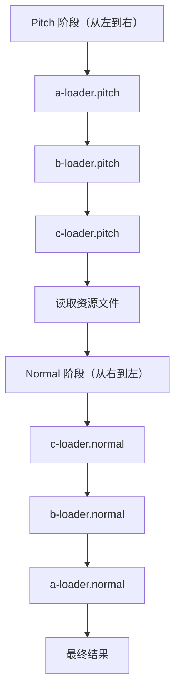
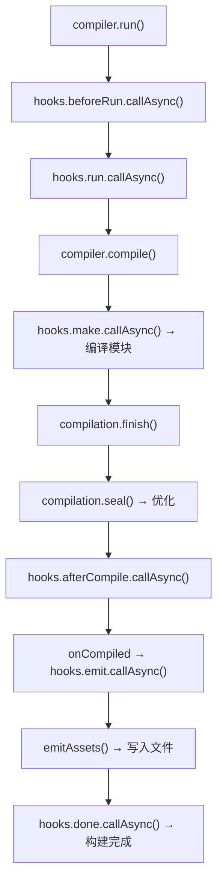
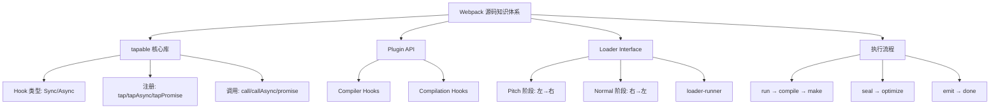

# Webpack 源码执行流程详解

## 概述

Webpack 的构建流程由 Compiler 驱动，经历初始化、编译、优化、输出四大阶段，每个阶段通过 tapable Hook 暴露介入点。本文从 Plugin API 和 Loader Interface 两个维度切入，深入分析 Compiler.run()、compile()、make、seal、emit 等核心方法的源码实现，建立完整的构建流程心智模型。

## 前置知识

- tapable 核心库（Hook 类型与注册/调用）
- Webpack Compiler 创建流程
- Loader 基本概念
- 参见：[tapable 核心库详解](34-tapable核心库.md)、[Webpack CLI build 命令执行流程](32-build命令执行流程.md)

## 学习目标

- 掌握 Webpack Plugin API 的文档结构与核心 Hooks
- 理解 Loader 的 Pitch/Normal 两阶段执行机制
- 掌握 Compiler.run() → compile() → make → seal → emit → done 完整流程
- 能够在源码中定位关键断点位置

## 一、Plugin API 概览

### 1.1 官方文档结构

| 模块 | 内容 |
|------|------|
| tapable | 核心钩子库 |
| Compiler Hooks | 编译器级别生命周期 |
| Compilation Hooks | 单次编译过程 |
| JavascriptParser Hooks | JS 模块解析 |
| NormalModuleFactory Hooks | 模块创建 |
| 自定义钩子 | 插件间通信 |

### 1.2 Compiler 核心 Hooks

| Hook | 类型 | 触发时机 |
|------|------|----------|
| `initialize` | SyncHook | 编译器初始化完成 |
| `beforeRun` | AsyncSeriesHook | run() 执行前 |
| `run` | AsyncSeriesHook | 开始构建 |
| `compile` | SyncHook | 编译开始 |
| `make` | AsyncParallelHook | 模块构建（并行） |
| `afterCompile` | AsyncSeriesHook | 编译完成 |
| `emit` | AsyncSeriesHook | 输出文件前 |
| `done` | AsyncSeriesHook | 构建完成 |

## 二、Loader 执行机制

### 2.1 两阶段执行

Loader 配置 `use: ['a-loader', 'b-loader', 'c-loader']` 的执行顺序：



### 2.2 Pitch 截断机制

如果某个 Loader 的 pitch 函数有返回值，则跳过后续 pitch 和对应的 normal：

```
a-loader.pitch → b-loader.pitch（有返回值）→ 截断！
  ↓
跳过 c-loader.pitch、c-loader.normal、b-loader.normal
  ↓
直接执行 a-loader.normal（接收 pitch 返回值）
```

### 2.3 loader-runner 执行逻辑

```javascript
// 简化的 loader 执行流程
function iteratePitchingLoaders(options, loaderContext, callback) {
  if (loaderIndex < loaders.length) {
    const result = currentLoader.pitch.apply(loaderContext, args);

    if (result !== undefined) {
      // pitch 有返回值 → 跳过后续，回退执行 normal
      loaderIndex--;
      iterateNormalLoaders(options, loaderContext, [result], callback);
    } else {
      // 继续下一个 pitch
      loaderIndex++;
      iteratePitchingLoaders(options, loaderContext, callback);
    }
  } else {
    // pitch 全部完成 → 读取资源 → 进入 normal 阶段
    processResource(options, loaderContext, callback);
  }
}
```

## 三、Compiler 执行流程源码

### 3.1 整体流程



### 3.2 run 方法

```javascript
// webpack/lib/Compiler.js（约第 517 行）
run(callback) {
  const onCompiled = (err, compilation) => {
    if (err) return finalCallback(err);

    // emit 阶段
    this.hooks.emit.callAsync(compilation, (err) => {
      if (err) return finalCallback(err);

      // 写入文件系统
      this.emitAssets(compilation, (err) => {
        if (err) return finalCallback(err);

        // done 钩子
        const stats = new Stats(compilation);
        this.hooks.done.callAsync(stats, finalCallback);
      });
    });
  };

  // beforeRun → run → compile
  this.hooks.beforeRun.callAsync(this, (err) => {
    if (err) return finalCallback(err);

    this.hooks.run.callAsync(this, (err) => {
      if (err) return finalCallback(err);
      this.compile(onCompiled);
    });
  });
}
```

### 3.3 compile 方法

```javascript
// webpack/lib/Compiler.js（约第 1380 行）
compile(callback) {
  const params = {
    normalModuleFactory: this.createNormalModuleFactory(),
    contextModuleFactory: this.createContextModuleFactory(),
  };

  this.hooks.beforeCompile.callAsync(params, (err) => {
    if (err) return callback(err);

    this.hooks.compile.call(params);

    // 创建 Compilation 实例（内部会触发 thisCompilation / compilation 钩子）
    const compilation = this.newCompilation(params);

    this.hooks.thisCompilation.call(compilation, params);
    this.hooks.compilation.call(compilation, params);

    // make 阶段：编译模块
    this.hooks.make.callAsync(compilation, (err) => {
      if (err) return callback(err);

      compilation.finish((err) => {
        if (err) return callback(err);

        // seal 阶段：优化
        compilation.seal((err) => {
          if (err) return callback(err);

          this.hooks.afterCompile.callAsync(compilation, callback);
        });
      });
    });
  });
}
```

### 3.4 make 阶段

make 是 AsyncParallelHook，主要由 EntryPlugin 注册：

```javascript
// EntryPlugin 中注册 make 钩子
compiler.hooks.make.tapAsync('EntryPlugin', (compilation, callback) => {
  compilation.addEntry(context, entry, name, callback);
});
```

### 3.5 seal 阶段

seal 方法的主要工作：
1. 优化模块依赖图
2. 代码分割（Code Splitting）
3. 生成 Chunk
4. 优化 Chunk（Tree Shaking、压缩等）
5. 生成最终代码

### 3.6 emit 阶段

```javascript
const emitAssets = (compilation, callback) => {
  for (const filename in compilation.assets) {
    const source = compilation.assets[filename];
    // 注意写入的是 source.source() 输出的字符串/Buffer 内容
    fs.writeFile(path.join(outputPath, filename), source.source(), callback);
  }
};
```

## 四、执行阶段对照表

| 阶段 | 关键 Hooks / 方法 | 核心职责 |
|------|-------------------|----------|
| 初始化 | initialize | 编译器创建完成 |
| 运行前 | beforeRun → run | 插件预处理 |
| 编译 | compile → make | 模块构建 |
| 模块构建 | buildModule → runLoaders | Loader 转换 |
| 完成模块 | finishModules | 模块构建结束 |
| 封装优化 | seal → optimize | 依赖优化、代码分割 |
| 编译完成 | afterCompile | 编译后处理 |
| 输出 | emit → emitAssets | 写入文件系统 |
| 完成 | done | 构建结束通知 |

## 五、调试断点推荐

| 文件 | 位置 | 观察内容 |
|------|------|----------|
| webpack/lib/index.js | webpack() 入口 | 配置对象、callback |
| webpack/lib/Compiler.js | constructor | 所有 Hooks 定义 |
| webpack/lib/Compiler.js | run() ~L517 | 构建启动流程 |
| webpack/lib/Compiler.js | compile() ~L1380 | Compilation 创建 |
| webpack/lib/Compilation.js | seal() | 优化阶段 |
| webpack/lib/NormalModule.js | runLoaders() ~L1032 | Loader 执行 |

### 源码搜索技巧

```bash
# 查找 Hook 注册位置
grep -rn "hooks.make.tap" webpack/lib/
grep -rn "hooks.emit.tapAsync" webpack/lib/
grep -rn "hooks.run.tapPromise" webpack/lib/
```

## 六、知识架构总结



## 常见问题

| 问题 | 解答 |
|------|------|
| Compiler 和 Compilation 的区别？ | Compiler 代表整个构建生命周期（全局唯一），Compilation 代表一次具体编译（watch 模式下多次） |
| make 为什么是 AsyncParallelHook？ | 多入口模块可以并行构建，提升效率 |
| seal 阶段做了什么优化？ | 模块合并、Chunk 分割、Tree Shaking、代码压缩等 |
| Loader 和 Plugin 的本质区别？ | Loader 转换单个模块内容；Plugin 通过 Hook 介入构建流程的任意阶段 |
| 如何找到某个 Hook 的所有注册者？ | 在源码中搜索 `hooks.xxx.tap/tapAsync/tapPromise` |

## 最佳实践

1. **先跑通再深入**：先用断点跟踪一次完整构建，建立全局视图
2. **关注 Compiler.js 的 run 和 compile**：这两个方法串联了整个流程
3. **结合官方文档**：[Compiler Hooks](https://webpack.js.org/api/compiler-hooks/) 列出了所有钩子的类型和参数
4. **写插件验证理解**：实现一个在每个 Hook 中打印日志的插件，观察触发顺序
5. **对比 Loader 和 Plugin**：理解两者在构建流程中的不同介入点

## 延伸阅读

- [Webpack Compiler Hooks 官方文档](https://webpack.js.org/api/compiler-hooks/)
- [Webpack Compilation Hooks](https://webpack.js.org/api/compilation-hooks/)
- [loader-runner 源码](https://github.com/webpack/loader-runner)
- [Webpack 源码 lib/ 目录](https://github.com/webpack/webpack/tree/main/lib)
- [插件开发基础：实例剖析插件基本形态与架构逻辑](20-插件开发基础.md)

---

**上一篇：** [tapable 源码实现](36-tapable源码实现.md)

> 本篇为 Webpack 源码调试系列的终篇。从环境搭建（29）到 CLI 执行流程（31-32），再到 tapable 钩子机制（34-36），最终回到 Webpack 核心构建流程，形成完整的源码阅读闭环。
