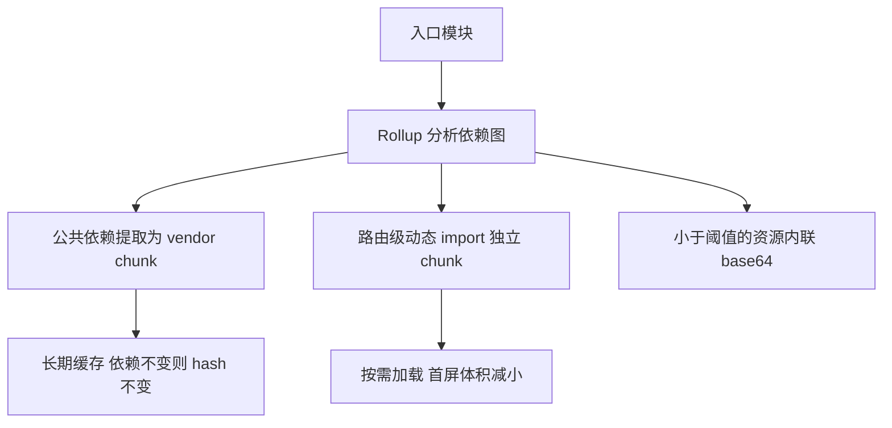

# Vite 核心配置详解

Vite 配置文件（`vite.config.ts`）是控制开发服务器行为、构建产物和插件系统的核心。本文系统梳理所有重要配置项及其实际应用场景。

## 1. 配置文件基础

### 1.1 配置解析顺序

Vite 按以下优先级查找配置：
1. `vite.config.ts` / `vite.config.js` / `vite.config.mjs`
2. 命令行参数覆盖配置文件
3. 环境变量（`.env` 文件）

### 1.2 条件配置

```typescript
import { defineConfig, loadEnv } from 'vite'

// 方式一：直接导出对象
export default defineConfig({
  base: '/',
  plugins: []
})

// 方式二：函数形式（可访问 mode 和 command）
export default defineConfig(({ command, mode }) => {
  const env = loadEnv(mode, process.cwd(), '')

  return {
    base: mode === 'production' ? '/my-app/' : '/',
    define: {
      __APP_VERSION__: JSON.stringify(env.npm_package_version)
    }
  }
})

// 方式三：异步函数
export default defineConfig(async ({ command, mode }) => {
  const config = await fetchRemoteConfig()
  return { ...config }
})
```

## 2. 基础选项

### 2.1 root 与 base

```typescript
export default defineConfig({
  // 项目根目录（index.html 所在位置）
  root: process.cwd(),

  // 部署基础路径
  base: '/',           // 默认
  // base: '/my-app/',   // 子路径部署
  // base: './',          // 相对路径（适合文件协议/CDN）
  // base: 'https://cdn.example.com/',  // CDN 绝对路径
})
```

### 2.2 resolve 模块解析

```typescript
export default defineConfig({
  resolve: {
    // 路径别名（对象形式，键按字符串前缀/精确匹配）
    alias: {
      '@': resolve(__dirname, 'src'),
      '@components': resolve(__dirname, 'src/components'),
    },
    // 正则匹配需改用数组形式：
    // alias: [
    //   { find: /^~(.+)/, replacement: resolve(__dirname, 'node_modules/$1') }
    // ],

    // 扩展名补全（按顺序尝试）
    extensions: ['.mjs', '.js', '.ts', '.jsx', '.tsx', '.json'],

    // package.json 中优先取哪个字段作为入口
    mainFields: ['module', 'jsnext:main', 'jsnext'],

    // 条件导出（package.json exports 字段；会覆盖默认值，需谨慎）
    conditions: ['development', 'browser']
  }
})
```

::: tip 别名与 TypeScript
配置 `resolve.alias` 后需同步更新 `tsconfig.json`：
```json
{
  "compilerOptions": {
    "paths": {
      "@/*": ["./src/*"],
      "@components/*": ["./src/components/*"]
    }
  }
}
```
:::

### 2.3 define 全局常量替换

```typescript
export default defineConfig({
  define: {
    // 编译时文本替换（非运行时变量）
    __APP_VERSION__: JSON.stringify('1.0.0'),
    'process.env.NODE_ENV': JSON.stringify('production'),
    __VUE_OPTIONS_API__: 'true',
    __VUE_PROD_DEVTOOLS__: 'false'
  }
})
```

## 3. 开发服务器配置

### 3.1 server 选项

```typescript
export default defineConfig({
  server: {
    host: '0.0.0.0',     // 监听地址（true 等同 0.0.0.0）
    port: 5173,           // 端口
    strictPort: false,    // 端口被占用时是否报错退出
    open: true,           // 自动打开浏览器
    cors: true,           // 启用 CORS

    // HTTPS 配置
    https: {
      key: fs.readFileSync('./certs/key.pem'),
      cert: fs.readFileSync('./certs/cert.pem')
    },

    // 代理配置
    proxy: {
      '/api': {
        target: 'http://localhost:8080',
        changeOrigin: true,
        rewrite: (path) => path.replace(/^\/api/, '')
      },
      // WebSocket 代理
      '/ws': {
        target: 'ws://localhost:3001',
        ws: true
      }
    },

    // 文件系统访问限制
    fs: {
      strict: true,
      allow: ['..', '/shared/modules']
    },

    // 监听选项
    watch: {
      ignored: ['**/node_modules/**', '**/.git/**']
    },

    // 开发服务器中间件
    headers: {
      'Cache-Control': 'no-store'
    }
  }
})
```

### 3.2 optimizeDeps 依赖预构建

```typescript
export default defineConfig({
  optimizeDeps: {
    // 强制预构建（即使 Vite 已自动检测到）
    include: ['lodash-es', 'axios', 'dayjs'],

    // 排除预构建
    exclude: ['my-linked-package'],

    // esbuild 选项
    esbuildOptions: {
      plugins: [/* esbuild 插件 */],
      target: 'es2020'
    },

    // 是否强制重新预构建（true = 忽略缓存强制重建）
    force: false
  }
})
```

::: warning 何时需要手动 include
当依赖在动态 import 或条件分支中使用时，Vite 的自动扫描可能遗漏。此时需手动添加到 `optimizeDeps.include`。
:::

## 4. 构建配置

### 4.1 build 选项

```typescript
export default defineConfig({
  build: {
    // 输出目录
    outDir: 'dist',
    assetsDir: 'assets',

    // 目标环境
    target: 'es2015',  // 默认 'modules'（Vite 7 起更名为 'baseline-widely-available'，语义为当前主流浏览器基线）

    // 生成 source map
    sourcemap: false,  // true | 'inline' | 'hidden'

    // 压缩
    minify: 'esbuild',  // 'esbuild'（默认）| 'terser' | false

    // terser 配置（minify: 'terser' 时生效）
    terserOptions: {
      compress: {
        drop_console: true,
        drop_debugger: true
      }
    },

    // CSS 代码分割
    cssCodeSplit: true,

    // chunk 大小警告阈值
    chunkSizeWarningLimit: 500,  // kB

    // 资源内联阈值（小于此值的资源转 base64）
    assetsInlineLimit: 4096,  // 4kB

    // Rollup 选项
    rollupOptions: {
      input: {
        main: resolve(__dirname, 'index.html'),
        admin: resolve(__dirname, 'admin.html')
      },
      output: {
        manualChunks: {
          vendor: ['vue', 'vue-router', 'pinia'],
          utils: ['lodash-es', 'dayjs']
        },
        chunkFileNames: 'assets/js/[name]-[hash].js',
        entryFileNames: 'assets/js/[name]-[hash].js',
        assetFileNames: 'assets/[ext]/[name]-[hash].[ext]'
      }
    }
  }
})
```

### 4.2 代码分割策略



```typescript
// 按路由分割（推荐）
output: {
  manualChunks(id) {
    if (id.includes('node_modules')) {
      // 大型库独立 chunk
      if (id.includes('echarts') || id.includes('zrender')) {
        return 'echarts'
      }
      if (id.includes('ant-design-vue')) {
        return 'antd'
      }
      // 其余依赖合并
      return 'vendor'
    }
  }
}
```

### 4.3 库模式

```typescript
export default defineConfig({
  build: {
    lib: {
      entry: resolve(__dirname, 'src/index.ts'),
      name: 'MyComponent',       // UMD 全局变量名
      formats: ['es', 'cjs', 'umd', 'iife'],
      fileName: (format, entryName) => `${entryName}.${format}.js`
    },
    rollupOptions: {
      // 外部化不应打包进库的依赖
      external: ['vue'],
      output: {
        globals: { vue: 'Vue' },
        // 保留 CSS 独立文件
        assetFileNames: 'style.css'
      }
    },
    // 库模式建议关闭压缩（由使用者控制）
    minify: false
  }
})
```

## 5. CSS 配置

```typescript
export default defineConfig({
  css: {
    // CSS Modules 配置
    modules: {
      localsConvention: 'camelCaseOnly',
      scopeBehaviour: 'local',
      generateScopedName: '[name]__[local]--[hash:base64:5]'
    },

    // 预处理器选项
    preprocessorOptions: {
      scss: {
        additionalData: `@use "@/styles/variables" as *;`,
        api: 'modern-compiler'  // Sass 现代 API
      },
      less: {
        javascriptEnabled: true,
        modifyVars: { 'primary-color': '#1890ff' }
      }
    },

    // PostCSS 配置（也可用 postcss.config.js）
    postcss: {
      plugins: [
        require('autoprefixer'),
        require('postcss-px-to-viewport')({
          viewportWidth: 375
        })
      ]
    },

    // 开发时注入 source map
    devSourcemap: true
  }
})
```

## 6. 多环境配置

### 6.1 环境变量文件

```
.env                    # 所有环境
.env.local              # 所有环境（git 忽略）
.env.development        # vite dev 时加载
.env.production         # vite build 时加载
.env.staging            # vite build --mode staging 时加载
```

### 6.2 在配置中使用

```typescript
export default defineConfig(({ mode }) => {
  const env = loadEnv(mode, process.cwd(), 'VITE_')

  return {
    define: {
      __API_BASE__: JSON.stringify(env.VITE_API_URL)
    },
    build: {
      sourcemap: mode !== 'production'
    }
  }
})
```

## 7. 配置最佳实践

::: tip 使用 defineConfig 获得类型提示
始终从 `vite` 导入 `defineConfig` 包裹配置对象，获得完整的 TypeScript 类型推断。
:::

::: tip 按环境拆分配置
大型项目可拆分配置文件：
```
vite.config.ts          ← 公共配置
vite.config.dev.ts      ← 开发专属
vite.config.prod.ts     ← 生产专属
```
通过 `--config` 参数指定：`vite build --config vite.config.prod.ts`
:::

::: warning 避免在配置中使用 ESM 顶层 await
`vite.config.ts` 在 Node.js 中执行。顶层 await 需要 Node 14.8+ 且文件为 `.mts` 或 package.json 设置 `"type": "module"`。
:::
