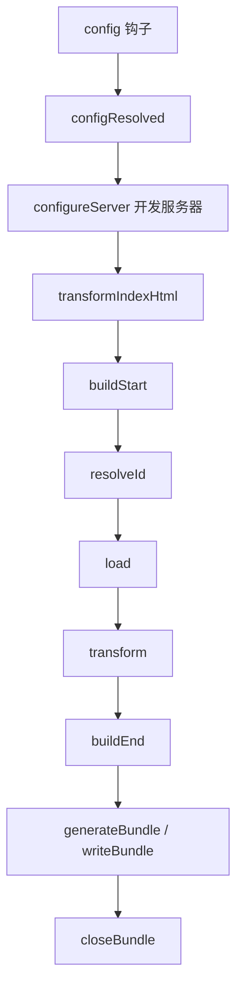

# Vite 插件系统

Vite 的插件系统建立在 Rollup 插件接口之上，并扩展了若干 Vite 专属钩子。理解插件机制是深度定制 Vite 构建流程的关键。

## 1. 插件工作原理

### 1.1 插件生命周期



### 1.2 插件执行顺序

```typescript
export default defineConfig({
  plugins: [
    // 默认：normal（在 Vite 核心插件之后）
    myPlugin(),

    // pre：在 Vite 核心插件之前执行
    { ...myPrePlugin(), enforce: 'pre' },

    // post：在所有插件之后执行（含构建插件）
    { ...myPostPlugin(), enforce: 'post' }
  ]
})
```

执行顺序：`Alias → pre 插件 → Vite 核心 → normal 插件 → Vite 构建 → post 插件`

## 2. 通用钩子（Rollup 兼容）

### 2.1 resolveId

自定义模块解析逻辑：

```typescript
const virtualModulePlugin = (): Plugin => ({
  name: 'virtual-module',

  resolveId(id) {
    if (id === 'virtual:config') {
      return '\0virtual:config'  // \0 前缀约定为虚拟模块
    }
  },

  load(id) {
    if (id === '\0virtual:config') {
      return `export default ${JSON.stringify({ version: '1.0.0' })}`
    }
  }
})
```

### 2.2 transform

转换模块源码：

```typescript
const markdownPlugin = (): Plugin => ({
  name: 'vite-plugin-md',

  transform(code, id) {
    if (!id.endsWith('.md')) return null

    // 将 Markdown 转为 Vue 组件
    const html = marked.parse(code)
    return {
      code: `export default { template: ${JSON.stringify(html)} }`,
      map: null  // 或提供 source map
    }
  }
})
```

### 2.3 buildStart / buildEnd

```typescript
const timingPlugin = (): Plugin => {
  let startTime: number

  return {
    name: 'build-timing',
    buildStart() {
      startTime = Date.now()
      console.log('构建开始...')
    },
    buildEnd() {
      console.log(`构建耗时: ${Date.now() - startTime}ms`)
    }
  }
}
```

## 3. Vite 专属钩子

### 3.1 config

在配置解析前修改/补充配置：

```typescript
const autoImportPlugin = (): Plugin => ({
  name: 'auto-import',
  enforce: 'pre',

  config() {
    return {
      resolve: {
        alias: {
          '@auto': resolve(__dirname, 'src/auto-imports')
        }
      },
      optimizeDeps: {
        include: ['vue', 'pinia']
      }
    }
  }
})
```

### 3.2 configResolved

配置确定后的只读访问：

```typescript
let isBuild: boolean

const envPlugin = (): Plugin => ({
  name: 'env-check',

  configResolved(config) {
    // command 为 'serve' | 'build'，环境是否生产由 mode 决定
    isBuild = config.command === 'build'
    console.log(`模式: ${config.mode}, 命令: ${config.command}`)
  }
})
```

### 3.3 configureServer

自定义开发服务器中间件：

```typescript
const mockApiPlugin = (): Plugin => ({
  name: 'mock-api',

  configureServer(server) {
    // 在内部中间件之前注册
    server.middlewares.use('/api', (req, res) => {
      res.setHeader('Content-Type', 'application/json')
      res.end(JSON.stringify({ code: 0, data: 'mock' }))
    })

    // 在内部中间件之后注册（返回函数）
    return () => {
      server.middlewares.use((req, res, next) => {
        // 自定义 404 处理
        if (req.url?.startsWith('/missing')) {
          res.statusCode = 404
          res.end('Not Found')
          return
        }
        next()
      })
    }
  }
})
```

### 3.4 transformIndexHtml

转换 HTML 入口：

```typescript
const htmlPlugin = (): Plugin => ({
  name: 'html-transform',

  transformIndexHtml(html) {
    return html.replace(
      '<title>__TITLE__</title>',
      '<title>My App - Production</title>'
    )
  }
})

// 对象形式（更精细控制）
const htmlPlugin2 = (): Plugin => ({
  name: 'html-inject',

  transformIndexHtml: {
    order: 'pre',  // 'pre' | 'post'
    handler(html, ctx) {
      // ctx.filename, ctx.server, ctx.bundle
      return [
        {
          tag: 'script',
          attrs: { src: '/analytics.js', defer: true },
          injectTo: 'head'
        }
      ]
    }
  }
})
```

### 3.5 handleHotUpdate

自定义 HMR 行为：

```typescript
const jsonHmrPlugin = (): Plugin => ({
  name: 'json-hmr',

  handleHotUpdate({ file, server }) {
    if (file.endsWith('.json')) {
      // 发送自定义事件到客户端
      server.ws.send({
        type: 'custom',
        event: 'json-update',
        data: { file, content: fs.readFileSync(file, 'utf-8') }
      })
      // 返回空数组阻止默认 HMR
      return []
    }
  }
})
```

客户端接收：

```typescript
// main.ts
if (import.meta.hot) {
  import.meta.hot.on('json-update', ({ file, content }) => {
    console.log(`${file} 已更新`, JSON.parse(content))
  })
}
```

## 4. 官方插件

| 插件 | 包名 | 功能 |
|------|------|------|
| Vue | `@vitejs/plugin-vue` | Vue 3 SFC 支持 |
| Vue JSX | `@vitejs/plugin-vue-jsx` | Vue JSX/TSX 转换 |
| React | `@vitejs/plugin-react` | React Fast Refresh |
| React SWC | `@vitejs/plugin-react-swc` | SWC 编译（更快） |
| Legacy | `@vitejs/plugin-legacy` | 旧浏览器兼容 |
| ESLint | `vite-plugin-eslint` | 开发时 Lint |
| PWA | `vite-plugin-pwa` | Service Worker / PWA |

### 4.1 使用示例

```typescript
import vue from '@vitejs/plugin-vue'
import legacy from '@vitejs/plugin-legacy'
import { VitePWA } from 'vite-plugin-pwa'

export default defineConfig({
  plugins: [
    vue({
      script: {
        defineModel: true
      },
      template: {
        compilerOptions: {
          isCustomElement: (tag) => tag.startsWith('my-')
        }
      }
    }),

    legacy({
      targets: ['defaults', 'not IE 11'],
      modernPolyfills: true
    }),

    VitePWA({
      registerType: 'autoUpdate',
      manifest: {
        name: 'My App',
        short_name: 'App',
        theme_color: '#ffffff'
      }
    })
  ]
})
```

## 5. 插件开发实战

### 5.1 自动路由生成插件

```typescript
import fg from 'fast-glob'
import { resolve, basename } from 'path'

export function autoRoutes(pagesDir: string): Plugin {
  let root: string

  return {
    name: 'vite-plugin-auto-routes',
    enforce: 'pre',

    configResolved(config) {
      root = config.root
    },

    resolveId(id) {
      if (id === 'virtual:routes') return '\0virtual:routes'
    },

    load(id) {
      if (id !== '\0virtual:routes') return

      const files = fg.sync('**/*.{vue,tsx}', {
        cwd: resolve(root, pagesDir)
      })

      const routes = files.map((file) => {
        const name = basename(file, /\.\w+$/.exec(file)![0])
        const path = '/' + file
          .replace(/\.\w+$/, '')
          .replace(/index$/, '')
          .replace(/\[(\w+)\]/g, ':$1')
        return { path, file }
      })

      const imports = routes
        .map((r, i) => `const C${i} = () => import('${pagesDir}/${r.file}')`)
        .join('\n')

      const routeDefs = routes
        .map((r, i) => `  { path: '${r.path}', component: C${i} }`)
        .join(',\n')

      return `${imports}\nexport const routes = [\n${routeDefs}\n]`
    },

    handleHotUpdate({ file, server }) {
      if (file.includes(pagesDir)) {
        const mod = server.moduleGraph.getModuleById('\0virtual:routes')
        if (mod) {
          server.moduleGraph.invalidateModule(mod)
          server.ws.send({ type: 'full-reload' })
          return []
        }
      }
    }
  }
}
```

### 5.2 插件调试技巧

```typescript
// 设置环境变量查看详细日志
// DEBUG=vite:* pnpm dev

// 在插件中添加性能标记
transform(code, id) {
  const start = performance.now()
  // ... 转换逻辑
  const duration = performance.now() - start
  if (duration > 100) {
    console.warn(`[slow] ${id}: ${duration.toFixed(0)}ms`)
  }
}
```

## 6. 最佳实践

::: tip 插件命名规范
自定义插件以 `vite-plugin-` 为前缀（如 `vite-plugin-auto-routes`），便于社区识别和搜索。
:::

::: tip 使用 apply 限定生效环境
```typescript
const buildOnlyPlugin = (): Plugin => ({
  name: 'build-only',
  apply: 'build',  // 仅 build 时生效（'serve' = 仅开发）
  // ...
})
```
:::

::: warning transform 中避免副作用
`transform` 钩子可能被多次调用（HMR 重新编译）。不要在其中写文件、修改全局状态。副作用操作放在 `buildEnd` 或 `closeBundle`。
:::
