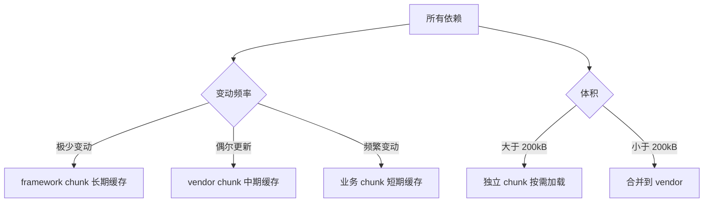

# Vite 构建优化与部署

生产环境的构建产物直接影响用户体验。本文涵盖性能分析、产物优化、部署策略和常见问题排查。

## 1. 构建产物分析

### 1.1 可视化分析

```bash
# 安装 rollup-plugin-visualizer
pnpm add -D rollup-plugin-visualizer
```

```typescript
// vite.config.ts
import { visualizer } from 'rollup-plugin-visualizer'

export default defineConfig({
  plugins: [
    visualizer({
      filename: 'stats.html',
      open: true,
      gzipSize: true,
      brotliSize: true
    })
  ]
})
```

```bash
pnpm build  # 生成 stats.html 可视化报告
```

### 1.2 产物体积检查

```bash
# 查看各 chunk 大小
vite build --mode production

# 输出示例：
# dist/assets/index-a1b2c3.js    142.56 kB │ gzip: 45.21 kB
# dist/assets/vendor-d4e5f6.js   289.34 kB │ gzip: 92.18 kB
# dist/assets/echarts-g7h8i9.js  812.45 kB │ gzip: 261.03 kB
```

::: warning chunk 体积红线
- 单个 chunk > 500kB（gzip 前）会触发警告
- 首屏 JS 总量建议 < 200kB（gzip 后）
- 图片资源优先使用 WebP/AVIF + CDN
:::

## 2. 代码分割优化

### 2.1 路由级分割

```typescript
// router/index.ts
const routes = [
  {
    path: '/',
    component: () => import('@/views/Home.vue')  // 独立 chunk
  },
  {
    path: '/dashboard',
    component: () => import('@/views/Dashboard.vue')
  },
  {
    path: '/settings',
    // webpackChunkName 注释在 Vite 中无效
    // 使用 rollup 的 manualChunks 或输出命名
    component: () => import('@/views/Settings.vue')
  }
]
```

### 2.2 manualChunks 策略

```typescript
export default defineConfig({
  build: {
    rollupOptions: {
      output: {
        manualChunks: {
          // 框架核心（极少变动 → 长期缓存）
          'framework': ['vue', 'vue-router', 'pinia'],

          // UI 组件库
          'ui': ['ant-design-vue', '@ant-design/icons-vue'],

          // 工具库
          'utils': ['lodash-es', 'dayjs', 'axios'],

          // 图表（体积大，按需加载）
          'charts': ['echarts', 'zrender']
        }
      }
    }
  }
})
```

### 2.3 分割原则



| 原则 | 说明 |
|------|------|
| 按变动频率分 | 不常变的依赖独立缓存，避免业务更新导致依赖缓存失效 |
| 按体积分 | 超大库（echarts/three.js）独立 chunk + 动态 import |
| 避免过度分割 | chunk 过多增加 HTTP 请求数，HTTP/2 下建议 5-15 个 |
| 入口 chunk 最小化 | 首屏只加载必要代码，其余懒加载 |

## 3. 资源优化

### 3.1 图片优化

> 注意：vite-plugin-imagemin 已多年未维护，在新版 Node 上安装常失败。新项目建议改用基于 sharp 的 vite-plugin-image-optimizer 或在 CI 中用 squoosh/sharp 预处理。以下配置仅作历史参考。

```bash
pnpm add -D vite-plugin-imagemin
```

```typescript
import viteImagemin from 'vite-plugin-imagemin'

export default defineConfig({
  plugins: [
    viteImagemin({
      gifsicle: { optimizationLevel: 3 },
      optipng: { optimizationLevel: 7 },
      mozjpeg: { quality: 80 },
      pngquant: { quality: [0.65, 0.8], speed: 4 },
      svgo: {
        plugins: [
          { name: 'removeViewBox', active: false },
          { name: 'removeEmptyAttrs', active: true }
        ]
      }
    })
  ]
})
```

### 3.2 字体子集化

> 注意：vite-plugin-fonts 同样已停止维护，可考虑 vite-plugin-webfont-dl 或 unplugin-fonts 替代。

```bash
pnpm add -D vite-plugin-fonts
```

```typescript
import { VitePluginFonts } from 'vite-plugin-fonts'

export default defineConfig({
  plugins: [
    VitePluginFonts({
      custom: {
        families: [{
          name: 'MyFont',
          local: 'MyFont',
          src: './src/assets/fonts/*.woff2'
        }],
        display: 'swap',
        preload: true
      }
    })
  ]
})
```

### 3.3 压缩策略

```typescript
export default defineConfig({
  build: {
    // esbuild 压缩（默认，速度最快）
    minify: 'esbuild',

    // 或改用 terser（压缩率略高，速度慢）
    // minify: 'terser',
    // terserOptions: {
    //   compress: {
    //     drop_console: true,      // 移除 console
    //     drop_debugger: true,     // 移除 debugger
    //     pure_funcs: ['console.log']  // 移除指定函数调用
    //   },
    //   format: {
    //     comments: false  // 移除注释
    //   }
    // }
  }
})
```

## 4. 预渲染与 SSG

### 4.1 vite-ssg

```bash
pnpm add vite-ssg
```

```typescript
// src/main.ts
import { ViteSSG } from 'vite-ssg'
import App from './App.vue'

export const createApp = ViteSSG(App, { routes }, ({ app, router }) => {
  // 安装插件
})
```

### 4.2 vite-plugin-ssr（Vike）

适用于需要 SSR/SSG 的复杂应用。

> 注意：vite-plugin-ssr 已于 2024 年更名为 Vike，包名为 `vike`；下文沿用旧名。

```bash
pnpm add -D vite-plugin-ssr
```

```
pages/
├── index/
│   ├── +Page.vue
│   ├── +data.ts       ← 数据获取
│   └── +config.ts     ← 页面配置
└── about/
    └── +Page.vue
```

## 5. 部署方案

### 5.1 静态部署（CDN / Nginx）

```11-Nginx基础概述
server {
    listen 80;
    server_name example.com;
    root /var/www/my-app/dist;
    index index.html;

    # 带 hash 的资源 → 强缓存
    location /assets/ {
        expires 1y;
        add_header Cache-Control "public, immutable";
    }

    # HTML → 协商缓存
    location / {
        try_files $uri $uri/ /index.html;
        add_header Cache-Control "no-cache";
    }

    # Gzip / Brotli
    gzip on;
    gzip_types text/plain application/javascript text/css application/json;
    gzip_min_length 1024;
}
```

### 5.2 Vercel 部署

```json
{
  "buildCommand": "pnpm build",
  "outputDirectory": "dist",
  "framework": "vite",
  "rewrites": [
    { "source": "/(.*)", "destination": "/index.html" }
  ]
}
```

### 5.3 Docker 部署

```dockerfile
# 构建阶段
FROM node:20-alpine AS builder
WORKDIR /app
COPY package.json pnpm-lock.yaml ./
RUN corepack enable && pnpm install --frozen-lockfile
COPY . .
RUN pnpm build

# 运行阶段
FROM 11-Nginx基础概述:alpine
COPY --from=builder /app/dist /usr/share/11-Nginx基础概述/html
COPY 11-Nginx基础概述.conf /etc/11-Nginx基础概述/conf.d/default.conf
EXPOSE 80
CMD ["11-Nginx基础概述", "-g", "daemon off;"]
```

## 6. 性能监控

### 6.1 构建耗时分析

```bash
# 使用 --profile 生成 CPU profile
vite build --profile

# 用 Chrome DevTools → Performance → Load profile 分析
```

### 6.2 运行时性能指标

```typescript
// 在入口文件注入 Web Vitals 采集
import { onCLS, onINP, onLCP, onFCP, onTTFB } from 'web-vitals'

function reportMetric(metric) {
  navigator.sendBeacon('/analytics', JSON.stringify({
    name: metric.name,
    value: metric.value,
    rating: metric.rating
  }))
}

onCLS(reportMetric)
onINP(reportMetric)
onLCP(reportMetric)
onFCP(reportMetric)
onTTFB(reportMetric)
```

> 注：FID 已于 2024-03 被 INP 正式取代（web-vitals v4 起弃用 `onFID`，v5 已移除），新代码一律采集 INP。

## 7. 常见问题排查

| 问题 | 原因 | 解决方案 |
|------|------|---------|
| 构建后白屏 | `base` 配置错误 | 检查部署路径与 `base` 是否匹配 |
| 依赖预构建缓存过期 | 锁定文件变更 | `rm -rf node_modules/.vite && pnpm dev` |
| 动态 import 路径报错 | 变量路径无法静态分析 | 使用 `import.meta.glob` 或固定前缀 |
| CSS 顺序不一致 | 异步 chunk 加载顺序不确定 | 使用 `cssCodeSplit: false` 或明确 import 顺序 |
| 构建产物过大 | 全量引入组件库 | 使用按需导入插件（unplugin-vue-components） |
| HMR 失效 | 循环依赖/副作用模块 | 检查模块是否有顶层副作用 |

::: tip import.meta.glob 替代动态路径
```typescript
// 错误：变量路径无法被 Rollup 静态分析
const module = await import(`./views/${name}.vue`)

// 正确：使用 glob 预收集
const modules = import.meta.glob('./views/*.vue')
const module = await modules[`./views/${name}.vue`]()
```
:::
