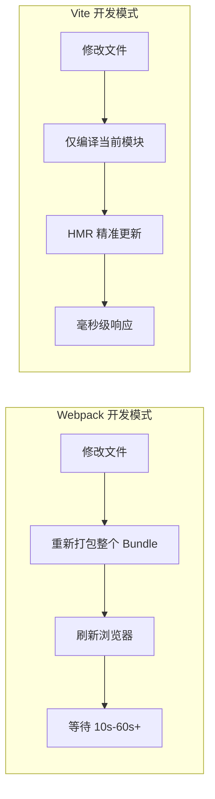
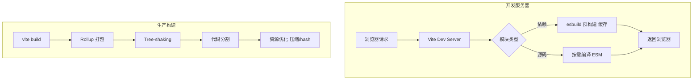
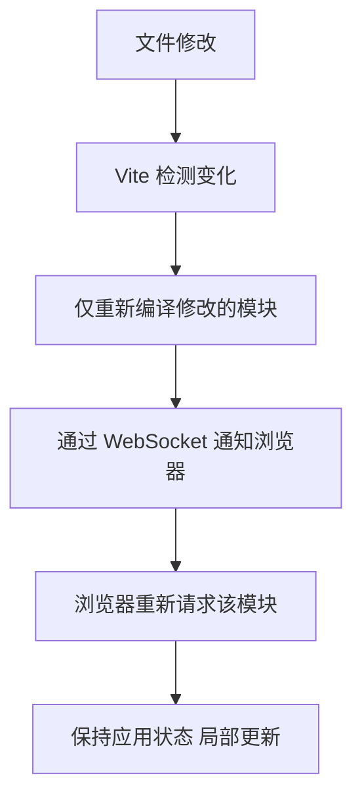

# Vite 概述与快速上手

Vite（法语"快速"）是新一代前端构建工具，由 Vue.js 作者尤雨溪创建。它利用浏览器原生 ES Module 和 esbuild 预构建实现极速开发服务器，生产构建则基于 Rollup 输出高度优化的静态资源。

## 1. 为什么选择 Vite

### 1.1 传统打包器的痛点



| 维度 | Webpack | Vite |
|------|---------|------|
| 冷启动 | 打包所有模块后启动（慢） | 按需编译，即刻启动（快） |
| HMR 速度 | 随项目规模线性增长 | 始终毫秒级（与规模无关） |
| 配置复杂度 | 高（Loader/Plugin/Resolve） | 低（开箱即用） |
| TypeScript | 需要 ts-loader/babel | 原生支持（esbuild 转译） |
| CSS 预处理器 | 需要配置 Loader | 内置支持 |

### 1.2 核心架构



## 2. 快速上手

### 2.1 创建项目

```bash
# npm
npm create vite@latest my-app -- --template react-ts

# pnpm（推荐）
pnpm create vite my-app --template vue-ts

# 可选模板
# vanilla / vue / react / preact / lit / svelte / solid / qwik
# 加 -ts 后缀使用 TypeScript
```

### 2.2 项目结构

```
my-app/
├── index.html          ← 入口（Vite 以此为核心）
├── package.json
├── vite.config.ts      ← 配置文件
├── tsconfig.json
├── public/             ← 静态资源（原样复制）
│   └── favicon.svg
└── src/
    ├── main.ts         ← JS 入口
    ├── App.vue         ← 根组件
    ├── style.css
    └── components/
```

::: tip index.html 是入口
与 Webpack 不同，Vite 以 `index.html` 为构建入口（而非 JS 文件）。HTML 中通过 `<script type="module">` 引用源码：
```html
<script type="module" src="/src/main.ts"></script>
```
:::

### 2.3 启动开发

```bash
cd my-app
pnpm install
pnpm dev
```

输出：
```
VITE v5.x.x  ready in 120 ms

➜  Local:   http://localhost:5173/
➜  Network: http://192.168.1.100:5173/
```

### 2.4 生产构建

```bash
pnpm build     # 输出到 dist/
pnpm preview   # 本地预览构建产物
```

## 3. 核心概念

### 3.1 依赖预构建

Vite 首次启动时使用 esbuild 将 `node_modules` 中的依赖预构建为 ESM：

```
node_modules/
  lodash-es/          ← 数百个 ESM 文件
    ↓ esbuild 预构建
node_modules/.vite/
  deps/
    lodash-es.js      ← 合并为单个文件
    _metadata.json    ← 缓存哈希
```

**预构建解决的问题：**
1. **CommonJS → ESM**：浏览器不支持 CJS，需转换
2. **性能**：将数百个模块文件合并为少量文件，减少 HTTP 请求

### 3.2 模块热替换（HMR）

Vite 的 HMR 基于原生 ESM：



- 只失效修改模块及其影响链
- 不重新打包无关模块
- 大型项目也能保持毫秒级更新

### 3.3 环境变量

```bash
# .env                ← 所有环境加载
VITE_APP_TITLE=My App

# .env.development    ← 仅开发环境
VITE_API_URL=http://localhost:3000

# .env.production     ← 仅生产环境
VITE_API_URL=https://api.example.com
```

代码中使用：

```typescript
// 仅 VITE_ 前缀的变量暴露给客户端
const apiUrl = import.meta.env.VITE_API_URL
const isDev = import.meta.env.DEV    // boolean
const isProd = import.meta.env.PROD  // boolean
const mode = import.meta.env.MODE    // 'development' | 'production'
```

::: warning 安全提示
`VITE_` 前缀的变量会被打包进客户端代码。**不要**在 `.env` 中存放密钥、Token 等敏感信息。
:::

## 4. 与现有项目集成

### 4.1 替换 Webpack（渐进迁移）

```bash
# 安装 Vite 和对应插件
pnpm add -D vite @vitejs/plugin-react

# 创建 vite.config.ts
# 将 index.html 移到项目根目录
# 修改 package.json scripts
```

```json
{
  "scripts": {
    "dev": "vite",
    "build": "vite build",
    "preview": "vite preview"
  }
}
```

### 4.2 作为库打包工具

```typescript
// vite.config.ts
import { defineConfig } from 'vite'
import { resolve } from 'path'

export default defineConfig({
  build: {
    lib: {
      entry: resolve(__dirname, 'src/index.ts'),
      name: 'MyLib',
      formats: ['es', 'cjs', 'umd'],
      fileName: (format) => `my-lib.${format}.js`
    },
    rollupOptions: {
      external: ['vue', 'react'],
      output: {
        globals: { vue: 'Vue', react: 'React' }
      }
    }
  }
})
```

## 5. 常用命令

| 命令 | 说明 |
|------|------|
| `vite` | 启动开发服务器 |
| `vite build` | 生产构建 |
| `vite preview` | 预览构建产物 |
| `vite optimize` | 手动触发依赖预构建 |
| `vite --port 3000` | 指定端口 |
| `vite --host` | 暴露到局域网 |
| `vite build --watch` | 监听模式构建 |

## 6. 最佳实践

::: tip 使用 pnpm
Vite 的依赖预构建对 pnpm 的符号链接结构有良好支持，且 pnpm 安装速度更快。
:::

::: tip 合理配置 server.proxy
开发时通过代理解决跨域，避免 CORS 配置：
```typescript
export default defineConfig({
  server: {
    proxy: {
      '/api': {
        target: 'http://localhost:8080',
        changeOrigin: true,
        rewrite: (path) => path.replace(/^\/api/, '')
      }
    }
  }
})
```
:::

::: warning 避免在源码中引用 public/ 资源
`public/` 中的文件不经过 Vite 处理（无 hash、无压缩优化）。优先将资源放在 `src/` 中通过 import 引用。
:::
