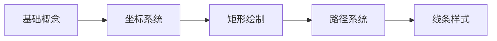
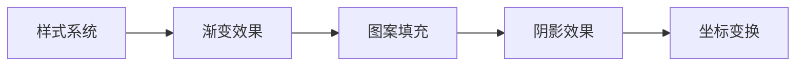
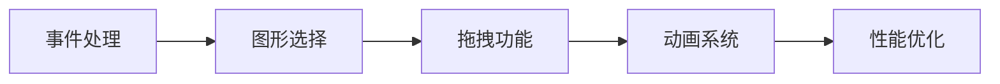

# Canvas 教程总览

Canvas 是 HTML5 提供的一个强大的 2D 绘图 API，允许开发者通过 JavaScript 在网页上绘制图形、动画和处理图像。本教程全面介绍 Canvas 的核心概念、API 使用和最佳实践。

## Canvas 简介

### 什么是 Canvas

Canvas 是一个可以使用脚本（通常是 JavaScript）绑定的 HTML 元素，用于绘制图形。它可以用于：

- **图形绘制**：绘制形状、路径、曲线
- **图像处理**：图像滤镜、像素操作、截图
- **动画制作**：游戏、数据可视化、交互效果
- **视频处理**：视频滤镜、实时处理

### Canvas vs SVG

| 特性 | Canvas | SVG |
|------|--------|-----|
| 渲染方式 | 位图（像素） | 矢量（图形） |
| DOM 结构 | 单个元素 | 每个图形是 DOM 元素 |
| 性能 | 适合大量图形、游戏 | 适合少量图形、图标 |
| 事件处理 | 需要手动实现 | 原生支持 |
| 缩放 | 放大会模糊 | 无限缩放不失真 |
| 适用场景 | 游戏、图表、图像处理 | 图标、简单图形、动画 |

### 浏览器支持

所有现代浏览器都支持 Canvas：

```
Chrome 4+ | Firefox 2+ | Safari 3.1+ | Edge 12+ | Opera 9+
```

---

## 系统架构

### Canvas 技术架构图

```
┌─────────────────────────────────────────────────────────────┐
│                    Canvas 应用层                             │
│  ┌───────────┐ ┌───────────┐ ┌───────────┐ ┌───────────┐   │
│  │   游戏    │ │ 数据可视化 │ │  图像处理  │ │  动画效果  │   │
│  └───────────┘ └───────────┘ └───────────┘ └───────────┘   │
├─────────────────────────────────────────────────────────────┤
│                    Canvas API 层                             │
│  ┌─────────────────────────────────────────────────────┐   │
│  │              CanvasRenderingContext2D               │   │
│  ├───────────┬───────────┬───────────┬────────────────┤   │
│  │  绘图方法  │  路径系统  │  样式系统  │  变换系统      │   │
│  ├───────────┼───────────┼───────────┼────────────────┤   │
│  │  文本绘制  │  图像处理  │  像素操作  │  合成系统      │   │
│  └───────────┴───────────┴───────────┴────────────────┘   │
├─────────────────────────────────────────────────────────────┤
│                    底层实现层                                │
│  ┌─────────────────────────────────────────────────────┐   │
│  │            GPU 硬件加速 / 软件渲染                   │   │
│  └─────────────────────────────────────────────────────┘   │
└─────────────────────────────────────────────────────────────┘
```

### 核心模块关系

```
┌──────────────┐
│  Canvas 元素  │
└──────┬───────┘
       │ getContext('2d')
       ▼
┌──────────────────┐
│ 渲染上下文 (ctx)  │
├──────────────────┤
│ ┌──────────────┐ │
│ │   状态栈     │ │─── save() / restore()
│ └──────────────┘ │
│ ┌──────────────┐ │
│ │   路径系统   │ │─── beginPath() / moveTo() / lineTo()
│ └──────────────┘ │
│ ┌──────────────┐ │
│ │   变换矩阵   │ │─── translate() / rotate() / scale()
│ └──────────────┘ │
│ ┌──────────────┐ │
│ │   样式属性   │ │─── fillStyle / strokeStyle
│ └──────────────┘ │
└──────────────────┘
```

---

## 核心概念

### 1. 坐标系统

```
  0 ────────────── X 轴（向右为正）───────→
  │
  │
  │    Canvas 绘图区域
  │
  │
  Y 轴
  （向下为正）
  ↓
```

- 原点 (0, 0) 位于左上角
- X 轴向右为正，Y 轴向下为正
- 单位为像素

### 2. 渲染上下文

```javascript
const canvas = document.getElementById('myCanvas')
const ctx = canvas.getContext('2d')  // 获取 2D 渲染上下文
```

### 3. 绘图状态

Canvas 使用状态栈管理绘图状态：

```javascript
ctx.save()    // 保存当前状态
// ... 绘制操作 ...
ctx.restore() // 恢复到之前的状态
```

保存的状态包括：
- 变换矩阵
- 裁剪区域
- 样式属性（fillStyle, strokeStyle, lineWidth 等）
- 阴影属性
- 字体属性
- 合成属性

### 4. 路径系统

Canvas 使用路径来定义图形形状：

```javascript
ctx.beginPath()      // 开始新路径
ctx.moveTo(50, 50)   // 移动到起点
ctx.lineTo(200, 50)  // 画线到终点
ctx.closePath()      // 闭合路径
ctx.stroke()         // 描边
ctx.fill()           // 填充
```

### 5. 绘制流程

```
┌──────────────┐
│ 清除画布     │ clearRect()
└──────┬───────┘
       ▼
┌──────────────┐
│ 保存状态     │ save()
└──────┬───────┘
       ▼
┌──────────────┐
│ 设置样式     │ fillStyle, strokeStyle, lineWidth...
└──────┬───────┘
       ▼
┌──────────────┐
│ 应用变换     │ translate, rotate, scale
└──────┬───────┘
       ▼
┌──────────────┐
│ 创建路径     │ beginPath, moveTo, lineTo, arc...
└──────┬───────┘
       ▼
┌──────────────┐
│ 绘制图形     │ fill(), stroke()
└──────┬───────┘
       ▼
┌──────────────┐
│ 恢复状态     │ restore()
└──────────────┘
```

---

## 学习路径

### 初级：基础绘图



**学习内容：**
- Canvas 坐标系统与画布设置
- 矩形绘制（fillRect, strokeRect, clearRect）
- 路径基础（beginPath, moveTo, lineTo, closePath）
- 线条样式（lineWidth, lineCap, lineJoin）

### 中级：样式与变换



**学习内容：**
- 填充与描边样式
- 线性与径向渐变
- 图案创建与填充
- 阴影效果
- 平移、旋转、缩放变换

### 高级：交互与动画



**学习内容：**
- 鼠标与触摸事件处理
- 图形选择与点击检测
- 拖拽功能实现
- requestAnimationFrame 动画
- 性能优化策略

---

## 环境准备

### HTML 结构

```html
<!DOCTYPE html>
<html lang="zh-CN">
<head>
  <meta charset="UTF-8">
  <meta name="viewport" content="width=device-width, initial-scale=1.0">
  <title>Canvas 示例</title>
  <style>
    canvas {
      border: 1px solid #ccc;
      display: block;
      margin: 20px auto;
    }
  </style>
</head>
<body>
  <canvas id="myCanvas" width="800" height="600"></canvas>
  
  <script>
    const canvas = document.getElementById('myCanvas')
    const ctx = canvas.getContext('2d')
    
    // 在这里编写 Canvas 代码
  </script>
</body>
</html>
```

### 高 DPI 支持

在高分辨率屏幕上，需要处理设备像素比（devicePixelRatio）：

```javascript
function setupHiDPICanvas(canvas) {
  const dpr = window.devicePixelRatio || 1
  const rect = canvas.getBoundingClientRect()
  
  // 设置画布实际大小
  canvas.width = rect.width * dpr
  canvas.height = rect.height * dpr
  
  // 设置显示大小
  canvas.style.width = rect.width + 'px'
  canvas.style.height = rect.height + 'px'
  
  // 缩放上下文
  const ctx = canvas.getContext('2d')
  ctx.scale(dpr, dpr)
  
  return ctx
}
```

### 响应式画布

```javascript
function resizeCanvas() {
  const canvas = document.getElementById('myCanvas')
  const container = canvas.parentElement
  
  canvas.width = container.clientWidth
  canvas.height = container.clientHeight
  
  // 重绘内容
  draw()
}

window.addEventListener('resize', resizeCanvas)
```

---

## 快速开始

### 第一个 Canvas 程序

```html
<!DOCTYPE html>
<html lang="zh-CN">
<head>
  <meta charset="UTF-8">
  <title>Canvas 快速开始</title>
</head>
<body>
  <canvas id="myCanvas" width="400" height="300"></canvas>
  
  <script>
    // 1. 获取 Canvas 元素
    const canvas = document.getElementById('myCanvas')
    
    // 2. 获取 2D 渲染上下文
    const ctx = canvas.getContext('2d')
    
    // 3. 绘制红色矩形
    ctx.fillStyle = '#e74c3c'
    ctx.fillRect(50, 50, 120, 80)
    
    // 4. 绘制蓝色圆形
    ctx.fillStyle = '#3498db'
    ctx.beginPath()
    ctx.arc(280, 90, 50, 0, Math.PI * 2)
    ctx.fill()
    
    // 5. 绘制绿色三角形
    ctx.fillStyle = '#2ecc71'
    ctx.beginPath()
    ctx.moveTo(100, 200)
    ctx.lineTo(50, 280)
    ctx.lineTo(150, 280)
    ctx.closePath()
    ctx.fill()
    
    // 6. 绘制文字
    ctx.fillStyle = '#333'
    ctx.font = '20px Arial'
    ctx.fillText('Hello Canvas!', 200, 250)
  </script>
</body>
</html>
```

### 绘制动画

```javascript
const canvas = document.getElementById('myCanvas')
const ctx = canvas.getContext('2d')

let x = 0
const speed = 2

function animate() {
  // 清除画布
  ctx.clearRect(0, 0, canvas.width, canvas.height)
  
  // 更新位置
  x += speed
  if (x > canvas.width) x = -50
  
  // 绘制矩形
  ctx.fillStyle = '#3498db'
  ctx.fillRect(x, 125, 50, 50)
  
  // 继续动画
  requestAnimationFrame(animate)
}

animate()
```

---

## 教程目录

### 基础篇

| 章节 | 内容 | 难度 |
|------|------|------|
| [02-Canvas快速入门](02-Canvas快速入门.md) | 上下文对象、矩形与路径、样式与文本、图像绘制 | ★☆☆ |
| [03-基础绘图](03-基础绘图.md) | 坐标系统、矩形绘制、路径系统、线条样式 | ★☆☆ |
| [04-路径与曲线](04-路径与曲线.md) | 圆弧绘制、贝塞尔曲线、复杂路径 | ★★☆ |
| [05-样式与效果](05-样式与效果.md) | 填充描边、渐变、图案、阴影 | ★★☆ |
| [06-文本绘制](06-文本绘制.md) | 文本渲染、样式设置、文本测量 | ★★☆ |
| [07-图像处理](07-图像处理.md) | 图像绘制、裁剪缩放、像素操作、滤镜 | ★★★ |
| [08-变换操作](08-变换操作.md) | 平移、旋转、缩放、变换矩阵 | ★★★ |

### 进阶篇

| 章节 | 内容 | 难度 |
|------|------|------|
| [09-高级特性](09-高级特性.md) | 合成操作、裁剪区域、动画系统 | ★★★ |
| [10-交互与事件](10-交互与事件.md) | 鼠标事件、触摸事件、图形选择、拖拽 | ★★★ |
| [11-性能优化](11-性能优化.md) | 渲染优化、内存管理、离屏渲染 | ★★★ |

### 实战篇

| 章节 | 内容 | 难度 |
|------|------|------|
| [12-API参考](12-API参考.md) | 完整 API 文档 | 参考 |
| [13-最佳实践](13-最佳实践.md) | 开发规范、设计模式、常见陷阱 | ★★★ |
| [14-常见问题](14-常见问题.md) | 问题解答、调试技巧 | 参考 |

---

## 常见应用场景

### 1. 数据可视化

```javascript
// 简单柱状图
function drawBarChart(data) {
  const barWidth = 40
  const gap = 20
  const maxValue = Math.max(...data.map(d => d.value))
  
  data.forEach((item, index) => {
    const x = 50 + index * (barWidth + gap)
    const height = (item.value / maxValue) * 200
    const y = 250 - height
    
    ctx.fillStyle = item.color
    ctx.fillRect(x, y, barWidth, height)
    
    // 标签
    ctx.fillStyle = '#333'
    ctx.font = '12px Arial'
    ctx.textAlign = 'center'
    ctx.fillText(item.label, x + barWidth / 2, 270)
  })
}
```

### 2. 图像滤镜

```javascript
// 灰度滤镜
function grayscale(imageData) {
  const data = imageData.data
  for (let i = 0; i < data.length; i += 4) {
    const avg = data[i] * 0.299 + data[i + 1] * 0.587 + data[i + 2] * 0.114
    data[i] = data[i + 1] = data[i + 2] = avg
  }
  return imageData
}
```

### 3. 简单游戏

```javascript
// 弹球游戏
class Ball {
  constructor(x, y, radius) {
    this.x = x
    this.y = y
    this.radius = radius
    this.vx = 3
    this.vy = 3
  }
  
  update(canvas) {
    this.x += this.vx
    this.y += this.vy
    
    // 边界碰撞
    if (this.x <= this.radius || this.x >= canvas.width - this.radius) {
      this.vx = -this.vx
    }
    if (this.y <= this.radius || this.y >= canvas.height - this.radius) {
      this.vy = -this.vy
    }
  }
  
  draw(ctx) {
    ctx.fillStyle = '#3498db'
    ctx.beginPath()
    ctx.arc(this.x, this.y, this.radius, 0, Math.PI * 2)
    ctx.fill()
  }
}
```

---

## 相关资源

### 官方文档

- [MDN Canvas API](https://developer.mozilla.org/zh-CN/docs/Web/API/Canvas_API)
- [MDN Canvas 教程](https://developer.mozilla.org/zh-CN/docs/Web/API/Canvas_API/Tutorial)
- [W3C Canvas 规范](https://www.w3.org/TR/2dcontext/)

### 工具与库

| 名称 | 用途 | 链接 |
|------|------|------|
| Fabric.js | Canvas 对象模型库 | http://fabricjs.com/ |
| Konva.js | 2D Canvas 库 | https://konvajs.org/ |
| Paper.js | 矢量图形脚本框架 | http://paperjs.org/ |
| PixiJS | 2D WebGL 渲染引擎 | https://pixijs.com/ |
| Chart.js | 图表库 | https://www.chartjs.org/ |
| ECharts | 数据可视化库 | https://echarts.apache.org/ |

### 学习建议

1. **循序渐进**：按照基础篇 → 进阶篇 → 实战篇的顺序学习
2. **动手实践**：每学完一个章节，尝试编写示例代码
3. **项目驱动**：选择一个小项目（如图表、小游戏）来综合应用所学知识
4. **性能意识**：从一开始就关注性能优化，养成良好习惯
5. **查阅文档**：遇到问题时，优先查阅 MDN 文档

---

**下一章**：[02-Canvas快速入门](02-Canvas快速入门.md)
