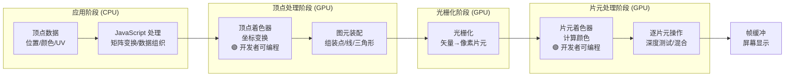
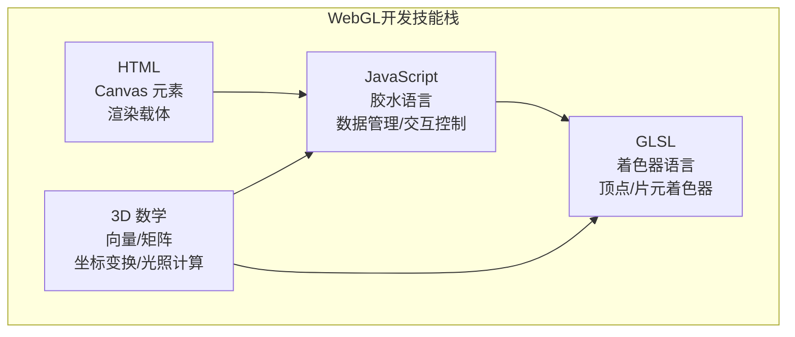
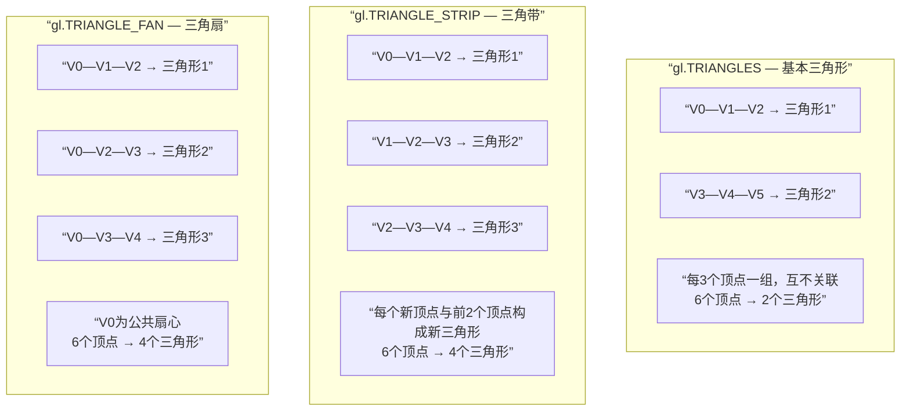
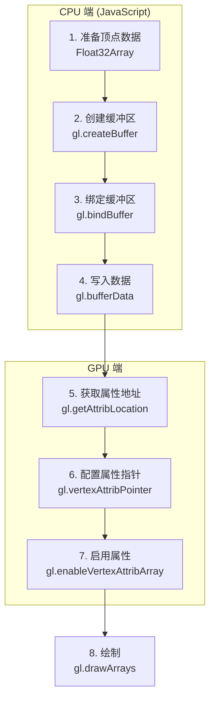

# WebGL基础实践-上

> 本篇涵盖第 1-9 章，系统讲解 WebGL 程序的基本结构、图元绘制、缓冲区机制、纹理映射与绘制封装。

## 目录
- 第 1 章：认识 WebGL
- 第 2 章：从一个点开始：掌握 WebGL 的编程要素
- 第 3 章：绘制三角形：学会使用缓冲区、了解 WebGL 中的基本图形元素
- 第 4 章：基本图元绘制：线段
- 第 5 章：绘制渐变三角形：深入理解缓冲区
- 第 6 章：画个矩形：用基本图形构建平面
- 第 7 章：纹理贴图：为形体穿上外衣
- 第 8 章：绘制立方体、球体、锥体：如何用基本图形构建规则形体
- 第 9 章：绘制多个物体：进一步封装绘制方法


---

## 第 1 章：认识 WebGL

欢迎来到 WebGL 的世界！如果你正在阅读本文，说明你对这门技术充满了好奇与热情。在接下来的学习旅程中，我将带领你一步步揭开 WebGL 的神秘面纱，掌握在网页中绘制三维图形的强大能力。

> **[温馨提示]**
> WebGL 涉及较多专业术语及 API，文中会尽可能用通俗的语言解释关键概念。如果遇到难以理解的地方，建议查阅 [MDN WebGL API 文档](https://developer.mozilla.org/zh-CN/docs/Web/API/WebGL_API) 作为补充。

---

#### **本章学习目标**

- **了解 WebGL 的诞生背景与核心价值。**
- **理解 WebGL 的基本工作原理，即“渲染管线”的概念。**
- **明确 WebGL 开发者需要具备的技能栈。**
- **对 GLSL (着色器语言) 建立初步认识。**

---

### 1.1 WebGL 是什么？

在 WebGL 出现之前，要在浏览器中实现 3D 动画效果，通常需要依赖 Flash 或 Silverlight 等第三方插件。为了打破这一限制，各大厂商联合制定了 WebGL 规范，旨在为 Web 提供一个跨平台的、免插件的 3D 图形标准。

简单来说，**WebGL 是一套基于 JavaScript 的图形 API**。它允许 Web 开发者直接与计算机的图形处理单元（GPU）进行通信，从而在 `<canvas>` 元素中绘制出高性能的二维和三维图形。

借助 WebGL，我们可以开发出许多酷炫的应用，例如：

- **3D 数据可视化图表**
- **沉浸式网页游戏**
- **交互式 3D 地图**
- **WebVR/AR 应用**

### 1.2 WebGL 工作原理：渲染管线

你可能会好奇，复杂的 3D 模型是如何最终显示在我们的 2D 屏幕上的？这个过程可以类比为一条**流水线**，我们将原始的 3D 模型数据作为“原材料”投入，经过一系列固定的加工步骤，最终产出屏幕上显示的“成品”图像。在图形学中，这条流水线被称为**图形管线**或**渲染管线**。

> **[核心概念] 渲染管线 (Rendering Pipeline)**
> 渲染管线是 GPU 内部一系列处理数据、生成图像的阶段总称。它接收顶点数据，经过坐标变换、图元装配、光栅化、片元着色等步骤，最终将像素渲染到屏幕上。

WebGL 本身只能绘制三种基本图形，我们称之为**图元**（Primitives）：

- **点 (Points)**
- **线段 (Lines)**
- **三角形 (Triangles)**

所有复杂的 3D 模型，无论是立方体、球体，还是生动的人物模型，其本质都是由大量的三角形拼接而成的。因此，我们的核心任务就是定义这些三角形的顶点数据，并告诉 WebGL 如何去渲染它们。

GPU 渲染管线的主要处理流程如下：



> **[关键理解]** 上图中绿色部分（顶点着色器、片元着色器）是**开发者通过 GLSL 编程控制**的阶段，其余阶段由 GPU 硬件固定执行。WebGL 编程的核心工作就是编写这两个着色器程序。

1.  **顶点着色器 (Vertex Shader)**：接收我们提供的顶点数据，对每个顶点进行坐标变换（例如，将模型从 3D 世界移动到观察视角下），计算出其在屏幕上的最终位置。
2.  **图元装配 (Primitive Assembly)**：将变换后的顶点按照指定的图元类型（如三角形）组装起来。
3.  **光栅化 (Rasterization)**：将矢量化的图元（如三角形）转换为屏幕上离散的像素点（片元），这个过程决定了哪些像素位于图形内部。
4.  **片元着色器 (Fragment Shader)**：为光栅化阶段生成的每个片元（像素）计算最终颜色，并将其输出到屏幕。

下图简要演示了 WebGL 渲染一个红色三角形的过程，其中绿色的部分是需要我们开发者通过编程来控制的。


### 1.3 开发者需要掌握的技能

与传统的 Web 开发相比，WebGL 对开发者的技能要求更为综合：



- **HTML**: 熟练使用 `<canvas>` 元素作为 WebGL 的渲染载体。
- **JavaScript**: 核心胶水语言。负责获取 WebGL 上下文、管理和处理模型数据（如顶点坐标、颜色、纹理等），并将这些数据传递给 GPU。
- **GLSL (OpenGL Shading Language)**: 一种在 GPU 上运行的 C-Style 语言。我们需要用它编写**顶点着色器**和**片元着色器**程序，这是实现自定义渲染效果的关键。
- **3D 数学基础**: 掌握向量和矩阵的数学知识至关重要。顶点的坐标变换、光照计算、相机视角等都依赖于矩阵运算。

> **[重点提示]**
> WebGL 的入门门槛不在于学习新的编程语言，而在于理解其背后的图形学概念和 3D 数学原理。尤其是矩阵变换，是后续学习的重中之重。

### 1.4 什么是 GLSL？

GLSL (OpenGL Shading Language) 是专门用于编写着色器程序的高级语言。着色器是在 GPU 上运行的小程序，它允许我们精确控制渲染管线的特定阶段，从而实现高度可定制的视觉效果。

在 WebGL 中，我们主要关注两种着色器：

- **顶点着色器 (Vertex Shader)**：处理每个顶点，负责坐标变换。
- **片元着色器 (Fragment Shader)**：处理每个片元（像素），负责计算颜色。

虽然需要学习一门新语言，但 GLSL 的语法相对简单，常用的功能也比较集中。大家不必担心，通过后续的练习可以很快掌握。

---

#### **本章小结与检查点**

恭喜你完成了第一章的学习！现在，请对照以下列表，检查你是否已经掌握了本章的核心知识点：

- [ ] 我知道 WebGL 是什么，以及它为什么会出现。
- [ ] 我能大致描述出“渲染管线”的工作流程。
- [ ] 我了解 WebGL 只能绘制点、线段和三角形这三种基本图元。
- [ ] 我清楚 WebGL 开发需要 JavaScript、GLSL 和 3D 数学知识的结合。
- [ ] 我知道顶点着色器和片元着色器在渲染管线中的基本作用。

---

#### **课后思考**

1.  **思考题**：为什么 WebGL 选择三角形作为主要的渲染图元，而不是四边形或其他多边形？（提示：可以从图形的平面性、凸性以及硬件实现等角度思考。）
2.  **调研任务**：请通过网络搜索，找出 3-5 个使用 WebGL 技术构建的知名网站或应用，并分析它们主要利用 WebGL 实现了哪些功能。

---

在下一章中，我们将正式开始编写代码，从绘制一个简单的“点”开始，踏出 WebGL 编程的第一步。准备好了吗？让我们继续前进！

---

## 第 2 章：从一个点开始：掌握 WebGL 的编程要素

在上一章中，我们对 WebGL 有了宏观的认识。从本章开始，我们将正式进入编码实战。正所谓“千里之行，始于足下”，我们的 WebGL 之旅就从绘制一个最简单的图元 —— **点** —— 开始。

通过这个简单的例子，你将掌握一个完整的 WebGL 程序从无到有的开发全过程，这会为你后续的学习奠定坚实的基础。

- **[本章演示地址](https://link.juejin.cn?target=http%3A%2F%2Fifanqi.top%2Fwebgl%2Fpages%2Flesson1.1.html)**
- **[本章源码地址](https://link.juejin.cn?target=https%3A%2F%2Fgithub.com%2Flucefer%2Fwebgl%2Fblob%2Fmaster%2Fpages%2Flesson1.1.html)**

---

#### **本章学习目标**

- **掌握一个完整 WebGL 程序的基本结构和开发流程。**
- **学会编写简单的顶点着色器和片元着色器。**
- **理解如何在 JavaScript 和 GLSL 之间传递数据。**
- **掌握 `attribute` 和 `uniform` 变量的用法与区别。**
- **实现鼠标交互，动态绘制图形。**

---

### 2.1 绘制一个静态点

我们的第一个目标非常简单：在屏幕中心绘制一个大小为 10px、颜色为红色的点。

一个 WebGL 程序包含两大部分：**JavaScript 主程序** 和 **GLSL 着色器程序**。让我们先从着色器入手。

#### **第一步：编写着色器 (GLSL)**

##### **顶点着色器 (Vertex Shader)**

顶点着色器的核心任务是计算并设置顶点的最终位置。在这个例子中，我们希望点被绘制在裁剪坐标系的原点，即屏幕中心。

```glsl
// Vertex Shader
void main() {
  // 1. 设置顶点位置：vec4(x, y, z, w)
  gl_Position = vec4(0.0, 0.0, 0.0, 1.0);

  // 2. 设置点的大小（仅对点图元有效）
  gl_PointSize = 10.0;
}
```

##### **片元着色器 (Fragment Shader)**

片元着色器的任务是计算并设置每个像素的最终颜色。这里，我们将其设置为红色。

```glsl
// Fragment Shader
// 设置所有浮点数类型的默认精度
precision mediump float;

void main() {
  // 设置片元颜色为红色：vec4(r, g, b, a)
  gl_FragColor = vec4(1.0, 0.0, 0.0, 1.0);
}
```

> **[核心概念] GLSL 内置变量**
>
> - `gl_Position`: (vec4) 顶点着色器内置输出变量，用于指定顶点的**裁剪坐标**。GPU 会将这个坐标进行处理，最终映射到屏幕上。
> - `gl_PointSize`: (float) 顶点着色器内置输出变量，用于指定点图元的大小（单位：像素）。
> - `gl_FragColor`: (vec4) 片元着色器内置输出变量，用于指定当前片元的 RGBA 颜色。颜色分量的值域为 `[0.0, 1.0]`。

#### **第二步：准备 HTML 结构**

我们需要一个 `<canvas>` 元素作为 WebGL 的“画板”，并使用 `<script>` 标签来存放我们的着色器代码。

```html
<body onload="main()">
  <!-- Canvas 作为 WebGL 渲染的目标 -->
  <canvas id="canvas" width="500" height="500"></canvas>

  <!-- 顶点着色器 -->
  <script id="vertex-shader" type="x-shader/x-vertex">
    void main() {
      gl_Position = vec4(0.0, 0.0, 0.0, 1.0);
      gl_PointSize = 10.0;
    }
  </script>

  <!-- 片元着色器 -->
  <script id="fragment-shader" type="x-shader/x-fragment">
    precision mediump float;
    void main() {
      gl_FragColor = vec4(1.0, 0.0, 0.0, 1.0);
    }
  </script>

  <!-- 引入封装的工具函数和主程序 -->
  <script src="webgl-helper.js"></script>
  <script src="main.js"></script>
</body>
```

#### **第三步：编写主程序 (JavaScript)**

JavaScript 代码负责“胶水”工作：初始化 WebGL、编译着色器、创建着色器程序，并最终发出绘制指令。

为了保持代码整洁，我们通常会将 WebGL 的初始化和着色器编译等重复性工作封装成辅助函数（如下文 `webgl-helper.js` 所示）。

```javascript
// main.js
function main() {
  // 1. 获取 Canvas 和 WebGL 上下文
  const canvas = document.getElementById("canvas")
  const gl = canvas.getContext("webgl")
  if (!gl) {
    console.error("WebGL not supported!")
    return
  }

  // 2. 初始化着色器程序
  const program = initShaders(gl, "vertex-shader", "fragment-shader")
  gl.useProgram(program)

  // 3. 设置清空画布的颜色
  gl.clearColor(0.0, 0.0, 0.0, 1.0) // 黑色

  // 4. 清空画布
  gl.clear(gl.COLOR_BUFFER_BIT)

  // 5. 发出绘制指令
  // gl.drawArrays(mode, first, count);
  gl.drawArrays(gl.POINTS, 0, 1)
}
```

> **[核心 API] `gl.drawArrays()`**
> 这是 WebGL 中最核心的绘制函数之一。
>
> - `mode`: 指定绘制的图元类型，例如 `gl.POINTS`、`gl.LINES`、`gl.TRIANGLES`。
> - `first`: 指定从哪个顶点开始绘制。
> - `count`: 指定需要渲染的顶点数量。

运行代码，你将在黑色画布的中央看到一个红色的点！


### 2.2 绘制动态的点

静态点过于单调，现在我们来增加交互：**每次点击鼠标时，在点击位置绘制一个随机颜色的点**。

要实现这个功能，我们需要解决一个核心问题：**如何将 JavaScript 中的动态数据（鼠标坐标、随机颜色）传递给着色器？**

答案是使用 `attribute` 和 `uniform` 变量。

#### **第一步：升级着色器**

我们需要修改着色器，使其能够接收来自 JavaScript 的数据。

##### **顶点着色器**

```glsl
// 接收顶点坐标 (attribute 变量)
attribute vec2 a_Position;
// 接收 Canvas 尺寸 (uniform 变量)
uniform vec2 u_ScreenSize;

void main() {
  // 将 Canvas 坐标系转换为裁剪坐标系
  vec2 position = (a_Position / u_ScreenSize) * 2.0 - 1.0;
  position = position * vec2(1.0, -1.0); // Y 轴翻转

  gl_Position = vec4(position, 0.0, 1.0);
  gl_PointSize = 10.0;
}
```

##### **片元着色器**

```glsl
precision mediump float;

// 接收颜色 (uniform 变量)
uniform vec4 u_Color;

void main() {
  gl_FragColor = u_Color;
}
```

> **[核心概念] `attribute` vs `uniform`**
> 这两者都是 GLSL 中用于接收外部数据的变量，但用途不同：
>
> - **`attribute`**: **顶点专属**。用于传递那些**每个顶点都不同的数据**，例如顶点的位置、法向量、纹理坐标等。它只能在顶点着色器中声明。
> - **`uniform`**: **全局共享**。用于传递那些**对于一批顶点都相同的数据**，例如变换矩阵、光照参数、颜色等。它可以在顶点着色器和片元着色器中声明。
> - **`varying`**: **桥梁变量**。用于将数据从**顶点着色器**传递到**片元着色器**。数据在传递过程中会被**插值**处理。

#### **第二步：升级 JavaScript 程序**

我们需要在 JS 中获取这些 `attribute` 和 `uniform` 变量的“地址”，然后为它们赋值。

```javascript
// main.js
function main() {
  // ... 初始化过程同上 ...
  const program = initShaders(gl, "vertex-shader", "fragment-shader")
  gl.useProgram(program)

  // 1. 获取 attribute 和 uniform 变量的存储地址
  const a_Position = gl.getAttribLocation(program, "a_Position")
  const u_ScreenSize = gl.getUniformLocation(program, "u_ScreenSize")
  const u_Color = gl.getUniformLocation(program, "u_Color")

  if (a_Position < 0 || !u_ScreenSize || !u_Color) {
    console.error("Failed to get the storage location of variables")
    return
  }

  // 2. 为 uniform 变量赋值
  gl.uniform2f(u_ScreenSize, canvas.width, canvas.height)

  // 3. 注册鼠标点击事件
  const points = [] // 存储点击的点
  canvas.addEventListener("click", (event) => {
    const x = event.clientX
    const y = event.clientY
    const color = [Math.random(), Math.random(), Math.random(), 1.0]

    points.push({ x, y, color })

    // 重新绘制所有点
    render(gl, points, a_Position, u_Color)
  })

  // 初始清空画布
  render(gl, points, a_Position, u_Color)
}

// 渲染函数
function render(gl, points, a_Position, u_Color) {
  gl.clearColor(0.0, 0.0, 0.0, 1.0)
  gl.clear(gl.COLOR_BUFFER_BIT)

  points.forEach((point) => {
    // 4. 为 attribute 和 uniform 变量赋值
    gl.vertexAttrib2f(a_Position, point.x, point.y)
    gl.uniform4fv(u_Color, point.color)

    // 5. 绘制点
    gl.drawArrays(gl.POINTS, 0, 1)
  })
}
```

> **[性能提示]**
> 在这个例子中，我们每绘制一个点，就调用一次 `gl.vertexAttrib2f` 和 `gl.drawArrays`。当点的数量非常多时，这种做法的效率会很低。在下一章，我们将学习如何使用**缓冲区（Buffer）**一次性向 GPU 传递大量顶点数据，从而大幅提升渲染性能。

---

#### **常见问题解答 (Q&A)**

**Q1: 为什么 GLSL 里的颜色值是 `[0.0, 1.0]`，而不是 CSS 中常见的 `[0, 255]`？**

A: 这是图形学领域的通用惯例。将颜色分量归一化到 `[0.0, 1.0]` 区间，便于进行光照、混合等数学计算。从 `[0, 255]` 转换到 `[0.0, 1.0]` 很简单，只需将每个分量除以 255 即可。

**Q2: 顶点着色器中的坐标转换 `(a_Position / u_ScreenSize) * 2.0 - 1.0` 是如何工作的？**

A: 这是将**屏幕像素坐标**转换为 WebGL **裁剪坐标**的标准流程：

1.  `(a_Position / u_ScreenSize)`: 将 `[0, width]` 和 `[0, height]` 的像素坐标归一化到 `[0.0, 1.0]` 区间。
2.  `* 2.0`: 将 `[0.0, 1.0]` 区间放大到 `[0.0, 2.0]`。
3.  `- 1.0`: 将 `[0.0, 2.0]` 区间平移到 `[-1.0, 1.0]`，这正是裁剪坐标系 X 和 Y 轴的范围。
4.  `position * vec2(1.0, -1.0)`: 因为屏幕坐标系 Y 轴向下为正，而裁剪坐标系 Y 轴向上为正，所以需要翻转 Y 轴。

---

#### **本章小结与检查点**

- [ ] 我能说出 WebGL 程序由 JavaScript 和 GLSL 两部分组成。
- [ ] 我知道 `gl.drawArrays` 是核心的绘制命令。
- [ ] 我理解 `attribute` 和 `uniform` 的区别，并知道它们各自的应用场景。
- [ ] 我能通过 `gl.getAttribLocation` 和 `gl.getUniformLocation` 获取变量地址。
- [ ] 我能使用 `gl.vertexAttrib*` 和 `gl.uniform*` 系列函数为着色器变量赋值。
- [ ] 我了解如何将屏幕坐标转换为 WebGL 的裁剪坐标。

---

#### **课后练习**

1.  **修改点的大小**：尝试修改 `gl_PointSize` 的值，观察点的变化。你甚至可以尝试将它也变成一个 `uniform` 变量，通过 JS 来动态控制点的大小。
2.  **改变清屏颜色**：修改 `gl.clearColor` 的参数，看看画布背景色会发生什么变化。
3.  **形状挑战**：仅使用本章所学的 `gl.POINTS` 和 `drawArrays`，尝试在画布上绘制出一个空心的正方形或圆形。这需要你发挥一点创造力！

在下一章，我们将学习绘制更复杂的图形 —— 三角形，并引出 WebGL 中一个至关重要的概念：**缓冲区（Buffer）**。

---

## 第 3 章：绘制三角形：学会使用缓冲区、了解 WebGL 中的基本图形元素

上一章，我们学会了如何绘制“点”，并实现了动态交互。但你可能已经注意到，当需要绘制大量点时，我们采用的 `for` 循环 + 多次 `drawArrays` 的方式效率极低。因为每次循环都在 JavaScript 和 GPU 之间进行一次通信，这会产生巨大的性能开销。

本章，我们将学习绘制 WebGL 中最基本的面——**三角形**，并引出一个至关重要的性能优化工具：**缓冲区（Buffer）**。通过缓冲区，我们可以一次性地将大量顶点数据从 CPU（内存）发送到 GPU（显存），从而极大地提升渲染效率。

- **[本章演示地址](https://link.juejin.cn?target=http%3A%2F%2Fifanqi.top%2Fwebgl%2Fpages%2Flesson2.html)**
- **[本章源码地址](https://link.juejin.cn?target=https%3A%2F%2Fgithub.com%2Flucefer%2Fwebgl%2Fblob%2Fmaster%2Fpages%2Flesson2.html)**

---

#### **本章学习目标**

- **了解 WebGL 中的三种三角形图元及其区别。**
- **掌握使用缓冲区（Buffer）向 GPU 高效传输批量顶点数据的方法。**
- **深入理解 `gl.vertexAttribPointer` 的工作原理及其参数含义。**
- **了解类型化数组（Typed Arrays）在 WebGL 中的作用。**
- **实现动态绘制多个三角形。**

---

### 3.1 三角形图元分类

WebGL 提供了三种绘制三角形的模式，它们在使用相同数量顶点时，会产生不同的连接方式和结果。



| 图元类型 | 连接规则 | 三角形数量 | 典型用途 |
|----------|----------|-----------|----------|
| `gl.TRIANGLES` | 每 3 个顶点独立成三角形 | `顶点数 / 3` | 独立三角形、网格模型 |
| `gl.TRIANGLE_STRIP` | 每个新顶点与前 2 个顶点构成三角形 | `顶点数 - 2` | 地形、连续曲面 |
| `gl.TRIANGLE_FAN` | 第一个顶点为扇心，后续顶点与之构成三角形 | `顶点数 - 2` | 圆形、锥体、多边形 |

- **`gl.TRIANGLES` (基本三角形)**
  这是最简单、最常用的一种。每三个顶点构成一个独立的三角形，顶点之间互不相干。若提供 6 个顶点，将绘制 2 个独立的三角形。
  `绘制数量 = 顶点数 / 3`
  

- **`gl.TRIANGLE_STRIP` (三角带)**
  从第三个顶点开始，每个新顶点都会与前两个顶点构成一个新的三角形，形成一条”带子”。若提供 6 个顶点，将绘制 4 个三角形。
  `绘制数量 = 顶点数 - 2`
  

- **`gl.TRIANGLE_FAN` (三角扇)**
  第一个顶点是公共的”扇心”，后续每两个顶点与第一个顶点共同构成一个三角形，形成一个”扇面”。若提供 6 个顶点，也将绘制 4 个三角形。
  `绘制数量 = 顶点数 - 2`
  

本章我们主要学习最基础的 `gl.TRIANGLES`。

### 3.2 绘制第一个三角形：缓冲区实战

现在，我们来绘制一个固定的红色三角形。这个过程将完整地展示**缓冲区的使用流程**。

#### **第一步：编写着色器**

着色器非常简单。顶点着色器接收一个 `vec2` 类型的顶点位置，片元着色器输出一个固定的红色。

```glsl
// 顶点着色器
attribute vec2 a_Position;

void main() {
  // 直接使用裁剪坐标，范围 [-1.0, 1.0]
  gl_Position = vec4(a_Position, 0.0, 1.0);
}

// 片元着色器
precision mediump float;
uniform vec4 u_Color;

void main() {
  gl_FragColor = u_Color;
}
```

#### **第二步：缓冲区工作流 (JavaScript)**

这是本章的核心。我们将遵循一个固定的工作流程，将多个顶点数据一次性发送给 GPU。



```javascript
// main.js
function main() {
  // ... 初始化 WebGL 和着色器程序 ...
  const program = initShaders(gl, ...);
  gl.useProgram(program);

  // 准备顶点数据 (3个顶点，每个顶点2个分量x, y)
  const vertices = new Float32Array([
     0.0,  0.5,  // 顶点1
    -0.5, -0.5,  // 顶点2
     0.5, -0.5   // 顶点3
  ]);
  const n = 3; // 顶点数量

  // ===== 缓冲区工作流开始 =====

  // 1. 创建缓冲区对象
  const vertexBuffer = gl.createBuffer();

  // 2. 绑定缓冲区到 WebGL 目标
  gl.bindBuffer(gl.ARRAY_BUFFER, vertexBuffer);

  // 3. 向缓冲区写入数据
  gl.bufferData(gl.ARRAY_BUFFER, vertices, gl.STATIC_DRAW);

  // 4. 获取 attribute 变量地址
  const a_Position = gl.getAttribLocation(program, 'a_Position');

  // 5. 将缓冲区分配给 attribute 变量
  gl.vertexAttribPointer(a_Position, 2, gl.FLOAT, false, 0, 0);

  // 6. 启用 attribute 变量
  gl.enableVertexAttribArray(a_Position);

  // ===== 缓冲区工作流结束 =====

  // ... 设置颜色、清空画布、执行绘制 ...
  gl.uniform4f(u_Color, 1.0, 0.0, 0.0, 1.0);
  gl.clear(gl.COLOR_BUFFER_BIT);
  gl.drawArrays(gl.TRIANGLES, 0, n);
}
```

> **[核心概念] 类型化数组 (Typed Arrays)**
> JavaScript 的普通数组 `[]` 是弱类型的，而 GPU 需要严格的、连续的二进制数据。`Float32Array` 就是一种**类型化数组**，它创建了一个由 32 位浮点数组成的连续内存空间，可以直接被 WebGL 使用，无需进行额外的类型转换。

> **[核心 API] `gl.vertexAttribPointer()`**
> 这是连接缓冲区和顶点着色器属性的桥梁，也是最容易混淆的函数。它告诉 WebGL 如何从当前绑定的缓冲区中“解析”数据。
> `gl.vertexAttribPointer(location, size, type, normalized, stride, offset);`
>
> - `location`: 要绑定的 `attribute` 变量的地址。
> - `size`: 每个顶点需要几个分量。我们的 `a_Position` 是 `vec2`，所以是 `2`。
> - `type`: 数据类型。我们用的是 `Float32Array`，所以是 `gl.FLOAT`。
> - `normalized`: 是否将非浮点数据归一化。我们已经是浮点数了，所以是 `false`。
> - `stride`: **步长**。指从一个顶点到下一个顶点需要跳过多少个**字节**。如果数据是紧密排列的（如本例），可以设置为 `0`，让 WebGL 自动计算。假设我们一个顶点包含位置（vec2）和颜色（vec4），都是 float，那么步长就是 `(2+4) * 4 = 24` 字节。
> - `offset`: **偏移量**。指在每个顶点的数据块中，从开头要跳过多少个**字节**才是当前属性的数据。在本例中，位置数据就在最前面，所以偏移是 `0`。

下图清晰地展示了 `stride` 和 `offset` 的含义：


### 3.3 动态绘制多个三角形

掌握了缓冲区的基础用法后，实现动态绘制就变得简单了。我们只需要在鼠标点击时，不断向顶点数组中添加新的坐标，并更新到缓冲区即可。

#### **第一步：修改着色器**

为了能处理屏幕像素坐标，我们需要把上一章的坐标转换逻辑加回来。

```glsl
// 顶点着色器
attribute vec2 a_Position;
uniform vec2 u_ScreenSize;

void main() {
  vec2 position = (a_Position / u_ScreenSize) * 2.0 - 1.0;
  position *= vec2(1.0, -1.0);
  gl_Position = vec4(position, 0.0, 1.0);
}
```

#### **第二步：修改 JavaScript**

关键在于**动态更新缓冲区数据**。

```javascript
// ... 初始化 ...
const positions = [] // 用普通 JS 数组存储坐标

canvas.addEventListener("click", (e) => {
  const x = e.clientX
  const y = e.clientY
  positions.push(x, y)

  // 只有当顶点数是 3 的倍数时才需要重绘
  if (positions.length % 6 === 0) {
    // 1. 将 JS 数组转换为类型化数组
    const vertices = new Float32Array(positions)

    // 2. 更新缓冲区数据
    // 注意最后一个参数 gl.DYNAMIC_DRAW，它是一个给 WebGL 的性能提示
    gl.bufferData(gl.ARRAY_BUFFER, vertices, gl.DYNAMIC_DRAW)

    // 3. 重新渲染
    render(gl, positions.length / 2)
  }
})

function render(gl, n) {
  gl.clear(gl.COLOR_BUFFER_BIT)
  gl.drawArrays(gl.TRIANGLES, 0, n)
}
```

> **[性能提示] `gl.bufferData` 的用法**
> 第三个参数是对 WebGL 的一个性能提示，告诉它你打算如何使用这些数据：
>
> - `gl.STATIC_DRAW`: 数据几乎不会改变（例如一个静态模型的顶点）。
> - `gl.DYNAMIC_DRAW`: 数据会频繁改变（例如本例中动态添加的顶点）。
> - `gl.STREAM_DRAW`: 数据每次绘制时都会改变。
>   WebGL 会根据这些提示在 GPU 内部进行优化。

---

#### **本章小结与检查点**

- [ ] 我知道为什么要使用缓冲区来代替循环绘制。
- [ ] 我能按顺序说出使用缓冲区的 5 个核心步骤。
- [ ] 我理解 `gl.vertexAttribPointer` 中 `size`, `stride`, `offset` 参数的含义。
- [ ] 我知道 `Float32Array` 这类类型化数组的作用。
- [ ] 我知道如何通过 `gl.bufferData` 更新缓冲区中的数据。

---

#### **课后练习**

1.  **探索不同图元**：尝试将 `gl.drawArrays` 的第一个参数修改为 `gl.TRIANGLE_STRIP` 和 `gl.TRIANGLE_FAN`，并提供至少 4 个顶点，观察绘制结果有何不同。
2.  **遗留问题**：在本章的例子中，所有三角形的颜色都是一样的。请思考：
    - 如何让每个三角形的颜色都不同？
    - 更进一步，如何让同一个三角形的三个顶点颜色不同，从而实现“渐变色”效果？（提示：颜色也是一种可以传递给着色器的数据。）

带着这些问题，让我们进入下一章的学习，探索更丰富的图形绘制技巧！

---
