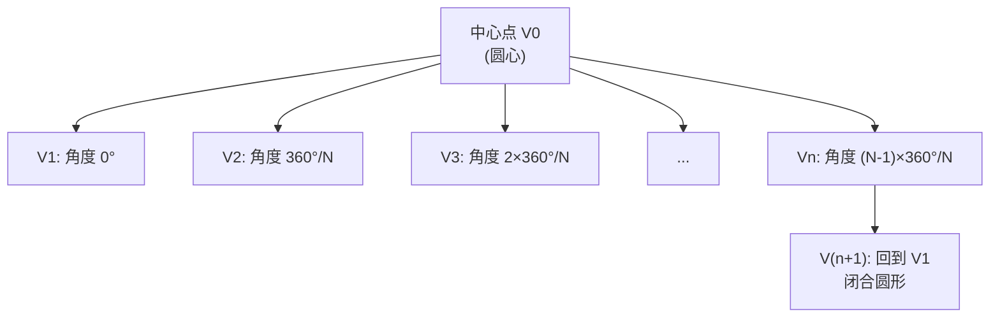
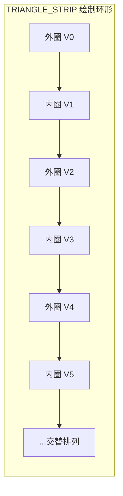

# WebGL基础实践-中

> 本篇涵盖第 4-6 章，讲解基本图元绘制、缓冲区深入应用、以及使用索引绘制矩形。

## 第 4 章：基本图元绘制：线段

经过前几章的学习，我们已经掌握了 WebGL 中最核心的两种图元：点和三角形。本章，我们将学习最后一种基本图元——**线段 (Line)**。

线段的绘制非常简单，但它同样是构建复杂场景的重要元素，例如用于绘制坐标轴、物体轮廓、路径轨迹等。本章将通过一个动态绘制的例子，带你了解三种不同的线段图元，并启发你如何利用简单的技术实现富有创意的效果。

- **[本章演示地址](https://link.juejin.cn?target=http%3A%2F%2Fifanqi.top%2Fwebgl%2Fpages%2Flesson5.html)**
- **[本章源码地址](https://link.juejin.cn?target=https%3A%2F%2Fgithub.com%2Flucefer%2Fwebgl%2Fblob%2Fmaster%2Fpages%2Flesson5.html)**

---

#### **本章学习目标**

- **掌握 WebGL 中三种线段图元的绘制方法：`LINES`、`LINE_STRIP` 和 `LINE_LOOP`。**
- **理解这三种图元在顶点使用和连接方式上的核心区别。**
- **学会根据不同需求选择合适的线段图元。**
- **激发创意，思考如何利用基础图元创造出有趣的视觉效果。**

---

### 4.1 线段图元分类

与三角形类似，WebGL 也提供了三种绘制线段的模式，它们决定了顶点如何被连接成线。

- **`gl.LINES` (独立线段)**

  - **特点**：每两个顶点构成一条独立的线段。顶点之间不共享。
  - **顶点消耗**：若要绘制 N 条线段，需要 2\*N 个顶点。
  - **应用场景**：绘制一组互不相干的线段，如坐标轴的刻度线。

- **`gl.LINE_STRIP` (连续线段)**

  - **特点**：从第二个顶点开始，每个新顶点都会与前一个顶点连接成一条线段，形成一条连续的折线。
  - **顶点消耗**：若要绘制 N 条首尾相连的线段，需要 N+1 个顶点。
  - **应用场景**：绘制路径、函数图像、山脉轮廓等。

- **`gl.LINE_LOOP` (闭合线段)**
  - **特点**：在 `LINE_STRIP` 的基础上，会自动将最后一个顶点与第一个顶点相连，形成一个闭合的环路。
  - **顶点消耗**：若要绘制一个 N 边的闭合图形，需要 N 个顶点。
  - **应用场景**：绘制多边形的边框。

### 4.2 动手实践：动态绘制线段

接下来，我们通过同一个交互示例来直观地感受这三种模式的区别。示例的逻辑很简单：**每次在 canvas 上点击，就将该点的坐标添加到一个顶点数组中，然后根据不同的线段模式进行绘制。**

着色器和 JavaScript 的基础设置与上一章绘制三角形时完全相同，我们只需要修改 `gl.drawArrays` 的第一个参数即可。

#### **1. `gl.LINES` (独立线段)**

将绘制模式设置为 `gl.LINES`。

```javascript
gl.drawArrays(gl.LINES, 0, positions.length / 2)
```

**效果分析**：
你会发现，必须点击两次（提供两个顶点）才能绘制出第一条线段。之后每点击两次，才会出现一条新的、独立的线段。这清晰地展示了 `gl.LINES` “两点一组”的工作方式。


#### **2. `gl.LINE_STRIP` (连续线段)**

将绘制模式修改为 `gl.LINE_STRIP`。

```javascript
// 注意，count 参数是顶点的总数，而非数组长度
gl.drawArrays(gl.LINE_STRIP, 0, positions.length / 2)
```

**效果分析**：
点击前两个点，绘制出第一条线段。之后，每点击一个新的点，这个新点就会自动与前一个点相连，形成一条连续的折线。这非常适合用于绘制轨迹或路径。


#### **3. `gl.LINE_LOOP` (闭合线段)**

最后，将绘制模式修改为 `gl.LINE_LOOP`。

```javascript
gl.drawArrays(gl.LINE_LOOP, 0, positions.length / 2)
```

**效果分析**：
`LINE_LOOP` 的行为与 `LINE_STRIP` 非常相似，但增加了一个关键特性：它始终会把当前的最后一个点与第一个点连接起来，形成一个闭合的形状。


### 4.3 创意是关键

> “事实上，WebGL 的知识是有限的，但是我们的创意是无限的。有的时候并不需要技术多牛逼，只要创意够好，简单的技术也能实现让人惊艳的效果。”

原文作者的这段话非常有启发性。在掌握了基础技术后，真正的挑战和乐趣在于如何运用它们。作者提到了他女儿无意中用 `LINE_LOOP` 点击绘制出一个可爱的五角星，这正是一个绝佳的例子。


简单的线段，如果结合上一章提到的“渐变色”技巧，再配上时间驱动的动画（例如，让顶点坐标随时间变化），就可以创造出流光线条、粒子轨迹等非常酷炫的视觉特效。

---

#### **本章小结与检查点**

- [ ] 我能清晰地分辨 `gl.LINES`, `gl.LINE_STRIP`, 和 `gl.LINE_LOOP` 的区别。
- [ ] 我知道在绘制 N 条独立线段时，需要 `2*N` 个顶点。
- [ ] 我知道在使用 `gl.LINE_STRIP` 绘制含 N 个顶点的折线时，会产生 `N-1` 条线段。
- [ ] 我知道 `gl.LINE_LOOP` 会自动闭合路径。
- [ ] 我开始思考如何将基础图元组合、美化，以创造更复杂的图形。

---

#### **课后练习**

1.  **绘制网格**：使用 `gl.LINES` 模式，编写一个函数，传入行数和列数，自动生成并绘制一个网格。
2.  **绘制正多边形**：使用 `gl.LINE_LOOP` 模式，结合一点三角函数知识（`sin` 和 `cos`），编写一个函数，传入边数 `N` 和半径 `R`，绘制一个正 N 边形。
3.  **创意挑战**：在前一章“渐变色三角形”的思考题基础上，实现一个“渐变色线条”的效果。即让一条线段的两个端点颜色不同。

---

到此为止，WebGL 的三种基本图元——点、线、三角形——我们已经全部学习完毕。你已经掌握了 WebGL 编程的最小完整闭环。

在接下来的章节中，我们将深入探讨如何为我们的图形添加更丰富的细节，例如**颜色插值**和**纹理映射**，让你的 WebGL 世界变得更加五彩斑斓！

---

## 第 5 章：绘制渐变三角形：深入理解缓冲区

上节带领大家学习了基本三角形图元的绘制过程，以及如何使用`缓冲区`向着色器传递多个数据，但上节只演示了往着色器传递`坐标`这一种数据，本节通过绘制渐变三角形，讲解一下如何通过缓冲区向着色器传递多种数据。

### 5.1 学习目标

本节通过一个鼠标每点击三次便会绘制一个渐变三角形的示例，带大家深入理解缓冲区的用法，最终效果如下图所示：


- [演示地址](https://link.juejin.cn?target=http%3A%2F%2Fifanqi.top%2Fwebgl%2Fpages%2Flesson4.html%20"http://ifanqi.top/webgl/pages/lesson4.html")
- [源码地址](https://link.juejin.cn?target=https%3A%2F%2Fgithub.com%2Flucefer%2Fwebgl%2Fblob%2Fmaster%2Fpages%2Flesson4.html%20"https://github.com/lucefer/webgl/blob/master/pages/lesson4.html")

通过本节学习，你将会掌握如下内容：

- 顶点数据在 `buffer` 中的排布方式。
- 切换 `buffer` 时，`bindBuffer` 的重要性。
- 使用多个 `buffer` 读取多种顶点数据。
- 使用单个 `buffer` 读取多种顶点数据。
- 如何实现渐变效果。

#### 缓冲区数据组织方式对比

| 对比维度 | 多缓冲区方式 | 单缓冲区（交错排列） |
|----------|-------------|-------------------|
| 内存布局 | 每种属性独立缓冲区<br/>[pos][pos][pos] [color][color][color] | 所有属性交错排列<br/>[pos,color][pos,color][pos,color] |
| 缓冲区数量 | 属性数量 N | 1 |
| stride 参数 | 0（紧密排列） | 需手动计算 `(分量总数 × 4)` 字节 |
| offset 参数 | 0（每种属性从 0 开始） | 需手动计算偏移字节数 |
| 切换属性 | 需 `bindBuffer` 切换 | 无需切换，一次绑定 |
| 缓存友好性 | ⚠️ 属性分离，缓存命中率低 | ✅ 属性连续，缓存命中率高 |
| 代码复杂度 | 简单 | 稍复杂（需计算 stride/offset） |
| 推荐场景 | 学习阶段、属性数据独立更新 | **生产环境**（性能更优） |

> **[最佳实践]** 在实际项目中，推荐使用**单缓冲区交错排列**方式。虽然需要手动计算 stride 和 offset，但数据局部性更好，GPU 缓存命中率更高，渲染性能更优。

### 5.2 实现渐变三角形

与单色三角形不同，渐变三角形的颜色在顶点之间平滑过渡。这需要我们为每个顶点同时指定坐标和颜色两种信息。在顶点着色器处理后，GPU 会根据每个顶点的颜色自动进行插值，从而在顶点之间形成平滑的颜色渐变。

上节我们实现的是单色三角形，通过在片元着色器中定义一个 `uniform` 变量，接收 JavaScript 传递过去的颜色值来实现。那渐变三角形的处理与单色三角形有何不同呢？

渐变三角形颜色不单一，在顶点与顶点之间进行颜色的渐变过渡，这就要求我们的顶点信息除了包含`坐标`，还要包含`颜色`。这样在顶点着色器之后，GPU 根据每个顶点的颜色对顶点与顶点之间的颜色进行插值，自动填补顶点之间像素的颜色，于是形成了渐变三角形。

那既然我们需要为每个顶点传递坐标信息和颜色信息，因此需要在顶点着色器中额外增加一个 `attribute` 变量`a_Color`，用来接收顶点的颜色，同时还需要在顶点着色器和片元着色器中定义一个 varying 类型的变量`v_Color`，用来传递顶点颜色信息。

#### 5.2.1 着色器准备

为了在顶点着色器中处理颜色数据，我们需要新增一个 `attribute` 变量 `a_Color` 来接收顶点颜色，并通过 `varying` 变量 `v_Color` 将其传递给片元着色器。

- **顶点着色器**：新增 `a_Color` 接收顶点颜色，并通过 `v_Color` 传递给片元着色器。

```glsl
// 设置浮点数精度
precision mediump float;

// 接收顶点坐标
attribute vec2 a_Position;
// 接收屏幕尺寸
attribute vec2 a_Screen_Size;
// 接收顶点颜色
attribute vec4 a_Color;
// 将颜色传递给片元着色器
varying vec4 v_Color;

void main() {
  // 将屏幕坐标转换为裁剪空间坐标
  vec2 position = (a_Position / a_Screen_Size) * 2.0 - 1.0;
  position = position * vec2(1.0, -1.0);
  gl_Position = vec4(position, 0, 1);

  // 将顶点颜色赋值给 varying 变量
  v_Color = a_Color;
}
```

- **片元着色器**：接收 `v_Color` 并将其标准化后赋给 `gl_FragColor`。

```glsl
// 设置浮点数精度
precision mediump float;

// 接收插值后的颜色
varying vec4 v_Color;

void main() {
  // 将颜色值从 0-255 范围转换为 0.0-1.0 范围
  vec4 color = v_Color / vec4(255, 255, 255, 1);
  gl_FragColor = color;
}
```

我们的着色器部分还是和之前一样简单，只是在顶点着色器中增加了顶点颜色这一变量。

接下来我们用 JavaScript 向着色器传递数据。

#### 5.2.2 JavaScript 数据传输

在 JavaScript 中，我们需要将顶点坐标和颜色数据传递给着色器。这可以通过两种方式实现：

- **多个缓冲区**：为每种数据（如坐标、颜色）分别创建独立的缓冲区。
- **单个缓冲区**：将所有数据交错存储在同一个缓冲区中。

用缓冲区向着色器传递数据有两种方式：

- 利用一个缓冲区传递多种数据。
- 另一种是利用多个缓冲区传递多个数据。

上节绘制三角形的时候我们给顶点着色器传递的只是坐标信息，并且只用了一个 `buffer`，本节示例，我们除了传递顶点的坐标数据，还要传递顶点颜色。
按照正常思路，我们可以创建两个 `buffer`，其中一个 `buffer` 传递坐标，另外一个 `buffer` 传递颜色。


创建两个 `buffer`，将 `a_Position` 和 `positionBuffer` 绑定，`a_Color` 和 `colorBuffer` 绑定，然后设置各自读取 `buffer` 的方式。

> 请谨记：程序中如果有多个 `buffer` 的时候，在切换 `buffer` 进行操作时，一定要通过调用 `gl.bindBuffer` 将要操作的 `buffer` 绑定到 `gl.ARRAY_BUFFER` 上，这样才能正确地操作 `buffer` 。您可以将 `bindBuffer` 理解为一个状态机，`bindBuffer` 之后的对 `buffer` 的一些操作，都是基于最近一次绑定的 `buffer` 来进行的。

以下 `buffer` 的操作需要在绑定 `buffer` 之后进行：

> - gl.bufferData：传递数据。
> - gl.vertexAttribPointer：设置属性读取 buffer 的方式。

##### 5.2.2.1 方式一：使用多个缓冲区

- [示例代码](https://link.juejin.cn?target=https%3A%2F%2Fgithub.com%2Flucefer%2Fwebgl%2Fblob%2Fmaster%2Fpages%2Flesson3.html%20"https://github.com/lucefer/webgl/blob/master/pages/lesson3.html")
- [演示地址](https://link.juejin.cn?target=http%3A%2F%2Fifanqi.top%2Fwebgl%2Fpages%2Flesson3.html%20"http://ifanqi.top/webgl/pages/lesson3.html")

我们为顶点坐标和颜色分别创建两个缓冲区：`positionBuffer` 和 `colorBuffer`。

```javascript
// 创建坐标缓冲区
var positionBuffer = gl.createBuffer()
gl.bindBuffer(gl.ARRAY_BUFFER, positionBuffer)
// 设置 a_Position 属性的读取方式
gl.vertexAttribPointer(a_Position, 2, gl.FLOAT, false, 0, 0)

// 创建颜色缓冲区
var colorBuffer = gl.createBuffer()
gl.bindBuffer(gl.ARRAY_BUFFER, colorBuffer)
// 设置 a_Color 属性的读取方式
gl.vertexAttribPointer(a_Color, 4, gl.FLOAT, false, 0, 0)
```

> **注意**：`gl.vertexAttribPointer` 的参数 `size` 分别为 2 和 4，因为坐标包含 `x, y` 两个分量，而颜色包含 `r, g, b, a` 四个分量。

> gl.vertexAttribPointer(
> a_Color, size, type, normalized, stride, offset)。这个方法比较重要，上节已经向大家详细介绍了，如果还不太明白的，可以再次回顾下上节内容。

我们发现，上面代码对 `buffer` 的操作有些冗余，我们还是提取出一个方法 `createBuffer` 放到 `webgl-helper.js`，减少重复编码，之后我们对 `buffer` 的一系列调用只需要如下两句就可以了：

```
var positionBuffer = createBuffer(gl, a_Position, { size: 2});
var colorBuffer = createBuffer(gl, a_Color, { size: 4});
```

假如我们顶点坐标数组中有四个顶点 8 个元素【30, 30, 30, 40, 40, 30, 20, 0】，顶点着色器中的 `a_Position` 属性在读取顶点坐标信息时，以 2 个元素为一组进行读取：


又假如我们顶点颜色数组中有两个顶点 8 个元素 【244, 230, 100, 1, 125, 30, 206, 1】，那么顶点着色器中的 `a_Color` 属性在读取顶点颜色信息时，以 4 个元素（r, g, b, a）为一组进行读取，如下图所示。


> 以多少元素作为一个顶点信息进行读取的设置，是在调用 `gl.vertexAttribPointer` 时设置的 `size` 参数值。

言归正传，接下来我们为 `canvas` 添加点击事件：

```
canvas.addEventListener('click', e => {
 var x = e.pageX;
 var y = e.pageY;
 positions.push(x, y);
 //随机一种颜色
 var color = randomColor();
 //将随机颜色的 rgba 值添加到顶点的颜色数组中。
 colors.push(color.r, color.g, color.b, color.a);
 //顶点的数量是 3 的整数倍时，执行绘制操作。
 if (positions.length % 6 == 0) {
	 gl.bindBuffer(gl.ARRAY_BUFFER, positionBuffer);
	 gl.bufferData(gl.ARRAY_BUFFER, new Float32Array(positions), gl.DYNAMIC_DRAW);
	 gl.bindBuffer(gl.ARRAY_BUFFER, colorBuffer);
	 gl.bufferData(gl.ARRAY_BUFFER, new Float32Array(colors), gl.DYNAMIC_DRAW);
	 render(gl);
 }
})
```

万事俱备，只欠绘制：

```
 function render(gl) {
 //用设置的清空画布颜色清空画布。
 gl.clear(gl.COLOR_BUFFER_BIT);
 if (positions.length <= 0) {
 return;
 }
 //绘制图元设置为三角形。
 var primitiveType = gl.TRIANGLES;
 //因为我们要绘制三个点，所以执行三次顶点绘制操作。
 gl.drawArrays(primitiveType, 0, positions.length / 2);
 }
```

至此，三角形的渐变效果就实现啦。


##### 5.2.2.2 方式二：使用单个缓冲区

- [示例代码](https://link.juejin.cn?target=https%3A%2F%2Fgithub.com%2Flucefer%2Fwebgl%2Fblob%2Fmaster%2Fpages%2Flesson4.html%20"https://github.com/lucefer/webgl/blob/master/pages/lesson4.html")
- [演示地址](https://link.juejin.cn?target=http%3A%2F%2Fifanqi.top%2Fwebgl%2Fpages%2Flesson4.html%20"http://ifanqi.top/webgl/pages/lesson4.html")

为了提高效率，我们可以将坐标和颜色数据交错存储在同一个缓冲区中。此时，我们需要通过 `gl.vertexAttribPointer` 的 `stride` 和 `offset` 参数来指定数据的读取方式。

```javascript
// 创建并绑定单个缓冲区
var buffer = gl.createBuffer()
gl.bindBuffer(gl.ARRAY_BUFFER, buffer)

// a_Position 读取方式
// 每个顶点 6 个分量（2 个坐标 + 4 个颜色），每个分量 4 字节
// stride = 6 * 4 = 24 字节
// offset = 0
gl.vertexAttribPointer(a_Position, 2, gl.FLOAT, false, 24, 0)

// a_Color 读取方式
// stride = 24 字节
// offset = 2 * 4 = 8 字节（跳过 2 个坐标分量）
gl.vertexAttribPointer(a_Color, 4, gl.FLOAT, false, 24, 8)
```

`canvas` 的点击事件也有所不同，一个顶点占用 6 个元素，三个顶点组成一个三角形，所以我们的 `positions` 的元素数量必须是 18 的整数倍，才能组成一个三角形：

```
 canvas.addEventListener('click', e => {
 var x = e.pageX;
 var y = e.pageY;
 positions.push(x);
 positions.push(y);
 //随机出一种颜色
 var color = randomColor();
 //将随机颜色的 rgba 值添加到顶点的颜色数组中。
 positions.push(color.r, color.g, color.b, color.a);
 //顶点的数量是 18 的整数倍时，执行绘制操作。
 if (positions.length % 18 == 0) {
 gl.bufferData(gl.ARRAY_BUFFER, new Float32Array(positions), gl.STATIC_DRAW);
 render(gl);
 }
 })
```

实现效果和上面操作多缓冲区的方式一样，但是单缓冲区不仅减少了缓冲区的数量，而且减少了传递数据的次数以及复杂度。

### 5.3 实践与练习

1. **修改颜色插值**：尝试修改顶点颜色，观察渐变效果的变化。
2. **动态更新数据**：修改代码，实现鼠标拖动时动态更新三角形的顶点位置和颜色。
3. **性能对比**：分别使用单个和多个缓冲区，在绘制大量三角形时，通过浏览器性能工具分析并比较两种方式的性能差异。

### 5.4 总结

本节深入探讨了如何使用缓冲区向着色器传递多种数据，并重点掌握了 `gl.vertexAttribPointer` 的 `stride` 和 `offset` 参数在单缓冲区多数据场景下的应用。通过实践，我们不仅实现了渐变三角形的绘制，还为后续学习更复杂的图形渲染奠定了坚实的基础。

接下来，我们将学习如何使用基本图形构建更复杂的平面图形。

---

## 第 6 章：画个矩形：用基本图形构建平面

上节带领大家学习了基本三角形图元的绘制方法，并讲解了如何使用缓冲区向着色器传递多种数据，本节开始学习如何使用三角形构建矩形。

### 6.1 学习目标

上节我们通过创建多个 `buffer` 实现渐变三角形的绘制，本节以矩形为例，掌握用三角形构建平面的方法。

> 本节示例较多，因此将`演示地址`和`源码地址`放在相应段落中，此处暂不列举。

通过本节学习，你会掌握如下内容：

- 通过基本三角形绘制矩形的思路。
- 索引绘制的使用方法。
- 使用三角带绘制矩形。
- 使用三角扇绘制矩形。
- 绘制圆形。
- 绘制环形。
- 顶点顺序的不同有什么影响。

### 6.2 使用基本三角形构建矩形

我们知道，一个矩形其实可以由两个共线的三角形组成，即 `V0, V1, V2, V3`，其中 `V0 -> V1 -> V2` 代表三角形 A，`V0 -> V2 -> V3`代表三角形 B。


> 请谨记，组成三角形的顶点要按照一定的顺序绘制。默认情况下，WebGL 会认为顶点顺序为逆时针时代表正面，反之则是背面，区分正面、背面的目的在于，如果开启了背面剔除功能的话，背面是不会被绘制的。当我们绘制 3D 形体的时候，这个设置很重要。关于背面剔除功能，我们在[绘制立方体章节](/docs/frontend-visualization/WebGL/12-WebGL基础实践-下)再进行讲解。

#### 6.2.1 着色器

着色器部分和上节绘制三角形一样，没有变动。

- 顶点着色器
  - a_Position
  - a_Color
  - a_Screen_Size
  - v_Color
- 片元着色器
  - v_Color

#### 6.2.2 JavaScript 实现

仍然从简单之处着手，绘制固定顶点的矩形。

首先准备组成矩形的三角形，每个三角形由三个顶点组成，两个矩形共需要六个顶点。

```
var positions = [
	30, 30, 255, 0, 0, 1, //V0
	30, 300, 255, 0, 0, 1, //V1
	300, 300, 255, 0, 0, 1, //V2
	30, 30, 0, 255, 0, 1, //V0
	300, 300, 0, 255, 0, 1, //V2
	300, 30, 0, 255, 0, 1 //V3
]
```

我们给两个三角形设置不同颜色，其中，`V0->V1->V2` 三角形设置为红色， `V0->V2->V3` 三角形设置为绿色。

> 本节依然用单 buffer 来处理数据传递过程。

代码和上节基本一致，只是我们的顶点数组 `positions` 不再是动态更新的，而是固定的。

我们看下效果：


很简单，我们用两个基本三角形就实现了矩形的绘制。

### 6.3 使用索引绘制

- [示例代码](https://link.juejin.cn?target=https%3A%2F%2Fgithub.com%2Flucefer%2Fwebgl%2Fblob%2Fmaster%2Fpages%2Flesson7.html%20"https://github.com/lucefer/webgl/blob/master/pages/lesson7.html")
- [演示地址](https://link.juejin.cn?target=http%3A%2F%2Fifanqi.top%2Fwebgl%2Fpages%2Flesson7.html%20"http://ifanqi.top/webgl/pages/lesson7.html")

不知道大家有没有发现，我们在绘制一个矩形的时候，实际上只需要 `V0, V1, V2, V3` 四个顶点即可，可是我们却存储了六个顶点，每个顶点占据 4 \* 6 = 24 个字节，绘制一个简单的矩形我们就浪费了 24 \* 2 = 48 字节的空间，那真正的 WebGL 应用都是由成百上千个，甚至几十万、上百万个顶点组成，这个时候，重复的顶点信息所造成的内存浪费就不容小觑了。

那有没有其他的方式改进一下呢？

答案当然是肯定的，WebGL 除了提供 `gl.drawArrays` 按顶点绘制的方式以外，还提供了一种按照`顶点索引`进行绘制的方法：`gl.drawElements`，使用这种方式，可以避免重复定义顶点，进而节省存储空间。我们看下 gl.drawElements 的使用方法，详细解释参见[MDN](https://link.juejin.cn?target=https%3A%2F%2Fdeveloper.mozilla.org%2Fen-US%2Fdocs%2FWeb%2FAPI%2FWebGLRenderingContext%2FdrawElements%20"https://developer.mozilla.org/en-US/docs/Web/API/WebGLRenderingContext/drawElements")。

> void gl.drawElements(mode, count, type, offset);

- mode：指定绘制图元的类型，是画点，还是画线，或者是画三角形。
- count：指定绘制图形的顶点个数。
- type：指定索引缓冲区中的值的类型,常用的两个值：`gl.UNSIGNED_BYTE`和`gl.UNSIGNED_SHORT`，前者为无符号 8 位整数值，后者为无符号 16 位整数。
- offset：指定索引数组中开始绘制的位置，以字节为单位。

举例来说：

```
gl.drawElements(gl.TRIANGLES, 3, gl.UNSIGNED_BYTE, 0);
```

这段代码的意思是：采用`三角形图元`进行绘制，共绘制 `3` 个顶点，顶点索引类型是 `gl.UNSIGNED_BYTE`，从`顶点索引数组的开始位置`绘制。

#### 6.3.1 使用 drawElements 绘制矩形

`gl.drawElements` 是 WebGL 中另一种强大的绘图命令。与 `gl.drawArrays` 按顺序读取顶点不同，`gl.drawElements` 允许我们提供一个索引列表，WebGL 会根据索引列表来“挑选”顶点，从而实现顶点的复用。这对于绘制由共享顶点组成的复杂图形（如矩形、立方体等）非常高效，可以显著减少内存占用和数据传输量。

下面是使用 `gl.drawElements` 绘制矩形的核心 JavaScript 代码：

```javascript
// 1. 定义顶点数据 (位置 + 颜色)
// 矩形只有 4 个顶点，相比于 drawArrays 的 6 个顶点，节省了数据量
const vertices = new Float32Array([
  //  ---- 位置 ----    ---- 颜色 ----
  30,
  30,
  0.0,
  1.0,
  0.0,
  0.0,
  1.0, // V0
  30,
  300,
  0.0,
  1.0,
  0.0,
  0.0,
  1.0, // V1
  300,
  300,
  0.0,
  1.0,
  0.0,
  0.0,
  1.0, // V2
  300,
  30,
  0.0,
  0.0,
  1.0,
  0.0,
  1.0 // V3
])

// 2. 定义索引数据
// 这 6 个索引定义了两个三角形，共同构成了矩形
const indices = new Uint16Array([
  0,
  1,
  2, // 第一个三角形 (V0, V1, V2)
  0,
  2,
  3 // 第二个三角形 (V0, V2, V3)
])

// 3. 创建并绑定顶点缓冲区
const vertexBuffer = gl.createBuffer()
gl.bindBuffer(gl.ARRAY_BUFFER, vertexBuffer)
gl.bufferData(gl.ARRAY_BUFFER, vertices, gl.STATIC_DRAW)

// 4. 创建并绑定索引缓冲区
// 注意：索引缓冲区使用的是 gl.ELEMENT_ARRAY_BUFFER
const indexBuffer = gl.createBuffer()
gl.bindBuffer(gl.ELEMENT_ARRAY_BUFFER, indexBuffer)
gl.bufferData(gl.ELEMENT_ARRAY_BUFFER, indices, gl.STATIC_DRAW)

// 4.5 配置 attribute 变量的指针（方式同上节单缓冲区，此处从略）

// 5. 执行索引绘制
// gl.drawElements(mode, count, type, offset);
// - mode: 绘制模式，与 drawArrays 相同
// - count: 要绘制的索引数量 (这里是 6 个)
// - type: 索引值的数据类型 (gl.UNSIGNED_SHORT 对应 Uint16Array)
// - offset: 从索引缓冲区的哪个位置开始读取
gl.drawElements(gl.TRIANGLES, indices.length, gl.UNSIGNED_SHORT, 0)
```

##### 实践注意事项

- **数据类型匹配**：`gl.drawElements` 的 `type` 参数必须与创建索引缓冲区时使用的数据类型（如 `Uint16Array` 对应 `gl.UNSIGNED_SHORT`，`Uint8Array` 对应 `gl.UNSIGNED_BYTE`）精确匹配，否则会导致渲染失败或出现不可预知的行为。
- **缓冲区绑定**：在调用 `gl.drawElements` 之前，必须确保对应的索引缓冲区已经通过 `gl.bindBuffer(gl.ELEMENT_ARRAY_BUFFER, ...)` 绑定到了 `gl.ELEMENT_ARRAY_BUFFER` 目标上。WebGL 从这个目标上读取索引数据。
- **顶点顺序（Winding Order）**：索引定义的顶点顺序决定了三角形的朝向（正面或背面）。在 3D 场景中，这对于 `gl.cullFace`（面剔除）功能至关重要。通常我们约定逆时针顺序为正面。

### 6.4 使用三角带和三角扇

除了逐个定义三角形和使用索引，WebGL 还提供了两种更高效的图元（Primitive）类型来绘制由共享边连接的三角形序列：`TRIANGLE_STRIP`（三角带）和 `TRIANGLE_FAN`（三角扇）。它们可以进一步减少绘制调用和数据量。

#### 6.4.1 使用三角带（TRIANGLE_STRIP）构建矩形

三角带的绘制规则是：从第 3 个顶点开始，每个新顶点都会与前两个顶点构成一个新的三角形。例如，顶点 `(V0, V1, V2, V3)` 会形成两个三角形：`(V0, V1, V2)` 和 `(V2, V1, V3)`。

**注意顶点顺序**：为了保证两个三角形朝向一致（例如，都是逆时针），第二个三角形的顶点顺序是 `(V2, V1, V3)` 而不是 `(V1, V2, V3)`。WebGL 在构建三角带时会自动处理这种顶点顺序的交替，我们只需要按顺序提供顶点即可。

使用三角带，我们同样只需要 4 个顶点就可以定义一个矩形，并且无需额外的索引数据。

```javascript
// 1. 定义顶点数据 (4个顶点)
const vertices = new Float32Array([
  //  ---- 位置 ----    ---- 颜色 ----
  30,
  30,
  0.0,
  1.0,
  0.0,
  0.0,
  1.0, // V0
  30,
  300,
  0.0,
  1.0,
  0.0,
  0.0,
  1.0, // V1
  300,
  30,
  0.0,
  0.0,
  1.0,
  0.0,
  1.0, // V2 (注意这里是 V3 的位置)
  300,
  300,
  0.0,
  1.0,
  0.0,
  0.0,
  1.0 // V3 (注意这里是 V2 的位置)
])

// 2. 创建并绑定缓冲区
const vertexBuffer = gl.createBuffer()
gl.bindBuffer(gl.ARRAY_BUFFER, vertexBuffer)
gl.bufferData(gl.ARRAY_BUFFER, vertices, gl.STATIC_DRAW)

// ... 省略 attribute 设置 ...

// 3. 使用 drawArrays 和 TRIANGLE_STRIP 模式进行绘制
// 只需要提供 4 个顶点即可
gl.drawArrays(gl.TRIANGLE_STRIP, 0, 4)
```

通过将 `gl.drawArrays` 的第一个参数从 `gl.TRIANGLES` 改为 `gl.TRIANGLE_STRIP`，我们就能让 WebGL 按照三角带的规则来解析顶点数据，从而高效地绘制出矩形。

#### 6.4.2 使用三角扇（TRIANGLE_FAN）构建矩形

三角扇的规则是：所有三角形都共享同一个中心顶点（即顶点列表中的第一个顶点）。从第 3 个顶点开始，每个新顶点都会与前一个顶点以及中心顶点构成一个新的三角形。例如，顶点 `(V0, V1, V2, V3)` 会形成两个三角形：`(V0, V1, V2)` 和 `(V0, V2, V3)`。

这对于绘制圆形、扇形或者任何围绕一个中心点展开的图形非常有用。用它来绘制矩形同样可行。

```javascript
// 1. 定义顶点数据 (4个顶点)
// V0 将作为所有三角形共享的中心点
const vertices = new Float32Array([
  //  ---- 位置 ----    ---- 颜色 ----
  30,
  30,
  0.0,
  1.0,
  0.0,
  0.0,
  1.0, // V0 (中心点)
  30,
  300,
  0.0,
  1.0,
  0.0,
  0.0,
  1.0, // V1
  300,
  300,
  0.0,
  1.0,
  0.0,
  0.0,
  1.0, // V2
  300,
  30,
  0.0,
  0.0,
  1.0,
  0.0,
  1.0 // V3
])

// 2. 创建并绑定缓冲区
const vertexBuffer = gl.createBuffer()
gl.bindBuffer(gl.ARRAY_BUFFER, vertexBuffer)
gl.bufferData(gl.ARRAY_BUFFER, vertices, gl.STATIC_DRAW)

// ... 省略 attribute 设置 ...

// 3. 使用 drawArrays 和 TRIANGLE_FAN 模式进行绘制
gl.drawArrays(gl.TRIANGLE_FAN, 0, 4)
```

与 `TRIANGLE_STRIP` 类似，使用 `TRIANGLE_FAN` 模式也只需要 4 个顶点，并且无需索引。选择哪种模式取决于你所构建图形的拓扑结构以及你组织顶点数据的习惯。

### 6.5 TRIANGLE_FAN 进阶：绘制圆形与环形

> **[补充说明]** 学习目标中提到的"绘制圆形"和"绘制环形"在此补充讲解。`TRIANGLE_FAN` 和 `TRIANGLE_STRIP` 不仅适用于矩形，更是绘制圆形和环形等曲面图形的利器。

#### 6.5.1 使用 TRIANGLE_FAN 绘制圆形

圆形可以看作是一个有无数条边的"多边形"。我们用 `TRIANGLE_FAN` 来近似绘制：中心点为扇心，周围均匀分布若干顶点。



```javascript
/**
 * 生成圆形顶点数据
 * @param {number} cx - 圆心 X 坐标
 * @param {number} cy - 圆心 Y 坐标
 * @param {number} radius - 半径
 * @param {number} segments - 圆的分段数（越大越圆滑）
 * @returns {Float32Array} 顶点位置数组
 */
function createCircleVertices(cx, cy, radius, segments) {
    const positions = [];

    // 第一个顶点：圆心（TRIANGLE_FAN 的扇心）
    positions.push(cx, cy);

    // 生成圆周上的顶点
    for (let i = 0; i <= segments; i++) {
        const angle = (i / segments) * Math.PI * 2; // 0 ~ 2π
        const x = cx + radius * Math.cos(angle);
        const y = cy + radius * Math.sin(angle);
        positions.push(x, y);
    }

    return new Float32Array(positions);
}

// 使用示例：绘制一个圆心在 (250, 250)，半径 100，64 段的圆
const circleVertices = createCircleVertices(250, 250, 100, 64);
// ... 绑定缓冲区、设置 attribute ...
gl.drawArrays(gl.TRIANGLE_FAN, 0, 64 + 2); // 扇心 + 64个圆周点 + 闭合点
```

> **[精度选择]** `segments` 参数控制圆的平滑度：
> - `segments = 6` → 正六边形
> - `segments = 32` → 肉眼几乎看不出棱角
> - `segments = 64` → 非常圆滑，推荐默认值
> - `segments` 越大越圆滑，但顶点数也越多

#### 6.5.2 使用 TRIANGLE_STRIP 绘制环形（圆环）

环形（圆环/甜甜圈形状）有内圈和外圈两个半径。我们用 `TRIANGLE_STRIP` 交替排列内外圈的顶点：



```javascript
/**
 * 生成环形顶点数据
 * @param {number} cx - 圆心 X 坐标
 * @param {number} cy - 圆心 Y 坐标
 * @param {number} outerRadius - 外圈半径
 * @param {number} innerRadius - 内圈半径
 * @param {number} segments - 分段数
 * @returns {Float32Array} 顶点位置数组
 */
function createRingVertices(cx, cy, outerRadius, innerRadius, segments) {
    const positions = [];

    for (let i = 0; i <= segments; i++) {
        const angle = (i / segments) * Math.PI * 2;

        // 外圈顶点
        positions.push(
            cx + outerRadius * Math.cos(angle),
            cy + outerRadius * Math.sin(angle)
        );

        // 内圈顶点（紧接外圈顶点之后）
        positions.push(
            cx + innerRadius * Math.cos(angle),
            cy + innerRadius * Math.sin(angle)
        );
    }

    return new Float32Array(positions);
}

// 使用示例：绘制一个环形，外圈半径 100，内圈半径 50
const ringVertices = createRingVertices(250, 250, 100, 50, 64);
// ... 绑定缓冲区、设置 attribute ...
gl.drawArrays(gl.TRIANGLE_STRIP, 0, (64 + 1) * 2); // 每段2个顶点（外+内）
```

#### 圆形与环形绘制方式对比

| 图形 | 推荐图元 | 顶点排列方式 | 顶点数量 |
|------|---------|-------------|---------|
| 圆形 | `TRIANGLE_FAN` | 中心点 + 圆周点 + 闭合点 | `segments + 2` |
| 环形 | `TRIANGLE_STRIP` | 外圈/内圈顶点交替 | `(segments + 1) × 2` |
| 扇形 | `TRIANGLE_FAN` | 中心点 + 部分圆弧点 | `arcSegments + 2` |
| 弧线 | `LINE_STRIP` | 圆弧上的点 | `arcSegments` |

### 6.6 实践与练习

1.  **修改顶点颜色**：尝试修改本章任一示例中的顶点颜色数据，观察矩形的外观变化。你能创建一个四个角颜色都不同的渐变矩形吗？
2.  **切换绘制模式**：在使用了 4 个顶点和 `gl.TRIANGLE_STRIP` 的示例中，如果将绘制模式改回 `gl.TRIANGLES`，会发生什么？思考并解释原因。
3.  **探索 `gl.LINE_LOOP`**：除了 `TRIANGLES`、`TRIANGLE_STRIP` 和 `TRIANGLE_FAN`，WebGL 还支持 `gl.LINE_LOOP` 模式。尝试使用 4 个顶点和此模式绘制一个矩形线框。它与使用 `gl.TRIANGLES` 有何不同？
4.  **（挑战）绘制一个空心矩形**：结合使用索引绘制 `gl.drawElements` 和 `gl.TRIANGLES`，思考如何只用 8 个顶点和 12 个索引来绘制一个带有中心“洞”的矩形框？

### 6.7 总结

在本章节中，我们从绘制简单的三角形迈出了一大步，学会了构建更复杂的二维图形——矩形。这不仅是学习道路上的一个里程碑，更为我们将来构建三维立方体、乃至更复杂的模型打下了坚实的基础。

我们探索了三种核心的矩形绘制技术：

1.  **基本三角形拼接**：最直观的方法，通过定义两个独立的三角形来构成一个矩形。这种方法简单易懂，但需要 6 个顶点，存在数据冗余。
2.  **索引绘制 (`gl.drawElements`)**：一种更高效、更专业的方法。通过引入索引缓冲，我们只需定义 4 个顶点，然后通过索引来复用它们，从而减少了内存占用。这是现代图形应用中的常用技术。
3.  **三角带 (`gl.TRIANGLE_STRIP`) 和三角扇 (`gl.TRIANGLE_FAN`)**：这两种特殊的绘制模式为我们提供了另外两种仅需 4 个顶点就能绘制矩形的捷径。它们在特定拓扑结构的图形绘制中非常高效。

通过本章的学习，你不仅掌握了多种绘制矩形的方法，更重要的是，你开始理解 WebGL 中**顶点复用**和**绘制效率**的核心思想。这些概念在你未来的 WebGL 学习之旅中将至关重要。

在下一章，我们将为这些单调的几何图形穿上华丽的外衣——**纹理贴图**，让你的 WebGL 世界变得更加生动和真实！

---
