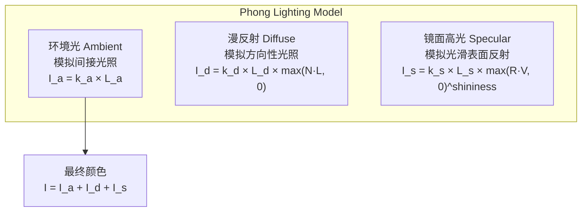
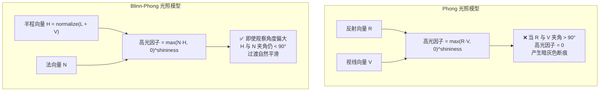

# 光照模型

> 本篇涵盖第 10-12 章，从环境光到漫反射再到镜面高光，完整讲解冯氏光照模型的三个分量。

## 目录

- [第 10 章：给物体添加环境光](#第-10-章给物体添加环境光)
- [第 11 章：为物体增加漫反射效果](#第-11-章为物体增加漫反射效果)
- [第 12 章：为物体增加镜面高光效果](#第-12-章为物体增加镜面高光效果)

---

## 第 10 章：给物体添加环境光

之前的章节我们学习了一个自由转动的立方体，本节讲解如何给物体增加光照效果，有了光照，物体之间才会有层次感，才会显得更真实。

### 光与色的物理模型


> **[核心原理]** 颜色不是物体的固有属性，而是**光、物体、视觉系统**三者交互的结果。物体呈现某种颜色，是因为它**反射**了该颜色的光波，**吸收**了其余光波。

### 什么是颜色

现实生活中，当我们看一个物体的时候，很容易地能分辨出它的颜色。但大家有没有想过，颜色到底是什么？

其实颜色并不是客观存在的东西，只是一个视觉效果，决定这个视觉效果的关键因素是有三个：光、物体、视觉系统。

大家都知道，在有光线存在的时候，我们能够看到物体，准确分辨它们的颜色。但是到了晚上伸手不见五指的时候，这时候已经没了光线，我们是看不到任何东西的。

光是什么呢？光是一种电磁波，电磁波中的一部分能够被人眼所感知，这部分被称为可见光。

当光线照射到物体上时，物体能够吸收可见光的一部分，并反射不能吸收的那部分，反射出来的这部分可见光会刺激人眼，经过视神经传到大脑，形成对物体的色彩信息，这就是我们所说的`颜色`。

所以颜色的形成离不开这三个因素。

比如，当白色的太阳光照射在一个红色的物体上时，该物体吸收红色以外的光线，反射剩余的光线（红色光），所以我们看到了红色的物体。

假如我们有一盏蓝色的灯（r:0, g:0, b:1），照射在一个红色的物体（r:1, g:0, b:0）上，该物体吸收红色以外的光线，反射剩余的光线（r:0, g:0, b:0），黑色，所以我们看到的是一个黑色的物体。

简单一句话就是，人眼看到的物体是什么颜色，就代表这个物体反射该颜色。

### 颜色在计算机中的表示

那么，在计算机中，我们表示物体的颜色时，其实就是设置该物体能够反射的可见光。比如我们为一个物体指定蓝色，本质就是让该物体吸收除了蓝色以外的光线，只反射蓝色光线，这样我们看到的物体就是蓝色的。

我们前面的例子，都是只设置了物体的颜色，并没有加入光照因素。如果我们加入光照因素的话，该如何计算光照效果呢？

加入光照因素后，会影响进入人眼的颜色，所以，我们仍然是通过设置物体的颜色来表达加入光照后的效果。

当我们在计算机中创建一个光源时，需要给光源设置一个颜色（光源也是有颜色的哦），我们给光源设置为白色：

> 以下的代码部分为 GLSL 语法。

```
vec3 light = vec3(1, 1, 1);
```

假设我们有一个物体是红色的：

```
vec3 color = vec3(1, 0, 0);
```

在计算机领域中，将`光源颜色的各个分量`与`物体颜色的各个分量`相乘，得到的就是物体所反射的颜色，即该物体在该光源照射下进入人眼的颜色：

```
vec3 resultColor = light * color
```

> 在 GLSL 语言中，vec3 与 vec3 相乘的实质是将两个 vec3 的分量分别相乘，得到一个新的 vec3。

得到的结果是 `vec3(1 * 1, 1 * 0, 1 * 0) = vec3(1, 0, 0)`，很明显，是红色，这也和现实生活中的表现一致。

前面讲了，如果蓝色的光线照射到红色的物体上，进入人眼的颜色是黑色，我们验证一下：

```
vec3 light = vec3(0, 0, 1);
vec3 color = vec3(1, 0, 0);
vec3 resultColor = light * color;
```

将光线的 rgb分量 和 物体颜色的 rgb 分量相乘：

`resultColor = (0 * 1, 0 * 0, 1 * 0) = (0, 0, 0)`

最终结果是黑色，很明显，和现实生活中的表现一致。

这就是在计算机中光照作用下物体颜色的计算原理。

### 环境光

在现实世界中，物体由于有本身材质的不同，对光线的反射效果也不同。材质粗糙的物体会将光线向各个方向进行反射，即漫反射，这也是现实生活中最为常见的反射类型，当漫反射的光线碰到另一个物体时，还会再次进行漫反射，所以，即使在没有光线照射到某个物体的情况下，其他物体的漫反射光也能照射到该物体，所以我们能够看到它。

那么在计算机中，如果想真实地模拟现实生活中没有光源直接照射物体时，通过其他物体的漫反射我们仍然能够看到该物体的情况，耗费的算力特别大，所以定义一种`环境光`的概念，来近似模拟这种效果。

> 请注意，虽然在环境光中多次提到了漫反射的概念，但是环境光要模拟的并不是有光线照射下的漫反射，而是多个物体的漫反射互相作用的光线效果。

那么环境光，如何设置呢？

通常，我们使用一个较小的常量乘以光的颜色来模拟环境光。

### 环境光的计算

假设有一个光源，发出的光线是白色光：

```
vec3 lightColor = vec3(1, 1, 1);
```

我们定义环境光的常量因子为 0.1

```
float ambientFactor = 0.1;
```

那么环境光的计算如下：

```
vec3 ambientColor = ambientFactor * lightColor;
```

> GLSL中浮点数和 vec 向量相乘的实质是将该浮点数分别与vec向量的各个分量相乘，并返回新的 vec向量

计算出的环境光是：
`ambientColor = (1 * 0.1, 0.1 * 1, 0.1 * 1) = (0.1, 0.1, 0.1)`

### 给物体增加环境光

之前的章节例子中，我们并没有提到光的概念，事实上我们默认有一个白色的环境光在里面的，所以我们能够看到它们。

看看我们之前的片元着色器

```
gl_FragColor = v_Color;
```

其实可以理解为一个强度因子为 1 的白色光源：

```
float ambientFactor = 1.0;
vec3 lightColor = vec3(1, 1, 1);
vec3 ambientColor = ambientFactor * lightColor;
gl_FragColor = vec4(ambientColor, 1) * v_Color;
```

那这次，我们要改变强度因子，同时改变光线颜色，所以我们要定义两个常量，强度因子`u_AmbientFactor`和光源颜色`u_LightColor`。

增加了环境光的片元着色器如下：

```
 precision mediump float;
 varying vec4 v_Color;
 //光源颜色
 uniform vec3 u_LightColor;
 //环境光强度因子
 uniform float u_AmbientFactor;
 void main(){
 vec3 ambientColor = u_AmbientFactor * u_LightColor;
 gl_FragColor = vec4(ambientColor, 1) * v_Color;
 }
```

接下来我们需要通过 JavaScript 给片元着色器传递这两个常量：

```
var u_AmbientFactor = gl.getUniformLocation(program, 'u_AmbientFactor');
var u_LightColor = gl.getUniformLocation(program, 'u_LightColor');
```

找到这两个常量位置，我们需要为它们传递强度因子和光线颜色，这里我们使用滑块来改变强度因子，并使用颜色选择器改变光线颜色，强度因子默认值是 0.2，光线颜色默认是白色：

```
环境光因子：
 <input id="ambientFactor" class="range" type="range" min="0" max="1" step="0.01" value="0.2" />


光线颜色：
 	<input id="lightColor" class="color" type="color" value="#FFFFFF" />
```

我们看下效果：


> 大家可以通过调节 1 处的滑块来改变强度因子，观察台体的亮度变化，调节 2 处的颜色选块来改变光线颜色，观察台体的在不同颜色光线照射下的变化。

为了便于观察，通过程序自动改变光线颜色：


可以看到，在不同颜色的光线照射下，人眼观察到的物体颜色也会不同。

### 回顾

本节讲解了计算机如何模拟现实生活中的颜色以及如何给物体增加环境光，下一节我们学习如何在计算机中模拟真实世界中的光照效果。

---

## 第 11 章：为物体增加漫反射效果

我们已经学会了给物体增加环境光，但现实世界中一个物体展示出来的颜色除了受环境光的影响，还要看该物体是否被光源直接照射，以及物体本身的材质。如果物体被光源直接照射，它会比没有光源直接照射的物体更亮一些。物体本身如果是光滑的，那么在被光源照射时会显得更加亮，甚至刺眼，比如一面镜子，不锈钢等。假设物体粗糙不平，那么它给人的感觉就平和一些。

除了物体本身的因素会对最终进入人眼的颜色产生影响，人眼、物体、光源之间的位置也会决定进入人眼的颜色。一个很常见的例子就是光线照射在镜面时，当反射出来的光线没有进入人眼的时候，人眼看到的镜子是正常的。当我们移动自身位置，正好能够让镜子的反射光线进入人眼，此时看到的镜面就会很刺眼。

现实生活中的光照效果如此复杂，而且受到很多因素的影响，即使在计算机硬件飞速发展的今天，也依然会消耗很大的算力，无法精确模拟这种效果，所以需要一种能够近似现实光照效果的简化模型。业界比较著名的是`冯氏光照模型`（Phong Lighting Model）。

### 冯氏光照模型

冯氏光照模型模拟现实生活中的三种情况，分别是环境光(Ambient)、漫反射(Diffuse)和镜面高光(Specular)。



| 分量 | 模拟现象 | 计算公式 | 占比 |
|------|---------|---------|------|
| 环境光 (Ambient) | 间接光照、阴天 | $I_a = k_a \times L_a$ | 较小 |
| 漫反射 (Diffuse) | 方向性光照、粗糙表面 | $I_d = k_d \times L_d \times \max(\vec{N} \cdot \vec{L}, 0)$ | **主要** |
| 镜面高光 (Specular) | 光滑表面反射 | $I_s = k_s \times L_s \times \max(\vec{R} \cdot \vec{V}, 0)^{shininess}$ | 视材质而定 |

- 环境光：环境光在上节已经讲过了，主要用来模拟晚上或者阴天时，在没有光源直接照射的情况下，我们仍然能够看到物体，只是偏暗一些，通常情况我们使用一个`较小的光线因子乘以光源颜色`来模拟。
- 漫反射：漫反射是为了模拟`平行光源`对物体的方向性影响，我们都知道，如果光源正对着物体，那么物体正对着光源的部分会更明亮，反之，背对光源的部分会暗一些。在冯氏光照模型中，漫反射分量占主要比重。
- 镜面高光：为了模拟光线照射在`比较光滑`的物体时，物体正对光源的部分会产生`高亮效果`。该分量颜色会和光源颜色更接近。

有了冯氏光照模型，我们就可以通过这三个分量模拟出相对真实的光照效果了。

环境光分量我们上节已经讲过了，本节将跳过，不再赘述，本节主要讲解漫反射分量。

### 计算漫反射光照

我们知道，当一束光线照射到物体表面时，光线的入射角越小，该表面的亮度就越大，看上去也就越亮。反之，该表面的亮度就越小，看上去越暗。


这种现象我们该如何在计算机中表示呢？

关键在于`入射角的表示`与`光线强度的计算`。

#### 入射角的表示与计算

我们需要定义一个类似`法线`的概念，即`法向量`，法向量垂直于物体表面，并且朝向平面外部，如下图：

有了法向量，我们还需要光线照射方向，光线照射方向根据光源的不同有两种表示方法：

- 平行光线
  - 光线方向是全局一致的，与照射点的位置无关，不会随着照射点的不同而不同，不是很真实。
- 点光源。
  - 向四周发射光线，光线方向与照射点的位置有关，越靠近光源的部分越亮，光照效果比较真实。

> 接下来我们用这两种方式来演示。

有了法向量以及光线照射方向，我们也就知道了入射角，有了入射角，那么反射光强度的计算就轻而易举了。

##### 计算反射光强度

因为入射角的大小与反射光的亮度成`反比`，所以我们使用`入射角的余弦值`来表示漫反射的光线强度。

##### 法向量

法向量是垂直于顶点所在平面，指向平面外部的向量，只有方向，没有大小，类比光学现象中的法线，如下所示：


法向量存储在顶点属性中，为了便于计算入射角的余弦值，法向量的长度通常设置为 1。

除了`法向量`，我们还需要知道`光线的入射角`，即光源的照射方向向量和法向量的夹角，上图中  即是入射角。

##### 光源照射方向向量的计算

> 光源位置坐标是基于世界坐标系的，所以我们在计算光源入射方向向量的时候，需要将照射点的坐标也转换到世界坐标系中。

在世界坐标系中，假设有一光源 p0 (x0, y0, z0)。

```
vec3 p0 = vec3(10, 10, 10);
```

光线照射到物体表面上的一点 p1 (x1, y1, z1)。

```
vec3 p1 = vec3(20, 25, 30);
```

那么光线照射在该点的方向向量为：

```
vec3 light_Direction = p1 - p0;
```

> GLSL中的 `+`、`-`、`*`、`/` 操作符的左右两个数如果是向量的话，得出的新向量的各个分量等于原有向量逐分量的相减结果。

这样我们就得出了光源的照射方向向量。

##### 计算漫反射光照

有了入射角，我们的漫反射光照分量就可以求出来了。

- 漫反射光照 = 光源颜色 \* 漫反射光照强度因子
- 漫反射光照强度因子 = 入射角的余弦值

通常我们如果要求入射角的余弦值，需要首先知道入射角，然后再求入射角的余弦值。不过由于我们使用的是向量，根据向量的运算规则，我们可以使用向量之间的`点积`，再除以向量的长度之积，就可以得出余弦值。

我们首先将两个向量`归一化`，转换成单位向量，然后进行点积计算求出夹角余弦。

> 归一化向量的实质是将向量的长度转换成 1，得出的一个单位向量。

所以我们需要两个数学方法来操作他们

- dot
  - 求出两个向量的点积。
- normalize
  - 将向量转化为长度为 1 的向量。

所幸的是，GLSL 内置了这两个函数方便我们计算，一些有名的 3D 框架中也包含这两个方法。

所以，我们的入射角余弦值就可以这样求出了：

```
//light_Direction表示光源照射方向向量。
//normal 代表当前入射点的法向量
vec3 light_Color = vec3(1, 1, 1);
float diffuseFactor = dot(normalize(light_Direction), normalize(normal));
vec4 lightColor = vec4(light_Color * diffuseFactor, 1);
```

这样我们就求出了漫反射光照的分量，接下来我们实际操作一下，比较一下物体在加入光照前后的效果。

##### 平行光漫反射

前面讲了那么多理论，是时候上手实践一下了。我们按照 WebGL 的编码流程，看看各个阶段需要做何处理。

###### 顶点着色器

顶点着色器需要接收顶点法向量，`插值化`后传递给片元着色器，所以我们需要定义一个`varying`类型的 3 维向量来表示法向量，完整的顶点着色器如下：

```
// 顶点坐标
attribute vec4 a_Position;
// 顶点颜色
attribute vec4 a_Color;
// 顶点法向量
attribute vec3 a_Normal;
// 传递给片元着色器的法向量
varying vec3 v_Normal;
// 传递给片元着色器的颜色
varying vec4 v_Color;
// 模型视图投影变换矩阵。
uniform mat4 u_Matrix;

void main(){
	// 将顶点坐标转化成裁剪坐标系下的坐标。
	gl_Position = u_Matrix * vec4(a_Position, 1);
	// 将顶点颜色传递给片元着色器
	v_Color = a_Color;
	// 将顶点法向量传递给片元着色器
	v_Normal = a_Normal;
}
```

细心的读者已经看到了，着色器中我们使用了 GLSL 中的矩阵容器类型 `mat4`，4 \* 4 矩阵，用来表示模型视图投影变换。我们将 4 阶矩阵左乘 4 维向量，即可表示对 4 维向量所表示的点执行 4 阶矩阵所表示的变换。

> 关于矩阵和向量的运算意义，我会在之后的章节讲解。这里大家只要了解了矩阵左乘向量的意义，并且学会使用就可以了。

###### 片元着色器

漫反射光照分量在片元着色器中计算，按照上面的计算公式，我们需要接收顶点着色器传递过来的插值后的法向量`v_Normal`和全局光源位置 `u_LightPosition`，以及光线的颜色`u_LightColor`。

```
// 片元法向量
varying vec3 v_Normal;
// 片元颜色
varying vec4 v_Color;
// 光线颜色
uniform vec3 u_LightColor;
// 光源位置
uniform vec3 u_LightPosition;
void main(){
 // 环境光分量
 vec3 ambient = u_AmbientFactor * u_LightColor;
 // 光源照射方向向量
 vec3 lightDirection = u_LightPosition - vec3(0, 0, 0);
 // 漫反射因子
 float diffuseFactor = dot(normalize(lightDirection), normalize(v_Normal));
 // 如果是负数，说明光线与法向量夹角大于 90 度，此时照不到平面上，所以没有光照，即黑色。
 diffuseFactor = max(diffuseFactor, 0.0);
 // 漫反射光照 = 光源颜色 * 漫反射因子。
 vec3 diffuseLightColor = u_LightColor * diffuseFactor;
 // 物体在光照下的颜色 = （环境光照 + 漫反射光照） * 物体颜色。
 gl_FragColor = v_Color * vec4((ambient + diffuseLightColor),1);
}
```

###### JavaScript部分

着色器的程序完成了，接下来我们需要给着色器传递数据了。和之前的例子相比，我们多了两个全局变量`光照颜色`、`光照位置`，以及一个顶点属性`法向量`。

首先我们给顶点增加法向量：

```
var normalInput = [ [0, 0, 1], //前平面
 [0, 0, -1], //后平面
 [-1, 0, 0], //左平面
 [1, 0, 0], //右平面
 [0, 1, 0], //上平面
 [0, -1, 0] //下平面
];
```

各个平面的法向量准备好后，我们就可以为组成平面的顶点设置法向量属性了，限于篇幅，此处不再展示源码，感兴趣的读者可以自行查阅原课程的完整源代码。

接下来，创建立方体的顶点数据：

```
var cube = createCube(10, 10, 10);
```

此处创建一个长、宽、高各位 10 的立方体，坐标原点在立方体中心。

接下来，我们设置光源位置，我们希望将光源放在立方体前面 z 轴坐标正方向 10 的位置。

```
gl.uniform3f(u_LightPosition, 0, 0, 10);
```

设置光源颜色为白色：

```
gl.uniform3f(u_LightColor, 1, 1, 1);
```

按照这种放置，光源在立方体的正前方，它始终照亮前面。我们看下演示效果：


可以看到我们设置的白色光源把立方体的前平面（红色面）照亮了。

等等，好像有些不对劲。

一个很大的问题是：立方体在转动时，转动到正对光源方向的平面并没有被照亮。

大家考虑下为什么？

#### 动态计算法向量

其实是因为在转动的时候，各个顶点的法向量还是初始值，并没有随着物体的转动而更新，所以即使有平面转动到正对光源的位置，它的法向量还是原先的法向量，计算出来的漫反射光照仍然是 0。所以，我们需要在物体发生变换的时候，让法向量也跟着发生变换。

我们来修正这个问题，解决办法很简单，只要将立方体的`模型变换矩阵`传递给`顶点着色器`，然后与`顶点的法向量`相乘，即可得到变换后的法向量。

> 此处又提到了矩阵，可见矩阵的重要性非同一般，在后面的矩阵章节大家一定要认真学习。

##### 顶点着色器

顶点着色器需要做些改动，用来接收模型矩阵，然后将模型矩阵与法向量相乘，得到变换后的法向量，传递给片元着色器。

```
// 顶点坐标
attribute vec4 a_Position;
// 顶点颜色
attribute vec4 a_Color;
// 顶点法向量
attribute vec3 a_Normal;
// 传递给片元着色器的法向量
varying vec3 v_Normal;
// 传递给片元着色器的颜色
varying vec4 v_Color;
// 模型视图投影变换矩阵。
uniform mat4 u_Matrix;
// 模型变换矩阵。
uniform mat4 u_ModelMatrix;

void main(){
	gl_Position = u_Matrix * vec4(a_Position, 1);
	v_Color = a_Color;
	v_Normal = mat3(u_ModelMatrix) * a_Normal;
}
```

##### 片元着色器不需要修改。

##### JavaScript部分

JavaScript 部分需要为顶点着色器传入模型矩阵`u_ModelMatrix`的值，那么，模型矩阵如何计算呢？还好矩阵库为我们解决了这个问题。

```
var modelMatrix = matrix.identity();
modelMatrix = matrix.rotateX(modelMatrix, Math.PI / 180 * (uniforms['xRotation']));
```

这里利用了矩阵库的两个方法`identity` 和 `rotateX`：

- identity 用来初始化一个 4 维矩阵，对角线分量均为1。
- rotateX 将原来的矩阵沿着 X 轴旋转，得到一个新的矩阵。

> 关于矩阵的变换细节在后面章节有详细介绍，此处只讲如何使用。

改造完成，我们看下效果：


可以看到，立方体正对光源的平面都能够被照亮了。

#### 点光源的漫反射

前面的平行光漫反射可以模拟遥远的光源，比如太阳光，由于太阳距离地球过于遥远，所以光线照射在物体各个点的方向还是可以近似平行的。

但现实生活中还有很多人造光源，这些光源距离物体比较近，照在物体不同点时，入射角也会不一样，所以光照强度也有差别，在一个平面上产生距离光源近的部分比较亮，距离光源远的部分比较暗的效果。

接下来我们模拟这种情况。

我们在之前平行光漫反射的基础上进行改造，大家可以看到，之前的平行光漫反射计算入射角余弦时，是根据`光源位置`和世界坐标系的`原点`计算的入射角，只要我们不改变光源位置，那么光线方向就始终一致。

但是，点光源需要根据光源位置和入射点位置计算入射角，所以我们需要计算出入射点的世界坐标系坐标。

入射点的世界坐标系坐标的求法也比较简单，只需要左乘模型矩阵就可以了。

我们对上面的例子加以升级。

##### 顶点着色器

顶点着色器需要定义一个入射点位置，插值化后传给片元着色器计算入射角的余弦。

```
...略
varying vec3 v_Position;
void main(){
	...略
	v_Position = vec3(u_ModelMatrix * vec4(a_Position, 1));
}
```

##### 片元着色器

片元着色器部分的改变只有在计算光源入射方向时，用光源位置减去入射点位置：

```
...略
// 光源照射方向向量
vec3 lightDirection = u_LightPosition - v_Position;
...略
```

JavaScript部分不需要改动，我们看下演示效果：


可以看到，在点光源的作用下，平面上的不同点也产生了明暗效果。

#### 物体缩放时的表现。

结束了吗？当然没有，我们还有一个问题没有解决。

假设有一物体表面被光线照射：


当对物体执行非等比缩放时，顶点法向量也会执行非等比缩放，但是执行缩放后的法向量却不再垂直于顶点所在平面了，如下图：


法向量不正确带来的后果是光照计算不准，表现如下：


可以看到，当我们对球体执行纵向放大的时候，放大的部分虽然正对着光源，但是没有光照。

因此，我们不能使用简单的模型矩阵来变换顶点法向量了。为了解决这个问题，我们需要专门为法向量的变换定义一个单独的矩阵`法线矩阵`，法线矩阵可以用「模型矩阵左上角的3维矩阵的逆矩阵的转置矩阵」来代替。听起来比较复杂，其实很简单。

- 1、对模型矩阵执行逆矩阵操作。
- 2、对上一步得出的矩阵执行转置矩阵。
- 3、取上一步得出的矩阵的前三阶矩阵。

我们修改一下程序，顶点着色器和片元着色器部分不用改变，我们需要修改 JavaScript 部分。

我们使用矩阵库的两个方法 transpose 和 inverse 来对模型矩阵执行转置操作和求逆操作。

```
var normalMatrix = matrix.transpose(matrix.inverse(modelMatrix));
```

然后将该矩阵传递给顶点着色器即可，我们看下修改后的效果：


### 回顾

至此，冯氏光照模型的漫反射部分就讲解完了，原理比较简单，但是计算量比较多，尤其是涉及到的一些矩阵运算知识，大家可能有些蒙，这是正常现象。大家只要会使用矩阵就可以了，至于为什么要用矩阵表示变换，之后的章节再向大家揭开这个谜团。

下一节，我们学习冯氏光照模型的第三个分量，`镜面高光`。

---

## 第 12 章：为物体增加镜面高光效果

前两个章节我们讲述了冯氏光照模型的环境光和漫反射光，本节学习组成冯氏光照的最后一个因素：镜面高光。

### 镜面高光现象

大家小时候应该都做过这样的恶作剧，上课的时候拿一面镜子，对准某个同学，慢慢调整镜子的角度，直到反射的太阳光照在对方的脸上，然后引起该同学的极度不适。

有没有想过为什么会有这种现象？

有的同学答了，这是因为镜子的反射光正好进入了同学的眼睛里。

说的没错，那假如我拿一件衣服来反射太阳光，能不能达到同样的效果。

很多同学脱口而出：不能。

是的，可是大家有没有想过为什么不能？

也许大家会出于直觉回答，因为衣服不反光，镜子反光。其实也对，但不太严谨。事实上衣服也反光，只是衣服表面过于粗糙，光线被散射到了各个方向，不能集中射向一个方向，导致进入人眼的光线强度大大削弱。镜子就不同了，镜子比较光滑，光线反射方向比较统一，进入人眼的光线强度也就越多，从而产生刺眼的效果。

冯氏光照模型使用`镜面高光分量`来模拟这种现象。

### 镜面高光的表示与计算

与漫反射分量相同，镜面高光也是根据光线的入射方向向量和法向量来决定的，只不过镜面高光还需要依赖视线的观察方向，也就是眼睛是从什么方向观察的物体。

视线方向向量与反射光向量之间的夹角越小，夹角余弦值就会越大，那么人眼感受到的光照就会越强，反之，光照越暗。因此，我们使用夹角的余弦值表示镜面高光因子，然后再用镜面高光因子乘以光线颜色即可求出镜面高光分量：


- 1、首先需要求出反射光向量`reflectDirection`和人眼视线方向向量`viewDirection`。
- 2、归一化两个向量。
- 3、求出两个归一化向量的点积，得到镜面高光因子。
- 4、将上一步求出的高光因子乘以光线颜色，得到镜面高光分量。

本节使用 GLSL 内置的反射向量算法`reflect(inVec, normal)`，其中 `inVec` 为入射向量，方向由光源指向入射点，`normal` 为入射点的法向量。

### 如何实现镜面高光

接下来，我们开始编码实现镜面高光效果。

#### 计算反射光向量

反射光向量在片元着色器中实现，参照上一节漫反射分量的计算，我们已经有了光源位置`u_LightPosition`和入射点位置`v_Position`，所以可以求得入射光向量：

```
//求出入射光向量
vec3 lightDirection = v_Position - u_LightPosition;
```

> 切记，在使用GLSL 的reflect 函数计算反射光向量时，一定要确保入射光向量的方向是从光源位置指向入射点位置。

有了入射光向量，我们还需要入射点的法向量`v_Normal`，这个值已经从顶点着色器中插值化后传到片元着色器了，所以我们可以直接拿来用：

```
vec3 reflectDirection = reflect(normalize(lightDirection), normalize(v_Normal));
```

这样就求出了反射光向量，接下来我们计算视线观察向量。

#### 计算视线观察向量

我们将入射点到观察者的方向向量定义为视线观察向量，为了计算这个向量，我们需要知道入射点的位置以及观察者的位置，入射点的位置我们有了，现在需要观察者的位置，我们将人眼在世界坐标系下的坐标作为观察者位置，然后将其用 `uniform` 变量的形式传递到片元着色器中。

因此我们的片元着色器要增加一个 `uniform` 变量接收观察者坐标。

```
// 观察者坐标。
uniform vec3 u_ViewPosition;
```

有了观察者坐标，我们就可以计算出视线观察向量了。

```
// 视线观察向量（从入射点指向观察者）
vec3 viewDirection = u_ViewPosition - v_Position;
```

#### 计算镜面高光因子

前面求出了视线观察向量和反射光向量，接下来我们就可以计算镜面高光因子了。

首先，归一化`视线观察向量`和`反射光向量`

```
viewDirection = normalize(viewDirection);
reflectDirection = normalize(reflectDirection);
```

然后计算这两个向量的点积，这里要注意一点，就是如果这两个向量的点积为负数，则说明视线观察向量和反射光向量大于 90 度，是没有反射光进入眼睛的，所以我们使用 `max`函数取点积和 0 之间的最大值。

```
// 镜面高光因子
float specialFactor = dot(viewDirection, reflectDirection);
// 如果为负值，一律设置为 0。
specialFactor = max(specialFactor, 0.0);
```

完整的片元着色器程序如下：

```
 precision mediump float;
 varying vec4 v_Color;
 uniform vec3 u_LightColor;
 uniform float u_AmbientFactor;
 uniform vec3 u_LightPosition;
 varying vec3 v_Position;
 varying vec3 v_Normal;
 uniform vec3 u_ViewPosition;
 void main(){
 // 环境光分量
 vec3 ambient = u_AmbientFactor * u_LightColor;
 // 入射光向量（从光源指向入射点）
 vec3 lightDirection = v_Position - u_LightPosition;
 // 归一化入射光向量
 lightDirection = normalize(lightDirection);
 // 漫反射因子（漫反射需使用从入射点指向光源的向量，故取负）
 float diffuseFactor = dot(normalize(-lightDirection), normalize(v_Normal));
 // 如果大于 90 度，则无光线进入人眼，漫反射因子设置为0。
 diffuseFactor = max(diffuseFactor, 0.0);
 // 漫反射光照
 vec3 diffuseLightColor = u_LightColor * diffuseFactor;

 // 归一化视线观察向量（从入射点指向观察者）
 vec3 viewDirection = normalize(u_ViewPosition - v_Position);
	//反射向量（入射光向量关于法向量的反射）
 vec3 reflectDirection = reflect(lightDirection, normalize(v_Normal));

 // 初始化镜面光照因子
 float specialFactor = 0.0;
 // 如果有光线进入人眼。
 if(diffuseFactor > 0.0){
 	specialFactor = dot(viewDirection, reflectDirection);
 specialFactor = max(specialFactor,0.0);
 }
 // 计算镜面光照分量
 vec3 specialLightColor = u_LightColor * specialFactor * 0.5;
 // 计算总光照
 vec3 outColor = ambient + diffuseLightColor + specialLightColor;
 // 将物体自身颜色乘以总光照，即人眼看到的物体颜色。
 gl_FragColor = v_Color * vec4(outColor, 1);
 }
```

加入光照之后，我们的着色器代码就变多了，但其实并不复杂，仅仅是`取值`、`计算`、`赋值`操作而已。

#### JavaScript 部分

镜面光照我们需要为着色器传递一个人眼观察位置，所以我们的JavaScript 部分需要修改：

```
// 获取着色器全局变量 `u_ViewPosition`
var u_ViewPosition = gl.getUniformLocation(program, 'u_ViewPosition');
```

将人眼观察位置放置在 z 轴正方向 10 位置，即物体的前面。

```
var uniforms = {
	eyeX: 0,
	eyeY: 0,
	eyeZ: 10
};

gl.uniform3f(u_ViewPosition, uniforms['eyeX'], uniforms['eyeY'], uniforms['eyeZ']);
```

完整的代码大家可以参见原课程配套源码，我们比较下加入镜面高光前后的效果。

无镜面高光时：


添加镜面高光后：


观察上面两幅图，我们能很直观地看到添加镜面高光后，球体正中央有一个明晃晃的光圈，符合真实世界中的场景。

### 反光度

但是，这个刺眼的光圈面积太大了，我们需要给它添加一个称为`反光度`(shininess)的参数约束光圈的大小，一个物体的反光度越大，反光率就越强，散射的光就越少，我们看到的高光面积就越小。

我们定义一个`u_Shininess`的变量表示物体的反光度，然后用前面求得的高光因子求 `u_Shininess` 次幂作为最终的高光因子。这样就可以让我们的光圈变得小一些。

> 求幂计算可以通过 GLSL 内置的函数 pow(base, exponent) 求得。

```
specialFactor = max(specialFactor, 0.0);
specialFactor = pow(specialFactor, u_Shininess);
```

一般情况下，我们设置物体的反光度为 32 就可以了，但是特殊场景下，效果可能不理想，这时候，我们就需要根据实际情况调整反光度了。

我们将反光度设置成 32，看下增加反光度后的效果：


这会效果明显好多了，我们可以看到光圈点很小了，大家可以调节反光度对比查看效果。

#### Blinn-Phong光照模型



| 对比维度 | Phong 模型 | Blinn-Phong 模型 |
|----------|-----------|-----------------|
| 高光计算 | 反射向量 R 与视线向量 V 的点积 | 半程向量 H 与法向量 N 的点积 |
| 边缘表现 | R 与 V 夹角 > 90° 时高光突然消失 | H 与 N 夹角始终 < 90°，过渡平滑 |
| 计算量 | 需要 `reflect()` 函数计算反射向量 | 仅需 `normalize(L + V)`，更高效 |
| 高光形状 | 更聚焦、更锐利 | 稍微更宽、更柔和 |
| 实际应用 | 教学演示 | **工业标准**，OpenGL 固定管线默认 |

冯氏光照模型不仅能够很好地近似真实光照，而且性能也相当高。但是
这种光照在某些场景下仍然有些缺陷，大家观察前面没有添加反光度时的图片，应该能发现高光光圈边缘有一圈很明显的暗灰色断痕，但大家再看一下增加反光度后的效果，却没发现这种现象。这是为什么呢？

产生这个问题的原因是，在高光边缘部位，由于人眼视线向量和反射光向量夹角大于90度，那么夹角的余弦值便小于 0，按照冯氏光照模型的镜面光照算法，夹角余弦值小于 0 时， 我们的镜面高光分量系数就会用 0 来代替。所以高光边缘部位及以外的部分就没有了镜面光照分量，试想一下，如果反光度越小，镜面高光区域就越大，那高光区域边缘部位漫反射光的分量所占比重就会比较小，在高光边缘部位就会产生一种较大的亮度差，给人一种暗灰色断痕的感觉。反之，反光度越大，光圈越小，相应地，光圈周围漫反射光的分量所占比重就比较大，所以不会在高光边缘产生过大的亮度差。

如下图，反射光线和视线观察向量之间的夹角γ 大于90度，所以此时镜面高光分量为 0。


其实，这种观察角度，镜面高光分量还是应该有的，只是值比较小而已。所以，出现了 Blinn-Phong 光照模型，这种光照模型不再利用反射向量，而是采用了`半程向量` ，半程向量是视线方向和光线方向夹角的平分方向上的单位向量，利用半程向量和法向量之间的夹角余弦来表示镜面高光因子，半程向量和法向量之间的夹角越小，镜面高光分量越大，如下图所示：


##### 实现 Blinn-Phong 光照

我们在冯氏光照代码的基础上加以修改，实现 Blinn-Phong 光照模型。与冯氏光照模型不同的是，我们需要半程向量，半程向量该如何求呢？

按照向量的计算规则，半程向量只需要我们将视线观察向量和光线方向向量（从入射点指向光源）相加，然后将得出的结果归一化就可以求出了。

```
// 计算半程向量（L 为从入射点指向光源的方向，V 为从入射点指向观察者的方向，H = normalize(L + V)）
vec3 halfVector = normalize(normalize(-lightDirection) + viewDirection);
// 计算高光因子
float specialFactor = dot(normalize(v_Normal), halfVector);
```

利用 GLSL 的内置函数，我们就很容易的求出来了。

从冯氏光照模型进化成 Blinn-Phong 光照模型，我们只需要改动这么一处就可以了，是不是觉得很简单呢？

算法是很简单，但是我希望大家还是能够把算法背后的原理搞清楚。这才是大家学习的目的。

好了，我们比较一下反光度同时为 1 的时候，冯氏光照和 Blinn-Phong 光照之间的差别。

冯氏光照效果：


Blinn-Phong 光照效果：


可以看到，采用 `Blinn-Phong 光照模型`后， 镜面高光区域过渡得更加自然。

### 回顾

至此，我们就讲完了冯氏光照模型，以及为了解决冯氏光照的缺陷而引入的 `Blinn-Phong 光照模型`。

本节也涉及到了许多向量矩阵之间的计算，大家多加练习，不要被这些计算搞晕了。

接下来我们进入下一个环节的学习，对 GLSL 的语法进行一个总结。
