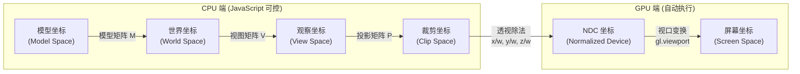
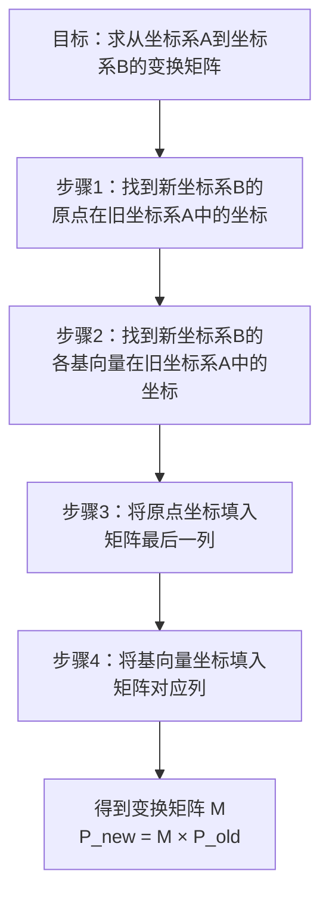

# 坐标系与变换流水线

在上一章节我们简单介绍了数学中常用的笛卡尔坐标系，以及 3D 笛卡尔坐标系中判断 `Z` 轴正向的`左右手坐标系`，本节详细介绍`坐标系`在 3D 开发过程中所扮演的重要角色。

## WebGL 坐标系

WebGL 是如何把 3D 世界中的模型（物体）渲染到屏幕上的呢？
这其中的最大难点就是`坐标系的变换`。在坐标系转换过程中都涉及哪些坐标系？为什么会有这么多的坐标系存在？他们存在的意义是什么？

带着这三个问题，我们往下看，寻求答案。

### 顶点如何渲染到屏幕上。

如果想在屏幕上绘制一个点，我们需要将点的坐标从 CPU 通过 JavaScript 传递给 GPU ，GPU 接收到顶点坐标，进行一些坐标转换（通常将转换过程放在 JavaScript 中），然后将坐标赋值给 gl\_Position：

```
gl_Position = vec4(x, y, z, 1);
```

请注意：gl\_Position 接收一个 4 维向量表示的坐标，即(X, Y ,Z ,W)，W 不等于 0，这个坐标是在`裁剪坐标系`中，我们称它为裁剪坐标。

#### 透视除法

GPU 得到裁剪坐标后，下一步会对坐标进行透视除法。所谓透视除法就是将裁剪坐标的各个分量同时除以 W 分量，使得 W 分量为 1。经过透视除法得到的坐标便处在 `NDC` 坐标系（设备独立坐标系）中， NDC 坐标系是一个边长为 2 的正方体，超出正方体的顶点都将被抛弃，不会显示到屏幕上。

> 在 NDC 坐标系内的坐标都会落在【-1，1】之间，因此很多顶点坐标往往都是小数。

#### 视口转换

接下来，GPU 就要将顶点绘制到屏幕上了，顶点此时的坐标已经转变到 NDC 坐标系中，但是 NDC 坐标系和屏幕坐标系不一致，所以就产生了最后一个坐标变换，视口转换，将顶点坐标从 NDC 坐标系下转换到屏幕坐标系下的坐标，最终将顶点显示在屏幕指定位置上。

以上便是顶点的坐标转换过程。

按照这种规则，我们传给 GPU 的顶点坐标需要遵循裁剪坐标系或者 NDC 坐标系的特点，将顶点坐标控制在 【-1，1】之间，这样的坐标往往掺杂着很多小数，不是很直观。

我们给出的模型坐标一般都是易于理解的，比如：

- 玩家的坐标是 (10, 10, 20)
- 箱子长度、宽度、高度都是 10。

但是 GPU 希望接收的是：

- 玩家坐标(0.2333333, 0.222333, 0.3333444)。
- 正方体边长 0.333333。

难以理解的小数！

为了将易于理解的起始坐标转换成 GPU 希望 接收的晦涩坐标，于是就有了坐标系的划分，开发者可以专心在各个坐标系内处理对应数据，至于具体的坐标转换过程交给通用的特定转换算法完成。

## 坐标系分类

为了将模型坐标转换成裁剪坐标，我们增加了坐标转换流水线。顶点坐标起始于模型坐标系，在这里它被称为模型坐标。模型坐标在 CPU 中经过一系列坐标系变换，生成裁剪坐标，之后 CPU 将裁剪坐标传递给 GPU。

WebGL 坐标系分为如下几类：  
模型坐标系 -- 世界坐标系 -- 观察坐标系（又称相机坐标系、视图坐标系） -- 裁剪坐标系（`gl_Position`接收的值） -- NDC 坐标系 -- 屏幕坐标系。

> 其中，裁剪坐标系之前的这几个坐标系，我们都可以使用 JavaScript 控制。从裁剪坐标系到 NDC 坐标系，这一个步骤是 顶点着色器的最后自动完成的，我们无法干预。

### 坐标转换流水线



> **[关键公式]** 顶点着色器中的核心变换：`gl_Position = P × V × M × vec4(position, 1.0)`
>
> 其中 M、V、P 分别为模型矩阵、视图矩阵、投影矩阵。注意矩阵乘法顺序为**从右向左**应用。

| 坐标系 | 原点参考 | 坐标轴方向 | 变换矩阵 | 作用 |
|--------|---------|-----------|---------|------|
| 模型坐标系 | 模型中心 | 右手系 | — | 定义模型各顶点的相对位置 |
| 世界坐标系 | 场景中心 | 右手系 | 模型矩阵 M | 将模型放置到场景中的指定位置 |
| 观察坐标系 | 相机位置 | 右手系 | 视图矩阵 V | 以相机为参照描述物体位置 |
| 裁剪坐标系 | — | 左手系 | 投影矩阵 P | 定义可视范围，裁剪不可见顶点 |
| NDC 坐标系 | — | 左手系 | 透视除法 | 归一化到 [-1, 1] 范围 |
| 屏幕坐标系 | 视口左上角 | Y 轴向下 | 视口变换 | 映射到实际像素位置 |

- CPU 中将模型坐标转换成裁剪坐标
  - 顶点在模型坐标系中的坐标经过模型变换，转换到世界坐标系中。
  - 然后通过摄像机观察这个世界，将物体从世界坐标系中转换到观察坐标系。
  - 之后进行投影变换，将物体从观察坐标系中转换到裁剪坐标系。
- GPU 接收CPU 传递过来的裁剪坐标。
  - 接收裁剪坐标，通过透视除法，将裁剪坐标转换成 NDC 坐标。
  - GPU 将 NDC 坐标通过视口变换，渲染到屏幕上。


### 模型坐标系

一个物体通常由很多点构成，每个点在模型的什么位置？我们需要用一个坐标系来参照，这个坐标系就叫模型坐标系，模型坐标系原点通常在模型的中心，各个坐标轴遵循右手坐标系，即 X 轴向右，Y 轴向上，Z 轴朝向屏幕外。

一般在建模软件中创建模型的时候，各个顶点的坐标都是以模型的某一个点为参照点建立的。

### 世界坐标系

我们创建好的模型需要放置在世界中的各个位置，默认情况模型坐标系和世界坐标系重合。如果模型不在世界坐标系中心，那么就需要对模型坐标系进行转换，将模型的各个相对于模型中心的顶点坐标转换成世界坐标系下的坐标。

世界坐标系也是遵循右手坐标系，X 轴水平向右，Y 轴垂直向上，Z 轴指向屏幕外面。

假如模型中有一点 P ，相对于模型中心的坐标（1，1）。
该模型在世界坐标系的（3，0）位置，那么，顶点 P 在世界坐标系中的坐标就变成了（4，1）。

### 观察坐标系

观察坐标系是将世界空间坐标转化为用户视野前方的坐标而产生的结果。人眼或者摄像机看到的世界中的物体相对于他自身的位置所参照的坐标系就叫观察坐标系。

在我们日常生活中，精准描述一个街道，我们一般用经纬度来表示，但是如果有人问你：某某街道在什么位置？如果我们告诉他世界坐标：某某街道在东经 M 度，北纬 N 度，我想他会打你。

一般我们都会用这样易于理解的描述：在`前面多远，往左或右走多远`。

这种坐标就称为观察坐标，也叫相机坐标，他是以人眼/摄像机为原点而建立的坐标系。

之所以有相机坐标系，是为了模仿人眼看待世界的效果。世界很大，有很多物体，但是不能把整个世界都显示到屏幕上，只显示人眼所能看到的一部分，这样我们就能通过改变`人眼所处的方位`，`人眼所在的位置`，看到整个 3D 空间的不同部分。

### 裁剪坐标系

裁剪坐标是将相机坐标进行投影变换后得到的坐标，也就是 gl\_Position 接收的坐标，顾名思义，以裁剪坐标系为参照。

裁剪坐标系遵循`左手坐标系`。

相机坐标系观察的空间是整个 3D 世界，而裁剪坐标系是希望所有的坐标都落在一个特定的范围内，超出这个范围的顶点坐标都将被裁剪掉，被裁剪掉的坐标就不会显示，这就是裁剪坐标系的由来。

我们将坐标全部表示成【-1.0 , 1.0】之间的方式不是很直观，所以我们希望先将观察空间中的某一部分裁剪出来，这一部分作为要显示的区域。

比如，我们希望将各个坐标轴在 【-1000，1000】 范围内的空间区域作为可视空间区域，这一区域的所有物体都将显示到屏幕上。那么如果一个顶点 P 的坐标是（1300，500，10），那么它就会被裁剪掉，因为它没有坐落在可视空间区域。


投影矩阵会创建一个观察箱`Viewing Box`，称为平截头体`Frustum`，出现在平截头体范围内的坐标最终都会显示在屏幕上。裁剪坐标系中的坐标转化到标准化设备坐标系的过程就很容易，这个过程被称之为投影`Projection`，使用投影矩阵能将 3D 坐标投影很容易地映射到 2D 的标准设备坐标系中。

将观察坐标变换为裁剪坐标的投影矩阵可以为两种不同的形式，每种形式都定义了不同的平截头体。

#### 正射投影矩阵

又名正交投影，正射投影矩阵创建的是一个立方体的观察箱，它定义了一个裁剪空间，在该裁剪空间之外的坐标都会被丢弃。
正射投影矩阵需要指定观察箱的长度、宽度和高度。


经过正射投影矩阵映射后的坐标 w 分量不会改变，始终是 1，所以在经过透视除法后物体的轮廓比例不会发生改变，这种投影一般用在建筑施工图纸中，不符合人眼观察世界所产生的近大远小的规律。
所以就有了另一种投影：透视投影。

#### 透视投影矩阵

实际生活中给人带来的感觉是，离我们越远的东西看起来更小。这个奇怪的效果称之为透视`Perspective`，透视的效果在我们看远处时尤其明显，比如下图：


实际上，远处的群山是比近处的房屋大的，但是人眼看上去，群山比房屋小，这就是透视投影要实现的效果。

透视投影矩阵将给定的平截头体范围映射到裁剪空间，除此之外它还会修改每个顶点坐标的 w 值，使得离人眼越远的物体的坐标 w 值越大。被变换到裁剪空间的坐标都会在 -w 到 w 的范围之间（任何大于这个范围的坐标都会被裁剪掉）。WebGL 要求所有可见的坐标都落在【-1.0，1.0】范围内，因此，一旦坐标转换到裁剪空间，透视除法就会被应用到裁剪坐标上。


透视除法要求顶点坐标的每个分量除以它的 W 分量，距离观察者越远，顶点坐标也就会越小，这就是 W 分量非常重要的另一个原因，它能够帮助我们进行透视投影，经过透视除法后，所有在【-W，W】范围内的坐标都会被转变到 NDC 坐标系中。

透视投影需要设置近平面、远平面、透视深度。

### NDC 坐标系

一旦所有顶点被变换到裁剪空间，GPU 会对裁剪坐标执行透视除法，在这个过程中 GPU 会将顶点坐标的 X，Y，Z 分量分别除以齐次 W 分量。这一步会在每一个顶点着色器运行的最后被自动执行。最终所有坐标分量的范围都会在【-1，1】之间，超出这个范围的坐标都将被 GPU 丢弃。

NDC 坐标系遵循`左手坐标系`，Z 轴朝向屏幕里面，Z轴值越小，越靠近我们的眼睛，我们可以通过开启 WebGL 的深度检测机制验证一下：

绘制两个三角形，第一个三角形各个顶点 Z 轴坐标为 -0.5，颜色为红色， 第二个三角形各个顶点 Z 轴坐标为 0，颜色为绿色。

开启深度检测前：


可以看到，第二个三角形绘制在了前面。不是说左手坐标系吗？按理说 Z 轴越小的越靠近视野，就会显示在前面。其实，在深度检测不开启的情况下，哪个顶点越靠后绘制，哪个顶点就绘制在前面，这时 Z 轴坐标不再决定顶点是否绘制在前面。

开启深度检测后：


深度检测开启之后，可以看到 Z 轴小的红色三角形显示在了前面，从而验证了 NDC 坐标系是左手坐标系。

### 屏幕坐标系

有了 NDC 坐标之后，GPU 会执行最后一步变换操作，`视口变换`，这个过程会将所有在【-1, 1】之间的坐标映射到屏幕空间中，并被变换成片段。

我们的模型历尽九九八十一难，终于显示到了屏幕上。

## 坐标变换举例

上面的描述大家可能不太理解，接下来我们就以一个简单的例子演示坐标系变换的步骤。

### 模型坐标

我们以一个顶点 P 为例，该顶点在边长为 3 的正方体上，初始时顶点所在坐标系是模型坐标系，也就是相对于正方体中心位置，该顶点在模型坐标系中的坐标：


### 世界坐标系

默认情况下，模型坐标和世界坐标系重合，那该顶点在世界坐标系下的坐标：

)

假设我们将立方体向右移动 5 个单位，向上移动 5 个单位，那么立方体的原点 O 在世界坐标系中的坐标就变成了：

)

那顶点 P 在世界坐标系的坐标也就变成了：

%20%3D%20(8%2C%208%2C%200))


到这里也很容易理解。

### 观察坐标系

世界坐标系中有个人 `E` 在位置(3, 3, 0)处：

)

E 所看到的世界处于观察坐标系中，X 轴、Y 轴和世界坐标系一致，Z 轴和世界坐标系相反，指向屏幕里面。我们很容易就能想到世界坐标系在观察坐标系中的坐标为：

)

> 代表世界坐标系的原点在观察坐标系中的坐标。

因此顶点 P 在观察坐标系的坐标就变成了：

%20%2B%20(-3%2C%20-3%2C%200)%20%3D%20(5%2C%205%2C%200))

### 裁剪坐标系

这里我们为裁剪坐标系指定一个正射投影观察箱，观察箱左侧坐标 -5，右侧坐标 5，上方坐标 5，下方坐标 -5，近平面坐标 0， 远平面坐标 5，那么处于这个观察箱之间的顶点都将被转换到裁剪坐标系中。

由于顶点 P 在观察坐标系的坐标为 (5, 5, 0)，所以它转变到裁剪坐标系下的坐标为：

%20%3D%20(1%2C%201%2C%200))

正射投影下， W 分量为 1，到了这一步就有了 W 分量：
)

### NDC 坐标系

NDC 坐标是在 GPU 中 将裁剪坐标执行透视除法，所以：

%20%3D%20(1%2C%201%2C%200%2C%201))

坐标没有改变。

### 视口变换

接下来该执行视口变换了，视口变换将 NDC 坐标映射到屏幕坐标系。这一步是将 3D 坐标转变成 2D 坐标，在 GPU 中执行，我们无法通过编程干预，

视口我们是通过 WebGL API 中的 `gl.viewport`来 设置，我们可以设置任意尺寸的视口，这里我们设置宽 500 ，高 300 的尺寸。

```
gl.viewport(0, 0, 500, 300);
```

接下来 GPU 就会将 NDC 坐标映射到视口范围内，即将 【-1，1】 的立方体范围内的坐标映射到宽 500，高 300 的屏幕坐标范围。

我们仍然需要先找到 NDC 坐标系原点在 屏幕坐标系中的坐标。


由于 NDC 坐标系 X 轴上的一个单位长度就等于视口宽度的一半，Y 轴上的一个单位长度等于视口高度的一半，所以 NDC 坐标系原点在屏幕坐标系下的坐标为

)

又由于 NDC 坐标系 Y 轴方向和 屏幕坐标系 Y 轴方向相反，所以 NDC 坐标系下的 Y 轴坐标转化到屏幕坐标系时要取Y轴坐标的相反数。

那么，顶点 P 转换到屏幕坐标系下的坐标为：

%20%2B%20(250%2C%20150)%20%3D%20(500%2C%200))

很明显，顶点显示在 canvas 视口的右上角，这和顶点在裁剪坐标系中设置的观察箱中的位置相吻合。

一个顶点的转换过程大致经历这么几步，我这里只是简单使用坐标偏移演示了一下，其实如果涉及到坐标系的旋转、缩放、Z 轴的加入、透视投影，计算过程将会更复杂。

> 所幸的是，业界已经有成熟的坐标系变换算法，我们只需要调用他们的方法，传入指定参数，就能生成坐标变换矩阵。

顶点从一个坐标系转换到另一个坐标系，只需要计算出这几点就可以：

- 计算出原坐标系的原点 O 在新坐标系的坐标。（平移变换）
- 计算出新坐标系坐标分量的单位向量在原坐标系下的长度。（缩放变换）
- 计算出原坐标系的坐标分量（基向量）的方向。（旋转变换）

看到平移、缩放、旋转，我们立刻想到了一种快速执行复杂计算的工具：矩阵。

下一节我们讲解矩阵在坐标系变换过程中发挥了什么作用？

## 回顾

本节讲述了WebGL 开发过程中涉及到的坐标系以及它们的作用，但它们之间具体是如何转换的呢？我相信有同学会有这样的好奇心。所以下一节，我们用矩阵实现坐标转换算法。

---

## 坐标变换流水线

> 本篇涵盖第 18-21 章，从基本变换原理到模型→世界→观察→裁剪的完整坐标变换流水线。

### 目录
- 第 18 章：坐标系变换：基本变换原理与算法实现
- 第 19 章：坐标系变换：模型空间变换到世界空间
- 第 20 章：坐标系变换：世界空间变换到观察空间
- 第 21 章：坐标系变换：观察空间变换到裁剪空间


---

### 第 18 章：坐标系变换：基本变换原理与算法实现

上一节我们讲了 WebGL 坐标系的分类以及它们之间的转换方式，本节开始详细介绍坐标系基本变换的算法实现，图形学中实现变换的主要数学工具是`矩阵`，所以在讲解坐标系变换之前，我们先温习一下矩阵。

#### 三种基本变换矩阵速查

| 变换类型 | 4×4 矩阵形式 | 参数 | 不变量 |
|----------|-------------|------|--------|
| **平移 (Translation)** | 最后一列为 `(tx, ty, tz, 1)` | 平移量 tx, ty, tz | 向量方向和长度不变 |
| **缩放 (Scale)** | 对角线为 `(sx, sy, sz, 1)` | 缩放因子 sx, sy, sz | 原点位置不变 |
| **旋转 (Rotation)** | 3×3 子矩阵为旋转基向量 | 旋转轴 + 旋转角度 | 原点位置不变、向量长度不变 |

##### 变换矩阵推导的一般方法



> **[核心思想]** 变换矩阵的每一列，就是新坐标系的基向量在旧坐标系下的表示。第四列是原点的偏移。这就是矩阵的几何意义——它描述了一个坐标系相对于另一个坐标系的位置和朝向。

##### 变换顺序对比

| 变换顺序 | 效果描述 | 适用场景 |
|----------|---------|---------|
| **T × R × S** | 先缩放→再旋转→最后平移 | ✅ **最常用**：模型自身变换 |
| **S × R × T** | 先平移→再旋转→最后缩放 | 缩放会改变平移距离 |
| **R × T × S** | 先缩放→再平移→最后旋转 | 旋转会改变平移方向 |

> **[记忆口诀]** "先缩后旋再平移"——缩放和旋转围绕原点进行，所以先执行；平移不改变形状，所以最后执行。

**温馨提示：**

在学习矩阵变换时，一定要搞清楚以下三点：

- 所使用的向量是`行向量`还是`列向量`。
  - 如果是`行向量`，按照`数学领域`中矩阵相乘的规则，向量要放在`左侧`相乘。
  - 如果是`列向量`，向量要放在`右侧`相乘。
- 矩阵是`行主序`还是`列主序`。
  - 如果是行主序，内存存储矩阵的数组的前四个元素表示的是对应数学矩阵的`第一行`
  - 如果是列主序，内存存储矩阵的数组的前四个元素表示的是对应数学矩阵的`第一列`
- 多个矩阵变换时的相乘顺序。
  - 在多个矩阵变换时，不同的相乘顺序会导致不同的结果，所以我们要保证矩阵相乘的顺序是我们期望的。假设有三个变换矩阵：旋转矩阵 R，平移矩阵 T，缩放矩阵 S，以及顶点向量 P，那么 P 变换到 P1 的顺序一般是这样的：

    

    即先`缩放`，再`旋转`，最后`平移`。

#### 矩阵到底代表什么？

3D 学习过程中的一大难点就是矩阵变换，我们经常看到矩阵左乘一个列向量就能够实现平移、旋转、缩放等效果。

那么，矩阵背后的神秘力量是什么呢？

其实矩阵并不神秘，只是矩阵可以对一些数字按照矩阵的规则执行一系列运算操作，简化了我们使用`+`、 `-`、 `*`、 `/`进行变换运算的步骤而已。

一个矩阵可以理解为一种变换，多个矩阵相乘代表多个变换。

##### 矩阵变换

常见的矩阵变换有如下几种：

- 平移
- 缩放
- 旋转
- 切变


但是在坐标系转换中，最常应用的是前三种。我们看一下如何用矩阵表示这些变换。在讲解矩阵变换之前，我们先从头捋一下`点`和`向量`的表示。

##### 点和向量

前面章节我们讲了`齐次坐标`，它用来区分`点`和`向量`，齐次坐标使用 `N+1` 维向量表示 N 维空间，第 N+1 维数字如果是 0 的话，则代表 N 维空间中的`向量`，如下用 4 维向量表示 3 维空间中的一个向量：

)

第 `N+1` 维数字如果是`非0数字`的话，则代表 N 维空间下的`点`：

)

使用 N+1 维数字表示 N 维空间中的点或向量的方式就是齐次坐标。

齐次坐标除了能够区分`点`和`向量`，还有两大用处：

###### 1、模拟透视投影效果。

模拟透视效果我们上一节已经介绍了，在裁剪坐标系中，w 值越大，经过透视除法后的坐标越小，于是也就有了近大远小的投影效果。

###### 2、用矩阵来表示平移变换。

前面章节已经讲过，n 阶矩阵只能和 n 维列向量相乘，得到一个新的 n 维列向量。


乘得的结果只能表示缩放和旋转变换，没有办法表示平移变换，因为平移是在原向量的基础上加上一个常量位移，属于加法操作，但是 n 阶矩阵和 n 维列向量相乘的话，每一步都是相乘操作，没有加法运算，所以无法用 n 阶矩阵和 n 维列向量表示 n 维列向量的平移。

> 要注意：上面所说的列向量指的是坐标，不是数学意义上的向量。


可以看到 n 维矩阵和 n 维向量相乘，不能实现 n 维向量和一个常量进行加减的操作。

我们期待的是得到这样一个向量：

)

其中 p 是常数，代表平移的大小。

我们看一下齐次坐标是如何帮助我们解决这个问题的。

顶点 P 用齐次坐标表示如下：

)

因为 3 维坐标用齐次坐标的话需要增加到 4 维，所以表示平移变换的矩阵也要相应地变成 4 阶矩阵，我们看下这个 4 阶矩阵如何构成：


在原来基础上增加一行和一列，其中第四行前三个分量为 0，第四个分量为 1，这样矩阵和向量的乘积得到的新的向量的第四个分量也是 1，所以也是代表点。

第四列tx、ty、tz分别代表沿 x 轴、y 轴、 z 轴方向上的平移量。

我们推算验证一下：


转换后的向量的每一个分量都实现了`ax + by + cz + 常数`的格式，也就是说，向量可以通过乘以一个矩阵实现平移操作。

#### 变换矩阵的推导

##### 变换矩阵的求解思路

首先我们要知道，对物体（顶点）做平移、旋转、缩放的变换操作相当于对原来的坐标系做平移、旋转、缩放变换，得到一个新坐标系。了解了这一点，我们就可以学习一种求解变换矩阵的简单方式：

- 首先求出新坐标系的基向量 U 在原坐标系下的表示 U’，其中U =(Ux, Uy, Uz)， U' = (Ux', Uy', Uz')。
  - Ux：X轴基向量，由三个分量构成，
    - Uxx, X轴分量。
    - Uxy, Y轴分量。
    - Uxz，Z轴分量。
  - Uy：Y轴基向量，由三个坐标轴分量组成
    - Uyx：X轴分量。
    - Uyy：Y轴分量。
    - Uyz：Z轴分量。
  - Uz：Z轴基向量，由三个坐标轴分量组成
    - Uzx：X轴分量。
    - Uzy：Y轴分量。
    - Uzz：Z轴分量。

> 基向量是指坐标系中各个坐标轴正方向的单位向量，假设 Ux 代表 X 轴的单位向量，那么 Ux = (1, 0, 0)，同理， Uy = (0, 1, 0)，Uz = (0, 0, 1)。

- 其次求出新坐标系的坐标原点O(Ox, Oy, Oz)在原坐标系下的坐标O1（Ox1, Oy1, Oz1）

> 基向量是坐标系变换的基础，我们求解坐标变换矩阵关键就是要找到原坐标系的基向量在新坐标系中的表示。

- 最后，将上面求出的各个值代入下面的矩阵框架：


这是一个简单易于理解的求解思路，掌握了这个思路，不管进行什么样的变换，我们都能很快地求出来变换矩阵，只需要找到这些值，然后将其代入`矩阵框架`就行啦。

下面是一个坐标系变换的例子，坐标系 oxyz 绕 Z 轴旋转 β 角度后形成了新坐标系 ox'y'z'：


大家一定要分清，新坐标系是 `ox'y'z'`，原坐标系是 `oxyz`，新坐标系的`基向量`在原坐标系下的表示我们利用三角函数运算即可求出，如上图所示，所以按照求解思路的第一步，新坐标系的基向量在原坐标系表示为：

)

)

)

)

原坐标系的坐标原点和新坐标系重合，所以新坐标系原点在原坐标系下的表示：

%20%3D%20(0%2C%200%2C%200))

代入通用矩阵框架后得出变换矩阵为：


##### 平移变换

按照上面的矩阵变换求解思路来寻找平移矩阵：

- tx 代表沿着 X 轴方向的位移量。
- ty 代表沿着 Y 轴方向的位移量。
- tz 代表沿着 Z 轴方向的位移量。

**1、求出原坐标系的基向量在新坐标系的表示。**

由于没有进行旋转和缩放操作，所以新坐标系的基向量和原坐标系一样：

)

)

)

**2、新坐标系坐标原点的坐标：**


将这些值代入变换矩阵框架


###### 算法实现

我们用 JavaScript 实现上述平移矩阵。

- 输入参数
  - tx：沿 X 轴方向平移量。
  - ty：沿 Y 轴方向平移量。
  - tz：沿 Z 轴方向平移量。
- 输出结果
  - 返回一个平移矩阵。

还记得吗？WebGL 矩阵是列主序的，每隔 4 个数代表一列。

```
function translation(tx, ty, tz, target){
 target = target || new Float32Array(16);
 // 第一列
 target[0] = 1;
 target[1] = 0;
 target[2] = 0;
 target[3] = 0;
 // 第二列
 target[4] = 0;
 target[5] = 1;
 target[6] = 0;
 target[7] = 0;
 // 第三列
 target[8] = 0;
 target[9] = 0;
 target[10] = 1;
 target[11] = 0;
 // 第四列
 target[12] = tx;
 target[13] = ty;
 target[14] = tz;
 target[15] = 1;
 
 return target;
}
```

平移矩阵的生成算法很简单，按照数学关于矩阵的定义，在指定位置设置正确的值即可。

之后我们就可以用该算法生成一个平移矩阵实现顶点的平移变换了。

**平移矩阵的演示**

我们绘制两个半径为 5 的球体，第一个球体在世界坐标系中心，第二个球体沿着 X 轴偏移 10 个单位，为了演示方便，我们先设置一个正射投影矩阵，左平面位于 -15 处，右平面位于 15 处，上平面位于 15 处，下平面位于 -15 处，远平面位于 1000，近平面位于 -1000。

```
//获取视口宽高比
var aspect = canvas.width / canvas.height;
//获取正射投影观察箱
var perMatrix = matrix.ortho(-aspect * 15, aspect * 15, -15, 15, 1000, -1000);
// 获取平移矩阵
var translationMatrix = matrix.translation(10, 0, 0);
// 将矩阵传往 GPU。
gl.uniformMatrix4fv(u_Matrix, false, translationMatrix);
```

```
1、gl.uniformMatrix4fv该方法的作用是 JavaScript 向着色器程序中的`u_Matrix`属性传递一个 4 阶`列主序`矩阵。 
2、ortho 方法是生成正射投影矩阵的方法，讲到投影变换时我们再对它的实现做讲解。
```

右侧球体是平移后的效果：


可以看出，平移矩阵能够正常工作。

##### 缩放

缩放是将组成物体的各个顶点沿着对应坐标轴缩小或者放大，一种方法是：使用顶点向量乘以缩放向量即可实现。请注意数学领域向量和向量只有点乘和叉乘，并没有一种运算可以实现向量与向量各个分量相乘得到一个新的向量。
不过在上一节我们使用 JavaScript 实现了这样一个算法，在这里就可以用到了：

```
var vec = new Vector3(3, 2, 1);
var scale = new Vector3(2, 2, 1);
vec = vec.multiply(scale);
```

%20%5Ctimes%20(2%2C%202%2C%201)%20%3D%20(2x%2C%202y%2C%20z%2C%201))

但是这里我们要实现的是通过向量和矩阵相乘的方式来实现。

我们要构建一个缩放矩阵，缩放矩阵也比较简单，按照上面的求解思路：

**1、新坐标系基向量在原坐标系下的表示：**

沿着 X 轴缩放 sx 倍，相当于将原来的基向量放大了 sx 倍，所以新坐标系下一个单位的长度相当于原来坐标系下的 sx 个长度，以此类推，我们很容易地推导出 Y 轴和 Z 轴的基向量

)

)

)

**2、原坐标系原点在新坐标系下的坐标：**

由于缩放操作没有改变原点位置，所以，原点坐标在新坐标系下仍然是（0，0，0）。

)

将这些值代入变换矩阵框架，可以得出：


上面这个图就是一个典型的缩放矩阵：

- sx：沿着 X 轴方向的缩放比例
- sy：沿着 Y 轴方向的缩放比例
- sz：沿着 Z 轴方向的缩放比例

###### 缩放矩阵算法实现：

```
function scale(sx, sy, sz, target){
 target = target || new Float32Array(16);
 
 // 第一列
 target[0] = sx;
 target[1] = 0;
 target[2] = 0;
 target[3] = 0;
 
 // 第二列
 target[4] = 0;
 target[5] = sy;
 target[6] = 0;
 target[7] = 0;
 
 // 第三列
 target[8] = 0;
 target[9] = 0;
 target[10] = sz;
 target[11] = 0;
 
 // 第四列
 target[12] = 0;
 target[13] = 0;
 target[14] = 0;
 target[15] = 1;
 
 return target;
}
```

调用该方法需要指定三个方向的缩放比例，但是有时我们可能只缩放某个方向，所以需要再衍生三个缩放函数

- 沿 X 轴缩放矩阵
- 沿 Y 轴缩放矩阵
- 沿 Z 轴缩放矩阵

```
function scaleX(sx){
 return scale(sx, 1, 1);
}
function scaleY(sy){
 return scale(1, sy, 1);
}
function scaleZ(sz){
 return scale(1, 1, sz);
}
```

##### 旋转

相比平移和缩放，旋转矩阵相对复杂一些，我们从 2D 平面上一个顶点的旋转说起。


点 P(x, y) 旋转 β 角度后，得到一个新的顶点 P1(x1, y1) ， P1 和 P 之间的坐标关系：

**P 点坐标：**


**旋转后的 P1 点坐标：**

%20%3D%20r%20%5Ctimes%20cos%5Calpha%20%20cos%5Cbeta%20-%20r%20%5Ctimes%20sin%5Calpha%20sin%5Cbeta)

%20%3D%20r%20%5Ctimes%20cos%5Calpha%20sin%5Cbeta%20%2B%20r%20%5Ctimes%20sin%5Calpha%20cos%5Cbeta)

**将 P 点坐标带入 P1点可以得到：**


我们使用齐次坐标和矩阵表示：


扩展到 3D 空间，我们同样能推导出下面三种旋转矩阵。

###### 绕 X 轴旋转


JavaScript 的实现，相信大家已经熟记于心了，我们只需要在矩阵的各个位置指定对应数字即可。

```
function rotationX(angle, target){
 target = target || new Float32Array(16);
 let sin = Math.sin(angle);
 let cos = Math.cos(angle);
 target[0] = 1;
 target[1] = 0;
 target[2] = 0;
 target[3] = 0;
 
 target[4] = 0;
 target[5] = cos;
 target[6] = sin;
 target[7] = 0;
 
 target[8] = 0;
 target[9] = -sin;
 target[10] = cos;
 target[11] = 0;
 
 target[12] = 0;
 target[13] = 0;
 target[14] = 0;
 target[15] = 1;

 return target;
 
}
```

> 只要你理解了矩阵的运算规则，并推导出变换矩阵，之后只需将各个位置的元素赋值到一个类型化数组中即可。

###### 绕 Y 轴旋转


算法和 X 轴旋转极其相似，就不在这里写了，具体实现请看[这里](https://link.juejin.cn?target=https%3A%2F%2Fgithub.com%2Flucefer%2Fwebgl%2Fblob%2Fmaster%2Futils%2Fwebgl-matrix.js%20"https://github.com/lucefer/webgl/blob/master/utils/webgl-matrix.js")。

###### 绕 Z 轴旋转


具体实现与绕 X 轴旋转类似，可参考原课程配套源码。

请注意：以上每一种旋转都是单一旋转，但往往我们需要既沿 X 轴旋转，又要沿 Y 轴旋转，这种情况，我们只需要将旋转矩阵相乘，得到的新的矩阵就是包含了这两种旋转的变换矩阵。

###### 绕任意轴旋转

上面三种是绕坐标轴进行旋转，但实际上我们往往需要绕空间中某一根轴旋转，绕任意轴旋转的矩阵求解比较复杂。

> 这里我们采用过原点的任意轴旋转，不考虑平移情况，如果是绕一个不过原点的任意轴旋转的话，我们可以利用一个旋转矩阵和一个平移矩阵来完成。

我们看下如何推导，如下图所示：

- C：空间中一点。
- A：坐标原点。
- 向量：旋转轴单位向量 。

点 C 旋转 β 角之后，来到 C' 点。

假设这个变换矩阵为 M，那么 M 和 角度 β以及旋转轴  有关，

)

如下图所示：


我们现在需要求得如何用点C、 旋转角β以及旋转轴  表示 C'。

###### 求解步骤

- 首先，求出在旋转轴上的分量，同时向量垂直于 ，
- 接着根据 和旋转角度 β，求出 ，然后根据向量加法公式，求出 ，即 C' 转换后的坐标。

用数学公式表示：

1、向量点乘,求出向量 。

%20%5Ctimes%20%5Cvec%7BAF%7D)

2、求出


3、通过向量叉乘 求得


4、利用三角函数求出 


5、利用向量加法求出 


6、将1-4步代入第5步，得出：

%20%5Ctimes%20%5Cvec%7BAF%7D%20%2B%20(%5Cvec%7BAF%7D%20%5Ctimes%20%5Cvec%7BAC%7D)%20sin%5Cbeta%20%2B%20(%5Cvec%7BAC%7D%20-%20(%5Cvec%7BAC%7D%20%5Ccdot%20%5Cvec%7BAF%7D)%20%5Ctimes%20%5Cvec%7BAF%7D)%20cos%5Cbeta)

假设旋转轴向量表示为：

)

新坐标系基向量U(Ux,Uy,Uz)在原坐标系中的坐标位置求解如下：

![\begin{aligned}
Ux = (\begin{pmatrix}
1 \\ 0 \\ 0 
\end{pmatrix} -
（\begin{pmatrix}
1 \\ 0 \\ 0 
\end{pmatrix} \cdot \begin{pmatrix}
t_x \\t_y \\t_z
\end{pmatrix}) \times \begin{pmatrix}t_x \\t_y \\t_z\end{pmatrix})cos\beta + （
\begin{pmatrix} t_x \\ t_y \\ t_z \end{pmatrix}\times \begin{pmatrix}
1 \\ 0 \\0
\end{pmatrix} ）\times sin\beta + 
(\begin{pmatrix}
1 \\ 0 \\ 0
\end{pmatrix}
\cdot 
\begin{pmatrix}
t_x \\ t_y \\t_z
\end{pmatrix}) \times 
\begin{pmatrix}
t_x \\ t_y \\ t_z
\end{pmatrix}
\end{aligned}](https://juejin.cn/equation?tex=%5Cbegin%7Baligned%7D%0AUx%20%3D%20%20(%5Cbegin%7Bpmatrix%7D%0A1%20%5C%5C%200%20%5C%5C%200%20%0A%5Cend%7Bpmatrix%7D%20-%0A%EF%BC%88%5Cbegin%7Bpmatrix%7D%0A1%20%5C%5C%200%20%5C%5C%200%20%0A%5Cend%7Bpmatrix%7D%20%5Ccdot%20%5Cbegin%7Bpmatrix%7D%0At_x%20%5C%5Ct_y%20%5C%5Ct_z%0A%5Cend%7Bpmatrix%7D)%20%5Ctimes%20%5Cbegin%7Bpmatrix%7Dt_x%20%5C%5Ct_y%20%5C%5Ct_z%5Cend%7Bpmatrix%7D)cos%5Cbeta%20%20%2B%20%EF%BC%88%0A%5Cbegin%7Bpmatrix%7D%20t_x%20%5C%5C%20t_y%20%5C%5C%20t_z%20%5Cend%7Bpmatrix%7D%5Ctimes%20%5Cbegin%7Bpmatrix%7D%0A1%20%5C%5C%200%20%5C%5C0%0A%5Cend%7Bpmatrix%7D%20%EF%BC%89%5Ctimes%20sin%5Cbeta%20%2B%20%0A(%5Cbegin%7Bpmatrix%7D%0A1%20%5C%5C%200%20%5C%5C%200%0A%5Cend%7Bpmatrix%7D%0A%5Ccdot%20%0A%5Cbegin%7Bpmatrix%7D%0At_x%20%5C%5C%20t_y%20%5C%5Ct_z%0A%5Cend%7Bpmatrix%7D)%20%5Ctimes%20%0A%5Cbegin%7Bpmatrix%7D%0At_x%20%5C%5C%20t_y%20%5C%5C%20t_z%0A%5Cend%7Bpmatrix%7D%0A%5Cend%7Baligned%7D)

利用向量点乘、叉乘规则最终推导出：

%20%2B%20cos%5Cbeta%20%5C%5C%5C%0At_xt_y(1-cos%5Cbeta)%20%2B%20t_zsin%5Cbeta%20%5C%5C%5C%0At_xt_z(1-cos%5Cbeta)%20-%20t_ysin%5Cbeta%0A%5Cend%7Bpmatrix%7D)

同理，将Y 轴基向量 (0, 1, 0) 代入上面公式，推导可得：

%20-%20t_zsin%5Cbeta%20%5C%5C%5C%0At_y%5E2(1-cos%5Cbeta)%20%2B%20cos%5Cbeta%20%5C%5C%5C%0At_yt_z(1-cos%5Cbeta)%20%2B%20t_xsin%5Cbeta%0A%5Cend%7Bpmatrix%7D)
%20%2B%20t_ysin%5Cbeta%20%5C%5C%5C%0At_yt_z(1-cos%5Cbeta)%20-%20t_xsin%5Cbeta%20%5C%5C%5C%0At_z%5E2(1-cos%5Cbeta)%20%2B%20cos%5Cbeta%0A%5Cend%7Bpmatrix%7D)

这样我们就求出了新坐标系的基向量在原坐标系的表示。

接下来，我们找出新坐标系的原点在原坐标系下的坐标，因为是绕原点旋转，所以坐标不变，仍然是（0，0，0）。将这些值代入矩阵框架，得出绕任意旋转轴的变换矩阵：

%20%2B%20cos%5Cbeta%20%26%0At_xt_y(1-cos%5Cbeta)%20-%20t_zsin%5Cbeta%20%26%0At_xt_z(1-cos%5Cbeta)%20%2B%20t_ysin%5Cbeta%20%26%200%20%5C%5C%5C%0At_xt_y%20%20(1-cos%5Cbeta)%20%2B%20t_zsin%5Cbeta%20%26%0At_y%5E2(1-cos%5Cbeta)%20%2B%20cos%5Cbeta%20%26%0At_yt_z(1-cos%5Cbeta)%20-%20t_xsin%5Cbeta%20%26%200%20%5C%5C%5C%0At_xt_z%20%20(1-cos%5Cbeta)%20-%20t_ysin%5Cbeta%20%26%0At_yt_z(1-cos%5Cbeta)%20%2B%20t_xsin%5Cbeta%20%26%0At_z%5E2(1-cos%5Cbeta)%20%2B%20cos%5Cbeta%20%26%200%20%5C%5C%5C%0A0%20%26%200%20%26%200%20%26%201%0A%5Cend%7Bpmatrix%7D)

有了变换矩阵，那么我们就可以实现JavaScript的任意轴旋转矩阵了：

```
function axisRotation(axis, angle, target){
 var x = axis.x;
 var y = axis.y;
 var z = axis.z;
 var l = Math.sqrt(x * x + y * y + z * z);
 x = x / l;
 y = y/ l;
 z = z /l;
 var xx = x * x;
 var yy = y * y;
 var zz = z * z;
 var cos = Math.cos(angle);
 var sin = Math.sin(angle);
 var oneMCos = 1 - cos;
 
 target = target || new Float32Array(16);
 
 target[0] = xx + (1 - xx) * cos;
 target[1] = x * y * oneMCos + z * sin;
 target[2] = x * z * oneMCos - y * sin;
 target[3] = 0;
 
 target[4] = x * y * oneMCos - z * sin;
 target[5] = yy + (1 - yy) * cos;
 target[6] = y * z * oneMCos + x * sin;
 target[7] = 0;
 
 target[8] = x * z * oneMCos + y * sin;
 target[9] = y * z * oneMCos - x * sin;
 target[10] = zz + (1 - zz) * cos;
 target[11] = 0;
 
 target[12] = 0;
 target[13] = 0;
 target[14] = 0;
 target[15] = 1;
 
 return target;
}
```

以上就是绕任意轴进行旋转的矩阵。

###### 任意轴旋转演示

我们利用上面的算法演示一下，使用四根旋转轴：

```
// 中间立方体绕 X 轴旋转。
var axisX = {x: 1, y: 0, z: 0}
//右边立方体绕 Y 轴旋转
var axisY = {x: 0, y: 1, z: 0}
// 左边立方体绕 Z 轴旋转
var axisZ = {x: 0, y: 0, z: 1}
// 上边立方体绕对角线轴旋转。
var axisXYZ = {x: 1, y: 1, z: 1}
```

效果如下：


绕任意轴旋转的推导比较复杂，涉及到立体几何以及向量点乘叉乘等运算，不过它的使用方法还是很简单的。

#### 回顾

本节主要讲解坐标系变换过程中涉及到的基本变换的原理与实现，涉及几何和三角函数的运算比较多，大家看一遍可能不能明白，不妨多看几遍，拿纸笔写写画画，很快就会豁然开朗。

虽然说这些 API 只要能看懂、会用就足够了，没有必要去掌握推导过程，但我仍然建议大家尝试推导一遍，掌握推导过程对巩固学过的数学知识很有帮助，也可以培养自己利用数学知识解决疑难问题的能力。

下一节我们学习如何利用这些基本变换实现各个坐标系之间的变换。

---

### 第 19 章：坐标系变换：模型空间变换到世界空间

上一节我们学习了基本变换的原理与实现，本节学习如何把这些变换应用到坐标系变换中。

#### 坐标系变换的分类

前面我们讲过，在 3D 编程中，可控制的坐标系变换分为3类，分别是：

- 模型变换
  - 模型变换负责将模型坐标转换成世界坐标。
- 视图变换
  - 视图变换负责将世界坐标转换成相机坐标。
- 投影变换
  - 投影变换负责将相机坐标转换成裁剪坐标，也就是将 3D 坐标投影到 2D 平面上。

需要强调一点变换矩阵相乘的顺序，假设最终变换矩阵为 F，模型矩阵为 M， 视图矩阵为 V，投影矩阵为 P，那么有：


这个顺序不能有错，否则效果与预想的会不一致。

接下来，我们从第一个变换`模型变换`讲起。

#### 坐标系变换的起点

编程之初，我们首先能拿到的是模型数据，模型中各个点的位置是相对于模型的某个位置确定的，一般这个位置是模型的中心点，下面这个坐标系就是模型坐标系，立方体的所有顶点坐标都是相对于中心位置。


默认情况下，模型坐标系和世界坐标系重合，所有创建好的模型首先会放置在世界坐标系中心位置，我们创建一个立方体和一个球体：


可以看到，我们创建的模型叠加在了一起。

那么，我们需要将我们的模型摆放在 3D 世界中的特定位置，3D 世界所遵循的参照就是世界坐标系。

这就涉及到模型变换了，模型变换的作用是将模型顶点从`模型坐标系`转换到`世界坐标系`。

#### 模型变换

模型变换是由多个基本变换组合而成，那么对矩阵而言，就是由多个基本变换矩阵相乘而得到，既然提到相乘，那么`相乘的顺序`就至关重要，因为矩阵不满足交换律，两个矩阵相乘顺序不同，结果也不同。体现到坐标系变换上，就会发现模型经过变换后的坐标也不同，这一点很重要，请大家一定要牢记。

##### 变换顺序

接下来我们演示下，对一个立方体进行平移旋转变换。

###### 平移与旋转

我们先将立方体平移5 个单位，然后逆时针旋转 45 度，看一下立方体是什么状态。

平移矩阵：

```
var translateMatrix = matrix.translate(5, 0, 0);
```

旋转矩阵:

```
var rotateMatrix = matrix.rotateX(Math.PI / 180 * 45);
```

创建两个立方体，红色立方体先旋转再平移，黄色立方体先平移再旋转。

先旋转再平移矩阵：

```
var redMatrix = matrix.multiply(translationMatrix, rotateMatrix);
```

先平移再旋转矩阵：

```
var yellowMatrix = matrix.multiply(rotateMatrix, translationMatrix);
```

将两个矩阵应用到立方体上，我们可以看到下面的效果：


很容易发现，当我们需要模型自身绕着模型中心旋转时，要先执行旋转再平移，当需要模型绕世界中心旋转时，需要先平移再旋转。但通常情况，我们都是先执行旋转再执行平移，也就是红色立方体的旋转效果。

###### 考虑缩放

当然，除了平移与旋转，有时也会涉及到模型缩放，很显然，对模型进行缩放也是要放在平移之前，但是缩放和旋转哪个在先，哪个在后呢？

**先缩放再旋转，还是先旋转再缩放？**

依然通过两个立方体来比较，红色立方体先执行缩放，再进行旋转，黄色立方体则先旋转再缩放，在这里缩放比例采用 X 轴放大 2 倍， Y 轴放大 1.5 倍来处理。


可以看到，先旋转再缩放的黄色立方体不是我们所期望的结果，它会改变模型的形状。而`先缩放再旋转`的红色立方体则是我们所期望的。

上例我们采用的是不一样的缩放比例，大家能很容易地看出差别，这次我们采用一样的缩放比例，看下效果：


可以看到，当缩放矩阵的缩放比例一致时，旋转与缩放的顺序就不那么重要了，表现都是一样的。

###### 模型变换公式

假设模型变换矩阵为 M，其中缩放矩阵为 S，旋转矩阵为 R，平移矩阵为 T，考虑到我们是列主序，所以有如下公式：


#### 模型变换的意义

前面我们讲了，3D 世界中会有很多模型，每个模型所处的位置和朝向都不一样，这就需要我们对它们进行安放，模型变换就是我们安放模型的手段。

#### 回顾

本节主要讲解坐标系变换的分类，以及`模型变换`的作用以及使用时需要注意的地方，主要是矩阵相乘顺序。

下一节，我们讲解视图变换的推导与应用。

---

### 第 20 章：坐标系变换：世界空间变换到观察空间

上一节我们学习了坐标系变换的基本变换的原理以及算法实现，模型空间通过基本变换会转变到世界空间，转变到世界空间之后，就需要将世界空间映射到观察空间，本节学习世界空间向观察空间转换的算法实现。

#### 什么是观察空间

`观察空间`是从人眼或者摄像机看到的 3D 空间，是整个3D 世界的一部分，观察变换的主要作用是将模型的顶点坐标从`世界坐标系`变换到`观察坐标系`中。

> 观察坐标系也可以理解为相机坐标系。

还记得上一节我们求解变换矩阵的思路吗？

- 求出新坐标系原点在原坐标系中的位置。
- 求出新坐标系基向量在原坐标系中的表示。

#### 视图变换

世界空间转变到观察空间这个过程通常称为视图变换，变换矩阵称为视图矩阵。在做视图变换之前，我们会在世界坐标系里指定摄像机或者人眼的位置`eyePosition`，以及摄像机头顶方向向量`upDirection`，然后我们要根据这两个条件计算出视图变换矩阵。

按照矩阵求解步骤进行分析。

##### 新坐标系原点在原坐标系中的位置

首先我们要分清哪个是新坐标系，哪个是原坐标系。
在世界空间变换到观察空间的过程中，新坐标系是观察坐标系，原坐标系是世界坐标系，我们已经知道的是世界坐标系下的顶点位置 P0，需要求出顶点在观察坐标系中的位置 P1。


其中 M 是世界坐标系变换到观察坐标系的观察矩阵。

为了求M，我们需要知道世界坐标系的原点在观察坐标系中的位置，还需要知道世界坐标系基向量在观察坐标系中的表示。

我们目前的已知量有如下三个：

- 1、观察坐标系原点在世界坐标系中的位置。
- 2、观察坐标系的 Z 轴在世界坐标系中的表示。
- 3、顶点在世界坐标系中的位置P0。

根据 1、2 两项可以得出观察坐标系到世界坐标系的观察矩阵 M 。

但是我们需要求出的是 世界坐标系到观察坐标系的视图矩阵 N。

##### 逆变换

大家还记得在数学章节，我们学习了逆矩阵的含义与算法实现。在坐标系变换中，逆矩阵有着重要的意义。

假设有一顶点在坐标系A中坐标 P0，经过矩阵变换 M 后顶点在坐标系 B 中的坐标 P1，


又有


所以


两边约去 M，可得


什么意思呢？

意思就是顶点 P1 经过矩阵 M 的逆矩阵就可以变换回顶点 P0。我们看下逆矩阵在视图变换中如何应用。

假设顶点在世界坐标系中的坐标 P0，观察坐标系变换到世界坐标系的变换矩阵为 M，那么顶点在观察坐标系中的坐标 P1 为：


同样地，我们只要求出观察坐标系变换到世界坐标系 的逆矩阵即可求出物体在观察坐标系中的坐标。

在此，我们定义观察坐标系变换到世界坐标系的矩阵为相机矩阵 E，世界坐标系变换到观察坐标系的矩阵为视图矩阵 V，其中 E 和 V 互逆。

##### 求解相机矩阵

求解相机矩阵仍然按照上一节的求解步骤。

我们已经知道的几个条件：

- 假设相机在世界坐标系中的位置 `Pe (ex, ey, ez)`。
- 看向目标位置为`T (tx,ty,tz)`。
- 摄像机上方方向向量 `upDirection` 为 (ux, uy, uz)。

接下来我们要根据这些条件求出相机矩阵。

###### 1、相机坐标系的原点在世界坐标系的位置

由上面条件可知，相机坐标系原点在世界坐标系中的位置如下：

)

###### 2、 求解相机坐标系的基向量在世界坐标系中的表示

从相机位置看像目标位置的方向称为观察方向，观察方向可以看做相机坐标系的 Z 轴方向，那么世界坐标系的 Z 轴基向量方向可以这样求出：

%0A%5Cend%7Baligned%7D)

有了 Z 轴方向向量`zAxis`和临时 Y 轴 方向`upDirection`，我们就可以利用向量叉乘来计算 X 轴方向了。


计算出 X 轴方向之后，我们需要将 `xAxis` 和 `zAxis` 归一化，得到它们的`基向量`，这时还需要求一遍 Y 轴的方向向量，因为 `upDirection` 是我们一开始假想的，只是为了求解 X 轴方向，`upDirection` 和 `zAxis` 不一定是垂直关系。

仍然利用向量叉乘求解 Y 轴方向：


将 xAxis(xx, xy, xz)、yAxis(yx, yy, yz)、zAxis(zx, zy, zz)以及相机位置 Pe(ex, ey, ez) 代入矩阵变换框架，可以求得相机坐标系变换到世界坐标系的矩阵 E


这就是`相机矩阵E`，有了它 ，我们利用逆矩阵的算法求出 E 的逆矩阵 ，即视图矩阵。

之后就可以利用`视图矩阵`左乘顶点在世界坐标系的坐标，计算出顶点在观察坐标系中的坐标，也就完成了世界坐标系到观察坐标系的变换。

##### 算法实现

有了上面的分析，我们的算法就很容易实现了。

**1、 首先，求出Z 轴基向量，即观察方向：**

```
function lookAt(cameraPosition, target, upDirection){
 var zAxis = (Vector3.subtractVectors(cameraPosition, target)).normalize();
}
```

**2、 其次，根据 zAxis 和 upDirection 求出 X 轴基向量：**

```
var xAxis = Vector3.normalize(Vector3.cross(zAxis, upDirection));
```

**3、处理 zAxis 和 upDirection 平行的情况：**

```
if(xAxis.length() == 0){
 if (Math.abs(upDirection.z) == 1) {
 zAxis.x += 0.0001;
 } else {
 zAxis.z += 0.0001;
 }
 zAxis.normalize();
 xAxis = Vector3.cross(zAxis, upDirection).normalize();
}
```

**4、接着，根据 zAxis 和 xAxis ，重新计算Y轴基向量 yAxis：**

```
var yAxis = (Vector3.cross(zAxis, xAxis)).normalize();
```

**5、最后，将各个值代入矩阵框架**

```
var target = new Float32Array(16);

// 第一列，x 轴基向量
target[0] = xAxis.x;
target[1] = xAxis.y;
target[2] = xAxis.z;
target[3] = 0;

// 第二列，y 轴基向量
target[4] = yAxis.x;
target[5] = yAxis.y;
target[6] = yAxis.z;
target[7] = 0;

// 第三列，z 轴基向量
target[8] = zAxis.x;
target[9] = zAxis.y;
target[10] = zAxis.z;
target[11] = 0;

// 第四列，坐标系原点位置（⚠️ 注意：索引 12-15，不是 8-11）
target[12] = cameraPosition.x;
target[13] = cameraPosition.y;
target[14] = cameraPosition.z;
target[15] = 1;

return target;
```

##### 使用方法

有了上面的算法，我们构造一个观察矩阵就轻而易举了。

- 首先定义摄像机的位置：

```
var cameraPosition = new Vector3(0, 0, 10);
```

- 接着指定视线看向的点：

```
var target = new Vector3(0, 0, 0);
```

- 假定一个方向向量代表摄像机上方：

```
var upDirection = new Vector3(0, 1, 0);
```

- 将这三个参数代入 lookAt 方法，求出相机矩阵：

```
var cameraMatrix = matrix.lookAt(cameraPosition, target, upDirection);
```

- 最后一步，求相机矩阵的逆矩阵，即观察矩阵。

```
var viewMatrix = matrix.inverse(cameraMatrix);
```

##### 效果演示

接下来，我们利用上面的观察矩阵，演示轨道摄像机和第一人称摄像机的效果。

###### 轨道摄像机

我们创建一个围绕场景中心的圆形摄像机轨道，半径为10，观察处于场景中心的一个立方体。其中，摄像机在圆形轨道上移动，并且观察方向始终看向场景中心的立方体。


这是圆形轨道摄像机的观察效果，乍看之下，它给我们的感觉是立方体自己在动。其实是我们的摄像机在绕着圆形轨道移动，立方体的位置并没有变化。

> 移动摄像机靠近物体等价于移动物体、远离摄像机的观察效果。

###### 跟踪摄像机

在一些第一人称游戏中，摄像机往往是跟随人物而动的，接下来我们模拟人物走动的视觉效果。

我们将摄像机的位置和人物的位置保持一致，摄像机看向的目标点始终保持在人物前方 20 单位处，于是就产生了下面的效果：


#### 回顾

本节讲解了如何实现视图矩阵的推导，以及视图矩阵的简单应用，推导过程仍然涉及了很多数学知识的应用，在此建议大家一定要多加练习，熟练掌握这些数学知识。

下一节，我们学习投影矩阵的推导以及应用。

---

### 第 21 章：坐标系变换：观察空间变换到裁剪空间

上节介绍了世界空间到观察空间（相机空间）的视图变换，本节介绍下一个转换步骤：观察空间到裁剪空间的投影变换。

> 观察空间也称为相机空间。

投影变换，顾名思义，就是将 3D 坐标投影到 2D 平面的过程。上节我们讲到，观察空间也沿用了右手坐标系，即 Z轴正向朝向屏幕外侧，但是裁剪坐标系是左手坐标系，即 Z 轴正向朝向屏幕内侧，那么在投影变换阶段，我们除了要将 3D 坐标投影到 2D 平面，还要将右手坐标系变换成左手坐标系。

#### 投影分类

业界有两种常用的投影方式：`正交投影`、`透视投影`。

##### 正交投影

正交投影，又名平行投影，常用在机械制图、施工图纸领域，投影后的比例和投影前的比例一致。

##### 透视投影

透视投影多用在成像领域，比如人看世界、相机拍照等场景，这个场景有一个特点就是投影后能够实现近大远小的效果。

#### 投影原理

正交投影和透视投影的原理大体相同，基本过程如下：

- 首先指定可视范围，即什么范围内的物体能投影。此过程通过指定近平面和远平面来圈定范围。
- 将可视范围内的所有物体坐标投影到近平面上，投影后的坐标根据相似三角形原理求得，比较简单。

不同之处：

- 正交投影的投影线是平行线，可视范围是一个立方体盒子。


- 透视投影的投影线是相交线，可视范围是一个棱锥体盒子，这样经过投影后才能达到近大远小的效果。

如下图所示：


上面两种投影坐标系原点均位于投影盒正中心位置，因为是左手坐标系，所以，Z轴朝向屏幕内侧。

#### 投影算法推导

接下来，我们推导一下投影变换算法。假设模型中有一点 P，且P的坐标为 （x,y,z），那么投影到近平面后的坐标P' = （x',y',z'）。那么 P'和P 之间的关系是什么呢？

我们已知的条件有以下几个：

- 近平面的 z 值 zNear。
- 近平面的宽度 width 和高度 height。
- 远平面的 z 值 zFar。

zFar 和 zNear 是相机坐标系中的Z轴坐标，由于相机坐标系是右手坐标系，Z轴朝向屏幕外侧，所以 zNear 是大于 zFar 的，这点在做坐标转换时需要注意。

接下来分析一下如何根据这些已知条件推导出 P'坐标，当推导出 P' 坐标之后，也就有了相应地投影矩阵。

##### 正交投影

通过上面的示意图，我们能看到，正交投影盒中的一点 P(x, y, z)，其中：

- x坐标在【-width/2, width / 2】之间，通常我们不指定width，而是指定相机坐标系下的投影盒的左右两侧坐标，left和right。
- y坐标在【-height/2， height/2】之间，通常我们不指定height，而是指定相机坐标系下的投影盒的上下两侧坐标，top和bottom。
- z坐标在【zNear，zFar】之间。

投影后的点 P'（x',y',z'），其中：

- x' 在【-1，1】之间
- y' 在【-1，1】之间
- z' 在【-1，1】之间

我们最终需要一个矩阵M，使用该矩阵左乘顶点向量 P，即可得到P'。

按照惯例，我们还是找出P'和P之间的关系：

###### x' 和 x 的关系：

%2F2%7D%20%7B(right%20-%20left)%2F2%7D%20%5C%5C%5C%0A%26%3D%20%5Cfrac%7B2x%7D%7Bright%20-%20left%7D%20%20-%20%5Cfrac%7Bright%20%2B%20left%7D%7Bright%20-%20left%7D%0A%5Cend%7Baligned%7D)

###### y'和y的关系

%2F2%7D%20%7B(top%20-%20bottom)%2F2%7D%20%5C%5C%5C%0A%26%3D%20%5Cfrac%7B2y%7D%7Btop%20-%20bottom%7D%20%20-%20%5Cfrac%7Btop%20%2B%20bottom%7D%7Btop%20-%20bottom%7D%0A%5Cend%7Baligned%7D)

###### z' 和 z 的关系

%2F2%7D%20%7B(zNear%20-%20zFar)%2F2%7D%20%5C%5C%5C%0A%26%3D%20%5Cfrac%7B2z%7D%7BzNear%20-%20zFar%7D%20%20-%20%5Cfrac%7BzFar%20%2B%20zNear%7D%7BzNear%20-%20zFar%7D%0A%5Cend%7Baligned%7D)

找出 P'和P之间的关系之后，我们就能够将这个关系用矩阵表示出来，还记得我们的矩阵生成公式吗？


将上面的 x'、y'、z'代入上式，即可求出正交投影矩阵：


以上就是正交投影变换矩阵的推导过程，很简单。

那么，有了矩阵表示方式，正交投影算法就能够实现了。

```
function ortho(left, right, bottom, top, near, far, target){
 target = target || new Float32Array(16);

 target[0] = 2 / (right - left);
 target[1] = 0;
 target[2] = 0;
 target[3] = 0;
 target[4] = 0;
 target[5] = 2 / (top - bottom);
 target[6] = 0;
 target[7] = 0;
 target[8] = 0;
 target[9] = 0;
 target[10] = 2 / (near - far);
 target[11] = 0;
 target[12] = (left + right) / (left - right);
 target[13] = (bottom + top) / (bottom - top);
 target[14] = (near + far) / (near - far);
 target[15] = 1;

 return target;
}
```

###### 实践

我们用一个立方体来演示一下，你会发现，无论远平面距离多远，立方体的大小是不会变的。

我们将摄像机放在 Z 轴正向 20 个单位处，Y轴正向为上方，看向坐标系原点，同时将
投影盒设置为一个上下左右边界坐标在【 -5，5】之间，近平面坐标为 20， 远平面坐标为 -20 的立方体。

```
var cube = createCube(3, 3, 3);
var cameraPosition = {x: 0, y: 0, z: 20};
var target ={x: 0, y: 0, z: 0};
var up = {x: 0, y: 1, z: 0};
var cameraMatrix = matrix.lookAt(cameraPosition, target, up);
var viewMatrix = matrix.inverse(cameraMatrix);
var projectionMatrix = matrix.ortho(-5, 5, -5, 5, -20, 20);
...略
```


可以看到，无论我们将镜头移到多远，物体投影后的大小始终不变。

那么什么会影响物体投影后的大小呢？有的同学已经猜到了，投影盒的宽度和高度。

我们试一下：


可以看到，将宽度和高度增大之后，物体投影后变小了。

##### 透视投影

透视投影是我们比较常用的投影方式，它能够实现现实生活中人眼看向世界产生的近大远小的效果。接下来我们推导一下透视算法。

和正交投影类似，透视投影也接收近平面和远平面参数，不同的是，透视投影的投影盒是一个棱锥体。正因为如此，透视投影才可以实现近大远小的效果。

通过上面透视投影示例图，根据相似三角形原理，我们可以知道如下关系：


所以有


其中 和是相机坐标系坐标经过视线看向物体后在近平面上的交点坐标，此时 和还是相机坐标系下坐标，并没有变换到裁剪坐标系，我们还要将和变换到【-1，1】之间。


又由于投影坐标系和相机坐标系 Z 轴相反，所以需要对Z轴坐标取反。


看到这里，你会发现，x' 和 y' 不仅和投影面的宽度和高度有关系，还和 z 轴坐标有关系，z 轴坐标越大，x'和 y' 越小，也就产生了近大远小的效果，我们将齐次坐标 w 分量设置为 z，此时 x' 和 y' 的值为


接下来，我们看下 z' 和 z 之间的关系，因为是线性关系，所以：


又因为齐次坐标w分量为 z，所以有


其中 a和b 是常量，待求。

我们还知道当 z 为 zNear 时，裁剪空间 z 轴坐标为 -1，当 z 为 zFar 时，z轴坐标为 1，所以有如下两个等式：


解这两个方程，可以求出 a 和 b 的值：


依然按照正交投影的参数，width 由 left和right决定，height 由top和bottom决定，
根据上述推导过程，我们可以得出透视投影的变换矩阵 M

%7D%7BzNear%20-%20zFar%7D%20%26%20%5Cfrac%7B2%20%5Ctimes%20zFar%20%5Ctimes%20zNear%7D%7BzNear%20-%20zFar%7D%20%20%5C%5C%5C%0A%200%20%26%200%20%26%20-1%20%26%200%20%0A%5Cend%7Bpmatrix%7D%0A%5Cend%7Baligned%7D)

有了推导公式，算法的实现水到渠成：

```
function makePerspective(left, right, top, bottom, zNear, zFar, target){
 target = target || new Float32Array(16);
 var a = (2 * zNear) / (right - left);
 var b = (2 * zNear) / (top - bottom);

 var c = (right + left) / (right - left);
 var d = (top + bottom) / (top - bottom);
 var e = (zFar + zNear) / (zNear - zFar);
 var f = (2 * zFar * zNear) / (zNear - zFar);

 target[0] = a;
 target[1] = 0;
 target[2] = 0;
 target[3] = 0;
 
 target[4] = 0;
 target[5] = b;
 target[6] = 0;
 target[7] = 0;
 
 target[8] = c;
 target[9] = d;
 target[10] = e;
 target[11] = -1;
 
 target[12] = 0;
 target[13] = 0;
 target[14] = f;
 target[15] = 0;

 return target;
}
```

除了传递以left 、right、top、bottom 方式传递近平面参数以外，为了方便，业界往往用视角`fovy` 和宽高比 `aspect` 的方式代替它们，推导过程和上面几乎一样，只不过我们以aspect 和 fovy角度 θ 来代替 x' 和 y'

%7D%0A%5Cend%7Baligned%7D)
%7D%0A%5Cend%7Baligned%7D)

所以这种方式下的透视投影矩阵为：

%7D%7BzNear%20-%20zFar%7D%20%26%20%5Cfrac%7B2%20%5Ctimes%20zFar%20%5Ctimes%20zNear%7D%7BzNear%20-%20zFar%7D%20%20%5C%5C%5C%0A%200%20%26%200%20%26%20-1%20%26%200%20%5C%5C%5C%0A%5Cend%7Bpmatrix%7D%0A%5Cend%7Baligned%7D)

算法实现：

```
function perspective(fovy, aspect, zNear, zFar, target){
 var top = zNear * Math.tan((Math.PI / 180) * 0.5 * fovy),
 height = 2 * top,
 width = aspect * height,
 left = -0.5 * width;
 return makePerspective(left, left + width, top, top - height, zNear, zFar, target);
}
```

###### 实战演练

接下来，我们试试写的算法能不能正常工作。

首先，将摄像机放在 z 轴正向 20 单位处，然后采用透视投影，视角为 60 度，宽高比设置为屏幕宽高比。

```
var aspect = canvas.width / canvas.height;
var projectionMatrix = matrix.perspective(60, aspect, 1, 1000);
```


大家可以查看原课程配套的演示页面。

可以看到，影响投影的因素有如下几个：

- 摄像机所在位置，距离越远，投影越小，反之，投影越大。
- 投影盒宽高比会影响显示比例。
- 视角会影响显示大小，视角越大，投影越小，反之，投影越大。

###### CSS3 中的 perspective

不知道大家有没有发现，`perspective` 这个名词在 CSS3 中出现过，perspective 代表摄像机距离近平面的距离，增加了此属性，就能实现近大远小的透视效果。

> 其实它们的底层实现大体也是基于上面的算法。

#### 回顾

以上就是投影矩阵的推导过程以及算法实现，建议大家拿笔在纸上推导一下，做到真正掌握，以后碰到一些坐标变换场合就能做到灵活运用。

