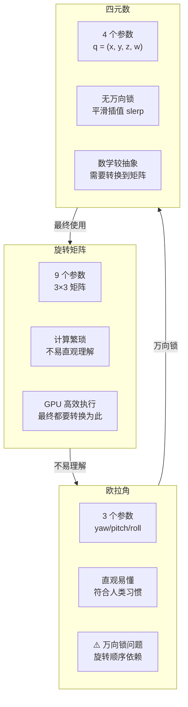

# 欧拉角与四元数

> 本篇涵盖第 22-23 章，从欧拉角/四元数理论到鼠标控制旋转的实践应用。

## 目录
- 第 22 章：更高级的旋转：欧拉角、四元数
- 第 23 章：四元数的应用：使用鼠标控制模型的旋转


---

## 第 22 章：更高级的旋转：欧拉角、四元数

在之前的`坐标系基本变换`章节中，我们学习了 3D 基本旋转的四个方法：绕 3 个坐标轴、绕任意轴的旋转，并讲述了推导过程。本节介绍另外两个旋转的表示方法：`欧拉角`与`四元数`。

任何一个概念的提出都有它自身的意义，新概念的诞生大多是为了解决一些问题，欧拉角与四元数也不例外。

### 三种旋转表示方式对比



| 对比维度 | 旋转矩阵 | 欧拉角 | 四元数 |
|----------|---------|--------|--------|
| 参数数量 | 9 (3×3) | 3 (yaw, pitch, roll) | 4 (x, y, z, w) |
| 直观性 | ❌ 不直观 | ✅ 最直观 | ⚠️ 较抽象 |
| 万向锁 | ✅ 无 | ❌ 有 | ✅ 无 |
| 插值能力 | ⚠️ 需转换 | ❌ 无法直接插值 | ✅ slerp 平滑插值 |
| 存储空间 | 最大 | 最小 | 中等 |
| GPU 计算 | ✅ 直接使用 | ❌ 需转换 | ⚠️ 需转换 |
| 适用场景 | 最终渲染 | UI 控制/调试 | 动画/物理引擎 |

### 欧拉角

我们看下前四种旋转的特点，前四种旋转可以归结为旋转矩阵。

- 首先，旋转矩阵是一个 3 X 3 矩阵，需要 9 个数字来表示一个旋转。
- 其次，旋转矩阵通过 3 个绕基本坐标轴的矩阵相乘得到，计算过程相对繁琐。
- 最后，物体旋转用矩阵来描述的话不易理解。为什么不易理解，是因为我们习惯于用角度来描述旋转状态，比如向左旋转多少度，绕着什么什么旋转多少度，这种说法很容易在脑子里想象出来。但如果我们看到一种旋转用如下方式来表示：


我想，这种反人类的`旋转表示方法`，人类是无法理解的，当然计算机是能读懂这种旋转的。

那么，如何表示才能让人很容易地理解旋转呢？于是欧拉角的表示方法诞生了。关于欧拉角的详细介绍，大家可以从[这里](https://link.juejin.cn?target=https%3A%2F%2Fen.wikipedia.org%2Fwiki%2FEuler_angles%20"https://en.wikipedia.org/wiki/Euler_angles")了解，本节不做具体描述。

欧拉角是飞控系统中用于描述飞行器姿态的方式，使用三个角度来表示，分别是yaw`偏航角`、pitch`俯仰角`、roll`滚转角`。

- yaw：偏航角，是指飞行器偏离原来航线的角度。
- pitch：俯仰角，是指飞行器机头抬起的角度。
- roll：滚转角，是指飞行器绕着自身头尾轴线翻滚的角度。


对比到笛卡尔坐标系，偏航角是绕着 Y 轴旋转的角度 α，俯仰角是绕着 X 轴旋转的角度 β，滚转角是绕着 Z 轴旋转的角度 γ。

> 欧拉角旋转时绕的轴系，既可以参照世界坐标系，也可以参照自身坐标系。本节所讲的内容都是参照自身坐标系。

可以看出，欧拉角很容易就能表示出一个旋转运动，而且用角度来描述旋转，容易被人理解。

)

#### 欧拉角旋转顺序

上面讲到，欧拉角是由三个角度构成，那么这三个角度的旋转顺序又是如何表示呢？

我们必须清楚，欧拉角的旋转顺序必须保证统一性。如果顺序不统一，同样的三个角度，旋转结果也会不一样。就好比我们平常走路，向左转α然后向右转β，向右转α然后向左转β，两种旋转最终表示的姿态也会不同。

我们常说的欧拉角严格意义上还可以细分为欧拉角`Euler-angles`和泰特布莱恩角`Tait-Bryan-angles`，这两种方法都利用了笛卡尔坐标系的三个坐标轴作为旋转轴，区别主要在于绕轴的旋转顺序。

##### 欧拉角

欧拉角的选取顺序有以下6种：

- XYX
- XZX
- YZY
- YXY
- ZXZ
- ZYZ

以 XYX 欧拉角为例，最开始物体的坐标系和世界坐标系保持一致，首先物体绕 X 轴旋转 α角度，此时物体的坐标系发生了变化，产生了新的坐标系E1，然后绕新坐标系E1的 Y 轴旋转 β角度，这时又产生了新的坐标系 E2， 接着绕 E2 的 X 轴旋转 γ 角度，此时即物体的最终姿态。

可以看到，这种顺序有一个共同点：第一个旋转轴和最后一个旋转轴在物体这个参照系下相同，可以理解为对称型欧拉角。

##### 泰特布莱恩角

泰特布莱恩角的选取顺序有如下 6 种：

- XYZ
- XZY
- ZXY
- ZYX
- YXZ
- YZX

可以看出，此种旋转顺序是非对称型的，我们前面所说的 yaw-pitch-roll 旋转就是采用的泰特布莱恩角。

#### 欧拉角的矩阵表示

欧拉角的定义有了，那么我们最终还是要将它推导成对应的旋转矩阵才能使用。

[这里](https://link.juejin.cn?target=https%3A%2F%2Fen.wikipedia.org%2Fwiki%2FEuler_angles%20"https://en.wikipedia.org/wiki/Euler_angles")有这几种顺序的最终推导公式，但接下来我还是要讲解一下这个公式是如何推导出来的。

前面说过了，顺序不同，所对应的旋转矩阵不同，旋转结果也不同。那么我们根据不同的顺序推导对应的旋转矩阵：

##### XYZ 顺序

在坐标系基本变换章节我们讲解了矩阵的基本旋转，那么，本节的欧拉旋转其实相当于矩阵绕基本坐标轴的复合旋转。
以 XYZ 顺序为例，XYZ 顺序的欧拉旋转可以表示如下：


看到这个表达式，我们首先要思考一个问题，上面这个表达式表示的是什么样的旋转呢？

请谨记，上面表示的旋转可以用以下两种方式理解：

- 参照自身坐标系，先绕X轴旋转，再绕 Y 轴旋转，最后绕 Z 轴旋转。
- 参照世界坐标系，先绕 Z 轴旋转，再绕 Y 轴旋转，最后绕 X 轴旋转。

这两种旋转顺序相反。下面的两个方法可以验证。

如何验证参照世界坐标系的旋转顺序？

- 首先改变 Z 轴旋转角度，直到旋转 90 度。
- 其次改变 Y 轴旋转角度，直到旋转 90 度。
- 最后改变 X 轴旋转角度，直到旋转 90 度。


我们发现，以世界坐标系为参照，旋转按照先 Z 、再 Y 、最后 X 轴的顺序依次进行。

如何验证参照自身坐标系的旋转顺序？

- 首先改变 X 轴旋转角度，直到旋转 90 度。
- 其次改变 Y 轴旋转角度，直到旋转 90 度。
- 最后改变 Z 轴旋转角度，直到旋转 90 度。


我们发现，以自身坐标系为参照，旋转按照先 X 、再 Y 、最后 Z 轴的顺序依次进行。

所以我们得出以下结论：一个复合变换矩阵，既可以理解为世界坐标系下的依次变换，也可以理解为模型坐标系下的依次变换，变换顺序相反。

##### 根据欧拉角推导旋转矩阵

接下来，我们按照 XYZ 的顺序推导旋转矩阵，如下所示：

![\begin{aligned}
R &= R_x(\alpha)R_y(\beta)R_z(\gamma) \\\
\\\
 &= \begin{pmatrix}
1 & 0 & 0 \\\
0 & cos\alpha & -sin\alpha \\\
0 & sin\alpha & cos\alpha 
\end{pmatrix}
 \begin{pmatrix}
cos\beta &0 & sin\beta \\\
0 & 1 & 0 \\\
-sin\beta & 0 & cos\beta 

\end{pmatrix} \begin{pmatrix}
cos\gamma & -sin\gamma & 0 \\\
sin\gamma & cos\gamma & 0 \\\
0 & 0 & 1
\end{pmatrix} \\\
\\\
&=
\begin{pmatrix}
cos\beta cos\gamma & -cos\beta sin\gamma & sin\beta \\\
sin\alpha sin\beta cos\gamma + cos\alpha sin\gamma & -sin\alpha sin\beta sin\gamma + cos\alpha cos\gamma & -sin\alpha cos\beta \\\
-cos\alpha cos\gamma sin\beta + sin\alpha sin\gamma & sin\alpha cos\gamma + cos\alpha sin\beta sin\gamma & cos\alpha cos\beta 
\end{pmatrix}
\end{aligned}](https://juejin.cn/equation?tex=%5Cbegin%7Baligned%7D%0AR%20%26%3D%20R_x(%5Calpha)R_y(%5Cbeta)R_z(%5Cgamma)%20%5C%5C%5C%0A%5C%5C%5C%0A%20%20%20%20%26%3D%20%5Cbegin%7Bpmatrix%7D%0A1%20%26%200%20%26%200%20%5C%5C%5C%0A0%20%26%20cos%5Calpha%20%20%26%20-sin%5Calpha%20%20%5C%5C%5C%0A0%20%26%20sin%5Calpha%20%26%20cos%5Calpha%20%0A%5Cend%7Bpmatrix%7D%0A%20%5Cbegin%7Bpmatrix%7D%0Acos%5Cbeta%20%260%20%26%20%20sin%5Cbeta%20%20%5C%5C%5C%0A0%20%26%201%20%26%200%20%5C%5C%5C%0A-sin%5Cbeta%20%26%200%20%26%20%20cos%5Cbeta%20%0A%0A%5Cend%7Bpmatrix%7D%20%20%5Cbegin%7Bpmatrix%7D%0Acos%5Cgamma%20%26%20-sin%5Cgamma%20%26%200%20%5C%5C%5C%0Asin%5Cgamma%20%26%20cos%5Cgamma%20%26%200%20%5C%5C%5C%0A0%20%26%200%20%26%201%0A%5Cend%7Bpmatrix%7D%20%5C%5C%5C%0A%5C%5C%5C%0A%26%3D%0A%5Cbegin%7Bpmatrix%7D%0Acos%5Cbeta%20cos%5Cgamma%20%26%20-cos%5Cbeta%20sin%5Cgamma%20%26%20sin%5Cbeta%20%5C%5C%5C%0Asin%5Calpha%20%20sin%5Cbeta%20cos%5Cgamma%20%2B%20cos%5Calpha%20sin%5Cgamma%20%26%20-sin%5Calpha%20sin%5Cbeta%20sin%5Cgamma%20%2B%20%20cos%5Calpha%20cos%5Cgamma%20%26%20-sin%5Calpha%20cos%5Cbeta%20%5C%5C%5C%0A-cos%5Calpha%20cos%5Cgamma%20sin%5Cbeta%20%2B%20sin%5Calpha%20sin%5Cgamma%20%26%20sin%5Calpha%20cos%5Cgamma%20%2B%20cos%5Calpha%20%20%20sin%5Cbeta%20sin%5Cgamma%20%26%20cos%5Calpha%20cos%5Cbeta%20%0A%5Cend%7Bpmatrix%7D%0A%5Cend%7Baligned%7D)

有了推导公式，我们就可以很容易编写JavaScript 算法了：

```
function makeRotationFromEuler(euler, target){
 target = target || new Float32Array(16);
 
 var x = euler.x, y = euler.y, z = euler.z;
 var cx = Math.cos(x), sx = Math.sin(x),
 cy = Math.cos(y), sy = Math.sin(y),
 cz = Math.cos(z), sz = Math.sin(z);
 var sxsz = sx * sz;
 var cxcz = cx * cz;
 var cxsz = cx * sz;
 var sxcz = sx * cz;
 target[0] = cy * cz;
 target[1] = sxcz * sy + cxsz;
 target[2] = sxsz - cxcz * sy;
 target[3] = 0;
 
 target[4] = -cy * sz;
 target[5] = cxcz - sxsz * sy;
 target[6] = sxcz + cxsz * sy;
 target[7] = 0;
 
 target[8] = sy;
 target[9] = -sx * cy;
 target[10] = cx * cy;
 target[11] = 0;
 
 target[12] = 0;
 target[13] = 0;
 target[14] = 0;
 target[15] = 1;
 
 return target;
}
```

##### 其它顺序推导

其它顺序的推导公式和 XYZ 类似，大家只需要按照矩阵相乘顺序推导即可，比如：

- XZY 顺序的推导公式：


- YXZ 顺序的推导公式：


- YZX 顺序的推导公式：


- ZXY 顺序的推导公式：


- ZYX 顺序的推导公式：


不同顺序的欧拉角算法实现可以参考原课程配套源码。

有了欧拉角生成旋转矩阵的算法之后，我们就可以按照任意顺序进行旋转了。但请注意，在一个应用中尽量要统一旋转顺序，否则物体的旋转姿态将不是我们期望的。

##### 实战演练

上面推导出的算法使用起来相当简单，只需传入一个能够表示欧拉角的对象即可：

> 一个欧拉角对象包含x、y、z 三个属性，分别表示绕 X 轴、Y 轴、Z 轴旋转的角度，以及一个表示欧拉旋转的顺序 order。

```
var rotateMatrix = matrix.getMatrixFromEuler({
 x: deg2radians(uniforms.xRotation),
 y: deg2radians(uniforms.yRotation),
 z: deg2radians(uniforms.zRotation),
 order:'XYZ'
});
```

#### 欧拉角的缺点

尽管欧拉角易于理解，但它还是有一些缺点的：

- 计算过程涉及到大量三角函数计算，运算量大，这点在推导公式的过程中显而易见。
- 给定方位的欧拉角不唯一，有多个，这会对旋转动画的插值造成困难。同样一个姿态可以由好多个欧拉角来表示，即多对一的关系，那么在插值过程中就可能会引起姿态突变，产生抖动效果。
- 万向节死锁，这个现象会在第二个旋转轴旋转了90 度时产生，当第二个旋转轴旋转 90 度时，会导致第三个旋转轴和第一个旋转轴重合，此时如果继续绕第三个旋转轴，相当于在第一个旋转轴上旋转。所谓死锁并不是旋转不了了，而是少了一个自由度。

##### 万向节死锁

我们看一下万向节死锁的表现：

首先绕 X 轴旋转30度。


接着绕 Y 轴旋转90 度。


绕 Y 轴旋转 90 度后，此时自身坐标系的 Z 轴和最开始的 X 轴重合，触发了万向节死锁，那么它会产生什么后果呢？

我们绕 Z 轴做的旋转，等价于在最开始的 X 轴上旋转。那还要 Z 轴有什么用呢？是的，Z 轴的旋转已经没用了，此时我们无论怎么绕物体自身的 Z 轴旋转，都只能在原先 X 轴和 Y 轴上进行旋转，失去了原先 Z 轴方向上的的自由度。

上面的例子最终的旋转角度是(x: 30, y: 90, z: 50)。


接下来，我们把 Z 轴的旋转角度放到 X 轴上，不再绕 Z 轴旋转了，此时的欧拉角（x：80， y：90，z：0）。


可以看出，欧拉角（x: 80, y: 90, z: 0）和(x: 30, y: 90, z: 50) 表示的旋转一模一样。也就是说，多个欧拉角会对应一个旋转。这在做旋转动画时会导致旋转动画不准确的问题。

##### 欧拉角缺陷演示

有句话说得好，当你没有碰到过使用欧拉角进行旋转所产生的缺陷时，你永远无法理解它的缺点，接下来我通过两个例子来演示一下：

###### 大圆弧与小圆弧

我们知道 (0, 0, 330)和(0, 0, -30)所表示的方位一样，如果把物体从(0, 0, 0)旋转到（0，0，330）所代表的方位，我们期望的旋转动画应该是这样的：


但是实际上，欧拉角旋转路径却是这样的：


欧拉角的这个特点会导致插值动画产生抖动、跳跃的副作用。

###### 动画路径怪异

除了上述大小圆弧产生的路径不正确以外，欧拉角的旋转路径有时很怪异，比如下面这个动画过程。

准备一个球体，球体初始状态处于万向节死锁状态，如下：

```
 xRotation: 0,
 yRotation: -90,
 zRotation: 0,
```

接下来我们让球体转动到如下状态：

```
 xRotation: 0,
 yRotation: -90,
 zRotation: 0,
```

我们看一下球体的旋转路径是怎样的：


- 白色轨迹是采用欧拉角旋转时的运动路线。
- 红色轨迹是我们正常的旋转路线。

可见，欧拉角有时会让我们的旋转绕个弯，产生比较怪异的动画效果，万向节死锁还是那么讨厌。

###### 连续旋转

万向节死锁除了会产生上面的问题以外，还会导致在做连续增量旋转时姿态不准确的问题，这个问题在一些跟踪系统中导致的后果是跟丢目标。

举个例子，假设现在我们的飞行器先绕自身 X 轴（此时 X 轴和世界坐标系的 X 轴重合）旋转47 度，接着绕 Y 轴旋转 41 度，最后绕 Z 轴旋转 55 度。

```
var rotateMatrix = matrix.getMatrixFromEuler({
 x: deg2radians(47),
 y: deg2radians(41),
 z: deg2radians(55),
 order:'XYZ'
});
```

接着我们再绕飞行器自身坐标系的 X 轴旋转 8 度。

```
var rotateMoreMatrix = matrix.getMatrixFromEuler({
 x: deg2radians(8),
 y: deg2radians(0),
 z: deg2radians(0),
 order:'XYZ'
});
```

经过两次连续旋转之后，物体姿态如下图：


那么，如果我们不分为两次旋转，而是采用一次旋转，那么物体的旋转姿态有什么不同呢？看一下一次旋转的效果：

```
var rotateMatrix = matrix.getMatrixFromEuler({
 x: deg2radians(55),
 y: deg2radians(41),
 z: deg2radians(55),
 order:'XYZ'
});
```


可以看出，虽然有一些差异，但是大体上是一致的。

接下来我们逐渐改变 Y 轴的旋转角度，当 Y 轴旋转角度为 90 度时，我们再用上面的方法比较一下插值和不插值旋转的区别：

插值旋转：

```
var rotateMatrix = matrix.getMatrixFromEuler({
 x: deg2radians(47),
 y: deg2radians(90),
 z: deg2radians(55),
 order:'XYZ'
});

var rotateMoreMatrix = matrix.getMatrixFromEuler({
 x: deg2radians(8),
 y: deg2radians(0),
 z: deg2radians(0),
 order:'XYZ'
});
```


那么我们看下一次性旋转后的方位：

```
var rotateMatrix = matrix.getMatrixFromEuler({
 x: deg2radians(55),
 y: deg2radians(90),
 z: deg2radians(55),
 order:'XYZ'
});
```


这次能够很明显的感觉出插值前和插值后的区别了，结论是当第二个旋转轴越靠近 90 度，经过插值后的旋转姿态与一次旋转后的姿态产生的偏差越大。

##### 结论

实际上欧拉角足以应对大部分场景，虽然它有一些缺点。我们可以做出一些限制来避免它们，比如我们可以将第二个旋转轴的旋转角度限制在 -90 到 +90 之间。但尽管如此，我们仍然无法规避死锁的产生，所以我们急需一种能够避免死锁的旋转方法，也就是接下来要出场的四元数。

### 四元数

还记得我们在基本变换里推导出的绕任意轴进行旋转的算法吗？但是通过轴角方式的旋转插值不是很直观，四元数的引入是对轴角旋转的升级，它能够完美地避免欧拉角的缺陷，并且能够很容易地对旋转进行插值，使物体旋转更自然，更平滑。

#### 四元数基础

四元数，顾名思义，是由四个数字组成，包含一个实数和三个复数，可以表示为：

)

或者


并且有以下特点：


四元数还可以理解为一个实数 w 和一个向量 )

)

#### 基本运算

##### 加法/减法运算

四元数的加减是将对应位置的元素相加或者相减，得到新的四元数。

%20%2B%20(w_1%2C%20x_1i%2C%20y_1j%2Cz_1k)%20%20%5C%5C%5C%0A%26%3D(w_0%20%2B%20w_1%2C%20(x_0%20%2B%20x_1)i%2C%20(y_0%20%2B%20y_1)j%2C(z_0%2Bz_1)k)%0A%5Cend%7Baligned%7D)
%20-%20(w_1%2B%20x_1i%2B%20y_1j%2Bz_1k)%20%20%5C%5C%5C%0A%26%3Dw_0%20-%20w_1%20%2B%20(x_0%20-%20x_1)i%2B(y_0%20-%20y_1)j%2B(z_0-z_1)k%0A%5Cend%7Baligned%7D)

##### 乘法运算

%20%5C%5C%5C%0A%2B%20%20(w0*x1%2Bx0*w1%2By0*z1-z0*y1)i%20%5C%5C%5C%0A%2B%20%20(y0*w1%2Bw0*y1%2Bz0*x1-x0*z1)j%20%5C%5C%5C%0A%2B%20%20(w0*z1%2Bz0*w1%2Bx0*y1-y0*x1)k%0A%5Cend%7Baligned%7D)

##### 四元数的模


##### 四元数的共轭

%5E*%20%5C%5C%5C%0A%26%3D(w-xi-yj-zk)%0A%5Cend%7Baligned%7D)

##### 四元数的倒数


##### 四元数的性质

共轭与倒数的性质：

%5E%7B-1%7D%20%3D%20q_1%5E%7B-1%7Dq_0%5E%7B-1%7D)

%5E%7B*%7D%20%3D%20q_1%5E%7B*%7Dq_0%5E%7B*%7D)

加法乘法满足结合律和分配律

)
)

%20%3D%20q_0q_1%2B%20q_0q_2)

以上是四元数的运算法则和运算性质，我们对它们进行基本封装。

#### 如何用四元数表示旋转？

四元数的旋转原理如下：
先将原向量表示为四元数) ，将旋转角度和旋转轴的信息用`单位四元数 q` 表示，下面是一个代表旋转的四元数：


> 其中旋转轴  必须是单位向量。

该四元数表示绕轴  旋转 2 \* θ 角度，注意是 θ 角的2倍哦。

旋转后得到的向量坐标利用公式  或 计算得出。

#### 多个四元数旋转

一个四元数代表一个旋转过程，那么多个四元数代表多个旋转过程。

假设有一个旋转 M 用四元数表示为 Q1，另一个旋转 N 用四元数表示为 Q2。

那么如果我们按顺序实现这两个旋转，先进行 M 旋转，再执行 N 旋转，我们有两种方式：

- 将 Q2 和 Q1 相乘，然后将乘积转化为旋转矩阵。
  - 注意顺序：Q2 \* Q1。
- 将 Q2 和 Q1 分别转换成旋转矩阵，再将旋转矩阵相乘。
  - 注意顺序：N \* M

注意：在计算四元数乘积或者旋转矩阵乘积时，一定要注意顺序，先进行的旋转矩阵或者旋转四元数要放在乘号右侧。

这两种方式所表达的旋转是一致的，但是显然，第一种方式计算量更小一些。

#### 利用四元数实现旋转

我们至少需要以下三个方法才能对物体进行旋转：

- 通过如下三种方式构造出四元数。
  - setFromEuler，将一组欧拉角转化成四元数。
  - setFromAxis，将轴角转化成四元数。
  - setFromRotationMatrix，将旋转矩阵转化成四元数。
- 已知初始状态四元数和结束状态四元数，构造某一阶段的四元数。
  - `slerp`。
- 根据四元数计算出该四元数所代表的旋转矩阵。
  - `makeRotationFromQuaternion`

公式的推导比较复杂，这里就不讲述推导过程了，感兴趣的同学可以自己动动手试着推导一下。同时，`THREEJS` 已经为我们封装了关于四元数的函数，在这里我们掌握它提供的一些方法就能覆盖大部分应用场景。

除了上面的一些方法，THREEJS 还做了一些转换方法：

- 将四元数转换成对应欧拉角。
- 将四元数转换成对应轴向量。
- 将四元数转换成绕轴向量旋转的角度。
- 从当前四元数旋转到另一个四元数所经过的角度。

利用这些方法，很容易地将易于理解的欧拉旋转或者轴角旋转，转换成易于线性插值的四元数。

#### 四元数的用法

看一下如何使用四元数进行插值，我们将物体从欧拉角（30，40，50）代表的方向旋转到（70，90，120）。

首先，我们将起始时刻和结束时刻的欧拉角转化为对应的四元数：

```
var startQuaternion = matrix.setFromEuler({
 _x: deg2radians(30),
 _y: deg2radians(40),
 _z: deg2radians(50)
});

var endQuaternion = matrix.setFromEuler({
 _x: deg2radians(70),
 _y: deg2radians(90),
 _z: deg2radians(120)
});
```

有了起始四元数和结束四元数，我们就可以利用`球面插值算法slerp`来求旋转矩阵了。假设我们本次旋转过程设置为 30 帧，那么由初始角度到当前帧所代表角度的旋转用四元数表示如下：

```
var currentQuaternion = matrix.slerp(startQuaternion, endQuaternion, progress / 30);
```

那么当前方位的旋转矩阵通过以下方法求得：

```
var currentMatrix = matrix.makeRotationFromQuaternion(currentQuaternion);
```

有了初始角度到每一帧角度的旋转矩阵 U ，那么左乘该旋转矩阵 U 可以实现平滑均匀的旋转动画了，如下：


> 如果让欧拉角来做 30 次连续插值旋转，最终的动画路径和旋转方向可能会不准确。

四元数在平滑插值上表现出了极大的优势，如果我们想做插值动画，那么四元数无疑是最佳选择。

#### 总结

四元数相比欧拉角的优势还是很大的：

- 计算量相对小一些。
- 能够更平滑地插值。

但是四元数也有一定缺点：

- 概念复杂，不易理解。

### 回顾

本节介绍了表示旋转的两种很重要的方法：欧拉角与四元数，并分析了它们的优缺点。在实际编程中，四元数的使用场景比较多，动画中的旋转往往需要平滑线性，这种情况我们采用四元数是最佳选择。

下一节，我们结合学过的算法，学习利用鼠标控制模型旋转的原理。

---

## 第 23 章：四元数的应用：使用鼠标控制模型的旋转

前面章节我们学习了控制模型旋转的各种算法，所展示的效果都是通过程序设定的，实际上，我们往往需要人为的通过鼠标、触摸等方式实现对模型的旋转、位移等变换的控制。本节利用前面的知识实现用鼠标或者触摸的方式对模型进行控制。

### 原理分析

利用鼠标控制模型旋转的本质是求出鼠标在按下后并进行移动的轨迹，如何对应到 3D 空间中的旋转矩阵。

#### 鼠标滑动

通常情况下，我们会在鼠标按下后，捕捉起始位置P0，由于屏幕是 2D 的，所以我们只能捕捉到屏幕的 X、Y 轴的坐标信息，所以我们的 `P0` 一般是这样的：

```
var start = {x: 30, y: 50};
```

当鼠标滑动或者触摸 move 时，我们能够监听到鼠标或者触摸点在屏幕的当前坐标：

```
var current = {x: 300, y: 200};
```

我们拿到了鼠标滑动的轨迹坐标，那么这两个坐标值能不能和模型的旋转进行对应呢？如果可以对应，这中间的对应模型该如何建立呢？

我们从实际场景分析一下：

- 当鼠标向右或者向左做水平滑动时，我们期望的是能够让模型向右或者向左旋转，也就是绕 Y 轴旋转。
- 当鼠标向上或者向下做垂直滑动时，我们期望的是能够让模型向上或者向下旋转，也就是绕 X 轴旋转。
- 当鼠标做上述两种滑动时，滑动的距离与旋转的角度成正比，即距离越大，角度越大。

上面是三个很重要的建模依据。

#### 滑动距离与旋转的映射关系

通过之前章节的学习，我们知道旋转的表示有如下三种：

- 欧拉角。
- 四元数。
- 轴角。

那么，按照上面的建模思路，能够直观的表示角度的只有欧拉角和轴角。

#### 欧拉角旋转

我们先使用最直观的欧拉角来看下如何将鼠标的移动关联到模型的旋转。

很容易想到的策略是：

- 鼠标沿着 X 轴移动一像素时，绕 Y 轴旋转 1 度。
- 鼠标沿着 Y 轴移动一像素时，绕 X 轴旋转 1 度。

按照这个策略实现一下，看看是否符合我们的期望。

首先定义一个旋转矩阵`currentMatrix`，用于保存模型渲染时采用的变换矩阵。
接着定义一个临时矩阵`tempMatrix`，用于保存鼠标滑动时的临时矩阵。
最后定义一个最近一次的变换矩阵`lastMatrix`，用于保存上一次的变换。

```
var currentMatrix = matrix.identity();
var tempMatrix = matrix.identity();
var lastMatrix = matrix.identity();
```

其次，我们需要监听鼠标或者触摸屏的坐标。

```
// 判断是否支持触摸事件。
var supportTouchEvent = 'ontouchstart' in window;
var dragStartEvent = supportTouchEvent? 'touchstart': 'mousedown';
var dragMoveEvent = supportTouchEvent? 'touchmove': 'mousemove';
var dragEndEvent = supportTouchEvent? 'touchend': 'mouseup';

var startX = 0, startY = 0, currentX = 0, currentY = 0;

//绑定拖拽开始事件
document.body.addEventListener(dragStartEvent, function dragStart(e){
 e = supportTouchEvent ? e.changedTouches[0] : e;
 startX = e.clientX;
 startY = e.clientY;
});
// 绑定拖拽事件
document.body.addEventListener(dragMoveEvent, function dragMove(e){
 e = supportTouchEvent ? e.changedTouches[0] : e;
 currentX = e.clientX;
 currentY = e.clientY;
 rotate();
});

// 绑定拖拽结束事件
document.body.addEventListener(dragEndEvent, function dragEnd(e){
 matrix.clone(currentMatrix, lastMatrix);
});
```

在拖拽结束事件中，我们将currentMatrix 矩阵拷贝给 lastMatrix。

你还会发现在拖拽事件中，我们执行了一个函数 `rotate`，这个函数的作用是根据起始坐标与当前坐标，算出旋转矩阵，我们看下如何实现这个函数。

```
var euler = {x:0, y:0, z:0};
var radian = Math.PI / 180;
function rotate(){
 var dx = currentX - startX;
 var dy = currentY - startY;
 
 euler.x = dy * radian;
 euler.y = dx * radian;
 
 // 本次拖拽的临时矩阵
 tempMatrix = matrix.getMatrixFromEuler(euler, tempMatrix);
 // 最近一次变换矩阵与临时矩阵的乘积，得出最终渲染矩阵。
 currentMatrix = matrix.multiply(tempMatrix, lastMatrix);
 
 render();
}
```

看下效果吧：


可能你会觉得旋转的灵敏度太大了，那我们可以定义一个系数，用来设置鼠标移动距离与旋转角度的比例。

```
var rate = 0.6;
euler.x = rate * dy * radian;
euler.y = rate * dx * radian;
```

大家可以根据自己的需要调整这个系数，直到符合自己的直觉为止。

看到这里，你会不会觉得太简单了。是的，当你掌握了之前章节的内容之后，写这个交互确实是很简单，无非就是和矩阵打交道。

接下来，我们看一下如何利用轴角的方式实现鼠标移动距离和旋转角度之间的映射关系。

#### 轴角

轴角轴角，肯定要有一个旋转轴，外加旋转角度。我们就是要根据在 X 轴和 Y 轴的移动距离，找出对应的旋转轴和旋转角度。

我们分别看下鼠标运动时的旋转轴。

- 沿着 X 轴移动时。

下图中  为鼠标移动轨迹， 是对应的旋转轴，很容易看出旋转轴和移动轨迹垂直，为 Y 轴上的单位向量。


- 沿着 Y 轴移动时，旋转轴为 X 轴方向的单位向量。


- 沿着 X 轴和 Y 轴移动时。


当同时沿着 X 轴和 Y 轴移动时，轴向量和运动轨迹垂直，如上图 ，通过分解，我们可以求出旋转轴向量。

- X 轴分量为：


- Y 轴分量为：


- Z 轴分量为0：


其中为鼠标移动的距离。

既然有了轴向量，我们还需要绕轴向量旋转的角度θ。旋转角度的选取也是一个经验值，在此我们以的长度作为旋转的角度，大家可以根据自己的感觉适当调整。

有了轴向量和旋转角度，记下来就可以计算旋转矩阵了：

```
var l = Math.sqrt(dx * dx + dy * dy);
if(l <= 0)return;
// 旋转轴与移动轨迹垂直：水平移动（dx）对应 Y 轴分量，垂直移动（dy）对应 X 轴分量
var x = dy / l, y = dx / l;
var axis = {x:x, y:y, z:0};
tempMatrix = matrix.axisRotation(axis, l);
currentMatrix = matrix.multiply(tempMatrix, lastMatrix, currentMatrix);
render();
```

我们看下效果：


可见，利用轴角和欧拉角都能够实现利用鼠标控制模型的旋转。

那么，观察上面这个轴角计算方式，你会发现，我们在计算 tempMatrix 和 currentMatrix 的时候，计算量比较多，能不能优化一下呢？

嗯，我们可以采用四元数，利用四元数相乘来取代矩阵相乘，毕竟四元数的乘法运算量比矩阵乘法运算量要小。

#### 四元数

通过前面章节的学习，我们知道四元数可以由轴角转化而成，利用下面的公式：

![\begin{aligned}
q &= |q|[cos\theta, \vec{n}\cdot sin\theta] 
\end{aligned}](https://juejin.cn/equation?tex=%5Cbegin%7Baligned%7D%0Aq%20%26%3D%20%7Cq%7C%5Bcos%5Ctheta%2C%20%5Cvec%7Bn%7D%5Ccdot%20sin%5Ctheta%5D%20%0A%5Cend%7Baligned%7D)

其中  为轴向量，为旋转角度的一半。

根据这个公式，我们可以很方便的将轴角转化为四元数。

```
function fromAxisAndAngle(axis, angle, target){
 let halfAngle = angle / 2,
 s = Math.sin(halfAngle);
 target = target || {};
 target.x = axis.x * s;
 target.y = axis.y * s;
 target.z = axis.z * s;
 target.w = Math.cos(halfAngle);

 return target;
}
```

有了轴角转化为四元数的方法，改造一下 rotate 方法。

```
var currentQ = {x:0, y:0, z:0, w:1};
var lastQ = {x:0, y:0, z:0, w:1};
var l = Math.sqrt(dx * dx + dy * dy);
if(l <= 0)return;
var x = dy / l, y = dx / l;
var axis = {x:x, y:y, z:0};
var q = matrix.fromAxisAndAngle(axis, l);
currentQ = matrix.multiplyQuaternions(q, lastQ);
currentMatrix = matrix.makeRotationFromQuaternion(currentQ);
render();
```

当然拖拽结束事件我们也要修改一下，我们将不再保存上一次的旋转矩阵 lastMatrix，而是保存上一次的旋转四元数 lastQ。

```
// 绑定拖拽结束事件
document.body.addEventListener(dragEndEvent, function dragEnd(e){
 Object.assign(lastQ, currentQ);
});
```

改造完毕，旋转控制效果和欧拉角与轴角一致，但是计算量和存储量少了很多。

### 回顾

本节学习了利用欧拉角、四元数、轴角对模型进行控制的原理，学完之后，你会发现只要考虑好映射模型，其余的就很简单了，无非就是对四元数或者矩阵的操作。

接下来，我们先搁置 WebGL 的学习，探讨 CSS 中的 3D 属性以及如何将数学算法应用到 CSS 的 3D 属性中。

