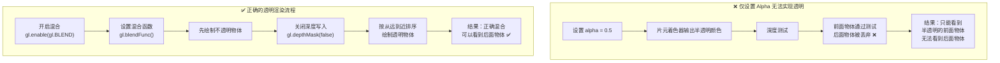

# 混合与帧缓冲

到现在为止，我们还没有接触过如何为模型增加透明度效果，大家也许会说，在模型的顶点缓冲信息中，改变颜色的 `alpha` 值不就是增加透明度了吗？没错，透明度信息是这么传入着色器中的，但是仅仅有透明度信息，并不能实现透过前面透明物体看到后面物体的效果，我们只能改变前面物体的颜色，后面的物体在深度检测阶段会检测失败，相应的片段就会被抛弃，不被渲染。

## 透明渲染的核心困境



> **[核心原理]** 透明渲染的本质是**颜色混合**——将新片元（源颜色）与帧缓冲中已有片元（目标颜色）按照混合方程组合。而深度测试只决定"谁遮挡谁"，无法实现"两者融合"。

## 片元舍弃

片元是像素的前置阶段，片元在成为屏幕像素之前要经历一些检测过程，如果检测失败的话 GPU 会舍弃该片元，从而不被渲染。也就是说片元要么显示，要么不显示，不存在片元混合的现象。比如前后两个物体，处于后面的物体，由于被前面物体遮挡，深度测试就会失败，GPU 便会舍弃该片元不再进行渲染。

### 深度检测

下面这个例子：

```
let face1 = createFace(2, 3, 1, [255, 0, 0, 125]);
let face2 = createFace(3, 2, 0, [0, 255, 0, 255]);
```

创建了两个矩形，`face1` 为世界空间下深度值为 1 的半透明红色矩形，`face2` 为世界空间下深度值为 0 的不透明绿色矩形，此时 face1 在face2 的前面。当开启深度检测的时候，`face1` 会遮挡住 `face2`，大家猜猜看能不能透过红色矩形看到后面的绿色矩形？

下图是显示结果：


事实上，由于深度检测，尽管 face1 的颜色信息包含半透明，但是 GPU 检测到 face2 的片元在 face1 的后面，基于深度检测机制，GPU 舍弃了 face2 的片元，使得我们只能看到红色的face1。

### 主动舍弃片元

舍弃片元的时机除了深度测试不通过以外，我们还可以用编程的手段来主动舍弃。
这涉及到一个着色器命令`discard`。

下面这段代码演示了舍弃片元操作：

```
varying vec4 v_Color;
uniform bool u_Discard;
void main(){
 if(v_Color.r < 0.8){
 if(u_Discard)
 discard;
 }
 gl_FragColor = v_Color;
}
```

当我们启用 discard 命令时候，片元着色器就会判断当前片元颜色的 r 分量是否小于 0.8 ，小于 0.8 的话，就将该片元舍弃不再渲染。


那么，如何实现真正的透明效果呢？这就是本节要讲的混合`Blending`技巧，混合的实质就是将前后多个重叠模型的颜色混合成一种新的颜色，该颜色包含前后多个模型的颜色信息。换句话说，这种技术能够实现透过透明物体（也可以是其他有透明度的物体）看到后面的物体效果。

## 透明度

我们知道，透明度是一个从 0 到 1 之间的浮点数，0 代表全透明，1 代表不透明，介于 0 和 1 之间的数值代表半透明。

全透明的特点是能够让后面物体的颜色完全体现出来，半透明效果体现的颜色则是透明物体和后面物体颜色的混合颜色，比如当透明度为 0.5 时，显示的颜色由自身颜色的一半和后面物体颜色的一半混合而成，不透明则是完全不显示后面物体的颜色成分。

## 如何实现混合

那么，如何实现颜色的混合呢？

首先我们需要开启混合特效。

```
gl.enable(gl.BLEND);
```

接下来我们需要告诉 GPU 如何混合两种颜色。

下面是 WebGL 混合两种颜色的方式之一：


> 此处我们以相加的方式来混合两种颜色，事实上，WebGL 可以设置运算方式，不一定是相加，也可以是相减、取两者中较大值、取两者中较小值、以及一些逻辑运算等。

思考如下一个场景，有一个绿色物体，在它前面放一个透明度为 0.6 的红色玻璃，那么透过红色玻璃看到绿色物体的颜色是什么呢？我们找出公式中四个参数：

- ：源颜色，代表将要绘制的RGBA 颜色信息，用向量（Rs, Gs, Bs, As） 来表示，此处即红色玻璃的颜色RGBA（1， 0，0 ，0.6）。
- ：源因子，代表将要绘制的颜色的透明度，用向量（Sr, Sg, Sb, Sa）来表示，此处代表红色玻璃使用的透明度因子，我们可以采用玻璃自身的透明度，也可以重新设置。
- ：目标颜色的颜色信息，用向量（Rd, Gd, Bd, Ad）来表示，此处代表绿色物体的RGBA颜色。
- ：目标（绿色物体）颜色的透明度因子，用向量（Dr, Dg, Db, Da）来表示。通常我们用 1 减去源颜色（即玻璃）的透明度因子作为目标颜色的透明度因子，即(1- Sr, 1- Sg, 1- Sb, 1- Sa)。

需要记住的是，这四个参数都是 4 维向量，分别代表 RGBA 对应位置的信息。

#### 因子设置

那么，源颜色和目标颜色是已知的，我们只需要设置好源因子和目标因子就可以了，WebGL 为我们内置了一些因子：

| 参数 | 值 |
| --- | --- |
| gl.ZERO | (0,0,0,0) |
| gl.ONE | (1,1,1,1) |
| gl.SRC\_COLOR | (Rs, Gs, Bs, As) |
| gl.DST\_COLOR | (Rd, Gd, Bd, Ad) |
| gl.ONE\_MINUS\_SRC\_COLOR | (1- Rs, 1- Gs, 1- Bs, 1- As) |
| gl.ONE\_MINUS\_DST\_COLOR | (1- Rd, 1- Gd, 1- Bd, 1- Ad) |
| gl.SRC\_ALPHA | (As, As, As, As) |
| gl.DST\_ALPHA | (Ad,Ad, Ad, Ad) |
| gl.ONE\_MINUS\_SRC\_ALPHA | (1-As, 1- As, 1- As, 1- As) |
| gl.ONE\_MINUS\_DST\_ALPHA | （1-Ad, 1- Ad, 1- Ad, 1- Ad） |
| gl.CONSTANT\_COLOR | 常量颜色的RGBA值 |
| gl.ONE\_MINUS\_CONSTANT\_COLOR | 1 减去常量颜色的 RGBA值 |
| gl.CONSTANT\_ALPHA | 常量透明度 |
| gl.ONE\_MINUS\_CONSTANT\_ALPHA | 1减去常量透明度 |

以上就是内置的因子系数，这些系数都是包含 4 个分量的向量。

> 请一定要分清源颜色和目标颜色：
>
> - 源颜色：将要绘制的颜色，通常指将要绘制的拥有透明度物体的颜色。
> - 目标颜色：已经绘制的颜色，通常指被透明度物体盖住的后面物体的颜色。

有了这四个参数，GPU 就会按照如下公式替我们计算像素的最终颜色了：

%20*%20(0.6%2C%200.6%2C%200.6%2C%200.6)%5C%5C%5C%20%5C%5C%5C%20%20%26%2B%20(0%2C1%2C0%2C%201)%20*%20(0.4%2C0.4%2C0.4%2C0.4)%20%5C%5C%5C%0A%5C%5C%5C%0A%26%3D(0.6%2C%20%200.4%2C%20%200%2C%200.76)%0A%5Cend%7Baligned%7D)
> 源颜色因子和目标颜色因子也都是 4 维向量，也就是(0.6, 0.6, 0.6, 0.6)和(0.4, 0.4, 0.4，0.4）

上面我们是将源颜色和目标颜色的RGBA 信息乘以一个固定的向量因子，事实上，WebGL 允许我们单独为 RGB 和 Alpha 设置对应的因子，使用 `gl.blendFuncSeparate`函数可完成该功能。

```
gl.blendFuncSeparate(src_rgb_factor, des_rgb_factor, src_alpha_factor, des_alpha_factor)
```

其中：

- src\_rgb\_factor: 代表源颜色的 RGB 因子。
- des\_rgb\_factor: 代表目标颜色的RGB 因子。
- src\_alpha\_factor：代表源颜色的透明度部分的因子。
- des\_alpha\_factor：代表目标颜色的透明度部分的因子。

假设我们需要将源颜色的 RGB 因子设置为源颜色的透明度，源颜色的透明度因子采用自身的透明度，目标颜色的 RGB 因子设置为 1，目标颜色的透明度因子设置为 0，那么我们可以这样设置：

```
gl.blendFuncSeparate(gl.SRC_ALPHA, gl.ONE_MINUS_SRC_ALPHA, gl.ONE, gl.ZERO);
```

#### 混合公式设置

上面我们以源颜色和混合颜色的加法公式来计算，WebGL 还提供了减法、逻辑运算等方式来计算最终颜色。使用gl.blendEquation来指定运算规则，规则有以下几种：

- gl.FUNC\_ADD：相加。
  - 源颜色 \* 源因子 + 目标颜色 \* 目标因子
- gl.FUNC\_SUBTRACT：相减。
  - 源颜色 \* 源因子 - 目标颜色 \* 目标因子
- gl.FUNC\_REVERSE\_SUBTRACT：反减。
  - 目标颜色 - 源颜色。

## 混合实战

以上就是混合的理论，比较简单，主要是针对颜色和透明度的设置，接下来，我们就要进入实战阶段了。

### 混合前的注意事项

在写代码之前，我们再回顾一下深度测试的概念。

深度测试是这样的，GPU 绘制一个像素点的时候，会先检测当前位置是否存在片元，如果存在片元，则比较即将绘制的片元与已经存在的片元之间的 Z 值深度，距离屏幕远的片元会被舍弃，保留距离近的片元，同时将深度缓存值更新为最近保留的片元深度，如此循环测试，最终保留离屏幕最近的片元，完成遮挡效果。

在混合之前，我们需要考虑这个问题。因为场景中透明物体和不透明物体的顺序是不确定的，那如何绘制才能保证正确的混合和正确的遮挡呢？

记住下面这两个准则：

- 透明物体在不透明物体前面时，混合颜色。
- 透明物体在不透明物体后面时，不混合颜色，采用深度检测遮挡。

对应的策略是：

- 将透明物体和不透明物体区分开。
- 首先开启深度更新功能`gl.depthMask(true)`，关闭混合功能`gl.disable(gl.BLEND)`。绘制所有不透明物体，绘制完后，深度缓存里保留的是离屏幕最近的物体的深度信息。
- 对透明物体由远及近进行排序。
- 开启混合功能，关闭深度更新功能，按照顺序对透明物体绘制。

### 绘制两个物体

准备两个物体，第一个物体是一个红色玻璃，透明度为 0.5，第二个物体是一个不透明的绿色箱子，红色玻璃在前，绿色箱子在后面。

```
//开启混合功能
gl.enable(gl.BLEND);
let face1 = createFace(2, 3, 1, [255，0, 0, 125]);
let face2 = createFace(3, 2, 0, [0, 255, 0, 255]);
```

源透明因子采用源目标的透明度，目标透明因子用 1减去源透明因子。

```
gl.blendFunc(gl.SRC_ALPHA, gl.ONE_MINUS_SRC_ALPHA);
```

#### 混合相加

设置成混合相加，这也是默认的混合方式：

```
gl.blendEquation(gl.FUNC_ADD);
```

效果如下：


#### 混合相减

```
gl.blendEquation(gl.FUNC_SUBTRACT);
```

效果如下：


可以看到，中间相交部分的颜色变成了黑色，大家用上面的公式算一下就会理解。

%0A%5C%5C%5C%0A%26%20%3D%20(0.5%2C%20-0.5%2C%200%2C%20-0.25)%20%5C%5C%5C%0A%26%20%3D%20(0.5%2C%200%2C%200%2C%200)%0A%5Cend%7Baligned%7D)

透明度是 0 ，所以显示黑色。

#### 混合反减

```
gl.blendEquation(gl.FUNC_REVERSE_SUBTRACT);
```


红色相间部分为半透明绿色，验证步骤如下：

%0A%5C%5C%5C%0A%26%20%3D%20(-0.5%2C%200.5%2C%200%2C%200.25)%20%5C%5C%5C%0A%26%20%3D%20(0%2C%200.5%2C%200%2C%200.25)%0A%5Cend%7Baligned%7D)

### 回顾

本节，我们讲述了混合的使用技巧，学习了透明颜色的计算方式，并进一步理解了深度测试与深度保持的意义。

下一节，我们学习 WebGL 的另一个重要技术：`帧缓冲`。

---

## 帧缓冲

在之前的章节中，我们已经接触过缓冲的概念了，比如顶点的坐标、颜色、法向量、纹理坐标等，今天我们学习一个新的缓冲概念：帧缓冲。

### 概念

顾名思义，帧缓冲（Frame Buffer Object）也是一个缓冲对象，不同于之前的缓冲，它相当于一个存在于内存中的不可见画布，我们可以先将即将绘制的内容绘制到帧缓冲中，然后对其做一些处理，之后，再将其绘制到画布上，这种方式让我们能够针对场景进行后处理，实现一些场景特效。

在之前的绘制过程中，渲染操作也是有帧缓冲的，只不过使用的是系统默认的帧缓冲。

显然，帧缓冲既然也是一块画布，那么它经常要和颜色打交道。因此，帧缓冲通常至少包含一个颜色缓冲区，除此之外，我们还需要一个图像载体，将图像绘制到载体上，载体分为两种，`纹理`和`渲染缓冲对象`。

纹理的优势是，我们可以在着色器中使用这个纹理，然后对其像素做后期处理。

渲染缓冲对象不能在着色器中使用，但是它有纹理不支持的特性，最大优点就是渲染缓冲所包含的各种数据是已经优化过的。

简单来说，帧缓冲就像提供给我们一个渲染前的画板，我们先在该画板上画好要显示的图像，满意之后再将它输出到屏幕上。

### 实战

我们将一幅图像用 2D 纹理渲染到自定义帧缓冲，同时将该自定义缓冲渲染到一个2D纹理，接下来再将帧缓冲对象绑定到默认帧缓冲，在默认帧缓冲上将上一步的纹理映射到一个立方体上，并在屏幕显示出来。

#### 创建帧缓冲对象

首先创建帧缓冲对象，然后将该对象设置为绑定到`帧缓冲绑定点`。

```
let frameBuffer = gl.createFramebuffer();
gl.bindFramebuffer(gl.FRAMEBUFFER, frameBuffer);
```

#### 创建帧缓冲图像的写入纹理

接下来，我们创建一个纹理对象，并设置帧缓冲向纹理写入数据时的参数，最后将帧缓冲和纹理进行关联。

创建帧缓冲纹理

```
let frameTexture = gl.createTexture();
gl.bindTexture(gl.TEXTURE_2D, frameTexture);
```

设置帧缓冲向纹理写入数据时的参数：

```
// 绑定到第一个颜色附加区。
let attachmentPoint = gl.COLOR_ATTACHMENT0;
// 写入数据，注意初始化时应为 null。
let data = null;
// 绑定帧缓冲纹理作为当前纹理操作对象。
gl.bindTexture(gl.TEXTURE_2D, frameTexture);
// 设置写入参数，256 代表纹理的宽和高。
gl.texImage2D(gl.TEXTURE_2D, 0, gl.RGBA,256, 256, 0, gl.RGBA, gl.UNSIGNED_BYTE, data);

// 设置放大或者缩小时的算法
gl.texParameteri(gl.TEXTURE_2D, gl.TEXTURE_MIN_FILTER, gl.LINEAR);

// 设置超出边界时的算法
gl.texParameteri(gl.TEXTURE_2D, gl.TEXTURE_WRAP_S, gl.CLAMP_TO_EDGE);
gl.texParameteri(gl.TEXTURE_2D, gl.TEXTURE_WRAP_T, gl.CLAMP_TO_EDGE);

// 将纹理和帧缓冲绑定。
gl.framebufferTexture2D(gl.FRAMEBUFFER, gl.COLOR_ATTACHMENT0, gl.TEXTURE_2D, frameTexture, 0);
```

做完这几步，当我们执行完drawArrays等渲染操作之后，帧缓冲中的数据就渲染到该纹理对象上了。

#### 绘制帧缓冲

接下来，我们创建一个专门向帧缓冲纹理进行绘制的方法，该方法将向自定义缓冲渲染两个立方体。

```
function drawFrame(){
 gl.bindFramebuffer(gl.FRAMEBUFFER, frameBuffer);
 gl.clearColor(1,1,0,1);
 gl.clear(gl.COLOR_BUFFER_BIT | gl.DEPTH_BUFFER_BIT);
 gl.viewport(0, 0, 256, 256);
 ...绘制立方体，此处略。
}
```

你会发现，我们的每一个操作步骤都是有目的的：

- 首先将自定义帧缓冲对象绑定到帧缓冲绑定点上。
- 之后设置清屏颜色，进行颜色和深度信息的清除处理，主要是为了和画布的绘制进行区分。
- 最后还需要重新设置绘图区域大小，这步也很关键，不然你会发现渲染到纹理上的图像和我们期待的不一样。

#### 绘制到画布

我们在默认缓冲绘制一个立方体，立方体每个面使用的纹理采用自定义缓冲渲染到的纹理。

```
 gl.bindFramebuffer(gl.FRAMEBUFFER,null);
gl.bindTexture(gl.TEXTURE_2D, frameTexture);
gl.uniform1i(useTexture, true);
gl.clearColor(1, 1, 0, 1); gl.clear(gl.COLOR_BUFFER_BIT | gl.DEPTH_BUFFER_BIT);
 
gl.viewport(0, 0, gl.canvas.width, gl.canvas.height);
 
gl.uniform1i(u_Skybox, 0);
...绘制立方体，此处略
```

你会发现，我们的步骤和渲染到纹理步骤有所区别：

- 首先将帧缓冲绑定到默认缓冲上。
- 其次绑定纹理对象为帧缓冲纹理，因为我们要将自定义帧缓冲渲染到立方体的每一个面上。
- 接着设置常量useTexture 为true，设置它为true是时才使用纹理。
- 设置清屏颜色，并进行清屏。
- 重新设置绘图区域。
- 将零号纹理传到着色器里。

#### 效果


这就是最终渲染的效果，立方体的每个面上被自定义帧缓冲上的对象所填充。

#### 加入深度缓冲

上面的例子，我们只为帧缓冲附加了颜色缓冲信息，事实上，帧缓冲还可以附加深度缓冲、模板缓冲。接下来，我们为帧缓冲加入深度缓冲信息。
我们用渲染缓冲对象保存深度缓冲信息，那么首先要创建渲染缓冲对象。

```
// 创建一个深度缓冲
const renderBuffer = gl.createRenderbuffer();
gl.bindRenderbuffer(gl.RENDERBUFFER, renderBuffer);
```

接下来，设置渲染缓冲对象的大小，这里和前面创建的纹理大小保持一致。

```
// 设置深度缓冲的大小和帧缓冲纹理一致。
gl.renderbufferStorage(gl.RENDERBUFFER, gl.DEPTH_COMPONENT16, 256, 256);
```

最后，将渲染缓冲对象和帧缓冲对象进行关联。

```
gl.framebufferRenderbuffer(gl.FRAMEBUFFER, gl.DEPTH_ATTACHMENT, gl.RENDERBUFFER, renderBuffer);
```

##### 效果


可以看到，两个立方体的深度信息显现出来了。

### 应用

那么，帧缓冲有什么好处呢？做了这个例子，大家心里也许已经有一些想法了。

在做一些赛车游戏时，如果玩家想从反光镜中看车后面的景色，这时候，帧缓冲就派上用场了。

再有，当我们需要对场景进行后期处理时，我们就可以 用帧缓冲渲染到纹理的方式，对纹理像素进行处理，实现某些特效，比如反向、模糊、黑白处理等。

### 回顾

以上就是帧缓冲的内容，概念有些抽象，但是大家可以通过一些例子来感受它的存在。

至此，本文内容就结束了，下一节，我会对所学内容做一个总结。