# WebGL2与高级渲染

## 目录

- [A. WebGL 2.0 新特性概览](#a-webgl-20-新特性概览)
- [B. 后处理与高级渲染技术](#b-后处理与高级渲染技术)
- [C. 3D模型加载与glTF格式](#c-3d模型加载与gltf格式)
- [D. 勘误与Bug修复记录](#d-勘误与bug修复记录)

---

## A. WebGL 2.0 新特性概览

> 本册正文基于 WebGL 1.0 讲解，本附录概述 WebGL 2.0 的核心新特性，帮助读者了解升级方向。

### WebGL 2 vs WebGL 1 全局对比

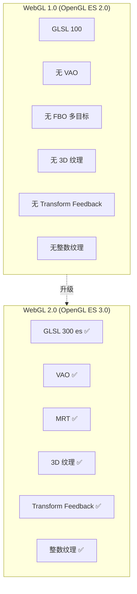

### 核心新特性详解

#### 1. GLSL 300 es

WebGL 2 使用 `#version 300 es` 着色器版本，语法变化显著：

| 对比项 | WebGL 1 (GLSL 100) | WebGL 2 (GLSL 300 es) |
|--------|-------------------|----------------------|
| 版本声明 | 无需声明 | `#version 300 es` (必须第一行) |
| 顶点输出 | `varying` | `out` |
| 片元输入 | `varying` | `in` |
| 片元输出 | `gl_FragColor` | 自定义 `out vec4 fragColor` |
| 纹理采样 | `texture2D()` / `textureCube()` | 统一 `texture()` |
| 属性声明 | `attribute` / `varying` | `in` / `out` |
| 循环限制 | 编译时需可确定迭代次数 | 动态循环 ✅ |
| 整数运算 | 受限 | 完整整数支持 ✅ |
| 位运算 | 不支持 | 支持 ✅ |

**GLSL 300 es 着色器示例：**

```glsl
// 顶点着色器
#version 300 es
layout(location = 0) in vec3 aPosition;  // 使用 layout 限定符
layout(location = 1) in vec2 aTexCoord;

out vec2 vTexCoord;  // 替代 varying

uniform mat4 uMVP;

void main() {
    vTexCoord = aTexCoord;
    gl_Position = uMVP * vec4(aPosition, 1.0);
}
```

```glsl
// 片元着色器
#version 300 es
precision highp float;

in vec2 vTexCoord;  // 替代 varying
out vec4 fragColor; // 替代 gl_FragColor

uniform sampler2D uTexture;

void main() {
    fragColor = texture(uTexture, vTexCoord); // 统一 texture() 函数
}
```

#### 2. 顶点数组对象 (VAO)

WebGL 1 中每次绘制前都需要重新绑定缓冲区、设置属性指针。WebGL 2 的 VAO 将这些状态打包保存，一次设置、反复使用。

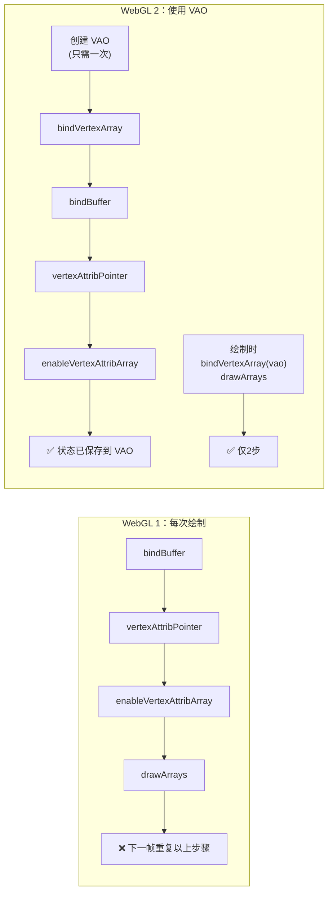

```javascript
// WebGL 2 VAO 使用示例
const vao = gl.createVertexArray();
gl.bindVertexArray(vao);

// 以下状态会被 VAO 记录
gl.bindBuffer(gl.ARRAY_BUFFER, positionBuffer);
gl.vertexAttribPointer(0, 3, gl.FLOAT, false, 0, 0);
gl.enableVertexAttribArray(0);

gl.bindBuffer(gl.ARRAY_BUFFER, texCoordBuffer);
gl.vertexAttribPointer(1, 2, gl.FLOAT, false, 0, 0);
gl.enableVertexAttribArray(1);

gl.bindVertexArray(null); // 解绑

// --- 渲染循环中 ---
function render() {
    gl.bindVertexArray(vao);   // 一键恢复所有顶点属性状态
    gl.drawArrays(gl.TRIANGLES, 0, vertexCount);
    gl.bindVertexArray(null);
}
```

#### 3. 多渲染目标 (MRT)

WebGL 2 允许片元着色器同时输出到多个颜色附件，这对延迟渲染、后处理等高级技术至关重要。

```glsl
// 片元着色器 — 多输出
#version 300 es
precision highp float;

layout(location = 0) out vec4 fragColor;      // 输出到 COLOR_ATTACHMENT0
layout(location = 1) out vec4 fragNormal;     // 输出到 COLOR_ATTACHMENT1
layout(location = 2) out vec4 fragPosition;   // 输出到 COLOR_ATTACHMENT2

void main() {
    fragColor = vec4(diffuseColor, 1.0);
    fragNormal = vec4(normal * 0.5 + 0.5, 1.0);
    fragPosition = vec4(worldPosition, 1.0);
}
```

#### 4. 3D 纹理与整数纹理

| 纹理类型 | WebGL 1 | WebGL 2 | 典型用途 |
|----------|---------|---------|---------|
| 2D 纹理 | ✅ | ✅ | 普通贴图 |
| 立方体纹理 | ✅ | ✅ | 天空盒、环境映射 |
| **3D 纹理** | ❌ | ✅ | 体积渲染、噪声、切片数据 |
| **2D 纹理数组** | ❌ | ✅ | 地形图层、精灵动画 |
| **整数纹理** | ❌ | ✅ | 索引查找、精确计数 |

#### 5. Transform Feedback

允许将顶点着色器的输出捕获到缓冲区，实现 GPU 端的数据循环处理（粒子系统、GPU 动画）。

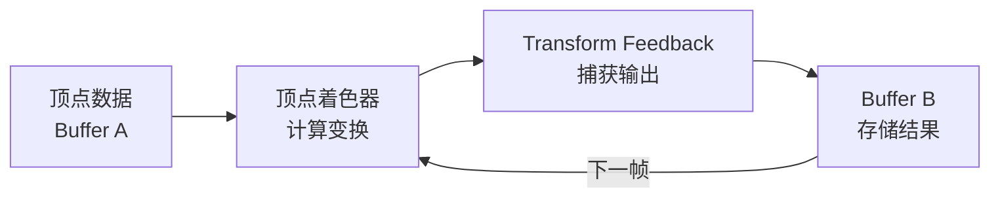

#### 6. 其他重要新特性

| 特性 | 说明 | 应用场景 |
|------|------|---------|
| **实例化渲染** | `gl.drawArraysInstanced()` | 大量相同物体（草地、粒子） |
| **多重采样** | MSAA 离屏渲染 | 抗锯齿后处理 |
| **查询对象** | `gl.beginQuery()` | 遮挡查询、性能统计 |
| **采样器对象** | `gl.createSampler()` | 纹理参数与纹理数据解耦 |
| **Uniform Buffer** | `gl.uniformBlockBinding()` | 批量传递 uniform，减少状态切换 |
| **非 2 的幂纹理** | 完整支持 | 任意尺寸纹理无限制 |

### 浏览器兼容性

| 浏览器 | WebGL 1 | WebGL 2 | 备注 |
|--------|---------|---------|------|
| Chrome 56+ | ✅ | ✅ | 完整支持 |
| Firefox 51+ | ✅ | ✅ | 完整支持 |
| Safari 15+ | ✅ | ✅ | 2021 年后完整支持 |
| Edge 79+ | ✅ | ✅ | Chromium 内核后完整支持 |
| iOS Safari 15+ | ✅ | ✅ | 完整支持 |
| Android Chrome | ✅ | ⚠️ | 部分设备需手动启用 |

> **[兼容性检测]** 使用以下代码检测 WebGL 2 支持：
> ```javascript
> const gl2 = canvas.getContext('webgl2');
> if (!gl2) {
>     console.warn('WebGL 2 不可用，降级到 WebGL 1');
>     gl = canvas.getContext('webgl');
> }
> ```

### 迁移建议

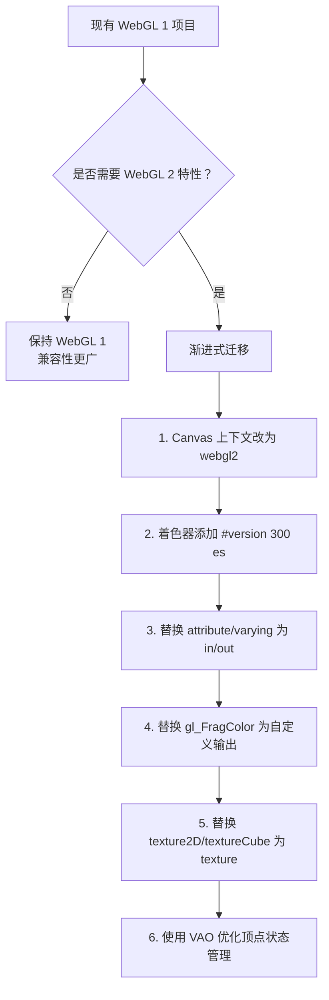

> **[迁移原则]** WebGL 2 完全向后兼容 WebGL 1。你可以先获取 `webgl2` 上下文，但继续使用 GLSL 100 着色器，再逐步升级到 GLSL 300 es。

---

## B. 后处理与高级渲染技术

> 《混合与帧缓冲》一篇介绍了帧缓冲的基本用法，本附录扩展讲解基于 FBO 的后处理技术和其他高级渲染方法。

### 后处理技术概览

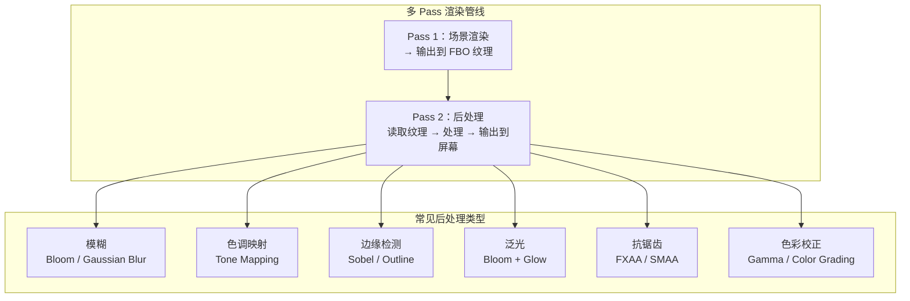

### 1. 模糊效果 (Blur)

模糊是最基础的后处理，也是 Bloom 的前置步骤。常见算法：

| 模糊类型 | 原理 | 采样次数 | 效果 |
|----------|------|---------|------|
| **盒式模糊 (Box Blur)** | 对周围 N×N 像素取均值 | N²（如 9×9=81） | 均匀模糊，有方块感 |
| **高斯模糊 (Gaussian Blur)** | 按高斯分布加权平均 | 可分离为两 Pass（水平+垂直） | ✅ 自然柔和 |
| ** Kawase Blur** | 逐级扩大采样偏移 | 每级 5 次采样 | 高效近似高斯 |

**高斯模糊分离实现（推荐）：**

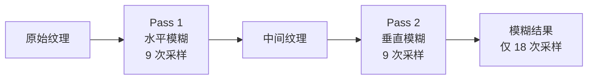

```glsl
// 高斯模糊片元着色器（水平 Pass）
#version 300 es
precision highp float;

in vec2 vTexCoord;
out vec4 fragColor;

uniform sampler2D uTexture;
uniform vec2 uResolution;  // 纹理尺寸

// 高斯权重 (σ ≈ 4)
const float weights[5] = float[](0.227,%200.194,%200.122,%200.061,%200.024);

void main() {
    vec2 texOffset = 1.0 / uResolution;  // 一个像素的纹理偏移

    vec4 result = texture(uTexture, vTexCoord) * weights[0];

    // 正负偏移各采样 4 个像素
    for (int i = 1; i < 5; i++) {
        result += texture(uTexture, vTexCoord + vec2(texOffset.x * i, 0.0)) * weights[i];
        result += texture(uTexture, vTexCoord - vec2(texOffset.x * i, 0.0)) * weights[i];
    }

    fragColor = result;
}
```

> **[性能优化]** 高斯模糊的核心优化是**分离性**——将二维模糊分解为水平+垂直两个一维 Pass。总采样次数从 N² 降低到 2N。

### 2. 泛光效果 (Bloom)

Bloom 让场景中高亮区域产生"光晕溢出"效果，是提升视觉品质的关键后处理。

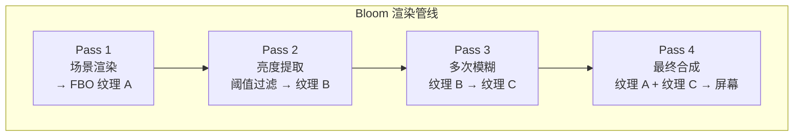

```glsl
// 亮度提取着色器
precision highp float;

varying vec2 vTexCoord;
uniform sampler2D uScene;
uniform float uThreshold; // 亮度阈值，通常 0.8-1.2

void main() {
    vec4 color = texture2D(uScene, vTexCoord);
    float brightness = dot(color.rgb, vec3(0.2126, 0.7152, 0.0722)); // 加权亮度

    if (brightness > uThreshold) {
        gl_FragColor = color;
    } else {
        gl_FragColor = vec4(0.0, 0.0, 0.0, 1.0);
    }
}
```

```glsl
// 最终合成着色器
precision highp float;

varying vec2 vTexCoord;
uniform sampler2D uScene;     // 原始场景纹理
uniform sampler2D uBloom;     // 模糊后的亮部纹理

void main() {
    vec4 sceneColor = texture2D(uScene, vTexCoord);
    vec4 bloomColor = texture2D(uBloom, vTexCoord);

    // 叠加 Bloom 效果
    gl_FragColor = sceneColor + bloomColor * 1.5;
}
```

### 3. 边缘检测 (Edge Detection)

用于实现描边效果或卡通渲染的轮廓线。

| 算法 | 梯度计算 | 特点 |
|------|---------|------|
| **Sobel** | 水平 + 垂直 3×3 卷积核 | 最常用，适中精度 |
| **Laplacian** | 中心差分 + 四邻域 | 简单，但对噪声敏感 |
| **Frei-Chen** | 9 个基向量分解 | 最精确，计算量最大 |

```glsl
// Sobel 边缘检测着色器
precision highp float;

varying vec2 vTexCoord;
uniform sampler2D uTexture;
uniform vec2 uResolution;

void main() {
    vec2 texel = 1.0 / uResolution;

    // 采样 9 个邻域像素
    float tl = texture2D(uTexture, vTexCoord + vec2(-texel.x, texel.y)).r;
    float t  = texture2D(uTexture, vTexCoord + vec2(0.0, texel.y)).r;
    float tr = texture2D(uTexture, vTexCoord + vec2(texel.x, texel.y)).r;
    float l  = texture2D(uTexture, vTexCoord + vec2(-texel.x, 0.0)).r;
    float r  = texture2D(uTexture, vTexCoord + vec2(texel.x, 0.0)).r;
    float bl = texture2D(uTexture, vTexCoord + vec2(-texel.x, -texel.y)).r;
    float b  = texture2D(uTexture, vTexCoord + vec2(0.0, -texel.y)).r;
    float br = texture2D(uTexture, vTexCoord + vec2(texel.x, -texel.y)).r;

    // Sobel 水平梯度
    float gx = -tl - 2.0*l - bl + tr + 2.0*r + br;
    // Sobel 垂直梯度
    float gy = -tl - 2.0*t - tr + bl + 2.0*b + br;

    float edge = sqrt(gx * gx + gy * gy);
    gl_FragColor = vec4(vec3(edge), 1.0);
}
```

### 4. 抗锯齿后处理 (FXAA)

快速近似抗锯齿，仅 1 个 Pass，性能极佳。

| 抗锯齿方法 | Pass 数 | 性能 | 效果 |
|-----------|--------|------|------|
| MSAA（硬件） | 0（渲染时） | ⚠️ 显存消耗大 | ✅ 最高质量 |
| FXAA | 1 | ✅ 最快 | ⚠️ 可能模糊细节 |
| SMAA | 3 | ⚠️ 中等 | ✅ 高质量 |

### 5. 色调映射 (Tone Mapping)

将 HDR 高动态范围颜色映射到 LDR 低动态范围，保留细节。

```glsl
// Reinhard 色调映射（最简单）
vec3 reinhardToneMapping(vec3 color) {
    return color / (color + vec3(1.0));
}

// ACES 电影色调映射（行业标准）
vec3 acesToneMapping(vec3 x) {
    float a = 2.51;
    float b = 0.03;
    float c = 2.43;
    float d = 0.59;
    float e = 0.14;
    return clamp((x * (a * x + b)) / (x * (c * x + d) + e), 0.0, 1.0);
}

// 应用色调映射后还需要 Gamma 校正
vec3 gammaCorrection(vec3 color) {
    return pow(color, vec3(1.0 / 2.2)); // sRGB Gamma ≈ 2.2
}
```

| 色调映射算法 | 特点 | 适用场景 |
|-------------|------|---------|
| **Reinhard** | 简单，暗部可能丢失 | 快速实现 |
| **ACES** | 电影级，保留细节 | ✅ 推荐生产使用 |
| **Uncharted 2** | 游戏开发经典 | 游戏场景 |
| **Exposure-based** | 可控曝光参数 | 需要交互调整 |

### 6. 后处理实现模板

```javascript
// 后处理框架 — 通用模板
class PostProcessPipeline {
    constructor(gl) {
        this.gl = gl;
        this.passes = [];
    }

    addPass(shaderSource, uniforms) {
        this.passes.push({
            shader: this.createShaderProgram(shaderSource),
            fbo: this.createFBO(),
            uniforms: uniforms
        });
    }

    render(sceneTexture) {
        let inputTexture = sceneTexture;

        for (let i = 0; i < this.passes.length; i++) {
            const pass = this.passes[i];
            const isLast = i === this.passes.length - 1;

            // 最后一个 Pass 输出到屏幕，其余输出到 FBO
            if (isLast) {
                this.gl.bindFramebuffer(this.gl.FRAMEBUFFER, null);
            } else {
                this.gl.bindFramebuffer(this.gl.FRAMEBUFFER, pass.fbo.framebuffer);
            }

            this.gl.useProgram(pass.shader);
            this.gl.bindTexture(this.gl.TEXTURE_2D, inputTexture);

            // 设置 uniform
            for (const [name, value] of Object.entries(pass.uniforms)) {
                this.setUniform(pass.shader, name, value);
            }

            // 绘制全屏四边形
            this.drawFullScreenQuad();

            // 下一 Pass 的输入是当前 Pass 的输出
            inputTexture = pass.fbo.texture;
        }
    }
}
```

> **[关键理解]** 所有后处理都遵循同一模式：**场景 → FBO → 后处理着色器 → 屏幕**。区别仅在于着色器的算法不同。掌握这个框架后，你可以轻松组合多种后处理效果。

---

## C. 3D模型加载与glTF格式

> 本册通过程序化生成几何体（立方体、球体等），本附录补充讲解如何加载外部 3D 模型文件。

### 为什么需要加载外部模型？

| 方式 | 适用场景 | 优点 | 缺点 |
|------|---------|------|------|
| 程序化生成 | 简单规则形体（球、立方体） | 无需外部资源 | 无法表示复杂模型 |
| 加载外部模型 | 角色、建筑、道具等复杂形体 | 丰富的艺术细节 | 需要模型文件、加载时间 |

### 3D 模型格式对比

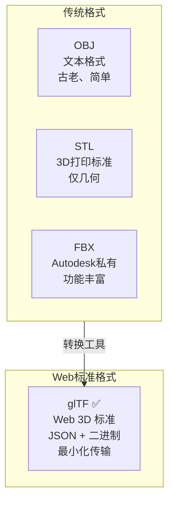

| 格式 | 扩展名 | 类型 | 包含内容 | WebGL 支持 | 推荐度 |
|------|--------|------|---------|-----------|--------|
| **glTF** | `.gltf` / `.glb` | JSON + 二进制 | 几何、材质、动画、层级、相机 | ✅ 最佳 | ⭐⭐⭐⭐⭐ |
| OBJ | `.obj` | 纯文本 | 几何、材质（需 .mtl） | 需转换 | ⭐⭐ |
| FBX | `.fbx` | 二进制私有 | 几何、材质、动画、骨骼 | 需转换 | ⭐⭐⭐ |
| STL | `.stl` | 文本/二进制 | 仅几何 | 需转换 | ⭐ |
| COLLADA | `.dae` | XML | 几何、材质、动画 | 需转换 | ⭐⭐ |

### glTF 格式详解

glTF (GL Transmission Format) 是 Khronos Group 制定的 Web 3D 标准格式，被业界称为"3D 的 JPEG"。

#### glTF 文件结构

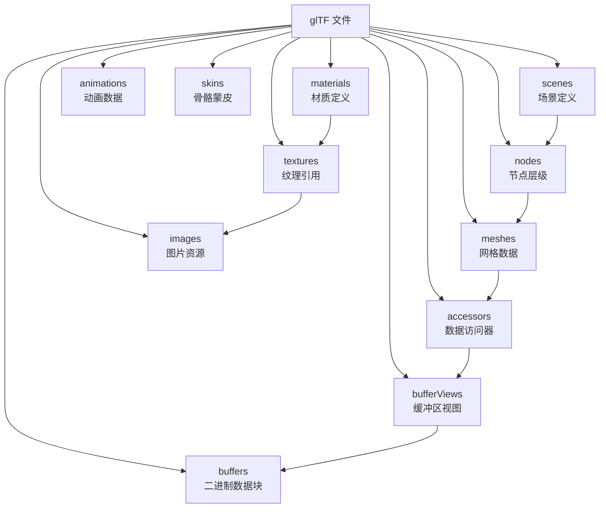

#### glTF 的两种存储方式

| 方式 | 扩展名 | 数据存储 | 优点 | 缺点 |
|------|--------|---------|------|------|
| **标准 glTF** | `.gltf` | JSON + 外部 .bin + 图片 | 可读、易调试 | 多文件，管理复杂 |
| **Binary glTF** | `.glb` | 单个二进制文件 | ✅ 单文件、传输高效 | 不可直接读取 |

#### glTF JSON 示例

```json
{
  "asset": { "version": "2.0", "generator": "Example Generator" },
  "scene": 0,
  "scenes": [
    { "nodes": [0] }
  ],
  "nodes": [
    { "mesh": 0, "name": "Cube" }
  ],
  "meshes": [
    {
      "primitives": [
        {
          "attributes": {
            "POSITION": 1,
            "NORMAL": 2,
            "TEXCOORD_0": 3
          },
          "indices": 0,
          "material": 0
        }
      ]
    }
  ],
  "accessors": [
    { "bufferView": 0, "componentType": 5123, "count": 36, "type": "SCALAR", "max": [23], "min": [0] },
    { "bufferView": 1, "componentType": 5126, "count": 24, "type": "VEC3", "max": [1,1,1], "min": [-1,-1,-1] }
  ],
  "bufferViews": [
    { "buffer": 0, "byteOffset": 0, "byteLength": 72, "target": 34963 },
    { "buffer": 0, "byteOffset": 72, "byteLength": 288, "target": 34962 }
  ],
  "buffers": [
    { "uri": "cube.bin", "byteLength": 360 }
  ],
  "materials": [
    {
      "pbrMetallicRoughness": {
        "baseColorTexture": { "index": 0 },
        "metallicFactor": 0.0,
        "roughnessFactor": 1.0
      }
    }
  ]
}
```

### 手动解析 glTF 的核心步骤

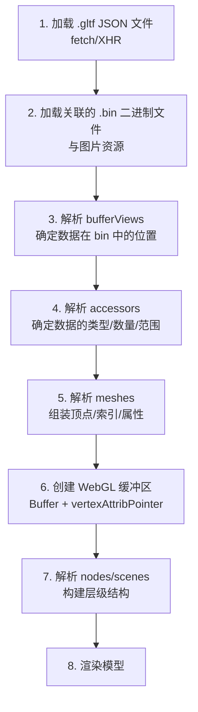

### 使用加载库

手动解析 glTF 非常复杂，实际开发中推荐使用成熟的加载库：

| 库 | 特点 | 适用场景 |
|----|------|---------|
| **Three.js GLTFLoader** | 功能最完善、社区最大 | 通用开发、快速原型 |
| **Babylon.js** | 商业级引擎、功能全面 | 大型 3D 应用 |
| **glTF-Transform** | 模型优化工具 | 模型压缩、DRACO 解码 |
| **Filament** | Google 的轻量渲染引擎 | 移动端高性能渲染 |

#### Three.js 加载示例

```javascript
import { GLTFLoader } from 'three/examples/jsm/loaders/GLTFLoader.js';
import { DRACOLoader } from 'three/examples/jsm/loaders/DRACOLoader.js';

const loader = new GLTFLoader();

// 可选：配置 DRACO 解码器（压缩模型）
const dracoLoader = new DRACOLoader();
dracoLoader.setDecoderPath('https://www.gstatic.com/draco/versioned/decoders/1.5.6/');
loader.setDRACOLoader(dracoLoader);

loader.load(
    'model.glb',       // glTF 文件路径
    (gltf) => {        // 加载成功回调
        const model = gltf.scene;
        scene.add(model);

        // 播放动画
        if (gltf.animations.length > 0) {
            const mixer = new THREE.AnimationMixer(model);
            const action = mixer.clipAction(gltf.animations[0]);
            action.play();
        }
    },
    (progress) => {    // 加载进度回调
        console.log(`Loading: ${(progress.loaded / progress.total * 100).toFixed(1)}%`);
    },
    (error) => {       // 加载错误回调
        console.error('Model loading failed:', error);
    }
);
```

### 简易 OBJ 加载器（WebGL 1 原生实现）

如果不想引入 Three.js，下面是一个简易 OBJ 解析器的核心逻辑：

```javascript
function parseOBJ(text) {
    const positions = [];
    const normals = [];
    const texCoords = [];
    const faces = [];

    for (const line of text.split('\n')) {
        const parts = line.trim().split(/\s+/);
        const type = parts[0];

        if (type === 'v') {
            positions.push([parseFloat(parts[1]), parseFloat(parts[2]), parseFloat(parts[3])]);
        } else if (type === 'vn') {
            normals.push([parseFloat(parts[1]), parseFloat(parts[2]), parseFloat(parts[3])]);
        } else if (type === 'vt') {
            texCoords.push([parseFloat(parts[1]), parseFloat(parts[2])]);
        } else if (type === 'f') {
            // OBJ face format: v/vt/vn 或 v//vn 或 v
            const face = [];
            for (let i = 1; i < parts.length; i++) {
                const indices = parts[i].split('/');
                face.push({
                    position: parseInt(indices[0]) - 1,   // OBJ 索引从 1 开始
                    texCoord: indices[1] ? parseInt(indices[1]) - 1 : -1,
                    normal: indices[2] ? parseInt(indices[2]) - 1 : -1
                });
            }
            faces.push(face);
        }
    }

    // 将面数据展开为顶点数组
    const vertexPositions = [];
    const vertexNormals = [];
    const vertexTexCoords = [];
    const indices = [];
    const vertexMap = new Map();
    let nextIndex = 0;

    for (const face of faces) {
        for (const vertex of face) {
            const key = `${vertex.position}/${vertex.texCoord}/${vertex.normal}`;
            if (!vertexMap.has(key)) {
                vertexMap.set(key, nextIndex);
                vertexPositions.push(...positions[vertex.position]);
                if (vertex.normal >= 0) vertexNormals.push(...normals[vertex.normal]);
                if (vertex.texCoord >= 0) vertexTexCoords.push(...texCoords[vertex.texCoord]);
                nextIndex++;
            }
            indices.push(vertexMap.get(key));
        }
    }

    return {
        positions: new Float32Array(vertexPositions),
        normals: vertexNormals.length ? new Float32Array(vertexNormals) : null,
        texCoords: vertexTexCoords.length ? new Float32Array(vertexTexCoords) : null,
        indices: new Uint16Array(indices)
    };
}
```

### 模型优化建议

| 优化手段 | 工具 | 效果 |
|----------|------|------|
| **DRACO 压缩** | glTF-Transform / Blender | 网格体积减少 80-95% |
| **纹理压缩** | KTX2 / Basis Universal | 纹理体积减少 60-75% |
| **合并网格** | Blender / glTF-Transform | 减少 draw calls |
| **LOD 层级** | Blender / 手动 | 远距离渲染简化模型 |
| **顶点去重** | glTF-Transform | 减少顶点数量 |

> **[最佳实践]** 生产环境中，强烈建议使用 **DRACO 压缩 + KTX2 纹理** 的 glTF 格式。模型文件从几十 MB 可以压缩到几百 KB，加载速度提升显著。

---

## D. 勘误与Bug修复记录

> 本附录记录正文各章节中发现的代码 bug、逻辑错误和内容不一致问题，按严重程度分类。
> 状态标记：✅ 已修复 | ⏳ 待修复
>
> 注：文中"第 N 章"沿用原教程章节编号，对应本库文档为——第 6 章 ≙《WebGL基础实践-中》、第 9 章 ≙《WebGL基础实践-下》、第 20 章 ≙《坐标系与变换流水线》、第 31 章 ≙《3D模型拾取》。

### 🔴 严重级别 (CRITICAL) — 会导致程序崩溃或输出完全错误

#### Bug #1：第 9 章 — FLOAT_VEC4 setter 调用了 uniform3nv ✅

**位置**：`9初级入门 --- 绘制多个物体：进一步封装绘制方法.md` 约第 373 行

**问题**：
```javascript
FLOAT_VEC4: {
  value: 0x8B52,
  setter: function(location, v){
    gl.uniform3fv(location, v);  // ❌ 应为 uniform4fv
  }
},
```

**修复**：`gl.uniform3fv` → `gl.uniform4fv`。`FLOAT_VEC4` 有 4 个分量，调用 `uniform3fv` 只上传 3 个，第 4 个分量（如 alpha 通道）丢失。

---

#### Bug #2：第 9 章 — FLOAT_VEC3 和 FLOAT_VEC4 之间缺少逗号 ✅

**位置**：同上文件，约第 372 行

**问题**：`FLOAT_VEC3` 的闭合花括号后直接跟 `FLOAT_VEC4`，缺少逗号分隔符，导致 JavaScript 语法错误。

**修复**：在 `FLOAT_VEC3` 闭合花括号后添加逗号。

---

#### Bug #3：第 9 章 — createUniformSetter 参数数量不匹配 ✅

**位置**：约第 352 行（调用处）和第 479 行（定义处）

**问题**：
```javascript
// 调用处（2 个参数）
var setter = createUniformSetter(program, uniformInfo);

// 定义处（3 个参数）
function createUniformSetter(gl, program, uniformInfo) { ... }
```

调用时缺少第一个参数 `gl`，导致函数内部 `gl` 实际上是 `program` 对象，`program` 实际上是 `uniformInfo` 对象。

**修复**：在调用处添加 `gl` 参数：`createUniformSetter(gl, program, uniformInfo)`

---

#### Bug #4：第 9 章 — createUniformSetter 内部引用了未定义变量 ✅ `location`

**位置**：约第 479-497 行

**问题**：函数内正确获取了 `uniformLocation`，但闭包中引用了未定义的 `location`，运行时抛出 `ReferenceError`。

**修复**：将所有 `location` 替换为 `uniformLocation`。

---

#### Bug #5：第 9 章 — `new list()` 大小写错误 ✅

**位置**：约第 510 行

**问题**：`let modelList = new list();` — 类名定义为 `List`（大写 L），调用时写成了 `list`（小写 l）。

**修复**：`new list()` → `new List()`

---

#### Bug #6：第 20 章 — lookAt 矩阵索引覆盖 ✅（最著名 bug）

**位置**：`20中级进阶 --- 坐标系变换：世界空间变换到观察空间.md` 约第 189-198 行

**问题**：
```javascript
// 第三列，z 轴基向量
target[8] = zAxis.x;
target[9] = zAxis.y;
target[10] = zAxis.z;
target[11] = 0;

// 第四列，坐标系原点位置 ❌ 索引 8-11 与上面重复！
target[8] = cameraPosition.x;
target[9] = cameraPosition.y;
target[10] = cameraPosition.z;
target[11] = 1;
```

第四列（平移列）应使用索引 12-15，但代码写成了 8-11，覆盖了 z 轴基向量。

**修复**：
```javascript
target[12] = cameraPosition.x;
target[13] = cameraPosition.y;
target[14] = cameraPosition.z;
target[15] = 1;
```

---

#### Bug #7：第 20 章 — 叉积参数顺序错误 ✅

**位置**：约第 148 行

**问题**：数学推导为 `xAxis = zAxis × upDirection`，代码实现为 `Vector3.cross(upDirection, zAxis)`。叉积反交换律：`a × b = -(b × a)`，导致 x 轴方向反转。

**修复**：`Vector3.cross(zAxis, upDirection)`

---

#### Bug #8：第 31 章 — MVP 公式顺序错误 ✅

**位置**：`31高级应用 --- 3D模型的拾取原理与实现.md` 约第 48 行

**问题**：公式写为 `MVP = P × M × V`，正确顺序应为 `MVP = P × V × M`（投影 × 视图 × 模型）。

**修复**：`MVP = P × M × V` → `MVP = P × V × M`

---

### 🟡 高级别 (HIGH) — 会导致特定功能失效

#### Bug #9：第 9 章 — 变量名 ✅ `uniformsSetters` vs `uniformSetters`

**位置**：约第 342 行和第 353 行

**问题**：声明为 `uniformsSetters`（多一个 s），赋值时写成 `uniformSetters`，创建了两个不同变量。

**修复**：统一为 `uniformSetters`。

---

#### Bug #10：第 20 章 — 平行向量检测逻辑错误 ✅

**位置**：约第 155 行

**问题**：`Math.abs(upDirection.z == 1)` — 对布尔值取绝对值，应为 `Math.abs(upDirection.z) === 1`。

**修复**：`Math.abs(upDirection.z === 1)` → `Math.abs(upDirection.z) > 0.99`（浮点容差）

---

#### Bug #11：第 31 章 — NDC 到屏幕坐标公式错误 ✅

**位置**：约第 80 行

**问题**：`Xp4 = (2 × Xp5) / (sWidth - 1)`，正确公式为 `Xp4 = (2 × Xp5) / sWidth - 1`。

**修复**：修正公式推导。

---

#### Bug #12：第 31 章 — `getProFromCVV` 使用了未定义变量 ✅ `aspect`

**位置**：约第 163 行

**问题**：函数 `getProFromCVV(cvv, near, viewRadians)` 内部引用了 `aspect`，但该变量既不是参数也不是局部变量。

**修复**：添加 `aspect` 参数。

---

### 🟠 中级别 (MEDIUM) — 影响理解或特定场景

#### Bug #13：第 6 章 — 学习目标承诺了 ✅"绘制圆形"和"绘制环形"但正文未包含

**位置**：`6初级入门 --- 画个矩形：用基本图形构建平面.md` 约第 17-18 行

**修复建议**：添加使用 `TRIANGLE_FAN` 绘制圆形、使用 `TRIANGLE_STRIP` 绘制环形的示例代码。

---

#### Bug #14：第 9 章 — Z 轴旋转使用了 Y 轴旋转值 ✅

**位置**：约第 710 行

**问题**：`object.rotateZ(object.rotation[1] + rand(0.2, 0.5))`，`rotation[1]` 是 Y 轴旋转值，应为 `rotation[2]`。

**修复**：`rotation[1]` → `rotation[2]`

---

#### Bug #15：第 31 章 — 包围盒优化仅提及未实现 ✅

**位置**：约第 250-252 行

**修复建议**：补充射线-AABB 相交检测的实现代码。

---

### 🔵 低级别 (LOW) — 拼写错误或风格问题

| Bug | 位置 | 问题 | 修复 |
|-----|------|------|------|
| #16 | 第 6 章第 58 行 | `VO` 应为 `V0`（字母 O → 数字 0） | `VO` → `V0` |
| #17 | 第 27 章文件名 | `深入探究` 与其他章节 `深入研究` 不一致 | 重命名为 `27深入研究 --- ...` |
| #18 | 第 31 章第 108 行 | LaTeX 公式中的分号 `Wp2 = 1;` | 移除分号 |
| #19 | 第 20 章第 97 行 | LaTeX 公式中使用了中文全角逗号 | 替换为 ASCII 逗号 |
| #20 | 第 9/31 章 | 使用 `var` 和原型类而非 ES6 `class` | 风格问题，不影响运行 |

---

### 修复统计

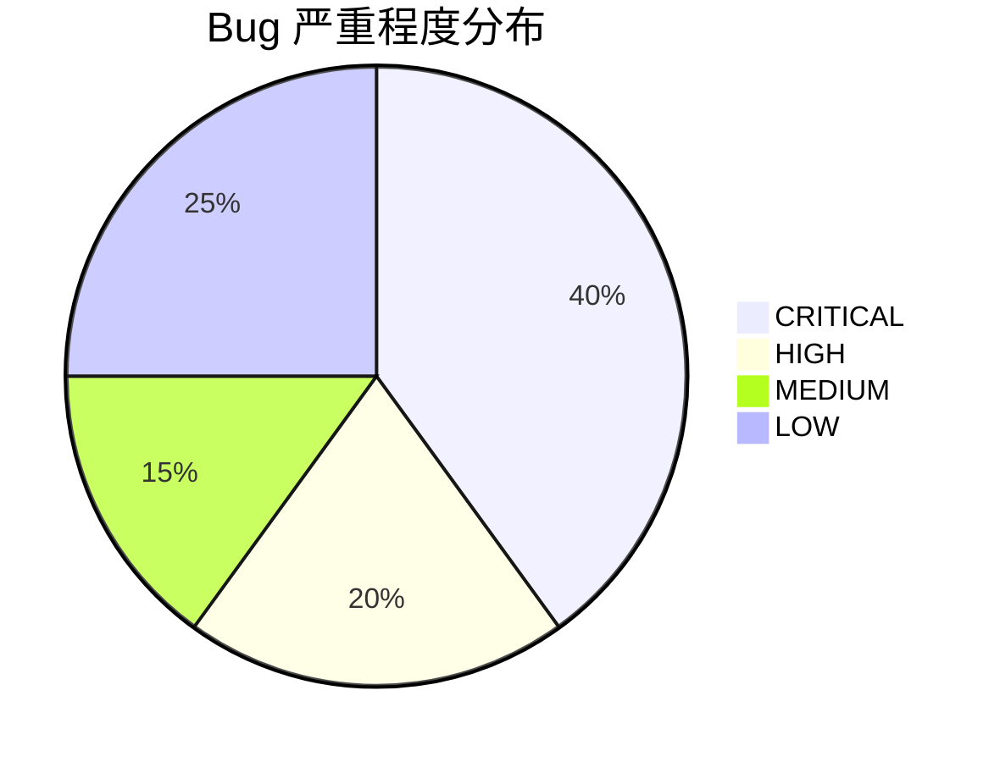

| 严重程度 | 数量 | 占比 |
|----------|------|------|
| 🔴 CRITICAL | 8 | 40% |
| 🟡 HIGH | 4 | 20% |
| 🟠 MEDIUM | 3 | 15% |
| 🔵 LOW | 5 | 25% |
| **合计** | **20** | 100% |

> **[建议]** 第 9 章和第 20 章的 bug 最为集中和严重，建议优先修复。第 9 章的封装代码存在多个相互关联的 bug（参数不匹配、变量名错误、类型错误），建议整体重写该章的封装部分。
