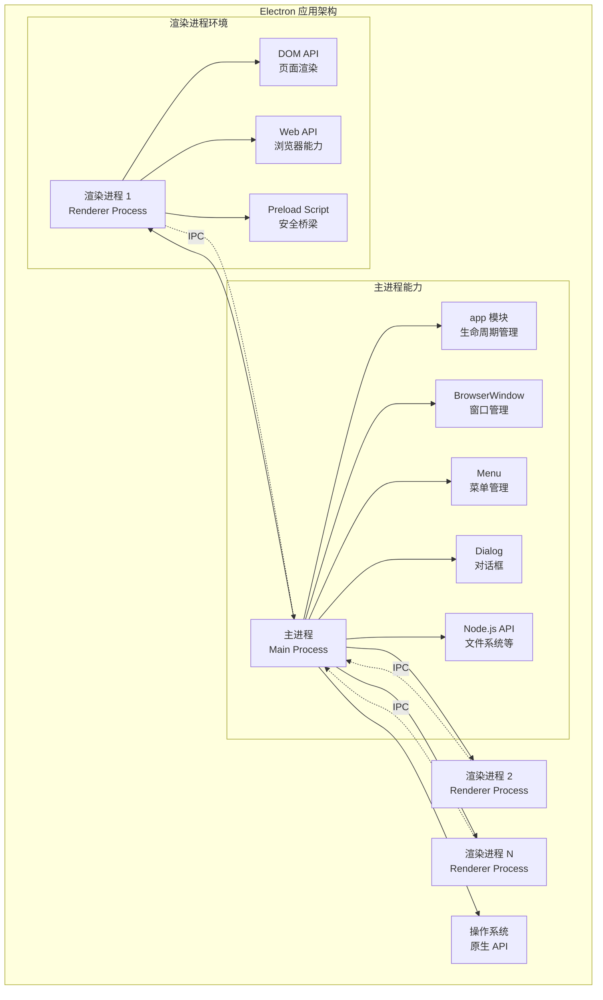
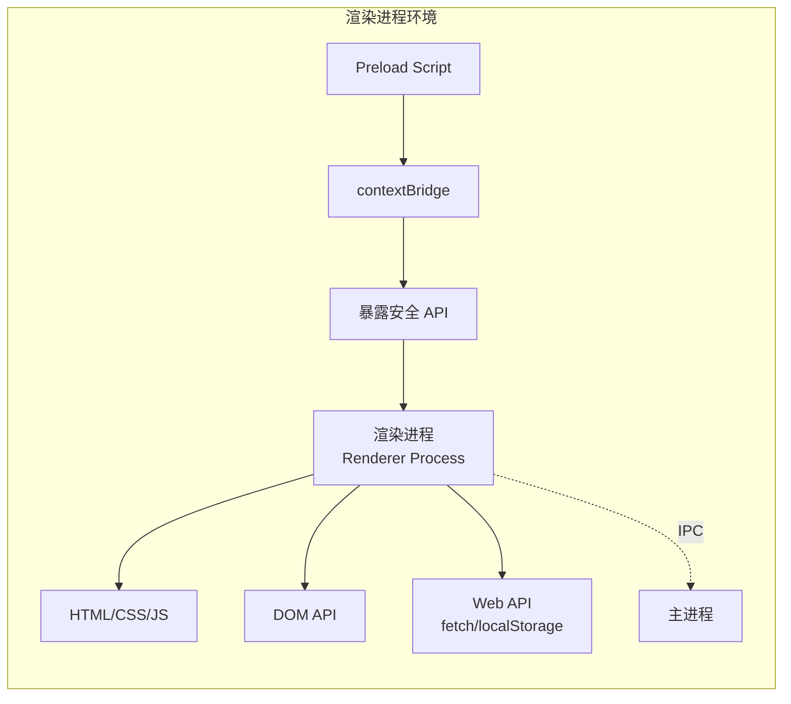
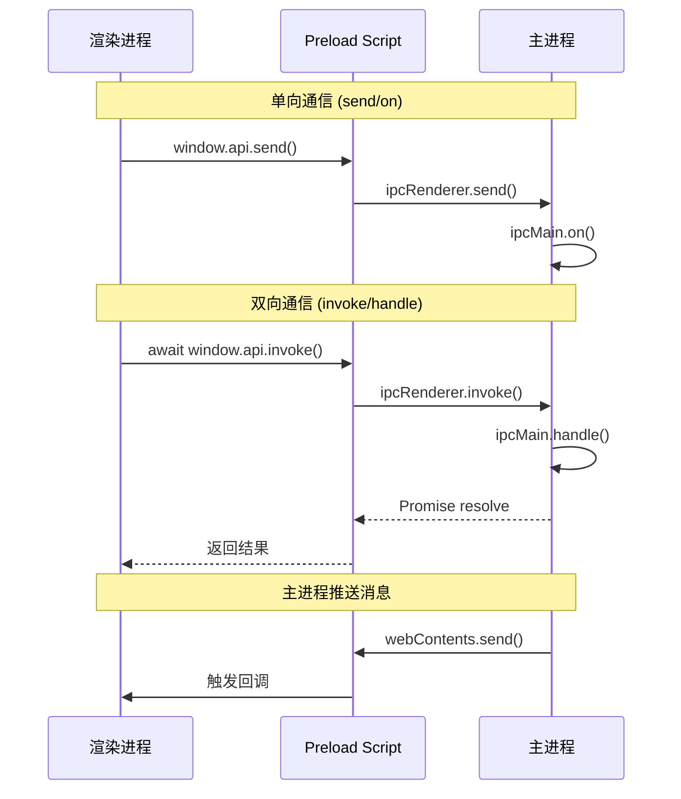
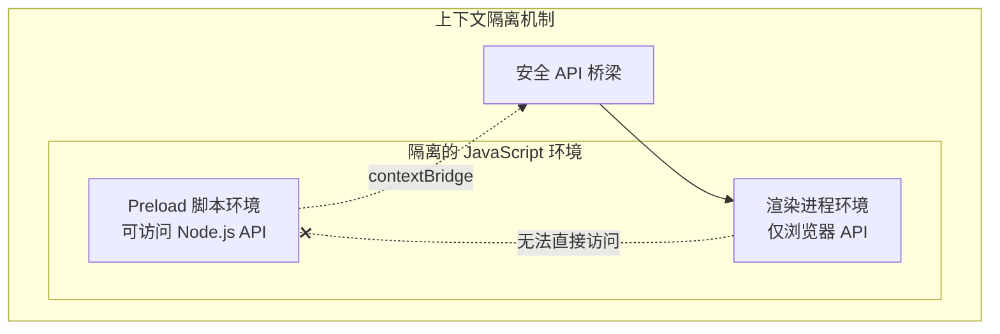

# 基本概念

Electron 是一个使用 JavaScript、HTML 和 CSS 构建跨平台桌面应用程序的框架。它基于 Chromium 和 Node.js，继承了 Chromium 的多进程架构，这对于保持应用的响应性和稳定性至关重要。

## 系统架构概览

Electron 应用程序采用多进程架构，主要由主进程和渲染进程组成，它们通过 IPC（进程间通信）进行交互。



## 主进程和渲染进程

理解**主进程（Main Process）**与**渲染进程（Renderer Process）**之间的区别，是掌握 Electron 开发的基石。

### 类比理解

可以简单类比：

- **主进程** 就像一个浏览器的"主程序"，负责协调和管理
- **渲染进程** 就像浏览器中打开的各个"标签页"，每个标签页独立渲染网页内容

### 核心特性

每个 Electron 应用**有且仅有一个主进程**，但可以**拥有一个或多个渲染进程**：

| 特性 | 主进程 | 渲染进程 |
|------|--------|----------|
| 数量 | 唯一 | 可以有多个 |
| 环境 | 完整 Node.js 环境 | 浏览器环境（受限） |
| DOM 访问 | ❌ 无 | ✅ 有 |
| Node.js API | ✅ 完整访问 | ❌ 默认不可访问 |
| 生命周期 | 整个应用 | 单个窗口 |
| 主要职责 | 管理应用、创建窗口 | 渲染界面、用户交互 |

## 主进程

主进程是 Electron 应用的"大脑"和总指挥。它由 `package.json` 中指定的 `main` 脚本启动，是整个应用的入口点。

### 职责

主进程承担以下核心职责：

- **应用生命周期管理**：控制应用的启动、退出、以及响应操作系统的事件（如休眠、唤醒）
- **原生 API 调用**：创建和管理应用窗口（`BrowserWindow`）、设置原生菜单、响应系统通知、操作文件等
- **管理所有渲染进程**：它可以创建、销毁和管理所有的渲染进程，并与它们进行通信
- **进程间通信协调**：作为 IPC 通信的中枢，处理来自渲染进程的请求

### 环境

- **拥有完整的 Node.js 环境**：可以在主进程中无限制地使用所有 Node.js 的 API，例如 `fs` 模块读写文件、`path` 模块处理路径等
- **没有 DOM 访问权限**：主进程不负责渲染 UI，因此无法访问 `document`、`window` 等浏览器环境的 DOM API

### 入口配置

主进程是应用程序的入口点，通常是名为 `main.js` 的文件。可以在 `package.json` 文件中指定应用的主脚本：

```json
{
  "name": "my-electron-app",
  "version": "1.0.0",
  "description": "Hello World!",
  "main": "main.js",
  "scripts": {
    "start": "electron .",
    "dev": "electron . --enable-logging"
  },
  "devDependencies": {
    "electron": "^28.0.0"
  }
}
```

### 管理应用程序生命周期

`app` 模块是控制应用生命周期的核心。可以通过监听其事件来执行初始化操作、处理退出逻辑等：

```javascript
// main.js
const { app, BrowserWindow } = require("electron")

let mainWindow

// 当 Electron 完成初始化并准备创建浏览器窗口时调用
app.on("ready", () => {
  console.log("应用已就绪")
  createWindow()
})

// 当所有窗口都关闭时触发
app.on("window-all-closed", () => {
  console.log("所有窗口已关闭")
  // 在 macOS 上，除非用户明确退出（Cmd + Q），否则应用及其菜单栏会保持活动状态
  if (process.platform !== "darwin") {
    app.quit()
  }
})

// 在 macOS 上，当单击 dock 图标并且没有其他窗口打开时，
// 通常会重新创建一个窗口
app.on("activate", () => {
  if (BrowserWindow.getAllWindows().length === 0) {
    createWindow()
  }
})

// 在应用退出前触发
app.on("before-quit", () => {
  console.log("应用即将退出")
  // 在这里可以执行一些清理工作，例如保存应用状态
})

function createWindow() {
  mainWindow = new BrowserWindow({
    width: 800,
    height: 600,
    webPreferences: {
      nodeIntegration: false,
      contextIsolation: true
    }
  })
  
  mainWindow.loadFile("index.html")
}
```

#### app 模块常用事件

| 事件 | 说明 | 典型用途 |
|------|------|----------|
| `ready` | Electron 初始化完成时触发 | 执行应用启动逻辑、创建窗口 |
| `window-all-closed` | 所有窗口都关闭时触发 | 处理应用退出逻辑 |
| `activate` (macOS) | 应用被激活时触发 | Dock 图标点击后重新创建窗口 |
| `before-quit` | 应用开始关闭窗口前触发 | 执行清理或确认操作 |
| `quit` | 应用退出时触发 | 最终清理工作 |
| `second-instance` | 第二个实例启动时触发 | 单实例应用处理 |

#### app 模块常用方法

```javascript
// 获取应用版本
const version = app.getVersion()

// 获取应用路径
const appPath = app.getAppPath()
const userDataPath = app.getPath('userData')
const documentsPath = app.getPath('documents')

// 退出应用
app.quit()

// 重启应用
app.relaunch()

// 设置/获取应用菜单
const menu = app.applicationMenu
```

### 创建和管理应用窗口

主进程的另一项核心任务是使用 `BrowserWindow` 模块创建和管理应用窗口。每个窗口都在自己的渲染进程中显示网页内容。

```javascript
// main.js
const { app, BrowserWindow } = require("electron")
const path = require("path")

function createWindow() {
  const mainWindow = new BrowserWindow({
    width: 1200,
    height: 800,
    minWidth: 800,
    minHeight: 600,
    // 窗口标题
    title: 'My Electron App',
    // 窗口图标
    icon: path.join(__dirname, 'assets/icon.png'),
    // 是否显示窗口边框
    frame: true,
    // 是否支持透明窗口
    transparent: false,
    // 窗口背景色
    backgroundColor: '#ffffff',
    // 窗口在屏幕上的初始位置
    x: undefined,
    y: undefined,
    // 是否居中显示
    center: true,
    webPreferences: {
      // 预加载脚本
      preload: path.join(__dirname, "preload.js"),
      // 默认情况下，渲染进程无法访问 Node.js API，出于安全考虑推荐保持默认值
      nodeIntegration: false,
      // 上下文隔离，强烈建议保持为 true
      contextIsolation: true,
      // 启用沙盒
      sandbox: true,
      // 禁用远程模块
      enableRemoteModule: false,
      // 网络安全策略
      webSecurity: true
    }
  })

  // 加载应用的 index.html
  mainWindow.loadFile("index.html")

  // 或者加载一个远程 URL
  // mainWindow.loadURL('https://example.com')

  // 优雅地显示窗口，避免白屏
  mainWindow.once("ready-to-show", () => {
    mainWindow.show()
  })

  // 打开开发者工具（开发环境）
  if (process.env.NODE_ENV === 'development') {
    mainWindow.webContents.openDevTools()
  }
}

app.whenReady().then(createWindow)
```

#### BrowserWindow 常用配置选项

| 选项 | 类型 | 说明 | 示例值 |
|------|------|------|--------|
| `width` / `height` | Number | 窗口初始宽高 | 1200, 800 |
| `minWidth` / `minHeight` | Number | 窗口最小宽高 | 800, 600 |
| `maxWidth` / `maxHeight` | Number | 窗口最大宽高 | 1920, 1080 |
| `x` / `y` | Number | 窗口初始位置 | 100, 100 |
| `center` | Boolean | 是否居中显示 | true |
| `resizable` | Boolean | 是否可调整大小 | true |
| `movable` | Boolean | 是否可移动 | true |
| `minimizable` | Boolean | 是否可最小化 | true |
| `maximizable` | Boolean | 是否可最大化 | true |
| `closable` | Boolean | 是否可关闭 | true |
| `frame` | Boolean | 是否显示窗口框架 | true |
| `transparent` | Boolean | 是否支持透明背景 | false |
| `alwaysOnTop` | Boolean | 是否始终置顶 | false |
| `fullscreen` | Boolean | 是否全屏 | false |
| `kiosk` | Boolean | 是否进入 Kiosk 模式 | false |
| `title` | String | 窗口标题 | 'My App' |
| `icon` | String | 窗口图标路径 | path.join(...) |
| `backgroundColor` | String | 窗口背景色 | '#ffffff' |

#### webPreferences 配置详解

```javascript
webPreferences: {
  // 预加载脚本路径
  preload: path.join(__dirname, 'preload.js'),
  
  // 是否启用 Node.js 集成（默认 false，推荐保持）
  nodeIntegration: false,
  
  // 是否启用上下文隔离（默认 true，推荐保持）
  contextIsolation: true,
  
  // 是否启用沙盒（默认 true）
  sandbox: true,
  
  // 是否启用远程模块（默认 false，已弃用）
  enableRemoteModule: false,
  
  // 是否启用网络安全策略（默认 true，推荐保持）
  webSecurity: true,
  
  // 是否允许运行不安全内容
  allowRunningInsecureContent: false,
  
  // 是否启用 Web 视图标签
  webviewTag: false,
  
  // 是否启用 Node.js 的实验性功能
  nodeIntegrationInWorker: false,
  nodeIntegrationInSubFrames: false,
  
  // 插件支持
  plugins: false,
  
  // 是否启用实验性功能
  experimentalFeatures: false,
  
  // 自定义 User Agent
  userAgent: 'MyApp/1.0',
  
  // DevTools 配置
  devTools: true,
  
  // 默认编码
  defaultEncoding: 'UTF-8',
  
  // 是否启用拼写检查
  spellcheck: true
}
```

#### BrowserWindow 常用事件

| 事件 | 说明 | 使用场景 |
|------|------|----------|
| `ready-to-show` | 页面渲染完成但未显示时触发 | 优雅地显示窗口，避免视觉闪烁 |
| `close` | 窗口即将关闭时触发 | 关闭前进行确认操作 |
| `closed` | 窗口被关闭后触发 | 解除窗口对象引用，帮助垃圾回收 |
| `focus` / `blur` | 窗口获得或失去焦点时触发 | 焦点状态管理 |
| `maximize` / `unmaximize` | 窗口最大化或恢复时触发 | 窗口状态管理 |
| `minimize` / `restore` | 窗口最小化或恢复时触发 | 窗口状态管理 |
| `resize` | 窗口大小改变时触发 | 响应式布局 |
| `move` | 窗口移动时触发 | 窗口位置管理 |

#### BrowserWindow 常用方法

```javascript
const win = new BrowserWindow()

// 窗口显示与隐藏
win.show()
win.hide()
win.close()

// 窗口状态
win.minimize()
win.maximize()
win.unmaximize()
win.restore()
win.setFullScreen(true)
win.isFullScreen()

// 窗口大小和位置
win.setSize(800, 600)
win.getSize() // [800, 600]
win.setPosition(100, 100)
win.getPosition() // [100, 100]
win.setBounds({ x: 100, y: 100, width: 800, height: 600 })
win.getBounds()

// 窗口属性
win.setTitle('新标题')
win.getTitle()
win.setAlwaysOnTop(true)
win.isAlwaysOnTop()

// 窗口内容
win.loadFile('index.html')
win.loadURL('https://example.com')
win.reload()
win.webContents.openDevTools()
```

### 与操作系统集成：调用原生 API

主进程是与底层操作系统交互的桥梁。Electron 提供丰富的模块，让你能够实现原生应用的功能。

#### 常用原生 API 模块

| 模块 | 说明 | 主要功能 |
|------|------|----------|
| [`app`](https://www.electronjs.org/zh/docs/latest/api/app) | 应用生命周期控制 | 启动、退出、版本管理等 |
| [`BrowserWindow`](https://www.electronjs.org/zh/docs/latest/api/browser-window) | 窗口管理 | 创建、控制应用窗口 |
| [`Menu`](https://www.electronjs.org/zh/docs/latest/api/menu) | 菜单管理 | 创建应用菜单、上下文菜单 |
| [`MenuItem`](https://www.electronjs.org/zh/docs/latest/api/menu-item) | 菜单项 | 定义菜单项 |
| [`dialog`](https://www.electronjs.org/zh/docs/latest/api/dialog) | 对话框 | 文件选择、消息提示 |
| [`Tray`](https://www.electronjs.org/zh/docs/latest/api/tray) | 系统托盘 | 托盘图标、菜单 |
| [`Notification`](https://www.electronjs.org/zh/docs/latest/api/notification) | 系统通知 | 桌面通知 |
| [`globalShortcut`](https://www.electronjs.org/zh/docs/latest/api/global-shortcut) | 全局快捷键 | 注册系统级快捷键 |
| [`clipboard`](https://www.electronjs.org/zh/docs/latest/api/clipboard) | 剪贴板 | 复制粘贴操作 |
| [`shell`](https://www.electronjs.org/zh/docs/latest/api/shell) | 系统集成 | 打开外部链接、文件 |
| [`nativeImage`](https://www.electronjs.org/zh/docs/latest/api/native-image) | 原生图片 | 图片处理 |
| [`powerMonitor`](https://www.electronjs.org/zh/docs/latest/api/power-monitor) | 电源监控 | 监听电源状态 |
| [`screen`](https://www.electronjs.org/zh/docs/latest/api/screen) | 屏幕信息 | 获取屏幕尺寸、分辨率 |

#### 示例：常用原生 API 使用

```javascript
const { app, BrowserWindow, dialog, shell, Notification, globalShortcut } = require('electron')

// 对话框示例
async function showOpenDialog() {
  const result = await dialog.showOpenDialog({
    title: '选择文件',
    defaultPath: app.getPath('documents'),
    filters: [
      { name: '文本文件', extensions: ['txt', 'md'] },
      { name: '所有文件', extensions: ['*'] }
    ],
    properties: ['openFile', 'multiSelections']
  })
  
  console.log('选择的文件：', result.filePaths)
}

// 系统通知示例
function showNotification() {
  new Notification({
    title: '应用通知',
    body: '这是一条来自 Electron 应用的通知',
    icon: path.join(__dirname, 'assets/icon.png')
  }).show()
}

// 打开外部链接
function openExternal(url) {
  shell.openExternal(url)
}

// 注册全局快捷键
app.whenReady().then(() => {
  globalShortcut.register('CommandOrControl+Shift+I', () => {
    console.log('快捷键被触发')
  })
})

// 清理快捷键
app.on('will-quit', () => {
  globalShortcut.unregisterAll()
})
```

## 渲染进程

渲染进程负责应用界面的展示，看到的每一个窗口都是一个独立的渲染进程。

### 职责

- **渲染 Web 内容**：使用 `HTML`、`CSS` 和 `JavaScript` 来构建和渲染用户界面
- **响应用户交互**：处理点击、输入等用户在界面上的操作
- **执行 Web 逻辑**：运行前端框架代码、管理组件状态等

### 环境

- **拥有浏览器环境**：可以像在普通网页中一样使用 `window`、`document` 等 DOM API，以及 `fetch` 等 Web API
- **受限的 Node.js 环境**：出于安全考虑，渲染进程默认**不能**直接调用 Node.js 的 API。要实现这些功能，必须通过特定的方式（如 `preload` 脚本和进程间通信）与主进程协作

### 渲染进程架构图



### 稳定性优势

这种架构设计确保应用的健壮性：一个渲染进程的崩溃（例如某个窗口的页面卡死）不会影响到主进程或其他渲染进程，从而提升了应用的整体稳定性。

## 进程间通信 IPC

由于主进程和渲染进程是相互独立的，它们需要一套机制来相互沟通。这套机制就是**进程间通信（Inter-Process Communication, IPC）**。Electron 提供 `ipcMain` 和 `ipcRenderer` 两个模块来实现这一点。

### IPC 通信模式



通信基本上分为两种模式：

1. **单向通信**：从渲染进程向主进程发送消息，不期望得到回复
2. **双向通信**：从渲染进程向主进程发送消息，并异步等待主进程的响应

### IPC 通信模式对比

| 模式 | 渲染进程 API | 主进程 API | 返回值 | 使用场景 |
|------|--------------|------------|--------|----------|
| 单向通信 | `ipcRenderer.send()` | `ipcMain.on()` | 无 | "即发即忘"操作 |
| 双向通信 | `ipcRenderer.invoke()` | `ipcMain.handle()` | Promise | 需要返回值的操作 |
| 同步通信 | `ipcRenderer.sendSync()` | `ipcMain.on()` + `event.returnValue` | 直接返回 | ⚠️ 不推荐，会阻塞渲染进程 |

### 单向通信：`ipcRenderer.send` 和 `ipcMain.on`

这种模式适用于"即发即忘"的场景，例如通知主进程执行某个操作（如最小化窗口），而不需要知道操作的结果。

**完整示例：**

```javascript
// preload.js
const { contextBridge, ipcRenderer } = require("electron")

contextBridge.exposeInMainWorld("electronAPI", {
  minimizeWindow: () => ipcRenderer.send("minimize-window"),
  maximizeWindow: () => ipcRenderer.send("maximize-window"),
  closeWindow: () => ipcRenderer.send("close-window")
})
```

```javascript
// main.js
const { ipcMain, BrowserWindow } = require("electron")

ipcMain.on("minimize-window", () => {
  const window = BrowserWindow.getFocusedWindow()
  if (window) {
    window.minimize()
  }
})

ipcMain.on("maximize-window", () => {
  const window = BrowserWindow.getFocusedWindow()
  if (window) {
    if (window.isMaximized()) {
      window.unmaximize()
    } else {
      window.maximize()
    }
  }
})

ipcMain.on("close-window", () => {
  const window = BrowserWindow.getFocusedWindow()
  if (window) {
    window.close()
  }
})
```

```javascript
// renderer.js
document.getElementById("minimize-btn").addEventListener("click", () => {
  window.electronAPI.minimizeWindow()
})

document.getElementById("maximize-btn").addEventListener("click", () => {
  window.electronAPI.maximizeWindow()
})

document.getElementById("close-btn").addEventListener("click", () => {
  window.electronAPI.closeWindow()
})
```

### 双向通信：`ipcRenderer.invoke` 和 `ipcMain.handle`

这种模式适用于需要从主进程获取数据或执行结果的场景，例如读取文件内容、查询数据库等。它基于 `Promise`，使得异步处理非常方便。

**完整示例：**

```javascript
// preload.js
const { contextBridge, ipcRenderer } = require("electron")

contextBridge.exposeInMainWorld("electronAPI", {
  getAppVersion: () => ipcRenderer.invoke("get-app-version"),
  readFile: (filePath) => ipcRenderer.invoke("read-file", filePath),
  saveFile: (filePath, content) => ipcRenderer.invoke("save-file", filePath, content)
})
```

```javascript
// main.js
const { ipcMain, app, dialog } = require("electron")
const fs = require("fs").promises

ipcMain.handle("get-app-version", () => {
  return app.getVersion()
})

ipcMain.handle("read-file", async (event, filePath) => {
  try {
    const content = await fs.readFile(filePath, "utf8")
    return { success: true, content }
  } catch (error) {
    return { success: false, error: error.message }
  }
})

ipcMain.handle("save-file", async (event, filePath, content) => {
  try {
    // 如果没有提供路径，弹出保存对话框
    if (!filePath) {
      const result = await dialog.showSaveDialog({
        title: "保存文件",
        defaultPath: app.getPath("documents"),
        filters: [
          { name: "文本文件", extensions: ["txt"] },
          { name: "所有文件", extensions: ["*"] }
        ]
      })
      
      if (result.canceled) {
        return { success: false, error: "用户取消保存" }
      }
      filePath = result.filePath
    }
    
    await fs.writeFile(filePath, content, "utf8")
    return { success: true, filePath }
  } catch (error) {
    return { success: false, error: error.message }
  }
})
```

```javascript
// renderer.js
// 获取应用版本
async function displayAppVersion() {
  const version = await window.electronAPI.getAppVersion()
  document.getElementById("version-info").innerText = `版本号：${version}`
}

// 读取文件
async function loadFile(filePath) {
  const result = await window.electronAPI.readFile(filePath)
  if (result.success) {
    document.getElementById("file-content").value = result.content
  } else {
    alert(`读取失败：${result.error}`)
  }
}

// 保存文件
async function saveFile() {
  const content = document.getElementById("file-content").value
  const result = await window.electronAPI.saveFile(null, content)
  if (result.success) {
    alert(`保存成功：${result.filePath}`)
  } else {
    alert(`保存失败：${result.error}`)
  }
}

displayAppVersion()
```

### 主进程向渲染进程发送消息

主进程可以主动向渲染进程推送消息，用于通知状态变化、数据更新等场景。

```javascript
// main.js
const { BrowserWindow } = require("electron")

// 获取目标窗口
const mainWindow = BrowserWindow.getAllWindows()[0]

// 发送消息到渲染进程
mainWindow.webContents.send("update-available", {
  version: "1.0.1",
  releaseDate: "2024-01-15"
})
```

```javascript
// preload.js
const { contextBridge, ipcRenderer } = require("electron")

contextBridge.exposeInMainWorld("electronAPI", {
  onUpdateAvailable: (callback) => {
    ipcRenderer.on("update-available", (event, data) => callback(data))
  }
})
```

```javascript
// renderer.js
window.electronAPI.onUpdateAvailable((data) => {
  console.log("有新版本可用：", data.version)
  document.getElementById("update-notification").style.display = "block"
})
```

### IPC 最佳实践

#### 1. 优先使用 invoke/handle

```javascript
// ✅ 推荐：使用 invoke/handle（Promise 支持，代码清晰）
const result = await ipcRenderer.invoke("read-file", filePath)

// ❌ 不推荐：使用 sendSync（会阻塞渲染进程）
const result = ipcRenderer.sendSync("read-file", filePath)
```

#### 2. 统一错误处理

```javascript
// main.js
ipcMain.handle("read-file", async (event, filePath) => {
  try {
    const content = await fs.readFile(filePath, "utf8")
    return {
      success: true,
      data: content
    }
  } catch (error) {
    return {
      success: false,
      error: {
        code: error.code,
        message: error.message
      }
    }
  }
})

// renderer.js
const result = await window.electronAPI.readFile(filePath)
if (!result.success) {
  console.error("操作失败：", result.error.message)
  return
}
console.log("文件内容：", result.data)
```

#### 3. 类型安全（TypeScript）

```typescript
// preload.ts
import { contextBridge, ipcRenderer } from "electron"

interface FileResult {
  success: boolean
  data?: string
  error?: { code: string; message: string }
}

contextBridge.exposeInMainWorld("electronAPI", {
  readFile: (filePath: string): Promise<FileResult> => 
    ipcRenderer.invoke("read-file", filePath)
})

// renderer.ts
interface ElectronAPI {
  readFile: (filePath: string) => Promise<FileResult>
}

declare global {
  interface Window {
    electronAPI: ElectronAPI
  }
}
```

#### 4. 通道命名规范

```javascript
// ✅ 推荐：使用命名空间和动词
"user:get-profile"
"user:update-profile"
"file:read"
"file:save"
"window:minimize"
"window:maximize"

// ❌ 不推荐：模糊命名
"getData"
"save"
"action1"
```

## 预加载脚本 (preload.js) 与上下文隔离

预加载（preload）脚本是连接 Electron 主进程与渲染进程的**关键安全桥梁**。它是一个特殊的脚本，在渲染进程的网页内容开始加载之前执行，并且**同时拥有访问 Node.js API 和 DOM API 的能力**。

### 配置预加载脚本

可以在创建 `BrowserWindow` 时，通过 `webPreferences.preload` 选项指定它的路径：

```javascript
// main.js
const path = require("path")
const { BrowserWindow } = require("electron")

const mainWindow = new BrowserWindow({
  webPreferences: {
    preload: path.join(__dirname, "preload.js"),
    contextIsolation: true,
    nodeIntegration: false,
    sandbox: true
  }
})
```

### 上下文隔离 (Context Isolation)

`contextIsolation` 是 Electron 最重要的安全特性之一，自 Electron 12 版本以来**默认开启**。

#### 作用机制



- **作用**：确保 `preload` 脚本和渲染进程的网页脚本运行在**两个相互隔离的 JavaScript 上下文**中
- **目的**：防止渲染进程中加载的第三方网页或恶意代码直接访问 Node.js API 或你暴露的强大接口，从而保护用户系统免受攻击

#### 隔离效果示例

```javascript
// preload.js
// 在预加载脚本中设置全局变量
window.mySecretKey = "secret123"
contextBridge.exposeInMainWorld("electronAPI", { /* ... */ })

// renderer.js
// 在渲染进程中尝试访问
console.log(window.mySecretKey) // undefined（无法访问）
console.log(window.electronAPI) // ✅ 可以访问（通过 contextBridge 暴露）
```

### 使用 `contextBridge` 安全地暴露 API

`contextBridge.exposeInMainWorld` 方法可以创建一个安全的、跨上下文的桥梁，将 `preload` 脚本中的特定函数暴露给渲染进程，而不会污染全局 `window` 对象。

#### 基本用法

```javascript
// preload.js
const { contextBridge, ipcRenderer } = require("electron")

// 暴露安全的 API 到渲染进程
contextBridge.exposeInMainWorld("electronAPI", {
  // 平台信息
  platform: process.platform,
  
  // 应用版本
  getAppVersion: () => ipcRenderer.invoke("get-app-version"),
  
  // 文件操作
  readFile: (filePath) => ipcRenderer.invoke("read-file", filePath),
  saveFile: (filePath, content) => ipcRenderer.invoke("save-file", filePath, content),
  
  // 窗口控制
  minimizeWindow: () => ipcRenderer.send("window-minimize"),
  maximizeWindow: () => ipcRenderer.send("window-maximize"),
  
  // 事件监听
  onUpdateAvailable: (callback) => {
    ipcRenderer.on("update-available", (event, data) => callback(data))
  }
})
```

#### 完整示例：文件管理应用

**1. 主进程 (`main.js`)**：

```javascript
const { app, BrowserWindow, ipcMain, dialog } = require("electron")
const fs = require("fs").promises
const path = require("path")

let mainWindow

function createWindow() {
  mainWindow = new BrowserWindow({
    width: 1200,
    height: 800,
    webPreferences: {
      preload: path.join(__dirname, "preload.js"),
      contextIsolation: true,
      nodeIntegration: false,
      sandbox: true
    }
  })
  
  mainWindow.loadFile("index.html")
}

app.whenReady().then(createWindow)

// IPC 处理器
ipcMain.handle("get-app-version", () => app.getVersion())

ipcMain.handle("read-file", async (event, filePath) => {
  try {
    const content = await fs.readFile(filePath, "utf8")
    return { success: true, content }
  } catch (error) {
    return { success: false, error: error.message }
  }
})

ipcMain.handle("save-file", async (event, filePath, content) => {
  try {
    await fs.writeFile(filePath, content, "utf8")
    return { success: true }
  } catch (error) {
    return { success: false, error: error.message }
  }
})

ipcMain.handle("select-file", async () => {
  const result = await dialog.showOpenDialog(mainWindow, {
    title: "选择文件",
    filters: [
      { name: "文本文件", extensions: ["txt", "md"] },
      { name: "所有文件", extensions: ["*"] }
    ],
    properties: ["openFile"]
  })
  
  if (result.canceled) {
    return { success: false }
  }
  
  return { success: true, filePath: result.filePaths[0] }
})
```

**2. 预加载脚本 (`preload.js`)**：

```javascript
const { contextBridge, ipcRenderer } = require("electron")

contextBridge.exposeInMainWorld("fileAPI", {
  // 应用信息
  getAppVersion: () => ipcRenderer.invoke("get-app-version"),
  
  // 文件操作
  readFile: (filePath) => ipcRenderer.invoke("read-file", filePath),
  saveFile: (filePath, content) => ipcRenderer.invoke("save-file", filePath, content),
  selectFile: () => ipcRenderer.invoke("select-file"),
  
  // 系统信息（可以直接访问 Node.js API）
  getSystemInfo: () => ({
    platform: process.platform,
    arch: process.arch,
    versions: {
      node: process.versions.node,
      chrome: process.versions.chrome,
      electron: process.versions.electron
    }
  })
})
```

**3. 渲染进程 (`renderer.js`)**：

```javascript
// 安全地调用暴露的 API
async function loadFile() {
  // 选择文件
  const selectResult = await window.fileAPI.selectFile()
  if (!selectResult.success) {
    return
  }
  
  // 读取文件内容
  const readResult = await window.fileAPI.readFile(selectResult.filePath)
  if (readResult.success) {
    document.getElementById("file-content").value = readResult.content
    document.getElementById("file-path").innerText = selectResult.filePath
  } else {
    alert("读取文件失败：" + readResult.error)
  }
}

async function saveFile() {
  const filePath = document.getElementById("file-path").innerText
  const content = document.getElementById("file-content").value
  
  const result = await window.fileAPI.saveFile(filePath, content)
  if (result.success) {
    alert("保存成功")
  } else {
    alert("保存失败：" + result.error)
  }
}

// 显示系统信息
function showSystemInfo() {
  const info = window.fileAPI.getSystemInfo()
  console.log("系统信息：", info)
}

// 尝试访问 Node.js API 会失败
// console.log(require('fs')); // ❌ Uncaught ReferenceError: require is not defined
```

### 安全最佳实践

#### ✅ 正确做法

```javascript
// preload.js
contextBridge.exposeInMainWorld("electronAPI", {
  // ✅ 为每个操作提供专门的 API
  loadPreferences: () => ipcRenderer.invoke("load-prefs"),
  savePreferences: (prefs) => ipcRenderer.invoke("save-prefs", prefs)
})
```

#### ❌ 错误做法

```javascript
// preload.js
contextBridge.exposeInMainWorld("electronAPI", {
  // ❌ 直接暴露底层 API，无参数过滤
  send: ipcRenderer.send,
  invoke: ipcRenderer.invoke
})
```

这种做法允许任何网页代码发送任意的 IPC 消息，存在严重的安全风险！

### contextBridge 限制

`contextBridge` 有一些限制需要了解：

1. **不能暴露原型或 Symbol**

```javascript
// ❌ 不支持
contextBridge.exposeInMainWorld("api", {
  myClass: class MyClass {}
})
```

2. **不能暴露函数的属性**

```javascript
// ❌ 不支持
const fn = () => {}
fn.customProperty = "value"
contextBridge.exposeInMainWorld("api", { fn })
```

3. **只能传递可序列化的数据**

```javascript
// ✅ 支持：基本类型、数组、对象、Promise、函数（跨上下文代理）
contextBridge.exposeInMainWorld("api", {
  getString: () => "hello",
  getNumber: () => 123,
  getObject: () => ({ key: "value" }),
  getArray: () => [1, 2, 3],
  getPromise: () => Promise.resolve("result")
})

// ❌ 不支持：Symbol、类与原型（原型修改会被丢弃）
contextBridge.exposeInMainWorld("api", {
  getSymbol: () => Symbol("key") // ❌
})
```

## 常见问题与解答

### Q1: 如何选择 IPC 通信模式？

**A:** 根据需求选择：

| 需求 | 推荐模式 | 原因 |
|------|----------|------|
| 需要返回值 | `invoke/handle` | Promise 支持，代码清晰 |
| 不需要返回值 | `send/on` | 简单直接 |
| 实时推送消息 | `webContents.send` + `on` | 主进程主动推送 |

### Q2: 如何处理大量数据传输？

**A:** 对于大文件或大量数据：

1. **使用流式传输**：分块发送数据
2. **使用共享内存**：通过 `sharedArrayBuffer`
3. **使用临时文件**：写入临时文件，传递文件路径

```javascript
// 分块传输示例
ipcMain.handle("read-large-file", async (event, filePath, chunkSize = 1024 * 1024) => {
  const stream = fs.createReadStream(filePath, { highWaterMark: chunkSize })
  
  for await (const chunk of stream) {
    event.sender.send("file-chunk", chunk)
  }
  
  event.sender.send("file-end")
})
```

### Q3: 如何调试 IPC 通信？

**A:** 多种调试方法：

```javascript
// main.js - 打印所有 IPC 消息
// 注意：ipcMain.on 不支持通配符，"*" 只会匹配字面名为 "*" 的通道，
// 如需统一记录，可自行封装 ipcMain.on / ipcMain.handle
ipcMain.on("*", (event, ...args) => {
  console.log("[IPC]", event.channel, args)
})

// 使用 electron-log
const log = require("electron-log")
ipcMain.handle("read-file", (event, filePath) => {
  log.info("读取文件：", filePath)
  // ...
})

// 使用 Chrome DevTools Protocol
const { app } = require("electron")
app.commandLine.appendSwitch("inspect", "5858")
```

### Q4: 什么时候使用 preload vs 直接 IPC？

**A:** 

- **使用 preload**：需要访问 Node.js API、处理敏感操作、提供类型安全接口
- **直接 IPC**：简单的数据传递、无需类型检查的场景

### Q5: 如何实现多窗口通信？

**A:** 通过主进程中转：

```javascript
// main.js
ipcMain.on("message-to-other-window", (event, message) => {
  const allWindows = BrowserWindow.getAllWindows()
  allWindows.forEach(win => {
    if (win.webContents !== event.sender) {
      win.webContents.send("message-from-other-window", message)
    }
  })
})
```

## 最佳实践总结

### 安全性

1. ✅ 始终启用 `contextIsolation: true`
2. ✅ 禁用 `nodeIntegration`（保持 false）
3. ✅ 使用 `contextBridge` 暴露有限的 API
4. ✅ 为每个 IPC 通道提供明确的权限检查
5. ✅ 验证所有来自渲染进程的数据

### 性能

1. ✅ 使用 `ready-to-show` 事件优雅显示窗口
2. ✅ 避免在渲染进程中执行 CPU 密集型操作
3. ✅ 使用 Promise 而非同步 IPC
4. ✅ 合理使用 `webPreferences` 配置

### 代码组织

1. ✅ 使用命名空间组织 IPC 通道
2. ✅ 统一错误处理格式
3. ✅ 使用 TypeScript 增强类型安全
4. ✅ 分离业务逻辑和 IPC 通信

## 相关文档

- [05-主进程与渲染进程](05-主进程与渲染进程.md)
- [06-进阶概念](06-进阶概念.md)
- [进程间通信](../04-进程通信与API/01-IPC基础.md)
- [安全最佳实践](../07-打包与质量/04-安全最佳实践.md)
