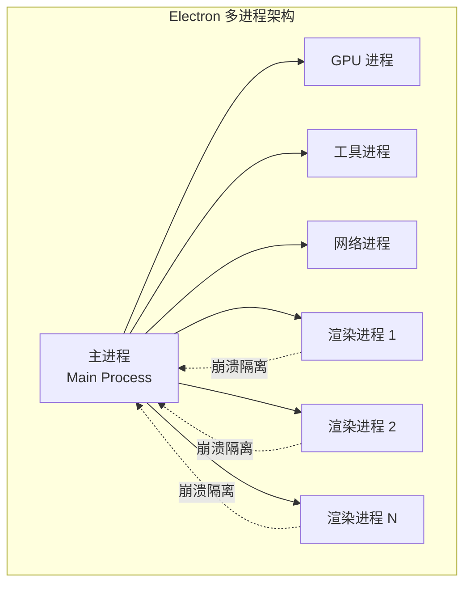
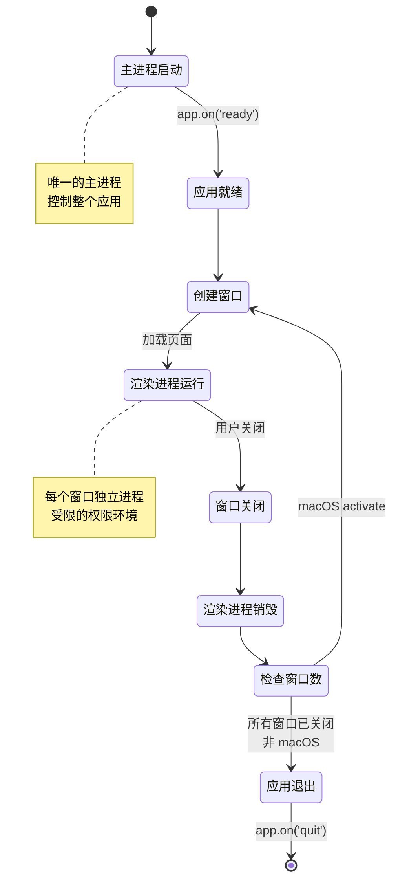
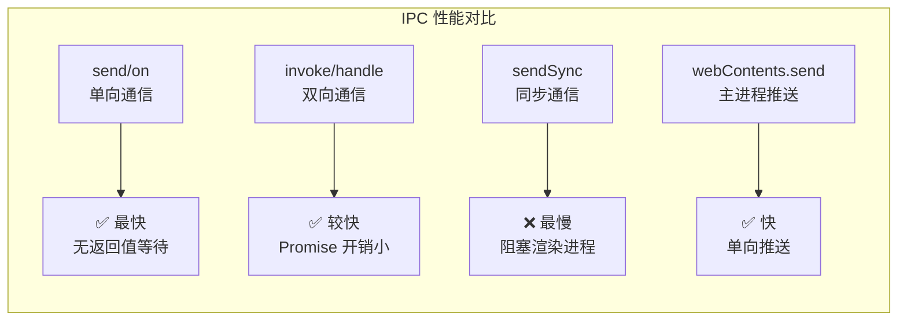
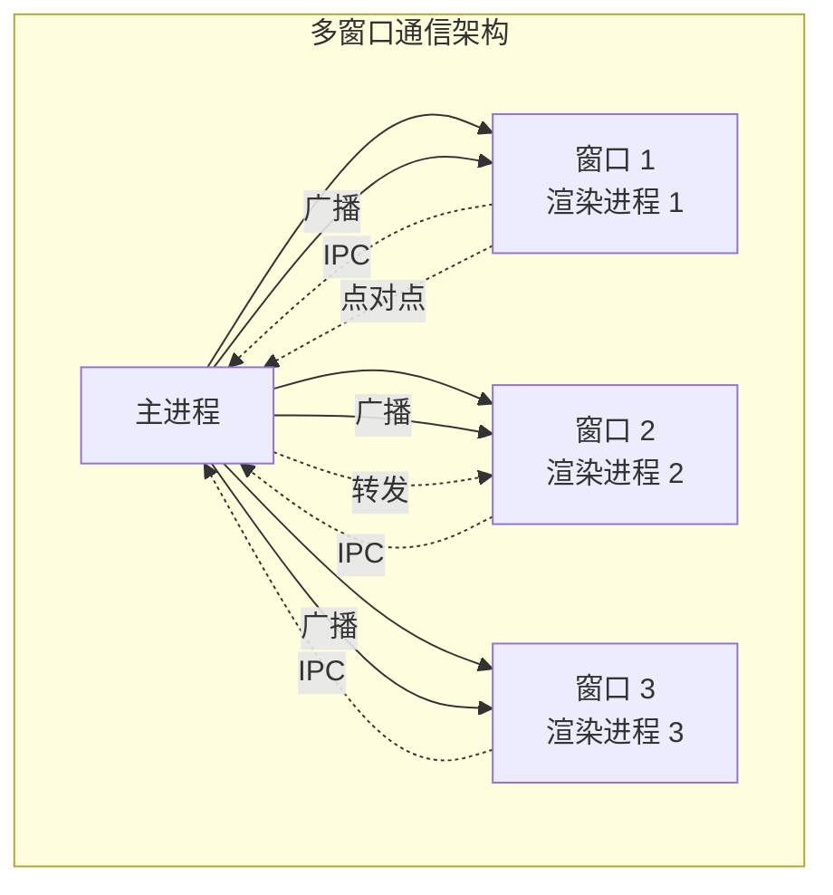

# 主进程与渲染进程详解

本文档深入探讨 Electron 主进程与渲染进程的内部机制、调试技巧、性能优化和最佳实践。建议先阅读 [02-基本概念](02-基本概念.md) 了解基础内容。

## 进程架构深度解析

Electron 基于 Chromium 的多进程架构，这种设计提供了出色的安全性和稳定性，但也带来了独特的开发挑战。

### 多进程架构的优势



**核心优势：**

1. **稳定性**：单个渲染进程崩溃不会影响整个应用
2. **安全性**：进程隔离限制了恶意代码的破坏范围
3. **性能**：多进程并行处理，充分利用多核 CPU
4. **响应性**：UI 渲染与后台逻辑分离

### 进程生命周期管理



## 进程环境对比

### 主进程环境

主进程运行在完整的 Node.js 环境中，拥有最高的权限。

```javascript
// main.js
const { app, BrowserWindow } = require("electron")
const fs = require("fs")
const path = require("path")
const http = require("http")
const crypto = require("crypto")

// ✅ 主进程可以访问所有 Node.js API
console.log("Node.js 版本:", process.versions.node)
console.log("Electron 版本:", process.versions.electron)
console.log("Chrome 版本:", process.versions.chrome)

// ✅ 可以直接操作文件系统
const config = fs.readFileSync(path.join(__dirname, "config.json"), "utf8")

// ✅ 可以创建子进程
const { spawn } = require("child_process")
const child = spawn("ls", ["-la"])

// ✅ 可以访问环境变量
console.log("环境变量:", process.env)

// ❌ 无法访问 DOM API
// console.log(document) // ReferenceError: document is not defined
// console.log(window) // ReferenceError: window is not defined
```

### 渲染进程环境

渲染进程运行在浏览器环境中，默认无法访问 Node.js API。

```javascript
// renderer.js
// ✅ 可以访问浏览器 API
console.log("User Agent:", navigator.userAgent)
console.log("窗口大小:", window.innerWidth, window.innerHeight)

// ✅ 可以使用 Web API
fetch("https://api.example.com/data")
  .then(response => response.json())
  .then(data => console.log(data))

// ✅ 可以访问 DOM
const button = document.getElementById("myButton")
button.addEventListener("click", () => {
  console.log("按钮被点击")
})

// ❌ 默认无法访问 Node.js API
// console.log(require) // ReferenceError: require is not defined
// console.log(process) // undefined (未通过 preload 暴露)
// console.log(__dirname) // undefined
```

### 通过 preload 访问 Node.js API

```javascript
// preload.js
const { contextBridge, ipcRenderer } = require("electron")
const fs = require("fs")
const path = require("path")

// ✅ preload 脚本可以访问 Node.js API 和 DOM
// 但需要在上下文隔离启用时，通过 contextBridge 安全暴露

contextBridge.exposeInMainWorld("nodeAPI", {
  // 暴露文件系统操作（推荐通过 IPC 在主进程执行）
  readFile: (filePath) => {
    return fs.readFileSync(filePath, "utf8")
  },
  
  // 暴露路径操作
  joinPath: (...args) => path.join(...args),
  
  // 暴露环境变量（只读）
  getEnv: (key) => process.env[key],
  
  // 暴露进程信息（只读）
  getProcessVersions: () => ({ ...process.versions })
})
```

```javascript
// renderer.js
// 通过暴露的 API 访问 Node.js 功能
const content = window.nodeAPI.readFile("/path/to/file.txt")
const fullPath = window.nodeAPI.joinPath("data", "config.json")
const nodeVersion = window.nodeAPI.getProcessVersions().node
```

## 进程间通信进阶

### IPC 通信性能考量

不同 IPC 方式的性能特征：



### 高级 IPC 模式

#### 1. 流式数据传输

用于大文件或实时数据流：

```javascript
// main.js
const fs = require("fs")
const { ipcMain } = require("electron")

ipcMain.on("stream-file-start", (event, filePath, chunkSize = 65536) => {
  const stream = fs.createReadStream(filePath, { highWaterMark: chunkSize })
  let chunkIndex = 0
  
  stream.on("data", (chunk) => {
    // 发送数据块
    event.sender.send("stream-file-chunk", {
      index: chunkIndex++,
      data: chunk.toString("base64"), // 转为 base64 以传输二进制数据
      isLast: false
    })
  })
  
  stream.on("end", () => {
    event.sender.send("stream-file-chunk", {
      index: chunkIndex,
      data: null,
      isLast: true
    })
  })
  
  stream.on("error", (error) => {
    event.sender.send("stream-file-error", error.message)
  })
})
```

```javascript
// preload.js
const { contextBridge, ipcRenderer } = require("electron")

contextBridge.exposeInMainWorld("streamAPI", {
  readFile: (filePath, onChunk, onError) => {
    ipcRenderer.on("stream-file-chunk", (event, data) => {
      if (data.isLast) {
        ipcRenderer.removeAllListeners("stream-file-chunk")
        ipcRenderer.removeAllListeners("stream-file-error")
      }
      onChunk(data)
    })
    
    ipcRenderer.on("stream-file-error", (event, error) => {
      ipcRenderer.removeAllListeners("stream-file-chunk")
      ipcRenderer.removeAllListeners("stream-file-error")
      onError(error)
    })
    
    ipcRenderer.send("stream-file-start", filePath)
  }
})
```

```javascript
// renderer.js
async function streamLargeFile(filePath) {
  const chunks = []
  
  await new Promise((resolve, reject) => {
    window.streamAPI.readFile(
      filePath,
      (data) => {
        if (!data.isLast) {
          chunks.push(Buffer.from(data.data, "base64"))
        } else {
          resolve()
        }
      },
      (error) => {
        reject(new Error(error))
      }
    )
  })
  
  return Buffer.concat(chunks).toString("utf8")
}
```

#### 2. 批量操作优化

减少 IPC 调用次数：

```javascript
// ❌ 不推荐：多次 IPC 调用
async function loadUserData() {
  const user = await ipcRenderer.invoke("get-user")
  const settings = await ipcRenderer.invoke("get-settings")
  const preferences = await ipcRenderer.invoke("get-preferences")
  return { user, settings, preferences }
}

// ✅ 推荐：单次批量请求
async function loadUserData() {
  return await ipcRenderer.invoke("get-all-user-data")
}

// main.js
ipcMain.handle("get-all-user-data", async () => {
  return {
    user: await getUser(),
    settings: await getSettings(),
    preferences: await getPreferences()
  }
})
```

#### 3. 请求取消机制

```javascript
// preload.js
contextBridge.exposeInMainWorld("taskAPI", {
  startTask: (taskId) => ipcRenderer.invoke("start-task", taskId),
  cancelTask: (taskId) => ipcRenderer.send("cancel-task", taskId)
})

// main.js
const activeTasks = new Map()

ipcMain.handle("start-task", async (event, taskId) => {
  const abortController = new AbortController()
  activeTasks.set(taskId, abortController)
  
  try {
    const result = await longRunningTask(abortController.signal)
    return { success: true, result }
  } catch (error) {
    if (error.name === "AbortError") {
      return { success: false, cancelled: true }
    }
    return { success: false, error: error.message }
  } finally {
    activeTasks.delete(taskId)
  }
})

ipcMain.on("cancel-task", (event, taskId) => {
  const controller = activeTasks.get(taskId)
  if (controller) {
    controller.abort()
    activeTasks.delete(taskId)
  }
})

async function longRunningTask(signal) {
  for (let i = 0; i < 100; i++) {
    if (signal.aborted) {
      throw new DOMException("Task cancelled", "AbortError")
    }
    await new Promise(resolve => setTimeout(resolve, 100))
  }
  return "Task completed"
}
```

### 多窗口通信



```javascript
// main.js
const { BrowserWindow, ipcMain } = require("electron")

// 广播消息到所有窗口
ipcMain.on("broadcast-message", (event, message) => {
  const allWindows = BrowserWindow.getAllWindows()
  allWindows.forEach(win => {
    win.webContents.send("broadcast", message)
  })
})

// 发送消息到特定窗口
ipcMain.on("send-to-window", (event, windowId, message) => {
  const targetWindow = BrowserWindow.fromId(windowId)
  if (targetWindow) {
    targetWindow.webContents.send("window-message", message)
  }
})

// 发送消息到其他所有窗口（排除发送者）
ipcMain.on("send-to-others", (event, message) => {
  const allWindows = BrowserWindow.getAllWindows()
  allWindows.forEach(win => {
    if (win.webContents !== event.sender) {
      win.webContents.send("broadcast", message)
    }
  })
})

// 获取所有窗口信息
ipcMain.handle("get-all-windows", () => {
  return BrowserWindow.getAllWindows().map(win => ({
    id: win.id,
    title: win.getTitle()
  }))
})
```

```javascript
// preload.js
contextBridge.exposeInMainWorld("windowAPI", {
  broadcast: (message) => ipcRenderer.send("broadcast-message", message),
  sendToWindow: (windowId, message) => 
    ipcRenderer.send("send-to-window", windowId, message),
  sendToOthers: (message) => ipcRenderer.send("send-to-others", message),
  getAllWindows: () => ipcRenderer.invoke("get-all-windows"),
  onBroadcast: (callback) => {
    ipcRenderer.on("broadcast", (event, message) => callback(message))
  },
  onWindowMessage: (callback) => {
    ipcRenderer.on("window-message", (event, message) => callback(message))
  }
})
```

## 进程调试

### 主进程调试

#### 方法一：VSCode 调试器（推荐）

创建 `.vscode/launch.json`：

```json
{
  "version": "0.2.0",
  "configurations": [
    {
      "name": "调试主进程",
      "type": "node",
      "request": "launch",
      "cwd": "${workspaceFolder}",
      "runtimeExecutable": "${workspaceFolder}/node_modules/.bin/electron",
      "windows": {
        "runtimeExecutable": "${workspaceFolder}/node_modules/.bin/electron.cmd"
      },
      "args": ["."],
      "outputCapture": "std",
      "env": {
        "NODE_ENV": "development"
      },
      "console": "integratedTerminal",
      "sourceMaps": true
    },
    {
      "name": "调试主进程（附加）",
      "type": "node",
      "request": "attach",
      "port": 5858,
      "address": "localhost",
      "localRoot": "${workspaceFolder}",
      "remoteRoot": "${workspaceFolder}"
    }
  ]
}
```

#### 方法二：Chrome DevTools

```bash
# 启动 Electron 并开启调试端口
electron --inspect=5858 .
electron --inspect-brk=5858 .  # 在第一行断点
```

然后在 Chrome 中打开 `chrome://inspect`，点击 "Configure" 添加 `localhost:5858`。

#### 方法三：Node.js Inspector

```javascript
// main.js
const inspector = require("inspector")

// 检查是否在调试模式
if (inspector.url()) {
  console.log("调试器已连接:", inspector.url())
} else {
  // 开启调试端口
  inspector.open(5858, "localhost", true)
  console.log("调试器已开启，请连接到: localhost:5858")
}

// 在代码中设置断点
debugger // 代码会在此处暂停
```

### 渲染进程调试

#### 方法一：Chrome DevTools（推荐）

```javascript
// main.js - 自动打开 DevTools
const { BrowserWindow } = require("electron")

function createWindow() {
  const win = new BrowserWindow({
    width: 1200,
    height: 800
  })
  
  win.loadFile("index.html")
  
  // 开发环境自动打开 DevTools
  if (process.env.NODE_ENV === "development") {
    win.webContents.openDevTools({ mode: "right" })
  }
}

// 快捷键监听
const { app, globalShortcut } = require("electron")

app.whenReady().then(() => {
  globalShortcut.register("CommandOrControl+Shift+I", () => {
    const win = BrowserWindow.getFocusedWindow()
    if (win) {
      win.webContents.toggleDevTools()
    }
  })
})
```

#### 方法二：通过菜单

```javascript
// main.js
const { Menu } = require("electron")

const template = [
  {
    label: "视图",
    submenu: [
      { role: "reload" },
      { role: "forceReload" },
      { role: "toggleDevTools" },
      { type: "separator" },
      { role: "resetZoom" },
      { role: "zoomIn" },
      { role: "zoomOut" },
      { type: "separator" },
      { role: "togglefullscreen" }
    ]
  }
]

const menu = Menu.buildFromTemplate(template)
Menu.setApplicationMenu(menu)
```

### IPC 调试

#### 记录所有 IPC 消息

```javascript
// main.js
const { ipcMain } = require("electron")

// 监听所有 IPC 消息
const originalOn = ipcMain.on.bind(ipcMain)
ipcMain.on = (channel, listener) => {
  return originalOn(channel, (event, ...args) => {
    console.log(`[IPC] 收到消息: ${channel}`, args)
    listener(event, ...args)
  })
}

const originalHandle = ipcMain.handle.bind(ipcMain)
ipcMain.handle = (channel, listener) => {
  return originalHandle(channel, async (event, ...args) => {
    console.log(`[IPC] 处理请求: ${channel}`, args)
    const result = await listener(event, ...args)
    console.log(`[IPC] 返回结果: ${channel}`, result)
    return result
  })
}
```

#### 使用 electron-log

```bash
npm install electron-log
```

```javascript
// main.js
const log = require("electron-log")

log.transports.file.level = "debug"
log.transports.console.level = "debug"

ipcMain.handle("read-file", async (event, filePath) => {
  log.info(`读取文件: ${filePath}`)
  try {
    const content = await fs.readFile(filePath, "utf8")
    log.info("文件读取成功")
    return { success: true, content }
  } catch (error) {
    log.error(`文件读取失败: ${error.message}`)
    return { success: false, error: error.message }
  }
})
```

### 内存泄漏检测

```javascript
// main.js
setInterval(() => {
  const memoryUsage = process.memoryUsage()
  console.log("内存使用情况:")
  console.log(`  RSS: ${Math.round(memoryUsage.rss / 1024 / 1024)} MB`)
  console.log(`  Heap Total: ${Math.round(memoryUsage.heapTotal / 1024 / 1024)} MB`)
  console.log(`  Heap Used: ${Math.round(memoryUsage.heapUsed / 1024 / 1024)} MB`)
  console.log(`  External: ${Math.round(memoryUsage.external / 1024 / 1024)} MB`)
}, 10000)

// 渲染进程内存检测
// 在 DevTools Console 中执行
console.log("DOM 节点数:", document.getElementsByTagName("*").length)
console.log("事件监听器数:", getEventListeners(window))
```

## 性能优化

### 主进程优化

#### 1. 避免阻塞主进程

```javascript
// ❌ 不推荐：同步操作阻塞主进程
const data = fs.readFileSync("large-file.txt", "utf8")

// ✅ 推荐：异步操作
const data = await fs.readFile("large-file.txt", "utf8")

// ✅ 推荐：在子进程中执行耗时操作
const { Worker } = require("worker_threads")

function runInWorker(scriptPath, data) {
  return new Promise((resolve, reject) => {
    const worker = new Worker(scriptPath, {
      workerData: data
    })
    
    worker.on("message", resolve)
    worker.on("error", reject)
    worker.on("exit", (code) => {
      if (code !== 0) {
        reject(new Error(`Worker stopped with exit code ${code}`))
      }
    })
  })
}
```

#### 2. 合理管理窗口

```javascript
// ✅ 隐藏而非销毁（适用于频繁切换的窗口）
function hideWindow(win) {
  if (win) {
    win.hide()
  }
}

// ✅ 销毁不再使用的窗口
function destroyWindow(win) {
  if (win) {
    win.destroy()
    win = null
  }
}

// ✅ 复用窗口实例
let settingsWindow = null

function openSettings() {
  if (settingsWindow) {
    settingsWindow.focus()
    return
  }
  
  settingsWindow = new BrowserWindow({
    width: 600,
    height: 400,
    show: false
  })
  
  settingsWindow.loadFile("settings.html")
  settingsWindow.once("ready-to-show", () => {
    settingsWindow.show()
  })
  
  settingsWindow.on("closed", () => {
    settingsWindow = null
  })
}
```

### 渲染进程优化

#### 1. 减少主进程依赖

```javascript
// ❌ 不推荐：频繁调用主进程
setInterval(async () => {
  const time = await ipcRenderer.invoke("get-current-time")
  updateTimeDisplay(time)
}, 1000)

// ✅ 推荐：在渲染进程中处理
setInterval(() => {
  const time = new Date().toLocaleString()
  updateTimeDisplay(time)
}, 1000)
```

#### 2. 批量更新和虚拟列表

```javascript
// ✅ 使用 requestAnimationFrame 批量更新
function updateList(items) {
  requestAnimationFrame(() => {
    const fragment = document.createDocumentFragment()
    items.forEach(item => {
      const element = createItemElement(item)
      fragment.appendChild(element)
    })
    document.getElementById("list").appendChild(fragment)
  })
}

// ✅ 虚拟列表（大数据量）
class VirtualList {
  constructor(options) {
    this.container = options.container
    this.itemHeight = options.itemHeight
    this.renderItem = options.renderItem
    this.items = []
    this.visibleStart = 0
    this.visibleEnd = 0
    
    this.container.addEventListener("scroll", this.onScroll.bind(this))
  }
  
  setItems(items) {
    this.items = items
    this.container.style.height = `${items.length * this.itemHeight}px`
    this.updateVisibleItems()
  }
  
  onScroll() {
    this.updateVisibleItems()
  }
  
  updateVisibleItems() {
    const scrollTop = this.container.scrollTop
    const containerHeight = this.container.clientHeight
    
    this.visibleStart = Math.floor(scrollTop / this.itemHeight)
    this.visibleEnd = Math.ceil((scrollTop + containerHeight) / this.itemHeight)
    
    this.render()
  }
  
  render() {
    // 只渲染可见区域的元素
    const visibleItems = this.items.slice(this.visibleStart, this.visibleEnd)
    // ...
  }
}
```

### IPC 优化

#### 1. 减少调用频率

```javascript
// ❌ 不推荐：高频 IPC 调用
input.addEventListener("input", (e) => {
  ipcRenderer.send("update-value", e.target.value)
})

// ✅ 推荐：防抖处理
const debounce = (func, wait) => {
  let timeout
  return (...args) => {
    clearTimeout(timeout)
    timeout = setTimeout(() => func.apply(this, args), wait)
  }
}

input.addEventListener("input", debounce((e) => {
  ipcRenderer.send("update-value", e.target.value)
}, 300))
```

#### 2. 数据序列化优化

```javascript
// ❌ 不推荐：传输大量冗余数据
ipcRenderer.invoke("update-data", {
  id: 1,
  name: "Item",
  description: "...",
  // ... 更多字段
})

// ✅ 推荐：只传输必要数据
ipcRenderer.invoke("update-data", {
  id: 1,
  changes: { name: "New Name" }
})
```

## 最佳实践

### 安全实践清单

#### ✅ 必须执行

- [ ] 启用 `contextIsolation: true`
- [ ] 禁用 `nodeIntegration: false`
- [ ] 启用 `sandbox: true`
- [ ] 使用 `contextBridge` 暴露有限的 API
- [ ] 验证所有 IPC 数据
- [ ] 使用 `webSecurity: true`
- [ ] 禁用 `allowRunningInsecureContent: false`

#### ⚠️ 可选配置

- [ ] 设置 CSP (Content Security Policy)
- [ ] 使用 HTTPS 加载远程内容
- [ ] 验证自定义协议
- [ ] 限制导航范围

```javascript
// main.js - 安全配置示例
const mainWindow = new BrowserWindow({
  webPreferences: {
    preload: path.join(__dirname, "preload.js"),
    contextIsolation: true,
    nodeIntegration: false,
    sandbox: true,
    webSecurity: true,
    allowRunningInsecureContent: false
  }
})

// 设置 CSP
mainWindow.webContents.session.webRequest.onHeadersReceived((details, callback) => {
  callback({
    responseHeaders: {
      ...details.responseHeaders,
      "Content-Security-Policy": ["default-src 'self'; script-src 'self'"]
    }
  })
})
```

### 代码组织结构

```
project/
├── src/
│   ├── main/                 # 主进程代码
│   │   ├── index.js          # 入口文件
│   │   ├── ipc/              # IPC 处理器
│   │   │   ├── index.js      # IPC 注册
│   │   │   ├── file.js       # 文件相关 IPC
│   │   │   └── user.js       # 用户相关 IPC
│   │   ├── windows/          # 窗口管理
│   │   │   ├── main.js       # 主窗口
│   │   │   └── settings.js   # 设置窗口
│   │   └── utils/            # 工具函数
│   │
│   ├── preload/              # 预加载脚本
│   │   ├── index.js          # 主预加载脚本
│   │   └── api/              # API 定义
│   │       ├── file.js       # 文件 API
│   │       └── window.js     # 窗口 API
│   │
│   └── renderer/             # 渲染进程代码
│       ├── index.html
│       ├── index.js
│       └── components/
│
└── package.json
```

### 错误处理模式

```javascript
// main.js - 统一错误处理
class IPCHandler {
  static create(handler) {
    return async (event, ...args) => {
      try {
        const result = await handler(event, ...args)
        return {
          success: true,
          data: result
        }
      } catch (error) {
        console.error(`IPC 错误:`, error)
        return {
          success: false,
          error: {
            message: error.message,
            code: error.code
          }
        }
      }
    }
  }
}

ipcMain.handle("read-file", IPCHandler.create(async (event, filePath) => {
  const content = await fs.readFile(filePath, "utf8")
  return content
}))

// preload.js - 统一 API 封装
contextBridge.exposeInMainWorld("api", {
  readFile: async (filePath) => {
    const result = await ipcRenderer.invoke("read-file", filePath)
    if (!result.success) {
      throw new Error(result.error.message)
    }
    return result.data
  }
})

// renderer.js - 使用
try {
  const content = await window.api.readFile("data.txt")
  console.log(content)
} catch (error) {
  console.error("读取失败:", error.message)
}
```

## 常见问题与解决方案

### Q1: 主进程卡死怎么办？

**A:** 检查是否有同步操作阻塞：

```javascript
// ❌ 同步操作会阻塞主进程
const data = fs.readFileSync("large-file.txt")

// ✅ 使用异步操作
const data = await fs.readFile("large-file.txt")

// ✅ 或在 Worker 中执行
const { Worker } = require("worker_threads")
const worker = new Worker("./heavy-task.js")
```

### Q2: 渲染进程崩溃如何处理？

**A:** 监听崩溃事件并恢复：

```javascript
// main.js
mainWindow.webContents.on("crashed", (event, killed) => {
  console.log("渲染进程崩溃", killed ? "(已杀死)" : "(异常)")
  
  // 重新加载页面
  mainWindow.reload()
})

mainWindow.webContents.on("unresponsive", () => {
  console.log("渲染进程无响应")
})

mainWindow.webContents.on("responsive", () => {
  console.log("渲染进程已恢复")
})
```

> 注：`crashed` 事件已标记废弃，新代码建议监听 `render-process-gone` 事件获取崩溃详情。

### Q3: 如何优化内存占用？

**A:** 多种优化策略：

```javascript
// 1. 及时清理引用
let tempWindow = new BrowserWindow()
tempWindow.on("closed", () => {
  tempWindow = null
})

// 2. 限制缓存大小
const { LRUCache: LRU } = require("lru-cache")
const cache = new LRU({ max: 100 })

// 3. 延迟加载模块
async function loadModule() {
  const module = await import("./heavy-module.js")
  return module
}

// 4. 使用 v8 堆快照分析
const v8 = require("v8")
const snapshotStream = v8.getHeapSnapshot()
```

### Q4: 如何实现安全的远程代码执行？

**A:** 在沙盒环境中使用 iframe 或 webview：

```javascript
// main.js
const mainWindow = new BrowserWindow({
  webPreferences: {
    sandbox: true,
    webviewTag: true
  }
})

// renderer.js
const webview = document.createElement("webview")
webview.src = "about:blank"
webview.nodeIntegration = false
webview.sandbox = true
document.body.appendChild(webview)

// 在隔离环境中执行代码
webview.executeJavaScript("console.log('安全执行')")
```

## 相关文档

- [02-基本概念](02-基本概念.md)
- [06-进阶概念](06-进阶概念.md)
- [进程间通信](../04-进程通信与API/01-IPC基础.md)
- [性能优化](../07-打包与质量/05-性能优化.md)
- [安全最佳实践](../07-打包与质量/04-安全最佳实践.md)
