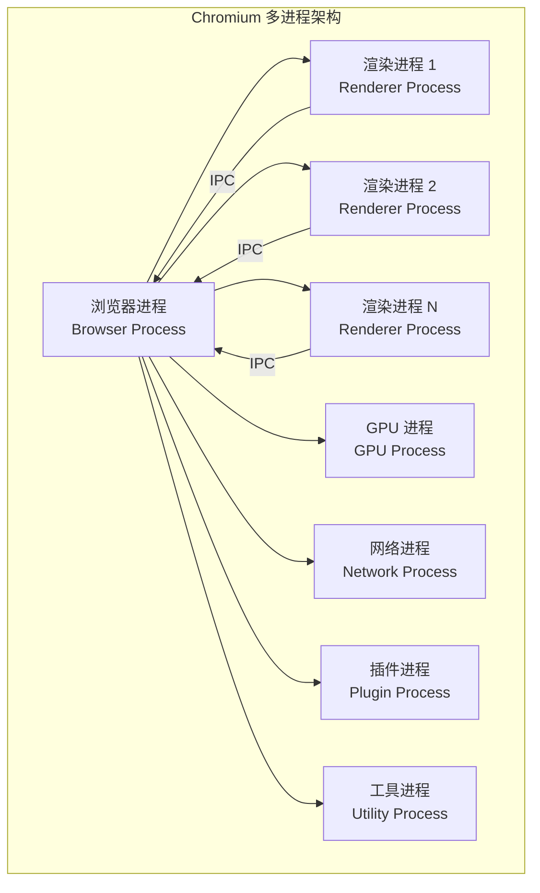
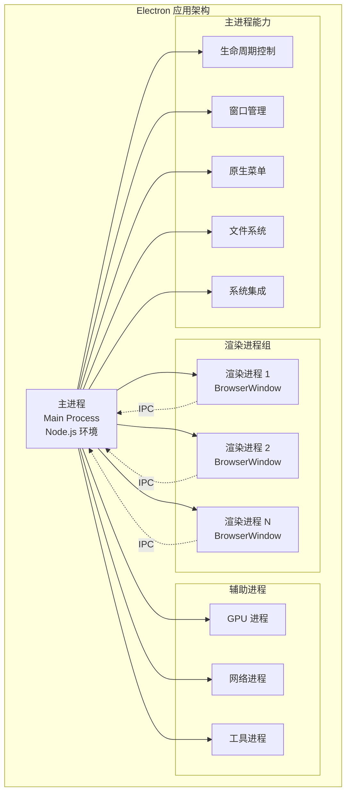
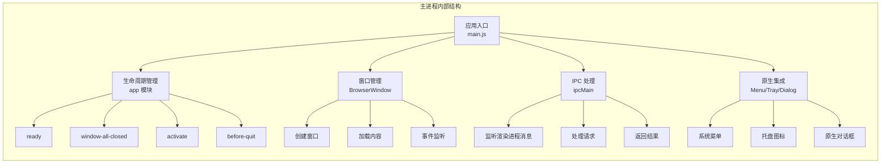
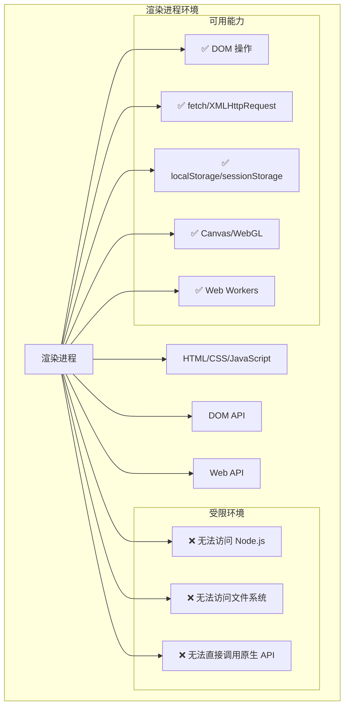
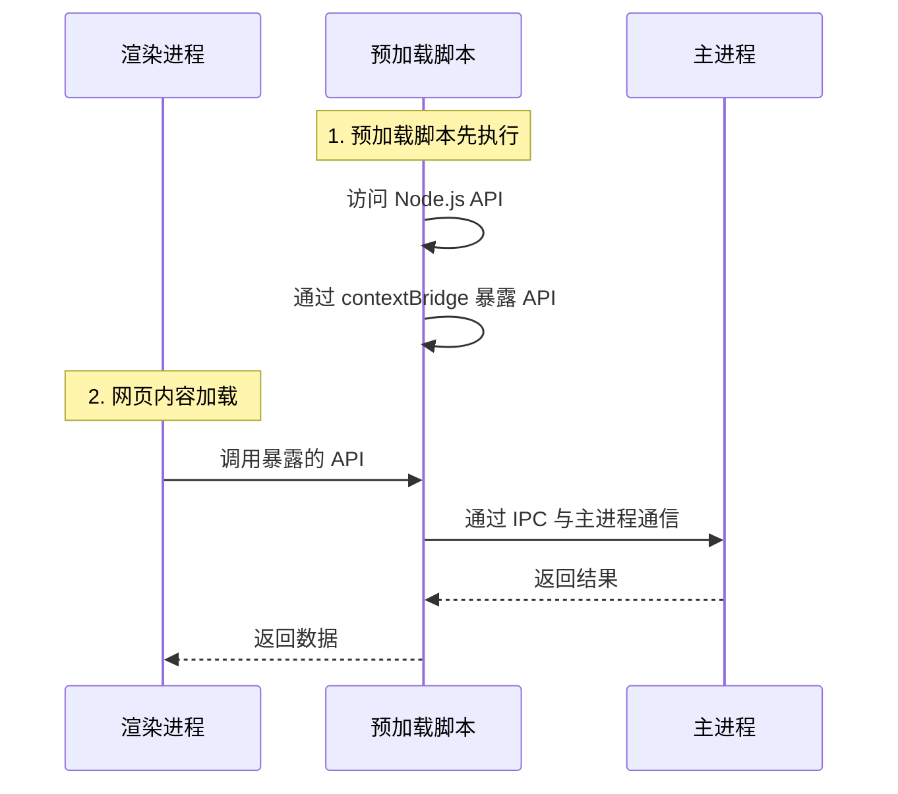
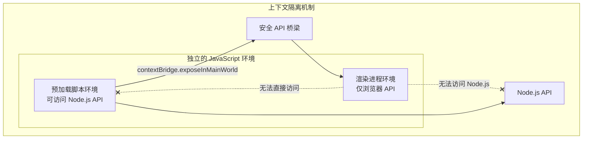
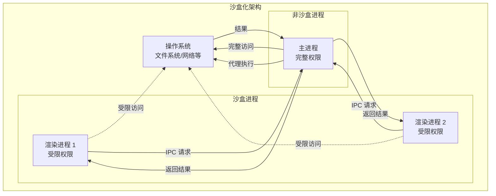
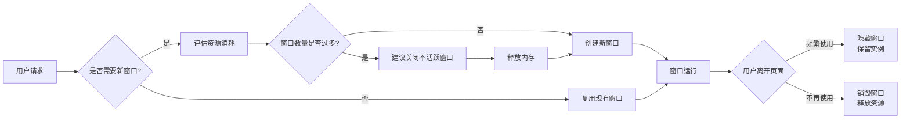

# 流程模型与进阶概念

本文档深入探讨 Electron 的流程模型、沙盒化机制、安全架构以及性能优化策略。建议先阅读 [02-基本概念](02-基本概念.md) 和 [05-主进程与渲染进程](05-主进程与渲染进程.md) 了解基础内容。

## 多进程架构深度解析

Electron 继承了来自 Chromium 的多进程架构，这使得此框架在架构上非常相似于一个现代的网页浏览器。

### 架构演进背景

网页浏览器是个极其复杂的应用程序。除了显示网页内容的主要能力之外，还有许多次要的职责，例如：管理众多窗口（或标签页）和加载第三方扩展。

**单进程模型的问题：**

在早期，浏览器通常使用单个进程来处理所有这些功能。虽然这种模式意味着打开每个标签页的开销较少，但也同时意味着一个网站的崩溃或无响应会影响到整个浏览器。

### Chromium 多进程架构

为了解决这个问题，Chrome 团队决定让每个标签页在自己的进程中渲染，从而限制了一个网页上的有误或恶意代码可能导致的对整个应用程序造成的伤害。然后用单个浏览器进程控制这些标签页进程，以及整个应用程序的生命周期。



### Electron 多进程模型

Electron 应用程序的结构非常相似。作为应用开发者，控制两种类型的进程：**主进程**和**渲染器进程**。这类似于上文所述的 Chrome 的浏览器和渲染器进程。



## 主进程详解

每个 Electron 应用都有一个单一的主进程，作为应用程序的入口点。主进程在 Node.js 环境中运行，这意味着它具有 `require` 模块和使用所有 Node.js API 的能力。

### 主进程架构图



### 窗口管理

`BrowserWindow` 类的每个实例创建一个应用程序窗口，且在单独的渲染器进程中加载一个网页。

```javascript
// main.js
const { BrowserWindow } = require("electron")
const path = require("path")

const win = new BrowserWindow({ 
  width: 800, 
  height: 600,
  webPreferences: {
    preload: path.join(__dirname, 'preload.js'),
    contextIsolation: true,
    nodeIntegration: false,
    sandbox: true
  }
})

win.loadURL("https://github.com")

const contents = win.webContents
console.log(contents)
```

由于 `BrowserWindow` 模块是一个 [`EventEmitter`](https://nodejs.org/api/events.html#events_class_eventemitter)，所以您也可以为各种用户事件（例如，最小化或最大化您的窗口）添加处理程序。当一个 `BrowserWindow` 实例被销毁时，与其相应的渲染器进程也会被终止。

### 原生 API

为了使 Electron 的功能不仅仅限于对网页内容的封装，主进程也添加了自定义的 API 来与用户的作业系统进行交互。Electron 有着多种控制原生桌面功能的模块，例如菜单、对话框以及托盘图标。

```javascript
// main.js - 原生 API 示例
const { app, BrowserWindow, Menu, Tray, dialog, Notification, shell } = require('electron')
const path = require('path')

let tray

app.whenReady().then(() => {
  // 创建窗口
  const win = new BrowserWindow({
    width: 1200,
    height: 800,
    webPreferences: {
      preload: path.join(__dirname, 'preload.js'),
      contextIsolation: true,
      sandbox: true
    }
  })
  
  win.loadFile('index.html')
  
  // 创建系统托盘
  tray = new Tray(path.join(__dirname, 'assets/icon.png'))
  const contextMenu = Menu.buildFromTemplate([
    { label: '显示窗口', click: () => win.show() },
    { label: '退出', click: () => app.quit() }
  ])
  tray.setToolTip('My Electron App')
  tray.setContextMenu(contextMenu)
  
  // 创建应用菜单
  const menuTemplate = [
    {
      label: '文件',
      submenu: [
        {
          label: '打开文件',
          click: async () => {
            const result = await dialog.showOpenDialog(win, {
              properties: ['openFile'],
              filters: [
                { name: '文本文件', extensions: ['txt', 'md'] },
                { name: '所有文件', extensions: ['*'] }
              ]
            })
            if (!result.canceled) {
              console.log('选择的文件:', result.filePaths[0])
            }
          }
        },
        { type: 'separator' },
        { role: 'quit' }
      ]
    },
    {
      label: '编辑',
      submenu: [
        { role: 'undo' },
        { role: 'redo' },
        { type: 'separator' },
        { role: 'cut' },
        { role: 'copy' },
        { role: 'paste' }
      ]
    }
  ]
  
  const menu = Menu.buildFromTemplate(menuTemplate)
  Menu.setApplicationMenu(menu)
  
  // 显示通知
  new Notification({
    title: '应用已启动',
    body: 'Electron 应用程序已成功启动'
  }).show()
})
```

## 渲染进程详解

每个 Electron 应用都会为每个打开的 `BrowserWindow`（与每个网页嵌入）生成一个单独的渲染进程。渲染进程负责**渲染**网页内容。所以实际上，运行于渲染进程中的代码是须遵照网页标准的（至少就目前使用的 Chromium 而言是如此）。

### 渲染进程环境特点



因此，一个浏览器窗口中的所有的用户界面和应用功能，都应与您在网页开发上使用相同的工具和规范来进行撰写。

虽然解释每一个网页规范超出了本指南的范围，但您最起码要知道的是：

- 以一个 HTML 文件作为渲染器进程的入口点
- 使用层叠样式表（Cascading Style Sheets, CSS）对 UI 添加样式
- 通过 `<script>` 元素可添加可执行的 JavaScript 代码

此外，这也意味着渲染器无权直接访问 `require` 或其他 Node.js API。为了在渲染器中直接包含 NPM 模块，您必须使用与在 web 开发时相同的打包工具（例如 `webpack` 或 `parcel`）。

::: danger
为了方便开发，可以用完整的 Node.js 环境生成渲染器进程。在历史上，这是默认的，但由于安全原因，这一功能已被禁用。
:::

### 安全配置对比

```javascript
// ❌ 不安全配置（已废弃）
const win = new BrowserWindow({
  webPreferences: {
    nodeIntegration: true,      // 允许渲染进程访问 Node.js
    contextIsolation: false,    // 禁用上下文隔离
    enableRemoteModule: true    // 启用远程模块
  }
})

// ✅ 安全配置（推荐）
const win = new BrowserWindow({
  webPreferences: {
    nodeIntegration: false,     // 禁用 Node.js 集成
    contextIsolation: true,     // 启用上下文隔离
    sandbox: true,              // 启用沙盒
    preload: path.join(__dirname, 'preload.js')
  }
})
```

## 预加载脚本 (Preload Script)

预加载脚本包含了那些执行于渲染进程中，且先于网页内容开始加载的代码。这些脚本虽运行于渲染进程的环境中，却因能访问 Node.js API 而拥有了更多的权限。预加载脚本可以在 `BrowserWindow` 构造方法中的 `webPreferences` 选项里被附加到主进程。

```javascript
// main.js
const { BrowserWindow } = require("electron")
const path = require("path")

const win = new BrowserWindow({
  webPreferences: {
    preload: path.join(__dirname, "preload.js"),
    contextIsolation: true,
    sandbox: true
  }
})
```

### Preload 脚本的作用



因为预加载脚本与浏览器共享同一个全局 [`Window`](https://developer.mozilla.org/en-US/docs/Web/API/Window) 接口，并且可以访问 Node.js API，所以它通过在全局 `window` 中暴露任意 API 来增强渲染器，以便你的网页内容使用。

#### 示例：使用预加载脚本

```javascript
// preload.js
const { contextBridge, ipcRenderer } = require("electron")

// ✅ 正确：通过 contextBridge 暴露安全的 API
contextBridge.exposeInMainWorld("electronAPI", {
  // 应用信息
  platform: process.platform,
  versions: process.versions,
  
  // IPC 通信
  send: (channel, data) => ipcRenderer.send(channel, data),
  invoke: (channel, data) => ipcRenderer.invoke(channel, data),
  
  // 事件监听
  on: (channel, callback) => {
    ipcRenderer.on(channel, (event, ...args) => callback(...args))
  }
})

// renderer.js
// 使用暴露的 API
console.log(window.electronAPI.platform)
console.log(window.electronAPI.versions)

// ❌ 错误：直接在 window 上添加属性（会被上下文隔离阻止）
// window.myAPI = 'some value' // 渲染进程无法访问
```

#### 完整示例

```javascript
// preload.js
const { contextBridge, ipcRenderer } = require("electron")

contextBridge.exposeInMainWorld("electronAPI", {
  // 文件操作
  readFile: (filePath) => ipcRenderer.invoke("read-file", filePath),
  writeFile: (filePath, content) => ipcRenderer.invoke("write-file", filePath, content),
  
  // 窗口控制
  minimize: () => ipcRenderer.send("window-minimize"),
  maximize: () => ipcRenderer.send("window-maximize"),
  close: () => ipcRenderer.send("window-close"),
  
  // 系统信息（只读）
  getSystemInfo: () => ({
    platform: process.platform,
    arch: process.arch,
    versions: {
      node: process.versions.node,
      chrome: process.versions.chrome,
      electron: process.versions.electron
    }
  }),
  
  // 事件监听
  onUpdateAvailable: (callback) => {
    ipcRenderer.on("update-available", (event, data) => callback(data))
  }
})
```

```javascript
// renderer.js
// 使用文件操作
async function loadFile() {
  const result = await window.electronAPI.readFile("/path/to/file.txt")
  if (result.success) {
    console.log("文件内容:", result.content)
  }
}

// 使用窗口控制
document.getElementById("minimize-btn").addEventListener("click", () => {
  window.electronAPI.minimize()
})

// 获取系统信息
const sysInfo = window.electronAPI.getSystemInfo()
console.log("系统信息:", sysInfo)

// 监听更新事件
window.electronAPI.onUpdateAvailable((data) => {
  console.log("有新版本:", data.version)
})
```

## 上下文隔离

上下文隔离功能将确保 `预加载` 脚本和 Electron 的内部逻辑运行在所加载的 [`webcontent`](https://www.electronjs.org/zh/docs/latest/api/web-contents) 网页之外的另一个独立的上下文环境里。这对安全性很重要，因为它有助于阻止网站访问 Electron 的内部组件和您的预加载脚本可访问的高等级权限的 API。

### 隔离机制详解



这意味着，实际上预加载脚本访问的 `window` 对象**并不是**网站所能访问的对象。例如在预加载脚本中设置 `window.hello = 'wave'` 并且启用了上下文隔离，当网站尝试访问 `window.hello` 对象时将返回 `undefined`。

自 Electron 12 以来，默认情况下已启用上下文隔离，并且它是**所有应用程序**推荐的安全设置。

### 示例对比

```javascript
// preload.js
// ❌ 不安全：直接修改 window 对象
window.myAPI = {
  readFile: (path) => require('fs').readFileSync(path, 'utf8')
}

// ✅ 安全：使用 contextBridge
const { contextBridge, ipcRenderer } = require("electron")

contextBridge.exposeInMainWorld("myAPI", {
  readFile: (path) => ipcRenderer.invoke("read-file", path)
})
```

```javascript
// renderer.js
// ❌ 不安全方式（上下文隔离禁用时）
// 网页可以访问整个 Node.js API
const fs = require('fs')
fs.readFileSync('/etc/passwd', 'utf8')

// ✅ 安全方式（上下文隔离启用时）
// 只能访问暴露的特定 API
const content = await window.myAPI.readFile('data.txt')
```

请阅读 `contextBridge` 的文档，以全面了解其限制。例如不能在 contextBridge 中暴露原型或者 Symbol。

### 安全事项

单单开启和使用 `contextIsolation` 并不直接意味着您所做的一切都是安全的。例如，此代码是**不安全的**：

```javascript
// preload.js
// ❌ 错误使用
contextBridge.exposeInMainWorld("myAPI", {
  send: ipcRenderer.send  // 直接暴露底层 API
})
```

直接暴露了一个没有任何参数过滤的高等级权限 API。这将允许任何网站发送任意的 IPC 消息，这不会是你希望发生的。相反，暴露进程间通信相关 API 的正确方法是为每一种通信消息提供一种实现方法：

```javascript
// preload.js
// ✅ 正确使用
contextBridge.exposeInMainWorld("myAPI", {
  loadPreferences: () => ipcRenderer.invoke("load-prefs"),
  savePreferences: (prefs) => ipcRenderer.invoke("save-prefs", prefs)
})
```

### contextBridge 限制

1. **不能暴露原型**

```javascript
// ❌ 不支持
contextBridge.exposeInMainWorld("api", {
  MyClass: class MyClass {}
})
```

2. **不能暴露 Symbol**

```javascript
// ❌ 不支持
const sym = Symbol('key')
contextBridge.exposeInMainWorld("api", {
  [sym]: 'value'
})
```

3. **只能传递可序列化数据**

```javascript
// ✅ 支持：基本类型、数组、对象、Promise
contextBridge.exposeInMainWorld("api", {
  getString: () => "hello",
  getNumber: () => 123,
  getObject: () => ({ key: "value" }),
  getArray: () => [1, 2, 3],
  getPromise: () => Promise.resolve("result")
})

// ✅ 函数支持：跨上下文代理调用（返回函数同样支持）
contextBridge.exposeInMainWorld("api", {
  getFunc: () => () => {}
})

// ❌ 不支持：函数上的自定义属性、Symbol、类与原型（会被丢弃）
```

### 与 TypeScript 一同使用

如果正在使用 TypeScript 构建 Electron 应用程序，需要给通过 context bridge 暴露的 API 添加类型。渲染进程的 `window` 对象将不会包含正确扩展类型，除非给其添加了[类型声明](https://www.typescriptlang.org/docs/handbook/declaration-files/introduction.html)。

```typescript
// preload.ts
import { contextBridge, ipcRenderer } from "electron"

contextBridge.exposeInMainWorld("electronAPI", {
  loadPreferences: () => ipcRenderer.invoke("load-prefs")
})
```

创建一个 `interface.d.ts` 类型声明文件，并且全局增强 `Window` 接口：

```typescript
// interface.d.ts
export interface IElectronAPI {
  loadPreferences: () => Promise<void>
  readFile: (path: string) => Promise<{ success: boolean; content?: string; error?: string }>
  writeFile: (path: string, content: string) => Promise<{ success: boolean; error?: string }>
}

declare global {
  interface Window {
    electronAPI: IElectronAPI
  }
}

// 使这个文件成为模块（如果需要）
export {}
```

以上所做皆是为了确保在您编写渲染进程的脚本时，TypeScript 编译器将会知晓 `electronAPI` 合适地在您的全局 `window` 对象中：

```typescript
// renderer.ts
// TypeScript 现在知道 electronAPI 的类型
const prefs = await window.electronAPI.loadPreferences()
const result = await window.electronAPI.readFile("data.txt")

// TypeScript 类型检查
window.electronAPI.nonExistentMethod() // ❌ 类型错误
```

## 进程沙盒化

`Chromium` 的一个关键安全特性是，进程可以在沙盒中执行。沙盒通过限制对大多数系统资源的访问来减少恶意代码可能造成的伤害 — 沙盒化的进程只能自由使用 CPU 周期和内存。为了执行需要额外权限的操作，沙盒处的进程通过专用通信渠道将任务下放给更大权限的进程。

### 沙盒化架构



在 Chromium 中，沙盒化应用于主进程以外的大多数进程。其中包括渲染进程，以及功能性进程，如音频服务、GPU 服务和网络服务。

从 Electron 20 开始，渲染进程默认启用了沙盒，无需进一步配置。如果想禁用某个进程的沙盒，请参阅 [为单个进程禁用沙盒](#为单个进程禁用沙盒) 部分。

### Electron 中的沙盒行为

在 Electron 中沙盒进程**大部分地**表现都与 Chromium 差不多，但因为介面是 Node.js 的关系 Electron 有一些额外的概念需要考虑。

#### 渲染进程

当 Electron 中的渲染进程被沙盒化时，它们的行为与常规 Chrome 渲染进程一样。一个沙盒化的渲染进程不会有一个 Node.js 环境。

因此在沙盒中，渲染进程只能透过**进程间通讯（inter-process communication, IPC）**委派任务给主进程的方式，来执行需权限的任务（例如：文件系统交互，对系统进行更改或生成子进程）。

```javascript
// ❌ 沙盒渲染进程中不可用
const fs = require('fs') // ReferenceError
const path = require('path') // ReferenceError

// ✅ 必须通过 IPC
const content = await window.electronAPI.readFile("data.txt")
```

#### 预加载脚本

为了让渲染进程能与主进程通信，附属于沙盒化的渲染进程的预加载脚本中仍可使用一部分以 Polyfill 形式实现的 Node.js API。有一个与 Node 中类似的 `require` 函数提供了出来，但只能载入 Electron 和 Node 内置模块的一个子集：

**可用模块（CommonJS）：**

- `electron` (渲染进程模块: `contextBridge`, `crashReporter`, `ipcRenderer`, `nativeImage`, `webFrame`, `webUtils`)
- [`events`](https://nodejs.org/api/events.html)
- [`timers`](https://nodejs.org/api/timers.html)
- [`url`](https://nodejs.org/api/url.html)

**可用模块（ESM import）：**

- [`events`](https://nodejs.org/api/events.html)
- [`timers`](https://nodejs.org/api/timers.html)
- [`url`](https://nodejs.org/api/url.html)

**可用全局对象：**

- [`Buffer`](https://nodejs.org/api/buffer.html)
- [`process`](https://www.electronjs.org/zh/docs/latest/api/process)
- [`clearImmediate`](https://nodejs.org/api/timers.html#timers_clearimmediate_immediate)
- [`setImmediate`](https://nodejs.org/api/timers.html#timers_setimmediate_callback_args)

::: warning
`require` 函数只是一个功能有限的 Polyfill 实现，并不支持把预加载脚本拆成多个文件然后作为 [CommonJS 模块](https://nodejs.org/api/modules.html#modules_modules_commonjs_modules) 来加载。若需要拆分预加载脚本的代码，可以使用 [webpack](https://webpack.js.org/) 或 [Parcel](https://parceljs.org/) 等打包工具。
:::

### 配置沙盒

对于大多数应用程序来说，沙盒是最佳选择。在某些与沙盒不兼容的使用情况下（例如，在渲染器中使用原生的 Node.js 模块时），可以禁用特定进程的沙盒。但这会带来安全风险，特别是当未受信任的代码或内容存在于未沙盒化的进程中时。

#### 启用沙盒（默认）

```javascript
// main.js - 默认已启用
const { app, BrowserWindow } = require("electron")

app.whenReady().then(() => {
  const win = new BrowserWindow({
    webPreferences: {
      sandbox: true,  // 默认值，可省略
      contextIsolation: true,
      nodeIntegration: false
    }
  })
  win.loadURL("https://example.com")
})
```

#### 为单个进程禁用沙盒

```javascript
// main.js
const { app, BrowserWindow } = require("electron")

app.whenReady().then(() => {
  // 特定窗口禁用沙盒
  const win = new BrowserWindow({
    webPreferences: {
      sandbox: false,  // ⚠️ 禁用沙盒
      contextIsolation: true,
      nodeIntegration: false
    }
  })
  win.loadURL("https://example.com")
})
```

::: danger
在渲染器中启用 `nodeIntegration` 时，沙盒也会被禁用。这会带来严重的安全风险：
:::

```javascript
// ⚠️ 危险配置：自动禁用沙盒
app.whenReady().then(() => {
  const win = new BrowserWindow({
    webPreferences: {
      nodeIntegration: true  // 自动禁用沙盒
    }
  })
  win.loadURL("https://example.com")
})
```

#### 全局启用沙盒

```javascript
// main.js
const { app, BrowserWindow } = require("electron")

// 全局启用沙盒，任何 sandbox: false 的设置都会被覆盖
app.enableSandbox()

app.whenReady().then(() => {
  const win = new BrowserWindow({
    webPreferences: {
      // 即使设置为 false，也会被 app.enableSandbox() 覆盖为 true
      sandbox: false
    }
  })
  win.loadURL("https://example.com")
})
```

### 沙盒化最佳实践

#### ✅ 推荐配置

```javascript
// main.js - 安全配置
const win = new BrowserWindow({
  webPreferences: {
    // 安全配置
    sandbox: true,
    contextIsolation: true,
    nodeIntegration: false,
    webSecurity: true,
    
    // Preload 脚本
    preload: path.join(__dirname, "preload.js")
  }
})
```

#### ⚠️ 混合使用

如果必须使用非沙盒进程，建议：

```javascript
// main.js
// 主窗口：沙盒化（安全）
const mainWindow = new BrowserWindow({
  webPreferences: {
    sandbox: true,
    preload: path.join(__dirname, "preload.js")
  }
})
mainWindow.loadFile("index.html")

// 特殊窗口：非沙盒（仅用于可信内容）
const trustedWindow = new BrowserWindow({
  webPreferences: {
    sandbox: false,
    nodeIntegration: false,  // 仍然禁用
    contextIsolation: true   // 仍然启用
  }
})
trustedWindow.loadFile("trusted-content.html")

// 限制非沙盒窗口的导航
trustedWindow.webContents.on("will-navigate", (event, url) => {
  // 只允许加载本地文件
  if (!url.startsWith("file://")) {
    event.preventDefault()
  }
})
```

## 性能考量

### 进程数量优化



### 内存管理

#### 主进程内存监控

```javascript
// main.js
function monitorMemory() {
  const usage = process.memoryUsage()
  console.log({
    rss: `${Math.round(usage.rss / 1024 / 1024)} MB`,
    heapTotal: `${Math.round(usage.heapTotal / 1024 / 1024)} MB`,
    heapUsed: `${Math.round(usage.heapUsed / 1024 / 1024)} MB`,
    external: `${Math.round(usage.external / 1024 / 1024)} MB`
  })
}

setInterval(monitorMemory, 30000) // 每30秒监控一次
```

#### 渲染进程内存优化

```javascript
// renderer.js
// 1. 及时清理事件监听器
class Component {
  constructor() {
    this.handleResize = this.handleResize.bind(this)
    window.addEventListener('resize', this.handleResize)
  }
  
  destroy() {
    window.removeEventListener('resize', this.handleResize)
  }
}

// 2. 使用虚拟列表减少 DOM 节点
class VirtualList {
  constructor(container, itemHeight, renderItem) {
    this.container = container
    this.itemHeight = itemHeight
    this.renderItem = renderItem
    this.items = []
    
    this.container.addEventListener('scroll', () => this.render())
  }
  
  setItems(items) {
    this.items = items
    this.render()
  }
  
  render() {
    const scrollTop = this.container.scrollTop
    const visibleStart = Math.floor(scrollTop / this.itemHeight)
    const visibleEnd = visibleStart + Math.ceil(this.container.clientHeight / this.itemHeight)
    
    // 只渲染可见区域
    const fragment = document.createDocumentFragment()
    for (let i = visibleStart; i <= visibleEnd && i < this.items.length; i++) {
      fragment.appendChild(this.renderItem(this.items[i], i))
    }
    this.container.innerHTML = ''
    this.container.appendChild(fragment)
  }
}

// 3. 使用 Web Workers 处理 CPU 密集型任务
const worker = new Worker('heavy-task.js')
worker.postMessage({ data: largeDataSet })
worker.onmessage = (e) => {
  console.log('处理结果:', e.data)
}
```

### 启动性能优化

```javascript
// main.js
const { app, BrowserWindow } = require("electron")

// 1. 延迟加载非必要模块
async function loadHeavyModule() {
  const module = await import("./heavy-module.js")
  return module
}

// 2. 使用 ready-to-show 事件
function createWindow() {
  const win = new BrowserWindow({
    show: false,  // 初始不显示
    backgroundColor: "#ffffff",
    webPreferences: {
      preload: path.join(__dirname, "preload.js")
    }
  })
  
  win.loadFile("index.html")
  
  // 页面加载完成后显示
  win.once("ready-to-show", () => {
    win.show()
  })
}

// 3. 预加载优化
app.on("ready", async () => {
  // 并行初始化
  await Promise.all([
    createWindow(),
    loadHeavyModule(),
    initializeDatabase()
  ])
})
```

### IPC 性能优化

```javascript
// ❌ 避免：频繁的小数据传输
for (let i = 0; i < 1000; i++) {
  ipcRenderer.send("update-item", items[i])
}

// ✅ 推荐：批量传输
ipcRenderer.send("update-items", items)

// ❌ 避免：传输大量不必要的数据
ipcRenderer.invoke("get-user", { includeAllFields: true })

// ✅ 推荐：只传输需要的字段
ipcRenderer.invoke("get-user", { fields: ["id", "name"] })
```

## 常见问题与解决方案

### Q1: 如何在沙盒环境中使用原生模块？

**A:** 原生模块需要在主进程中加载，然后通过 IPC 暴露接口：

```javascript
// main.js
const nativeModule = require("native-module")

ipcMain.handle("native-operation", async (event, data) => {
  return nativeModule.doSomething(data)
})

// preload.js
contextBridge.exposeInMainWorld("nativeAPI", {
  doSomething: (data) => ipcRenderer.invoke("native-operation", data)
})
```

### Q2: 如何调试沙盒问题？

**A:** 使用 `--no-sandbox` 参数临时禁用沙盒进行调试：

```bash
electron --no-sandbox .
```

但**不要在生产环境中使用**！

### Q3: 如何处理跨域请求？

**A:** 在主进程中配置 `webRequest`：

```javascript
// main.js
const { session } = require("electron")

app.whenReady().then(() => {
  session.defaultSession.webRequest.onBeforeSendHeaders(
    (details, callback) => {
      callback({
        requestHeaders: {
          ...details.requestHeaders,
          "Origin": "*"
        }
      })
    }
  )
})
```

或使用 `webSecurity: false`（不推荐，有安全风险）。

### Q4: 如何实现单实例应用？

**A:** 使用 `app.requestSingleInstanceLock()`：

```javascript
// main.js
const gotTheLock = app.requestSingleInstanceLock()

if (!gotTheLock) {
  app.quit()
} else {
  app.on("second-instance", (event, commandLine, workingDirectory) => {
    // 当第二个实例启动时，聚焦到已有窗口
    if (mainWindow) {
      if (mainWindow.isMinimized()) mainWindow.restore()
      mainWindow.focus()
    }
  })
  
  app.whenReady().then(() => {
    createWindow()
  })
}
```

## 最佳实践清单

### 安全清单

- [ ] 启用 `contextIsolation: true`
- [ ] 启用 `sandbox: true`
- [ ] 禁用 `nodeIntegration: false`
- [ ] 使用 `contextBridge` 暴露有限的 API
- [ ] 启用 `webSecurity: true`
- [ ] 设置 CSP (Content Security Policy)
- [ ] 验证所有 IPC 数据
- [ ] 限制导航范围（仅允许可信 URL）

### 性能清单

- [ ] 使用 `ready-to-show` 事件优化窗口显示
- [ ] 避免在渲染进程中执行 CPU 密集型操作
- [ ] 使用虚拟列表处理大量数据
- [ ] 及时清理不使用的窗口引用
- [ ] 批量处理 IPC 通信
- [ ] 监控内存使用情况

### 开发清单

- [ ] 使用 TypeScript 增强类型安全
- [ ] 统一错误处理机制
- [ ] 记录 IPC 消息用于调试
- [ ] 使用 VSCode 调试配置
- [ ] 定期进行安全审计

## 相关文档

- [02-基本概念](02-基本概念.md)
- [05-主进程与渲染进程](05-主进程与渲染进程.md)
- [进程间通信](../04-进程通信与API/01-IPC基础.md)
- [安全最佳实践](../07-打包与质量/04-安全最佳实践.md)
- [性能优化](../07-打包与质量/05-性能优化.md)
