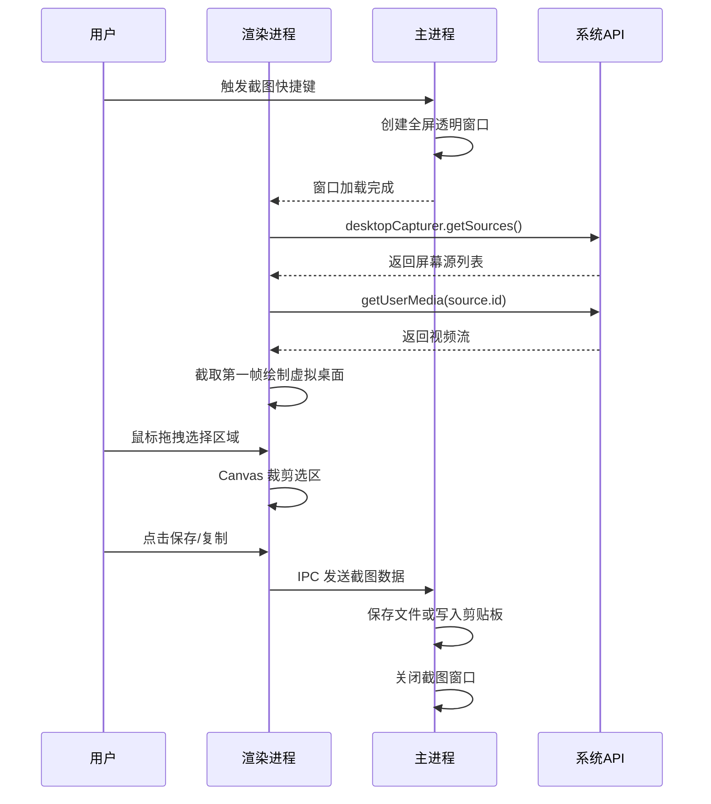

# 屏幕截图

桌面应用的屏幕截图功能是提升用户体验的关键一环。在 Electron 中，实现截图主要有两种方案：

- **使用 Electron API**：通过 Electron 内置的 `desktopCapturer` API 获取屏幕或窗口的图像源，再结合 Web API `navigator.mediaDevices.getUserMedia` 捕获屏幕视频流，最后通过 Canvas 进行区域裁剪和编辑。这种方法灵活度高，可定制性强
- **调用系统或第三方工具**：利用 Node.js 的子进程（`child_process`）执行操作系统自带的截图命令（如 macOS 的 `screencapture`）或第三方截图工具（如 Windows 上的 `ScreenCapture.exe`）。这种方法实现简单，但定制性较差

## 系统架构

```
┌─────────────────────────────────────────────────────────┐
│                   屏幕截图系统                          │
├─────────────────────────────────────────────────────────┤
│                                                         │
│  ┌──────────────┐  ┌──────────────┐  ┌──────────────┐ │
│  │  图像源获取   │  │  视频流捕获   │  │  图像处理    │ │
│  ├──────────────┤  ├──────────────┤  ├──────────────┤ │
│  │desktopCaptur│  │ getUserMedia │  │ Canvas API   │ │
│  │ getSources  │  │ video.mandato│  │ drawImage    │ │
│  │             │  │ ry           │  │ toDataURL    │ │
│  └──────────────┘  └──────────────┘  └──────────────┘ │
│                                                         │
├─────────────────────────────────────────────────────────┤
│                   用户交互层                            │
│  • 截图窗口      • 选区绘制      • 编辑工具             │
│  • 快捷键        • 文件保存      • 剪贴板               │
└─────────────────────────────────────────────────────────┘
```

## Electron API 实现

此方案完全基于 Web 技术和 Electron API，不依赖外部工具，具有良好的跨平台一致性和高度的可定制性。

### 核心 API

#### desktopCapturer API

`desktopCapturer` 是 Electron 提供的模块，用于获取桌面上可用的视频和音频源，例如单个窗口或整个桌面。

**方法**：

| 方法 | 参数 | 返回值 | 说明 |
|------|------|--------|------|
| `getSources(options)` | Object | Promise<DesktopCapturerSource[]> | 获取可用的桌面源 |

**options 参数**：

| 参数 | 类型 | 默认值 | 说明 |
|------|------|--------|------|
| `types` | String[] | - | 源类型: 'screen', 'window' |
| `thumbnailSize` | Size | {width: 150, height: 150} | 缩略图尺寸 |
| `fetchWindowIcons` | Boolean | false | 是否获取窗口图标 |

**DesktopCapturerSource 对象**：

| 属性 | 类型 | 描述 |
|------|------|------|
| `id` | String | 捕获源的唯一标识，用于 `getUserMedia` |
| `name` | String | 捕获源的名称（如"Entire screen"或应用名称） |
| `thumbnail` | NativeImage | 屏幕或窗口的缩略图 |
| `display_id` | String | 显示器的唯一标识 |
| `appIcon` | NativeImage | 应用图标（fetchWindowIcons: true 时） |

#### navigator.mediaDevices.getUserMedia

`navigator.mediaDevices.getUserMedia()` 是 Web API，允许网页或应用程序访问用户的摄像头和麦克风，以便获取视频流、音频流或者二者的组合。

**基本用法**：

```html
<video style="width: 100vw;height: 100vh" autoplay></video>

<script>
  navigator.mediaDevices.getUserMedia({video: true}).then((stream) => {
    const video = document.querySelector('video');
    // 为 video 标签添加实时视频流
    video.srcObject = stream;
  
    // 当浏览器已经获取了视频的基本元数据（比如视频的长度、尺寸、帧率等信息），并已准备好开始播放时，这个事件就会被触发。
    video.onloadedmetadata = function(e) {
      // todo
    };
  }).catch((e) => {
    // 异常处理
    console.log('Reeeejected!', e);
  });
</script>
```

**捕获屏幕视频流**：

```javascript
navigator.mediaDevices.getUserMedia({
  audio: false,
  video: {
    mandatory: {
      // 视频源来自 desktop
      chromeMediaSource: 'desktop',
      // 屏幕 id
      chromeMediaSourceId: id,
      // 指定尺寸
      minWidth: 1280,  
      maxWidth: 1920,  
      minHeight: 720,  
      maxHeight: 1080
    }
  }
})
```

### 实现步骤

#### 步骤 1：获取屏幕源

在渲染进程中调用 `desktopCapturer.getSources` 获取所有可用的屏幕源（注意：Electron 17 起 `getSources` 只能在主进程调用，渲染进程需通过 IPC 请求，或改用 `navigator.mediaDevices.getDisplayMedia`）：

```javascript
const { desktopCapturer, screen } = require('electron')

async function getScreenSources() {
  try {
    const sources = await desktopCapturer.getSources({
      types: ['screen', 'window'],
      thumbnailSize: { width: 800, height: 600 }
    })
    
    // 获取所有显示器信息
    const displays = screen.getAllDisplays()
    
    // 关联屏幕源和显示器信息
    const screenSources = sources.map(source => {
      const display = displays.find(d => 
        String(d.id) === source.display_id
      )
      
      return {
        id: source.id,
        name: source.name,
        thumbnail: source.thumbnail.toDataURL(),
        display: display,
        bounds: display ? display.bounds : null,
        scaleFactor: display ? display.scaleFactor : 1
      }
    })
    
    return screenSources
  } catch (error) {
    console.error('获取屏幕源失败:', error)
    return []
  }
}
```

#### 步骤 2：获取媒体流

将获取到的屏幕源 `id` 传递给 `navigator.mediaDevices.getUserMedia`：

```javascript
async function captureScreen(sourceId, display) {
  try {
    const stream = await navigator.mediaDevices.getUserMedia({
      audio: false,
      video: {
        mandatory: {
          chromeMediaSource: 'desktop',
          chromeMediaSourceId: sourceId,
          minWidth: display.bounds.width,
          maxWidth: display.bounds.width * display.scaleFactor,
          minHeight: display.bounds.height,
          maxHeight: display.bounds.height * display.scaleFactor
        }
      }
    })
    
    return stream
  } catch (error) {
    console.error('捕获屏幕失败:', error)
    throw error
  }
}
```

#### 步骤 3：创建截图窗口

为每个显示器创建一个全屏、透明、置顶的 `BrowserWindow`：

```javascript
// main.js
const { BrowserWindow, screen } = require('electron')

function createScreenshotWindows() {
  const displays = screen.getAllDisplays()
  const windows = []
  
  displays.forEach(display => {
    const window = new BrowserWindow({
      fullscreen: true,
      width: display.bounds.width,
      height: display.bounds.height,
      x: display.bounds.x,
      y: display.bounds.y,
      frame: false,
      transparent: true,
      movable: false,
      resizable: false,
      hasShadow: false,
      enableLargerThanScreen: true,
      webPreferences: {
        nodeIntegration: true,
        contextIsolation: false,
        webSecurity: false
      }
    })
    
    // 设置置顶
    window.setAlwaysOnTop(true, 'screen-saver')
    
    // 加载截图页面
    window.loadFile('screenshot.html')
    
    windows.push(window)
  })
  
  return windows
}
```

#### 步骤 4：绘制虚拟桌面

将捕获到的视频流在截图窗口中播放，并截取第一帧图像：

```javascript
async function captureAndDraw() {
  const sources = await getScreenSources()
  
  for (const source of sources) {
    const stream = await captureScreen(source.id, source.display)
    
    // 创建 video 元素
    const video = document.createElement('video')
    video.srcObject = stream
    video.style.visibility = 'hidden'
    document.body.appendChild(video)
    
    video.onloadedmetadata = () => {
      video.play()
      
      // 创建 canvas 并绘制第一帧
      const canvas = document.createElement('canvas')
      const ratio = window.devicePixelRatio || 1
      
      canvas.width = source.bounds.width * ratio
      canvas.height = source.bounds.height * ratio
      canvas.style.width = source.bounds.width + 'px'
      canvas.style.height = source.bounds.height + 'px'
      
      const ctx = canvas.getContext('2d')
      ctx.scale(ratio, ratio)
      
      // 绘制视频帧
      ctx.drawImage(video, 0, 0, source.bounds.width, source.bounds.height)
      
      // 停止视频流
      stream.getTracks().forEach(track => track.stop())
      video.remove()
      
      // 设置为背景图
      const imgElement = document.getElementById('screenImg')
      imgElement.src = canvas.toDataURL('image/png')
    }
  }
}
```

#### 步骤 5：实现截图交互

监听鼠标事件绘制截图选区：

```html
<!-- 截图页面 HTML -->
<!DOCTYPE html>
<html>
<head>
  <style>
    * {
      margin: 0;
      padding: 0;
    }
    
    body {
      overflow: hidden;
      cursor: crosshair;
    }
    
    /* 图像层 */
    .screen-img {
      position: fixed;
      left: 0;
      top: 0;
      width: 100vw;
      height: 100vh;
      z-index: 1;
    }
    
    /* 蒙版层 */
    .mask {
      position: fixed;
      left: 0;
      top: 0;
      width: 100vw;
      height: 100vh;
      background: rgba(0, 0, 0, 0.3);
      z-index: 2;
    }
    
    /* 操作层（选区） */
    .selection {
      position: fixed;
      border: 2px solid #1890ff;
      background: transparent;
      z-index: 3;
      display: none;
      box-shadow: 0 0 0 9999px rgba(0, 0, 0, 0.5);
    }
    
    /* 尺寸提示 */
    .size-tip {
      position: absolute;
      top: -30px;
      left: 0;
      background: #1890ff;
      color: white;
      padding: 2px 8px;
      font-size: 12px;
      border-radius: 2px;
      white-space: nowrap;
    }
    
    /* 工具栏 */
    .toolbar {
      position: fixed;
      background: white;
      border-radius: 4px;
      box-shadow: 0 2px 8px rgba(0,0,0,0.15);
      padding: 8px;
      display: none;
      z-index: 4;
    }
    
    .toolbar button {
      margin: 0 4px;
      padding: 6px 12px;
      border: 1px solid #d9d9d9;
      background: white;
      cursor: pointer;
      border-radius: 4px;
    }
    
    .toolbar button:hover {
      border-color: #1890ff;
      color: #1890ff;
    }
  </style>
</head>
<body>
  <!-- 图像层 -->
  
  
  <!-- 蒙版层 -->
  <div id="mask" class="mask"></div>
  
  <!-- 选区层 -->
  <div id="selection" class="selection">
    <div class="size-tip" id="sizeTip">0 x 0</div>
  </div>
  
  <!-- 工具栏 -->
  <div id="toolbar" class="toolbar">
    <button id="cancelBtn">取消</button>
    <button id="saveBtn">保存</button>
    <button id="copyBtn">复制</button>
  </div>
  
  <script>
    // 截图逻辑
    let isSelecting = false
    let startX = 0
    let startY = 0
    let selection = null
    let canvas = null
    let ctx = null
    
    // 鼠标按下
    document.addEventListener('mousedown', (e) => {
      isSelecting = true
      startX = e.clientX
      startY = e.clientY
      
      selection = document.getElementById('selection')
      selection.style.display = 'block'
      selection.style.left = startX + 'px'
      selection.style.top = startY + 'px'
      selection.style.width = '0'
      selection.style.height = '0'
      
      // 隐藏工具栏
      document.getElementById('toolbar').style.display = 'none'
    })
    
    // 鼠标移动
    document.addEventListener('mousemove', (e) => {
      if (!isSelecting) return
      
      const currentX = e.clientX
      const currentY = e.clientY
      
      const left = Math.min(startX, currentX)
      const top = Math.min(startY, currentY)
      const width = Math.abs(currentX - startX)
      const height = Math.abs(currentY - startY)
      
      selection.style.left = left + 'px'
      selection.style.top = top + 'px'
      selection.style.width = width + 'px'
      selection.style.height = height + 'px'
      
      // 更新尺寸提示
      const sizeTip = document.getElementById('sizeTip')
      sizeTip.textContent = `${width} x ${height}`
    })
    
    // 鼠标释放
    document.addEventListener('mouseup', (e) => {
      if (!isSelecting) return
      
      isSelecting = false
      
      const rect = selection.getBoundingClientRect()
      
      if (rect.width < 5 || rect.height < 5) {
        // 选区太小，取消
        selection.style.display = 'none'
        return
      }
      
      // 显示工具栏
      const toolbar = document.getElementById('toolbar')
      toolbar.style.display = 'block'
      toolbar.style.left = (rect.left + rect.width / 2 - 100) + 'px'
      toolbar.style.top = (rect.bottom + 10) + 'px'
      
      // 截取选区图像
      captureSelection(rect)
    })
    
    // 截取选区图像
    function captureSelection(rect) {
      const img = document.getElementById('screenImg')
      const ratio = window.devicePixelRatio || 1
      
      canvas = document.createElement('canvas')
      canvas.width = rect.width * ratio
      canvas.height = rect.height * ratio
      
      ctx = canvas.getContext('2d')
      ctx.scale(ratio, ratio)
      
      // 从背景图中截取选区
      ctx.drawImage(
        img,
        rect.left * ratio,
        rect.top * ratio,
        rect.width * ratio,
        rect.height * ratio,
        0,
        0,
        rect.width,
        rect.height
      )
    }
    
    // 保存截图
    document.getElementById('saveBtn').addEventListener('click', async () => {
      const dataUrl = canvas.toDataURL('image/png')
      // 发送给主进程保存
      const { ipcRenderer } = require('electron')
      await ipcRenderer.invoke('screenshot:save', dataUrl)
      window.close()
    })
    
    // 复制到剪贴板
    document.getElementById('copyBtn').addEventListener('click', async () => {
      const dataUrl = canvas.toDataURL('image/png')
      const { ipcRenderer } = require('electron')
      await ipcRenderer.invoke('screenshot:copy', dataUrl)
      window.close()
    })
    
    // 取消
    document.getElementById('cancelBtn').addEventListener('click', () => {
      window.close()
    })
    
    // ESC 键取消
    document.addEventListener('keydown', (e) => {
      if (e.key === 'Escape') {
        window.close()
      }
    })
    
    // 初始化
    captureAndDraw()
  </script>
</body>
</html>
```

### 主进程处理

```javascript
// main.js
const { app, BrowserWindow, ipcMain, dialog, clipboard, nativeImage } = require('electron')
const path = require('path')
const fs = require('fs')

let screenshotWindows = []

// 开始截图
ipcMain.handle('screenshot:start', async () => {
  // 关闭之前的截图窗口
  closeScreenshotWindows()
  
  // 创建新的截图窗口
  screenshotWindows = createScreenshotWindows()
  
  return true
})

// 保存截图
ipcMain.handle('screenshot:save', async (event, dataUrl) => {
  const result = await dialog.showSaveDialog({
    title: '保存截图',
    defaultPath: `screenshot-${Date.now()}.png`,
    filters: [
      { name: 'PNG 图片', extensions: ['png'] },
      { name: 'JPEG 图片', extensions: ['jpg', 'jpeg'] }
    ]
  })
  
  if (!result.canceled && result.filePath) {
    const image = nativeImage.createFromDataURL(dataUrl)
    const buffer = image.toPNG()
    
    fs.writeFileSync(result.filePath, buffer)
    
    closeScreenshotWindows()
    
    return { success: true, path: result.filePath }
  }
  
  return { success: false }
})

// 复制到剪贴板
ipcMain.handle('screenshot:copy', async (event, dataUrl) => {
  const image = nativeImage.createFromDataURL(dataUrl)
  clipboard.writeImage(image)
  
  closeScreenshotWindows()
  
  return { success: true }
})

// 关闭截图窗口
function closeScreenshotWindows() {
  screenshotWindows.forEach(window => {
    if (!window.isDestroyed()) {
      window.close()
    }
  })
  screenshotWindows = []
}

// 注册快捷键
const { globalShortcut } = require('electron')

app.whenReady().then(() => {
  // 注册截图快捷键（直接触发截图窗口创建，而非 ipcMain.handle）
  globalShortcut.register('CommandOrControl+Shift+A', async () => {
    closeScreenshotWindows()
    screenshotWindows = createScreenshotWindows()
  })
})

app.on('will-quit', () => {
  globalShortcut.unregisterAll()
})
```

### 完整示例代码

完整代码见：[github.com/muwoo/desktop-capture-demo](https://github.com/muwoo/desktop-capture-demo)

### 流程图



### 优缺点分析

**优点**：

| 优点 | 说明 |
|------|------|
| **高度可定制** | 截图界面纯前端实现，可添加画笔、取色器、文字标注等高级功能 |
| **跨平台一致性** | 不依赖特定操作系统，在 Windows、macOS 和 Linux 上表现基本一致 |
| **无需外部依赖** | 完全基于 Electron 和 Web API，不需要打包额外的可执行文件 |

**缺点**：

| 缺点 | 说明 |
|------|------|
| **性能开销** | 创建和管理多个截图窗口会消耗系统资源，高分辨率屏幕可能有性能瓶颈 |
| **体验问题** | macOS 上模拟的全屏窗口可能被用户意外滑动，影响体验 |
| **Linux 兼容性** | 由于历史原因，`desktopCapturer` 在 Linux 上可能无法区分多个显示器 |

## 方案二：调用系统工具

此方案利用 Electron 可以执行本地命令的能力，实现简单快捷。

### macOS 实现

macOS 自带强大的 `screencapture` 命令行工具：

```javascript
// main.js
import { clipboard } from "electron"
import { exec } from "child_process"

export const captureScreen = () => {
  // -i: 交互式截图
  // -c: 将结果复制到剪贴板
  // -s: 只在选择窗口模式下截图
  // -x: 不播放声音
  exec("screencapture -i -c -x", (error, stdout, stderr) => {
    if (error) {
      console.error("截图失败:", error)
      return
    }
    
    // 从剪贴板读取图片
    const image = clipboard.readImage()
    if (!image.isEmpty()) {
      // 将图片转换为DataURL并发送给渲染进程
      mainWindow.webContents.send("screenshot-captured", image.toDataURL())
    }
  })
}

// 截取全屏
export const captureFullScreen = () => {
  exec("screencapture -c -x", (error) => {
    if (!error) {
      const image = clipboard.readImage()
      if (!image.isEmpty()) {
        mainWindow.webContents.send("screenshot-captured", image.toDataURL())
      }
    }
  })
}

// 截取窗口（-l 需要指定窗口 ID，可通过 osascript 获取）
export const captureWindow = () => {
  exec("screencapture -l <windowid> -c -x", (error) => {
    if (!error) {
      const image = clipboard.readImage()
      if (!image.isEmpty()) {
        mainWindow.webContents.send("screenshot-captured", image.toDataURL())
      }
    }
  })
}
```

**screencapture 命令选项**：

| 选项 | 说明 |
|------|------|
| `-c` | 将截图保存到剪贴板 |
| `-i` | 交互式模式 |
| `-m` | 只捕获主显示器 |
| `-D <display>` | 捕获指定显示器 |
| `-l <windowid>` | 捕获指定窗口 |
| `-o` | 不包含窗口阴影 |
| `-p` | 打开预览 |
| `-x` | 不播放声音 |
| `-s` | 只在选择模式下截图 |
| `-t <format>` | 输出格式: png, jpg, pdf, tiff |
| `-T <seconds>` | 延迟截图 |

### Windows 实现

Windows 没有统一的截图命令行工具，但可以借助第三方开源工具：

```javascript
// main.js
import { clipboard } from "electron"
import { execFile } from "child_process"
import path from "path"

export const captureScreen = (cb) => {
  // 解析第三方截图工具的路径
  const executablePath = path.resolve(__static, "ScreenCapture.exe")

  // 执行截图工具
  execFile(executablePath, (error, stdout, stderr) => {
    if (error) {
      console.error("截图失败:", error)
      return
    }

    // 从剪贴板读取图片
    const image = clipboard.readImage()
    // 通过回调函数返回DataURL
    cb(image.isEmpty() ? "" : image.toDataURL())
  })
}
```

**推荐工具**：
- [ShareX](https://getsharex.com/) - 功能强大的截图工具
- [Snipaste](https://www.snipaste.com/) - 简洁好用的截图工具
- 自定义的 ScreenCapture.exe

**打包配置**：

```json
// package.json
{
  "build": {
    "extraResources": [
      {
        "from": "static/ScreenCapture.exe",
        "to": "ScreenCapture.exe"
      }
    ]
  }
}
```

### Linux 实现

Linux 可以使用 `gnome-screenshot` 或 `scrot`：

```javascript
// main.js
import { clipboard, nativeImage } from "electron"
import { exec } from "child_process"

export const captureScreen = () => {
  // 使用 gnome-screenshot（GNOME 桌面环境）
  exec("gnome-screenshot -a -c", (error) => {
    if (error) {
      console.error("截图失败:", error)
      
      // 尝试使用 scrot
      exec("scrot -s /tmp/screenshot.png", (err) => {
        if (!err) {
          const image = nativeImage.createFromPath('/tmp/screenshot.png')
          if (!image.isEmpty()) {
            mainWindow.webContents.send("screenshot-captured", image.toDataURL())
          }
        }
      })
      return
    }
    
    const image = clipboard.readImage()
    if (!image.isEmpty()) {
      mainWindow.webContents.send("screenshot-captured", image.toDataURL())
    }
  })
}
```

**Linux 截图工具**：

| 工具 | 命令 | 说明 |
|------|------|------|
| gnome-screenshot | `gnome-screenshot -a -c` | GNOME 桌面环境自带 |
| scrot | `scrot -s filename` | 轻量级截图工具 |
| spectacle | `spectacle -r -c` | KDE 桌面环境自带 |
| flameshot | `flameshot gui` | 功能丰富的截图工具 |

### 优缺点分析

**优点**：

| 优点 | 说明 |
|------|------|
| **实现简单** | 只需几行代码即可调用系统功能，开发成本低 |
| **性能好** | 直接使用原生工具，性能和稳定性有保障 |
| **系统级功能** | 可以利用系统截图工具的所有功能 |

**缺点**：

| 缺点 | 说明 |
|------|------|
| **定制性差** | 无法自定义截图工具栏、添加标注等功能 |
| **依赖外部文件** | Windows 需要依赖第三方 `.exe` 文件，增加打包复杂性 |
| **跨平台差异** | 不同平台需要不同的实现方式 |

## 扩展功能

### 屏幕录制

除了截图，`desktopCapturer` 还可以用于屏幕录制：

```javascript
const { desktopCapturer } = require('electron')

async function startRecording(sourceId) {
  try {
    const stream = await navigator.mediaDevices.getUserMedia({
      audio: {
        mandatory: {
          chromeMediaSource: 'desktop'
        }
      },
      video: {
        mandatory: {
          chromeMediaSource: 'desktop',
          chromeMediaSourceId: sourceId,
          minWidth: 1280,
          maxWidth: 1920,
          minHeight: 720,
          maxHeight: 1080
        }
      }
    })
    
    // 创建 MediaRecorder
    const mediaRecorder = new MediaRecorder(stream, {
      mimeType: 'video/webm;codecs=vp9'
    })
    
    const chunks = []
    
    mediaRecorder.ondataavailable = (e) => {
      chunks.push(e.data)
    }
    
    mediaRecorder.onstop = () => {
      const blob = new Blob(chunks, { type: 'video/webm' })
      const url = URL.createObjectURL(blob)
      
      // 保存或播放视频
      const a = document.createElement('a')
      a.href = url
      a.download = `screen-recording-${Date.now()}.webm`
      a.click()
    }
    
    // 开始录制
    mediaRecorder.start(1000)
    
    // 录制 10 秒后停止
    setTimeout(() => {
      mediaRecorder.stop()
      stream.getTracks().forEach(track => track.stop())
    }, 10000)
    
    return mediaRecorder
  } catch (error) {
    console.error('录制失败:', error)
  }
}
```

### 截图编辑工具

为截图添加编辑功能：

```javascript
// 添加画笔工具
class DrawingTool {
  constructor(canvas) {
    this.canvas = canvas
    this.ctx = canvas.getContext('2d')
    this.isDrawing = false
    this.color = '#ff0000'
    this.lineWidth = 3
    this.lastX = 0
    this.lastY = 0
  }
  
  start(x, y) {
    this.isDrawing = true
    this.lastX = x
    this.lastY = y
  }
  
  draw(x, y) {
    if (!this.isDrawing) return
    
    this.ctx.beginPath()
    this.ctx.strokeStyle = this.color
    this.ctx.lineWidth = this.lineWidth
    this.ctx.lineCap = 'round'
    this.ctx.lineJoin = 'round'
    
    this.ctx.moveTo(this.lastX, this.lastY)
    this.ctx.lineTo(x, y)
    this.ctx.stroke()
    
    this.lastX = x
    this.lastY = y
  }
  
  stop() {
    this.isDrawing = false
  }
  
  setColor(color) {
    this.color = color
  }
  
  setLineWidth(width) {
    this.lineWidth = width
  }
}

// 添加文字标注
class TextTool {
  constructor(canvas) {
    this.canvas = canvas
    this.ctx = canvas.getContext('2d')
  }
  
  addText(x, y, text, options = {}) {
    const {
      color = '#000000',
      fontSize = 16,
      fontFamily = 'Arial'
    } = options
    
    this.ctx.font = `${fontSize}px ${fontFamily}`
    this.ctx.fillStyle = color
    this.ctx.fillText(text, x, y)
  }
}

// 添加箭头工具
class ArrowTool {
  constructor(canvas) {
    this.canvas = canvas
    this.ctx = canvas.getContext('2d')
  }
  
  draw(startX, startY, endX, endY, color = '#ff0000', lineWidth = 3) {
    const headLength = 15
    const angle = Math.atan2(endY - startY, endX - startX)
    
    this.ctx.beginPath()
    this.ctx.strokeStyle = color
    this.ctx.lineWidth = lineWidth
    
    // 画线
    this.ctx.moveTo(startX, startY)
    this.ctx.lineTo(endX, endY)
    
    // 画箭头
    this.ctx.moveTo(endX, endY)
    this.ctx.lineTo(
      endX - headLength * Math.cos(angle - Math.PI / 6),
      endY - headLength * Math.sin(angle - Math.PI / 6)
    )
    this.ctx.moveTo(endX, endY)
    this.ctx.lineTo(
      endX - headLength * Math.cos(angle + Math.PI / 6),
      endY - headLength * Math.sin(angle + Math.PI / 6)
    )
    
    this.ctx.stroke()
  }
}

// 马赛克工具
class MosaicTool {
  constructor(canvas) {
    this.canvas = canvas
    this.ctx = canvas.getContext('2d')
    this.blockSize = 10
  }
  
  apply(x, y, width, height) {
    const imageData = this.ctx.getImageData(x, y, width, height)
    const data = imageData.data
    
    for (let i = 0; i < height; i += this.blockSize) {
      for (let j = 0; j < width; j += this.blockSize) {
        const idx = (i * width + j) * 4
        
        // 获取块内平均颜色
        let r = 0, g = 0, b = 0, count = 0
        
        for (let bi = 0; bi < this.blockSize && i + bi < height; bi++) {
          for (let bj = 0; bj < this.blockSize && j + bj < width; bj++) {
            const bidx = ((i + bi) * width + (j + bj)) * 4
            r += data[bidx]
            g += data[bidx + 1]
            b += data[bidx + 2]
            count++
          }
        }
        
        r = Math.floor(r / count)
        g = Math.floor(g / count)
        b = Math.floor(b / count)
        
        // 应用平均颜色
        for (let bi = 0; bi < this.blockSize && i + bi < height; bi++) {
          for (let bj = 0; bj < this.blockSize && j + bj < width; bj++) {
            const bidx = ((i + bi) * width + (j + bj)) * 4
            data[bidx] = r
            data[bidx + 1] = g
            data[bidx + 2] = b
          }
        }
      }
    }
    
    this.ctx.putImageData(imageData, x, y)
  }
}
```

### 快捷键配置

```javascript
// main.js
const { globalShortcut } = require('electron')

function registerScreenshotShortcuts() {
  // 区域截图
  globalShortcut.register('CommandOrControl+Shift+A', () => {
    startScreenshot('region')
  })
  
  // 全屏截图
  globalShortcut.register('CommandOrControl+Shift+F', () => {
    startScreenshot('fullscreen')
  })
  
  // 窗口截图
  globalShortcut.register('CommandOrControl+Shift+W', () => {
    startScreenshot('window')
  })
  
  // 延迟截图
  globalShortcut.register('CommandOrControl+Shift+D', () => {
    setTimeout(() => startScreenshot('region'), 3000)
  })
}

function startScreenshot(mode) {
  if (process.platform === 'darwin') {
    switch (mode) {
      case 'region':
        exec('screencapture -i -c -x')
        break
      case 'fullscreen':
        exec('screencapture -c -x')
        break
      case 'window':
        exec('screencapture -l -c -x')
        break
    }
  } else {
    // 其他平台实现
  }
}
```

## 安全注意事项

### 1. 权限请求

```javascript
// 请求屏幕共享权限
async function requestScreenAccess() {
  try {
    const sources = await desktopCapturer.getSources({
      types: ['screen', 'window']
    })
    
    if (sources.length === 0) {
      throw new Error('无法获取屏幕源')
    }
    
    return sources
  } catch (error) {
    console.error('屏幕访问权限被拒绝:', error)
    return null
  }
}
```

### 2. 敏感信息保护

```javascript
// 提示用户截图可能包含敏感信息
async function beforeScreenshot() {
  const { dialog } = require('electron')
  
  const result = await dialog.showMessageBox({
    type: 'info',
    buttons: ['继续截图', '取消'],
    message: '截图提示',
    detail: '请确保截图中不包含敏感信息，如密码、账号等。'
  })
  
  return result.response === 0
}
```

### 3. 截图文件安全

```javascript
// 安全保存截图
async function saveScreenshotSecure(dataUrl) {
  const crypto = require('crypto')
  const fs = require('fs')
  
  // 生成随机文件名
  const filename = `screenshot-${crypto.randomBytes(16).toString('hex')}.png`
  const filepath = path.join(app.getPath('temp'), filename)
  
  // 转换并保存
  const image = nativeImage.createFromDataURL(dataUrl)
  fs.writeFileSync(filepath, image.toPNG())
  
  // 设置文件权限（仅当前用户可读）
  fs.chmodSync(filepath, 0o600)
  
  return filepath
}
```

## 性能优化

### 1. 高 DPI 支持

```javascript
// 正确处理高 DPI 屏幕
function handleHighDPI(display) {
  const ratio = display.scaleFactor
  const width = display.bounds.width
  const height = display.bounds.height
  
  const canvas = document.createElement('canvas')
  
  // 设置实际像素尺寸
  canvas.width = width * ratio
  canvas.height = height * ratio
  
  // 设置 CSS 尺寸
  canvas.style.width = width + 'px'
  canvas.style.height = height + 'px'
  
  const ctx = canvas.getContext('2d')
  ctx.scale(ratio, ratio)
  
  return { canvas, ctx }
}
```

### 2. 内存优化

```javascript
// 及时释放资源
function cleanupAfterScreenshot() {
  // 停止所有视频轨道
  if (currentStream) {
    currentStream.getTracks().forEach(track => track.stop())
    currentStream = null
  }
  
  // 移除 video 元素
  const video = document.querySelector('video')
  if (video) {
    video.srcObject = null
    video.remove()
  }
  
  // 释放 Canvas 内存
  if (currentCanvas) {
    currentCanvas.width = 0
    currentCanvas.height = 0
    currentCanvas = null
  }
}
```

### 3. 懒加载

```javascript
// 延迟加载截图功能
let screenshotModule = null

async function getScreenshotModule() {
  if (!screenshotModule) {
    screenshotModule = await import('./screenshot.js')
  }
  return screenshotModule
}

async function takeScreenshot() {
  const module = await getScreenshotModule()
  return module.capture()
}
```

## 常见问题解答

### Q1: 在高分屏上，截图的图像为什么会模糊？

**A**: 这是因为没有正确处理设备的像素密度（`devicePixelRatio`）：

```javascript
const ratio = window.devicePixelRatio || 1
const canvas = document.createElement("canvas")

// 根据像素比放大Canvas的宽高
canvas.width = width * ratio
canvas.height = height * ratio

// 使用CSS将Canvas缩放回原始尺寸
canvas.style.width = `${width}px`
canvas.style.height = `${height}px`

const ctx = canvas.getContext("2d")
ctx.scale(ratio, ratio)

// 然后绘制图像
ctx.drawImage(img, 0, 0, width, height)
```

### Q2: 方案一中，如何防止 macOS 用户滑走截图窗口？

**A**: 可以通过设置 `BrowserWindow` 的 `movable` 和 `resizable` 属性为 `false`：

```javascript
const window = new BrowserWindow({
  movable: false,
  resizable: false,
  // 其他配置...
})

// 设置更高的置顶级别
window.setAlwaysOnTop(true, 'screen-saver')
```

### Q3: 方案二在 Windows 上打包时，如何处理 `.exe` 文件？

**A**: 在 `electron-builder` 的配置中使用 `extraResources`：

```json
{
  "build": {
    "extraResources": [
      {
        "from": "static/ScreenCapture.exe",
        "to": "ScreenCapture.exe"
      }
    ]
  }
}
```

### Q4: 如何实现截图后自动上传？

```javascript
async function uploadScreenshot(dataUrl) {
  const FormData = require('form-data')
  const fetch = require('node-fetch')
  
  // 将 dataURL 转换为 Buffer
  const base64Data = dataUrl.replace(/^data:image\/\w+;base64,/, '')
  const buffer = Buffer.from(base64Data, 'base64')
  
  const form = new FormData()
  form.append('file', buffer, {
    filename: 'screenshot.png',
    contentType: 'image/png'
  })
  
  const response = await fetch('https://api.example.com/upload', {
    method: 'POST',
    body: form
  })
  
  const result = await response.json()
  return result.url
}
```

### Q5: 如何实现 GIF 录制？

```javascript
const GIF = require('gif.js')

async function recordGIF(sourceId, duration = 5000) {
  const stream = await navigator.mediaDevices.getUserMedia({
    video: {
      mandatory: {
        chromeMediaSource: 'desktop',
        chromeMediaSourceId: sourceId
      }
    }
  })
  
  const video = document.createElement('video')
  video.srcObject = stream
  await video.play()
  
  const canvas = document.createElement('canvas')
  canvas.width = video.videoWidth
  canvas.height = video.videoHeight
  
  const ctx = canvas.getContext('2d')
  
  const gif = new GIF({
    workers: 2,
    quality: 10,
    width: canvas.width,
    height: canvas.height
  })
  
  const frameInterval = 100  // 每 100ms 一帧
  const frames = duration / frameInterval
  
  for (let i = 0; i < frames; i++) {
    ctx.drawImage(video, 0, 0)
    gif.addFrame(ctx, { copy: true, delay: frameInterval })
    await new Promise(resolve => setTimeout(resolve, frameInterval))
  }
  
  gif.render()
  
  return new Promise(resolve => {
    gif.on('finished', blob => {
      stream.getTracks().forEach(track => track.stop())
      resolve(URL.createObjectURL(blob))
    })
  })
}
```

## 版本兼容性

| API | 支持版本 | 说明 |
|------|---------|------|
| `desktopCapturer` | Electron v1.0.0+ | 核心截图 API |
| `getUserMedia` | 所有版本 | Web 标准 API |
| `chromeMediaSource` | Electron 特有 | 桌面捕获约束 |
| `MediaRecorder` | Chrome 47+ | 录制 API |

## 最佳实践

### 1. 提供多种截图方式

```javascript
const screenshotOptions = {
  region: '区域截图',
  fullscreen: '全屏截图',
  window: '窗口截图',
  delayed: '延迟截图'
}
```

### 2. 添加快捷键支持

```javascript
// 提供用户自定义快捷键的功能
function registerCustomShortcut(accelerator, callback) {
  try {
    globalShortcut.register(accelerator, callback)
    return true
  } catch (error) {
    console.error('快捷键注册失败:', error)
    return false
  }
}
```

### 3. 保存历史记录

```javascript
class ScreenshotHistory {
  constructor(maxSize = 20) {
    this.history = []
    this.maxSize = maxSize
  }
  
  add(dataUrl, filepath) {
    this.history.unshift({
      dataUrl,
      filepath,
      timestamp: Date.now()
    })
    
    if (this.history.length > this.maxSize) {
      this.history.pop()
    }
  }
  
  getRecent(count = 10) {
    return this.history.slice(0, count)
  }
}
```

### 4. 跨平台适配

```javascript
function getScreenshotCommand() {
  switch (process.platform) {
    case 'darwin':
      return 'screencapture -i -c -x'
    case 'win32':
      return 'ScreenCapture.exe'
    case 'linux':
      return 'gnome-screenshot -a -c'
    default:
      throw new Error('Unsupported platform')
  }
}
```

## 参考链接

- [Electron desktopCapturer 文档](https://www.electronjs.org/docs/latest/api/desktop-capturer)
- [MDN - MediaDevices.getUserMedia()](https://developer.mozilla.org/en-US/docs/Web/API/MediaDevices/getUserMedia)
- [MDN - MediaRecorder API](https://developer.mozilla.org/en-US/docs/Web/API/MediaRecorder)
- [macOS screencapture 手册](https://ss64.com/osx/screencapture.html)
- [01-概览](01-概览.md)
- [04-剪贴板](04-剪贴板.md)
