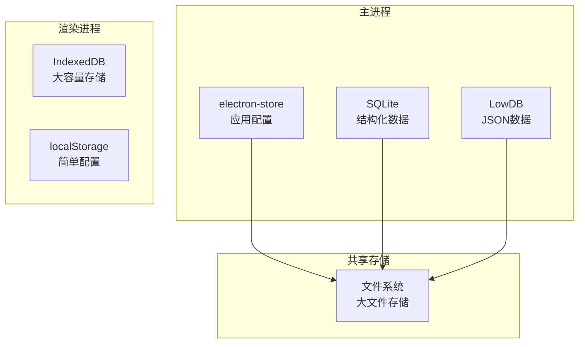
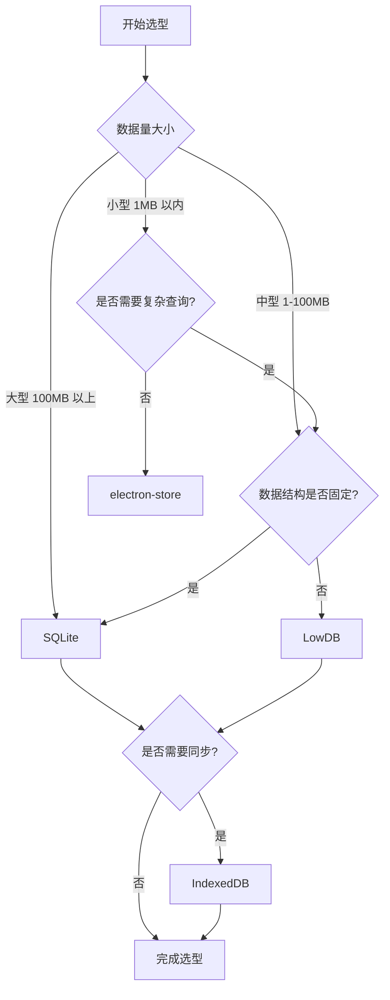

# 本地数据库

Electron 应用可以使用多种本地数据库方案来存储数据，本文介绍常用的数据库选择和使用方法。

## 系统架构

在 Electron 应用中，本地数据库的使用需要考虑主进程和渲染进程的差异：



### 架构说明

| 进程类型 | 推荐方案 | 存储位置 | 特点 |
|---------|---------|---------|------|
| 主进程 | electron-store, SQLite, LowDB | 用户数据目录 | 无容量限制，性能好 |
| 渲染进程 | IndexedDB, localStorage | 浏览器存储 | 有容量限制，受安全策略约束 |

### 数据存储路径

```typescript
import { app } from 'electron'

// 用户数据目录
const userDataPath = app.getPath('userData')
// 例如: /Users/username/Library/Application Support/AppName

// 用户文档目录
const docsPath = app.getPath('documents')
// 例如: /Users/username/Documents

// 应用缓存目录
const cachePath = app.getPath('cache')
// 例如: /Users/username/Library/Caches/AppName
```

## 数据库选型

### 选型对比

| 数据库 | 类型 | 适用场景 | 特点 | 性能 |
|--------|------|----------|------|------|
| electron-store | Key-Value | 配置、小型数据 | 简单易用、自动持久化 | ⭐⭐⭐ |
| SQLite | 关系型 | 结构化数据 | 成熟稳定、查询强大 | ⭐⭐⭐⭐⭐ |
| LowDB | JSON | 小型应用 | 轻量、Lodash API | ⭐⭐⭐ |
| IndexedDB | NoSQL | 浏览器端 | 大容量、异步操作 | ⭐⭐⭐⭐ |
| Realm | NoSQL | 移动端风格 | 高性能、对象存储（注：Realm SDK 已于 2024-09 官宣废弃，2026 年新项目慎用） | ⭐⭐⭐⭐⭐ |

### 选型决策树



### 选型建议

#### 1. electron-store - 适合配置存储

**适用场景：**
- 应用配置（主题、语言、窗口位置等）
- 用户偏好设置
- 最近使用的文件列表
- 简单的状态管理

**优势：**
- 零配置，开箱即用
- 类型安全（TypeScript 支持）
- 自动数据加密
- 支持变更监听

#### 2. SQLite - 适合结构化数据

**适用场景：**
- 笔记应用
- 任务管理
- 财务数据
- 需要复杂查询的数据

**优势：**
- ACID 事务支持
- 强大的 SQL 查询能力
- 成熟稳定，广泛使用
- 支持索引优化

#### 3. LowDB - 适合小型应用

**适用场景：**
- 小型项目快速原型
- JSON 数据存储
- 不需要复杂查询的应用

**优势：**
- 极其轻量
- Lodash 风格 API
- 易于理解和调试

#### 4. IndexedDB - 适合浏览器端存储

**适用场景：**
- 离线应用数据缓存
- 大量结构化数据
- 需要在渲染进程直接操作数据

**优势：**
- 大容量存储（通常无限制）
- 支持索引和事务
- 异步 API，不阻塞 UI

## electron-store

最简单的持久化存储方案，适合存储应用配置和用户偏好。

### 安装

```bash
npm install electron-store
```

### 基础使用

```typescript
// src/main/services/store.ts
import Store from 'electron-store'

interface AppStore {
  settings: {
    theme: 'light' | 'dark'
    language: string
  }
  recentFiles: string[]
  windowBounds: {
    width: number
    height: number
    x: number
    y: number
  }
}

const store = new Store<AppStore>({
  defaults: {
    settings: {
      theme: 'light',
      language: 'zh-CN'
    },
    recentFiles: [],
    windowBounds: {
      width: 1200,
      height: 800,
      x: 0,
      y: 0
    }
  }
})

// 设置值
store.set('settings.theme', 'dark')

// 获取值
const theme = store.get('settings.theme')
console.log(theme) // 'dark'

// 删除值
store.delete('recentFiles')

// 监听变化
store.onDidChange('settings.theme', (newValue, oldValue) => {
  console.log(`Theme changed from ${oldValue} to ${newValue}`)
})
```

### 配置参数详解

```typescript
interface StoreOptions<T> {
  // 配置文件名称，默认 'config'
  name?: string
  
  // 存储目录，默认为 app.getPath('userData')
  cwd?: string
  
  // 默认值
  defaults?: T
  
  // 数据验证 Schema（JSON Schema）
  schema?: object
  
  // 加密密钥
  encryptionKey?: string | Buffer
  
  // 是否监听文件变化，默认 true
  watch?: boolean
  
  // 文件扩展名，默认 '.json'
  fileExtension?: string
  
  // 序列化函数
  serialize?: (value: T) => string
  
  // 反序列化函数
  deserialize?: (text: string) => T
  
  // 是否支持点号访问属性，默认 true
  accessPropertiesByDotNotation?: boolean
  
  // 注：electron-store 默认即以带缩进的 JSON 格式写入，无 prettyPrint 选项
}
```

### 高级特性

#### 1. 数据验证

```typescript
import Store from 'electron-store'
import Ajv from 'ajv'

const schema = {
  type: 'object',
  properties: {
    settings: {
      type: 'object',
      properties: {
        theme: {
          type: 'string',
          enum: ['light', 'dark', 'system']
        },
        language: {
          type: 'string',
          pattern: '^[a-z]{2}-[A-Z]{2}$'
        }
      }
    }
  }
}

const store = new Store({
  schema,
  defaults: {
    settings: {
      theme: 'light',
      language: 'zh-CN'
    }
  }
})

// 无效的值会被拒绝
try {
  store.set('settings.theme', 'invalid') // 会抛出错误
} catch (error) {
  console.error('Invalid value:', error.message)
}
```

#### 2. 数据加密

```typescript
const store = new Store({
  encryptionKey: 'my-secret-key',
  defaults: {
    user: {
      token: '',
      password: ''
    }
  }
})

// 敏感数据会被加密存储
store.set('user.password', 'user-password')
```

#### 3. 迁移支持

```typescript
const store = new Store({
  migrations: {
    '>=1.0.0': (store) => {
      // 从旧版本迁移数据
      if (store.has('oldTheme')) {
        store.set('settings.theme', store.get('oldTheme'))
        store.delete('oldTheme')
      }
    },
    '>=2.0.0': (store) => {
      // 添加新字段
      if (!store.has('settings.language')) {
        store.set('settings.language', 'en-US')
      }
    }
  }
})
```

#### 4. 在渲染进程中使用

需要通过 IPC 通信：

```typescript
// 主进程
import { ipcMain } from 'electron'
import Store from 'electron-store'

const store = new Store()

// 获取数据
ipcMain.handle('store-get', (event, key) => {
  return store.get(key)
})

// 设置数据
ipcMain.handle('store-set', (event, key, value) => {
  store.set(key, value)
  return true
})

// 删除数据
ipcMain.handle('store-delete', (event, key) => {
  store.delete(key)
  return true
})
```

```typescript
// 渲染进程
import { ipcRenderer } from 'electron'

export const store = {
  get: (key: string) => ipcRenderer.invoke('store-get', key),
  set: (key: string, value: any) => ipcRenderer.invoke('store-set', key, value),
  delete: (key: string) => ipcRenderer.invoke('store-delete', key)
}
```

## SQLite

适合需要复杂查询和事务支持的应用。

### 安装

```bash
npm install better-sqlite3
```

> **注意**：`better-sqlite3` 需要编译原生模块，在 Electron 中使用时需要特殊处理。详见 [03-Node原生模块](../03-原生能力与扩展/03-Node原生模块.md)。

### 基础使用

```typescript
// src/main/database/sqlite.ts
import Database from 'better-sqlite3'
import path from 'path'
import { app } from 'electron'

const dbPath = path.join(app.getPath('userData'), 'app.db')
const db = new Database(dbPath)

// 启用外键约束
db.pragma('foreign_keys = ON')

// 启用 WAL 模式（提高并发性能）
db.pragma('journal_mode = WAL')

// 初始化表
db.exec(`
  CREATE TABLE IF NOT EXISTS notes (
    id INTEGER PRIMARY KEY AUTOINCREMENT,
    title TEXT NOT NULL,
    content TEXT,
    created_at DATETIME DEFAULT CURRENT_TIMESTAMP,
    updated_at DATETIME DEFAULT CURRENT_TIMESTAMP
  )
`)

// 插入数据
const insert = db.prepare('INSERT INTO notes (title, content) VALUES (?, ?)')
const info = insert.run('My Note', 'Note content')
console.log(`Inserted ID: ${info.lastInsertRowid}`)

// 查询单条
const note = db.prepare('SELECT * FROM notes WHERE id = ?').get(1)

// 查询多条
const allNotes = db.prepare('SELECT * FROM notes ORDER BY created_at DESC').all()

// 更新数据
const update = db.prepare('UPDATE notes SET title = ?, updated_at = CURRENT_TIMESTAMP WHERE id = ?')
update.run('Updated Title', 1)

// 删除数据
const deleteNote = db.prepare('DELETE FROM notes WHERE id = ?')
deleteNote.run(1)

// 关闭连接
// db.close()
```

### 配置参数详解

```typescript
interface DatabaseOptions {
  // 是否只读，默认 false
  readonly?: boolean
  
  // 文件不存在时是否抛出错误，默认 false
  fileMustExist?: boolean
  
  // 详细输出，默认 false
  verbose?: boolean
}

// 创建内存数据库
const db = new Database(':memory:')

// 创建只读数据库
const db = new Database('path/to/db.sqlite', { readonly: true })

// 必须存在的数据库文件
const db = new Database('path/to/db.sqlite', { fileMustExist: true })
```

### 高级特性

#### 1. 事务处理

```typescript
// 手动事务
const begin = db.prepare('BEGIN')
const commit = db.prepare('COMMIT')
const rollback = db.prepare('ROLLBACK')

try {
  begin.run()
  // 执行多个操作
  insert.run('Note 1', 'Content 1')
  insert.run('Note 2', 'Content 2')
  commit.run()
} catch (error) {
  rollback.run()
  throw error
}

// 自动事务（推荐）
const insertMany = db.transaction((notes) => {
  for (const note of notes) {
    insert.run(note.title, note.content)
  }
})

insertMany([
  { title: 'Note 1', content: 'Content 1' },
  { title: 'Note 2', content: 'Content 2' }
])
```

#### 2. 预处理语句

```typescript
// 创建预处理语句
const stmt = db.prepare('SELECT * FROM notes WHERE id = ?')

// 多次使用
const note1 = stmt.get(1)
const note2 = stmt.get(2)

// 使用命名参数
const stmtNamed = db.prepare('SELECT * FROM notes WHERE title LIKE :title')
const notes = stmtNamed.all({ title: '%重要%' })
```

#### 3. 批量操作

```typescript
// 批量插入（高效）
const insert = db.prepare('INSERT INTO notes (title, content) VALUES (?, ?)')
const insertMany = db.transaction((notes) => {
  for (const note of notes) {
    insert.run(note.title, note.content)
  }
})

insertMany([
  { title: 'Note 1', content: 'Content 1' },
  { title: 'Note 2', content: 'Content 2' },
  { title: 'Note 3', content: 'Content 3' }
])
```

#### 4. 索引优化

```typescript
// 创建索引
db.exec(`
  CREATE INDEX IF NOT EXISTS idx_notes_title ON notes(title);
  CREATE INDEX IF NOT EXISTS idx_notes_created ON notes(created_at);
`)

// 查看查询计划
const explain = db.prepare('EXPLAIN QUERY PLAN SELECT * FROM notes WHERE title = ?').get('Test')
console.log(explain)
```

#### 5. 数据库备份

```typescript
import fs from 'fs'
import path from 'path'

// 备份数据库
function backupDatabase(db: Database.Database, backupPath: string) {
  db.backup(backupPath)
    .then(() => {
      console.log('Database backed up successfully')
    })
    .catch((err) => {
      console.error('Backup failed:', err)
    })
}

// 使用示例
const backupPath = path.join(app.getPath('userData'), 'backups', `app-${Date.now()}.db`)
backupDatabase(db, backupPath)
```

### 封装 SQLite

创建一个完整的 Repository 模式：

```typescript
// src/main/database/repository.ts
import Database from 'better-sqlite3'

export class NoteRepository {
  private db: Database.Database

  constructor(db: Database.Database) {
    this.db = db
    this.createTable()
  }

  createTable() {
    this.db.exec(`
      CREATE TABLE IF NOT EXISTS notes (
        id INTEGER PRIMARY KEY AUTOINCREMENT,
        title TEXT NOT NULL,
        content TEXT,
        created_at DATETIME DEFAULT CURRENT_TIMESTAMP,
        updated_at DATETIME DEFAULT CURRENT_TIMESTAMP
      )
    `)
  }

  create(title: string, content: string) {
    const stmt = this.db.prepare('INSERT INTO notes (title, content) VALUES (?, ?)')
    return stmt.run(title, content)
  }

  findById(id: number) {
    return this.db.prepare('SELECT * FROM notes WHERE id = ?').get(id)
  }

  findAll(limit = 100, offset = 0) {
    return this.db.prepare('SELECT * FROM notes ORDER BY created_at DESC LIMIT ? OFFSET ?')
      .all(limit, offset)
  }

  search(keyword: string) {
    return this.db.prepare(`
      SELECT * FROM notes 
      WHERE title LIKE ? OR content LIKE ?
      ORDER BY created_at DESC
    `).all(`%${keyword}%`, `%${keyword}%`)
  }

  update(id: number, data: { title?: string; content?: string }) {
    const fields = []
    const values = []
    
    if (data.title !== undefined) {
      fields.push('title = ?')
      values.push(data.title)
    }
    if (data.content !== undefined) {
      fields.push('content = ?')
      values.push(data.content)
    }
    
    fields.push('updated_at = CURRENT_TIMESTAMP')
    values.push(id)
    
    const sql = `UPDATE notes SET ${fields.join(', ')} WHERE id = ?`
    return this.db.prepare(sql).run(...values)
  }

  delete(id: number) {
    return this.db.prepare('DELETE FROM notes WHERE id = ?').run(id)
  }

  count() {
    const result = this.db.prepare('SELECT COUNT(*) as count FROM notes').get() as { count: number }
    return result.count
  }
}

// 使用示例
const noteRepo = new NoteRepository(db)
noteRepo.create('New Note', 'Content')
const note = noteRepo.findById(1)
const allNotes = noteRepo.findAll(10, 0)
```

## LowDB

轻量级 JSON 数据库，适合小型应用。

### 安装

```bash
npm install lowdb
```

### 基础使用

```typescript
// src/main/database/lowdb.ts
import { Low } from 'lowdb'
import { JSONFile } from 'lowdb/node'
import path from 'path'
import { app } from 'electron'

interface Data {
  notes: Array<{ id: string; title: string; content: string }>
  settings: { theme: string }
}

const file = path.join(app.getPath('userData'), 'db.json')
const adapter = new JSONFile<Data>(file)
const db = new Low<Data>(adapter, { notes: [], settings: { theme: 'light' } })

// 初始化
await db.read()

// 添加数据
db.data.notes.push({ id: '1', title: 'Note', content: 'Content' })
await db.write()

// 查询数据
const note = db.data.notes.find(n => n.id === '1')

// 更新数据
const noteIndex = db.data.notes.findIndex(n => n.id === '1')
if (noteIndex !== -1) {
  db.data.notes[noteIndex].title = 'Updated Note'
  await db.write()
}

// 删除数据
db.data.notes = db.data.notes.filter(n => n.id !== '1')
await db.write()
```

### 配置参数详解

lowdb 没有集中式的 options 配置对象，核心是 `Low` 实例与适配器：

```typescript
// Low 实例的核心 API
const db = new Low<Data>(adapter, defaultData) // 传入适配器与默认数据
await db.read()  // 读取文件内容到 db.data
await db.write() // 将 db.data 写回文件
db.update((data) => { /* 直接修改并写回 */ })

// 适配器决定存储介质
new JSONFile<Data>(file)      // JSON 文件（来自 lowdb/node）
new Memory<Data>(defaultData) // 内存，常用于测试
```

### 封装 LowDB

```typescript
// src/main/services/lowdbStore.ts
import { Low } from 'lowdb'
import { JSONFile } from 'lowdb/node'
import path from 'path'
import { app } from 'electron'
import { v4 as uuidv4 } from 'uuid'

interface Note {
  id: string
  title: string
  content: string
  createdAt: number
}

interface Data {
  notes: Note[]
}

export class NoteStore {
  private db: Low<Data>

  async init() {
    const file = path.join(app.getPath('userData'), 'notes.json')
    const adapter = new JSONFile<Data>(file)
    this.db = new Low<Data>(adapter, { notes: [] })
    await this.db.read()
  }

  async create(title: string, content: string): Promise<Note> {
    const note: Note = {
      id: uuidv4(),
      title,
      content,
      createdAt: Date.now()
    }
    this.db.data.notes.push(note)
    await this.db.write()
    return note
  }

  findById(id: string): Note | undefined {
    return this.db.data.notes.find(n => n.id === id)
  }

  findAll(): Note[] {
    return this.db.data.notes
  }

  async update(id: string, data: Partial<Note>): Promise<boolean> {
    const index = this.db.data.notes.findIndex(n => n.id === id)
    if (index === -1) return false
    
    this.db.data.notes[index] = { ...this.db.data.notes[index], ...data }
    await this.db.write()
    return true
  }

  async delete(id: string): Promise<boolean> {
    const index = this.db.data.notes.findIndex(n => n.id === id)
    if (index === -1) return false
    
    this.db.data.notes.splice(index, 1)
    await this.db.write()
    return true
  }
}
```

## IndexedDB（渲染进程）

在渲染进程中使用 IndexedDB，适合大容量数据存储。

### 基础使用

```typescript
// src/renderer/src/database/indexeddb.ts
const DB_NAME = 'AppDatabase'
const DB_VERSION = 1

export class IndexedDBHelper {
  private db: IDBDatabase | null = null

  async init(): Promise<void> {
    return new Promise((resolve, reject) => {
      const request = indexedDB.open(DB_NAME, DB_VERSION)

      request.onerror = () => reject(request.error)
      request.onsuccess = () => {
        this.db = request.result
        resolve()
      }

      request.onupgradeneeded = (event) => {
        const db = (event.target as IDBOpenDBRequest).result
        
        // 创建对象存储
        if (!db.objectStoreNames.contains('notes')) {
          const store = db.createObjectStore('notes', { keyPath: 'id', autoIncrement: true })
          store.createIndex('title', 'title', { unique: false })
          store.createIndex('createdAt', 'createdAt', { unique: false })
        }
      }
    })
  }

  async add(storeName: string, data: unknown): Promise<number> {
    return new Promise((resolve, reject) => {
      const transaction = this.db!.transaction(storeName, 'readwrite')
      const store = transaction.objectStore(storeName)
      const request = store.add(data)

      request.onsuccess = () => resolve(request.result as number)
      request.onerror = () => reject(request.error)
    })
  }

  async get(storeName: string, id: number): Promise<unknown> {
    return new Promise((resolve, reject) => {
      const transaction = this.db!.transaction(storeName, 'readonly')
      const store = transaction.objectStore(storeName)
      const request = store.get(id)

      request.onsuccess = () => resolve(request.result)
      request.onerror = () => reject(request.error)
    })
  }

  async getAll(storeName: string): Promise<unknown[]> {
    return new Promise((resolve, reject) => {
      const transaction = this.db!.transaction(storeName, 'readonly')
      const store = transaction.objectStore(storeName)
      const request = store.getAll()

      request.onsuccess = () => resolve(request.result)
      request.onerror = () => reject(request.error)
    })
  }

  async update(storeName: string, id: number, data: unknown): Promise<void> {
    return new Promise((resolve, reject) => {
      const transaction = this.db!.transaction(storeName, 'readwrite')
      const store = transaction.objectStore(storeName)
      const request = store.put({ ...data, id })

      request.onsuccess = () => resolve()
      request.onerror = () => reject(request.error)
    })
  }

  async delete(storeName: string, id: number): Promise<void> {
    return new Promise((resolve, reject) => {
      const transaction = this.db!.transaction(storeName, 'readwrite')
      const store = transaction.objectStore(storeName)
      const request = store.delete(id)

      request.onsuccess = () => resolve()
      request.onerror = () => reject(request.error)
    })
  }

  async getByIndex(storeName: string, indexName: string, value: unknown): Promise<unknown[]> {
    return new Promise((resolve, reject) => {
      const transaction = this.db!.transaction(storeName, 'readonly')
      const store = transaction.objectStore(storeName)
      const index = store.index(indexName)
      const request = index.getAll(value)

      request.onsuccess = () => resolve(request.result)
      request.onerror = () => reject(request.error)
    })
  }
}
```

### 使用示例

```typescript
// 初始化数据库
const dbHelper = new IndexedDBHelper()
await dbHelper.init()

// 添加数据
await dbHelper.add('notes', {
  title: 'My Note',
  content: 'Note content',
  createdAt: Date.now()
})

// 获取所有数据
const allNotes = await dbHelper.getAll('notes')

// 使用索引查询
const notes = await dbHelper.getByIndex('notes', 'title', 'My Note')

// 更新数据
await dbHelper.update('notes', 1, {
  title: 'Updated Note',
  content: 'Updated content'
})

// 删除数据
await dbHelper.delete('notes', 1)
```

## 性能优化

### 1. SQLite 性能优化

#### WAL 模式

```typescript
// 启用 WAL 模式（Write-Ahead Logging）
db.pragma('journal_mode = WAL')

// 设置 WAL 模式的自动检查点
db.pragma('wal_autocheckpoint = 1000')
```

#### 索引优化

```typescript
// 为常用查询字段创建索引
db.exec(`
  CREATE INDEX IF NOT EXISTS idx_notes_created ON notes(created_at);
  CREATE INDEX IF NOT EXISTS idx_notes_title ON notes(title);
`)

// 分析查询性能
const explain = db.prepare('EXPLAIN QUERY PLAN SELECT * FROM notes WHERE title = ?')
console.log(explain.get('test'))
```

#### 批量操作

```typescript
// 使用事务批量插入
const insert = db.prepare('INSERT INTO notes (title, content) VALUES (?, ?)')
const insertMany = db.transaction((notes) => {
  for (const note of notes) {
    insert.run(note.title, note.content)
  }
})

// 比单条插入快 10-100 倍
insertMany(largeNoteArray)
```

### 2. IndexedDB 性能优化

#### 批量操作

```typescript
async function batchAdd(db: IDBDatabase, storeName: string, items: any[]) {
  return new Promise((resolve, reject) => {
    const transaction = db.transaction(storeName, 'readwrite')
    const store = transaction.objectStore(storeName)
    
    items.forEach(item => store.add(item))
    
    transaction.oncomplete = () => resolve(undefined)
    transaction.onerror = () => reject(transaction.error)
  })
}
```

#### 索引使用

```typescript
// 创建索引
const store = db.createObjectStore('notes', { keyPath: 'id' })
store.createIndex('createdAt', 'createdAt', { unique: false })
store.createIndex('title', 'title', { unique: false })

// 使用索引查询
const index = store.index('createdAt')
const request = index.getAll(IDBKeyRange.lowerBound(Date.now() - 7 * 24 * 60 * 60 * 1000))
```

### 3. electron-store 性能优化

```typescript
// 批量设置
store.set({
  'settings.theme': 'dark',
  'settings.language': 'en-US',
  'recentFiles': ['file1', 'file2']
})

// 避免频繁写入
import { debounce } from 'lodash'

const saveConfig = debounce((key, value) => {
  store.set(key, value)
}, 500)
```

## 错误处理

### 数据库损坏处理

```typescript
import fs from 'fs'
import path from 'path'

async function handleCorruptedDatabase(dbPath: string): Promise<Database> {
  try {
    const db = new Database(dbPath)
    // 测试数据库是否正常
    db.prepare('SELECT 1').get()
    return db
  } catch (error) {
    console.error('Database corrupted, attempting recovery...')
    
    // 备份损坏的数据库
    const backupPath = `${dbPath}.corrupted.${Date.now()}`
    await fs.promises.copyFile(dbPath, backupPath)
    
    // 删除损坏的数据库
    await fs.promises.unlink(dbPath)
    
    // 创建新数据库
    return new Database(dbPath)
  }
}
```

### 数据验证

```typescript
// 使用 JSON Schema 验证
import Ajv from 'ajv'

const ajv = new Ajv()

const noteSchema = {
  type: 'object',
  required: ['title', 'content'],
  properties: {
    title: { type: 'string', minLength: 1, maxLength: 200 },
    content: { type: 'string' },
    createdAt: { type: 'number' }
  }
}

const validate = ajv.compile(noteSchema)

function validateNote(data: unknown): boolean {
  const valid = validate(data)
  if (!valid) {
    console.error('Validation error:', validate.errors)
    return false
  }
  return true
}
```

### 错误恢复机制

```typescript
// src/main/database/recovery.ts
export class DatabaseRecovery {
  private dbPath: string
  private backupDir: string

  constructor(dbPath: string, backupDir: string) {
    this.dbPath = dbPath
    this.backupDir = backupDir
  }

  async recover(): Promise<Database> {
    // 尝试从最近的备份恢复
    const backups = await this.listBackups()
    
    for (const backup of backups) {
      try {
        await fs.promises.copyFile(backup, this.dbPath)
        const db = new Database(this.dbPath)
        db.prepare('SELECT 1').get()
        return db
      } catch (error) {
        console.error(`Failed to recover from ${backup}:`, error)
      }
    }
    
    // 没有可用备份，创建新数据库
    return new Database(this.dbPath)
  }

  private async listBackups(): Promise<string[]> {
    const files = await fs.promises.readdir(this.backupDir)
    return files
      .filter(f => f.endsWith('.db'))
      .sort((a, b) => b.localeCompare(a))
      .map(f => path.join(this.backupDir, f))
  }
}
```

## 最佳实践

### 1. 选择合适的数据库

- **配置数据**：使用 `electron-store`
- **结构化数据**：使用 `SQLite`
- **小型应用**：使用 `LowDB`
- **渲染进程大容量数据**：使用 `IndexedDB`

### 2. 数据备份

```typescript
// 定期自动备份
import schedule from 'node-schedule'

// 每天凌晨 2 点备份
schedule.scheduleJob('0 2 * * *', async () => {
  await backupDatabase(db, getBackupPath())
})
```

### 3. 数据迁移

```typescript
// 数据库版本管理
const DB_VERSION = 2

async function migrateDatabase(db: Database, currentVersion: number) {
  if (currentVersion < 1) {
    // 执行版本 1 的迁移
    db.exec(`
      ALTER TABLE notes ADD COLUMN tags TEXT
    `)
  }
  
  if (currentVersion < 2) {
    // 执行版本 2 的迁移
    db.exec(`
      CREATE TABLE IF NOT EXISTS tags (
        id INTEGER PRIMARY KEY AUTOINCREMENT,
        name TEXT UNIQUE NOT NULL
      )
    `)
  }
  
  // 更新版本号
  db.prepare('UPDATE db_version SET version = ?').run(DB_VERSION)
}
```

### 4. 性能监控

```typescript
// 监控查询性能
function monitorQuery<T>(query: string, fn: () => T): T {
  const start = performance.now()
  const result = fn()
  const duration = performance.now() - start
  
  if (duration > 100) {
    console.warn(`Slow query (${duration.toFixed(2)}ms): ${query}`)
  }
  
  return result
}

// 使用
const notes = monitorQuery('SELECT * FROM notes', () => {
  return db.prepare('SELECT * FROM notes').all()
})
```

### 5. 安全考虑

- 敏感数据加密存储
- 数据库文件权限控制
- SQL 注入防护（使用预处理语句）

## 常见问题解答

### Q1: 如何选择 SQLite 和 IndexedDB？

**A:** 
- **SQLite**：适合主进程、需要复杂查询、事务支持的场景
- **IndexedDB**：适合渲染进程、大容量数据、离线应用

### Q2: electron-store 存储的文件在哪里？

**A:** 默认存储在 `app.getPath('userData')` 目录下，文件名为 `config.json`。

```typescript
// 查看存储路径
console.log(app.getPath('userData'))
// macOS: /Users/username/Library/Application Support/AppName
// Windows: C:\Users\username\AppData\Roaming\AppName
// Linux: /home/username/.config/AppName
```

### Q3: 如何处理数据库文件损坏？

**A:** 
1. 定期备份数据库
2. 使用事务保证数据一致性
3. 实现自动恢复机制
4. SQLite 支持 WAL 模式，提高数据安全性

### Q4: SQLite 数据库文件能有多大？

**A:** SQLite 理论支持最大约 281TB 的数据库文件，但实际使用中建议：
- 单个数据库文件不超过 1GB
- 超过 100MB 考虑分表或分库
- 定期清理不需要的数据

### Q5: 如何在主进程和渲染进程之间共享数据？

**A:** 
1. **IPC 通信**：渲染进程通过 IPC 调用主进程的数据库操作
2. **文件共享**：主进程操作数据库文件，渲染进程监听文件变化
3. **远程数据库**：使用 WebSocket 或 HTTP API 同步数据

### Q6: better-sqlite3 在 Electron 中安装失败怎么办？

**A:** 
```bash
# 清除缓存
npm cache clean --force

# 重新安装
npm install better-sqlite3 --build-from-source

# 或使用 electron-rebuild
npm install --save-dev electron-rebuild
npx electron-rebuild
```

详见 [03-Node原生模块](../03-原生能力与扩展/03-Node原生模块.md)。

### Q7: 如何优化大量数据的查询性能？

**A:**
1. 创建适当的索引
2. 使用预处理语句
3. 批量操作使用事务
4. 分页查询，避免一次性加载所有数据
5. 定期执行 `VACUUM` 清理数据库

```typescript
// 分页查询
const page = 1
const pageSize = 20
const offset = (page - 1) * pageSize

const notes = db.prepare(`
  SELECT * FROM notes 
  ORDER BY created_at DESC 
  LIMIT ? OFFSET ?
`).all(pageSize, offset)
```

### Q8: 如何实现数据的自动同步？

**A:** 数据同步是一个复杂的话题，详见 [多端数据同步](03-多端数据同步.md)。

## 参考链接

- [数据持久化](02-数据持久化.md)
- [多端数据同步](03-多端数据同步.md)
- [electron-store 文档](https://github.com/sindresorhus/electron-store)
- [better-sqlite3 文档](https://github.com/WiseLibs/better-sqlite3)
- [LowDB 文档](https://github.com/typicode/lowdb)
- [IndexedDB MDN](https://developer.mozilla.org/zh-CN/docs/Web/API/IndexedDB_API)
