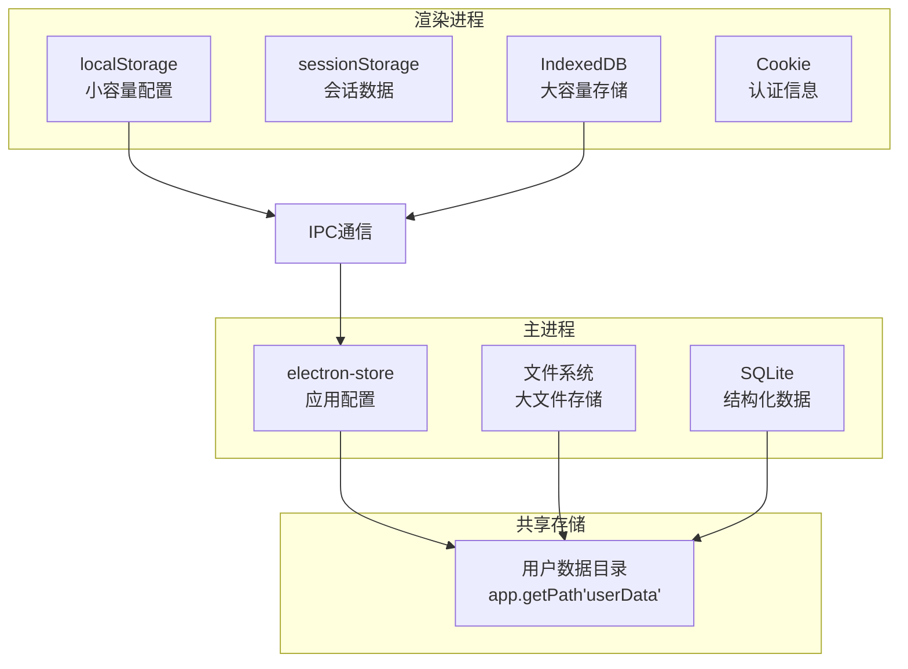

# 数据持久化

数据持久化是将应用数据保存到本地存储的过程。本文介绍 Electron 中常用的数据持久化方案、最佳实践和性能优化策略。

## 系统架构

Electron 应用的数据持久化架构需要考虑主进程和渲染进程的差异：



### 存储位置对比

| 存储方式 | 存储位置 | 容量限制 | 访问权限 | 持久性 |
|---------|---------|---------|---------|--------|
| localStorage | 浏览器存储 | ~5-10MB | 仅渲染进程 | 清除浏览器数据时删除 |
| sessionStorage | 浏览器存储 | ~5MB | 仅渲染进程 | 关闭窗口时删除 |
| IndexedDB | 浏览器存储 | 无硬性限制 | 仅渲染进程 | 清除浏览器数据时删除 |
| electron-store | 用户数据目录 | 无限制 | 主进程 | 卸载应用时可选择保留 |
| 文件系统 | 任意位置 | 无限制 | 主进程 | 永久保存 |

### 数据目录结构

```
用户数据目录 (app.getPath('userData'))
├── config.json          # electron-store 配置
├── app.db               # SQLite 数据库
├── backups/             # 备份目录
│   ├── app-2024-01-01.db
│   └── config-2024-01-01.json
├── cache/               # 缓存目录
│   └── images/
├── logs/                # 日志目录
│   └── app.log
└── temp/                # 临时文件
    └── downloads/
```

## 持久化方案对比

| 方案 | 存储位置 | 容量 | 同步/异步 | 数据类型 | 适用场景 | 性能 |
|------|----------|------|-----------|---------|----------|------|
| localStorage | 渲染进程 | ~5MB | 同步 | 字符串 | 简单配置、用户偏好 | ⭐⭐⭐ |
| sessionStorage | 渲染进程 | ~5MB | 同步 | 字符串 | 临时会话数据 | ⭐⭐⭐ |
| electron-store | 主进程 | 无限制 | 同步 | JSON | 应用配置、用户设置 | ⭐⭐⭐⭐ |
| IndexedDB | 渲染进程 | 无限制 | 异步 | 结构化数据 | 离线应用、大容量存储 | ⭐⭐⭐⭐ |
| 文件系统 | 主进程 | 无限制 | 异步 | 任意 | 大文件、二进制数据 | ⭐⭐⭐ |
| SQLite | 主进程 | 无限制 | 同步 | 关系型数据 | 结构化数据、复杂查询 | ⭐⭐⭐⭐⭐ |

## localStorage

最简单的持久化方式，适用于渲染进程存储小量数据。

### 基础使用

```javascript
// 渲染进程中直接使用

// 存储数据
localStorage.setItem('theme', 'dark')
localStorage.setItem('user', JSON.stringify({ name: 'John', age: 30 }))

// 读取数据
const theme = localStorage.getItem('theme')
const user = JSON.parse(localStorage.getItem('user') || '{}')

// 删除数据
localStorage.removeItem('theme')

// 清空所有数据
localStorage.clear()

// 监听变化（跨窗口）
window.addEventListener('storage', (event) => {
  console.log(`${event.key} changed from ${event.oldValue} to ${event.newValue}`)
  console.log('URL:', event.url)
})
```

### 封装 localStorage

```typescript
// src/renderer/src/utils/storage.ts
export class LocalStorage {
  /**
   * 获取数据
   * @param key 键名
   * @param defaultValue 默认值
   */
  static get<T>(key: string, defaultValue?: T): T | null {
    try {
      const value = localStorage.getItem(key)
      return value ? JSON.parse(value) : defaultValue ?? null
    } catch (error) {
      console.error(`Failed to get ${key} from localStorage:`, error)
      return defaultValue ?? null
    }
  }

  /**
   * 设置数据
   * @param key 键名
   * @param value 值
   */
  static set<T>(key: string, value: T): boolean {
    try {
      localStorage.setItem(key, JSON.stringify(value))
      return true
    } catch (error) {
      console.error(`Failed to set ${key} to localStorage:`, error)
      return false
    }
  }

  /**
   * 删除数据
   * @param key 键名
   */
  static remove(key: string): void {
    localStorage.removeItem(key)
  }

  /**
   * 清空所有数据
   */
  static clear(): void {
    localStorage.clear()
  }

  /**
   * 获取所有键名
   */
  static keys(): string[] {
    const keys: string[] = []
    for (let i = 0; i < localStorage.length; i++) {
      keys.push(localStorage.key(i)!)
    }
    return keys
  }

  /**
   * 检查键是否存在
   * @param key 键名
   */
  static has(key: string): boolean {
    return localStorage.getItem(key) !== null
  }

  /**
   * 获取存储大小（字节）
   */
  static getSize(): number {
    let size = 0
    for (let i = 0; i < localStorage.length; i++) {
      const key = localStorage.key(i)!
      const value = localStorage.getItem(key)!
      size += key.length + value.length
    }
    return size * 2 // UTF-16 编码，每个字符 2 字节
  }
}

// 使用示例
LocalStorage.set('settings', { theme: 'dark', lang: 'zh' })
const settings = LocalStorage.get('settings', { theme: 'light', lang: 'en' })
console.log('Storage size:', LocalStorage.getSize(), 'bytes')
```

### 容量检测与管理

```typescript
// src/renderer/src/utils/storageManager.ts
export class StorageManager {
  private static readonly WARNING_THRESHOLD = 0.9 // 90% 容量警告
  
  /**
   * 获取 localStorage 剩余容量
   */
  static getRemainingSpace(): number {
    // 尝试写入最大数据
    const testKey = '__storage_test__'
    let data = ''
    const chunk = 'x'.repeat(1024) // 1KB
    let size = 0
    
    try {
      while (true) {
        localStorage.setItem(testKey, data)
        data += chunk
        size += 1024
      }
    } catch (e) {
      // 达到容量上限
      localStorage.removeItem(testKey)
      return size
    }
  }

  /**
   * 检查存储空间是否充足
   */
  static checkStorageSpace(): { used: number; total: number; percentage: number } {
    const used = LocalStorage.getSize()
    const total = this.getRemainingSpace() + used
    const percentage = (used / total) * 100
    
    if (percentage > this.WARNING_THRESHOLD * 100) {
      console.warn(`Storage usage is high: ${percentage.toFixed(2)}%`)
    }
    
    return { used, total, percentage }
  }

  /**
   * 清理过期数据
   */
  static cleanupExpired(): number {
    const keys = LocalStorage.keys()
    let cleaned = 0
    
    keys.forEach(key => {
      if (key.endsWith('_expire')) {
        const value = LocalStorage.get(key)
        if (value && typeof value === 'object' && 'expireAt' in value) {
          if (Date.now() > (value as any).expireAt) {
            LocalStorage.remove(key.replace('_expire', ''))
            LocalStorage.remove(key)
            cleaned++
          }
        }
      }
    })
    
    return cleaned
  }
}

// 使用示例
const space = StorageManager.checkStorageSpace()
console.log(`Storage: ${space.percentage.toFixed(2)}% used`)
StorageManager.cleanupExpired()
```

### 限制与注意事项

| 限制项 | 说明 | 解决方案 |
|--------|------|---------|
| 容量限制 | 通常 5-10MB | 使用 IndexedDB 或主进程存储 |
| 同步操作 | 阻塞主线程 | 避免大数据读写 |
| 仅存字符串 | 需要序列化 | 使用 JSON.stringify/parse |
| 同源策略 | 受浏览器安全限制 | 使用主进程存储跨域数据 |
| 隐私模式 | 可能被清除 | 提示用户或使用主进程存储 |

## electron-store

推荐的应用配置存储方案，专为 Electron 设计。

### 基础使用

```typescript
// src/main/services/store.ts
import Store from 'electron-store'
import { app } from 'electron'

interface AppConfig {
  window: {
    width: number
    height: number
    x?: number
    y?: number
    isMaximized: boolean
  }
  settings: {
    theme: 'light' | 'dark' | 'system'
    language: string
    autoStart: boolean
    autoUpdate: boolean
  }
  user: {
    token?: string
    preferences?: Record<string, unknown>
  }
}

class ConfigStore extends Store<AppConfig> {
  constructor() {
    super({
      name: 'config',
      cwd: app.getPath('userData'),
      defaults: {
        window: {
          width: 1200,
          height: 800,
          isMaximized: false
        },
        settings: {
          theme: 'system',
          language: 'zh-CN',
          autoStart: false,
          autoUpdate: true
        },
        user: {}
      },
      encryptionKey: process.env.ENCRYPTION_KEY // 加密敏感数据
    })
  }

  // 获取窗口状态
  getWindowState() {
    return this.get('window')
  }

  // 保存窗口状态
  saveWindowState(bounds: Partial<AppConfig['window']>) {
    this.set('window', { ...this.get('window'), ...bounds })
  }

  // 重置配置
  reset() {
    this.clear()
  }
}

export const configStore = new ConfigStore()
```

### 配置参数详解

```typescript
interface StoreOptions<T> {
  /**
   * 配置文件名称（不含扩展名）
   * @default 'config'
   */
  name?: string

  /**
   * 配置文件存储目录
   * @default app.getPath('userData')
   */
  cwd?: string

  /**
   * 默认配置值
   */
  defaults?: T

  /**
   * JSON Schema 用于验证配置
   */
  schema?: object

  /**
   * 加密密钥，用于加密敏感数据
   */
  encryptionKey?: string | Buffer | NodeJS.TypedArray

  /**
   * 是否监听文件变化
   * @default true
   */
  watch?: boolean

  /**
   * 文件扩展名
   * @default 'json'
   */
  fileExtension?: string

  /**
   * 是否支持点号访问嵌套属性
   * @default true
   */
  accessPropertiesByDotNotation?: boolean

  /**
   * 自定义序列化函数
   */
  serialize?: (value: T) => string

  /**
   * 自定义反序列化函数
   */
  deserialize?: (text: string) => T

  /**
   * 项目名称（用于迁移）
   */
  projectName?: string

  /**
   * 数据迁移配置
   */
  migrations?: {
    [version: string]: (store: Store<T>) => void
  }
}
```

### 数据验证

```typescript
import Store from 'electron-store'

const schema = {
  type: 'object',
  properties: {
    settings: {
      type: 'object',
      properties: {
        theme: {
          type: 'string',
          enum: ['light', 'dark', 'system'],
          default: 'system'
        },
        language: {
          type: 'string',
          pattern: '^[a-z]{2}-[A-Z]{2}$',
          default: 'zh-CN'
        },
        autoUpdate: {
          type: 'boolean',
          default: true
        }
      },
      additionalProperties: false
    },
    window: {
      type: 'object',
      properties: {
        width: {
          type: 'number',
          minimum: 800,
          maximum: 3840
        },
        height: {
          type: 'number',
          minimum: 600,
          maximum: 2160
        }
      }
    }
  }
}

const store = new Store({
  schema,
  defaults: {
    settings: {
      theme: 'system',
      language: 'zh-CN',
      autoUpdate: true
    },
    window: {
      width: 1200,
      height: 800
    }
  }
})

// 无效的值会抛出错误
try {
  store.set('settings.theme', 'invalid-theme')
} catch (error) {
  console.error('Validation error:', error.message)
}
```

### 数据迁移

```typescript
const store = new Store({
  migrations: {
    '1.0.0': (store) => {
      // 从旧版本迁移数据
      console.log('Migrating to version 1.0.0')
    },
    '1.1.0': (store) => {
      // 添加新字段
      if (!store.has('settings.language')) {
        store.set('settings.language', 'en-US')
      }
    },
    '2.0.0': (store) => {
      // 重构数据结构
      const oldTheme = store.get('theme', 'light')
      store.delete('theme')
      store.set('settings.theme', oldTheme)
    }
  }
})
```

## 文件存储

### JSON 文件存储

```typescript
// src/main/services/fileStore.ts
import fs from 'fs/promises'
import path from 'path'
import { app } from 'electron'

export class FileStore {
  private filePath: string

  constructor(filename: string) {
    this.filePath = path.join(app.getPath('userData'), filename)
  }

  /**
   * 读取数据
   * @param defaultValue 默认值
   */
  async read<T>(defaultValue: T): Promise<T> {
    try {
      const content = await fs.readFile(this.filePath, 'utf-8')
      return JSON.parse(content)
    } catch (error) {
      // 文件不存在或解析失败，返回默认值
      return defaultValue
    }
  }

  /**
   * 写入数据
   * @param data 数据
   */
  async write<T>(data: T): Promise<void> {
    await fs.writeFile(
      this.filePath,
      JSON.stringify(data, null, 2),
      'utf-8'
    )
  }

  /**
   * 检查文件是否存在
   */
  async exists(): Promise<boolean> {
    try {
      await fs.access(this.filePath)
      return true
    } catch {
      return false
    }
  }

  /**
   * 删除文件
   */
  async delete(): Promise<void> {
    await fs.unlink(this.filePath).catch(() => {})
  }

  /**
   * 备份文件
   */
  async backup(): Promise<string> {
    const timestamp = new Date().toISOString().replace(/[:.]/g, '-')
    const backupPath = `${this.filePath}.${timestamp}.bak`
    await fs.copyFile(this.filePath, backupPath)
    return backupPath
  }
}

// 使用示例
const store = new FileStore('data.json')
const data = await store.read({ items: [] })
data.items.push({ id: 1, name: 'Item' })
await store.write(data)
```

### 二进制文件存储

```typescript
// src/main/services/binaryStore.ts
import fs from 'fs/promises'
import path from 'path'
import { app } from 'electron'

export class BinaryStore {
  private dir: string

  constructor(subdir: string) {
    this.dir = path.join(app.getPath('userData'), subdir)
  }

  /**
   * 初始化存储目录
   */
  async init(): Promise<void> {
    await fs.mkdir(this.dir, { recursive: true })
  }

  /**
   * 保存文件
   * @param filename 文件名
   * @param buffer 文件内容
   */
  async save(filename: string, buffer: Buffer): Promise<string> {
    await this.init()
    const filePath = path.join(this.dir, filename)
    await fs.writeFile(filePath, buffer)
    return filePath
  }

  /**
   * 加载文件
   * @param filename 文件名
   */
  async load(filename: string): Promise<Buffer | null> {
    try {
      return await fs.readFile(path.join(this.dir, filename))
    } catch {
      return null
    }
  }

  /**
   * 删除文件
   * @param filename 文件名
   */
  async delete(filename: string): Promise<void> {
    await fs.unlink(path.join(this.dir, filename)).catch(() => {})
  }

  /**
   * 列出所有文件
   */
  async list(): Promise<string[]> {
    await this.init()
    return fs.readdir(this.dir)
  }

  /**
   * 获取文件信息
   * @param filename 文件名
   */
  async stat(filename: string): Promise<fs.Stats | null> {
    try {
      return await fs.stat(path.join(this.dir, filename))
    } catch {
      return null
    }
  }

  /**
   * 获取存储目录大小
   */
  async getSize(): Promise<number> {
    const files = await this.list()
    let totalSize = 0
    
    for (const file of files) {
      const stat = await this.stat(file)
      if (stat) {
        totalSize += stat.size
      }
    }
    
    return totalSize
  }
}

// 使用示例
const imageStore = new BinaryStore('images')
await imageStore.save('avatar.png', imageBuffer)
const avatar = await imageStore.load('avatar.png')
```

### 带缓存的文件存储

```typescript
// src/main/services/cachedFileStore.ts
export class CachedFileStore<T> extends FileStore {
  private cache: T | null = null
  private cacheTime: number = 0
  private ttl: number

  constructor(filename: string, ttl: number = 5000) {
    super(filename)
    this.ttl = ttl
  }

  async read(defaultValue: T): Promise<T> {
    // 检查缓存
    if (this.cache && Date.now() - this.cacheTime < this.ttl) {
      return this.cache
    }

    // 读取文件
    const data = await super.read(defaultValue)
    this.cache = data
    this.cacheTime = Date.now()
    return data
  }

  async write(data: T): Promise<void> {
    await super.write(data)
    this.cache = data
    this.cacheTime = Date.now()
  }

  clearCache(): void {
    this.cache = null
    this.cacheTime = 0
  }
}
```

## 数据迁移

### 版本迁移策略

```typescript
// src/main/services/migration.ts
import Store from 'electron-store'

interface SchemaV1 {
  version: 1
  theme: string
}

interface SchemaV2 {
  version: 2
  settings: {
    theme: 'light' | 'dark'
    language: string
  }
}

interface SchemaV3 {
  version: 3
  settings: {
    theme: 'light' | 'dark' | 'system'
    language: string
    fontSize: number
  }
}

type Schema = SchemaV1 | SchemaV2 | SchemaV3

// 迁移函数映射
const migrations: {
  [version: number]: (data: any) => any
} = {
  1: (data: SchemaV1): SchemaV2 => ({
    version: 2,
    settings: {
      theme: data.theme as 'light' | 'dark',
      language: 'zh-CN'
    }
  }),
  2: (data: SchemaV2): SchemaV3 => ({
    version: 3,
    settings: {
      ...data.settings,
      theme: data.settings.theme as 'light' | 'dark' | 'system',
      fontSize: 14
    }
  })
}

class MigratableStore extends Store<{ version: number }> {
  constructor() {
    super({
      name: 'config',
      defaults: { version: 3 }
    })

    this.migrate()
  }

  private migrate() {
    const currentVersion = this.get('version', 1)
    
    if (currentVersion < 3) {
      let data = this.store as unknown as Schema
      
      for (let v = currentVersion; v < 3; v++) {
        console.log(`Migrating from version ${v} to ${v + 1}`)
        data = migrations[v](data)
      }
      
      this.set(data as any)
    }
  }
}
```

### 迁移管理器

```typescript
// src/main/services/migrationManager.ts
export class MigrationManager<T extends { version: number }> {
  private migrations: Map<number, (data: any) => any> = new Map()

  /**
   * 注册迁移函数
   */
  registerMigration(fromVersion: number, migration: (data: any) => any): void {
    this.migrations.set(fromVersion, migration)
  }

  /**
   * 执行迁移
   */
  migrate(data: T, targetVersion: number): T {
    let currentVersion = data.version
    
    while (currentVersion < targetVersion) {
      const migration = this.migrations.get(currentVersion)
      if (!migration) {
        throw new Error(`No migration found for version ${currentVersion}`)
      }
      
      data = migration(data)
      currentVersion = data.version
      console.log(`Migrated to version ${currentVersion}`)
    }
    
    return data
  }
}

// 使用示例
const manager = new MigrationManager<Schema>()

manager.registerMigration(1, (data: SchemaV1): SchemaV2 => ({
  version: 2,
  settings: {
    theme: data.theme as 'light' | 'dark',
    language: 'zh-CN'
  }
}))

manager.registerMigration(2, (data: SchemaV2): SchemaV3 => ({
  version: 3,
  settings: {
    ...data.settings,
    fontSize: 14
  }
}))

const migratedData = manager.migrate(oldData, 3)
```

## 缓存策略

### 内存缓存

```typescript
// src/main/services/cache.ts
interface CacheItem<T> {
  data: T
  timestamp: number
  ttl: number
}

export class CacheManager {
  private cache = new Map<string, CacheItem<unknown>>()

  /**
   * 设置缓存
   * @param key 键名
   * @param data 数据
   * @param ttl 存活时间（毫秒）
   */
  set<T>(key: string, data: T, ttl: number = 5 * 60 * 1000): void {
    this.cache.set(key, {
      data,
      timestamp: Date.now(),
      ttl
    })
  }

  /**
   * 获取缓存
   */
  get<T>(key: string): T | null {
    const item = this.cache.get(key) as CacheItem<T> | undefined
    
    if (!item) return null
    
    // 检查是否过期
    if (Date.now() - item.timestamp > item.ttl) {
      this.cache.delete(key)
      return null
    }
    
    return item.data
  }

  /**
   * 检查缓存是否存在
   */
  has(key: string): boolean {
    return this.get(key) !== null
  }

  /**
   * 删除缓存
   */
  delete(key: string): void {
    this.cache.delete(key)
  }

  /**
   * 清空所有缓存
   */
  clear(): void {
    this.cache.clear()
  }

  /**
   * 清理过期缓存
   */
  cleanup(): number {
    let cleaned = 0
    const now = Date.now()
    
    this.cache.forEach((item, key) => {
      if (now - item.timestamp > item.ttl) {
        this.cache.delete(key)
        cleaned++
      }
    })
    
    return cleaned
  }

  /**
   * 获取缓存统计信息
   */
  stats(): { count: number; keys: string[] } {
    return {
      count: this.cache.size,
      keys: Array.from(this.cache.keys())
    }
  }
}

// 使用示例
const cache = new CacheManager()

cache.set('user-data', { name: 'John', age: 30 }, 10 * 60 * 1000) // 10 分钟
const userData = cache.get('user-data')
```

### LRU 缓存

```typescript
// src/main/services/lruCache.ts
export class LRUCache<K, V> {
  private max: number
  private cache: Map<K, V>

  constructor(max: number = 100) {
    this.max = max
    this.cache = new Map()
  }

  get(key: K): V | undefined {
    const value = this.cache.get(key)
    if (value !== undefined) {
      // 更新访问顺序
      this.cache.delete(key)
      this.cache.set(key, value)
    }
    return value
  }

  set(key: K, value: V): void {
    // 如果已存在，先删除
    if (this.cache.has(key)) {
      this.cache.delete(key)
    }
    
    // 检查容量
    if (this.cache.size >= this.max) {
      // 删除最久未使用的项
      const firstKey = this.cache.keys().next().value
      this.cache.delete(firstKey)
    }
    
    this.cache.set(key, value)
  }

  has(key: K): boolean {
    return this.cache.has(key)
  }

  delete(key: K): boolean {
    return this.cache.delete(key)
  }

  clear(): void {
    this.cache.clear()
  }

  get size(): number {
    return this.cache.size
  }
}
```

## 数据备份与恢复

### 自动备份

```typescript
// src/main/services/backup.ts
import fs from 'fs/promises'
import path from 'path'
import { app } from 'electron'

export class BackupService {
  private backupDir: string
  private maxBackups: number

  constructor(maxBackups: number = 10) {
    this.backupDir = path.join(app.getPath('userData'), 'backups')
    this.maxBackups = maxBackups
  }

  /**
   * 备份数据文件
   */
  async backup(filename: string): Promise<string> {
    const sourcePath = path.join(app.getPath('userData'), filename)
    const timestamp = new Date().toISOString().replace(/[:.]/g, '-')
    const backupPath = path.join(this.backupDir, `${filename}.${timestamp}.bak`)

    await fs.mkdir(this.backupDir, { recursive: true })
    await fs.copyFile(sourcePath, backupPath)

    // 清理旧备份
    await this.cleanOldBackups(filename)

    return backupPath
  }

  /**
   * 恢复数据文件
   */
  async restore(filename: string, backupPath: string): Promise<void> {
    const targetPath = path.join(app.getPath('userData'), filename)
    await fs.copyFile(backupPath, targetPath)
  }

  /**
   * 列出所有备份
   */
  async listBackups(filename: string): Promise<Array<{ path: string; date: Date; size: number }>> {
    await fs.mkdir(this.backupDir, { recursive: true })
    const files = await fs.readdir(this.backupDir)
    
    const backups = files
      .filter(f => f.startsWith(filename) && f.endsWith('.bak'))
      .map(async f => {
        const filePath = path.join(this.backupDir, f)
        const stat = await fs.stat(filePath)
        return {
          path: filePath,
          date: stat.mtime,
          size: stat.size
        }
      })
    
    return Promise.all(backups)
  }

  /**
   * 清理旧备份
   */
  private async cleanOldBackups(filename: string): Promise<void> {
    const backups = await this.listBackups(filename)
    
    // 按日期排序（最新的在前）
    backups.sort((a, b) => b.date.getTime() - a.date.getTime())
    
    // 删除超过数量的旧备份
    const toDelete = backups.slice(this.maxBackups)
    for (const backup of toDelete) {
      await fs.unlink(backup.path)
    }
  }
}

// 使用示例
const backupService = new BackupService(10)
await backupService.backup('config.json')
const backups = await backupService.listBackups('config.json')
await backupService.restore('config.json', backups[0].path)
```

### 定时备份

```typescript
import schedule from 'node-schedule'

// 每天凌晨 2 点备份
const backupJob = schedule.scheduleJob('0 2 * * *', async () => {
  const backupService = new BackupService()
  
  try {
    await backupService.backup('config.json')
    await backupService.backup('app.db')
    console.log('Backup completed at', new Date())
  } catch (error) {
    console.error('Backup failed:', error)
  }
})

// 应用退出时取消定时任务
app.on('will-quit', () => {
  backupJob.cancel()
})
```

## 性能监控

### 性能指标收集

```typescript
// src/main/services/performanceMonitor.ts
interface PerformanceMetric {
  operation: string
  duration: number
  timestamp: number
  success: boolean
}

export class PerformanceMonitor {
  private metrics: PerformanceMetric[] = []
  private maxMetrics: number = 1000

  /**
   * 记录操作性能
   */
  measure<T>(operation: string, fn: () => T): T {
    const start = performance.now()
    let success = true
    
    try {
      const result = fn()
      return result
    } catch (error) {
      success = false
      throw error
    } finally {
      const duration = performance.now() - start
      this.recordMetric(operation, duration, success)
    }
  }

  /**
   * 记录异步操作性能
   */
  async measureAsync<T>(operation: string, fn: () => Promise<T>): Promise<T> {
    const start = performance.now()
    let success = true
    
    try {
      const result = await fn()
      return result
    } catch (error) {
      success = false
      throw error
    } finally {
      const duration = performance.now() - start
      this.recordMetric(operation, duration, success)
    }
  }

  private recordMetric(operation: string, duration: number, success: boolean): void {
    this.metrics.push({
      operation,
      duration,
      timestamp: Date.now(),
      success
    })

    // 限制存储数量
    if (this.metrics.length > this.maxMetrics) {
      this.metrics.shift()
    }

    // 慢操作警告
    if (duration > 1000) {
      console.warn(`Slow operation: ${operation} took ${duration.toFixed(2)}ms`)
    }
  }

  /**
   * 获取性能统计
   */
  getStats(): {
    totalOperations: number
    averageDuration: number
    slowOperations: number
    failedOperations: number
  } {
    if (this.metrics.length === 0) {
      return {
        totalOperations: 0,
        averageDuration: 0,
        slowOperations: 0,
        failedOperations: 0
      }
    }

    const totalDuration = this.metrics.reduce((sum, m) => sum + m.duration, 0)
    const slowOps = this.metrics.filter(m => m.duration > 1000).length
    const failedOps = this.metrics.filter(m => !m.success).length

    return {
      totalOperations: this.metrics.length,
      averageDuration: totalDuration / this.metrics.length,
      slowOperations: slowOps,
      failedOperations: failedOps
    }
  }

  /**
   * 清空性能数据
   */
  clear(): void {
    this.metrics = []
  }
}

// 使用示例
const monitor = new PerformanceMonitor()

// 同步操作监控
const data = monitor.measure('read-config', () => {
  return configStore.get('settings')
})

// 异步操作监控
const notes = await monitor.measureAsync('load-notes', async () => {
  return await noteRepository.findAll()
})

// 查看性能统计
const stats = monitor.getStats()
console.log('Performance stats:', stats)
```

### 存储空间监控

```typescript
// src/main/services/storageMonitor.ts
export class StorageMonitor {
  /**
   * 获取存储使用情况
   */
  async getStorageUsage(): Promise<{
    total: number
    used: number
    available: number
    details: Record<string, number>
  }> {
    const userDataPath = app.getPath('userData')
    
    const details: Record<string, number> = {
      'config.json': await this.getFileSize(path.join(userDataPath, 'config.json')),
      'app.db': await this.getFileSize(path.join(userDataPath, 'app.db')),
      'logs': await this.getDirectorySize(path.join(userDataPath, 'logs')),
      'cache': await this.getDirectorySize(path.join(userDataPath, 'cache')),
      'backups': await this.getDirectorySize(path.join(userDataPath, 'backups'))
    }

    const used = Object.values(details).reduce((sum, size) => sum + size, 0)
    
    // 获取磁盘可用空间（需要原生模块支持）
    const available = await this.getAvailableDiskSpace(userDataPath)

    return {
      total: used + available,
      used,
      available,
      details
    }
  }

  private async getFileSize(filePath: string): Promise<number> {
    try {
      const stat = await fs.stat(filePath)
      return stat.size
    } catch {
      return 0
    }
  }

  private async getDirectorySize(dirPath: string): Promise<number> {
    try {
      const files = await fs.readdir(dirPath)
      let size = 0
      
      for (const file of files) {
        const filePath = path.join(dirPath, file)
        const stat = await fs.stat(filePath)
        
        if (stat.isDirectory()) {
          size += await this.getDirectorySize(filePath)
        } else {
          size += stat.size
        }
      }
      
      return size
    } catch {
      return 0
    }
  }

  private async getAvailableDiskSpace(dirPath: string): Promise<number> {
    // 在实际应用中，可以使用 check-disk-space 等库
    // 这里返回一个示例值
    return 1024 * 1024 * 1024 // 1GB
  }
}
```

## 安全最佳实践

### 1. 敏感数据加密

```typescript
import crypto from 'crypto'

export class SecureStorage {
  private algorithm = 'aes-256-gcm'
  private key: Buffer

  constructor(encryptionKey: string) {
    // 从密钥派生加密密钥
    this.key = crypto.scryptSync(encryptionKey, 'salt', 32)
  }

  /**
   * 加密数据
   */
  encrypt(text: string): string {
    const iv = crypto.randomBytes(16)
    const cipher = crypto.createCipheriv(this.algorithm, this.key, iv)
    
    let encrypted = cipher.update(text, 'utf8', 'hex')
    encrypted += cipher.final('hex')
    
    const authTag = cipher.getAuthTag()
    
    return `${iv.toString('hex')}:${authTag.toString('hex')}:${encrypted}`
  }

  /**
   * 解密数据
   */
  decrypt(encryptedData: string): string {
    const [ivHex, authTagHex, encrypted] = encryptedData.split(':')
    
    const iv = Buffer.from(ivHex, 'hex')
    const authTag = Buffer.from(authTagHex, 'hex')
    
    const decipher = crypto.createDecipheriv(this.algorithm, this.key, iv)
    decipher.setAuthTag(authTag)
    
    let decrypted = decipher.update(encrypted, 'hex', 'utf8')
    decrypted += decipher.final('utf8')
    
    return decrypted
  }
}

// 使用示例
const secureStorage = new SecureStorage('my-secret-key')
const encrypted = secureStorage.encrypt('sensitive-data')
configStore.set('user.token', encrypted)

// 读取时解密
const encryptedToken = configStore.get('user.token')
const token = secureStorage.decrypt(encryptedToken)
```

### 2. 数据验证

```typescript
import Ajv from 'ajv'

const ajv = new Ajv()

// 定义数据 Schema
const userSchema = {
  type: 'object',
  required: ['id', 'name'],
  properties: {
    id: { type: 'string', format: 'uuid' },
    name: { type: 'string', minLength: 1, maxLength: 100 },
    email: { type: 'string', format: 'email' },
    age: { type: 'number', minimum: 0, maximum: 150 }
  }
}

const validateUser = ajv.compile(userSchema)

// 验证数据
function validateUserData(data: unknown): boolean {
  const valid = validateUser(data)
  if (!valid) {
    console.error('Validation errors:', validateUser.errors)
    return false
  }
  return true
}
```

### 3. 文件权限控制

```typescript
// 设置文件权限
import fs from 'fs'

// 设置文件为仅当前用户可读写
fs.chmodSync(filePath, 0o600)

// 设置目录权限
fs.chmodSync(dirPath, 0o700)
```

## 常见问题解答

### Q1: localStorage 和 electron-store 有什么区别？

**A:** 主要区别：

| 特性 | localStorage | electron-store |
|------|--------------|----------------|
| 运行环境 | 仅渲染进程 | 主进程 |
| 容量限制 | ~5MB | 无限制 |
| 数据类型 | 字符串 | JSON |
| 加密 | 不支持 | 支持 |
| 数据验证 | 不支持 | 支持 |
| 迁移 | 不支持 | 支持 |

推荐使用 **electron-store** 存储应用配置。

### Q2: 如何处理数据文件损坏？

**A:**
1. 定期备份（建议每天自动备份）
2. 使用事务保证数据一致性（SQLite）
3. 实现数据校验机制
4. 提供从备份恢复的功能

```typescript
// 数据校验示例
async function validateDataFile(filePath: string): Promise<boolean> {
  try {
    const content = await fs.readFile(filePath, 'utf-8')
    JSON.parse(content) // 尝试解析 JSON
    return true
  } catch {
    return false
  }
}
```

### Q3: 如何在不同设备间同步数据？

**A:** 详见 [多端数据同步](03-多端数据同步.md)，主要包括：
- WebDAV 同步
- 自建服务器同步
- 云存储 API 同步

### Q4: 大量数据应该如何存储？

**A:**
- **> 100MB**：使用 SQLite + 分表
- **> 1GB**：考虑分库或使用专门的数据库
- **大文件**：使用文件系统 + 数据库存储元数据
- **缓存数据**：使用内存缓存 + 定期持久化

### Q5: 如何优化 localStorage 性能？

**A:**
1. 避免存储大对象
2. 使用防抖/节流减少写入频率
3. 定期清理过期数据
4. 考虑使用 IndexedDB 替代

```typescript
// 防抖写入
import { debounce } from 'lodash'

const saveToStorage = debounce((key: string, value: any) => {
  localStorage.setItem(key, JSON.stringify(value))
}, 500)
```

### Q6: 如何实现数据的增量更新？

**A:**
```typescript
// 使用版本号和时间戳
interface DataWithMeta {
  version: number
  updatedAt: number
  data: any
}

function incrementalUpdate(
  localData: DataWithMeta,
  remoteData: DataWithMeta
): DataWithMeta {
  // 比较版本和时间戳
  if (remoteData.version > localData.version) {
    return remoteData
  } else if (remoteData.updatedAt > localData.updatedAt) {
    // 合并数据
    return {
      ...localData,
      ...remoteData,
      version: Math.max(localData.version, remoteData.version)
    }
  }
  return localData
}
```

### Q7: 如何处理用户卸载应用后的数据？

**A:**
- **macOS/Linux**：数据通常保留在用户数据目录
- **Windows**：可选择在卸载时清理数据

```json
// electron-builder 配置
{
  "build": {
    "nsis": {
      "deleteAppDataOnUninstall": true
    }
  }
}
```

建议在应用中提供"清除所有数据"选项，让用户自行选择。

### Q8: 如何确保数据一致性？

**A:**
1. 使用事务（SQLite）
2. 实现原子操作
3. 添加数据校验
4. 使用写入前备份策略

```typescript
// 原子写入
async function atomicWrite(filePath: string, data: string): Promise<void> {
  const tempPath = `${filePath}.tmp`
  
  // 写入临时文件
  await fs.writeFile(tempPath, data)
  
  // 重命名（原子操作）
  await fs.rename(tempPath, filePath)
}
```

## 参考链接

- [本地数据库](01-本地数据库.md)
- [多端数据同步](03-多端数据同步.md)
- [electron-store 文档](https://github.com/sindresorhus/electron-store)
- [Node.js fs 模块](https://nodejs.org/api/fs.html)
