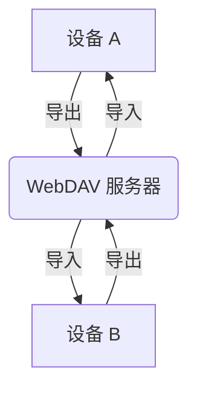

# 多端数据同步

在桌面端应用开发中，实现多端数据同步是提升用户体验的关键功能。本文详细介绍多种数据同步方案、实现原理和最佳实践。

## 同步方案概览

### 同步架构模式

```mermaid
graph TB
    subgraph 方案一：云存储同步
        A1[设备 A] --> B1[云存储服务<br/>WebDAV/S3]
        B1 --> C1[设备 B]
        C1 --> B1
        A1 --> B1
    end
    
    subgraph 方案二：服务器同步
        A2[设备 A] --> B2[中央服务器<br/>CouchDB/自建API]
        B2 --> C2[设备 B]
        C2 --> B2
        A2 --> B2
    end
    
    subgraph 方案三：P2P 同步
        A3[设备 A] <--> B3[设备 B]
        B3 <--> C3[设备 C]
        A3 <--> C3
    end
```

### 同步方案对比

| 方案 | 优点 | 缺点 | 适用场景 | 实现难度 |
|------|------|------|----------|---------|
| WebDAV | 无需服务器、用户控制数据 | 需第三方服务、配置复杂 | 个人应用、注重隐私 | ⭐⭐⭐ |
| 自建服务器 | 完全控制、功能强大 | 维护成本、安全责任 | 企业应用、团队协作 | ⭐⭐⭐⭐⭐ |
| 云存储 API | 稳定可靠、易于使用 | 依赖第三方、可能收费 | 快速开发、小型应用 | ⭐⭐ |
| P2P 同步 | 无需服务器、实时性强 | 实现复杂、NAT 穿透 | 本地网络同步 | ⭐⭐⭐⭐⭐ |
| CouchDB 复制 | 原生支持、冲突处理完善 | 需部署 CouchDB | 离线优先应用 | ⭐⭐⭐⭐ |

## SQLite 与 PouchDB 对比

在桌面端应用开发中，通常会使用 [SQLite](https://www.sqlite.org/index.html) 或者 [PouchDB](https://pouchdb.com/) 作为存储方式，它们分别是关系型数据库管理系统（RDBMS）和 NoSQL 数据库中的代表工具。

| 特性 | SQLite | PouchDB |
|------|--------|---------|
| **类型** | 关系型数据库管理系统（RDBMS），以单个文件形式存储数据库，可以通过 SQL 进行数据操作 | NoSQL 数据库，特别适用于在浏览器和 Node.js 环境中工作，并支持实时数据同步 |
| **适用场景** | 用于需要在单个设备上进行数据存储和处理的应用程序，例如移动应用程序或桌面应用程序。通常用于需要严格的数据结构和复杂查询的场景 | 更适合需要在不同设备之间同步数据的应用程序，尤其是需要离线数据操作和实时同步的情况。它可在离线状态下操作数据，并在重新联网时与远程服务器同步 |
| **架构** | 传统的关系型数据库，使用 SQL 进行数据操作，支持复杂的查询语言和事务管理 | 基于文档的数据库，使用 JavaScript API 来操作数据，而不是 SQL。支持 JSON 文档，并且与 CouchDB 等兼容，能够在离线状态下工作 |
| **数据同步** | 通常需要手动实现数据同步和复制来实现设备之间的数据一致性 | 专注于实时数据同步，并内置了处理多设备间数据同步的功能 |
| **跨平台支持** | 支持各种平台，但需要特定的驱动程序来与不同编程语言和环境交互 | 能够无缝地在浏览器和 Node.js 环境中运行，并且可以直接在这些环境中使用 JavaScript API |
| **查询能力** | ⭐⭐⭐⭐⭐（强大的 SQL 查询） | ⭐⭐⭐（MapReduce 查询） |
| **事务支持** | ⭐⭐⭐⭐⭐（ACID 事务） | ⭐⭐⭐（文档级事务） |
| **同步支持** | ⭐⭐（需手动实现） | ⭐⭐⭐⭐⭐（原生支持） |

### 选型建议

#### 选择 SQLite 的场景

- 需要复杂的关系型查询
- 数据结构固定且严格
- 对事务完整性要求高
- 单设备使用为主
- 已有成熟的同步方案

#### 选择 PouchDB 的场景

- 需要离线优先的应用
- 多设备同步是核心功能
- 数据结构灵活多变
- 快速原型开发
- 与 CouchDB 生态集成

## PouchDB 实战

### 安装与配置

在 Electron 中引入 `PouchDB` 非常方便，首先需要安装依赖：

```bash
npm install pouchdb --save
```

在项目中引入：

```javascript
import PouchDB from 'pouchdb'
```

### 处理二进制依赖项

如果在运行时遇到错误：

```bash
App threw an error during load
Error: No native build was found for platform=xxx ...
```

这是因为 `PouchDB` 本身依赖 [leveldown](https://github.com/Level/leveldown) 模块，该模块是基于 `node-gyp` 构建的 `.node` 二进制模块。在 Electron 中，对于这类二进制模块的应用需要进行单独打包。

如果使用 `electron-builder` 构建，可以在配置中把二进制模块从 asar 包中解包出来：

```json
{
  "build": {
    "asarUnpack": ["**/node_modules/leveldown/**"]
  }
}
```

`electron-builder` 会将 `leveldown` 的原生二进制文件从 asar 中解包为真实文件，从而解决二进制模块的加载问题。

### 初始化数据库

```javascript
import path from 'path'
import { app } from 'electron'

export default class DB {
  public dbpath: string
  public defaultDbName: string
  public pouchDB: PouchDB.Database

  constructor(dbPath?: string) {
    this.dbpath = dbPath || app.getPath('userData')
    this.defaultDbName = path.join(this.dbpath, 'default')
  }

  init() {
    this.pouchDB = new PouchDB(this.defaultDbName, {
      auto_compaction: true, // 自动压缩，节省空间
      revs_limit: 10, // 保留的历史版本数
    })
    console.log('数据库初始化成功！')
  }

  // 关闭数据库
  async close() {
    await this.pouchDB.close()
    console.log('数据库已关闭')
  }
}
```

**配置参数说明：**

| 参数 | 类型 | 默认值 | 说明 |
|------|------|--------|------|
| `auto_compaction` | boolean | false | 自动压缩，删除旧版本数据 |
| `revs_limit` | number | 1000 | 保留的历史版本数量 |
| `adapter` | string | 自动选择 | 存储适配器（leveldb/idb/memory） |

### 核心 CRUD 操作

#### 创建文档（Create）

```javascript
export default class DB {
  // ...
  
  /**
   * 创建文档
   * @param doc 文档对象（必须包含 _id）
   */
  async put(doc: any) {
    try {
      const result = await this.pouchDB.put(doc)
      return {
        ok: true,
        id: result.id,
        rev: result.rev
      }
    } catch (e: any) {
      console.error('PouchDB put error:', e)
      return {
        ok: false,
        id: doc._id,
        error: e.name,
        message: e.message
      }
    }
  }
}

// 使用示例
const result = await db.put({
  _id: 'note-001',
  title: 'My Note',
  content: 'Note content',
  createdAt: Date.now()
})

console.log('文档创建成功:', result)
```

#### 读取文档（Read）

```javascript
export default class DB {
  // ...
  
  /**
   * 获取单个文档
   * @param id 文档 ID
   */
  async get(id: string) {
    try {
      const doc = await this.pouchDB.get(id)
      return doc
    } catch (e) {
      console.error('PouchDB get error:', e)
      return null
    }
  }

  /**
   * 获取所有文档
   * @param options 查询选项
   */
  async getAll(options: PouchDB.Core.AllDocsOptions = {}) {
    try {
      const result = await this.pouchDB.allDocs({
        include_docs: true,
        ...options
      })
      return result.rows.map(row => row.doc)
    } catch (e) {
      console.error('PouchDB getAll error:', e)
      return []
    }
  }
}

// 使用示例
const doc = await db.get('note-001')
const allDocs = await db.getAll({ limit: 100 })
```

#### 更新文档（Update）

```javascript
// PouchDB 中更新和创建都使用 put 方法
// 必须提供 _rev 字段（版本号）

export default class DB {
  // ...
  
  /**
   * 更新文档
   * @param id 文档 ID
   * @param updates 更新的字段
   */
  async update(id: string, updates: any) {
    try {
      // 先获取当前文档
      const doc = await this.pouchDB.get(id)
      
      // 合并更新
      const updatedDoc = {
        ...doc,
        ...updates,
        updatedAt: Date.now()
      }
      
      // 保存更新
      const result = await this.pouchDB.put(updatedDoc)
      return {
        ok: true,
        id: result.id,
        rev: result.rev
      }
    } catch (e) {
      console.error('PouchDB update error:', e)
      return {
        ok: false,
        error: e.name,
        message: e.message
      }
    }
  }
}

// 使用示例
await db.update('note-001', {
  title: 'Updated Title',
  content: 'Updated content'
})
```

#### 删除文档（Delete）

```javascript
export default class DB {
  // ...
  
  /**
   * 删除文档
   * @param id 文档 ID 或文档对象
   */
  async remove(id: string | any) {
    try {
      let doc
      
      if (typeof id === 'object') {
        doc = id
      } else {
        doc = await this.pouchDB.get(id)
      }
      
      const result = await this.pouchDB.remove(doc)
      return {
        ok: true,
        id: result.id,
        rev: result.rev
      }
    } catch (e) {
      console.error('PouchDB remove error:', e)
      return {
        ok: false,
        error: e.name,
        message: e.message
      }
    }
  }
}

// 使用示例
await db.remove('note-001')
```

#### 批量操作

```javascript
export default class DB {
  // ...
  
  /**
   * 批量创建/更新文档
   * @param docs 文档数组
   */
  async bulkDocs(docs: any[]) {
    try {
      const results = await this.pouchDB.bulkDocs(docs)
      return results
    } catch (e) {
      console.error('PouchDB bulkDocs error:', e)
      return []
    }
  }
}

// 批量创建
await db.bulkDocs([
  { _id: 'note-001', title: 'Note 1', content: 'Content 1' },
  { _id: 'note-002', title: 'Note 2', content: 'Content 2' },
  { _id: 'note-003', title: 'Note 3', content: 'Content 3' }
])
```

### 查询与索引

```javascript
// 创建索引
await db.pouchDB.createIndex({
  index: {
    fields: ['createdAt', 'title']
  }
})

// 使用 find 查询（需要 pouchdb-find 插件）
import PouchDBFind from 'pouchdb-find'
PouchDB.plugin(PouchDBFind)

const results = await db.pouchDB.find({
  selector: {
    createdAt: { $gt: Date.now() - 7 * 24 * 60 * 60 * 1000 }
  },
  sort: ['createdAt'],
  limit: 100
})

console.log('最近 7 天的文档:', results.docs)
```

完整案例参考：[Rubick 数据库实现](https://github.com/rubickCenter/rubick/blob/master/src/core/db/index.ts)

## SQLite 同步方案

虽然 PouchDB 提供了原生的同步支持，但 SQLite 也有成熟的同步方案。

### 方案一：文件导出/导入

最简单的同步方式：

```typescript
// src/main/services/sqliteSync.ts
import Database from 'better-sqlite3'
import fs from 'fs/promises'
import path from 'path'

export class SQLiteFileSync {
  private db: Database.Database
  private backupDir: string

  constructor(db: Database.Database, backupDir: string) {
    this.db = db
    this.backupDir = backupDir
  }

  /**
   * 导出数据库到文件
   */
  async export(): Promise<string> {
    const timestamp = new Date().toISOString().replace(/[:.]/g, '-')
    const exportPath = path.join(this.backupDir, `backup-${timestamp}.db`)
    
    await fs.mkdir(this.backupDir, { recursive: true })
    await this.db.backup(exportPath)
    
    return exportPath
  }

  /**
   * 从文件导入数据
   */
  async import(filePath: string): Promise<void> {
    // 1. 备份当前数据库
    const currentPath = this.db.name
    await fs.copyFile(currentPath, `${currentPath}.bak`)

    try {
      // 2. 读取导入的数据
      const sourceDb = new Database(filePath)
      
      // 3. 迁移数据（这里需要根据实际表结构调整）
      const tables = sourceDb
        .prepare("SELECT name FROM sqlite_master WHERE type='table'")
        .all() as Array<{ name: string }>

      for (const table of tables) {
        if (table.name.startsWith('sqlite_')) continue
        
        const data = sourceDb.prepare(`SELECT * FROM ${table.name}`).all()
        
        // 批量插入到目标数据库
        if (data.length > 0) {
          const columns = Object.keys(data[0])
          const placeholders = columns.map(() => '?').join(',')
          const stmt = this.db.prepare(
            `INSERT OR REPLACE INTO ${table.name} (${columns.join(',')}) VALUES (${placeholders})`
          )
          
          const insert = this.db.transaction(() => {
            for (const row of data) {
              stmt.run(...Object.values(row))
            }
          })
          
          insert()
        }
      }

      sourceDb.close()
      
      // 4. 删除备份
      await fs.unlink(`${currentPath}.bak`)
      
    } catch (error) {
      // 恢复备份
      await fs.copyFile(`${currentPath}.bak`, currentPath)
      throw error
    }
  }
}
```

### 方案二：基于时间戳的增量同步

```typescript
// src/main/services/incrementalSync.ts
export class IncrementalSync {
  private db: Database.Database

  constructor(db: Database.Database) {
    this.db = db
    this.initSyncTables()
  }

  private initSyncTables() {
    this.db.exec(`
      -- 同步元数据表
      CREATE TABLE IF NOT EXISTS sync_metadata (
        id INTEGER PRIMARY KEY,
        last_sync_time INTEGER,
        sync_token TEXT
      );
      
      -- 变更日志表
      CREATE TABLE IF NOT EXISTS change_log (
        id INTEGER PRIMARY KEY AUTOINCREMENT,
        table_name TEXT NOT NULL,
        record_id INTEGER NOT NULL,
        action TEXT NOT NULL, -- 'INSERT', 'UPDATE', 'DELETE'
        timestamp INTEGER NOT NULL,
        synced INTEGER DEFAULT 0
      );
      
      CREATE INDEX IF NOT EXISTS idx_change_log_synced ON change_log(synced);
    `)
  }

  /**
   * 记录变更
   */
  logChange(tableName: string, recordId: number, action: string) {
    this.db.prepare(`
      INSERT INTO change_log (table_name, record_id, action, timestamp)
      VALUES (?, ?, ?, ?)
    `).run(tableName, recordId, action, Date.now())
  }

  /**
   * 获取未同步的变更
   */
  getUnsyncedChanges(): Array<{
    id: number
    tableName: string
    recordId: number
    action: string
    timestamp: number
  }> {
    return this.db.prepare(`
      SELECT id, table_name as tableName, record_id as recordId, 
             action, timestamp
      FROM change_log
      WHERE synced = 0
      ORDER BY timestamp ASC
    `).all() as any[]
  }

  /**
   * 标记已同步
   */
  markSynced(changeIds: number[]) {
    const stmt = this.db.prepare('UPDATE change_log SET synced = 1 WHERE id = ?')
    const markSynced = this.db.transaction(() => {
      for (const id of changeIds) {
        stmt.run(id)
      }
    })
    markSynced()
  }
}

// 使用触发器自动记录变更
function setupChangeTriggers(db: Database.Database, tableName: string) {
  db.exec(`
    CREATE TRIGGER IF NOT EXISTS ${tableName}_insert_trigger
    AFTER INSERT ON ${tableName}
    BEGIN
      INSERT INTO change_log (table_name, record_id, action, timestamp)
      VALUES ('${tableName}', NEW.id, 'INSERT', strftime('%s', 'now') * 1000);
    END;
    
    CREATE TRIGGER IF NOT EXISTS ${tableName}_update_trigger
    AFTER UPDATE ON ${tableName}
    BEGIN
      INSERT INTO change_log (table_name, record_id, action, timestamp)
      VALUES ('${tableName}', NEW.id, 'UPDATE', strftime('%s', 'now') * 1000);
    END;
    
    CREATE TRIGGER IF NOT EXISTS ${tableName}_delete_trigger
    AFTER DELETE ON ${tableName}
    BEGIN
      INSERT INTO change_log (table_name, record_id, action, timestamp)
      VALUES ('${tableName}', OLD.id, 'DELETE', strftime('%s', 'now') * 1000);
    END;
  `)
}
```

### 方案三：云端 API 同步

```typescript
// src/main/services/apiSync.ts
import fetch from 'node-fetch'

export class APISync {
  private apiBaseUrl: string
  private token: string
  private incrementalSync: IncrementalSync

  constructor(apiBaseUrl: string, token: string, incrementalSync: IncrementalSync) {
    this.apiBaseUrl = apiBaseUrl
    this.token = token
    this.incrementalSync = incrementalSync
  }

  /**
   * 推送本地变更到服务器
   */
  async pushChanges(): Promise<void> {
    const changes = this.incrementalSync.getUnsyncedChanges()
    
    if (changes.length === 0) {
      console.log('No changes to push')
      return
    }

    try {
      const response = await fetch(`${this.apiBaseUrl}/sync/push`, {
        method: 'POST',
        headers: {
          'Content-Type': 'application/json',
          'Authorization': `Bearer ${this.token}`
        },
        body: JSON.stringify({ changes })
      })

      if (!response.ok) {
        throw new Error(`Push failed: ${response.statusText}`)
      }

      // 标记为已同步
      this.incrementalSync.markSynced(changes.map(c => c.id))
      console.log(`Pushed ${changes.length} changes`)
      
    } catch (error) {
      console.error('Push changes failed:', error)
      throw error
    }
  }

  /**
   * 从服务器拉取变更
   */
  async pullChanges(lastSyncTime: number): Promise<void> {
    try {
      const response = await fetch(
        `${this.apiBaseUrl}/sync/pull?since=${lastSyncTime}`,
        {
          headers: {
            'Authorization': `Bearer ${this.token}`
          }
        }
      )

      if (!response.ok) {
        throw new Error(`Pull failed: ${response.statusText}`)
      }

      const { changes } = await response.json()
      
      // 应用变更到本地数据库
      // 需要根据实际业务逻辑实现
      console.log(`Pulled ${changes.length} changes`)
      
    } catch (error) {
      console.error('Pull changes failed:', error)
      throw error
    }
  }

  /**
   * 完整同步流程
   */
  async sync(): Promise<void> {
    // 1. 推送本地变更
    await this.pushChanges()
    
    // 2. 拉取远程变更
    const lastSyncTime = await this.getLastSyncTime()
    await this.pullChanges(lastSyncTime)
    
    // 3. 更新同步时间
    await this.updateLastSyncTime()
  }

  private async getLastSyncTime(): Promise<number> {
    // 从本地存储获取上次同步时间
    return 0
  }

  private async updateLastSyncTime(): Promise<void> {
    // 更新本地同步时间
    console.log('Sync time updated')
  }
}
```

## WebDAV 同步

WebDAV 是一种基于 HTTP 的协议，适合个人应用的文件同步。

### 同步方案对比

Rubick 数据存储基于 [PouchDB](https://pouchdb.com/)，数据同步方案有：

1. **文件导出/导入**: 简单直接，但需手动传输文件
2. **WebDAV 同步**: 便利性和数据隐私兼顾（推荐方案）
3. **自建中央服务器**: 灵活性高，但成本和安全责任重

> **WebDAV**（Web-based Distributed Authoring and Versioning），一种基于 HTTP 1.1 协议的通信协议。它扩展了 HTTP 1.1，添加了新方法使应用程序可对 Web Server 直接读写，支持文件锁定和版本控制。

国内支持 WebDAV 的服务不多，[坚果云](https://www.jianguoyun.com/) 是比较知名的选择。

### 实现原理



流程说明：
1. **数据导出**: 客户端将本地 PouchDB 数据打包成文件
2. **上传**: 通过 WebDAV 协议上传到云端
3. **下载**: 其他设备从云端下载数据文件
4. **导入**: 将数据导入到本地数据库

使用插件：
- [pouchdb-replication-stream](https://github.com/pouchdb-community/pouchdb-replication-stream): 数据导出
- [pouchdb-load](https://github.com/pouchdb-community/pouchdb-load): 数据导入
- [webdav](https://www.npmjs.com/package/webdav): WebDAV 客户端

### 实现代码

#### 1. 初始化 WebDAV 客户端

```typescript
// src/main/services/webdavSync.ts
import { createClient, WebDAVClient } from 'webdav'
import { Notification } from 'electron'

export class WebDAVSync {
  private client: WebDAVClient
  private cloudPath: string = '/rubick/db.txt'

  constructor(config: { username: string; password: string; url: string }) {
    this.client = createClient(config.url, {
      username: config.username,
      password: config.password,
    })

    this.checkConnection()
  }

  private async checkConnection(): Promise<void> {
    try {
      const exists = await this.client.exists('/')
      if (!exists) {
        new Notification({
          title: '连接失败',
          body: 'WebDAV 连接失败，请检查配置',
        }).show()
      }
    } catch (error) {
      new Notification({
        title: '连接错误',
        body: `WebDAV 连接出错: ${error}`,
      }).show()
    }
  }
}
```

#### 2. 数据导出到云端

```typescript
import MemoryStream from 'memorystream'

export class WebDAVSync {
  // ...
  
  /**
   * 导出数据到 WebDAV
   */
  async export(dbInstance: PouchDB.Database): Promise<void> {
    try {
      // 确保目录存在
      const dirExists = await this.client.exists('/rubick')
      if (!dirExists) {
        await this.client.createDirectory('/rubick')
      }

      // 创建内存流
      const ws = new MemoryStream()
      
      // 导出数据库到流
      await dbInstance.dump(ws)
      
      // 收集流数据
      const chunks: Buffer[] = []
      ws.on('data', (chunk: Buffer) => {
        chunks.push(chunk)
      })
      
      return new Promise((resolve, reject) => {
        ws.on('end', async () => {
          try {
            const data = Buffer.concat(chunks)
            
            // 上传到 WebDAV
            await this.client.putFileContents(this.cloudPath, data, {
              contentLength: data.length,
            })
            
            new Notification({
              title: '导出成功',
              body: `数据已导出到云端: ${this.cloudPath}`,
            }).show()
            
            resolve()
          } catch (error) {
            reject(error)
          }
        })
        
        ws.on('error', reject)
      })
      
    } catch (error) {
      new Notification({
        title: '导出失败',
        body: `导出错误: ${error}`,
      }).show()
      throw error
    }
  }
}
```

#### 3. 从云端导入数据

```typescript
export class WebDAVSync {
  // ...
  
  /**
   * 从 WebDAV 导入数据
   */
  async import(dbInstance: PouchDB.Database): Promise<void> {
    try {
      // 检查文件是否存在
      const exists = await this.client.exists(this.cloudPath)
      if (!exists) {
        new Notification({
          title: '导入失败',
          body: '云端数据文件不存在',
        }).show()
        return
      }

      // 下载数据
      const data = await this.client.getFileContents(this.cloudPath, {
        format: 'text',
      }) as string
      
      // 导入到数据库
      await dbInstance.load(data)
      
      new Notification({
        title: '导入成功',
        body: '数据已成功导入',
      }).show()
      
    } catch (error) {
      new Notification({
        title: '导入失败',
        body: `导入错误: ${error}`,
      }).show()
      throw error
    }
  }
}
```

完整代码参考：[Rubick 多端同步实现](https://github.com/rubickCenter/rubick/blob/master/src/core/db/index.ts)

## 其他同步方案

### 1. 云存储 API（如 AWS S3）

```typescript
// src/main/services/s3Sync.ts
import { S3Client, PutObjectCommand, GetObjectCommand } from '@aws-sdk/client-s3'

export class S3Sync {
  private client: S3Client
  private bucket: string

  constructor(config: { region: string; accessKeyId: string; secretAccessKey: string; bucket: string }) {
    this.client = new S3Client({
      region: config.region,
      credentials: {
        accessKeyId: config.accessKeyId,
        secretAccessKey: config.secretAccessKey,
      },
    })
    this.bucket = config.bucket
  }

  async upload(key: string, data: Buffer): Promise<void> {
    await this.client.send(
      new PutObjectCommand({
        Bucket: this.bucket,
        Key: key,
        Body: data,
      })
    )
  }

  async download(key: string): Promise<Buffer> {
    const response = await this.client.send(
      new GetObjectCommand({
        Bucket: this.bucket,
        Key: key,
      })
    )
    
    return Buffer.from(await response.Body!.transformToByteArray())
  }
}
```

### 2. Dropbox API

```typescript
// src/main/services/dropboxSync.ts
import { Dropbox } from 'dropbox'

export class DropboxSync {
  private dbx: Dropbox

  constructor(accessToken: string) {
    this.dbx = new Dropbox({ accessToken })
  }

  async upload(path: string, data: Buffer): Promise<void> {
    await this.dbx.filesUpload({
      path,
      contents: data,
      mode: { '.tag': 'overwrite' },
    })
  }

  async download(path: string): Promise<Buffer> {
    const response = await this.dbx.filesDownload({ path })
    return (response.result as any).fileBinary
  }
}
```

### 3. iCloud 同步（macOS）

```typescript
// src/main/services/iCloudSync.ts
import { app } from 'electron'
import fs from 'fs/promises'
import path from 'path'

export class iCloudSync {
  private iCloudPath: string

  constructor() {
    // macOS iCloud 路径
    const homePath = app.getPath('home')
    this.iCloudPath = path.join(homePath, 'Library', 'Mobile Documents', 'com~apple~CloudDocs')
  }

  async isAvailable(): Promise<boolean> {
    try {
      await fs.access(this.iCloudPath)
      return true
    } catch {
      return false
    }
  }

  async upload(filename: string, data: Buffer): Promise<void> {
    const filePath = path.join(this.iCloudPath, filename)
    await fs.writeFile(filePath, data)
  }

  async download(filename: string): Promise<Buffer> {
    const filePath = path.join(this.iCloudPath, filename)
    return await fs.readFile(filePath)
  }
}
```

## 冲突处理与错误恢复

### 冲突检测

PouchDB 的 `_rev` 字段实现了多版本并发控制（MVCC），当更新文档时必须提供最新的 `_rev` 值，否则会产生冲突。

```typescript
export class ConflictHandler {
  /**
   * 检测冲突
   */
  async detectConflicts(db: PouchDB.Database, docId: string): Promise<boolean> {
    try {
      const doc = await db.get(docId, { conflicts: true })
      return !!doc._conflicts && doc._conflicts.length > 0
    } catch {
      return false
    }
  }

  /**
   * 获取冲突文档
   */
  async getConflictingRevisions(
    db: PouchDB.Database,
    docId: string
  ): Promise<any[]> {
    try {
      const doc = await db.get(docId, { conflicts: true })
      
      if (!doc._conflicts || doc._conflicts.length === 0) {
        return []
      }

      // 获取所有冲突版本
      const revisions = [doc]
      for (const rev of doc._conflicts) {
        const conflictingDoc = await db.get(docId, { rev })
        revisions.push(conflictingDoc)
      }
      
      return revisions
    } catch (error) {
      console.error('Get conflicts error:', error)
      return []
    }
  }
}
```

### 冲突解决策略

```typescript
export class ConflictResolver {
  /**
   * 策略1: 保留最新的（基于时间戳）
   */
  async resolveByTimestamp(db: PouchDB.Database, docId: string): Promise<void> {
    const revisions = await new ConflictHandler().getConflictingRevisions(db, docId)
    
    if (revisions.length === 0) return
    
    // 找到最新的版本
    const latest = revisions.reduce((prev, curr) => {
      return (curr.updatedAt || 0) > (prev.updatedAt || 0) ? curr : prev
    })
    
    // 删除其他版本
    for (const rev of revisions) {
      if (rev._rev !== latest._rev) {
        await db.remove(rev._id, rev._rev)
      }
    }
  }

  /**
   * 策略2: 合并字段
   */
  async resolveByMerge(db: PouchDB.Database, docId: string): Promise<void> {
    const revisions = await new ConflictHandler().getConflictingRevisions(db, docId)
    
    if (revisions.length === 0) return
    
    // 合并所有版本的唯一字段
    const merged = revisions.reduce((merged, rev) => {
      return { ...merged, ...rev }
    }, {})
    
    // 删除冲突标记
    delete merged._conflicts
    
    // 保存合并后的文档
    await db.put(merged)
    
    // 删除其他版本
    for (const rev of revisions) {
      if (rev._rev !== merged._rev) {
        await db.remove(rev._id, rev._rev)
      }
    }
  }

  /**
   * 策略3: 用户选择
   */
  async resolveByUserChoice(
    db: PouchDB.Database,
    docId: string,
    chosenRev: string
  ): Promise<void> {
    const revisions = await new ConflictHandler().getConflictingRevisions(db, docId)
    
    // 删除未选择的版本
    for (const rev of revisions) {
      if (rev._rev !== chosenRev) {
        await db.remove(rev._id, rev._rev)
      }
    }
  }
}
```

### 错误恢复机制

```typescript
export class SyncRecovery {
  private backupDir: string

  constructor(backupDir: string) {
    this.backupDir = backupDir
  }

  /**
   * 同步前备份
   */
  async backupBeforeSync(db: PouchDB.Database): Promise<string> {
    const timestamp = new Date().toISOString().replace(/[:.]/g, '-')
    const backupPath = path.join(this.backupDir, `sync-backup-${timestamp}.json`)
    
    // 导出所有文档
    const result = await db.allDocs({ include_docs: true })
    const docs = result.rows.map(row => row.doc)
    
    await fs.writeFile(backupPath, JSON.stringify(docs, null, 2))
    
    return backupPath
  }

  /**
   * 从备份恢复
   */
  async restoreFromBackup(db: PouchDB.Database, backupPath: string): Promise<void> {
    const content = await fs.readFile(backupPath, 'utf-8')
    const docs = JSON.parse(content)
    
    // 清空当前数据库
    const allDocs = await db.allDocs({ include_docs: true })
    for (const row of allDocs.rows) {
      await db.remove(row.doc!)
    }
    
    // 导入备份数据
    await db.bulkDocs(docs)
  }

  /**
   * 验证同步结果
   */
  async validateSync(
    db: PouchDB.Database,
    expectedDocCount: number
  ): Promise<{ valid: boolean; errors: string[] }> {
    const errors: string[] = []
    
    try {
      // 检查文档数量
      const result = await db.allDocs()
      if (result.rows.length !== expectedDocCount) {
        errors.push(`Document count mismatch: expected ${expectedDocCount}, got ${result.rows.length}`)
      }
      
      // 检查是否有冲突
      const conflicts = await db.query('conflicts/conflicts', {
        reduce: false,
      })
      
      if (conflicts.rows.length > 0) {
        errors.push(`Found ${conflicts.rows.length} conflicting documents`)
      }
      
      return {
        valid: errors.length === 0,
        errors,
      }
    } catch (error) {
      return {
        valid: false,
        errors: [`Validation error: ${error}`],
      }
    }
  }
}
```

## 性能优化

### 1. 增量同步

```typescript
export class IncrementalSyncOptimizer {
  /**
   * 只同步变更的文档
   */
  async syncChanges(
    localDb: PouchDB.Database,
    remoteDb: PouchDB.Database,
    lastSeq: string
  ): Promise<string> {
    const changes = await localDb.changes({
      since: lastSeq,
      include_docs: true,
    })

    for (const change of changes.results) {
      if (change.deleted) {
        await remoteDb.remove(change.id, change.changes[0].rev)
      } else {
        await remoteDb.put(change.doc!)
      }
    }

    return changes.last_seq
  }
}
```

### 2. 批量操作

```typescript
/**
 * 批量同步文档
 */
async function batchSync(
  sourceDb: PouchDB.Database,
  targetDb: PouchDB.Database,
  batchSize: number = 100
): Promise<void> {
  let lastKey: string | null = null
  
  while (true) {
    const result = await sourceDb.allDocs({
      include_docs: true,
      limit: batchSize,
      startkey: lastKey || undefined,
      skip: lastKey ? 1 : 0,
    })

    if (result.rows.length === 0) break

    const docs = result.rows.map(row => row.doc!)
    await targetDb.bulkDocs(docs)

    lastKey = result.rows[result.rows.length - 1].id
  }
}
```

### 3. 同步过滤

```typescript
/**
 * 只同步特定类型的文档
 */
async function filteredSync(
  localDb: PouchDB.Database,
  remoteDb: PouchDB.Database
): Promise<void> {
  const filter = (doc: any) => {
    // 只同步非临时文档
    return !doc._id.startsWith('temp_')
  }

  const replication = localDb.sync(remoteDb, {
    filter,
    live: true,
    retry: true,
  })

  replication.on('error', (err) => {
    console.error('Sync error:', err)
  })
}
```

### 4. 附件处理

```typescript
/**
 * 分离大附件，优化同步性能
 */
export class AttachmentHandler {
  /**
   * 存储附件到独立存储
   */
  async storeAttachment(
    db: PouchDB.Database,
    docId: string,
    attachmentName: string,
    data: Buffer,
    type: string
  ): Promise<void> {
    const doc = await db.get(docId)
    
    await db.putAttachment(
      docId,
      attachmentName,
      doc._rev,
      data,
      type
    )
  }

  /**
   * 获取附件
   */
  async getAttachment(
    db: PouchDB.Database,
    docId: string,
    attachmentName: string
  ): Promise<Buffer> {
    const result = await db.getAttachment(docId, attachmentName)
    return result as Buffer
  }
}
```

## 安全考虑

### 1. 数据加密

```typescript
import crypto from 'crypto'

export class SyncEncryption {
  private algorithm = 'aes-256-gcm'
  private key: Buffer

  constructor(encryptionKey: string) {
    this.key = crypto.scryptSync(encryptionKey, 'salt', 32)
  }

  /**
   * 加密数据
   */
  encrypt(data: string): string {
    const iv = crypto.randomBytes(16)
    const cipher = crypto.createCipheriv(this.algorithm, this.key, iv)
    
    let encrypted = cipher.update(data, 'utf8', 'hex')
    encrypted += cipher.final('hex')
    
    const authTag = cipher.getAuthTag()
    
    return `${iv.toString('hex')}:${authTag.toString('hex')}:${encrypted}`
  }

  /**
   * 解密数据
   */
  decrypt(encryptedData: string): string {
    const [ivHex, authTagHex, encrypted] = encryptedData.split(':')
    
    const iv = Buffer.from(ivHex, 'hex')
    const authTag = Buffer.from(authTagHex, 'hex')
    
    const decipher = crypto.createDecipheriv(this.algorithm, this.key, iv)
    decipher.setAuthTag(authTag)
    
    let decrypted = decipher.update(encrypted, 'hex', 'utf8')
    decrypted += decipher.final('utf8')
    
    return decrypted
  }
}
```

### 2. 安全传输

```typescript
// 使用 HTTPS
const remoteDb = new PouchDB('https://example.com/db', {
  auth: {
    username: 'user',
    password: 'password',
  },
})

// 验证证书（生产环境）
process.env.NODE_TLS_REJECT_UNAUTHORIZED = '1'
```

### 3. 访问控制

```typescript
/**
 * 基于角色的访问控制
 */
export class SyncAccessControl {
  private roles: Map<string, string[]> = new Map()

  canSync(userId: string, docId: string): boolean {
    const userRoles = this.roles.get(userId) || []
    
    // 检查用户是否有权限同步该文档
    // 实现具体的权限逻辑
    
    return true
  }

  filterDocs(userId: string, docs: any[]): any[] {
    return docs.filter(doc => this.canSync(userId, doc._id))
  }
}
```

## 常见问题解答

### Q1: 为什么选择 PouchDB 而不是 SQLite？

**A:** PouchDB 的主要优势在于其对 NoSQL 数据模型和多端同步的内置支持。对于需要跨设备同步的应用，PouchDB 与 CouchDB 的兼容性使得实现同步变得更加容易。但如果应用需要复杂的关系型查询，SQLite 可能是更好的选择。

### Q2: `_rev` 字段是做什么用的？

**A:** `_rev` 字段是 PouchDB（以及 CouchDB）用于实现多版本并发控制（MVCC）的核心机制。每次更新文档时，都必须提供最新的 `_rev` 值。这可以防止数据冲突，尤其是在多个客户端同时修改同一文档的情况下。

### Q3: 如何处理大文件的同步？

**A:** 对于大型二进制数据，建议使用附件（attachments）功能。附件是单独存储的，不会影响文档的读写性能。同时可以考虑：
- 文件压缩
- 分块上传
- 断点续传

### Q4: WebDAV 同步安全吗？

**A:** WebDAV 本身支持 HTTPS 加密传输。只要正确配置，数据传输是安全的。但需要注意：
- 使用强密码
- 启用双因素认证
- 定期更换访问令牌
- 对于高度敏感数据，建议使用自建的 WebDAV 服务器

### Q5: 如何处理网络不稳定的情况？

**A:** 建议采用以下策略：
1. 实现离线队列，网络恢复后自动同步
2. 使用指数退避算法重试
3. 提供手动同步选项
4. 显示同步状态指示器

```typescript
// 离线队列示例
export class OfflineQueue {
  private queue: Array<() => Promise<void>> = []
  private isOnline: boolean = true

  async add(operation: () => Promise<void>): Promise<void> {
    if (this.isOnline) {
      await operation()
    } else {
      this.queue.push(operation)
    }
  }

  async flush(): Promise<void> {
    while (this.queue.length > 0) {
      const operation = this.queue.shift()!
      await operation()
    }
  }
}
```

### Q6: 如何优化同步性能？

**A:**
1. 使用增量同步，只同步变更
2. 实现同步过滤，避免同步不必要的数据
3. 批量操作，减少网络请求
4. 压缩数据
5. 使用索引加速查询

### Q7: 如何实现实时同步？

**A:** 使用 PouchDB 的 live sync 功能：

```typescript
const sync = localDb.sync(remoteDb, {
  live: true,  // 实时同步
  retry: true, // 自动重试
})

sync.on('change', (info) => {
  console.log('Sync change:', info)
})
```

### Q8: 如何验证同步数据的完整性？

**A:**
1. 使用校验和（checksum）验证数据完整性
2. 比对文档数量
3. 验证关键文档是否存在
4. 实现自动修复机制

```typescript
async function validateIntegrity(
  localDb: PouchDB.Database,
  remoteDb: PouchDB.Database
): Promise<boolean> {
  const localInfo = await localDb.info()
  const remoteInfo = await remoteDb.info()
  
  return localInfo.doc_count === remoteInfo.doc_count
}
```

## 参考链接

- [本地数据库](01-本地数据库.md)
- [数据持久化](02-数据持久化.md)
- [PouchDB 官方文档](https://pouchdb.com/)
- [CouchDB 官方文档](https://couchdb.apache.org/)
- [WebDAV 规范](https://tools.ietf.org/html/rfc4918)
- [Rubick 源码](https://github.com/rubickCenter/rubick)
- [坚果云 WebDAV 开启方法](https://help.jianguoyun.com/?p=2064)
