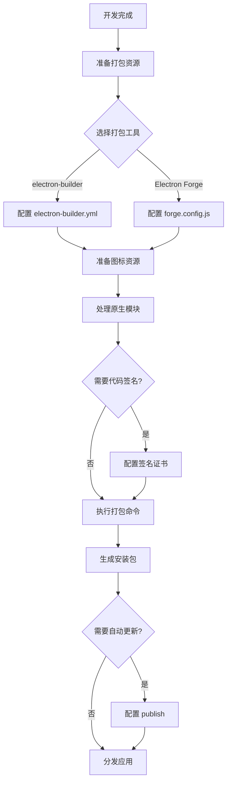

# Electron 应用打包

为让普通用户能够像安装和运行原生桌面应用一样使用它，必须将其"打包"成一个可执行的安装程序（例如 Windows 的 `.exe`、macOS 的 `.dmg` 或 Linux 的 `.deb`、`.AppImage` 等）

## 打包概述

打包过程不仅是将源代码和资源文件捆绑在一起，还涉及以下关键任务：

- **平台兼容性**：为不同的操作系统（Windows, macOS, Linux）生成各自平台的安装包
- **代码保护**：通过 `asar` 归档等方式，避免源代码直接暴露给最终用户
- **应用签名**：对应用程序进行数字签名，以验证其来源和完整性，绕过操作系统的安全限制
- **自动更新**：集成自动更新机制，方便用户获取最新版本
- **优化**：移除开发依赖、压缩代码，减小最终应用的体积

## 主流打包工具对比

Electron 社区提供多种打包工具，其中最主流的两个一体化解决方案是 `Electron Forge` 和 `electron-builder`

### Electron Forge

[Electron Forge](https://github.com/electron/forge) 是由 Electron 官方维护的打包工具

- **优势**:

  - **官方支持**：与 Electron 的新功能和新版本集成最快、最紧密
  - **集成度高**：将多个独立的工具（如 `@electron/packager`, `@electron/rebuild`）整合到一个统一的构建流程中，易于理解和扩展
  - **模板丰富**：提供基于 `webpack`、 `vite` 等构建工具的官方模板，开箱即用

- **劣势**:
  - **配置灵活性**：相对于 `electron-builder`，配置选项较少，定制化能力稍弱
  - **包体积**：在某些情况下，打包出的应用体积可能比 `electron-builder` 更大

### Electron Builder

[Electron Builder](https://github.com/electron-userland/electron-builder) 是功能强大且高度可配置的社区驱动的打包解决方案

- **优势**:
  - **功能丰富**：提供非常广泛的配置选项，支持代码签名、自动更新、多种目标格式构建等高级功能
  - **高度可配置**：允许开发者对打包过程进行精细控制，满足复杂的定制需求
  - **生态系统**：被广泛应用于各种脚手架工具中，例如 `electron-vite` 和 `vue-cli-plugin-electron-builder`，拥有庞大的社区支持
  
- **劣势**:
  - **非官方维护**：更新速度可能滞后于 Electron 的最新版本
  - **复杂性**：丰富的配置选项也带来更高的学习成本

**结论**：`Electron Forge` 对于追求与 Electron 版本紧密同步和简洁配置的开发者来说是一个很好的选择。而 `electron-builder` 则凭借其强大的功能和灵活性，成为目前社区中使用最广泛、功能最全面的打包方案

## 打包流程概览

下图展示了 Electron 应用打包的完整流程：



## 打包前准备

在开始打包之前，请确保开发环境满足以下要求，并为您的应用程序准备好必要的图标资源。

### 环境要求

- **Node.js**: 建议使用 `LTS` 版本的 Node.js
- **操作系统**:
  - **Windows**: 打包 `.exe` 安装程序
  - **macOS**: 打包 `.dmg` 和 `.pkg` 安装程序
  - **Linux**: 打包 `.deb`, `.rpm`, `.AppImage` 等格式的安装程序
- **特定平台的构建工具**:
  - 在 **macOS** 上需要安装 `Xcode` 命令行工具
  - 在 **Windows** 上如果需要从原生模块构建，可能需要 `Visual Studio` (C++ 桌面开发组件)

**重要提示**：跨平台打包（例如：在 macOS 上打包 Windows 的 `.exe`）是可能的，但通常需要额外的配置（例如：使用 Docker 或虚拟机）。为了确保最佳的兼容性和稳定性，**建议在目标操作系统上进行原生打包**

### 图标制作

为应用程序提供高质量的图标是至关重要的。您需要为不同平台准备不同格式的图标

1.  **准备源图片**：创建 `1024x1024` 像素的 `PNG` 格式的高质量 logo。这是创建所有其他尺寸图标的源文件

2.  **Windows 图标 (`.ico`)**:

    - Windows 应用需要 `.ico` 格式的图标
    - 可以使用在线工具（如 [aconvert](https://www.aconvert.com/cn/icon/png-to-ico/)）或本地软件将您的 `PNG` 源图片转换为多尺寸的 `.ico` 文件。通常包含 `256x256` 像素的图标就足够

3.  **macOS 图标 (`.icns`)**:

    - macOS 应用需要 `.icns` 格式的图标。
    - 在 macOS 系统上，您可以使用以下命令行工具来创建 `.icns` 文件：

    ```bash
    # 1. 创建一个临时目录
    mkdir icons.iconset

    # 2. 使用 sips 命令生成不同尺寸的 PNG 图片
    sips -z 16 16     icon.png --out icons.iconset/icon_16x16.png
    sips -z 32 32     icon.png --out icons.iconset/icon_16x16@2x.png
    sips -z 32 32     icon.png --out icons.iconset/icon_32x32.png
    sips -z 64 64     icon.png --out icons.iconset/icon_32x32@2x.png
    sips -z 128 128   icon.png --out icons.iconset/icon_128x128.png
    sips -z 256 256   icon.png --out icons.iconset/icon_128x128@2x.png
    sips -z 256 256   icon.png --out icons.iconset/icon_256x256.png
    sips -z 512 512   icon.png --out icons.iconset/icon_256x256@2x.png
    sips -z 512 512   icon.png --out icons.iconset/icon_512x512.png
    sips -z 1024 1024 icon.png --out icons.iconset/icon_512x512@2x.png

    # 3. 使用 iconutil 命令将 iconset 转换为 .icns 文件
    iconutil -c icns icons.iconset -o icon.icns

    # 4. (可选) 删除临时目录
    rm -rf icons.iconset
    ```

4. **Linux 图标 (`.png`)**：对于 Linux，通常直接使用不同尺寸的 `PNG` 图标即可。`electron-builder` 会根据需要将它们打包

## 使用 electron-builder 打包

`electron-builder` 是功能强大且高度可配置的打包工具。它通过在 `package.json` 文件中添加一个 `build` 字段，或者使用一个独立的配置文件（如 `electron-builder.yml`）来进行配置

- **`package.json`**: 将配置直接写在 `package.json` 的 `build` 字段中
- **`electron-builder.yml`**: 使用独立的 YAML 文件来管理配置，这在配置项较多时能保持 `package.json` 的整洁。`electron-vite` 等现代脚手架通常采用这种方式

### 核心概念

在深入研究详细配置之前，先了解几个核心概念：

- **`appId`**: 应用程序的唯一标识符。通常采用反向域名格式，例如 `com.yourcompany.yourapp`。这个 ID 在 macOS 的代码签名和 Windows 的发布协议中至关重要
- **`productName`**: 应用程序的名称，将显示在安装程序的标题、桌面快捷方式等位置
- **`directories`**: 指定输入和输出目录结构
  - `output`: 打包产物的输出目录
  - `buildResources`: 用于存放构建所需资源的目录，例如图标、脚本等
- **`files`**: 一个 glob 模式数组，用于指定哪些文件和目录应该被包含在最终的打包应用中。这是控制包体积的关键配置
- **`asar`**: 布尔值，用于控制是否将应用的源代码打包成 `asar` 归档。默认为 `true`

### 详细配置

`electron-builder` 提供丰富的配置选项

| 配置项           | 类型            | 描述                                              | 示例                                                        |
| :--------------- | :-------------- | :------------------------------------------------ | :---------------------------------------------------------- |
| `appId`          | `string`        | **（必需）** 应用程序的唯一标识符。               | `com.electron.myapp`                                        |
| `productName`    | `string`        | **（必需）** 用户友好的应用程序名称。             | `My Awesome App`                                            |
| `copyright`      | `string`        | 版权信息。                                        | `Copyright © 2023 My Company`                               |
| `directories`    | `object`        | 指定目录结构。                                    | `{ "output": "release", "buildResources": "build" }`        |
| `files`          | `Array<string>` | Glob 模式，指定要打包的文件。                     | `["dist/main/**/*", "dist/renderer/**/*", "package.json"]`  |
| `asar`           | `boolean`       | 是否启用 ASAR 归档。                              | `true`                                                      |
| `asarUnpack`     | `Array<string>` | Glob 模式，指定哪些文件**不**被打包进 ASAR 归档。 | `["**/node_modules/sqlite3/**/*"]`                          |
| `extraResources` | `Array<string>` | 指定需要复制到应用资源目录的额外文件或目录。      | `["./assets/database.db"]`                                  |
| `publish`        | `object`        | 自动更新的发布配置。                              | `{ "provider": "github", "owner": "me", "repo": "my-app" }` |

基础的 `electron-builder.yml` 示例：

```yaml
appId: com.example.myapp
productName: MyApp
copyright: Copyright © 2023 Example Inc.
directories:
  output: release # 打包产物的输出目录
  buildResources: build # 构建资源的目录
files:
  - "dist/main/**/*"
  - "dist/renderer/**/*"
  - "package.json"
asar: true
win:
  target: nsis
  icon: build/icon.ico
mac:
  target: dmg
  icon: build/icon.icns
linux:
  target: AppImage
  icon: build/icons
```

展示基础但完整的配置，涵盖应用标识、目录结构、文件包含规则以及针对不同平台的图标和打包目标

### 平台特定配置

`electron-builder` 允许您为每个目标平台（Windows、macOS、Linux）提供特定的配置。这些配置写在 `win`, `mac`, 和 `linux` 键下

#### Windows (`win`)

| 配置项            | 类型            | 描述                                                                        | 示例                                     |
| :---------------- | :-------------- | :-------------------------------------------------------------------------- | :--------------------------------------- |
| `target`          | `Array<string>` | 打包目标格式。最常用的是 `nsis` (创建安装程序) 和 `portable` (绿色便携版)。 | `["nsis", "portable"]`                   |
| `icon`            | `string`        | `.ico` 图标文件的路径。                                                     | `build/icon.ico`                         |
| `artifactName`    | `string`        | 输出的安装包文件名模板。                                                    | `${productName}-Setup-${version}.${ext}` |
| `legalTrademarks` | `string`        | 合法商标信息，会显示在文件属性中。                                          | `My Company Inc.`                        |

**`nsis` 特定配置**:

NSIS (Nullsoft Scriptable Install System) 是 Windows 上最常用的安装程序制作工具。`electron-builder` 深度集成了它，并提供了丰富的定制选项。

```yaml
win:
  target: nsis
  icon: build/icon.ico
  nsis:
    oneClick: false # 是否一键安装
    allowToChangeInstallationDirectory: true # 允许用户修改安装目录
    perMachine: true # 为所有用户安装 (需要管理员权限)
    installerIcon: build/installerIcon.ico # 安装程序的图标
    uninstallerIcon: build/uninstallerIcon.ico # 卸载程序的图标
    installerHeader: build/installerHeader.bmp # 安装程序头部位图
    createDesktopShortcut: true # 创建桌面快捷方式
    createStartMenuShortcut: true # 创建开始菜单快捷方式
```

#### macOS (`mac`)

| 配置项             | 类型            | 描述                                                                | 示例                                  |
| :----------------- | :-------------- | :------------------------------------------------------------------ | :------------------------------------ |
| `target`           | `Array<string>` | 打包目标格式。常用 `dmg` (磁盘映像) 和 `zip` (用于 Mac App Store)。 | `["dmg"]`                             |
| `icon`             | `string`        | `.icns` 图标文件的路径。                                            | `build/icon.icns`                     |
| `category`         | `string`        | 应用程序在 Mac App Store 中的分类。                                 | `public.app-category.developer-tools` |
| `bundleIdentifier` | `string`        | 覆盖顶层的 `appId`。                                                | `com.team.app`                        |
| `entitlements`     | `string`        | entitlements 文件的路径，用于沙盒和特定权限。                       | `build/entitlements.mac.plist`        |

**`dmg` 特定配置**:

```yaml
mac:
  target: dmg
  icon: build/icon.icns
  dmg:
    background: build/dmg-background.png # DMG 背景图片
    icon-size: 100 # 图标大小
    contents:
      - x: 130
        y: 220
      - x: 410
        y: 220
        type: link
        path: /Applications
```

#### Linux (`linux`)

| 配置项       | 类型            | 描述                                          | 示例                                 |
| :----------- | :-------------- | :-------------------------------------------- | :----------------------------------- |
| `target`     | `Array<string>` | 打包目标格式。常用 `AppImage`, `deb`, `rpm`。 | `["AppImage", "deb"]`                |
| `icon`       | `string`        | 图标目录的路径。                              | `build/icons`                        |
| `category`   | `string`        | 应用程序分类。                                | `Development`                        |
| `maintainer` | `string`        | 维护者信息 (用于 `deb` 和 `rpm`)。            | `Your Name <your.email@example.com>` |

**`AppImage` 特定配置**:

AppImage 是一种通用的 Linux 打包格式，可以在大多数发行版上直接运行而无需安装

````yaml
linux:
  target: AppImage
  category: Utility
````

## 使用 Electron Forge 打包

`Electron Forge` 是 Electron 官方维护的一体化打包工具，集成了开发、打包和发布流程。它采用插件化架构，支持多种构建工具和打包目标。

### 安装与初始化

#### 方式一：创建新项目

```bash
# 使用 npm
npm init electron-app@latest my-app

# 使用 pnpm
pnpm create electron-app my-app

# 使用 yarn
yarn create electron-app my-app
```

初始化时会提示选择模板：
- `webpack` - 使用 Webpack 构建渲染进程
- `vite` - 使用 Vite 构建（推荐，速度快）
- `babel` - 使用 Babel 转译

#### 方式二：集成到现有项目

```bash
# 安装 Forge CLI 和核心模块
npm install --save-dev @electron-forge/cli

# 初始化 Forge 配置
npx electron-forge import
```

### 配置文件详解

Electron Forge 使用 `forge.config.js`（或 `.ts`、`.json`）作为配置文件：

```javascript
// forge.config.js
module.exports = {
  // 打包器配置 - 决定如何打包源代码
  packagerConfig: {
    // 应用名称
    name: 'MyApp',
    // 可执行文件名
    executableName: 'my-app',
    // 应用图标
    icon: './assets/icon',
    // 是否使用 asar 归档
    asar: true,
    // 忽略文件
    ignore: [
      /^\/\.git/,
      /^\/node_modules/,
      /^\/src/,
      /\.map$/,
      /\.ts$/
    ],
    // 额外资源
    extraResource: ['./assets']
    // 注：icon 传入不带扩展名的路径时，会按平台自动追加 .ico / .icns
  },

  // 生成器配置 - 决定生成什么格式的安装包
  makers: [
    // Windows 安装包
    {
      name: '@electron-forge/maker-squirrel',
      config: {
        name: 'MyApp',
        authors: 'Your Company',
        description: 'A great application',
        iconUrl: 'https://example.com/icon.ico',
        setupIcon: './assets/icon.ico',
        loadingGif: './assets/install-loading.gif'
      }
    },
    // macOS DMG
    {
      name: '@electron-forge/maker-dmg',
      platforms: ['darwin'],
      config: {
        background: './assets/dmg-background.png',
        iconSize: 100,
        contents: [
          { x: 130, y: 220 },
          { x: 410, y: 220, type: 'link', path: '/Applications' }
        ]
      }
    },
    // Linux AppImage
    {
      name: '@electron-forge/maker-appimage',
      platforms: ['linux'],
      config: {
        categories: ['Utility']
      }
    },
    // Linux deb 包
    {
      name: '@electron-forge/maker-deb',
      platforms: ['linux'],
      config: {
        options: {
          maintainer: 'Your Name <email@example.com>',
          homepage: 'https://example.com',
          categories: ['Utility']
        }
      }
    },
    // 通用 ZIP 包
    {
      name: '@electron-forge/maker-zip',
      platforms: ['darwin', 'win32', 'linux']
    }
  ],

  // 发布器配置 - 用于自动更新
  publishers: [
    {
      name: '@electron-forge/publisher-github',
      config: {
        repository: {
          owner: 'your-username',
          name: 'your-repo'
        },
        prerelease: false
      }
    }
  ]
}
```

### 核心概念对比

| 概念 | electron-builder | Electron Forge | 说明 |
|------|------------------|----------------|------|
| 配置文件 | `electron-builder.yml` | `forge.config.js` | Forge 使用 JS 配置更灵活 |
| 打包核心 | 内置 | `@electron/packager` | Forge 基于 packager |
| 安装包生成 | `target` 配置 | `makers` 数组 | Forge 使用插件化 makers |
| 自动更新 | `electron-updater` | `@electron-forge/publisher-*` | 各有优势 |
| 开发服务器 | 无内置 | `@electron-forge/plugin-*` | Forge 提供完整开发体验 |

### Maker 插件列表

Electron Forge 通过 Maker 插件支持各种安装包格式：

| Maker | 支持平台 | 输出格式 |
|-------|---------|---------|
| `maker-squirrel` | Windows | `.exe` 安装程序 |
| `maker-wix` | Windows | `.msi` 安装程序 |
| `maker-dmg` | macOS | `.dmg` 磁盘映像 |
| `maker-zip` | 全平台 | `.zip` 压缩包 |
| `maker-deb` | Linux | `.deb` 包 |
| `maker-rpm` | Linux | `.rpm` 包 |
| `maker-appimage` | Linux | `.AppImage` |
| `maker-snap` | Linux | `.snap` 包 |

### 打包命令

```bash
# 开发模式运行
npm start

# 打包（生成可执行文件）
npm run package

# 打包并生成安装包
npm run make

# 发布到更新服务器
npm run publish

# 指定平台打包
npx electron-forge make --platform=win32
npx electron-forge make --platform=darwin
npx electron-forge make --platform=linux
```

### 与 Webpack/Vite 集成

#### Webpack 插件配置

```javascript
// forge.config.js
const { FusesPlugin } = require('@electron-forge/plugin-fuses')
const Fuse = require('@electron/fuses')

module.exports = {
  plugins: [
    {
      name: '@electron-forge/plugin-webpack',
      config: {
        mainConfig: './webpack.main.config.js',
        renderer: {
          config: './webpack.renderer.config.js',
          entryPoints: [
            {
              html: './src/index.html',
              js: './src/renderer.js',
              name: 'main_window',
              preload: {
                js: './src/preload.js'
              }
            }
          ]
        }
      }
    }
  ]
}
```

#### Vite 插件配置

```javascript
// forge.config.js
module.exports = {
  plugins: [
    {
      name: '@electron-forge/plugin-vite',
      config: {
        // vite 配置
        build: [
          {
            // 主进程配置
            entry: 'src/main.js',
            config: 'vite.main.config.mjs'
          },
          {
            // 渲染进程配置
            entry: 'src/renderer.js',
            config: 'vite.renderer.config.mjs'
          }
        ]
      }
    }
  ]
}
```

### 处理原生模块

Electron Forge 通过 `@electron/rebuild` 自动处理原生模块：

```bash
# 安装 electron-rebuild
npm install --save-dev @electron/rebuild

# 手动重建原生模块
npx electron-rebuild
```

在 `forge.config.js` 中配置：

```javascript
module.exports = {
  plugins: [
    {
      name: '@electron-forge/plugin-auto-unpack-natives',
      config: {
        // 自动解压原生模块
        maxWorkers: 4
      }
    }
  ]
}
```

## 性能优化

高质量的 Electron 应用不仅功能要完善，性能也至关重要

### 减小最终打包体积

应用体积越小，用户下载和安装的速度就越快

-   **精确控制打包文件 (`files` 配置)**
    
    `electron-builder` 默认会打包项目中的所有文件，但很多文件（如源代码、测试文件、文档、配置文件等）在生产环境中是不需要的。使用 `files` 字段可以精确指定哪些文件应该被包含
    
    ```yaml
    files:
      - "build/electron/main.js"
      - "build/electron/preload.js"
      - "dist/**/*" # 假设这是 Vite/Webpack 的输出目录
      - "node_modules/**/*"
    # 也可以使用 ! 模式来排除文件
    files:
      - "**/*"
      - "!**/*.{ts,map,test.js}"
      - "!src/"
      - "!docs/"
      - "!tests/"
    ```
    **最佳实践**是采用"白名单"模式，只包含明确需要的文件和目录，而不是用"黑名单"去排除
    
-   **清理不必要的依赖**
    仔细检查 `package.json`，确保所有仅在开发过程中使用的模块都放在 `devDependencies` 中，而不是 `dependencies`。`electron-builder` 只会打包 `dependencies` 中的模块

-   **使用代码打包工具 (Bundler)**
    
    使用 Webpack、Vite、Rollup 等工具处理渲染进程代码。这些工具支持 **Tree Shaking**（摇树优化），可以自动移除未被引用的代码，从而显著减小 JavaScript 文件的大小

### 提升应用启动速度

应用启动速度是用户体验的第一印象

-   **懒加载 (Lazy Loading)**
    
    对于不是启动时立即需要的功能模块，应该采用懒加载。不要在文件的顶部 `require` 或 `import` 所有模块，而是在需要它们的函数或事件回调中动态引入
    
    ```javascript
    // 不推荐
    const heavyModule = require('heavy-module');
    
    function onSomeEvent() {
      heavyModule.doWork();
    }
    
    // 推荐
    function onSomeEvent() {
      const heavyModule = require('heavy-module');
      heavyModule.doWork();
    }
    ```
    
-   **避免在主进程中进行耗时操作**
    
    主进程负责创建和管理窗口。任何阻塞主进程的操作都会直接延迟窗口的出现。应将文件 I/O、复杂的计算、网络请求等任务推迟到渲染进程中，或在主进程中使用异步方法处理
    
-   **代码拆分 (Code Splitting)**
    
    如果应用非常庞大，可以利用打包工具的代码拆分功能，将代码分割成多个小块（chunks）。启动时只加载核心代码，其他功能块在用户访问相应功能时再按需加载

通过以上优化可以显著改善应用的用户体验，使其更接近原生应用的表现

## 打包过程中的安全最佳实践

安全性是 Electron 应用开发中一个至关重要的环节。错误的配置可能会使你的应用容易受到攻击。本章节将介绍一些在打包和开发过程中应遵循的核心安全原则。

### 启用上下文隔离 (`contextIsolation`)

这是 Electron 中最重要的安全特性之一。请始终确保在你的 `BrowserWindow` 配置中启用它

-   **`contextIsolation: true`**: 确保你的 `preload` 脚本和渲染进程的 JavaScript 运行在不同的、隔离的上下文中。这可以防止渲染进程中的第三方库直接访问 Electron 或 Node.js 的强大 API，从而有效抵御原型链污染等攻击
-   **`nodeIntegration: false`**: 禁止在渲染进程中直接使用 `require()` 和 `process` 等 Node.js API。所有与后端交互的逻辑都应通过 `preload` 脚本中定义的、安全的 IPC 通道进行

```javascript
const win = new BrowserWindow({
  webPreferences: {
    // 必须开启
    contextIsolation: true,
    // 强烈建议在渲染进程中禁用 Node.js 集成
    nodeIntegration: false,
    // 使用 preload 脚本暴露必要的 API
    preload: path.join(__dirname, 'preload.js')
  }
});
```

### 保护敏感信息

切勿将任何敏感信息（如 API 密钥、证书密码、加密密钥等）硬编码在你的代码中

-   **解决方案**: 使用环境变量 (`.env` 文件) 来存储这些信息，并通过 `process.env` 来访问。在"代码签名与公证"章节中，我们已经演示了如何通过 `${env.CSC_KEY_PASSWORD}` 来安全地传递证书密码。确保你的 `.env` 文件被添加到 `.gitignore` 中，不会被提交到版本控制系统。

### 安全处理外部链接

如果应用需要打开外部网页链接，不要直接在 Electron 中加载它们，而是应该使用用户的默认浏览器打开

-   **不安全的方式**: `win.loadURL('http://example.com')`。这会让外部网站在你的应用窗口中运行，如果网站被恶意利用，它可能会获得对你应用环境的控制权
-   **安全的方式**: 使用 `shell.openExternal`。它会在用户的默认浏览器中打开链接，将外部内容与你的应用完全隔离

    ```javascript
    const { shell } = require('electron');
    
    shell.openExternal('http://example.com');
    ```

### 使用内容安全策略 (CSP)

内容安全策略 (CSP) 是一个额外的安全层，可以帮助检测和缓解某些类型的攻击，例如跨站脚本 (XSS) 和数据注入攻击。可以在你的 HTML 文件中或通过 `session.defaultSession.webRequest.onHeadersReceived` 来设置 CSP。

一个相对严格的 CSP 示例如下，它只允许从应用自身加载脚本和样式：

```html
<meta http-equiv="Content-Security-Policy" content="script-src 'self'; style-src 'self';">
```

遵循这些安全最佳实践，可以大大降低你的应用被攻击的风险，保护用户的数据和系统安全。

## 常见打包问题与解决方案

在打包过程中，可能会遇到各种问题

### 1. `node-gyp` 相关编译错误

当你的项目依赖原生 Node.js 模块时，`electron-builder` 会尝试重新编译它们以匹配 Electron 的内部环境。如果你的开发环境缺少必要的构建工具，这个过程就会失败。

-   **错误信息**: 通常包含 `node-gyp rebuild failed`、`gyp ERR!` 或 C++ 编译错误。
-   **解决方案**:
    -   **Windows**: 安装 `windows-build-tools`。以管理员权限运行 PowerShell 或 CMD，执行以下命令：
        ```bash
        npm install --global --production windows-build-tools
        ```
        同时，确保 Python（通常是 2.7 版本，但新版 `node-gyp` 已支持 Python 3）已安装并配置在环境变量中。
    -   **macOS**: 安装 Xcode Command Line Tools。
        ```bash
        xcode-select --install
        ```
    -   **Linux (Ubuntu/Debian)**: 安装 `build-essential` 和 `python`。
        ```bash
        sudo apt-get install -y build-essential python
        ```

### 2. `asar` 归档导致的文件找不到错误

-   **错误信息**: `Error: ENOENT: no such file or directory, open '.../app.asar/...'`。
-   **原因**: `asar` 是一个将多个文件合并成一个的归档格式。虽然它能提升文件读取速度，但某些需要直接文件路径访问的 Node.js API（如 `fs.createReadStream` 的某些用法）或原生模块无法在 `asar` 归档中正常工作。
-   **解决方案**: 使用 `asarUnpack` 将有问题的文件或目录从 `asar` 包中排除。详情请参考上一章节"原生模块处理"。

### 3. 打包后应用白屏

-   **原因**: 这是最常见也最棘手的问题之一，原因多种多样：
    1.  **主进程或渲染进程代码错误**: 在开发环境中正常的代码，在打包后可能因为路径、环境差异等问题而出错。
    2.  **文件路径问题**: 尤其是使用了绝对路径或不正确的相对路径。在打包后，应用的根目录会发生变化。
    3.  **资源加载失败**: 应用所需的某个关键 JS、CSS 或图片文件没有被正确打包进去。
-   **解决方案**:
    1.  **打开开发者工具**: 在你的主窗口创建代码中，添加 `win.webContents.openDevTools()`，这样即使在打包后的应用里也能打开开发者工具，查看控制台的错误信息。
    2.  **检查 `files` 配置**: 确保 `electron-builder.yml` 中的 `files` 配置包含了所有应用运行所需的资源文件。
    3.  **使用 `path.join(__dirname, ...)`**: 在代码中拼接路径时，始终使用 `path.join` 和 `__dirname` 来构造绝对路径，避免在不同环境中出现路径解析问题。例如，加载 `index.html`：
        ```javascript
        win.loadFile(path.join(__dirname, 'index.html'));
        ```

### 4. Windows SmartScreen 或 macOS Gatekeeper 警告

-   **原因**: 你的应用程序没有被正确地代码签名，或者在 macOS 上没有经过公证。
-   **解决方案**: 参考"代码签名与公证"章节，为你的应用配置有效的代码签名证书，并为 macOS 应用完成公证流程。这是确保用户信任和顺利安装应用的关键步骤。

### 5. 原生模块加载失败

-   **错误信息**: `Error: The module '...' was compiled against a different Node.js version...`。
-   **原因**: 原生模块没有针对 Electron 的 Node.js 版本进行正确编译。
-   **解决方案**:
    1.  确保 `electron-builder` 能够自动重新编译。通常，将原生模块放在 `dependencies` 而不是 `devDependencies` 中。
    2.  如果自动编译失败，可以尝试手动运行 `electron-rebuild`。
        ```bash
        npm install --save-dev electron-rebuild
        ./node_modules/.bin/electron-rebuild
        ```

## 原生模块处理

在 Electron 应用中，我们有时会依赖一些包含 C/C++ 代码的原生 Node.js 模块（例如 `sqlite3`, `serialport` 等）。这些模块不能直接在 Electron 中使用，因为它们需要针对 Electron 内置的 Node.js 版本和架构进行重新编译。

### 为什么需要特殊处理？

1.  **ABI 差异**: Electron 使用的 Node.js 版本（`process.versions.node`）和你系统环境中的 Node.js 版本通常不同，导致应用程序二进制接口（ABI）不匹配。
2.  **架构差异**: 在交叉编译时（例如在 macOS 上打包 Windows 应用），原生模块需要针对目标平台和架构（x64, arm64）进行编译。

`electron-builder` 在大多数情况下会自动处理原生模块的重新编译。它会检测 `dependencies` 中的原生模块，并使用 `electron-rebuild` 或类似机制进行重建。

### `asar` 压缩包与 `asarUnpack`

默认情况下，`electron-builder` 会将你的应用代码打包到一个 `app.asar` 归档文件中，以提高读取性能和隐藏源代码。然而，某些原生模块可能包含需要以原始文件形式存在的二进制文件（`.node` 文件或其他可执行文件），或者需要直接访问文件系统路径。当这些文件被打包进 `asar` 文件后，可能会导致 "file not found" 或类似的错误。

为了解决这个问题，我们需要使用 `asarUnpack` 配置，告诉 `electron-builder` 将特定的文件或目录从 `asar` 包中提取出来，作为单独的文件放在应用旁边。

#### 配置示例

下面是一个 `electron-builder.yml` 的配置示例，展示了如何使用 `asarUnpack` 来处理原生模块：

```yaml
asar: true
asarUnpack:
  # 将 sqlite3 模块解压出来
  - "**/node_modules/sqlite3/**"
  # 将一个动态链接库解压出来
  - "**/node_modules/some-module/lib/native/lib.so"
  # 也可以使用通配符匹配所有 .node 文件
  - "**/*.node"
```

**最佳实践**:

*   **精确指定**: 尽量精确地指定需要解压的包或文件，而不是使用过于宽泛的通配符，以避免不必要地增大打包体积。
*   **检查依赖**: 查看你所使用的原生模块的文档，了解它们是否有关于在 Electron 或 `asar` 环境下使用的特殊说明。

通过正确处理原生模块，可以确保你的应用在所有目标平台上都能稳定、可靠地运行。

## 代码签名与公证

代码签名是确保应用程序来源可信、内容未被篡改的关键安全措施。未经签名的应用在 Windows 和 macOS 上会受到严格的安全限制，甚至被阻止运行

### Windows 签名

在 Windows 上为应用签名，您需要一个代码签名证书。

1.  **获取证书**:
    *   **付费购买**: 从 [Sectigo](https://sectigo.com/resource-library/what-is-code-signing)、 [DigiCert](https://www.digicert.com/dc/code-signing/microsoft-authenticode.htm) 等受信任的证书颁发机构 (CA) 购买。这是最可靠的方式
    *   **自签名证书**: 可以创建自签名证书用于测试，但这些证书不会被最终用户的系统信任

2.  **配置 `electron-builder`**:
    一旦获得了 `.pfx` 格式的证书文件，就可以在 `electron-builder` 中进行配置

    ```yaml
    win:
      target: nsis
      # 证书文件的路径 (可以放在 build 目录下)
      certificateFile: build/private/cert.pfx
      # 证书密码 (强烈建议通过环境变量设置)
      certificatePassword: ${env.CSC_KEY_PASSWORD}
      # 签名算法
      signingHashAlgorithms:
        - sha256
      # 时间戳服务器
      rfc3161TimeStampServer: http://timestamp.sectigo.com
    ```

    **安全提示**: 切勿将证书密码直接硬编码在配置文件中。使用环境变量 (`process.env.CSC_KEY_PASSWORD`) 来保护您的证书密码。`electron-builder` 会自动识别 `CSC_LINK` (证书路径) 和 `CSC_KEY_PASSWORD` (密码) 这两个环境变量

### macOS 签名与公证

在 macOS 上分发应用，尤其是通过非 Mac App Store 渠道，需要经过**签名 (Code Signing)** 和 **公证 (Notarization)** 两个步骤

-   **签名**: 使用您的开发者证书对应用进行加密，证明应用来自您，且未被篡改。
-   **公证**: 将签名后的应用上传给 Apple 进行自动化的安全扫描。通过后，用户的 Gatekeeper 会信任此应用。

1.  **准备工作**:
    *   加入 [Apple Developer Program](https://developer.apple.com/cn/support/app-account/) (需要年费)。
    *   在本地"钥匙串访问"中安装好您的"开发者 ID 应用程序"证书

2.  **配置 `electron-builder`**:
    `electron-builder` 极大地简化了签名和公证的流程

    ```yaml
    mac:
      target: dmg
      # 您的开发者证书的名称
      identity: "Developer ID Application: Your Name (XXXXXXXXXX)"
      # 开启 hardened runtime，这是公证的必要条件
      hardenedRuntime: true
      # entitlements 文件，用于声明应用所需的权限
      entitlements: build/entitlements.mac.plist
      entitlementsInherit: build/entitlements.mac.plist
    
    # 公证配置
    afterSign: "scripts/notarize.js" # 签名后执行公证脚本
    ```

3.  **创建 `entitlements.mac.plist` 文件**:
    这是一个 XML 文件，用于声明应用所需的权限。一个基础的模板如下：

    ```xml
    <?xml version="1.0" encoding="UTF-8"?>
    <!DOCTYPE plist PUBLIC "-//Apple//DTD PLIST 1.0//EN" "http://www.apple.com/DTDs/PropertyList-1.0.dtd">
    <plist version="1.0">
      <dict>
        <key>com.apple.security.cs.allow-jit</key>
        <true/>
        <key>com.apple.security.cs.allow-unsigned-executable-memory</key>
        <true/>
        <key>com.apple.security.cs.allow-dyld-environment-variables</key>
        <true/>
      </dict>
    </plist>
    ```

4.  **创建公证脚本 (`notarize.js`)**:
    `electron-builder` 推荐使用 `@electron/notarize` 包来处理公证。

    ```javascript
    // scripts/notarize.js
    require('dotenv').config(); // 用于加载环境变量
    const { notarize } = require('@electron/notarize');
    
    exports.default = async function notarizing(context) {
      const { electronPlatformName, appOutDir } = context;
      if (electronPlatformName !== 'darwin') {
        return;
      }
    
      const appName = context.packager.appInfo.productFilename;
    
      return await notarize({
        appBundleId: 'com.yourapp.id', // 你的 App ID
        appPath: `${appOutDir}/${appName}.app`,
        appleId: process.env.APPLE_ID, // 你的 Apple ID
        appleIdPassword: process.env.APPLE_ID_PASSWORD, // 你的 App-Specific Password
        teamId: process.env.APPLE_TEAM_ID, // 你的 Team ID
      });
    };
    ```

    **重要**:
    -   `appleIdPassword` 不是您的 Apple ID 登录密码，而是一个**App-Specific Password**。您可以在 Apple ID 管理页面生成它
    -   将 `APPLE_ID`、`APPLE_ID_PASSWORD` 和 `APPLE_TEAM_ID` 存储在 `.env` 文件中，并通过 `dotenv` 加载，确保它们不会被提交到版本控制中
