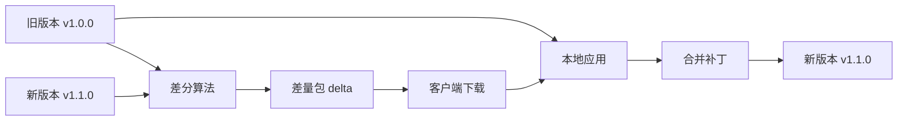
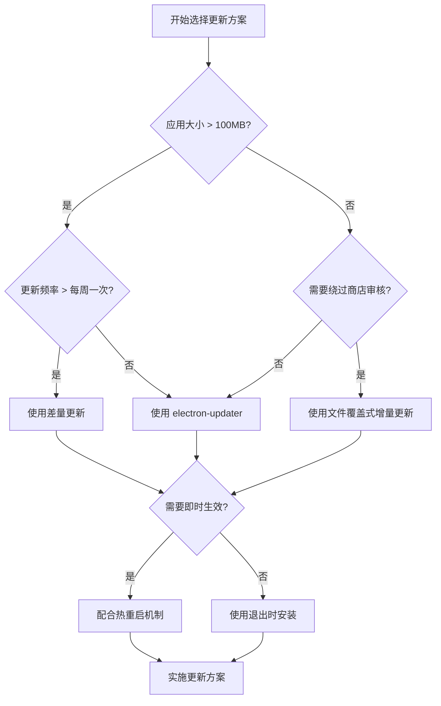

# Electron 应用更新

## 前言

作为前端开发者，我们习惯于将网页应用轻松部署到云端。当出现 Bug 或需要迭代时，只需修复代码并重新发布，用户即可无缝获取最新版本。

然而，桌面应用的更新机制远比 Web 应用复杂。对于使用 Electron 构建的应用程序，如何将修复和新功能高效、可靠地推送给用户，是一个必须面对的挑战。如果更新过程不顺畅，不仅会影响用户体验，还可能导致用户流失和安全风险。

本章将深入探讨 Electron 应用更新的几种主流方案，从实现原理、技术细节到优缺点进行全面剖析，并提供最佳实践，帮助你为你的应用选择和实施最合适的更新策略。

## 1. Electron 应用更新概述

Electron 应用的更新机制通常可以分为三大类：**全量更新**、**增量更新**和**自动更新**。它们各有优劣，适用于不同的场景。

- **全量更新**：最简单直接的方式，即下载完整的安装包并覆盖安装。这种方式实现简单，但用户体验较差，下载量大，更新率低。
- **增量更新**：只下载变更部分的文件，从而减小下载体积，提升更新速度。这种方式技术实现相对复杂，需要处理文件合并、版本管理等问题。
- **自动更新**：在应用后台自动检查、下载和安装更新，对用户干扰最小。这是目前主流应用普遍采用的方式，能显著提高更新率和用户体验。

接下来，我们将详细探讨这几种更新方案的实现细节

## 2. 手动全量更新

手动全量更新的原理非常直观：应用启动时，向服务器请求最新版本信息，并与本地 `package.json` 中的版本号进行比对。如果本地版本落后，则提示用户有新版本可用，并提供下载链接，引导用户手动下载新版安装包进行覆盖安装。

其核心实现步骤如下：

1.  **获取本地版本号**：从应用的 `package.json` 文件中读取当前版本。
2.  **获取远程版本号**：通过 HTTP 请求从服务器获取最新版本信息。服务器需要提供一个接口返回最新版本的版本号。
3.  **版本比对**：使用 `semver` 等库来比较本地版本和远程版本。
4.  **用户提示**：如果远程版本较新，通过 Electron 的 `dialog` 模块弹出对话框，询问用户是否更新。
5.  **引导下载**：如果用户同意更新，使用 `shell` 模块打开外部浏览器，跳转到新版本的下载页面。

```javascript
import { dialog, shell, app } from "electron"
import semver from "semver" // 引入 semver 库用于版本比较
import fetch from "node-fetch" // 假设使用 node-fetch 发送网络请求

// 从 package.json 获取当前应用版本
const currentVersion = app.getVersion()
// 定义软件发布页面的 URL
const releasePageUrl = "https://yourapp.com/releases/latest"
// 定义获取最新版本信息的 API 地址
const latestVersionApi = "https://api.yourapp.com/latest-version"

// 检查更新函数
async function checkAppUpdate() {
  try {
    // 1. 从服务器获取最新版本信息
    const response = await fetch(latestVersionApi)
    if (!response.ok) {
      throw new Error(`Failed to fetch latest version info: ${response.statusText}`)
    }
    const latestVersionInfo = await response.json()
    const latestVersion = latestVersionInfo.version

    // 2. 比较版本号
    if (semver.gt(latestVersion, currentVersion)) {
      // 3. 如果有新版本，提示用户
      const { response: userChoice } = await dialog.showMessageBox({
        type: "info",
        title: "发现新版本",
        message: `我们发布了新版本 ${latestVersion}，是否立即前往下载？`,
        buttons: ["立即更新", "稍后提醒"],
        defaultId: 0,
        cancelId: 1
      })

      // 4. 如果用户选择更新，则打开下载页面
      if (userChoice === 0) {
        await shell.openExternal(releasePageUrl)
      }
    }
  } catch (error) {
    console.error("检查更新失败:", error)
    // 在生产环境中，可以考虑加入更完善的错误处理和日志记录
  }
}

// 在应用启动并准备就绪后执行检查
app.whenReady().then(() => {
  checkAppUpdate()
})
```

这种更新方式优点是实现方式简单，而且非常稳定。但过程繁琐、软件包大多在 100M 左右，更新速度特别慢，而且用户更新意愿也不是很强烈，更新率低，极大可能会出现下面这幅图的情况：

<p align=center></p>

### 2.1 优缺点分析

- **优点**：

  - **实现简单**：逻辑清晰，代码量少，无需复杂的服务器端支持。
  - **可靠性高**：由于是完整替换，几乎不会出现文件损坏或版本错乱的问题。
  - **测试成本低**：只需验证新版本安装包的正确性即可。

- **缺点**：
  - **用户体验差**：需要用户手动下载和安装，操作流程长，容易中断。
  - **更新率低**：由于过程繁琐，很多用户会选择忽略更新，导致版本碎片化严重。
  - **流量和时间成本高**：每次更新都需要下载完整的安装包（通常几十到几百 MB），耗时且耗费流量。

### 2.2 适用场景

尽管全量更新存在明显缺点，但在以下场景中仍然是一种可行的选择：

- **更新频率低的应用**：如果应用一年只更新几次，全量更新的成本尚可接受。
- **用户粘性高的专业软件**：用户有强烈的动机去获取最新功能或修复，愿意手动更新。
- **作为其他更新方式的降级方案**：当自动更新或增量更新失败时，可以引导用户进行手动全量更新，作为最后的保障。

## 3. 增量更新：文件覆盖策略

全量更新虽然简单，但每次都需要下载完整的安装包，对于频繁迭代的应用来说，这会给用户带来巨大的流量和时间成本。为了优化体验，我们可以采用增量更新，即只更新发生变化的文件。

Electron 应用在打包后，业务代码通常会被打包到 `app.asar` 文件中。因此，一个直观的增量更新思路就是替换这个 `app.asar` 文件。这种文件覆盖的策略虽然听起来简单，但在不同操作系统上会遇到不同的挑战。

在 `macOS` 上，这种策略相对简单。因为系统允许在应用运行时替换文件，所以只需下载新的 `asar` 包覆盖旧文件，然后重启应用即可完成更新。

然而，在 `Windows` 上，这一过程会遇到两个主要障碍：

1.  **文件锁定**：当 Electron 应用正在运行时，Windows 会锁定 `app.asar` 文件，阻止任何对其的修改或替换操作。这意味着必须先关闭应用才能进行更新，影响了用户体验的流畅性。
2.  **管理员权限**：如果应用安装在 `C:\Program Files` 等受系统保护的目录下，修改 `app.asar` 文件通常需要管理员权限。这会触发 UAC (用户账户控制) 弹窗，给用户带来困扰。

为了解决这些问题，一种常见的策略是借助一个“更新助手”或子进程来完成。主应用下载完更新包后，不是直接覆盖，而是启动一个独立的子进程，并退出主应用。这个子进程的任务是：

1.  等待主进程完全退出，解除文件锁定。
2.  执行文件替换操作。
3.  重新启动应用程序。

这种方式虽然增加了实现的复杂度，但能够有效绕开 Windows 的限制，提供更平滑的更新体验。关于此方案的更详细探讨，可以参考这篇文章：[详解 Electron 应用升级](https://juejin.cn/post/7250288616533491749?searchId=20231222144125C40E2E68EAD7905996F0)。

### 3.1 方案一：使用 `extraResources` 将渲染进程资源外置

既然直接替换 `app.asar` 文件在 Windows 上如此麻烦，一个自然的想法是：能否将需要频繁更新的渲染进程代码（如 `HTML`, `CSS`, `JavaScript` 文件）从 `app.asar` 中分离出来，放到一个普通文件夹中？这样，更新时只需替换这个文件夹里的内容，从而避免操作 `app.asar`。

`electron-builder` 的 `extraResources` 配置项就提供了这样的能力。它允许我们将指定的文件或目录复制到应用的资源文件夹（`resources`）下，使其不被打包进 `app.asar`。

#### 3.1.1 配置 `electron-builder`

我们可以通过以下配置，将打包后的渲染进程资源（通常在 `dist` 或 `build` 目录下）排除在 `app.asar` 之外，并复制到 `app.asar.unpacked` 目录中：

```javascript
// vue.config.js 或 electron-builder.json5
{
  pluginOptions: {
    electronBuilder: {
      builderOptions: {
        // ... 其他配置
        extraResources: [{
          // from: 源文件或目录
          // to: 目标目录（相对于 resources 目录）
          // filter: 过滤规则，! 表示排除
          from: "dist_electron/bundled", // 将渲染进程的构建输出目录
          to: "app.asar.unpacked",     // 复制到 app.asar.unpacked 目录
          filter: [
            "!**/icons",         // 排除 icons 目录
            "!**/preload.js",    // 排除 preload 脚本
            "!**/node_modules",  // 排除 node_modules
            "!**/background.js"  // 排除主进程入口文件
          ]
        }],
        // files 字段用于指定哪些文件需要被打包到 app.asar 中
        files: [
          "**/icons/*",
          "**/preload.js",
          "**/node_modules/**/*",
          "**/background.js"
        ]
      },
    }
  }
}
```

其中，我们通过 `extraResources.filter` 字段指明了：**除了哪些内容外，需要构建到 `app.asar.unpacked` 中的资源**，通过 `files` 字段指明了：**需要构建到 `app.asar` 中的资源**。这段配置的意思就是除了 `icons、preload.js、node_modules、background.js` 外，其他渲染进程中的 `index.html、js、css` 资源全部打包进 `app.asar.unpacked` 中。

我们可以通过 `electron-builder` 打包试试看，最终的目录大致如下：

```bash
app.asar.unpacked
├── css
│   └── index.b2d625b8.css
├── index.html
├── js
│   ├── chunk-vendors.96b10160.js
│   ├── chunk-vendors.96b10160.js.map
│   ├── index.cfe3540f.js
│   └── index.cfe3540f.js.map
└── package.json
```

#### 3.1.2 调整资源加载路径

默认情况下，Electron 会从 `app.asar` 虚拟文件中加载 `index.html`。由于我们已经将渲染进程资源外置，因此需要修改主进程的加载逻辑，使其指向 `app.asar.unpacked` 目录。

以 `vue-cli-plugin-electron-builder` 为例，其默认的生产环境加载代码如下：

```javascript
// background.js
import { createProtocol } from "vue-cli-plugin-electron-builder/lib"

// ...
if (process.env.WEBPACK_DEV_SERVER_URL) {
  // 开发环境
  await win.loadURL(process.env.WEBPACK_DEV_SERVER_URL)
} else {
  // 生产环境
  createProtocol("app")
  win.loadURL("app://./index.html")
}
```

这里的 `createProtocol('app')` 注册了一个自定义协议，默认指向 `app.asar`。我们需要修改这个行为，让它指向外部资源目录。

一个直接的办法是修改 `createProtocol` 的实现，或者在主进程中动态判断并构建正确的文件路径。一个更清晰的路径管理方式如下：

```javascript
// background.js
import { app, BrowserWindow, protocol } from "electron"
import path from "path"

const isDevelopment = process.env.NODE_ENV !== "production"

// ...

async function createWindow() {
  const win = new BrowserWindow(/* ... */)

  if (isDevelopment) {
    // 开发环境：直接加载 dev server
    await win.loadURL(process.env.WEBPACK_DEV_SERVER_URL)
  } else {
    // 生产环境：加载外置的渲染进程文件
    const indexPath = path.join(
      process.resourcesPath,
      "app.asar.unpacked",
      "index.html"
    )
    win.loadFile(indexPath)
  }
}
```

`process.resourcesPath` 指向应用安装目录下的 `resources` 文件夹。通过拼接路径，我们可以精确地加载 `app.asar.unpacked` 中的 `index.html` 文件。

#### 3.1.3 实现更新逻辑

完成上述配置后，更新过程就转变为下载新的资源包（例如一个 zip 文件），并将其解压覆盖到 `app.asar.unpacked` 目录。这可以使用 `download` 和 `extract-zip` 等库来完成。

```javascript
import download from "download"
import path from "path"
import fs from "fs-extra" // 使用 fs-extra 增强文件操作能力

// 远程资源包的 URL
const remotePackageUrl = "https://your-server.com/latest-renderer.zip"
// 定义解压的目标路径，即渲染进程资源目录
const targetPath = path.join(process.resourcesPath, "app.asar.unpacked")
// 临时下载目录
const tempDir = path.join(app.getPath("temp"), "update-package")

async function applyUpdate() {
  try {
    // 1. 清空临时目录和目标目录
    await fs.emptyDir(tempDir)

    // 2. 下载资源包到临时目录
    await download(remotePackageUrl, tempDir, {
      extract: true // download 库支持直接解压
    })

    // 3. 将解压后的文件移动到目标目录
    // 注意：这里需要根据实际的压缩包结构调整
    const sourceDir = path.join(tempDir, "dist") // 假设 zip 包内有个 dist 文件夹
    await fs.copy(sourceDir, targetPath, { overwrite: true })

    // 4. 清理临时文件
    await fs.remove(tempDir)

    // 5. 提示用户重启应用
    dialog
      .showMessageBox({
        type: "info",
        title: "更新完成",
        message: "新版本已准备就绪，请重启应用以体验。"
      })
      .then(() => {
        app.relaunch()
        app.exit()
      })
  } catch (error) {
    console.error("增量更新失败:", error)
    // 此处应有错误处理和回滚机制
  }
}
```

### 3.2 方案二：使用 `asar: false` 完全禁用 asar 打包

除了将部分资源外置，`electron-builder` 还提供了一个更彻底的选项：完全禁用 `asar` 打包。通过设置 `asar: false`，所有源码和资源文件都将以原始的文件目录结构存放在 `resources/app` 目录下，而不是被压缩进一个 `app.asar` 文件。

#### 3.2.1 配置 `electron-builder`

配置非常简单，只需在 `builderOptions` 中加入一行：

```javascript
// vue.config.js 或 electron-builder.json5
{
  pluginOptions: {
    electronBuilder: {
      builderOptions: {
        asar: false, // 完全禁用 asar 打包
        // ... 其他配置
      },
    }
  }
}
```

通过这种方式打包，最终的应用资源目录结构大致如下：

```bash
resources/
└── app/
    ├── background.js
    ├── index.html
    ├── package.json
    ├── preload.js
    └── renderer/
        ├── css/
        └── js/
```

#### 3.2.2 优缺点分析

- **优点**：

  - **更新灵活**：由于所有文件都是散列的，你可以精确地更新任何一个或多个文件，实现真正的“热更新”或极小粒度的增量更新。
  - **调试方便**：可以直接在安装目录下查看和修改源代码，便于问题排查。

- **缺点**：
  - **启动性能略低**：`asar` 归档能通过减少文件系统调用来优化应用的冷启动速度。禁用 `asar` 会在一定程度上牺牲这点性能优势。
  - **源码暴露风险**：所有源代码都是明文存储的，任何能够访问安装目录的人都可以轻易查看。这对于商业应用或包含敏感逻辑的应用来说，是一个严重的安全隐患。
  - **文件零散**：大量的小文件在某些系统上可能会导致复制、移动等操作变慢。

#### 3.2.3 适用场景

此方案适用于以下情况：

- **内部工具或开源项目**：对源码安全要求不高，但对更新灵活性和调试便利性有较高要求的场景。
- **需要频繁、小范围更新的应用**：例如，一个需要经常更新 UI 样式或配置文件的应用。

总的来说，`asar: false` 提供了一种极致灵活的更新方式，但牺牲了性能和安全性。在选择此方案前，务必仔细权衡其带来的风险。

## 4. 自动更新：使用 electron-updater

对于大多数应用而言，自动更新是提升用户体验和更新率的最佳选择。`electron-builder` 配套的 `electron-updater` 库为此提供了强大而灵活的解决方案，能够轻松实现应用的静默更新和用户提示更新。

### 4.1 配置 `electron-builder`

要使用 `electron-updater`，首先需要在 `electron-builder` 的配置中指定 `publish` 字段，它告诉 `electron-updater` 去哪里寻找更新。

#### 4.1.1 设置 `publish` 提供者

`publish` 字段可以是一个字符串，也可以是一个对象数组，用于配置一个或多个更新源。`provider` 是核心字段，常见的选项有：

- **`github`**：最常用的方式，直接从 GitHub Releases 下载更新。
- **`generic`**：通用服务器，你需要提供一个指向更新描述文件（如 `latest.yml`）的 URL。
- **`s3`**, **`keygen`** 等：也支持其他云存储和发布服务。

**GitHub Provider 示例：**

```javascript
// package.json 或 electron-builder.json5
{
  "build": {
    "publish": [
      {
        "provider": "github",
        "owner": "your-github-username",
        "repo": "your-repo-name"
      }
    ],
    // ...
  }
}
```

**通用服务器 (Generic) 示例：**

如果你的更新包存放在自己的服务器上，可以使用 `generic` provider。

```javascript
{
  "build": {
    "publish": [
      {
        "provider": "generic",
        "url": "https://your-update-server.com/downloads/"
      }
    ],
    // ...
  }
}
```

在这种情况下，`electron-updater` 会尝试访问 `https://your-update-server.com/downloads/latest.yml` 来获取更新信息。

#### 4.1.2 构建与 `latest.yml`

当你配置好 `publish` 并运行 `electron-builder` 打包时，它会在输出目录（默认为 `dist` 或 `build`）下生成特定于平台的文件，如 `.exe`, `.dmg`，以及一个关键的 `latest.yml` 文件。这个 YAML 文件描述了最新版本的信息：

```yaml
version: 1.2.3
files:
  - url: MyApp-1.2.3.exe
    sha512: ...
    size: ...
path: MyApp-1.2.3.exe
sha512: ...
releaseDate: "2023-12-25T12:00:00.000Z"
```

你需要将 `latest.yml` 和安装包文件一起上传到你在 `publish` 字段中指定的服务器或 GitHub Releases 上。`electron-updater` 正是靠读取这个文件来判断是否有新版本的。

#### 4.1.3 高级配置：发布渠道与分阶段发布

为了更精细地控制更新推送，`electron-updater` 支持发布渠道（Channels）和分阶段发布（Staged Rollouts）的概念。

**发布渠道 (Channels)**

你可以为不同的发布版本设置渠道，例如 `stable`、`beta`、`alpha`。默认情况下，`electron-updater` 会查找与当前应用版本号匹配的渠道。例如，如果你的应用版本是 `2.0.0-beta.1`，它会自动查找 `beta` 渠道的更新。

你也可以在打包时通过 `--channel` 或 `-c` 参数指定渠道，`electron-builder` 会生成对应渠道的更新描述文件（如 `beta.yml`，macOS 上为 `beta-mac.yml`）。

在主进程中，你可以通过 `autoUpdater.channel` 属性来手动设置或切换要检查的渠道：

```javascript
// 切换到 beta 渠道来检查测试版更新
autoUpdater.channel = "beta"
autoUpdater.checkForUpdates()
```

**分阶段发布 (Staged Rollouts)**

分阶段发布允许你将新版本只推送给一部分用户，从而降低大规模部署的风险。这可以通过在 `latest.yml` 文件中添加 `stagingPercentage` 字段来实现。

```yaml
version: 1.2.4
files:
  # ...
path: MyApp-1.2.4.exe
sha512: ...
releaseDate: "2023-12-26T10:00:00.000Z"
stagingPercentage: 25 # 将此更新推送给 25% 的用户
```

当 `electron-updater` 检测到 `stagingPercentage` 字段时，它会根据客户端的唯一标识（用户 ID）进行哈希计算，以确定当前用户是否落在指定的百分比范围内。如果用户不在此次推送范围内，`update-available` 事件将不会被触发。

这个功能对于验证新版本的稳定性至关重要，可以让你在全面推送前收集早期用户的反馈。

### 4.2 在主进程中实现更新逻辑

在主进程中，我们需要引入 `autoUpdater` 对象，并监听一系列事件来管理整个更新流程。一个良好的实践是将其封装在一个类中，以便于管理。

```javascript
// src/main/updater.js
import { autoUpdater } from "electron-updater"
import { app, dialog, BrowserWindow } from "electron"

class AppUpdater {
  constructor() {
    // 配置 autoUpdater
    this.configure()
    // 注册事件监听
    this.registerEvents()
  }

  configure() {
    // 禁用自动下载，改为手动触发，给用户更多控制权
    autoUpdater.autoDownload = false
    // 退出时自动安装更新
    autoUpdater.autoInstallOnAppQuit = true

    // 在开发模式下，可能需要设置一些模拟更新的路径
    if (process.env.NODE_ENV === "development") {
      autoUpdater.updateConfigPath = path.join(__dirname, "dev-app-update.yml")
    }
  }

  registerEvents() {
    // 1. 检查更新出错
    autoUpdater.on("error", (error) => {
      console.error("更新失败", error)
      dialog.showErrorBox(
        "更新失败",
        error.message || "检查更新时发生未知错误，请稍后重试。"
      )
    })

    // 2. 正在检查更新
    autoUpdater.on("checking-for-update", () => {
      console.log("正在检查更新...")
      // 可以向渲染进程发送消息，在界面上显示提示
      this.sendUpdateMessage({ event: "checking-for-update" })
    })

    // 3. 检测到新版本
    autoUpdater.on("update-available", (info) => {
      console.log(`发现新版本: ${info.version}`)
      this.sendUpdateMessage({ event: "update-available", data: info })

      // 提示用户是否下载更新
      dialog
        .showMessageBox({
          type: "info",
          title: "应用更新",
          message: `发现新版本 ${info.version}，是否立即下载？`,
          buttons: ["立即下载", "稍后"],
          defaultId: 0,
          cancelId: 1
        })
        .then(({ response }) => {
          if (response === 0) {
            autoUpdater.downloadUpdate()
          }
        })
    })

    // 4. 未发现新版本
    autoUpdater.on("update-not-available", (info) => {
      console.log("当前已是最新版本。")
      this.sendUpdateMessage({ event: "update-not-available", data: info })
    })

    // 5. 下载进度
    autoUpdater.on("download-progress", (progressObj) => {
      this.sendUpdateMessage({ event: "download-progress", data: progressObj })
    })

    // 6. 下载完成
    autoUpdater.on("update-downloaded", (info) => {
      console.log("新版本下载完成，将在退出时自动安装。")
      this.sendUpdateMessage({ event: "update-downloaded", data: info })
      dialog
        .showMessageBox({
          title: "安装新版本",
          message:
            "更新已下载完成，应用将在退出后自动安装。是否立即重启以完成更新？",
          buttons: ["立即重启", "稍后重启"],
          defaultId: 0,
          cancelId: 1
        })
        .then(({ response }) => {
          if (response === 0) {
            // 调用 quitAndInstall 会关闭所有窗口，然后自动安装并重启应用
            autoUpdater.quitAndInstall()
          }
        })
    })
  }

  // 外部调用的检查更新方法
  checkForUpdates() {
    autoUpdater.checkForUpdates()
  }

  /**
   * @description 向渲染进程发送消息
   * @param {object} message - 要发送的消息体，通常包含事件名称和数据
   */
  sendUpdateMessage(message) {
    // BrowserWindow.getAllWindows() 获取当前所有打开的窗口
    BrowserWindow.getAllWindows().forEach((win) => {
      // win.webContents.send 是主进程向特定渲染进程发送消息的方法
      win.webContents.send("update-message", message)
    })
  }
}

export default AppUpdater
```

然后在你的主进程入口文件（如 `background.js`）中实例化并使用它：

```javascript
// background.js
import { app } from "electron"
import AppUpdater from "./updater"

// ... 创建窗口等逻辑

app.whenReady().then(() => {
  // ...
  const updater = new AppUpdater()
  // 在合适的时机（例如，用户点击菜单或应用启动后）检查更新
  updater.checkForUpdates()
})
```

### 4.3 在渲染进程中接收和处理更新事件

主进程通过 `win.webContents.send` 发送消息，渲染进程则需要通过 `ipcRenderer` 模块来接收。为了安全起见，我们应该使用 `contextBridge` 和预加载脚本（`preload.js`）来暴露通信接口，而不是直接在渲染进程中启用 `nodeIntegration`。

#### 4.3.1 设置 Preload 脚本

首先，确保在创建 `BrowserWindow` 时指定了 `preload` 脚本：

```javascript
// background.js
const win = new BrowserWindow({
  webPreferences: {
    preload: path.join(__dirname, "preload.js")
    // contextIsolation: true, // 默认开启，为了安全
    // nodeIntegration: false, // 默认关闭，为了安全
  }
})
```

#### 4.3.2 暴露 IPC 接口

在 `preload.js` 中，我们监听主进程发来的 `update-message` 频道，并将其转发给 `window` 对象上的一个自定义事件或回调函数。

```javascript
// preload.js
const { contextBridge, ipcRenderer } = require("electron")

contextBridge.exposeInMainWorld("electronAPI", {
  // 监听来自主进程的更新消息
  onUpdateMessage: (callback) => {
    ipcRenderer.on("update-message", (event, message) => {
      callback(message)
    })
  }
})
```

#### 4.3.3 在渲染进程中处理 UI

现在，在你的前端代码（例如 React, Vue 组件）中，你就可以安全地监听这些事件并更新 UI 了。

```javascript
// renderer.js (例如，在一个 React 组件中)
import React, { useEffect, useState } from "react"

function UpdateNotification() {
  const [message, setMessage] = useState("")
  const [progress, setProgress] = useState(null)

  useEffect(() => {
    // 通过 preload 暴露的 API 监听消息
    window.electronAPI.onUpdateMessage((msg) => {
      console.log("收到主进程消息:", msg)
      switch (msg.event) {
        case "checking-for-update":
          setMessage("正在检查更新...")
          break
        case "update-available":
          setMessage(`发现新版本 ${msg.data.version}，等待用户确认...`)
          break
        case "update-not-available":
          setMessage("当前已是最新版本。")
          // 短暂显示后可以隐藏消息
          setTimeout(() => setMessage(""), 3000)
          break
        case "download-progress":
          setMessage("正在下载更新...")
          setProgress(msg.data.percent.toFixed(2))
          break
        case "update-downloaded":
          setMessage(
            "更新下载完成！将在您重启应用后自动安装。或者点击下方按钮立即重启。"
          )
          // 可以在此显示一个“立即重启”的按钮
          break
        case "error":
          setMessage(`更新出错: ${msg.data.message}`)
          break
      }
    })
  }, [])

  if (!message) return null

  return (
    <div className="update-notification">
      <p>{message}</p>
      {progress && <progress value={progress} max="100"></progress>}
    </div>
  )
}

export default UpdateNotification
```

通过这种 **主进程 -> Preload -> 渲染进程** 的单向数据流，我们构建了一个安全且解耦的通信模式，让用户能够清晰地了解更新的每一个阶段。

### 4.4 代码签名与公证

需要特别注意的是，在 `macOS` 和 `Windows` 上，为了让自动更新顺利进行，你的应用程序必须经过有效的代码签名。对于 `macOS`，除了代码签名，还需要对应用进行公证（Notarization），否则系统会阻止更新包的执行。

这部分内容相对独立和复杂，你可以参考本文上文「代码签名与公证」章节（或本篇末尾的代码签名详解）来获取详细的签名和公证指南。

### 4.5 实现强制更新

在某些情况下，例如发现了严重的安全漏洞，你可能需要强制用户更新到最新版本。`electron-updater` 可以通过解析 `latest.yml` 文件中的特定字段来实现这一点。

1.  **在 `latest.yml` 中添加标识**

    你可以在构建时动态生成或手动修改 `latest.yml`，添加一个自定义字段，如 `forceUpdate: true`。

2.  **在 `update-available` 事件中检查标识**

    在检测到新版本时，检查 `info` 对象中是否包含这个强制更新的标识。

    ```javascript
    autoUpdater.on("update-available", (info) => {
      if (info.forceUpdate) {
        // 强制更新逻辑
        dialog
          .showMessageBox({
            type: "info",
            title: "重要更新",
            message:
              "我们发布了一个重要的安全更新，需要立即安装以保护您的数据安全。应用将在下载完成后自动重启。",
            buttons: ["立即下载"],
            cancelId: -1 // 不允许取消
          })
          .then(() => {
            autoUpdater.downloadUpdate()
          })
        // 强制下载，并监听下载完成事件，完成后立即重启
        autoUpdater.on("update-downloaded", () => {
          autoUpdater.quitAndInstall(true, true)
        })
      } else {
        // 正常更新逻辑...
      }
    })
    ```

通过这种方式，你可以灵活地控制哪些版本需要强制更新，确保所有用户都能及时获得关键修复。

### 4.6 优缺点分析与适用场景

`electron-updater` 提供了一套功能完备、高度集成的自动更新解决方案，是目前社区的主流选择。

- **优点**：
  - **用户体验极佳**：支持后台静默下载、增量更新（在支持的平台上），对用户的干扰降到最低。
  - **功能强大**：内置了对多平台、代码签名、发布渠道、分阶段发布等高级功能的支持。
  - **集成度高**：与 `electron-builder` 无缝集成，配置简单，开箱即用。
  - **社区活跃**：拥有庞大的用户基础和活跃的社区支持，遇到问题容易找到解决方案。

- **缺点**：
  - **灵活性受限**：高度封装也意味着定制化能力相对较弱。对于需要深度自定义更新流程（例如，更新非 `asar` 内的文件）的场景，可能需要更底层的方案。
  - **依赖构建工具**：强依赖 `electron-builder`，如果你的项目使用其他构建工具，集成会比较困难。
  - **问题排查可能复杂**：由于内部逻辑复杂，一旦出现问题，排查错误的根本原因可能需要对 `electron-updater` 的工作原理有较深的理解。

- **适用场景**：
  - **所有面向普通用户的桌面应用**：无论是商业软件还是免费工具，只要希望提供流畅、无感的更新体验，`electron-updater` 都是首选。
  - **需要快速迭代和高更新率的项目**：自动更新机制能确保大部分用户始终使用最新版本，便于新功能的推广和旧问题的修复。
  - **追求开发效率的团队**：相比于自研更新方案，`electron-updater` 能节省大量的开发和维护成本。

## 5. 差量更新

差量更新（Delta Update）是一种高级的更新策略，它只下载新旧版本之间的差异部分，而不是完整的安装包。这可以显著减少下载量，提升更新速度，特别适合频繁更新的大型应用。

### 5.1 工作原理



差量更新的核心步骤：
1. **生成差量包**：在服务端计算新旧版本的差异，生成差量包
2. **下载差量包**：客户端只下载差量包而非完整安装包
3. **本地合并**：将差量包与本地旧版本合并，生成新版本

### 5.2 NSIS 差量更新（Windows）

`electron-builder` 的 NSIS 安装程序内置支持差量更新。只需简单配置即可启用：

```yaml
## electron-builder.yml
nsis:
  differentialPackage: true  # 启用差量更新
```

启用后，`electron-updater` 会自动处理差量下载和合并。差量包文件命名格式为：

```
MyApp-1.1.0-full.nupkg               # 完整包
MyApp-1.0.0-to-1.1.0-delta.nupkg     # 差量包
```

### 5.3 macOS 差量更新

macOS 的 DMG 格式不原生支持差量更新。推荐使用以下策略：

#### 方案一：使用 ZIP 格式

```yaml
mac:
  target:
    - target: zip    # 用于差量更新
      arch:
        - x64
        - arm64
    - target: dmg    # 用于首次安装
```

#### 方案二：使用增量更新框架

社区也有基于 electron-updater 分支的差量更新方案（如 `electron-differential-updater`），其 `MacUpdater` 等类的用法与 `electron-updater` 基本一致，具体差异请以官方 README 为准：

```javascript
const { MacUpdater } = require('electron-differential-updater')

const updater = new MacUpdater()
updater.autoDownload = false
updater.on('update-downloaded', () => {
  updater.quitAndInstall()
})
updater.checkForUpdates()
```

### 5.4 自定义差量更新实现

对于需要更精细控制的场景，可以自行实现差量更新逻辑：

```javascript
import { createHash } from 'crypto'
import fetch from 'node-fetch'
import fs from 'fs-extra'
import path from 'path'

class DeltaUpdater {
  constructor(options) {
    this.manifestUrl = options.manifestUrl
    this.deltaUrl = options.deltaUrl
    this.appPath = options.appPath
  }

  // 生成文件清单（包含文件路径和 MD5）
  async generateManifest(dir) {
    const files = await this.walkDir(dir)
    const manifest = {}

    for (const file of files) {
      const content = await fs.readFile(file)
      const hash = createHash('md5').update(content).digest('hex')
      manifest[path.relative(dir, file)] = hash
    }

    return manifest
  }

  // 比较本地和服务端清单，获取需要更新的文件列表
  async getChangedFiles() {
    const localManifest = await this.generateManifest(this.appPath)
    const response = await fetch(this.manifestUrl)
    const remoteManifest = await response.json()

    const changedFiles = []
    const deletedFiles = []
    const addedFiles = []

    // 检查修改和删除
    for (const [file, hash] of Object.entries(localManifest)) {
      if (!remoteManifest[file]) {
        deletedFiles.push(file)
      } else if (remoteManifest[file] !== hash) {
        changedFiles.push(file)
      }
    }

    // 检查新增
    for (const file of Object.keys(remoteManifest)) {
      if (!localManifest[file]) {
        addedFiles.push(file)
      }
    }

    return { changedFiles, deletedFiles, addedFiles }
  }

  // 下载并应用更新
  async applyDelta() {
    const { changedFiles, deletedFiles, addedFiles } = await this.getChangedFiles()

    // 删除已移除的文件
    for (const file of deletedFiles) {
      await fs.remove(path.join(this.appPath, file))
    }

    // 下载变更的文件
    const filesToDownload = [...changedFiles, ...addedFiles]
    for (const file of filesToDownload) {
      const url = `${this.deltaUrl}/${file}`
      const response = await fetch(url)
      const buffer = await response.buffer()
      await fs.ensureDir(path.dirname(path.join(this.appPath, file)))
      await fs.writeFile(path.join(this.appPath, file), buffer)
    }

    console.log(`更新完成: ${changedFiles.length} 个文件修改, ${addedFiles.length} 个文件新增, ${deletedFiles.length} 个文件删除`)
  }

  // 递归遍历目录
  async walkDir(dir, fileList = []) {
    const files = await fs.readdir(dir)
    for (const file of files) {
      const filePath = path.join(dir, file)
      const stat = await fs.stat(filePath)
      if (stat.isDirectory()) {
        await this.walkDir(filePath, fileList)
      } else {
        fileList.push(filePath)
      }
    }
    return fileList
  }
}

export default DeltaUpdater
```

### 5.5 差量更新优缺点

| 特性 | 差量更新 | 全量更新 |
|------|---------|---------|
| 下载大小 | 小（仅差异部分） | 大（完整安装包） |
| 更新速度 | 快 | 慢 |
| 实现复杂度 | 高 | 低 |
| 可靠性 | 中（依赖合并逻辑） | 高 |
| 适用场景 | 频繁小更新 | 大版本升级 |

**最佳实践建议**：
- 对于小型应用，差量更新的收益不大，建议使用全量更新
- 对于大型应用或频繁更新的应用，差量更新可以显著提升用户体验
- 始终保留全量更新作为备选方案，当差量更新失败时回退

## 6. 更新方案对比与选择

### 6.1 方案对比表

| 方案 | 下载量 | 用户体验 | 实现复杂度 | 可靠性 | 适用场景 |
|------|--------|---------|-----------|--------|---------|
| 手动全量更新 | 大 | 差 | 低 | 高 | 低频更新、企业内部应用 |
| 文件覆盖式增量更新 | 小 | 中 | 中 | 中 | 需要 hotfix、绕过应用商店审核 |
| electron-updater 自动更新 | 中 | 优 | 低 | 高 | 大多数应用的首选方案 |
| 差量更新 | 最小 | 优 | 高 | 中 | 大型应用、频繁小更新 |

### 6.2 选择决策流程



### 6.3 混合策略推荐

实际项目中，推荐采用混合更新策略：

1. **主更新通道**：使用 `electron-updater` 自动更新
2. **降级方案**：当自动更新失败时，提供手动下载链接
3. **热修复通道**：对于紧急 bug，使用文件覆盖式更新快速修复
4. **强制更新机制**：对于关键安全更新，强制用户更新

```javascript
class HybridUpdater {
  constructor() {
    this.primaryUpdater = new ElectronUpdater()
    this.fallbackUrl = 'https://example.com/downloads'
  }

  async checkAndUpdate() {
    try {
      // 尝试自动更新
      await this.primaryUpdater.checkForUpdates()
    } catch (error) {
      console.error('自动更新失败，提供手动下载')
      // 显示手动下载对话框
      await this.showManualDownloadDialog()
    }
  }

  async showManualDownloadDialog() {
    const { response } = await dialog.showMessageBox({
      type: 'info',
      title: '更新可用',
      message: '检测到新版本，是否前往下载页面？',
      buttons: ['前往下载', '稍后提醒'],
      defaultId: 0
    })

    if (response === 0) {
      shell.openExternal(this.fallbackUrl)
    }
  }
}
```

## 7. 常见问题与故障排查

### 7.1 更新检查失败

**问题**：应用无法检查到更新

**排查步骤**：

```javascript
// 添加详细日志
autoUpdater.logger = require('electron-log')
autoUpdater.logger.transports.file.level = 'debug'

// 检查配置
console.log('Update config path:', autoUpdater.updateConfigPath)
console.log('Current version:', app.getVersion())

// 手动检查更新
autoUpdater.checkForUpdates().catch(err => {
  console.error('Check failed:', err)
})
```

**常见原因**：
1. `latest.yml` 文件未正确上传或路径错误
2. 版本号格式不正确（必须符合 semver 规范）
3. 网络问题或跨域限制
4. 证书问题（HTTPS 必须使用有效证书）

### 7.2 更新下载中断

**问题**：下载过程中断或失败

**解决方案**：

```javascript
// 实现断点续传
autoUpdater.on('download-progress', (progress) => {
  // 保存进度
  store.set('updateProgress', {
    transferred: progress.transferred,
    total: progress.total,
    percent: progress.percent
  })
})

// 恢复下载
autoUpdater.on('error', async (error) => {
  if (error.message.includes('DOWNLOAD_INTERRUPTED')) {
    const savedProgress = store.get('updateProgress')
    // 尝试重新下载
    await autoUpdater.downloadUpdate()
  }
})
```

### 7.3 macOS 公证相关错误

**问题**：更新后应用无法打开，提示"已损坏"

**解决方案**：

```yaml
# 确保 hardenedRuntime 启用
mac:
  hardenedRuntime: true
  gatekeeperAssess: false
  entitlements: "build/entitlements.mac.plist"
  entitlementsInherit: "build/entitlements.mac.plist"

# 确保完成公证
afterSign: "scripts/notarize.js"
```

### 7.4 Windows 签名验证失败

**问题**：SmartScreen 警告或签名验证失败

**解决方案**：

```yaml
win:
  target: nsis
  signingHashAlgorithms:
    - sha256
  certificateFile: path/to/cert.pfx
  certificatePassword: ${env.CERT_PASSWORD}
  rfc3161TimeStampServer: http://timestamp.digicert.com
  publisherName: "Your Company Name"
```

### 7.5 版本回滚

**问题**：新版本存在严重问题，需要回滚

**解决方案**：

```javascript
// electron-updater 没有内置回滚机制，常见的回滚做法是：
// 1. 将服务器上的 latest.yml 重新指回旧版本号，让客户端“更新”回旧版本
// 2. 或引导用户手动下载并安装旧版本安装包
async function rollbackToVersion(targetVersion) {
  const downloadUrl = `https://example.com/downloads/app-${targetVersion}.exe`
  // 下载旧版本安装包
  await download(downloadUrl, tempDir)
  // 执行安装
  shell.openPath(installerPath)
  // 退出当前应用
  app.quit()
}
```

## 总结

本小节我们详细介绍了 Electron 常见的三种更新方式：手动更新、覆盖式更新、自动更新。

手动更新又称全量更新，是一种比较传统的更新方式，其优势是稳定、简单。缺点就是过程繁琐、慢、影响使用、更新率低。适用于低频更新、用户粘性高、作为各种升级技术的降级方案。

覆盖式更新（增量更新）其优势就是更新速度快，但是实现比较复杂、稳定性差、写文件容易失败，比较适合 `hotfix` 打补丁式的发布更新。

自动更新比较稳定、快、而且对用户的打扰少，但是整体实现稍微复杂，一般适用于高频更新软件、体验要求高的场景。

至此，我们探讨了从简单的手动全量更新，到灵活的文件覆盖式增量更新，再到体验最佳的 `electron-updater` 自动更新方案。选择哪种策略取决于你的应用类型、迭代频率、团队资源和对用户体验的追求。一个健壮的更新系统是桌面应用成功的关键一环，希望本章的内容能为你构建可靠的应用更新机制提供坚实的基础。
