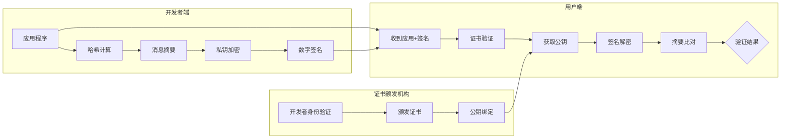
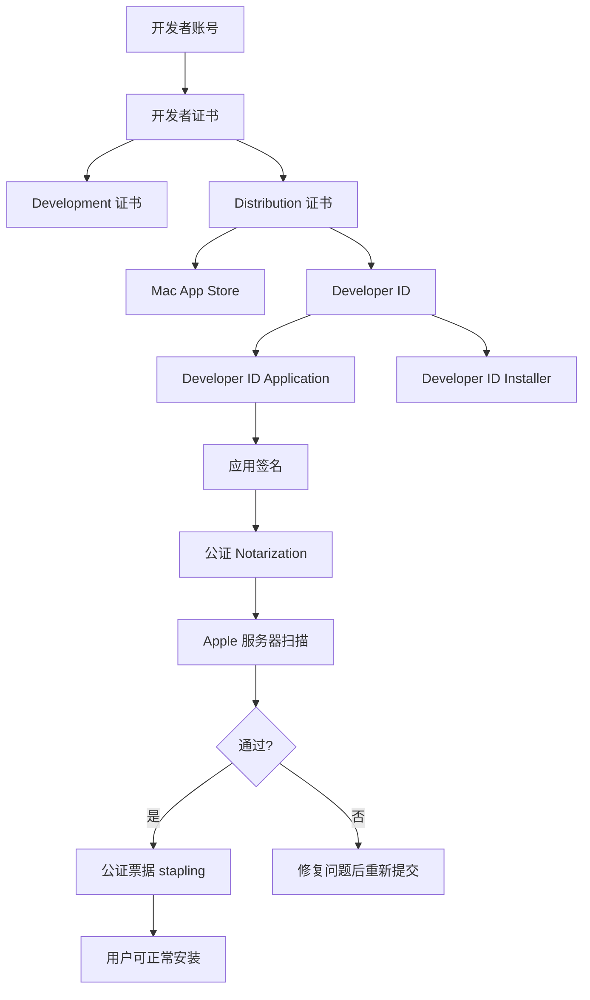
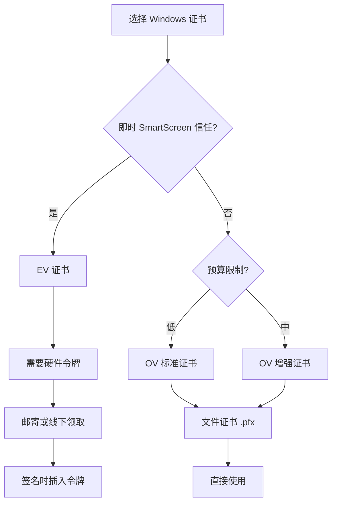
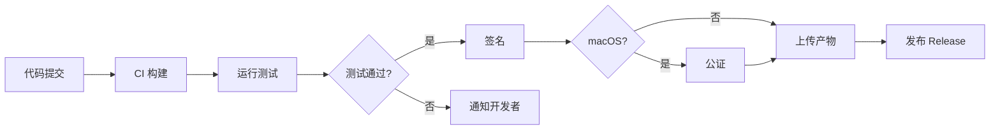

# Electron 代码签名

代码签名是对应用程序进行数字签名的过程，确保应用来源可信、未被篡改。本文详细介绍各平台的代码签名原理、方法和最佳实践。

## 为什么需要代码签名

## 安全保障

| 安全特性 | 说明 |
|---------|------|
| **信任验证** | 用户可以验证应用的真实来源，确认开发者身份 |
| **防篡改** | 确保应用自签名后未被修改，保证代码完整性 |
| **系统信任** | macOS Gatekeeper 和 Windows SmartScreen 会阻止未签名应用 |
| **自动更新** | electron-updater 等更新机制需要签名验证 |
| **商店发布** | App Store、Microsoft Store 必须使用有效签名 |

## 平台限制对比

| 平台 | 未签名应用限制 | 签名要求 |
|------|--------------|---------|
| **macOS** | Gatekeeper 阻止运行，显示"无法验证开发者" | 必须 Apple Developer 证书 + 公证 |
| **Windows** | SmartScreen 警告，用户需手动确认 | 推荐代码签名证书（EV 或 OV） |
| **Linux** | 无限制 | 可选，提供 checksum 校验 |

## 代码签名原理

## 数字签名基础

代码签名基于非对称加密技术，其核心原理如下：



## 关键概念

##### 1. 代码签名证书

代码签名证书由受信任的证书颁发机构（CA）签发，包含：
- 开发者身份信息
- 公钥
- CA 的数字签名
- 有效期

**证书类型对比**：

| 类型 | 验证级别 | 价格 | SmartScreen 信誉 | 适用场景 |
|------|---------|------|-----------------|---------|
| **OV（标准）** | 组织验证 | 较低 | 需累积建立 | 个人开发者、小团队 |
| **EV（扩展）** | 扩展验证 | 较高 | 即时信任 | 企业级应用、安全敏感应用 |

##### 2. 哈希算法

签名时使用的哈希算法决定了签名的安全性：

| 算法 | 状态 | 说明 |
|------|------|------|
| MD5 | 已弃用 | 存在碰撞攻击风险 |
| SHA-1 | 已弃用 | 2016 年起不再安全 |
| SHA-256 | 推荐 | 当前标准 |
| SHA-384/512 | 可选 | 更高强度 |

##### 3. 时间戳

时间戳服务器为签名添加可信时间证明，确保证书过期后签名仍然有效：

```
签名数据 + 时间戳服务器签名 → 带时间戳的签名
```

**常用时间戳服务器**：
- DigiCert: `http://timestamp.digicert.com`
- Sectigo: `http://timestamp.sectigo.com`
- GlobalSign: `http://timestamp.globalsign.com`

## macOS 签名架构

macOS 的代码签名体系较为复杂，涉及多个概念：



**证书类型说明**：

| 证书类型 | 用途 | 分发方式 |
|---------|------|---------|
| Apple Development | 开发测试 | 本地调试 |
| Mac App Distribution | App Store 分发 | Mac App Store |
| Mac Installer Distribution | App Store 安装包 | Mac App Store |
| Developer ID Application | 直接分发 | 官网下载 |
| Developer ID Installer | 安装包签名 | 官网下载 |

## macOS 签名与公证

## 准备工作

##### 1. 申请 Apple Developer 账号

访问 [Apple Developer Program](https://developer.apple.com/programs/)，年费 $99。

##### 2. 获取开发者证书

```bash
# 在 Xcode 中登录 Apple ID
# Preferences → Accounts → Manage Certificates → 点击 "+" 添加证书

# 或使用命令行
security create-keychain -p mypassword build.keychain
security default-keychain -s build.keychain
security unlock-keychain -p mypassword build.keychain

# 导入证书（从 Apple 下载的 .p12 文件）
security import certificate.p12 -k build.keychain -P password -T /usr/bin/codesign
```

##### 3. 查看已安装证书

```bash
# 列出所有代码签名证书
security find-identity -v -p codesigning

# 输出示例
# 1) XXXXXXXX "Apple Development: Your Name (XXXXXXXXXX)"
# 2) XXXXXXXX "Developer ID Application: Your Name (XXXXXXXXXX)"
```

## electron-builder 配置

##### 基础配置

```json
// electron-builder.json
{
  "appId": "com.yourcompany.yourapp",
  "mac": {
    "category": "public.app-category.productivity",
    "hardenedRuntime": true,
    "gatekeeperAssess": false,
    "entitlements": "build/entitlements.mac.plist",
    "entitlementsInherit": "build/entitlements.mac.plist"
  },
  "afterSign": "scripts/notarize.js"
}
```

##### 完整配置示例

```json
{
  "mac": {
    "target": [
      {
        "target": "dmg",
        "arch": ["x64", "arm64", "universal"]
      },
      {
        "target": "zip",
        "arch": ["x64", "arm64"]
      }
    ],
    "category": "public.app-category.productivity",
    "icon": "build/icon.icns",
    "hardenedRuntime": true,
    "gatekeeperAssess": false,
    "entitlements": "build/entitlements.mac.plist",
    "entitlementsInherit": "build/entitlements.mac.plist",
    "extendInfo": {
      "NSCameraUsageDescription": "This app requires camera access for video calls.",
      "NSMicrophoneUsageDescription": "This app requires microphone access for audio recording."
    }
  },
  "dmg": {
    "sign": false,
    "background": "build/dmg-background.png",
    "iconSize": 100,
    "contents": [
      { "x": 130, "y": 220 },
      { "x": 410, "y": 220, "type": "link", "path": "/Applications" }
    ]
  }
}
```

## entitlements.mac.plist 配置

Entitlements 文件声明应用所需的特殊权限：

```xml
<?xml version="1.0" encoding="UTF-8"?>
<!DOCTYPE plist PUBLIC "-//Apple//DTD PLIST 1.0//EN" "http://www.apple.com/DTDs/PropertyList-1.0.dtd">
<plist version="1.0">
<dict>
  <!-- 允许 JIT 编译（V8 引擎需要） -->
  <key>com.apple.security.cs.allow-jit</key>
  <true/>
  
  <!-- 允许未签名的可执行内存（某些原生模块需要） -->
  <key>com.apple.security.cs.allow-unsigned-executable-memory</key>
  <true/>
  
  <!-- 禁用库验证（允许加载动态库） -->
  <key>com.apple.security.cs.disable-library-validation</key>
  <true/>
  
  <!-- 允许 DYLD 环境变量 -->
  <key>com.apple.security.cs.allow-dyld-environment-variables</key>
  <true/>
  
  <!-- 网络客户端权限 -->
  <key>com.apple.security.network.client</key>
  <true/>
  
  <!-- 网络服务端权限 -->
  <key>com.apple.security.network.server</key>
  <true/>
  
  <!-- 文件读写权限（用户选择的文件） -->
  <key>com.apple.security.files.user-selected.read-write</key>
  <true/>
  
  <!-- 自动化权限（Apple Events） -->
  <key>com.apple.security.automation.apple-events</key>
  <true/>
</dict>
</plist>
```

**权限说明**：

| 权限 | 说明 | 使用场景 |
|------|------|---------|
| `allow-jit` | 允许 JIT 编译 | V8 引擎必需 |
| `allow-unsigned-executable-memory` | 允许未签名内存 | 原生模块兼容 |
| `disable-library-validation` | 禁用库验证 | 动态加载库 |
| `network.client` | 网络客户端 | HTTP 请求 |
| `network.server` | 网络服务端 | 本地服务器 |
| `files.user-selected.read-write` | 用户选择文件读写 | 文件对话框 |

## 公证（Notarization）

从 macOS 10.15 开始，直接分发的应用必须经过 Apple 公证。

##### 公证脚本

```javascript
// scripts/notarize.js
const { notarize } = require('@electron/notarize')
const path = require('path')

exports.default = async function notarizing(context) {
  const { electronPlatformName, appOutDir } = context
  
  // 仅在 macOS 上执行公证
  if (electronPlatformName !== 'darwin') {
    return
  }
  
  // 获取应用名称
  const appName = context.packager.appInfo.productFilename
  const appPath = path.join(appOutDir, `${appName}.app`)
  
  console.log(`开始公证: ${appPath}`)
  
  try {
    await notarize({
      appBundleId: 'com.yourcompany.yourapp',
      appPath: appPath,
      appleId: process.env.APPLE_ID,
      appleIdPassword: process.env.APPLE_ID_PASSWORD,  // App-Specific Password
      teamId: process.env.APPLE_TEAM_ID
    })
    console.log('公证完成!')
  } catch (error) {
    console.error('公证失败:', error)
    throw error
  }
}
```

##### 生成 App-Specific Password

1. 访问 [Apple ID 账户页面](https://appleid.apple.com/)
2. 登录你的 Apple ID
3. 安全 → App 专用密码 → 生成
4. 复制生成的密码（格式：`xxxx-xxxx-xxxx-xxxx`）

##### 环境变量配置

```bash
# .env 文件（添加到 .gitignore）
APPLE_ID=your-apple-id@email.com
APPLE_ID_PASSWORD=xxxx-xxxx-xxxx-xxxx
APPLE_TEAM_ID=XXXXXXXXXX

# Team ID 可在开发者账户中查看：
# https://developer.apple.com/account/#/membership
```

## 手动公证流程

如果需要手动执行公证：

```bash
# 1. 提交公证请求
xcrun notarytool submit "MyApp.zip" \
  --apple-id "your@email.com" \
  --password "xxxx-xxxx-xxxx-xxxx" \
  --team-id "XXXXXXXXXX" \
  --wait

# 2. 检查公证状态
xcrun notarytool info <submission-id> \
  --apple-id "your@email.com" \
  --password "xxxx-xxxx-xxxx-xxxx" \
  --team-id "XXXXXXXXXX"

# 3. 公证通过后，将票据附加到应用
xcrun stapler staple "MyApp.app"

# 4. 验证票据
xcrun stapler validate "MyApp.app"
```

## Windows 签名

## 获取代码签名证书

##### 证书提供商

| 提供商 | OV 证书 | EV 证书 | 说明 |
|--------|---------|---------|------|
| [DigiCert](https://www.digicert.com/signing/code-signing-certificates) | ✓ | ✓ | 推荐，信誉好 |
| [Sectigo](https://sectigo.com/ssl-certificates-tls/code-signing) | ✓ | ✓ | 性价比高 |
| [GlobalSign](https://www.globalsign.com/en/code-signing-certificate) | ✓ | ✓ | 企业级 |
| [SSL.com](https://www.ssl.com/certificates/code-signing/) | ✓ | ✓ | 快速颁发 |

##### 证书类型选择



**OV vs EV 证书**：

| 特性 | OV 证书 | EV 证书 |
|------|---------|---------|
| 验证时间 | 1-3 天 | 3-7 天 |
| 价格范围 | $100-300/年 | $300-600/年 |
| SmartScreen 信任 | 需累积 | 即时信任 |
| 存储方式 | 文件 (.pfx) | 硬件令牌 (USB) |
| 适合场景 | 个人/小团队 | 企业/商业软件 |

## electron-builder 配置

##### 基础签名配置

```json
// electron-builder.json
{
  "win": {
    "target": "nsis",
    "icon": "build/icon.ico",
    "sign": "./scripts/sign.js",
    "signingHashAlgorithms": ["sha256"],
    "certificateFile": "path/to/certificate.pfx",
    "certificatePassword": "${CERT_PASSWORD}",
    "publisherName": "Your Company Name"
  }
}
```

##### 使用环境变量

推荐使用环境变量而非硬编码敏感信息：

```javascript
// scripts/sign.js
const { execSync } = require('child_process')
const path = require('path')

exports.default = async function(configuration) {
  const certFile = process.env.WIN_CSC_LINK
  const password = process.env.WIN_CSC_KEY_PASSWORD
  
  if (!certFile || !password) {
    console.warn('未配置 Windows 签名证书，跳过签名')
    return
  }
  
  // 使用 signtool 签名
  const signToolPath = path.join(
    process.env['ProgramFiles(x86)'] || process.env.ProgramFiles,
    'Windows Kits',
    '10',
    'bin',
    '10.0.19041.0',  // 根据实际安装的 SDK 版本调整
    'x64',
    'signtool.exe'
  )
  
  const command = `"${signToolPath}" sign /fd SHA256 /f "${certFile}" /p "${password}" /tr http://timestamp.digicert.com /td SHA256 "${configuration.path}"`
  
  try {
    execSync(command, { stdio: 'inherit' })
    console.log('签名成功:', configuration.path)
  } catch (error) {
    console.error('签名失败:', error)
    throw error
  }
}
```

## Azure Key Vault 签名（推荐企业方案）

使用 Azure Key Vault 可以安全地存储和管理签名证书：

```javascript
// scripts/sign-azure.js
const { execSync } = require('child_process')

exports.default = async function(configuration) {
  const command = `azuresigntool sign \
    --azure-key-vault-url "${process.env.AZURE_KEY_VAULT_URL}" \
    --azure-key-vault-client-id "${process.env.AZURE_CLIENT_ID}" \
    --azure-key-vault-tenant-id "${process.env.AZURE_TENANT_ID}" \
    --azure-key-vault-client-secret "${process.env.AZURE_CLIENT_SECRET}" \
    --azure-key-vault-certificate "${process.env.AZURE_CERTIFICATE_NAME}" \
    --timestamp-rfc3161 http://timestamp.digicert.com \
    --timestamp-digest sha256 \
    --digest-algorithm sha256 \
    "${configuration.path}"`
  
  execSync(command.replace(/\\/g, ''), { stdio: 'inherit' })
}
```

**Azure Key Vault 配置步骤**：

1. 在 Azure 门户创建 Key Vault
2. 导入或生成代码签名证书
3. 创建 App Registration，授予 Key Vault 访问权限
4. 配置 CI/CD 环境变量

## NSIS 安装程序签名

```json
{
  "win": {
    "target": [
      {
        "target": "nsis",
        "arch": ["x64", "ia32"]
      }
    ]
  },
  "nsis": {
    "oneClick": false,
    "perMachine": true,
    "allowToChangeInstallationDirectory": true,
    "installerIcon": "build/installer.ico",
    "uninstallerIcon": "build/uninstaller.ico",
    "license": "LICENSE.txt"
  }
}
```

## Linux 签名说明

Linux 系统不强制要求代码签名，但可以提供校验和和 GPG 签名：

## 生成校验和

```bash
# 生成 SHA256 校验和
sha256sum MyApp-1.0.0.AppImage > MyApp-1.0.0.AppImage.sha256

# 验证校验和
sha256sum -c MyApp-1.0.0.AppImage.sha256
```

## GPG 签名

```bash
# 生成 GPG 密钥对（如果还没有）
gpg --full-generate-key

# 导出公钥
gpg --armor --export your@email.com > public-key.asc

# 签名文件
gpg --armor --detach-sign MyApp-1.0.0.AppImage

# 验证签名
gpg --verify MyApp-1.0.0.AppImage.asc MyApp-1.0.0.AppImage
```

## electron-builder 配置

```json
{
  "linux": {
    "target": [
      {
        "target": "AppImage",
        "arch": ["x64"]
      },
      {
        "target": "deb",
        "arch": ["x64", "arm64"]
      }
    ],
    "category": "Utility",
    "maintainer": "Your Name <your@email.com>",
    "desktop": {
      "Name": "MyApp",
      "Comment": "A great application",
      "Categories": "Utility;Development"
    }
  }
}
```

## CI/CD 自动化签名

## GitHub Actions

```yaml
# .github/workflows/release.yml
name: Build and Release

on:
  push:
    tags:
      - 'v*'

jobs:
  build:
    runs-on: ${{ matrix.os }}
    strategy:
      fail-fast: false
      matrix:
        os: [macos-latest, windows-latest, ubuntu-latest]
    
    steps:
      - uses: actions/checkout@v4
      
      - name: Setup Node.js
        uses: actions/setup-node@v4
        with:
          node-version: '20'
          cache: 'npm'
      
      - name: Install dependencies
        run: npm ci
      
      # macOS 签名和公证
      - name: Prepare macOS Signing
        if: matrix.os == 'macos-latest'
        env:
          CSC_LINK: ${{ secrets.MAC_CSC_LINK }}
          CSC_KEY_PASSWORD: ${{ secrets.MAC_CSC_KEY_PASSWORD }}
        run: |
          # 将 base64 编码的证书解码并导入
          echo $CSC_LINK | base64 --decode > certificate.p12
          security create-keychain -p actions temp.keychain
          security import certificate.p12 -k temp.keychain -P $CSC_KEY_PASSWORD -T /usr/bin/codesign
          security list-keychain -d user -s temp.keychain
          rm certificate.p12
      
      - name: Build Electron App
        env:
          # macOS
          CSC_LINK: ${{ secrets.MAC_CSC_LINK }}
          CSC_KEY_PASSWORD: ${{ secrets.MAC_CSC_KEY_PASSWORD }}
          APPLE_ID: ${{ secrets.APPLE_ID }}
          APPLE_ID_PASSWORD: ${{ secrets.APPLE_ID_PASSWORD }}
          APPLE_TEAM_ID: ${{ secrets.APPLE_TEAM_ID }}
          # Windows
          WIN_CSC_LINK: ${{ secrets.WIN_CSC_LINK }}
          WIN_CSC_KEY_PASSWORD: ${{ secrets.WIN_CSC_KEY_PASSWORD }}
        run: npm run build
      
      - name: Upload Artifacts
        uses: actions/upload-artifact@v4
        with:
          name: ${{ matrix.os }}-build
          path: |
            dist/*.exe
            dist/*.dmg
            dist/*.AppImage
            dist/*.deb
          retention-days: 30

  release:
    needs: build
    runs-on: ubuntu-latest
    steps:
      - name: Download Artifacts
        uses: actions/download-artifact@v4
      
      - name: Create Release
        uses: softprops/action-gh-release@v1
        with:
          files: |
            **/*.exe
            **/*.dmg
            **/*.AppImage
            **/*.deb
        env:
          GITHUB_TOKEN: ${{ secrets.GITHUB_TOKEN }}
```

## GitLab CI

```yaml
# .gitlab-ci.yml
stages:
  - build
  - release

build:mac:
  stage: build
  tags:
    - macos
  only:
    - tags
  script:
    - npm ci
    - npm run build
  artifacts:
    paths:
      - dist/*.dmg
      - dist/*.zip
    expire_in: 1 week
  variables:
    CSC_LINK: $MAC_CSC_LINK
    CSC_KEY_PASSWORD: $MAC_CSC_KEY_PASSWORD
    APPLE_ID: $APPLE_ID
    APPLE_ID_PASSWORD: $APPLE_ID_PASSWORD
    APPLE_TEAM_ID: $APPLE_TEAM_ID

build:windows:
  stage: build
  tags:
    - windows
  only:
    - tags
  script:
    - npm ci
    - npm run build
  artifacts:
    paths:
      - dist/*.exe
    expire_in: 1 week
  variables:
    WIN_CSC_LINK: $WIN_CSC_LINK
    WIN_CSC_KEY_PASSWORD: $WIN_CSC_KEY_PASSWORD
```

## 验证签名

## macOS 验证

```bash
# 验证代码签名
codesign --verify --verbose /path/to/App.app

# 验证签名详情
codesign -dvvv /path/to/App.app

# 验证 Gatekeeper 状态
spctl --assess --verbose /path/to/App.app

# 验证公证状态
spctl -a -t execute -vv /path/to/App.app

# 查看公证票据
stapler validate /path/to/App.app

# 输出应该显示：
# MyApp.app: Accepted
```

## Windows 验证

```powershell
# PowerShell 查看签名信息
Get-AuthenticodeSignature "path\to\App.exe"

# 使用 signtool 验证
signtool verify /pa /all "path\to\App.exe"

# 检查签名详情
signtool verify /v /pa "path\to\App.exe"
```

**验证结果解读**：

| 状态 | 说明 |
|------|------|
| `Valid` | 签名有效 |
| `NotSigned` | 未签名 |
| `HashMismatch` | 文件已被修改 |
| `NotTrusted` | 证书不受信任 |

## 常见问题与故障排查

## 1. macOS: "App is damaged and can't be opened"

**原因**：应用未正确签名或未公证

**解决方案**：

```bash
# 1. 检查签名
codesign -dvvv /path/to/App.app

# 2. 检查公证
spctl -a -t execute -vv /path/to/App.app

# 3. 检查 Hardened Runtime
codesign -d --entitlements :- /path/to/App.app

# 4. 重新签名
codesign --force --deep --sign "Developer ID Application: Your Name" /path/to/App.app
```

## 2. macOS: 公证失败

**常见错误及解决方案**：

```
The signature of the binary is invalid
```
→ 检查所有嵌入的二进制文件是否都已签名

```bash
# 查找未签名的二进制文件
find MyApp.app -name '*.dylib' -o -name '*.so' | while read f; do
  codesign -v "$f" 2>&1 || echo "Unsigned: $f"
done

# 签名所有二进制文件
find MyApp.app -name '*.dylib' -exec codesign --force --sign "Developer ID Application: Your Name" {} \;
```

```
The binary uses an SDK version earlier than 10.9
```
→ 更新 SDK 版本或重新编译原生模块

## 3. Windows: SmartScreen 警告

**原因**：
- 使用 OV 证书，声誉尚未建立
- 签名配置不正确

**解决方案**：

1. **使用 EV 证书**：可获得即时 SmartScreen 信任

2. **建立声誉**：OV 证书需要累积下载量
   - 在 Microsoft Store 发布
   - 通过 Microsoft 声誉计划申请

3. **检查签名配置**：

```json
{
  "win": {
    "signingHashAlgorithms": ["sha256"],
    "rfc3161TimeStampServer": "http://timestamp.digicert.com"
  }
}
```

## 4. Windows: 签名失败 "The file is being used by another process"

**原因**：文件被其他进程锁定

**解决方案**：

```javascript
// 在签名前关闭文件句柄
const fs = require('fs')

async function beforeSign(filePath) {
  // 等待文件完全写入
  await new Promise(resolve => setTimeout(resolve, 1000))
  
  // 确保文件可写
  fs.accessSync(filePath, fs.constants.W_OK)
}
```

## 5. 证书过期

**问题**：代码签名证书过期后，已签名的应用是否还能运行？

**答案**：
- **macOS**：可以运行，只要签名时证书有效且有时间戳
- **Windows**：可以运行，SmartScreen 只验证签名时的证书状态

**建议**：
- 在证书过期前续订
- 使用时间戳确保签名长期有效

## 6. CI/CD 中签名失败

**排查步骤**：

```yaml
# 添加调试信息
- name: Debug Signing
  run: |
    echo "Checking certificate..."
    security find-identity -v -p codesigning || echo "No identities found"
    echo "Checking environment variables..."
    env | grep -E '(CSC|APPLE)' | sed 's/=.*/=***/'
```

**常见问题**：
1. 环境变量未正确设置
2. 证书导入失败
3. Keychain 权限问题

## 最佳实践

## 1. 证书管理

- ✅ 使用 CI/CD 密钥存储证书和密码
- ✅ 定期轮换 App-Specific Password
- ✅ 为不同环境使用不同证书
- ❌ 不要将证书文件提交到版本控制
- ❌ 不要在日志中输出证书密码

## 2. 签名配置

```javascript
// 推荐的签名配置
{
  // macOS
  mac: {
    hardenedRuntime: true,          // 启用强化运行时
    gatekeeperAssess: false,        // 禁用 Gatekeeper 评估
    entitlements: '...',            // 明确声明权限
  },
  
  // Windows
  win: {
    signingHashAlgorithms: ['sha256'],  // 使用 SHA-256
    rfc3161TimeStampServer: '...',      // 添加时间戳
  }
}
```

## 3. 自动化流程



## 4. 安全清单

| 检查项 | macOS | Windows |
|--------|-------|---------|
| 证书有效期 | ✓ | ✓ |
| 时间戳配置 | ✓ | ✓ |
| Hardened Runtime | ✓ | - |
| Entitlements 正确 | ✓ | - |
| 公证完成 | ✓ | - |
| SmartScreen 信任测试 | - | ✓ |

## 参考链接

- [electron-builder Code Signing](https://www.electron.build/code-signing)
- [Apple Code Signing Guide](https://developer.apple.com/library/archive/documentation/Security/Conceptual/CodeSigningGuide/)
- [Notarizing macOS Apps](https://developer.apple.com/documentation/security/notarizing_macos_app_distribution_before_distribution)
- [Windows Code Signing Best Practices](https://docs.microsoft.com/en-us/windows/win32/seccrypto/cryptography-tools)
