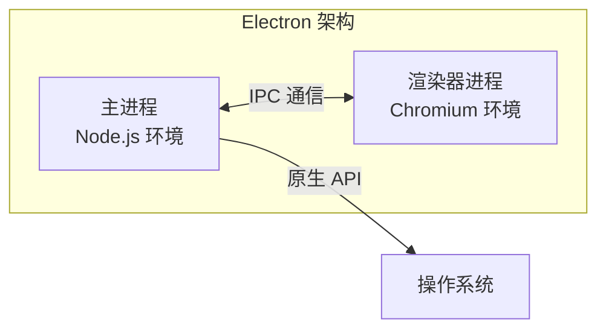
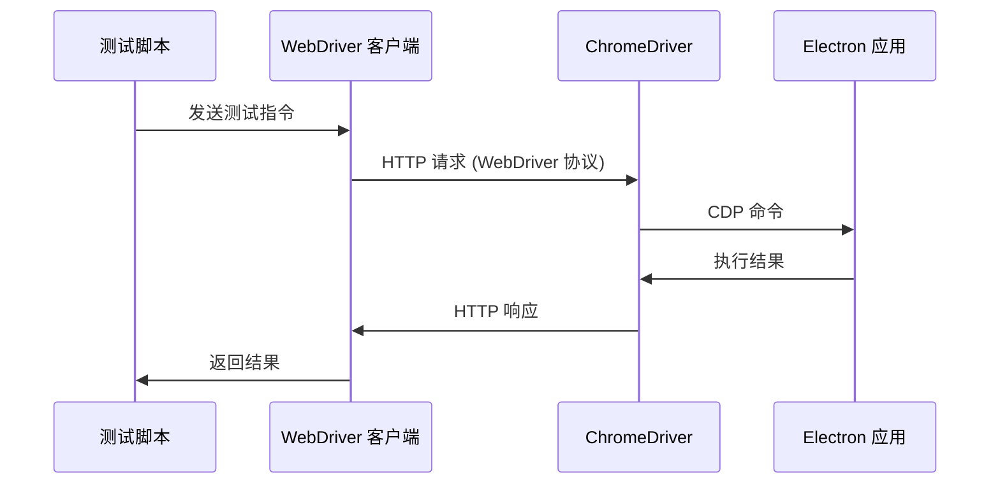
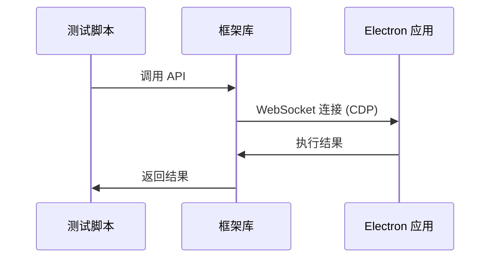
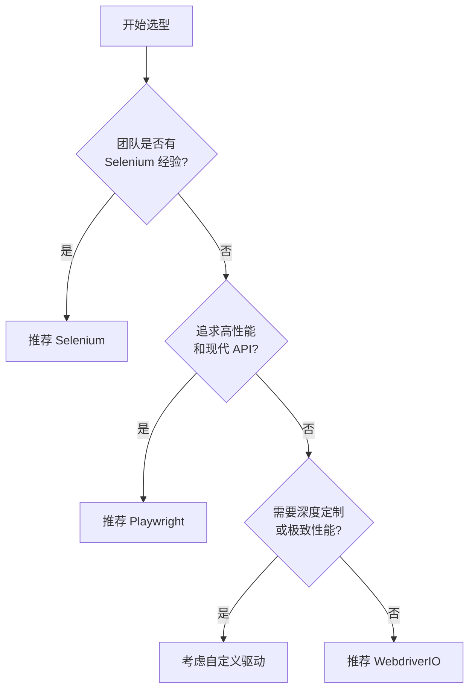
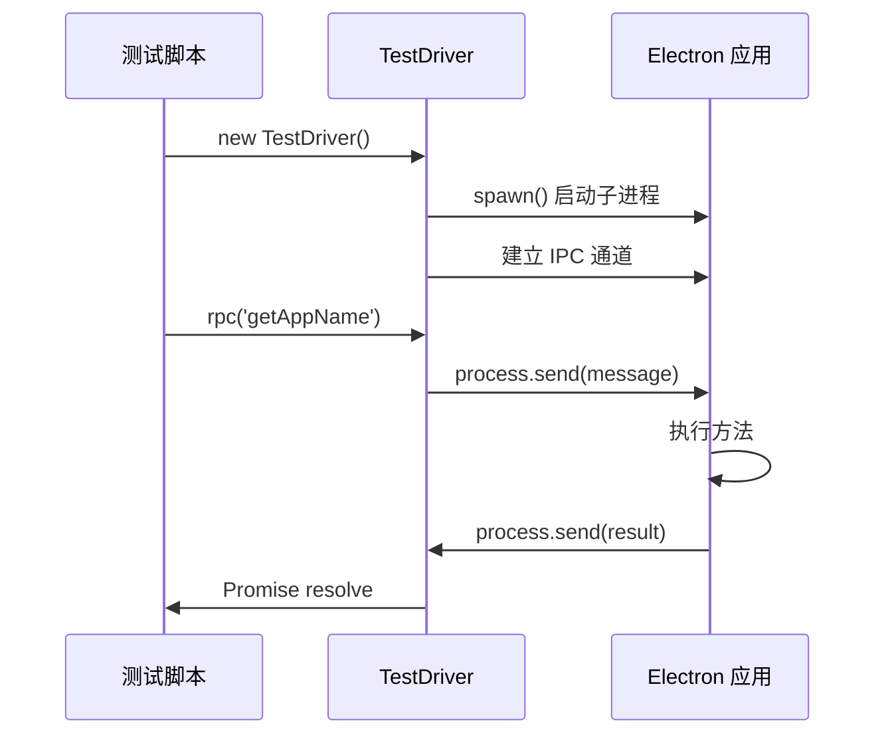
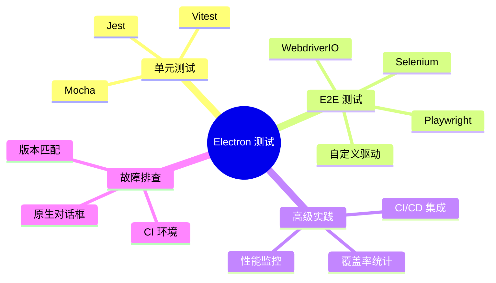

# Electron 应用自动化测试完全指南

## 1. Electron 自动化测试核心概念

### 1.1 为什么需要自动化测试

在软件开发生命周期中，测试是确保产品质量不可或缺的一环。自动化测试利用软件工具和脚本来执行预定义的测试用例、验证程序行为并与预期结果进行比较，整个过程无需人工干预。

对于复杂的 Electron 应用，自动化测试能带来显著价值：

| 优势 | 说明 |
|------|------|
| **提升效率与速度** | 机器执行测试远快于手动操作，尤其是在回归测试阶段，能够快速验证新代码是否破坏了现有功能 |
| **保证质量与一致性** | 自动化脚本严格按照预设步骤执行，消除了人为操作的随意性和遗漏 |
| **加速迭代周期** | 通过将自动化测试集成到 CI/CD 流程中，开发团队可以更频繁地发布新版本 |
| **覆盖更广的场景** | 能够模拟各种复杂的边界条件和异常场景，这些场景往往难以通过手动测试完全覆盖 |

### 1.2 测试金字塔模型

软件测试通常遵循"测试金字塔"模型，它将测试分为不同层次：


#### 单元测试 (Unit Tests)

- **目标**：验证最小的可测试代码单元（如函数、类或组件）的功能是否正确
- **特点**：运行速度快，隔离性强，编写成本低
- **在 Electron 中**：通常使用 Jest、Vitest 等框架，对主进程或渲染器进程中的业务逻辑、工具函数进行测试
- **推荐占比**：约 70% 的测试用例

#### 集成测试 (Integration Tests)

- **目标**：验证多个单元或模块组合在一起时能否协同工作
- **特点**：比单元测试复杂，运行速度稍慢
- **在 Electron 中**：可能涉及主进程与渲染器进程之间的 IPC 通信，或者应用与本地文件系统、数据库的交互
- **推荐占比**：约 20% 的测试用例

#### 端到端测试 (End-to-End, E2E)

- **目标**：从用户角度出发，模拟真实的用户操作流程，验证整个应用程序的功能是否符合预期
- **特点**：最接近真实用户场景，但编写和维护成本最高，运行速度最慢
- **在 Electron 中**：启动完整的 Electron 应用，模拟用户点击按钮、输入文本、导航页面等行为
- **推荐占比**：约 10% 的测试用例

### 1.3 Electron 测试的特殊性

与传统 Web 应用测试相比，Electron 的自动化测试有其独特性：



#### 双进程架构

Electron 应用包含一个主进程（Node.js 环境）和一个或多个渲染器进程（Chromium 环境）。测试框架必须能够同时与这两个进程进行交互。

#### 原生 API 访问

Electron 提供了丰富的原生 API，用于访问操作系统功能：

- 文件对话框 (`dialog`)
- 系统托盘 (`Tray`)
- 应用菜单 (`Menu`)
- 剪贴板 (`clipboard`)
- 通知 (`Notification`)

一个好的测试方案必须能够驱动和验证这些原生 UI 元素。

#### 打包与环境

测试通常需要在打包后的应用上运行，以确保测试环境与最终用户环境的一致性。这意味着测试框架需要能够找到并启动打包后的可执行文件。

### 1.4 核心驱动协议对比

要驱动 Electron 应用（本质上是一个定制版的 Chromium），自动化测试框架通常依赖于两种核心技术：

#### WebDriver 协议



- **定义**：W3C 标准化的远程控制协议，允许程序通过统一的 RESTful API 来驱动浏览器行为
- **优点**：跨浏览器标准，生态成熟，支持多种语言绑定
- **代表框架**：Selenium, WebdriverIO

#### Chrome DevTools Protocol (CDP)



- **定义**：Chrome 开发者工具所使用的通信协议，提供更丰富、更底层的 API
- **优点**：功能更强大，性能更高，可以访问更多调试信息
- **代表框架**：Playwright, Puppeteer

#### 协议对比总结

| 特性 | WebDriver | CDP |
|------|-----------|-----|
| 标准化 | W3C 标准 | Chrome 特定 |
| 性能 | 较低（多一层转换） | 较高（直接通信） |
| 功能覆盖 | 基础自动化 | 全面（含调试功能） |
| 跨浏览器 | 是 | 仅 Chromium 系 |
| 学习曲线 | 平缓 | 较陡 |

---

## 2. 主流测试框架概览与选型

### 2.1 框架对比

| 特性 | WebdriverIO | Selenium | Playwright | 自定义驱动 |
|------|-------------|----------|------------|------------|
| **核心协议** | WebDriver | WebDriver | CDP | Node.js IPC |
| **主要优势** | 功能全面，专为 Electron 优化 | 跨语言，生态成熟 | 性能高，API 现代 | 极致轻量，完全可控 |
| **主要劣势** | 配置相对复杂 | 需手动管理 ChromeDriver | 对 Electron 支持为实验性 | 需自行编写底层代码 |
| **适用场景** | 大规模 Electron 应用 | 团队熟悉 Selenium | 追求高性能的新项目 | 深度定制需求 |
| **社区活跃度** | 高 | 非常高 | 非常高 | 低（依赖自研） |

### 2.2 选型建议



**推荐优先级**：

1. **WebdriverIO**：首选方案，`wdio-electron-service` 插件极大地简化了 Electron 测试配置
2. **Playwright**：现代化选择，API 设计优秀，性能卓越
3. **Selenium**：适合已有 Selenium 经验的团队
4. **自定义驱动**：适合有特殊需求的高级用户

---

## 3. WebdriverIO 方案

### 3.1 简介与优势

[WebdriverIO](https://webdriver.io/) 是基于 Node.js 的下一代测试自动化框架。通过 `wdio-electron-service` 插件，为 Electron 应用测试提供强大且简便的集成方案。

**核心优势**：

- 一站式服务：自动处理 ChromeDriver 的下载和版本匹配
- 深度集成：直接访问 Electron `app`、`dialog`、`mainProcess` 等 API
- 强大的 Mocking 功能：可模拟 Electron 原生 API
- 工程化：内置命令启动器、配置管理、报告生成

### 3.2 环境搭建

#### 步骤 1：初始化项目

```bash
# 使用 npm
npm create wdio@latest ./

# 或使用 yarn
yarn create wdio ./
```

脚手架会引导完成配置选择，完成后生成 `wdio.conf.js` 和 `test/specs` 目录。

#### 步骤 2：安装 Electron 服务插件

```bash
npm install --save-dev wdio-electron-service
```

#### 步骤 3：配置 wdio.conf.js

```javascript
// wdio.conf.js
import { join } from "path"

// 动态计算应用程序路径
const getAppPath = () => {
  const platform = process.platform
  const arch = process.arch
  const appName = "Your-App-Name" // 替换为你的应用名称

  const pathMap = {
    darwin: join(__dirname, "build", `mac-${arch}`, `${appName}.app`, "Contents", "MacOS", appName),
    win32: join(__dirname, "build", "win-unpacked", `${appName}.exe`),
    linux: join(__dirname, "build", "linux-unpacked", appName.toLowerCase())
  }

  const appPath = pathMap[platform]
  if (!appPath) {
    throw new Error(`Unsupported platform: ${platform}`)
  }
  return appPath
}

export const config = {
  // 日志输出目录
  outputDir: "logs",

  // 启用 electron 服务
  services: ["electron"],

  // 测试能力配置
  capabilities: [
    {
      browserName: "electron",
      "wdio:electronServiceOptions": {
        appBinaryPath: getAppPath(),
        appArgs: ["--test-mode"] // 可选：命令行参数
      }
    }
  ],

  // 框架配置
  framework: "mocha",
  reporters: ["spec"],
  mochaOpts: {
    ui: "bdd",
    timeout: 60000
  }
}
```

**配置项说明**：

| 配置项 | 说明 |
|--------|------|
| `services: ['electron']` | 加载 wdio-electron-service |
| `browserName: 'electron'` | 指定测试目标为 Electron 应用 |
| `appBinaryPath` | Electron 应用可执行文件路径（最重要） |
| `appArgs` | 传递给应用的命令行参数 |

### 3.3 编写测试用例

```javascript
// test/specs/app.e2e.js
import { expect } from "@wdio/globals"

describe("Electron 应用测试", () => {
  it("应该正确增加计数器", async () => {
    // 定位输入框并验证初始值
    const input = await $("#counter-input")
    await expect(input).toHaveValue("0")

    // 点击增加按钮
    const incrementBtn = await $("#increment-btn")
    await incrementBtn.click()

    // 验证更新后的值
    await expect(input).toHaveValue("1")
  })

  it("应该能获取应用名称", async () => {
    // 通过 browser.electron API 访问主进程
    const appName = await browser.electron.app("getName")
    expect(appName).toBe("Your-App-Name")
  })
})
```

### 3.4 Mocking Electron API

在测试中模拟不确定或难以控制的模块：

**步骤 1：在应用中注入 Mocking 脚本**

```javascript
// main.js (主进程入口)
if (process.env.NODE_ENV === "test") {
  require("wdio-electron-service/main")
}

// preload.js (预加载脚本)
if (process.env.NODE_ENV === "test") {
  require("wdio-electron-service/preload")
}
```

**步骤 2：在测试中使用 Mock**

```javascript
// test/specs/dialog.e2e.js
import { browser, expect } from "@wdio/globals"

describe("Dialog 测试", () => {
  it("应该能 mock showOpenDialog", async () => {
    const mockResponse = {
      canceled: false,
      filePaths: ["/path/to/mock/file.txt"]
    }

    // Mock dialog.showOpenDialog
    await browser.electron.mock("dialog", "showOpenDialog", mockResponse)

    // 验证 Mock 是否生效
    const result = await browser.electron.dialog("showOpenDialog", {
      properties: ["openFile"]
    })

    expect(result).toEqual(mockResponse)
  })
})
```

### 3.5 最佳实践

| 实践 | 说明 | 示例 |
|------|------|------|
| **使用 data-testid** | 选择器更稳定 | `$('[data-testid="submit-btn"]')` |
| **保持测试独立性** | 每个 `it` 块独立，不依赖其他测试 | 使用 `beforeEach` 重置状态 |
| **合理使用等待** | 对自定义异步操作使用显式等待 | `browser.waitUntil(() => ...)` |
| **配置分离** | 将环境变量提取到单独文件 | 使用 `.env` 文件 |

---

## 4. Selenium 方案

### 4.1 简介与适用场景

[Selenium](https://www.selenium.dev/) 是历史悠久的 Web 浏览器自动化框架，提供 Java、C#、Python、JavaScript 等多语言支持。

**适用场景**：

- 团队已有 Selenium 使用经验
- 需要使用非 JavaScript 语言编写测试
- 复用现有测试基础设施

### 4.2 环境搭建

#### 步骤 1：安装依赖

```bash
# Selenium Node.js 客户端
npm install --save-dev selenium-webdriver

# Electron 适配的 ChromeDriver
npm install --save-dev electron-chromedriver
```

#### 步骤 2：启动 ChromeDriver 服务

```bash
./node_modules/.bin/chromedriver --port=9515
# 输出: Starting ChromeDriver on port 9515
```

### 4.3 解决版本不匹配问题

当遇到 `SessionNotCreatedError: This version of ChromeDriver only supports Chrome version XX` 错误时：

**原因**：`electron-chromedriver` 版本与 Electron 内置 Chromium 版本不兼容

**解决方案**：

1. 查询 Electron 对应的 Chromium 版本：[Electron Releases](https://releases.electronjs.org/releases/stable)

2. 在 `package.json` 中安装与 Electron 版本一致的 `electron-chromedriver`（其版本号与 Electron 版本保持一致）：

```json
{
  "devDependencies": {
    "electron-chromedriver": "26.2.2"
  }
}
```

3. 重新安装：

```bash
npm install
```

### 4.4 编写测试用例

```javascript
// selenium-test/test.js
const { Builder, By, until } = require("selenium-webdriver")
const { join } = require("path")

const getAppPath = () => {
  const appName = "Your-App-Name"
  return join(__dirname, "..", "build", "win-unpacked", `${appName}.exe`)
}

;(async function runTest() {
  let driver

  try {
    driver = await new Builder()
      .usingServer("http://localhost:9515")
      .withCapabilities({
        "goog:chromeOptions": {
          binary: getAppPath()
        }
      })
      .forBrowser("chrome")
      .build()

    // 等待窗口加载并验证标题
    await driver.wait(until.titleIs("Your App Title"), 5000)
    console.log("测试成功：应用标题正确！")

    // 执行其他操作
    const counter = await driver.findElement(By.id("counter-input"))
    console.log(await counter.getAttribute("value"))
  } catch (error) {
    console.error("测试失败:", error)
  } finally {
    if (driver) {
      await driver.quit()
    }
  }
})()
```

**运行测试**：

```bash
node selenium-test/test.js
```

---

## 5. Playwright 方案

### 5.1 简介与优势

[Playwright](https://playwright.dev/) 是微软开发的现代化测试框架，直接使用 CDP 协议与浏览器内核通信。

**核心优势**：

- 性能卓越：减少中间环节，比 WebDriver 方案更快
- API 现代化：简洁强大的异步 API，支持自动等待
- 官方支持：提供对 Electron 的实验性支持
- 功能丰富：内置网络拦截、设备模拟、多窗口处理

### 5.2 环境搭建

```bash
# 跳过默认浏览器下载，直接测试 Electron
PLAYWRIGHT_SKIP_BROWSER_DOWNLOAD=1 npm install --save-dev playwright

# 安装测试运行器
npm install --save-dev @playwright/test
```

### 5.3 编写测试用例

```javascript
// playwright-test/test.spec.js
const { _electron: electron } = require("playwright")
const { test, expect } = require("@playwright/test")
const { join } = require("path")

const mainProcessEntry = join(__dirname, "..", "dist", "electron", "main.js")

test.describe("Playwright Electron 测试", () => {
  let electronApp

  test.beforeAll(async () => {
    electronApp = await electron.launch({ args: [mainProcessEntry] })
  })

  test.afterAll(async () => {
    await electronApp.close()
  })

  test("应用启动后应显示正确的窗口标题", async () => {
    const window = await electronApp.firstWindow()
    await expect(window).toHaveTitle("Your App Title")
  })

  test("与主进程交互，获取应用路径", async () => {
    const appPath = await electronApp.evaluate(async ({ app }) => {
      return app.getAppPath()
    })
    console.log("App Path:", appPath)
    expect(appPath).not.toBeNull()
  })

  test("与渲染器进程交互并截图", async () => {
    const window = await electronApp.firstWindow()

    // 监听 console 事件
    window.on("console", console.log)

    // 操作窗口内容
    await window.locator("#increment-btn").click()
    const inputValue = await window.locator("#counter-input").inputValue()
    expect(inputValue).toBe("1")

    // 截图
    await window.screenshot({ path: "screenshot.png" })
  })
})
```

**运行测试**：

```json
// package.json
{
  "scripts": {
    "test:playwright": "npx playwright test"
  }
}
```

```bash
npm run test:playwright
```

---

## 6. 自定义驱动方案

### 6.1 实现原理

利用 Node.js 内置的 `child_process` 模块编写完全自定义的测试驱动：



### 6.2 驱动实现

#### 步骤 1：编写 TestDriver 类

```javascript
// custom-driver/driver.js
const childProcess = require("child_process")

class TestDriver {
  constructor({ path, args = [], env = {} }) {
    this.rpcCalls = []

    // 注入测试环境变量
    const testEnv = { ...env, APP_TEST_DRIVER: "1" }

    // 启动 Electron 应用并建立 IPC 通道
    this.process = childProcess.spawn(path, args, {
      stdio: ["inherit", "inherit", "inherit", "ipc"],
      env: testEnv
    })

    // 监听 RPC 回复
    this.process.on("message", (message) => {
      const rpcCall = this.rpcCalls[message.msgId]
      if (!rpcCall) return

      this.rpcCalls[message.msgId] = null

      if (message.reject) {
        rpcCall.reject(message.reject)
      } else {
        rpcCall.resolve(message.resolve)
      }
    })

    // 等待应用准备就绪
    this.isReady = this.rpc("isReady").catch((err) => {
      console.error("Application failed to start:", err)
      this.stop()
      process.exit(1)
    })
  }

  /**
   * 发送 RPC 请求
   * @param {string} cmd - 远程方法名称
   * @param  {...any} args - 方法参数
   * @returns {Promise<any>}
   */
  async rpc(cmd, ...args) {
    const msgId = this.rpcCalls.length
    this.process.send({ msgId, cmd, args })

    return new Promise((resolve, reject) => {
      this.rpcCalls.push({ resolve, reject })
    })
  }

  stop() {
    this.process.kill()
  }
}

module.exports = { TestDriver }
```

#### 步骤 2：主进程添加 RPC 处理器

```javascript
// main.js
const { app } = require("electron")

if (process.env.APP_TEST_DRIVER) {
  const METHODS = {
    isReady() {
      return true
    },
    getAppName() {
      return app.getName()
    },
    getVersion() {
      return app.getVersion()
    },
    async getMemoryInfo() {
      return await process.getProcessMemoryInfo()
    },
    getCPUUsage() {
      return process.getCPUUsage()
    }
  }

  process.on("message", async (message) => {
    const { msgId, cmd, args } = message
    const method = METHODS[cmd]

    if (!method) {
      process.send({ msgId, reject: `Invalid method: ${cmd}` })
      return
    }

    try {
      const resolve = await method(...args)
      process.send({ msgId, resolve })
    } catch (err) {
      process.send({ msgId, reject: { message: err.message, stack: err.stack } })
    }
  })
}
```

### 6.3 编写测试用例

```javascript
// custom-driver/app.test.js
const assert = require("assert")
const { TestDriver } = require("./driver")
const { join } = require("path")

const getAppPath = () => {
  return join(__dirname, "..", "build", "win-unpacked", "Your-App-Name.exe")
}

const app = new TestDriver({
  path: getAppPath(),
  args: [],
  env: { NODE_ENV: "test" }
})

describe("自定义驱动测试", function () {
  this.timeout(10000)

  before(async () => {
    await app.isReady
  })

  after(() => {
    app.stop()
  })

  it("应该能获取正确的应用名称", async () => {
    const name = await app.rpc("getAppName")
    assert.strictEqual(name, "Your-App-Name")
  })

  it("应该能获取应用版本", async () => {
    const version = await app.rpc("getVersion")
    assert.ok(/^\d+\.\d+\.\d+$/.test(version))
  })

  it("内存占用应低于 200MB", async () => {
    const memoryInfo = await app.rpc("getMemoryInfo")
    const memoryMB = memoryInfo.private / 1024 // private 单位为 KB，各平台可用
    console.log(`当前内存占用: ${memoryMB.toFixed(2)} MB`)
    assert.ok(memoryMB < 200, `内存占用过高: ${memoryMB}MB`)
  })
})
```

**运行测试**：

```json
// package.json
{
  "scripts": {
    "test:custom": "mocha custom-driver/app.test.js"
  }
}
```

---

## 7. 单元测试

### 7.1 概述

单元测试是测试金字塔的基础，专注于验证最小的可测试代码单元。对于 Electron 应用，主要测试主进程和渲染器进程中的业务逻辑。

### 7.2 测试框架选择

| 框架 | 特点 | 推荐场景 |
|------|------|----------|
| **Jest** | 功能全面，零配置 | 大型项目，需要快照测试 |
| **Vitest** | 极速，Vite 原生支持 | 使用 Vite 构建的项目 |
| **Mocha** | 灵活，生态丰富 | 需要高度定制的项目 |

### 7.3 Jest 配置示例

#### 安装依赖

```bash
npm install --save-dev jest @babel/preset-env @babel/preset-typescript
```

#### 配置文件

```javascript
// jest.config.js
module.exports = {
  testEnvironment: "node",
  roots: ["<rootDir>/src"],
  testMatch: ["**/__tests__/**/*.test.js", "**/*.spec.js"],
  collectCoverageFrom: [
    "src/**/*.js",
    "!src/**/*.test.js",
    "!**/node_modules/**"
  ],
  coverageDirectory: "coverage",
  coverageReporters: ["text", "lcov", "html"],
  moduleNameMapper: {
    "^@/(.*)$": "<rootDir>/src/$1"
  }
}
```

#### 主进程单元测试

```javascript
// src/main/utils/__tests__/fileHelper.test.js
const fs = require("fs")
const path = require("path")
const { readFile, writeFile } = require("../fileHelper")

// Mock fs 模块
jest.mock("fs")

describe("FileHelper", () => {
  beforeEach(() => {
    jest.clearAllMocks()
  })

  describe("readFile", () => {
    it("应该成功读取文件内容", async () => {
      const mockContent = "test content"
      fs.promises.readFile.mockResolvedValue(mockContent)

      const result = await readFile("/path/to/file.txt")

      expect(fs.promises.readFile).toHaveBeenCalledWith("/path/to/file.txt", "utf-8")
      expect(result).toBe(mockContent)
    })

    it("应该在文件不存在时抛出错误", async () => {
      const error = new Error("ENOENT: no such file")
      error.code = "ENOENT"
      fs.promises.readFile.mockRejectedValue(error)

      await expect(readFile("/nonexistent.txt")).rejects.toThrow("文件不存在")
    })
  })

  describe("writeFile", () => {
    it("应该成功写入文件", async () => {
      fs.promises.writeFile.mockResolvedValue(undefined)

      await writeFile("/path/to/file.txt", "content")

      expect(fs.promises.writeFile).toHaveBeenCalledWith(
        "/path/to/file.txt",
        "content",
        "utf-8"
      )
    })
  })
})
```

#### 渲染器进程单元测试

```javascript
// src/renderer/store/__tests__/counter.test.js
import { counterStore } from "../counter"

describe("Counter Store", () => {
  beforeEach(() => {
    counterStore.reset()
  })

  it("应该正确初始化计数器", () => {
    expect(counterStore.count).toBe(0)
  })

  it("应该正确增加计数", () => {
    counterStore.increment()
    expect(counterStore.count).toBe(1)

    counterStore.increment()
    expect(counterStore.count).toBe(2)
  })

  it("应该正确减少计数", () => {
    counterStore.count = 5
    counterStore.decrement()
    expect(counterStore.count).toBe(4)
  })

  it("计数不应低于零", () => {
    counterStore.count = 0
    counterStore.decrement()
    expect(counterStore.count).toBe(0)
  })
})
```

### 7.4 Vitest 配置示例

#### 安装依赖

```bash
npm install --save-dev vitest @vitest/coverage-v8
```

#### 配置文件

```typescript
// vitest.config.ts
import { defineConfig } from "vitest/config"

export default defineConfig({
  test: {
    globals: true,
    environment: "node",
    include: ["src/**/*.{test,spec}.{js,ts}"],
    coverage: {
      provider: "v8",
      reporter: ["text", "json", "html"],
      exclude: ["node_modules/", "src/**/*.test.ts"]
    }
  }
})
```

### 7.5 Mock Electron API

```javascript
// __mocks__/electron.js
module.exports = {
  app: {
    getName: jest.fn(() => "Test App"),
    getVersion: jest.fn(() => "1.0.0"),
    getPath: jest.fn((name) => `/mock/${name}`),
    quit: jest.fn()
  },
  BrowserWindow: jest.fn().mockImplementation(() => ({
    loadURL: jest.fn(),
    loadFile: jest.fn(),
    on: jest.fn(),
    webContents: {
      send: jest.fn(),
      on: jest.fn()
    }
  })),
  ipcMain: {
    on: jest.fn(),
    handle: jest.fn(),
    removeHandler: jest.fn()
  },
  ipcRenderer: {
    send: jest.fn(),
    invoke: jest.fn(),
    on: jest.fn(),
    removeListener: jest.fn()
  },
  dialog: {
    showOpenDialog: jest.fn(),
    showSaveDialog: jest.fn(),
    showMessage: jest.fn()
  }
}
```

### 7.6 运行测试

```json
// package.json
{
  "scripts": {
    "test:unit": "jest",
    "test:unit:watch": "jest --watch",
    "test:unit:coverage": "jest --coverage"
  }
}
```

---

## 8. 高级实践指南

### 8.1 CI/CD 集成

#### 无头环境配置

```javascript
// WebdriverIO 无头配置
capabilities: [{
  browserName: "electron",
  "goog:chromeOptions": {
    args: ["--headless", "--disable-gpu", "--no-sandbox"]
  }
}]
```

#### GitHub Actions 工作流

```yaml
# .github/workflows/test.yml
name: Electron CI

on:
  push:
    branches: [main]
  pull_request:
    branches: [main]

jobs:
  test:
    runs-on: ${{ matrix.os }}
    strategy:
      matrix:
        os: [macos-latest, ubuntu-latest, windows-latest]
        node-version: [18.x, 20.x]

    steps:
      - name: Checkout code
        uses: actions/checkout@v4

      - name: Use Node.js ${{ matrix.node-version }}
        uses: actions/setup-node@v4
        with:
          node-version: ${{ matrix.node-version }}
          cache: "npm"

      - name: Install dependencies
        run: npm ci

      - name: Build application
        run: npm run build

      - name: Run tests on Linux
        if: runner.os == 'Linux'
        run: xvfb-run --auto-servernum --server-args="-screen 0 1280x1024x24" npm test

      - name: Run tests on macOS/Windows
        if: runner.os != 'Linux'
        run: npm test

      - name: Upload test results
        uses: actions/upload-artifact@v4
        if: always()
        with:
          name: test-results-${{ matrix.os }}
          path: |
            test-results/
            screenshots/
            logs/
```

### 8.2 测试覆盖率

#### nyc/istanbul 配置

```json
// .nycrc.json
{
  "all": true,
  "include": ["src/main/**/*.js", "src/renderer/**/*.js"],
  "exclude": ["**/*.spec.js", "**/*.test.js", "**/__tests__/**"],
  "reporter": ["lcov", "text", "html"],
  "sourceMap": true,
  "instrument": true
}
```

#### 运行覆盖率测试

```json
// package.json
{
  "scripts": {
    "test:coverage": "nyc npm test"
  }
}
```

#### 上传到 Codecov

```yaml
- name: Upload coverage to Codecov
  uses: codecov/codecov-action@v4
  with:
    token: ${{ secrets.CODECOV_TOKEN }}
    files: ./coverage/lcov.info
    fail_ci_if_error: true
```

### 8.3 性能监控测试

```javascript
// performance.test.js
const { TestDriver } = require("./driver")

describe("应用性能测试", function () {
  let driver
  this.timeout(30000)

  before(async () => {
    driver = new TestDriver({ path: getAppPath() })
    await driver.isReady
  })

  after(() => driver?.stop())

  it("启动时间应小于 3 秒", async () => {
    const start = Date.now()
    const newDriver = new TestDriver({ path: getAppPath() })
    await newDriver.isReady
    const elapsed = Date.now() - start

    console.log(`启动时间: ${elapsed}ms`)
    expect(elapsed).toBeLessThan(3000)
    newDriver.stop()
  })

  it("空闲时内存占用应低于 150MB", async () => {
    const memoryInfo = await driver.rpc("getMemoryInfo")
    const memoryMB = memoryInfo.private / 1024 // private 单位为 KB，各平台可用

    console.log(`内存占用: ${memoryMB.toFixed(2)} MB`)
    expect(memoryMB).toBeLessThan(150)
  })
})
```

### 8.4 性能优化建议

| 优化方向 | 具体措施 |
|----------|----------|
| 代码拆分 | 使用 Webpack/Vite 代码拆分，按需加载 |
| 主进程优化 | 使用 `utilityProcess` 处理 CPU 密集任务 |
| IPC 优化 | 减少同步 IPC 调用，大数据用文件传输 |
| 前端优化 | 虚拟列表、防抖节流、减少重绘重排 |
| 依赖优化 | 定期审查依赖，移除无用包 |

---

## 9. 常见问题与故障排查

### Q1: ChromeDriver 版本不匹配

**问题**：`SessionNotCreatedError: This version of ChromeDriver only supports Chrome version XX`

**解决方案**：

1. 查询 Electron 对应的 Chromium 版本：[Electron Releases](https://releases.electronjs.org/releases/stable)
2. 使用 `electron-chromedriver` 自动匹配版本
3. 或在 `package.json` 中手动指定版本

### Q2: 本地正常但 CI 失败

**问题**：测试在本地运行正常，但在 CI/CD 环境中失败

**解决方案**：

1. **使用 Xvfb**（Linux 无 GUI 环境）：
   ```bash
   xvfb-run --auto-servernum npm test
   ```

2. **启用无头模式**：
   ```javascript
   args: ["--headless", "--disable-gpu", "--no-sandbox"]
   ```

3. **增加超时时间**：CI 服务器性能可能较低

### Q3: 如何处理原生对话框

**问题**：WebDriver/CDP 无法操作原生文件选择器

**解决方案**：

1. **绕过对话框**：直接设置文件输入元素
   ```javascript
   const fileInput = await $('input[type="file"]')
   await fileInput.setValue("/path/to/file.txt")
   ```

2. **Mock API**：
   ```javascript
   await browser.electron.mock("dialog", "showOpenDialog", {
     canceled: false,
     filePaths: ["/mock/path"]
   })
   ```

### Q4: 如何等待窗口加载完成

**解决方案**：

| 框架 | 方法 |
|------|------|
| Playwright | `await electronApp.firstWindow()` |
| WebdriverIO | 轮询标题或 URL，或实现 `isReady` RPC |
| 自定义驱动 | 在主进程 `did-finish-load` 后响应 `isReady` |

### Q5: 如何调试 CI 中的测试

**解决方案**：

1. **添加详细日志**
2. **启用失败截图和录屏**：
   ```javascript
   // Playwright
   use: {
     screenshot: "only-on-failure",
     video: "retain-on-failure"
   }
   ```
3. **本地 Docker 复现**：使用与 CI 相同的环境

---

## 10. 总结

本文详细探讨了 Electron 自动化测试的完整方案：



**选型建议**：

- **首选 WebdriverIO**：功能最全面，Electron 集成最好
- **追求性能**：选择 Playwright
- **团队经验**：已有 Selenium 经验则继续使用
- **特殊需求**：考虑自定义驱动

通过合理的测试策略，可以显著提升 Electron 应用的质量和开发效率。
