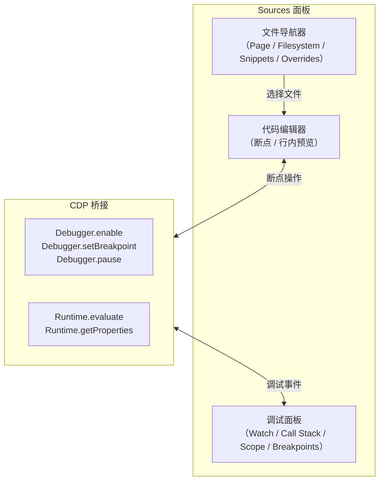
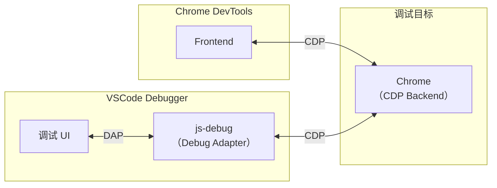

# 用Chrome-DevTools和VSCode-Debugger调试网页JS

本节介绍调试工具的使用，先从网页的 JS 调试开始。

## 创建 React 项目

我们以 React 项目为例。注意，`create-react-app` 已不再推荐使用（已于 2025 年归档），现在推荐使用 Vite 创建 React 项目：

```bash
npm create vite@latest test-react-debug -- --template react
```

进入项目目录，安装依赖并启动开发服务器：

```bash
cd test-react-debug
npm install
npm run dev
```

它会启动一个开发服务，然后浏览器访问 `http://localhost:5173`（Vite 默认端口）：

打开 Chrome DevTools（`F12` 或 `Cmd+Option+I`），在 Sources 面板找到 `src/main.jsx`，打上个断点：

然后刷新就可以开始调试了：

代码会在断点处断住，右边会显示当前 local 作用域的变量，global 作用域的变量，还有调用栈 call stack。

上面有几个控制执行的按钮，分别是：

| 按钮 | 功能 | 快捷键 |
|------|------|--------|
| ▶️ Resume | 恢复执行 | `F8` |
| ⏭ Step Over | 单步执行（不进入函数） | `F10` |
| ⬇️ Step Into | 进入函数调用 | `F11` |
| ⬆️ Step Out | 跳出函数调用 | `Shift+F11` |
| ⏸ Deactivate | 让断点失效 | — |
| ⚠️ Pause on exceptions | 在异常处断住 | — |

**可以控制代码的执行，可以看到每一步的调用栈和作用域的变量，从而简化了代码逻辑梳理和问题排查的流程。**

### Chrome DevTools Sources 面板架构

理解 Sources 面板的工作原理，有助于你更高效地使用它：



Sources 面板通过 CDP 的 `Debugger` 域设置断点和控制执行，通过 `Runtime` 域获取作用域变量和调用栈信息。当你点击"Step Over"时，实际上是发送了 `Debugger.stepOver` 命令；当断点命中时，V8 会触发 `Debugger.paused` 事件，携带调用栈和作用域数据。

## 用 VSCode Debugger 调试网页 JS

实际上调试网页的 JS，除了 Chrome DevTools 外，还有一种更好用的调试方式：VSCode Debugger。

> **重要提示**：VSCode 已内置 JavaScript Debugger（`js-debug`），替代了已废弃的 `Debugger for Chrome` 扩展。你无需安装任何扩展即可使用。

用 VSCode 打开项目目录，创建 `.vscode/launch.json` 文件：

点击右下角的 **Add Configuration...** 按钮，选择 **Chrome: Launch**（注意：虽然显示为 Chrome，但底层使用的是内置的 js-debug）：

把访问的 url 改为开发服务器启动的地址：

```json
{
  "version": "0.2.0",
  "configurations": [
    {
      "type": "chrome",
      "request": "launch",
      "name": "Launch Chrome",
      "url": "http://localhost:5173",
      "webRoot": "${workspaceFolder}"
    }
  ]
}
```

然后进入 Debug 窗口，点击启动：

你会发现它启动了浏览器，并打开了这个 url。

VSCode 里还会有一排控制执行的按钮：

| 按钮 | 功能 | 快捷键 |
|------|------|--------|
| ▶️ Continue | 恢复执行 | `F5` |
| ⏭ Step Over | 单步执行 | `F10` |
| ⬇️ Step Into | 进入函数调用 | `F11` |
| ⬆️ Step Out | 跳出函数调用 | `Shift+F11` |
| 🔄 Restart | 重启调试会话 | `Ctrl+Shift+F5` |
| ⏹ Stop | 停止调试 | `Shift+F5` |

在代码打个断点，然后点击 🔄 刷新：

代码会执行到断点处断住，本地和全局作用域的变量，调用栈等都会展示在左边。

异常断点的按钮被移到了这里：

可以在被 catch 的异常处断住，也可以在没有被 catch 的异常处断住。

### VSCode Debugger 的优势

看起来和 Chrome DevTools 里调试差不多，在 VSCode Debugger 里调试有什么优势？

优势在于不用切换工具，之前是调试在 Chrome DevTools，写代码在 VSCode，而现在写代码和调试都可以在 VSCode 里，可以边调试边写代码。

比如我想访问 `this` 的某个属性，可以在 Debug Console 里输入 `this` 看下它的值，然后再来写代码：

如果你用了 TypeScript 可能会有属性名的提示、属性值类型的提示，但并不知道属性的具体值。

而边调试边写代码，能直接知道属性值是什么，有哪些函数可以调用。

**边调试边写代码是我推荐的写代码方式。**

### VSCode js-debug vs 旧版 Debugger for Chrome

| 特性 | 旧版 Debugger for Chrome | 内置 js-debug |
|------|------------------------|--------------|
| 安装方式 | 需单独安装扩展 | VSCode 内置，无需安装 |
| 调试协议 | 直接 CDP | DAP → CDP |
| Node.js 调试 | 不支持 | 同时支持 Chrome 和 Node.js |
| Sourcemap 支持 | 基础 | 增强（Vite/esbuild 复杂 sourcemap） |
| 自动附加 | 不支持 | 支持（Auto Attach / Debug Terminal） |
| Web Worker 调试 | 不支持 | 支持 |
| 维护状态 | **已废弃** | 活跃维护 |

## 为什么两种工具都能调试网页？

这是因为调试协议是一样的，都是 CDP。Chrome DevTools 可以对接 CDP 来调试网页，VSCode Debugger 也可以。只不过 VSCode Debugger 会多一层 Debug Adapter Protocol 的转换。



这也是为什么两个调试工具的功能大同小异——它们底层对接的是同一个 CDP 协议，只是 UI 层和协议适配层不同。
