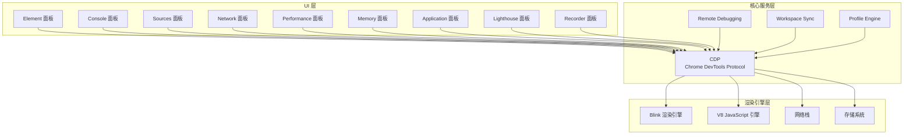
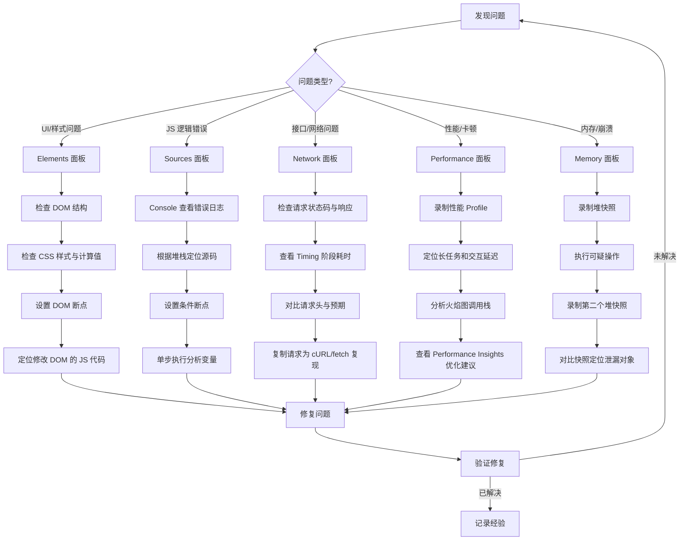

# Chrome-DevTools总览

## 1.1 不只是"F12"——理解 DevTools 的设计哲学

Chrome DevTools 是全球数百万前端开发者的日常伙伴。但你有没有思考过一个问题：**为什么 DevTools 要设计成现在这个样子？**

### 1.1.1 架构全景

DevTools 的架构可以理解为三层：



- **UI 层**：你每天交互的面板，每个面板聚焦一个维度的调试
- **核心服务层**：CDP（Chrome DevTools Protocol）是所有调试能力的底层通信协议。工作区同步、性能分析引擎、远程调试都在这一层
- **渲染引擎层**：DevTools 最终是和 Blink 引擎、V8 引擎对话

> 💡 **专家视角**：理解 CDP 的存在，你就能理解为什么 Puppeteer/Playwright 可以自动化 DevTools 操作——它们本质上是通过 CDP 协议与浏览器通信。

### 1.1.2 面板职责矩阵

| 面板 | 职责 | 核心场景 | 关键能力 |
|------|------|----------|----------|
| **Elements** | DOM + CSS | UI 开发、样式调试 | DOM 断点、CSS 调试、Accessibility |
| **Console** | JS 执行环境 | 快速验证、日志分析 | Utilities API、Live Expressions |
| **Sources** | 代码调试 | Bug 追踪、代码审查 | 断点系统、Workspace、Overrides |
| **Network** | 网络分析 | 接口调试、性能优化 | 请求拦截、Timing 分析、HAR |
| **Performance** | 运行时分析 | 性能优化、帧率分析 | 火焰图、Core Web Vitals、Insights |
| **Memory** | 内存分析 | 内存泄漏排查 | 堆快照对比、Allocation Timeline |
| **Application** | 存储与服务 | PWA 调试、存储管理 | Service Worker、IndexedDB、Cache |
| **Lighthouse** | 质量审计 | SEO、A11y、性能评分 | 自动化审计报告 |
| **Recorder** | 流程录制 | 回归测试、自动化 | 用户操作录制、Puppeteer 导出 |

---

## 1.2 打开 DevTools 的正确姿势

### 1.2.1 六种打开方式

| 方式 | 快捷键/操作 | 适用场景 |
|------|------------|----------|
| 快捷键（默认停靠位置） | `Cmd + Option + I` (Mac) / `F12` (Win) | 最常用 |
| 右键检查 | 页面元素右击 → "检查" | 快速定位元素 |
| 菜单导航 | Chrome 菜单 → 查看 → 开发者 → 开发者工具 | 不记得快捷键时 |
| 切换到开发者工具面板 | `Cmd + Option + J` (Mac) / `Ctrl + Shift + J` (Win) | 直接进入 Console |
| 单独面板模式 | `Cmd + Shift + C` (Mac) | 切换到 Inspect 模式 |
| 命令行启动 | `chrome --auto-open-devtools-for-tabs` | 开发环境自动打开 |

### 1.2.2 停靠位置的艺术

```text
┌──────────────────┐  ┌──────┬──────────┐  ┌──────────────────┐
│    Browser       │  │Browser│ DevTools │  │    Browser       │
│                  │  │      │          │  ├──────────────────┤
│                  │  │      │          │  │    DevTools      │
├──────────────────┤  │      │          │  │                  │
│    DevTools      │  │      │          │  │                  │
│                  │  └──────┴──────────┘  └──────────────────┘
└──────────────────┘  Right (右侧停靠)     Bottom (底部停靠)
 Undocked (独立窗口)
```

**实用建议**：
- **宽屏显示器** → 右侧停靠，充分利用水平空间查看 DOM 树深层嵌套
- **笔记本 / 16:9 显示** → 底部停靠，避免遮挡页面内容
- **多显示器** → 独立窗口（Undocked），DevTools 独占一个屏幕
- **快速切换**：`Cmd + Shift + D` (Mac) / `Ctrl + Shift + D` (Win)

---

## 1.3 通用技巧：十倍速效率的提升

### 1.3.1 面板快速切换

```text
Cmd + [  /  Cmd + ]    → 左右切换面板
Cmd + 1  ~  Cmd + 9    → 数字跳转（需在 Settings > Shortcuts 中启用）
```

> ⚠️ 数字快捷键默认可能被禁用。进入 Settings → Shortcuts，找到 `Enable Ctrl/Cmd + 1-9 shortcuts to switch panels` 并启用。

### 1.3.2 全局搜索的力量

在 DevTools 中打开全局搜索（`Cmd + Option + F` / `Ctrl + Shift + F`），你可以：

- **跨所有加载资源** 搜索字符串或正则表达式
- 搜索结果会列出每个匹配所在的文件和行号
- 支持大小写敏感、正则表达式匹配

这与在各面板中使用 `Cmd + F` 的局部搜索互补：

| 面板 | `Cmd + F` 搜索特性 |
|------|-------------------|
| Elements | 支持 CSS 选择器、XPath、纯文本 |
| Console | 支持正则、大小写敏感 |
| Sources | 支持正则、大小写敏感、跨文件替换 |
| Network | 支持属性过滤（如 `domain:` `status-code:`） |

### 1.3.3 复制与保存技巧

#### `copy()` —— 控制台中的剪贴板

```javascript
// 复制任意可访问的对象
copy($0)              // 复制当前 Elements 中选中的元素
copy($_)              // 复制上一次执行结果
copy(localStorage)    // 复制 localStorage 的全部内容
copy(await (await fetch('/api/data')).json())  // 复制 API 响应
```

`copy()` 是 `console` 之外最实用的工具函数。它会将内容作为字符串复制到系统剪贴板。

#### Store as Global Variable

在 Console 中右键任何输出结果 → 选择 `Store as global variable`，DevTools 会将其存储为 `temp1`、`temp2` 等全局变量。

```javascript
// 假设你在 Console 中执行了一个昂贵计算
$$('.product-item').map(el => ({
    name: el.querySelector('.name').textContent,
    price: parseFloat(el.querySelector('.price').textContent)
}))
// → 返回一个大数组

// 右键结果 → Store as global variable → 变为 temp1
temp1.filter(p => p.price > 100)    // 无需重新计算
temp1.reduce((sum, p) => sum + p.price, 0)
```

#### 堆栈跟踪保存

当遇到错误时，Console 中的堆栈跟踪可以直接右键保存为 `.txt` 文件。这在团队协作中远比发送截图有用——接收者可以直接看到准确的代码位置。

---

## 1.4 Snippets：你的调试工具箱

Snippets 是 DevTools 中最被低估的功能之一。它允许你在浏览器中保存和运行可复用的 JavaScript 代码片段。

### 1.4.1 创建你的第一个 Snippet

1. 打开 Sources 面板
2. 在左侧导航栏找到 `Snippets` 选项卡（可能需要点击 `>>` 展开）
3. 点击 `+ New snippet`，命名并编写代码
4. `Cmd + Enter` 运行

### 1.4.2 实用 Snippet 集合

**检测页面性能指标**：

```javascript
// Performance Metrics —— 获取页面 Core Web Vitals
const observer = new PerformanceObserver((list) => {
  for (const entry of list.getEntries()) {
    console.table({
      name: entry.name,
      value: entry.startTime || entry.value,
      rating: entry.rating || 'N/A'
    })
  }
})
observer.observe({ type: 'largest-contentful-paint', buffered: true })
observer.observe({ type: 'layout-shift', buffered: true })
observer.observe({ type: 'first-input', buffered: true })
```

**可视化页面结构**：

```javascript
// DOM Outline —— 给所有元素加轮廓线，可视化布局结构
$$('*').forEach((el, i) => {
  el.style.outline = `1px solid hsl(${(i * 17) % 360}, 90%, 50%)`
})
```

**提取页面数据**：

```javascript
// Extract Links —— 提取当前页所有外部链接及状态
console.table(
  $$('a[href^="http"]').map(a => ({
    text: a.textContent.trim().slice(0, 50),
    href: a.href,
    isExternal: !a.href.includes(location.hostname)
  }))
)
```

### 1.4.3 通过 Command Menu 快速运行

打开命令菜单（`Cmd + Shift + P`），输入 `!` 前缀，后跟 snippet 名称即可快速运行。例如：`!extract` 即可执行名为 "extract-links" 的 snippet。

---

## 1.5 DevTools 设置优化

### 1.5.1 必改的六项设置

| 设置项 | 位置 | 推荐值 | 原因 |
|--------|------|--------|------|
| Disable cache | Network 面板 | ✅ 开启（开发时） | 避免缓存导致调试困扰 |
| Show user agent shadow DOM | Settings → Elements | ✅ 开启 | 查看 <input> 等组件的 Shadow DOM |
| Color format | Settings → Elements | As authored | 保持 CSS 颜色原始格式 |
| Enable custom formatters | Settings → Console | ✅ 开启 | 支持框架自定义 Formatter |
| Enable network request blocking | Network 面板 → Network request blocking 工具（底部抽屉） | ✅ 开启 | 允许拦截请求进行测试 |
| Theme | Settings → Appearance | 个人偏好 | 深色主题对眼睛更友好 |

### 1.5.2 Experiments：实验性功能

在 DevTools 中打开 `Settings → Experiments`，你会看到大量实验性功能。对高级用户来说，以下功能值得关注：

- **Source order viewer**：查看元素在源代码中的顺序与视觉顺序的差异
- **CSS Overview**：🆕 生成页面 CSS 概览报告，包括颜色统计、字体使用、未使用声明等
- **Protocol Monitor**：实时查看 DevTools 与 Chromium 的 CDP 消息

> ⚠️ Experimental 功能可能不稳定，开启后在日常使用中如遇异常可以关闭相应功能。

---

## 1.6 调试工作流的思维模型

专业的前端调试不是"发现问题 → F12 → 随便看看"。你需要一个系统化的工作流：



这个流程图的精髓在于：**先锁定问题域，再使用对应面板深入**。不要在所有面板间随机切换——这只会浪费时间和增加困惑。

---

## 1.7 参考资料

- [Chrome DevTools 官方文档](https://developer.chrome.com/docs/devtools/)
- [Chrome DevTools Protocol (CDP)](https://chromedevtools.github.io/devtools-protocol/)
- [Chrome DevTools Tips](https://devtoolstips.org/)
