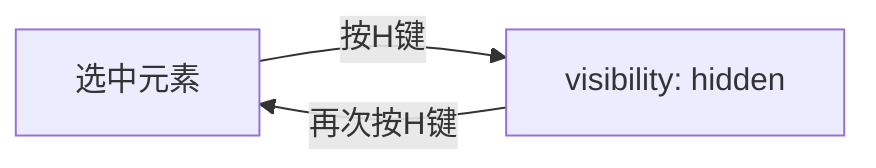
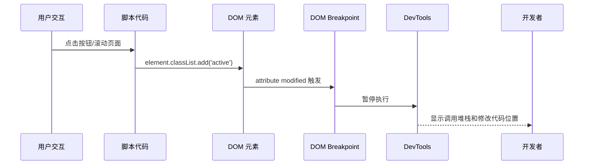
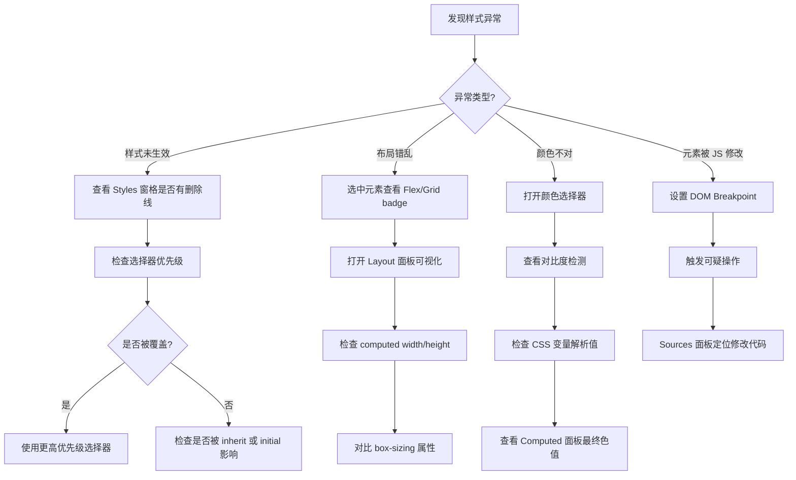

# Chrome-Elements篇

Elements 面板是大多数开发者在 DevTools 中最频繁使用的面板。但大部分人只在"选中元素 → 改改样式 → 看看 Computing 值"这个层面使用它。本节深入那些专业前端才掌握的 Elements 高级技巧。

## 3.1 DOM 操作的高阶技法

### 3.1.1 快速隐藏/显示元素（`h` 键）

在 Elements 面板中选中任意 DOM 节点，按下 **`H`** 键，元素会被添加 `visibility: hidden !important`。再按一次 `H` 键恢复。



> 💡 **实战场景**：
> - 截图时隐藏敏感信息（用户头像、真实姓名等）而不影响布局
> - 快速判断哪个元素导致了溢出问题——逐个隐藏可疑元素观察水平滚动条是否消失

### 3.1.2 拖放与快捷键移动元素

在 DOM 树中，你可以像操作文件管理器一样**拖放**元素来改变其在 DOM 中的位置。对于精细控制：

| 快捷键 | 操作 |
|--------|------|
| `Cmd + ↑` / `Cmd + ↓` | 上移/下移一个位置 |

### 3.1.3 展开与折叠

- **`Expand recursively`**：右键节点 → 选择 Expand recursively → 一次性展开该节点下所有层级。深层嵌套的组件树可以一步展开
- **双击 `<` 或 `>`**：折叠/展开节点上的任意标签名

### 3.1.4 Force State —— 强制元素状态

点击 Elements 面板右上角的 `:hov` 按钮，或在 Styles 窗格中点击 `:hov` 按钮，你可以强制元素保持特定 CSS 伪类状态：

| 伪类 | 应用场景 |
|------|----------|
| `:hover` | 调试 Tooltip、下拉菜单样式，鼠标移开后仍保持 |
| `:active` | 调试按钮按下态样式 |
| `:focus` | 调试输入框焦点样式 |
| `:focus-visible` | 调试键盘焦点指示器 |
| `:visited` | 🆕 调试已访问链接样式 |
| `:target` | 调试锚点跳转目标样式 |

### 3.1.5 🆕 CSS Overview —— 页面 CSS 全局分析

这是一个在 Chrome 85 引入的隐藏功能。通过 Command Menu (`Cmd + Shift + P`) → `Show CSS Overview` 可以打开。

它会生成一份报告，包含：
- **颜色统计**：页面使用的所有颜色及其出现次数
- **字体统计**：使用的字体系列、大小和粗细
- **未使用的声明**：未被任何元素匹配的 CSS 规则
- **Media Query 列表**：所有断点及其触发条件

> 💡 利用 CSS Overview 可以快速发现项目中颜色不一致、字体冗余的问题。对于大型项目的 CSS 重构，这是必用的第一步。

---

## 3.2 DOM 断点：追踪 DOM 变化的利器

DOM 断点是 Elements 面板中最强大的调试功能之一。当页面的 DOM 结构被 JavaScript 意外修改时，它能在**修改发生的那一刻**暂停代码执行，让你精确定位肇事代码。

### 3.2.1 三种断点类型

| 断点类型 | 触发条件 | 典型场景 |
|----------|----------|----------|
| **Subtree modifications** | 该节点的任何后代被添加/删除/修改 | 列表项被意外清空、内容被替换 |
| **Attribute modifications** | 该节点属性（class、style 等）被修改 | class 被错误切换、style 被覆盖 |
| **Node removal** | 该节点自身被移除 | 组件被卸载、弹窗消失 |

### 3.2.2 设置方式

1. 在 Elements 面板中右键目标元素
2. 选择 `Break on` → 选择断点类型
3. 断点设置后，所有 DOM 断点会出现在 **Elements 面板的 DOM Breakpoints 侧栏**和 **Sources 面板的 DOM Breakpoints 区域**

### 3.2.3 实战：追踪"幽灵"样式修改



场景：你的导航栏高亮样式 `active` 在某些操作后莫名其妙消失了。

**排查步骤**：

1. 在 Elements 面板找到导航元素
2. 右键 → `Break on` → `attribute modifications`
3. 触发可疑操作
4. 代码在修改 class 的代码行暂停
5. Sources 面板显示完整调用堆栈 → 定位到是哪个函数清除了 class

---

## 3.3 样式调试：从入门到精通

### 3.3.1 Styles 窗格速查指南

在 Styles 窗格中看到的每一条规则都包含大量信息：

- **行内样式** (`element.style`) — 最高优先级，直接在此编辑
- **级联规则** — 按优先级从高到低排列
- **被覆盖的样式** — 显示为 ~~删除线~~
- **继承的样式** — 以 `Inherited from xxx` 标记
- **用户代理样式** — 浅灰色，显示浏览器默认样式
- **计算值** — Commuted 标签页显示最终生效的值

### 3.3.2 🆕 颜色选择器进阶

颜色选择器远不止选颜色：

**对比度检查**：
点击任意颜色值旁边的色块打开颜色选择器。展开 `Contrast` 栏：

- **AAA 级** – 对比度 ≥ 7:1（最佳可读性）
- **AA 级** – 对比度 ≥ 4.5:1（基本可读性）
- 在色板上会显示两条曲线，标示达到 AA 和 AAA 的颜色范围

**调色板切换**：
- Material Design 色板
- 自定义色板
- **当前页面颜色** — 自动收集页面 CSS 中所有使用的颜色
- **CSS 变量** — 列出所有颜色相关的 CSS 自定义属性

### 3.3.3 可视化编辑器

#### 阴影编辑器

点击 `box-shadow` 或 `text-shadow` 值旁边的小方块图标，可以通过拖拽滑块调整：
- X/Y 偏移
- 模糊半径
- 扩展半径
- 颜色和不透明度

#### 贝塞尔曲线编辑器

点击 `transition-timing-function` 或 `animation-timing-function` 的值，打开贝塞尔曲线编辑器。拖动控制点实时预览动画节奏。

#### 🆕 缓动函数选择器

Chrome 130+ 中，除自定义贝塞尔曲线外，还可以选择预设缓动函数：`ease-in`、`ease-out`、`ease-in-out`、`linear`，每个都有可视化预览。

### 3.3.4 CSS 数值的微调

选中任意 CSS 数值（`px`、`em`、`rem`、`%`、`deg` 等），使用键盘：

| 按键 | 变化量 | 用途 |
|------|--------|------|
| `↑` / `↓` | ±1 | 精细调整 |
| `Shift + ↑` / `Shift + ↓` | ±10 | 快速跳跃 |
| `Alt + ↑` / `Alt + ↓` (Mac: `Option`) | ±0.1 | 微调透明度等小数值 |

### 3.3.5 🆕 CSS Nesting 样式调试

CSS Nesting 在 Chrome 120+ 中得到原生支持。在 DevTools 的 Styles 窗格中：

```css
.card {
  background: white;

  & .title { color: #333; }
  & .body { line-height: 1.6; }
}
```

嵌套规则会以内联方式显示，DevTools 会准确展示每条嵌套规则的来源文件和行号。

### 3.3.6 🆕 Container Query 样式调试

Chrome 105+ 支持 Container Queries。当元素的样式受容器查询影响时，DevTools 会：

- 在 Styles 窗格中显示 `@container` 规则
- 在 Computed 面板显示当前容器的状态
- 支持容器查询的 `hover` 和 `resize` 状态切换

---

## 3.4 🆕 元素级 Badges

DevTools 在 Chrome 120+ 中引入了**元素级 Badges**，在 Elements 面板的 DOM 树中直接显示关键信息：

| Badge | 含义 |
|-------|------|
| `flex` | 该元素是 Flex 容器 |
| `grid` | 该元素是 Grid 容器 |
| `scroll-snap` | 该元素是 Scroll Snap 容器（设置了 `scroll-snap-type`） |
| `container` | 该元素是 Container Query 容器 |
| `slot` | 该元素是 Web Component `<slot>` |

点击 `flex` 或 `grid` badge，Elements 面板会自动打开 **Layout** 子面板，展示该元素的布局特征。

---

## 3.5 Accessibility（可访问性）面板

点击 Elements 面板中的 Accessibility 子面板（可能在 `>>` 中），你可以查看选中元素的：

- **ARIA Tree** — 无障碍树结构
- **Computed Properties** — 计算后的无障碍属性（name、role、status）
- **Contrast Ratio** — 文本颜色与背景颜色的对比度

> 💡 使用 `Cmd + Shift + P` → `Show Accessibility` 可以快速打开无障碍性检查。

---

## 3.6 Layout 调试：Flex 和 Grid 的可视化

### 3.6.1 Layout 面板

打开 Elements → Layout 子面板，你可以：

- **Flexbox 可视化**：点击 `flex` badge 或选中 flex 容器 → 显示 flex 轴线、间距、对齐方式
- **Grid 可视化**：显示网格线、区域名称、单元格编号
- **Grid 编辑器**：直接拖拽调整 grid-template 属性

### 3.6.2 🆕 布局偏移区域 (Layout Shift Regions)

在 Rendering 工具（Drawer 中或通过 Command Menu `Show Rendering`）中勾选 `Layout Shift Regions`，页面上的布局偏移会被蓝色高亮标记。

结合 Performance 面板的 CLS 分析，可以精确定位导致布局不稳定的元素。

---

## 3.7 实战：样式调试工作流



---

## 3.8 参考资料

- [Chrome DevTools Elements Panel](https://developer.chrome.com/docs/devtools/dom/)
- [CSS Features Reference in DevTools](https://developer.chrome.com/docs/devtools/css/)